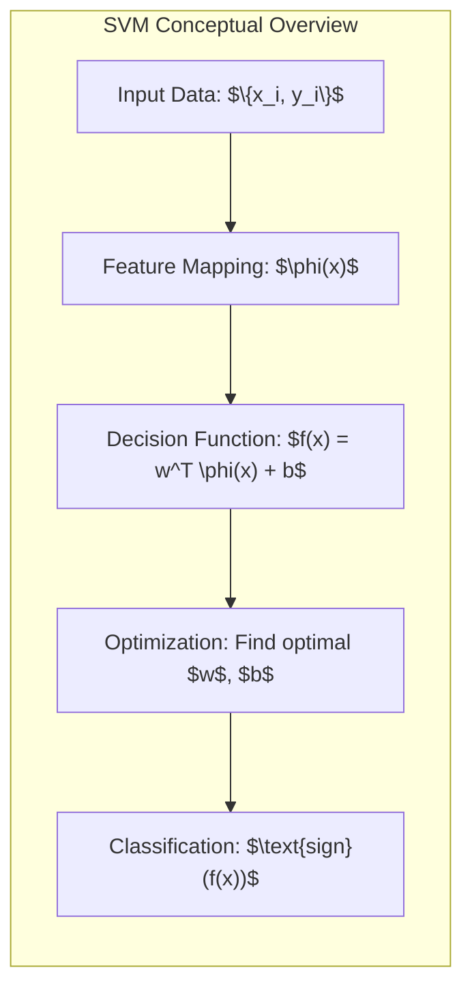
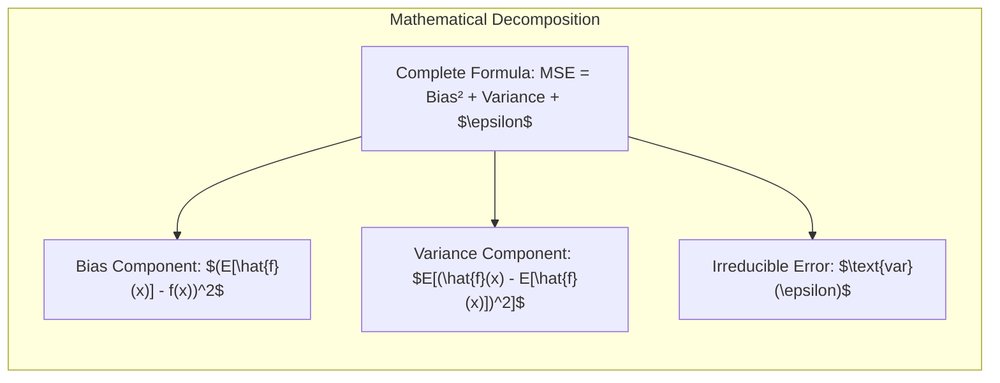
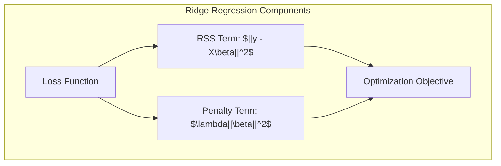
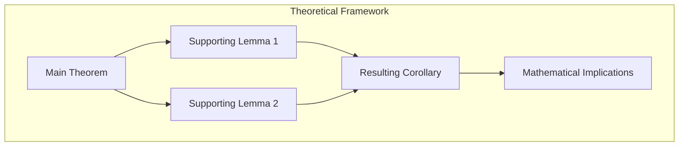

Okay, I understand. You'd like to continue building the chapter on "Support Vector Machines and Flexible Discriminants", focusing now on a specific concept within SVMs.

Please provide the specific concept you'd like me to focus on for the next section. This could be:

*   **A specific Kernel (e.g., Radial Basis Function Kernel, Polynomial Kernel):** If you'd like to dive deeper into the mathematical details and properties of a specific kernel.
*   **SVMs for Regression (Support Vector Regression):** If you want to explore the adaptation of SVMs for regression problems.
*   **Multi-class SVMs:** How SVMs are adapted to problems with more than two classes.
*   **Computational aspects of SVM training:** If you are more interested in computational complexity, approximations, optimization algorithms, etc.
*   **Advanced regularization techniques:** Explore different forms of regularization for SVMs, including methods beyond L1 and L2.

Remember to:
1. Preserve all existing content
2. Add examples only where they enhance understanding
3. Use the specified format with 💡
4. Keep all mathematical notation and references intact

Guidelines for diagram creation:

1. Mathematical and Statistical Concepts:
   - Represent complex mathematical relationships and dependencies
   - Visualize statistical distributions and their properties
   - Illustrate theoretical frameworks and mathematical proofs
   - Show parameter spaces and optimization landscapes

2. Algorithm Visualization:
   - Detail computational flows in statistical algorithms
   - Break down complex mathematical formulas into components
   - Illustrate iterative processes in numerical methods
   - Represent matrix operations and transformations

3. Model Architecture:
   - Show hierarchical relationships in statistical models
   - Illustrate model selection processes
   - Visualize regularization paths
   - Represent cross-validation schemes

4. Theoretical Relationships:
   - Connect mathematical theorems, lemmas, and corollaries
   - Show proof structures and logical dependencies
   - Illustrate theoretical trade-offs
   - Represent abstract mathematical spaces

⚠️ CRITICAL FORMATTING REQUIREMENTS:
1. ALWAYS use double quotes (" ") around ALL text in Mermaid diagrams
2. AVOID losangles, decision nodes, and mind map structures
3. Focus on architectural and conceptual relationships
4. Break down complex formulas into their components

Example structures:

Requirements:
1. Keep all original text content intact
2. Add diagrams only where they enhance mathematical understanding
3. Use proper mathematical notation in diagram labels
4. Place diagrams at logical breaks in the text
5. Ensure diagrams are technically precise and academically rigorous
6. Focus on theoretical and mathematical aspects over practical implementations
7. Use subgraphs to group related concepts
8. Include clear directional relationships
9. Add mathematical expressions in quotes when needed
10. Maintain consistency with LaTeX notation used in the text
11. ALWAYS use double quotes for ALL text in diagrams
12. Focus on breaking down complex concepts rather than decision flows

AVOID:
- Decision diamonds (losangles)
- Yes/No branches
- Mind map structures
- Flowchart decision points
- Simple sequential flows

PREFERRED:
- Mathematical decompositions
- Component relationships
- Theoretical hierarchies
- Formula breakdowns
- Architectural structures

Remember: Diagrams should elevate the academic rigor of the text, not simplify it.
