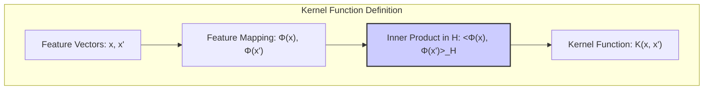
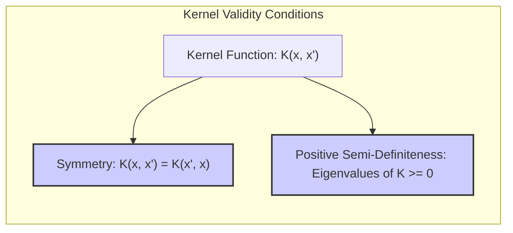
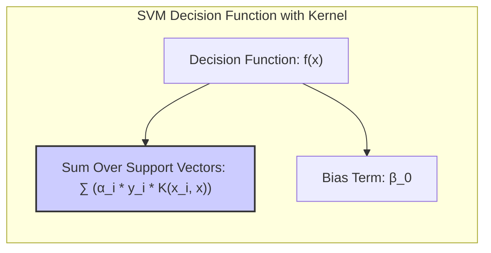
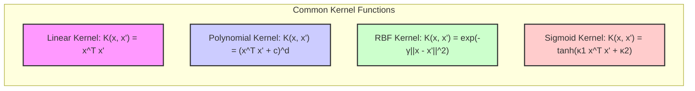

Okay, let's add some practical numerical examples to the text to enhance understanding of the concepts.

## Título: Kernels em SVMs: Definição, Propriedades e o "Kernel Trick"

```mermaid
graph LR
    subgraph "Kernel Transformation"
        direction LR
        A["Input Space (x)"] --> B["Feature Map (Φ)"]
        B --> C["High-Dimensional Feature Space (Φ(x))"]
        D["Kernel Function (K(x, x'))"]
    end
    C --> D
    style A fill:#f9f,stroke:#333,stroke-width:2px
    style C fill:#ccf,stroke:#333,stroke-width:2px
    style D fill:#cfc,stroke:#333,stroke-width:2px
    linkStyle 0,2 stroke:#f00,stroke-width:2px,color:#f00;
```

### Introdução

No desenvolvimento das **Support Vector Machines (SVMs)**, o conceito de **kernel** é fundamental para a sua capacidade de modelar relações não lineares entre os dados. Os *kernels* permitem que as SVMs operem em espaços de *features* de alta dimensão, potencialmente infinitos, sem a necessidade de calcular explicitamente a transformação dos dados para esse espaço. Este capítulo explora em detalhe a definição de um *kernel*, suas propriedades matemáticas e como o “*kernel trick*” possibilita a construção de modelos SVM complexos de forma eficiente [^12.3].

A utilização de *kernels* é uma das principais inovações das SVMs, pois permite que o método seja aplicado em problemas que não são linearmente separáveis no espaço original de *features*. A escolha do *kernel* adequado é crucial para o desempenho do modelo e deve ser feita considerando a natureza dos dados e as relações que se deseja capturar. A compreensão do funcionamento dos *kernels* e de suas propriedades é essencial para o domínio do uso avançado de SVMs.

### Definição Matemática de um Kernel

**Conceito 1: A Função Kernel**

Uma função **kernel** $K(x, x')$ é uma função que mapeia um par de vetores de *features* $x$ e $x'$ para um escalar, que representa o produto interno entre as transformações desses vetores em um espaço de *features* (denotado por $\mathcal{H}$) de maior dimensão:

$$ K(x, x') = \langle \phi(x), \phi(x') \rangle_{\mathcal{H}} $$

onde $\phi(x)$ e $\phi(x')$ são as transformações de $x$ e $x'$, respectivamente, e $\langle \cdot, \cdot \rangle_{\mathcal{H}}$ representa o produto interno no espaço $\mathcal{H}$. A principal característica de uma função *kernel* é que ela calcula esse produto interno sem a necessidade de calcular explicitamente a transformação $\phi(x)$.



A transformação $\phi(x)$ pode ser para um espaço de dimensão muito alta, ou mesmo infinita, e o cálculo explícito dessa transformação pode ser computacionalmente inviável. O *kernel trick* permite que a SVM opere em espaços de alta dimensão através do cálculo da função kernel $K(x, x')$ em vez da transformação $\phi(x)$.

> 💡 **Exemplo Numérico:**
>
> Vamos considerar dois vetores de *features* 2D: $x = [1, 2]$ e $x' = [2, 1]$. Suponha que a transformação $\phi(x)$ mapeia os vetores para um espaço 3D da seguinte forma: $\phi(x) = [x_1^2, \sqrt{2}x_1x_2, x_2^2]$. Assim, $\phi(x) = [1^2, \sqrt{2} \cdot 1 \cdot 2, 2^2] = [1, 2\sqrt{2}, 4]$ e $\phi(x') = [2^2, \sqrt{2} \cdot 2 \cdot 1, 1^2] = [4, 2\sqrt{2}, 1]$.
>
> O produto interno no espaço transformado $\mathcal{H}$ seria:
>
> $\langle \phi(x), \phi(x') \rangle_{\mathcal{H}} = (1 \cdot 4) + (2\sqrt{2} \cdot 2\sqrt{2}) + (4 \cdot 1) = 4 + 8 + 4 = 16$
>
> Agora, se usarmos um *kernel* polinomial de grau 2, $K(x, x') = (x^T x')^2$, temos:
>
> $x^T x' = (1 \cdot 2) + (2 \cdot 1) = 2 + 2 = 4$
>
> $K(x, x') = (4)^2 = 16$
>
> Observe que o resultado do *kernel* é igual ao produto interno no espaço transformado, sem a necessidade de calcular explicitamente $\phi(x)$. Este é o poder do *kernel trick*.

**Lemma 1:** A função *kernel* calcula o produto interno entre dois vetores de *features* transformados, sem a necessidade de calcular explicitamente a transformação, permitindo que as SVMs operem em espaços de alta dimensão de forma eficiente.

A demonstração desse lemma se baseia na própria definição da função *kernel* e na sua propriedade de representar o produto interno em um espaço de *features* transformado. A demonstração formal de que existe uma transformação $\phi(x)$ que satisfaz essa propriedade é dada pelo Teorema de Mercer.

**Conceito 2: Propriedades de um Kernel Válido**

Nem toda função $K(x, x')$ é um *kernel* válido. Para que uma função seja considerada um *kernel* válido, ela deve satisfazer as seguintes propriedades:

1.  **Simetria:**
    $$ K(x, x') = K(x', x) $$
2.  **Semidefinida Positiva:** Para qualquer conjunto finito de pontos $\{x_1, x_2, ..., x_N\}$ a matriz $K$, definida por $K_{ij} = K(x_i, x_j)$, deve ser semidefinida positiva, o que significa que todos os seus autovalores são não negativos.



Essas propriedades garantem que a função *kernel* corresponda a um produto interno em algum espaço de *features*, que pode ser de alta ou mesmo infinita dimensão. O Teorema de Mercer fornece uma base teórica para a validação de um *kernel*, garantindo que se a função é simétrica e semidefinida positiva, então ela corresponde a um produto interno em um espaço de Hilbert (que pode ter dimensão infinita).

> 💡 **Exemplo Numérico:**
>
> Vamos verificar a simetria e a propriedade semidefinida positiva para o *kernel* linear $K(x, x') = x^T x'$.
>
> **Simetria:** Dados dois vetores $x = [1, 2]$ e $x' = [3, 4]$, temos:
>
> $K(x, x') = (1 \cdot 3) + (2 \cdot 4) = 3 + 8 = 11$
>
> $K(x', x) = (3 \cdot 1) + (4 \cdot 2) = 3 + 8 = 11$
>
> Portanto, $K(x, x') = K(x', x)$, o *kernel* linear é simétrico.
>
> **Semidefinida Positiva:** Para verificar essa propriedade, vamos usar três vetores: $x_1 = [1, 0]$, $x_2 = [0, 1]$, e $x_3 = [1, 1]$. A matriz de *kernel* $K$ será:
>
> $K_{11} = K(x_1, x_1) = [1, 0]^T [1, 0] = 1$
> $K_{12} = K(x_1, x_2) = [1, 0]^T [0, 1] = 0$
> $K_{13} = K(x_1, x_3) = [1, 0]^T [1, 1] = 1$
> $K_{21} = K(x_2, x_1) = 0$
> $K_{22} = K(x_2, x_2) = 1$
> $K_{23} = K(x_2, x_3) = 1$
> $K_{31} = K(x_3, x_1) = 1$
> $K_{32} = K(x_3, x_2) = 1$
> $K_{33} = K(x_3, x_3) = 2$
>
> $K = \begin{bmatrix} 1 & 0 & 1 \\ 0 & 1 & 1 \\ 1 & 1 & 2 \end{bmatrix}$
>
> Para verificar se essa matriz é semidefinida positiva, precisamos verificar seus autovalores. Usando uma biblioteca computacional (como NumPy), os autovalores são aproximadamente 0, 1 e 3. Como todos os autovalores são não negativos, a matriz K é semidefinida positiva e, portanto, o *kernel* linear é válido.

**Corolário 1:** A simetria e a propriedade de semidefinida positiva são condições necessárias e suficientes para que uma função seja considerada um *kernel* válido e corresponda a um produto interno em algum espaço de *features*.

A demonstração desse corolário se baseia no Teorema de Mercer, que estabelece que uma função é um *kernel* válido se e somente se ela é simétrica e semidefinida positiva.

### O "Kernel Trick" e a Não Linearidade

```mermaid
graph LR
    subgraph "Kernel Trick"
        direction LR
        A["Original Feature Space: x_i^T x_j"] --> B["Kernel Function: K(x_i, x_j)"]
        B --> C["High-Dimensional Feature Space (Implicit)"]
    end
    style A fill:#f9f,stroke:#333,stroke-width:2px
    style B fill:#ccf,stroke:#333,stroke-width:2px
    style C fill:#ccf,stroke:#333,stroke-width:2px
    linkStyle 0 stroke:#f00,stroke-width:2px,color:#f00;
```

O “**kernel trick**” é a chave para a capacidade das SVMs de lidar com a não linearidade. Ele consiste em substituir o produto interno entre dois vetores de *features* $x_i^T x_j$ na formulação do problema dual da SVM pela função *kernel* $K(x_i, x_j)$:

$$ L_D(\alpha) = \sum_{i=1}^{N} \alpha_i - \frac{1}{2} \sum_{i=1}^{N} \sum_{j=1}^{N} \alpha_i \alpha_j y_i y_j K(x_i, x_j) $$

Essa substituição permite que a SVM opere em um espaço de *features* transformado, sem a necessidade de calcular explicitamente essa transformação. A função de decisão da SVM também é modificada para utilizar a função *kernel*:

$$ f(x) = \sum_{i \in SV} \alpha_i y_i K(x_i, x) + \beta_0 $$

onde SV é o conjunto dos vetores de suporte.



O *kernel trick* torna o cálculo da função de decisão computacionalmente eficiente, mesmo em espaços de *features* de dimensão muito alta, pois a complexidade do cálculo depende apenas do número de vetores de suporte, e não da dimensão do espaço de *features* transformado.

> 💡 **Exemplo Numérico:**
>
> Suponha que temos 3 vetores de suporte $x_1, x_2, x_3$ com rótulos $y_1 = 1, y_2 = -1, y_3 = 1$ e os multiplicadores de Lagrange $\alpha_1 = 0.5, \alpha_2 = 0.8, \alpha_3 = 0.3$. Vamos usar o *kernel* RBF com $\gamma = 0.5$. Queremos calcular a função de decisão $f(x)$ para um novo ponto $x = [2, 2]$.
>
> Primeiro, calculamos os valores do *kernel* entre o novo ponto $x$ e os vetores de suporte:
>
> $K(x_1, x) = \exp(-0.5 ||[1, 1] - [2, 2]||^2) = \exp(-0.5 \cdot (1+1)) = \exp(-1) \approx 0.368$
> $K(x_2, x) = \exp(-0.5 ||[0, 0] - [2, 2]||^2) = \exp(-0.5 \cdot (4+4)) = \exp(-4) \approx 0.018$
> $K(x_3, x) = \exp(-0.5 ||[1, 2] - [2, 2]||^2) = \exp(-0.5 \cdot (1+0)) = \exp(-0.5) \approx 0.607$
>
> Então, a função de decisão, assumindo $\beta_0 = 0$, seria:
>
> $f(x) = (0.5 \cdot 1 \cdot 0.368) + (0.8 \cdot -1 \cdot 0.018) + (0.3 \cdot 1 \cdot 0.607) = 0.184 - 0.0144 + 0.1821 \approx 0.352$
>
> Se $f(x) > 0$, classificamos $x$ como da classe 1, caso contrário, da classe -1. Neste caso, $x$ seria classificado como classe 1.

**Lemma 2:** O *kernel trick* permite que as SVMs operem em espaços de *features* de alta dimensão, através da substituição do produto interno pela função *kernel*, sem explicitamente calcular a transformação dos dados.

A demonstração desse lemma se baseia na análise da formulação do problema dual e na substituição do produto interno pela função *kernel*, mostrando que a transformação para o espaço de *features* é implícita, o que evita o problema computacional de calcular essa transformação.

### Exemplos de Funções Kernel Comuns



Existem diversas funções *kernel* que podem ser utilizadas em SVMs, cada uma com suas propriedades e capacidades. Alguns dos *kernels* mais comuns incluem:

1.  **Kernel Linear:**
    $$ K(x, x') = x^T x' $$
    O *kernel* linear corresponde ao produto interno entre os vetores de *features* no espaço original, e é utilizado em problemas de classificação linear.
2.  **Kernel Polinomial:**
    $$ K(x, x') = (x^T x' + c)^d $$
    onde $c$ é uma constante e $d$ é o grau do polinômio. O *kernel* polinomial mapeia os dados para um espaço de *features* de maior dimensão, incluindo todos os produtos de ordem até $d$.
3.  **Kernel Radial Basis Function (RBF) ou Gaussiano:**
    $$ K(x, x') = \exp(-\gamma ||x - x'||^2) $$
    onde $\gamma > 0$ é um parâmetro que controla a largura da função gaussiana. O *kernel* RBF mapeia os dados para um espaço de dimensão infinita e pode modelar fronteiras de decisão complexas.
4.  **Kernel Sigmóide:**
    $$ K(x, x') = \tanh(\kappa_1 x^T x' + \kappa_2) $$
    onde $\kappa_1$ e $\kappa_2$ são parâmetros que controlam a forma da função sigmóide. O *kernel* sigmóide pode gerar funções não lineares, mas nem sempre satisfaz a condição de ser um *kernel* válido.

> 💡 **Exemplo Numérico:**
>
> Vamos comparar o resultado de alguns *kernels* com dois pontos $x = [1, 2]$ e $x' = [2, 1]$.
>
> *   **Kernel Linear:** $K(x, x') = (1 \cdot 2) + (2 \cdot 1) = 4$
> *   **Kernel Polinomial (c=1, d=2):** $K(x, x') = ((1 \cdot 2) + (2 \cdot 1) + 1)^2 = (4+1)^2 = 25$
> *   **Kernel RBF (γ=0.5):** $K(x, x') = \exp(-0.5 ||[1, 2] - [2, 1]||^2) = \exp(-0.5 \cdot (1+1)) = \exp(-1) \approx 0.368$
>
> Observe como cada *kernel* gera valores diferentes, refletindo a forma como eles medem a similaridade entre os pontos e como eles mapeiam os dados em diferentes espaços.
>
> Vamos agora analisar o efeito do parâmetro $\gamma$ no kernel RBF. Se $\gamma$ for aumentado, a função gaussiana se torna mais estreita, o que significa que apenas pontos muito próximos terão um valor de *kernel* alto. Se $\gamma$ for pequeno, a função gaussiana se torna mais larga e pontos mais distantes terão uma influência maior. Por exemplo:
>
> *   **Kernel RBF (γ=2):** $K(x, x') = \exp(-2 ||[1, 2] - [2, 1]||^2) = \exp(-2 \cdot 2) = \exp(-4) \approx 0.018$
>
> Note como o valor do *kernel* diminuiu consideravelmente comparado com $\gamma = 0.5$. Isso significa que a influência de $x'$ sobre $x$ é menor quando $\gamma$ é maior, o que resulta em fronteiras de decisão mais locais.

A escolha do *kernel* adequado depende das características dos dados, do problema de classificação e da complexidade da fronteira de decisão que se deseja construir.

**Corolário 2:** A escolha do *kernel* determina o espaço de *features* transformado e a forma da fronteira de decisão, e a escolha adequada do *kernel* depende do problema específico.

A demonstração desse corolário se baseia na análise das propriedades de cada tipo de *kernel* e como eles mapeiam os dados para espaços de diferentes dimensões e estruturas. A escolha do *kernel* e seus hiperparâmetros é uma decisão importante que impacta a performance do modelo.

### Conclusão

Neste capítulo, exploramos em detalhe a definição matemática de um **kernel**, suas propriedades e como o "**kernel trick**" permite que as **Support Vector Machines (SVMs)** operem em espaços de *features* de alta dimensão, construindo fronteiras de decisão não lineares. Vimos como a função *kernel* calcula o produto interno entre os dados transformados, sem a necessidade de explicitar a transformação, e como isso possibilita lidar com dados não linearmente separáveis de forma eficiente.

Apresentamos alguns dos *kernels* mais comuns (linear, polinomial, RBF e sigmóide) e discutimos como a escolha do *kernel* adequado é crucial para a capacidade do modelo de se adaptar aos dados. A compreensão dos conceitos e propriedades dos *kernels* é fundamental para a utilização avançada das SVMs, e para a construção de modelos robustos e com boa capacidade de generalização. A escolha do kernel, assim como a escolha do parâmetro C e outros hiperparâmetros, é um passo crucial para a aplicação bem-sucedida de SVMs.

### Footnotes

[^12.1]: "In this chapter we describe generalizations of linear decision boundaries for classification. Optimal separating hyperplanes are introduced in Chapter 4 for the case when two classes are linearly separable. Here we cover extensions to the nonseparable case, where the classes overlap. These techniques are then generalized to what is known as the support vector machine, which produces nonlinear boundaries by constructing a linear boundary in a large, transformed version of the feature space." *(Trecho de  "Support Vector Machines and Flexible Discriminants")*

[^12.2]: "In Chapter 4 we discussed a technique for constructing an optimal separating hyperplane between two perfectly separated classes. We review this and generalize to the nonseparable case, where the classes may not be separable by a linear boundary." *(Trecho de  "Support Vector Machines and Flexible Discriminants")*

[^12.3]: "The support vector machine classifier is an extension of this idea, where the dimension of the enlarged space is allowed to get very large, infinite in some cases. It might seem that the computations would become prohibitive. It would also seem that with sufficient basis functions, the data would be separable, and overfitting would occur. We first show how the SVM technology deals with these issues. We then see that in fact the SVM classifier is solving a function-fitting problem using a particular criterion and form of regularization, and is part of a much bigger class of problems that includes the smoothing splines of Chapter 5." *(Trecho de  "Support Vector Machines and Flexible Discriminants")*
