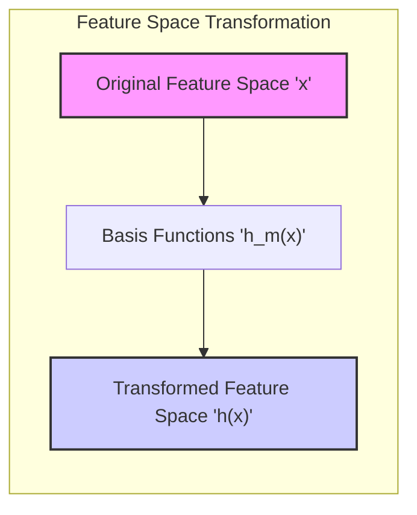
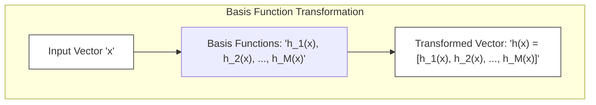
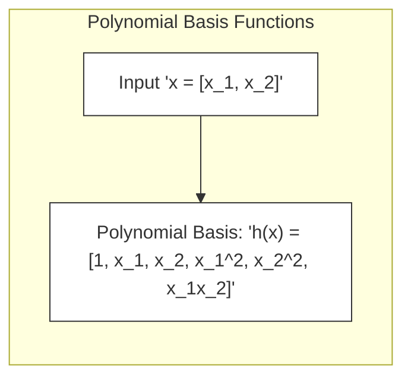
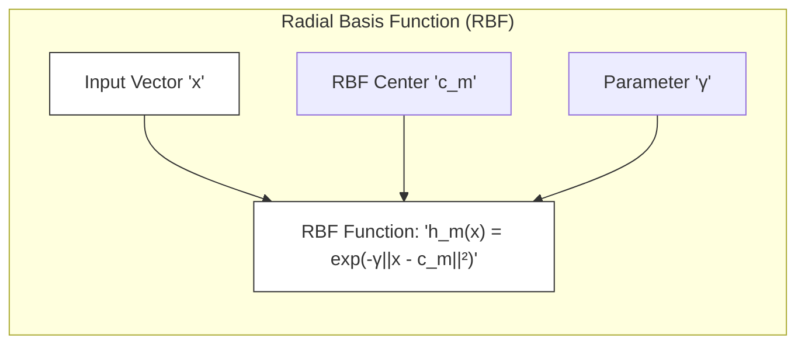
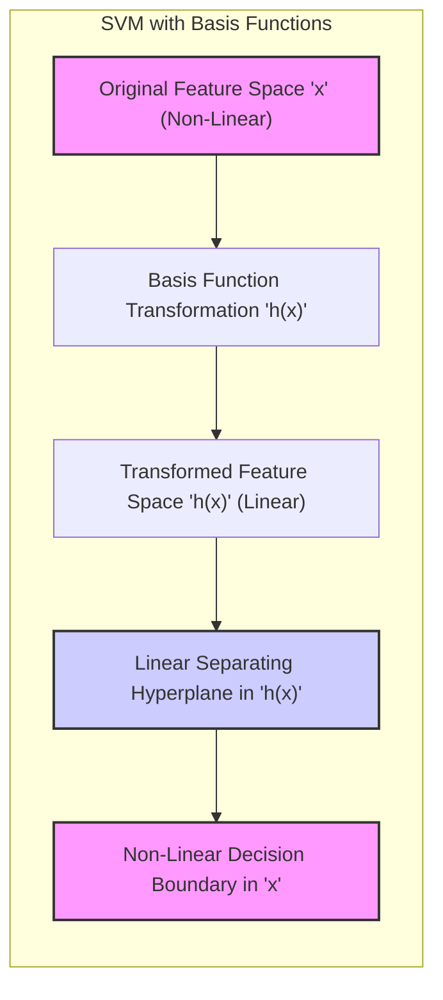
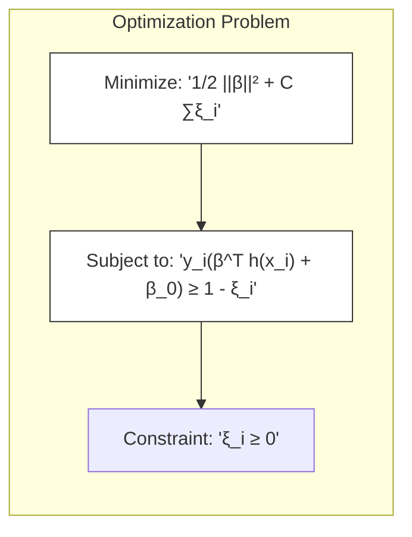
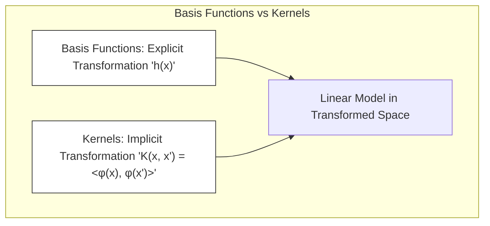

Okay, here's the enhanced text with Mermaid diagrams as requested:

## Título: SVMs e Funções de Base: Expandindo o Espaço de Features para Modelagem Não Linear

### Introdução

Em muitos problemas de classificação e regressão, as relações entre as *features* e as variáveis de resposta são não lineares. Para lidar com essa não linearidade, os modelos de aprendizado de máquina podem utilizar **funções de base** para transformar o espaço de *features* original em um espaço de maior dimensão, onde essas relações podem ser modeladas de forma mais eficiente. As **Support Vector Machines (SVMs)** também podem se beneficiar do uso de funções de base, e essa abordagem fornece uma perspectiva complementar sobre a utilização de *kernels*.

Neste capítulo, exploraremos como as funções de base são utilizadas para estender o espaço de *features* das SVMs, e como essa transformação se relaciona com a utilização dos *kernels*. Discutiremos a definição das funções de base, como elas são aplicadas aos dados de entrada, e como elas influenciam a forma da fronteira de decisão ou da função de regressão. Além disso, analisaremos como a escolha das funções de base e seus parâmetros impactam a capacidade de generalização do modelo e o seu desempenho em dados novos.

### Funções de Base: Definição e Transformação do Espaço de Features

**Conceito 1: Definição de Funções de Base**

As **funções de base** são funções matemáticas, denotadas por $h_m(x)$, que transformam os vetores de *features* $x$ em um espaço de maior dimensão, onde a modelagem pode ser feita de forma mais simples e eficiente. As funções de base são um conjunto de funções predefinidas, e a transformação do espaço de *features* é realizada através da aplicação dessas funções a cada amostra.

Formalmente, se temos $M$ funções de base $h_1(x), h_2(x), ..., h_M(x)$, cada amostra $x$ no espaço original de *features* é transformada em um vetor de *features* $\textbf{h}(x)$ no novo espaço, onde $\textbf{h}(x) = [h_1(x), h_2(x), \ldots, h_M(x)]$. Este vetor $\textbf{h}(x)$ representa a amostra no novo espaço de *features* transformado.

A escolha das funções de base é crucial para o desempenho do modelo, e deve ser feita considerando a natureza dos dados e as relações não lineares que se deseja capturar. As funções de base podem ser polinomiais, radiais, trigonométricas, splines ou outras funções que gerem um espaço onde as classes ou a resposta de regressão sejam representáveis.

> 💡 **Exemplo Numérico:**
>
> Suponha que temos uma amostra $x = [2, 3]$ no espaço de *features* original. Vamos aplicar duas funções de base:
>
> 1.  $h_1(x) = x_1^2$
> 2.  $h_2(x) = x_1 * x_2$
>
> A transformação para o novo espaço de *features* seria:
>
> $\textbf{h}(x) = [h_1(x), h_2(x)] = [2^2, 2 * 3] = [4, 6]$
>
> Assim, a amostra $x = [2, 3]$ no espaço original é mapeada para $\textbf{h}(x) = [4, 6]$ no novo espaço. Este novo espaço, de dimensão 2, permite criar modelos lineares que correspondem a modelos não lineares no espaço original.

**Lemma 1:** As funções de base transformam os dados de entrada para um espaço de *features* de maior dimensão, onde relações não lineares podem ser modeladas de forma mais eficiente.

A demonstração desse lemma se baseia na análise da definição das funções de base, que são projetadas para transformar as *features* originais em um conjunto de *features* mais adequado para a modelagem. A transformação permite construir modelos mais flexíveis e capazes de capturar padrões complexos nos dados.

**Conceito 2: Tipos Comuns de Funções de Base**

Existem diversas funções de base que podem ser utilizadas, dependendo do tipo de modelo e da natureza dos dados:

1.  **Funções de Base Polinomial:**
    As funções de base polinomial incluem termos como $x_i$, $x_i^2$, $x_i x_j$, $x_i^3$, etc., onde $x_i$ e $x_j$ são as *features* originais. As funções de base polinomial são utilizadas para modelar relações não lineares em forma de polinômios.

    > 💡 **Exemplo Numérico:**
    >
    > Para uma amostra $x = [x_1, x_2]$, as funções de base polinomiais de grau 2 poderiam ser:
    >
    > $h_1(x) = 1$ (bias term)
    > $h_2(x) = x_1$
    > $h_3(x) = x_2$
    > $h_4(x) = x_1^2$
    > $h_5(x) = x_2^2$
    > $h_6(x) = x_1 x_2$
    >
    > Se $x = [2, 3]$, então $\textbf{h}(x) = [1, 2, 3, 4, 9, 6]$. O espaço de *features* foi expandido de 2 dimensões para 6.

2.  **Funções de Base Radial (RBF):**
    As funções de base radial são funções gaussianas centradas em pontos específicos, e têm a forma:
    $$ h_m(x) = \exp(-\gamma ||x - c_m||^2) $$
    onde $c_m$ é o centro da função radial e $\gamma$ controla sua largura. As funções de base radial são utilizadas para modelar relações não lineares com comportamento localizado.

    > 💡 **Exemplo Numérico:**
    >
    > Vamos usar uma função RBF com centro $c_1 = [1, 1]$ e $\gamma = 0.5$. Para a amostra $x = [2, 2]$:
    >
    > $h_1(x) = \exp(-0.5 * ||[2, 2] - [1, 1]||^2)$
    > $h_1(x) = \exp(-0.5 * ( (2-1)^2 + (2-1)^2 ) )$
    > $h_1(x) = \exp(-0.5 * (1 + 1)) = \exp(-1) \approx 0.368$
    >
    > Se adicionarmos outro RBF com centro $c_2 = [3, 3]$, então teríamos outra feature $h_2(x)$ e o vetor $\textbf{h}(x)$ teria duas dimensões.

3.  **Funções de Base Spline:**
    As funções de base spline são funções polinomiais segmentadas, que são definidas por partes. Elas são utilizadas para modelar relações não lineares suaves e flexíveis, e são especialmente úteis em problemas de regressão.

4.  **Outras Funções de Base:**
    Existem outras funções de base que podem ser utilizadas dependendo do problema em questão, como funções trigonométricas, funções lineares por partes, funções de *wavelet*, etc.

**Corolário 1:** A escolha do tipo de funções de base depende do problema em questão, e a combinação de diferentes funções de base pode ser utilizada para modelar relações não lineares complexas.

A demonstração desse corolário se baseia na análise das propriedades de diferentes tipos de funções de base, e como essas propriedades se relacionam com a natureza dos dados e com os objetivos do modelo. A combinação de funções de base de diferentes tipos permite modelar relacionamentos mais complexos.

### SVMs e Funções de Base: Uma Perspectiva Linear no Espaço Transformado

Ao utilizar funções de base, o objetivo das SVMs passa a ser encontrar um **hiperplano separador linear** no espaço de *features* transformado, onde o vetor de *features* de entrada é agora $\textbf{h}(x)$, que corresponde a um modelo não linear no espaço original das *features*. A função de decisão do modelo no espaço de *features* transformado é dada por:

$$ f(x) = \beta^T \textbf{h}(x) + \beta_0 $$

onde $\beta$ é o vetor normal ao hiperplano no espaço de *features* transformado, $\beta_0$ é o *bias*, e $\textbf{h}(x)$ é o vetor de *features* transformado. Essa função de decisão é linear no espaço de *features* transformado, mas não linear no espaço de *features* original.

A utilização de funções de base nas SVMs permite construir modelos não lineares de forma similar ao uso de *kernels*, onde é encontrado um separador linear em um espaço transformado. No entanto, ao contrário dos kernels, que podem ser vistos como funções implícitas de um produto interno em um espaço transformado (sem explicitar a transformação), as funções de base especificam explicitamente uma transformação para um determinado espaço.

The optimization problem for an SVM with basis functions can be formulated as:

$$ \min_{\beta, \beta_0, \xi} \frac{1}{2} ||\beta||^2 + C \sum_{i=1}^{N} \xi_i $$

sujeito a:

$$ y_i(\beta^T \textbf{h}(x_i) + \beta_0) \geq 1 - \xi_i, \quad \forall i $$
$$ \xi_i \geq 0, \quad \forall i $$

O processo de otimização é similar ao caso de SVMs sem funções de base, mas agora o hiperplano é definido no espaço de *features* transformado.

> 💡 **Exemplo Numérico:**
>
> Suponha que temos duas classes de pontos no espaço original 2D que não são linearmente separáveis. Após aplicar funções de base polinomiais de grau 2 como mostrado no exemplo anterior, temos um novo espaço de 6 dimensões. O SVM agora busca um hiperplano linear nesse espaço de 6 dimensões.
>
> Seja $\textbf{h}(x) = [1, x_1, x_2, x_1^2, x_2^2, x_1 x_2]$. O problema de otimização da SVM agora se torna:
>
> $$ \min_{\beta, \beta_0, \xi} \frac{1}{2} ||\beta||^2 + C \sum_{i=1}^{N} \xi_i $$
>
> sujeito a:
>
> $$ y_i(\beta_0 + \beta_1 + \beta_2 x_{i1} + \beta_3 x_{i2} + \beta_4 x_{i1}^2 + \beta_5 x_{i2}^2 + \beta_6 x_{i1}x_{i2}) \geq 1 - \xi_i, \quad \forall i $$
> $$ \xi_i \geq 0, \quad \forall i $$
>
> Onde $\beta = [\beta_1, \beta_2, \beta_3, \beta_4, \beta_5, \beta_6]$ e o vetor $\beta$ define o hiperplano nesse espaço transformado. A função de decisão no espaço transformado, que é linear, corresponde a uma fronteira de decisão não linear no espaço original de duas dimensões.

**Lemma 3:** A utilização de funções de base permite que as SVMs construam modelos não lineares no espaço original das *features*, através da construção de um hiperplano separador linear no espaço de *features* transformado.

A demonstração desse lemma se baseia na análise da função de decisão da SVM com funções de base, onde a linearidade é obtida no espaço transformado, mas se traduz em não linearidade no espaço original.

### A Conexão com Kernels: Uma Visão Alternativa

A utilização de **kernels** em SVMs pode ser vista como uma forma de utilizar funções de base de forma implícita. O *kernel trick*, discutido em capítulos anteriores, permite que as SVMs operem em espaços de *features* transformados, sem explicitar a transformação através da função $\phi(x)$.

Em vez de definir explicitamente as funções de base $h_m(x)$ e construir o espaço de *features* transformado $\textbf{h}(x)$, o *kernel* calcula o produto interno entre os dados transformados sem explicitar essa transformação:

$$ K(x, x') = \langle \phi(x), \phi(x') \rangle $$

A conexão entre *kernels* e funções de base se torna mais clara quando analisamos a função de decisão da SVM:

$$ f(x) = \sum_{i \in SV} \alpha_i y_i K(x_i, x) + \beta_0 $$

Essa equação pode ser vista como uma combinação linear de funções de base, onde cada função de base é definida implicitamente pelo *kernel* e um vetor de suporte. No caso de um *kernel* linear, a transformação se reduz a identidade e o espaço de *features* é igual ao espaço original.

O uso de *kernels* oferece uma forma mais flexível e poderosa de lidar com a não linearidade, pois não é necessário explicitar a forma das funções de base, e o espaço de *features* transformado pode ter dimensão muito alta ou até mesmo infinita.

> 💡 **Exemplo Numérico:**
>
> Considere o kernel polinomial de grau 2: $K(x, x') = (x^T x' + 1)^2$.  Este kernel implicitamente realiza uma transformação para um espaço de *features* de maior dimensão. Por exemplo, em um espaço 2D, ele mapeia os dados para um espaço com termos até grau 2, similar às funções de base polinomiais.
>
>  Se $x = [2, 3]$ e $x' = [1, 2]$, então:
>
>  $K(x, x') = ( [2, 3]^T [1, 2] + 1)^2 = (2*1 + 3*2 + 1)^2 = (2 + 6 + 1)^2 = 9^2 = 81$
>
>  O kernel polinomial calcula o produto interno no espaço transformado sem precisar explicitar essa transformação, o que é mais eficiente computacionalmente.

**Corolário 3:** A utilização de *kernels* pode ser vista como uma forma de utilizar funções de base implicitamente, o que permite trabalhar em espaços de *features* de alta dimensão e construir fronteiras de decisão complexas de forma eficiente.

A demonstração desse corolário se baseia na análise da função de decisão da SVM com *kernels* e como essa função pode ser vista como uma combinação linear de funções de base implícitas. A dualidade de Wolfe é fundamental para a obtenção desse resultado, pois ela demonstra que o modelo SVM pode ser expresso em termos de produtos internos, o que possibilita a utilização de *kernels*.

### Conclusão

Neste capítulo, exploramos a relação entre as **SVMs** e as **funções de base**, e como ambas as abordagens permitem lidar com a não linearidade em problemas de classificação e regressão. Vimos como as funções de base transformam os dados de entrada para um espaço de *features* de maior dimensão, onde um modelo linear pode ser utilizado para modelar relações não lineares no espaço original.

Analisamos a definição das funções de base, seus tipos mais comuns e como a escolha das funções de base afeta a capacidade de generalização do modelo. Vimos que as SVMs com funções de base constroem fronteiras de decisão não lineares através da aplicação de funções de base, e que a escolha dessas funções afeta a complexidade e a capacidade do modelo de modelar relações complexas entre as *features*.

Exploramos também como a utilização de *kernels* pode ser vista como uma forma de utilizar funções de base de forma implícita, oferecendo uma abordagem mais flexível e computacionalmente eficiente para trabalhar em espaços de *features* de alta dimensão. A compreensão da relação entre SVMs, funções de base e *kernels* fornece uma base sólida para o estudo avançado desse poderoso método de aprendizado de máquina.

### Footnotes

[^12.1]: "In this chapter we describe generalizations of linear decision boundaries for classification. Optimal separating hyperplanes are introduced in Chapter 4 for the case when two classes are linearly separable. Here we cover extensions to the nonseparable case, where the classes overlap. These techniques are then generalized to what is known as the support vector machine, which produces nonlinear boundaries by constructing a linear boundary in a large, transformed version of the feature space." *(Trecho de  "Support Vector Machines and Flexible Discriminants")*

[^12.2]: "In Chapter 4 we discussed a technique for constructing an optimal separating hyperplane between two perfectly separated classes. We review this and generalize to the nonseparable case, where the classes may not be separable by a linear boundary." *(Trecho de  "Support Vector Machines and Flexible Discriminants")*

[^12.3]: "The support vector machine classifier is an extension of this idea, where the dimension of the enlarged space is allowed to get very large, infinite in some cases. It might seem that the computations would become prohibitive. It would also seem that with sufficient basis functions, the data would be separable, and overfitting would occur. We first show how the SVM technology deals with these issues. We then see that in fact the SVM classifier is solving a function-fitting problem using a particular criterion and form of regularization, and is part of a much bigger class of problems that includes the smoothing splines of Chapter 5." *(Trecho de  "Support Vector Machines and Flexible Discriminants")*
