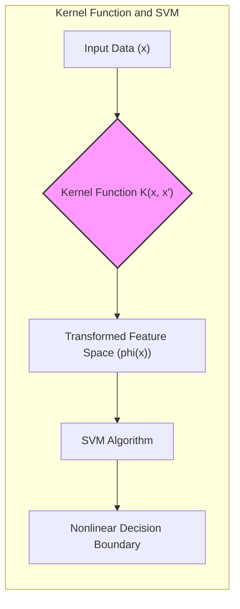
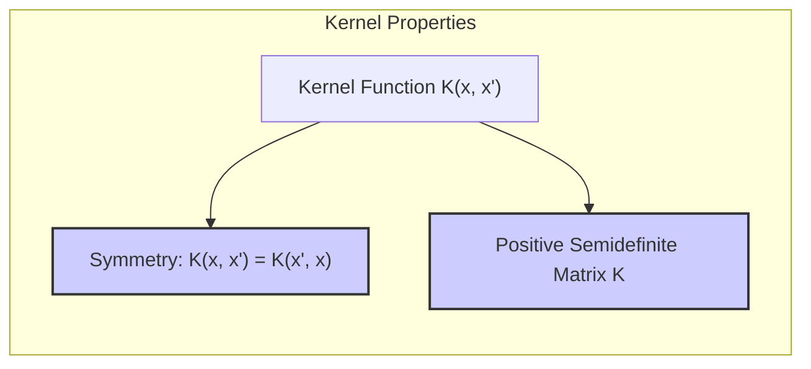
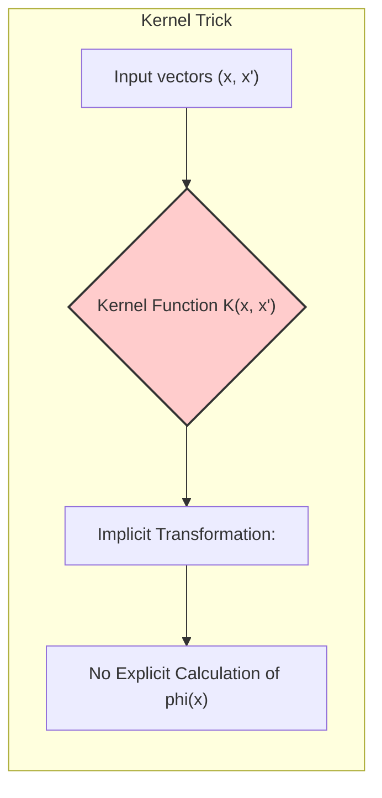
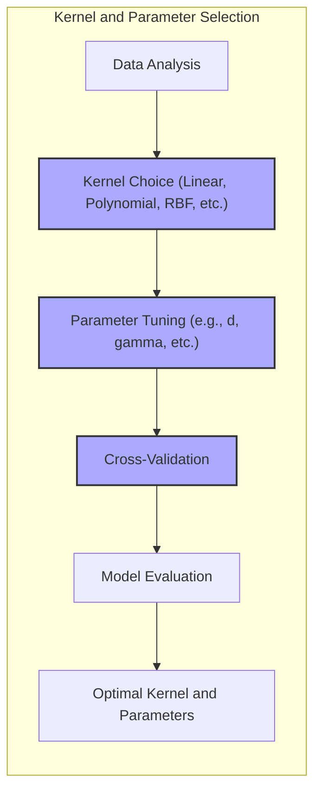
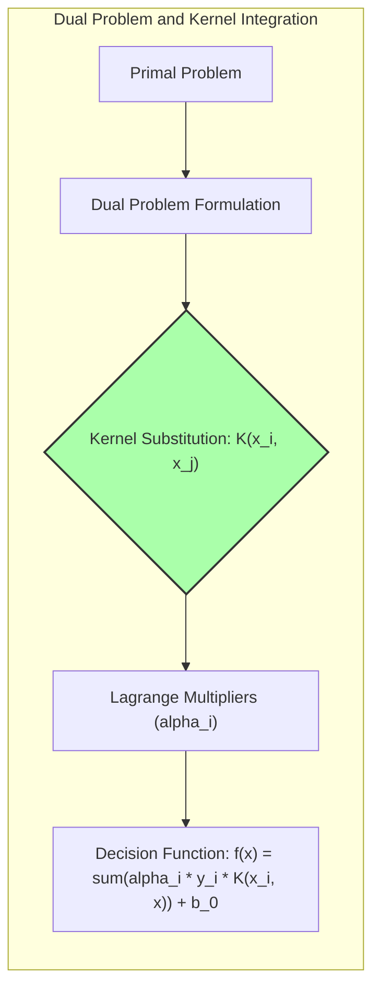

Okay, here's the text with all mathematical expressions formatted using LaTeX notation:

## Título: Funções Kernel em SVMs: Propriedades, Tipos e Aplicações



### Introdução

No estudo das **Support Vector Machines (SVMs)**, as **funções kernel** são elementos fundamentais que possibilitam a construção de modelos não lineares sem a necessidade de calcular explicitamente a transformação dos dados para um espaço de alta dimensão. A escolha da função *kernel* adequada é crucial para o desempenho do modelo, e a compreensão de suas propriedades e de como elas afetam a modelagem dos dados é essencial para a aplicação prática das SVMs.

Neste capítulo, exploraremos em profundidade as funções *kernel*, analisando suas propriedades, os tipos mais comuns de *kernels* utilizados em SVMs e como cada tipo de *kernel* influencia a complexidade da fronteira de decisão e a capacidade de generalização do modelo. Analisaremos também como a escolha dos parâmetros de cada *kernel* afeta a sua capacidade de modelar diferentes padrões nos dados. A compreensão das funções kernel, juntamente com a escolha apropriada dos parâmetros e da regularização, é crucial para a aplicação bem sucedida de SVMs em uma variedade de problemas práticos.

### Propriedades Fundamentais das Funções Kernel

**Conceito 1: Simetria e Positividade Semidefinida**

Como discutido em capítulos anteriores, para que uma função $K(x, x')$ seja considerada um **kernel válido**, ela deve satisfazer duas propriedades fundamentais:

1.  **Simetria:** A função *kernel* deve ser simétrica, ou seja, deve satisfazer a propriedade:
    $$ K(x, x') = K(x', x) $$
    Essa propriedade garante que a ordem dos vetores de *features* não afete o resultado do cálculo do *kernel*.

> 💡 **Exemplo Numérico:**
>
>   Suponha que temos dois vetores de *features*, $x = [1, 2]$ e $x' = [3, 4]$.  Se usarmos um *kernel* linear, $K(x, x') = x^T x'$, então:
>
>   $K(x, x') = [1, 2] \cdot [3, 4] = (1*3) + (2*4) = 3 + 8 = 11$
>
>   $K(x', x) = [3, 4] \cdot [1, 2] = (3*1) + (4*2) = 3 + 8 = 11$
>
>   Como $K(x, x') = K(x', x) = 11$, a propriedade de simetria é confirmada.

2.  **Positividade Semidefinida:** A matriz *kernel* $K$, definida por $K_{ij} = K(x_i, x_j)$, deve ser semidefinida positiva. Isso significa que para qualquer conjunto finito de vetores de *features* $\{x_1, x_2, \ldots, x_N\}$, todos os autovalores da matriz $K$ devem ser não negativos.
     A propriedade de positividade semidefinida é uma condição necessária para garantir que a função *kernel* corresponda a um produto interno em algum espaço de Hilbert.

> 💡 **Exemplo Numérico:**
>
>   Vamos considerar três vetores: $x_1 = [1, 0]$, $x_2 = [0, 1]$, e $x_3 = [1, 1]$. Usando o *kernel* linear, podemos construir a matriz *kernel* K:
>
>   $K_{11} = K(x_1, x_1) = [1, 0] \cdot [1, 0] = 1$
>   $K_{12} = K(x_1, x_2) = [1, 0] \cdot [0, 1] = 0$
>   $K_{13} = K(x_1, x_3) = [1, 0] \cdot [1, 1] = 1$
>   $K_{21} = K(x_2, x_1) = 0$
>   $K_{22} = K(x_2, x_2) = 1$
>   $K_{23} = K(x_2, x_3) = 1$
>   $K_{31} = K(x_3, x_1) = 1$
>   $K_{32} = K(x_3, x_2) = 1$
>   $K_{33} = K(x_3, x_3) = 2$
>
>  A matriz *kernel* K é:
> $$
> K = \begin{bmatrix}
> 1 & 0 & 1 \\
> 0 & 1 & 1 \\
> 1 & 1 & 2
> \end{bmatrix}
> $$
>
> Usando Python e NumPy para verificar os autovalores:
> ```python
> import numpy as np
>
> K = np.array([[1, 0, 1],
>              [0, 1, 1],
>              [1, 1, 2]])
>
> eigenvalues = np.linalg.eigvals(K)
> print(eigenvalues)
> ```
>
> Os autovalores calculados são aproximadamente [3.  , 1. , 0.  ]. Todos são não-negativos, confirmando que a matriz é semidefinida positiva.



**Lemma 1:** As propriedades de simetria e positividade semidefinida são condições necessárias e suficientes para que uma função $K(x, x')$ seja considerada um *kernel* válido.

A demonstração desse lemma se baseia no **Teorema de Mercer**, que estabelece que uma função é um *kernel* válido se e somente se ela é simétrica e semidefinida positiva. Essas condições garantem que existe uma transformação $\phi(x)$ para um espaço de alta dimensão tal que $K(x, x') = \langle \phi(x), \phi(x') \rangle$, onde $\langle \cdot, \cdot \rangle$ denota um produto interno no espaço de Hilbert, com dimensão possivelmente infinita.

**Conceito 2: O "Kernel Trick" e a Transformação Implícita**

O "kernel trick" é o mecanismo fundamental que permite que as SVMs operem em espaços de *features* de alta dimensão sem calcular explicitamente a transformação dos dados para esses espaços. As funções *kernel* calculam o produto interno entre as transformações dos dados, $\langle \phi(x), \phi(x') \rangle$, sem a necessidade de explicitar a transformação $\phi(x)$. Isso torna o cálculo da função de decisão computacionalmente eficiente, mesmo em espaços de *features* com dimensão muito alta, e até mesmo infinita.



O *kernel trick* é uma das principais razões pela qual as SVMs são tão poderosas, e permite que o modelo se adapte a relações não lineares complexas entre os dados. Ao utilizar um *kernel* adequado, o modelo SVM pode construir fronteiras de decisão não lineares no espaço original das *features*, sem a necessidade de explicitar a transformação.

**Corolário 1:** O *kernel trick* possibilita que as SVMs operem em espaços de *features* de alta dimensão sem calcular explicitamente a transformação, tornando a modelagem de relações não lineares computacionalmente eficiente.

A demonstração desse corolário se baseia na análise da formulação do problema dual das SVMs e como a função *kernel* substitui o produto interno no espaço original por um produto interno em um espaço transformado de forma implícita.

### Tipos Comuns de Funções Kernel

```mermaid
graph LR
    subgraph "Common Kernel Types"
        direction TB
        A["Linear Kernel: K(x, x') = x^T x'"]
        B["Polynomial Kernel: K(x, x') = (x^T x' + c)^d"]
        C["RBF Kernel: K(x, x') = exp(-gamma ||x - x'||^2)"]
        D["Sigmoid Kernel: K(x, x') = tanh(kappa1 x^T x' + kappa2)"]
    end
    A -->| "Linear Decision Boundary" |E
    B --> | "Polynomial Decision Boundary" |E
    C --> | "Complex Localized Decision Boundary"|E
    D --> | "Sigmoidal Decision Boundary" |E
    E["Decision Boundary"]
    style A fill:#eef,stroke:#333,stroke-width:2px
    style B fill:#eef,stroke:#333,stroke-width:2px
    style C fill:#eef,stroke:#333,stroke-width:2px
    style D fill:#eef,stroke:#333,stroke-width:2px
```

Existem diversas funções *kernel* que são utilizadas em SVMs, cada uma com suas propriedades e capacidade de modelar diferentes tipos de relações não lineares. Alguns dos *kernels* mais comuns incluem:

1.  **Kernel Linear:**
    O *kernel* linear é dado por:
    $$ K(x, x') = x^T x' $$
    onde $x^T x'$ é o produto interno entre os vetores de *features* $x$ e $x'$ no espaço original. Esse *kernel* corresponde a uma transformação de identidade e, portanto, as SVMs com *kernel* linear geram fronteiras de decisão lineares no espaço original.

> 💡 **Exemplo Numérico:**
>
>   Se temos dois pontos $x = [2, 3]$ e $x' = [1, -1]$, o *kernel* linear calcula:
>   $K(x, x') = [2, 3] \cdot [1, -1] = (2*1) + (3*(-1)) = 2 - 3 = -1$.
>
>   A fronteira de decisão criada por um SVM com *kernel* linear será uma linha reta (em 2D) ou um hiperplano (em dimensões maiores).

2.  **Kernel Polinomial:**
    O *kernel* polinomial é dado por:
    $$ K(x, x') = (x^T x' + c)^d $$
    onde $c$ é uma constante e $d$ é o grau do polinômio. Esse *kernel* mapeia os dados para um espaço de *features* de maior dimensão, incluindo termos como produtos e potências das *features* originais, o que possibilita a modelagem de relações não lineares em forma de polinômios. O parâmetro $d$ controla a complexidade da fronteira de decisão gerada.

> 💡 **Exemplo Numérico:**
>
>   Usando os mesmos pontos $x = [2, 3]$ e $x' = [1, -1]$, e definindo $c = 1$ e $d = 2$, o *kernel* polinomial calcula:
>
>   Primeiro, calculamos o produto interno: $x^T x' = -1$ (do exemplo anterior).
>
>   Então, $K(x, x') = (-1 + 1)^2 = 0^2 = 0$.
>
>   Se mudarmos para $d=3$, então $K(x,x') = (-1 + 1)^3 = 0^3 = 0$
>
>   Se usarmos $c=2$ e $d=2$, então $K(x,x') = (-1 + 2)^2 = 1^2 = 1$.
>
>  O grau $d$ aumenta a complexidade da fronteira de decisão.

3.  **Kernel Radial Basis Function (RBF) ou Gaussiano:**
    O *kernel* RBF é dado por:
    $$ K(x, x') = \exp(-\gamma ||x - x'||^2) $$
     onde $\gamma > 0$ é um parâmetro que controla a largura da função gaussiana. Esse *kernel* mapeia os dados para um espaço de dimensão infinita, e é capaz de modelar fronteiras de decisão complexas, com comportamento localizado. O parâmetro $\gamma$ controla a influência de cada ponto no espaço de *features* transformado.

> 💡 **Exemplo Numérico:**
>
>   Usando $x = [2, 3]$ e $x' = [1, -1]$ e $\gamma = 0.1$:
>
>   $||x - x'||^2 = ||[2, 3] - [1, -1]||^2 = ||[1, 4]||^2 = 1^2 + 4^2 = 17$
>
>   $K(x, x') = \exp(-0.1 * 17) = \exp(-1.7) \approx 0.1827$.
>
>   Se $\gamma$ for maior, a influência de $x'$ em relação a $x$ diminui mais rapidamente com a distância.
>   Se usarmos $\gamma = 1$, então $K(x,x') = \exp(-1 * 17) = \exp(-17) \approx 0.000000000004$
>
>   Valores maiores de $\gamma$ tornam a fronteira de decisão mais irregular.

4.  **Kernel Sigmóide:**
     O *kernel* sigmóide é dado por:
     $$ K(x, x') = \tanh(\kappa_1 x^T x' + \kappa_2) $$
     onde $\kappa_1$ e $\kappa_2$ são parâmetros que controlam a forma da função sigmoide. O *kernel* sigmóide pode gerar fronteiras de decisão não lineares, mas não sempre satisfaz as condições de ser semidefinida positiva, o que pode limitar sua aplicação.

> 💡 **Exemplo Numérico:**
>
>   Usando $x = [2, 3]$ e $x' = [1, -1]$, e definindo $\kappa_1 = 0.5$ e $\kappa_2 = 1$:
>
>   $x^T x' = -1$ (do exemplo anterior).
>
>   $K(x, x') = \tanh(0.5 * (-1) + 1) = \tanh(0.5) \approx 0.462$.
>
>   Os parâmetros $\kappa_1$ e $\kappa_2$ ajustam a inclinação e o deslocamento da função sigmoide.

**Lemma 2:** Cada tipo de *kernel* possui propriedades específicas que influenciam a forma da fronteira de decisão e a capacidade do modelo SVM de capturar relações não lineares nos dados.

A demonstração desse lemma se baseia na análise matemática de cada tipo de *kernel* e como eles mapeiam os dados para um espaço de *features* diferente. A escolha de um *kernel* específico envolve considerar as características dos dados e as relações que se deseja modelar.

### A Escolha do Kernel e seus Parâmetros



A escolha do *kernel* e dos seus parâmetros é um passo crucial na aplicação das SVMs, pois eles determinam a forma da fronteira de decisão e a capacidade de generalização do modelo. A escolha apropriada do *kernel* e de seus parâmetros depende da natureza dos dados e das relações que se deseja modelar.

A escolha do *kernel* é feita com base em algumas considerações:

*   **Kernel Linear:** Adequado para dados linearmente separáveis ou quando se deseja um modelo mais simples e interpretável.
*   **Kernel Polinomial:** Adequado para problemas onde a relação entre as *features* e as classes pode ser expressa por polinômios, e o parâmetro $d$ controla a complexidade do modelo.
*   **Kernel RBF:** Adequado para modelar relações não lineares complexas, e o parâmetro $\gamma$ controla a escala da influência dos pontos.
*   **Kernel Sigmóide:** Usado como alternativa aos outros *kernels*, mas com restrições quanto à sua validade em alguns casos.

Além da escolha do tipo de *kernel*, é fundamental ajustar os seus parâmetros, como o grau do polinômio no *kernel* polinomial ou a largura da função gaussiana no *kernel* RBF. A escolha dos parâmetros do *kernel* é geralmente feita utilizando técnicas de validação cruzada, onde o desempenho do modelo é avaliado para diferentes valores dos parâmetros e o valor que maximiza o desempenho é selecionado.

> 💡 **Exemplo Numérico:**
>
>   Suponha que temos um problema de classificação não linear e testamos um SVM com *kernel* RBF com diferentes valores de $\gamma$ usando validação cruzada com 5 folds:
>
>   | $\gamma$ | Acurácia Média (Validação Cruzada) |
>   |----------|------------------------------------|
>   | 0.01     | 0.75                               |
>   | 0.1      | 0.88                               |
>   | 1        | 0.92                               |
>   | 10       | 0.85                               |
>
>   Neste caso, $\gamma = 1$ parece ser o valor que leva ao melhor desempenho no conjunto de validação, e seria o valor escolhido para o modelo final.

A combinação da escolha apropriada do *kernel* e seus parâmetros, juntamente com a regularização (parâmetro $C$), é essencial para a construção de modelos SVM robustos e com boa capacidade de generalização.

**Corolário 2:** A escolha do *kernel* e seus parâmetros é um processo empírico, que envolve a análise da natureza dos dados, a experimentação com diferentes *kernels* e parâmetros, e a avaliação do desempenho do modelo utilizando técnicas de validação cruzada.

A demonstração desse corolário se baseia na análise das propriedades dos diferentes *kernels* e seus parâmetros, e na sua relação com a complexidade do modelo. A validação cruzada é uma ferramenta para estimar o desempenho do modelo com diferentes configurações de parâmetros e escolher aqueles que levam ao melhor desempenho nos dados não vistos.

### Conexão com o Problema Dual e a Interpretação da Solução



A utilização das funções *kernel* se manifesta principalmente na formulação do **problema dual** das SVMs. Ao substituir o produto interno $x^T x'$ pela função *kernel* $K(x, x')$, o problema dual se torna:

$$ \max_{\alpha} \sum_{i=1}^{N} \alpha_i - \frac{1}{2} \sum_{i=1}^{N} \sum_{j=1}^{N} \alpha_i \alpha_j y_i y_j K(x_i, x_j) $$

sujeito a:

$$ 0 \leq \alpha_i \leq C, \quad \forall i $$
$$ \sum_{i=1}^{N} \alpha_i y_i = 0 $$

A solução desse problema dual nos fornece os multiplicadores de Lagrange $\alpha_i$, que são utilizados para calcular o vetor $\beta$ e o *bias* $\beta_0$. A função de decisão da SVM, com a utilização do *kernel*, é dada por:

$$ f(x) = \sum_{i \in SV} \alpha_i y_i K(x_i, x) + \beta_0 $$

onde $SV$ é o conjunto de vetores de suporte. Essa equação demonstra que a função de decisão depende apenas dos produtos internos entre os vetores de *features* e os vetores de suporte, calculados por meio da função *kernel*.

> 💡 **Exemplo Numérico:**
>
>   Suponha que após resolver o problema dual, temos dois vetores de suporte, $x_1 = [1, 2]$ com $\alpha_1 = 0.5$, $y_1 = 1$ e $x_2 = [2, 1]$ com $\alpha_2 = 0.3$, $y_2 = -1$. O bias $\beta_0 = 0.1$. Se usarmos um kernel RBF com $\gamma = 0.2$, a função de decisão para um novo ponto $x = [1.5, 1.5]$ seria:
>
>   $K(x_1, x) = \exp(-0.2 * ||[1, 2] - [1.5, 1.5]||^2) = \exp(-0.2 * (0.25 + 0.25)) = \exp(-0.1) \approx 0.904$
>   $K(x_2, x) = \exp(-0.2 * ||[2, 1] - [1.5, 1.5]||^2) = \exp(-0.2 * (0.25 + 0.25)) = \exp(-0.1) \approx 0.904$
>
>   $f(x) = 0.5 * 1 * 0.904 + 0.3 * (-1) * 0.904 + 0.1 = 0.452 - 0.2712 + 0.1 = 0.2808$.
>
>   Como $f(x) > 0$, o ponto $x$ seria classificado como da classe positiva.

Essa formulação revela como os *kernels* são integrados na solução das SVMs, permitindo que a não linearidade seja modelada de forma eficiente, pois a transformação não é explicitamente calculada, apenas o produto interno no espaço transformado é obtido através da função *kernel*.

**Corolário 3:** As funções *kernel* são integradas na formulação do problema dual das SVMs, substituindo o produto interno entre os dados de entrada e permitindo que o modelo construa fronteiras de decisão não lineares no espaço original dos dados.

A demonstração desse corolário se baseia na análise da formulação do problema dual das SVMs e como a função *kernel* é utilizada como um substituto para o produto interno, e com isso a transformação dos dados para um espaço de dimensão superior não é calculada diretamente.

### Conclusão

Neste capítulo, exploramos em profundidade as **funções *kernel*** em **Support Vector Machines (SVMs)**, analisando suas propriedades fundamentais, os tipos mais comuns de *kernels* utilizados na prática e como a escolha do *kernel* e de seus parâmetros influencia a modelagem e a generalização do modelo. Vimos como o "kernel trick" permite que as SVMs operem em espaços de alta dimensão de forma eficiente, sem explicitamente calcular a transformação dos dados.

A compreensão das propriedades das funções *kernel* e da sua relação com o problema dual das SVMs é fundamental para a utilização bem-sucedida desse método em problemas complexos de classificação e regressão. A escolha do *kernel* e de seus parâmetros é um passo crucial para a construção de modelos robustos, com capacidade de modelar relações não lineares e com boa capacidade de generalização.

### Footnotes

[^12.1]: "In this chapter we describe generalizations of linear decision boundaries for classification. Optimal separating hyperplanes are introduced in Chapter 4 for the case when two classes are linearly separable. Here we cover extensions to the nonseparable case, where the classes overlap. These techniques are then generalized to what is known as the support vector machine, which produces nonlinear boundaries by constructing a linear boundary in a large, transformed version of the feature space." *(Trecho de  "Support Vector Machines and Flexible Discriminants")*

[^12.2]: "In Chapter 4 we discussed a technique for constructing an optimal separating hyperplane between two perfectly separated classes. We review this and generalize to the nonseparable case, where the classes may not be separable by a linear boundary." *(Trecho de  "Support Vector Machines and Flexible Discriminants")*

[^12.3]: "The support vector machine classifier is an extension of this idea, where the dimension of the enlarged space is allowed to get very large, infinite in some cases. It might seem that the computations would become prohibitive. It would also seem that with sufficient basis functions, the data would be separable, and overfitting would occur. We first show how the SVM technology deals with these issues. We then see that in fact the SVM classifier is solving a function-fitting problem using a particular criterion and form of regularization, and is part of a much bigger class of problems that includes the smoothing splines of Chapter 5." *(Trecho de  "Support Vector Machines and Flexible Discriminants")*
