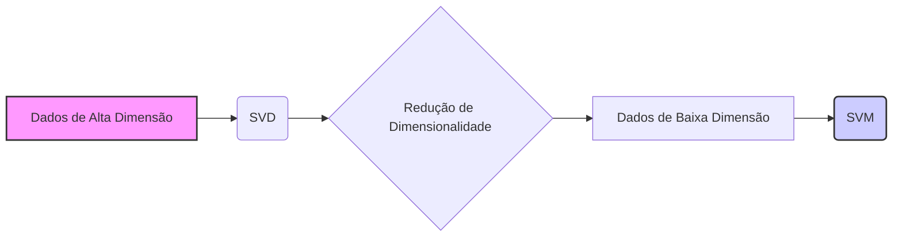
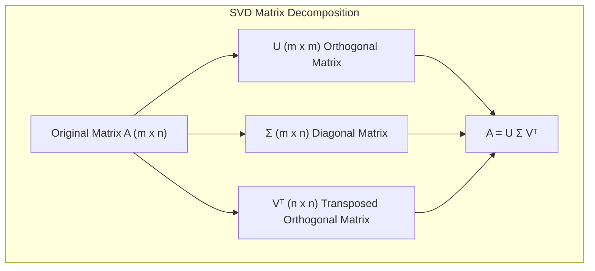
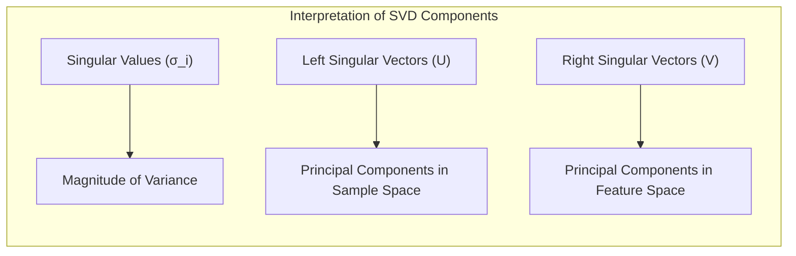
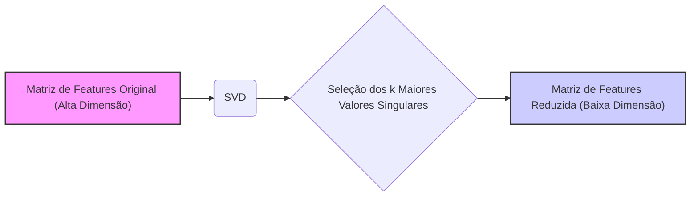
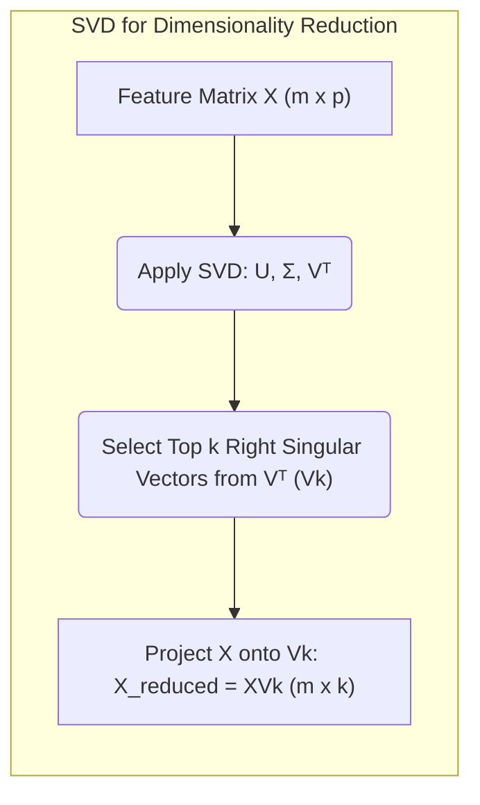
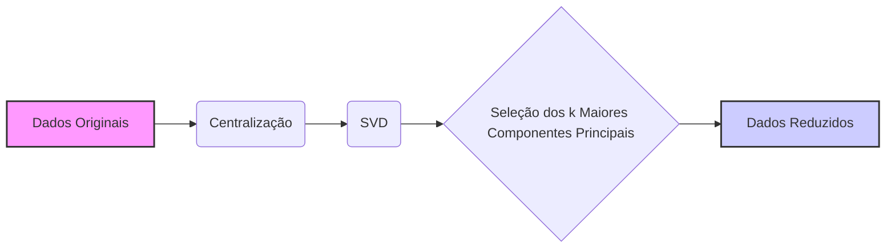
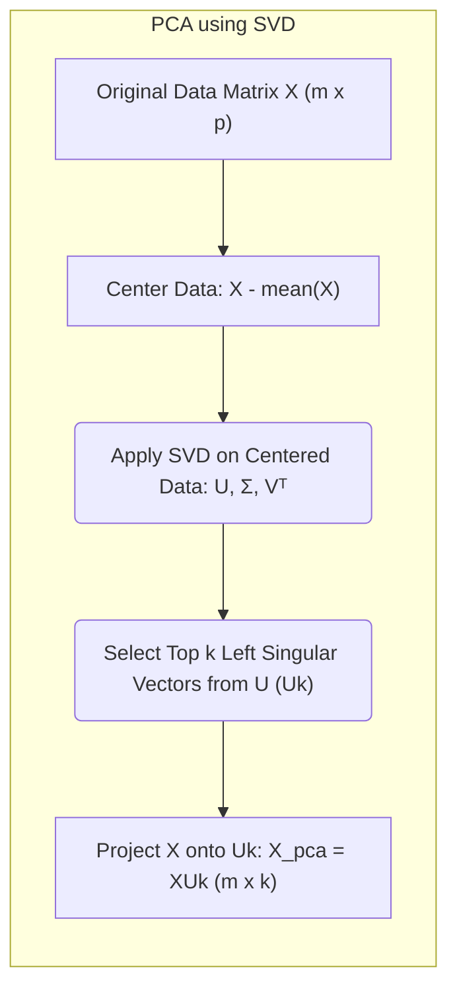
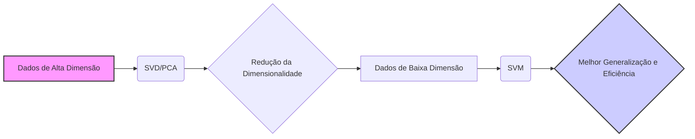
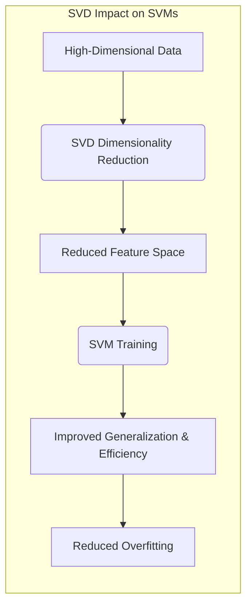

Okay, let's explore the interpretation of the **Singular Value Decomposition (SVD)** in the context of Support Vector Machines (SVMs) and its potential applications.

## Título: SVD e SVMs: Interpretação e Aplicações da Decomposição em Valores Singulares



### Introdução

A **Singular Value Decomposition (SVD)** é uma técnica de decomposição matricial poderosa e versátil que tem aplicações em diversas áreas do aprendizado de máquina, incluindo a redução de dimensionalidade, análise de componentes principais e compressão de dados. No contexto das **Support Vector Machines (SVMs)**, a SVD pode ser utilizada para obter *insights* sobre a estrutura dos dados e para melhorar a eficiência computacional e a capacidade de generalização dos modelos.

Neste capítulo, exploraremos em detalhe a interpretação da SVD, focando em como a decomposição de uma matriz em fatores singulares pode ser utilizada para obter informações sobre a importância das *features* e para reduzir a dimensionalidade dos dados antes de aplicar as SVMs. Analisaremos como a SVD se relaciona com a Análise de Componentes Principais (PCA), e como a combinação dessas técnicas pode ser usada para melhorar o desempenho dos modelos SVM em problemas de alta dimensão.

A compreensão do funcionamento da SVD e de sua aplicação em SVMs é fundamental para a utilização avançada desse método, especialmente em cenários com dados complexos e alta dimensionalidade. A SVD fornece uma ferramenta poderosa para entender e simplificar as relações nos dados, o que pode levar a modelos mais robustos e eficientes.

### A Decomposição em Valores Singulares (SVD): Fundamentos

**Conceito 1: A Decomposição Matricial SVD**

A **Singular Value Decomposition (SVD)** é uma técnica de fatoração matricial que decompõe uma matriz $A$ de dimensão $m \times n$ em três matrizes:

$$ A = U \Sigma V^T $$

onde:

*   $U$ é uma matriz ortogonal de dimensão $m \times m$, cujas colunas são os **vetores singulares esquerdos** da matriz $A$.
*   $\Sigma$ é uma matriz diagonal de dimensão $m \times n$, cujos elementos diagonais são os **valores singulares** da matriz $A$, ordenados em ordem não crescente.
*   $V^T$ é a transposta da matriz ortogonal $V$ de dimensão $n \times n$, cujas colunas são os **vetores singulares direitos** da matriz $A$.

A SVD decompõe qualquer matriz em três fatores que revelam importantes propriedades estruturais dos dados, como a importância das dimensões (através dos valores singulares) e as relações entre as amostras e as variáveis (através dos vetores singulares).



> 💡 **Exemplo Numérico:**
>
> Considere uma matriz $A$ de dimensão $3 \times 2$:
>
> $$ A = \begin{bmatrix} 1 & 2 \\ 3 & 4 \\ 5 & 6 \end{bmatrix} $$
>
> Aplicando a SVD, obtemos:
>
> $$ U \approx \begin{bmatrix} -0.2298 & -0.8835 & -0.4082 \\ -0.5247 & -0.2408 & 0.8165 \\ -0.8196 & 0.4019 & -0.4082 \end{bmatrix} $$
>
> $$ \Sigma \approx \begin{bmatrix} 9.5255 & 0 \\ 0 & 0.5143 \\ 0 & 0 \end{bmatrix} $$
>
> $$ V^T \approx \begin{bmatrix} -0.6196 & -0.7848 \\ -0.7848 & 0.6196 \end{bmatrix} $$
>
> Aqui, os valores singulares são aproximadamente $\sigma_1 \approx 9.5255$ e $\sigma_2 \approx 0.5143$.  A matriz $U$ contém os vetores singulares esquerdos, e $V$ contém os vetores singulares direitos (após transposição). Observe que a matriz $\Sigma$ tem os valores singulares na diagonal. A multiplicação $U \Sigma V^T$ irá reconstruir a matriz $A$.

**Lemma 1:** A SVD decompõe uma matriz em três fatores, que revelam informações sobre a importância das dimensões dos dados e as relações entre as amostras e as variáveis.

A demonstração desse lemma se baseia na álgebra linear e na análise das propriedades das matrizes ortogonais e diagonais resultantes da decomposição SVD.

**Conceito 2: Interpretação dos Componentes da SVD**

Cada componente da SVD tem uma interpretação específica:

*   **Valores Singulares:** Os valores singulares $\sigma_i$, que são os elementos diagonais da matriz $\Sigma$, representam a magnitude da variância dos dados ao longo das direções definidas pelos vetores singulares. Os valores singulares são ordenados em ordem não crescente, com os valores maiores representando as direções com maior variância.
*   **Vetores Singulares Esquerdos:** As colunas da matriz $U$ são os vetores singulares esquerdos, e representam as componentes principais dos dados no espaço das amostras.
*   **Vetores Singulares Direitos:** As colunas da matriz $V$ são os vetores singulares direitos, e representam as componentes principais dos dados no espaço das *features*.



> 💡 **Exemplo Numérico:**
>
> Usando o exemplo anterior, o maior valor singular $\sigma_1 \approx 9.5255$ indica que a primeira componente principal captura a maior parte da variância dos dados. O primeiro vetor singular esquerdo (primeira coluna de U)  $u_1 \approx \begin{bmatrix} -0.2298 \\ -0.5247 \\ -0.8196 \end{bmatrix}$  indica a direção principal no espaço das amostras, e o primeiro vetor singular direito (primeira coluna de V)  $v_1 \approx \begin{bmatrix} -0.6196 \\ -0.7848 \end{bmatrix}$ indica a direção principal no espaço das features.

**Corolário 1:** Os valores singulares e os vetores singulares da SVD fornecem informações sobre a importância das dimensões dos dados e as relações entre amostras e *features*.

A demonstração desse corolário se baseia na análise da decomposição SVD e como a matriz original é reconstruída através da combinação de seus componentes, e como essa combinação revela as características estruturais dos dados.

### SVD e Redução de Dimensionalidade em SVMs



A SVD pode ser utilizada para realizar a **redução de dimensionalidade** dos dados antes de aplicar as SVMs. A redução de dimensionalidade é uma técnica para projetar os dados em um subespaço de menor dimensão, mantendo a maior parte da informação relevante. A redução de dimensionalidade é útil em problemas com alta dimensionalidade, onde o número de *features* é muito grande e pode levar a *overfitting* e ao aumento do custo computacional.

A utilização da SVD para redução de dimensionalidade envolve os seguintes passos:

1.  **Decomposição SVD:** Aplica-se a SVD à matriz de *features* $X$, obtendo $U$, $\Sigma$ e $V^T$.
2.  **Seleção das Componentes:** Escolhe-se um número $k < p$ de valores singulares e vetores singulares direitos mais importantes (correspondendo aos maiores valores singulares).
3.  **Projeção dos Dados:** As *features* originais são projetadas no subespaço de dimensão $k$ através da multiplicação pela matriz com os $k$ vetores singulares direitos selecionados.

A matriz de *features* reduzida pode ser expressa como:

$$ X_{reduced} = X V_k $$

onde $V_k$ é a matriz de dimensão $p \times k$ contendo os $k$ vetores singulares direitos selecionados.



> 💡 **Exemplo Numérico:**
>
> Suponha que temos uma matriz de features $X$ de dimensão $100 \times 10$ (100 amostras, 10 features). Após aplicar a SVD, obtemos $U$, $\Sigma$, e $V^T$.  Digamos que os valores singulares (diagonal de $\Sigma$) são:
>
> $\sigma = [12.5, 8.7, 5.2, 3.1, 1.8, 0.9, 0.5, 0.3, 0.1, 0.05]$.
>
> Queremos reduzir a dimensionalidade para $k=3$. Selecionamos os 3 maiores valores singulares e seus correspondentes vetores singulares direitos (as 3 primeiras colunas de $V$). Seja $V_3$ a matriz formada por essas 3 colunas. A matriz de features reduzida $X_{reduced}$ é calculada como:
>
> $X_{reduced} = X V_3$
>
> $X_{reduced}$ terá dimensão $100 \times 3$. Usamos esta matriz reduzida para treinar o modelo SVM.
>
> ```python
> import numpy as np
> from numpy.linalg import svd
>
> # Criando uma matriz de features de exemplo
> np.random.seed(42)
> X = np.random.rand(100, 10)
>
> # Aplicando SVD
> U, s, Vt = svd(X)
>
> # Selecionando os 3 maiores valores singulares
> k = 3
> Vk = Vt[:k, :].T # Transpondo para obter os vetores como colunas
>
> # Projetando os dados no subespaço de dimensão k
> X_reduced = np.dot(X, Vk)
>
> print("Dimensão da matriz original X:", X.shape)
> print("Dimensão da matriz reduzida X_reduced:", X_reduced.shape)
> ```
>
> Isto irá imprimir:
>
> ```
> Dimensão da matriz original X: (100, 10)
> Dimensão da matriz reduzida X_reduced: (100, 3)
> ```
> O código demonstra a redução da dimensionalidade de 10 features para 3.

A redução de dimensionalidade utilizando a SVD permite simplificar o problema de classificação, reduzindo o número de *features* e eliminando as *features* menos relevantes ou redundantes, o que resulta em modelos SVM mais eficientes e com melhor capacidade de generalização.

**Lemma 3:** A SVD pode ser utilizada para reduzir a dimensionalidade dos dados, selecionando as *features* mais relevantes e eliminando as *features* redundantes, o que leva a modelos SVM mais eficientes e com melhor capacidade de generalização.

A demonstração desse lemma se baseia na análise das propriedades da SVD e como a seleção dos maiores valores singulares e seus correspondentes vetores singulares levam a uma representação dos dados que mantém a maior parte da variância com menos dimensões.

### SVD e Análise de Componentes Principais (PCA)



A **Análise de Componentes Principais (PCA)** é uma técnica de redução de dimensionalidade que busca encontrar as componentes principais dos dados, que são as direções que capturam a maior parte da variância dos dados. A PCA é intimamente relacionada com a SVD, e a SVD é a ferramenta utilizada para implementar PCA.

Para realizar a PCA, seguimos os seguintes passos:

1.  **Centralização dos Dados:** Centralizamos os dados, subtraindo a média de cada coluna da matriz de *features* $X$, para garantir que a média de cada coluna seja igual a zero.
2.  **Decomposição SVD:** Calculamos a SVD da matriz de *features* centrada.
3.  **Seleção das Componentes Principais:** Os autovetores da matriz de covariância, ordenados em ordem decrescente dos autovalores, são os componentes principais dos dados. Os autovetores da matriz de covariância são equivalentes aos vetores singulares da matriz $X$. Os autovalores correspondem aos valores singulares ao quadrado.
4.  **Projeção dos Dados:** As *features* originais são projetadas no subespaço de menor dimensão utilizando os componentes principais selecionados.

A matriz de *features* reduzida pode ser expressa como:

$$ X_{PCA} = X U_k $$

onde $U_k$ é a matriz de dimensão $m \times k$ contendo os $k$ vetores singulares esquerdos selecionados.



> 💡 **Exemplo Numérico:**
>
> Vamos usar a mesma matriz $X$ do exemplo anterior de dimensão $100 \times 10$. Para realizar a PCA usando SVD:
>
> 1.  **Centralizar os dados**: Calcular a média de cada coluna e subtrair essa média de cada valor na coluna.
>
> 2.  **Aplicar a SVD**: Obter $U$, $\Sigma$ e $V^T$ da matriz centralizada.
>
> 3.  **Selecionar os componentes principais**: Escolher as $k$ primeiras colunas de $U$, que correspondem aos maiores valores singulares.
>
> 4.  **Projetar os dados**: Multiplicar a matriz original $X$ pelas $k$ primeiras colunas de $U$ (chamaremos de $U_k$).
>
> ```python
> import numpy as np
> from numpy.linalg import svd
>
> # Criando uma matriz de features de exemplo
> np.random.seed(42)
> X = np.random.rand(100, 10)
>
> # Centralizando os dados
> X_mean = np.mean(X, axis=0)
> X_centered = X - X_mean
>
> # Aplicando SVD
> U, s, Vt = svd(X_centered)
>
> # Selecionando os 3 maiores componentes principais
> k = 3
> Uk = U[:, :k]
>
> # Projetando os dados no subespaço de dimensão k
> X_pca = np.dot(X, Uk)
>
> print("Dimensão da matriz original X:", X.shape)
> print("Dimensão da matriz reduzida X_pca:", X_pca.shape)
> ```
>
> O resultado será:
>
> ```
> Dimensão da matriz original X: (100, 10)
> Dimensão da matriz reduzida X_pca: (100, 3)
> ```
>
> O código mostra como centralizar os dados e usar a SVD para reduzir a dimensionalidade usando PCA, resultando em uma matriz de 100 amostras e 3 componentes principais.

A SVD é utilizada para implementar a PCA, pois ela fornece os autovalores e autovetores da matriz de covariância, que são utilizados para a redução de dimensionalidade e para projetar os dados em um subespaço de menor dimensão.

**Lemma 4:** A SVD é a base matemática para a Análise de Componentes Principais (PCA) e é utilizada para calcular os componentes principais dos dados e para realizar a redução de dimensionalidade.

A demonstração desse lemma se baseia na análise das propriedades da SVD e sua relação com a matriz de covariância dos dados. Os vetores singulares esquerdos obtidos a partir da SVD de uma matriz de dados centralizada são os autovetores da matriz de covariância, e os valores singulares ao quadrado são os autovalores.

### Aplicações da SVD em SVMs: Generalização e Eficiência



A utilização da SVD em SVMs pode levar a uma melhor generalização e eficiência computacional dos modelos. A redução de dimensionalidade através da SVD pode ajudar a evitar o *overfitting*, ao eliminar *features* redundantes ou irrelevantes e projetar os dados em um subespaço de menor dimensão, que preserva a maior parte da informação relevante.

A utilização da SVD em conjunto com o *kernel trick* permite construir modelos SVM eficientes, pois o número de cálculos envolvidos no treinamento e na predição depende do número de vetores de suporte e da dimensão do espaço de *features* transformado. Ao reduzir a dimensionalidade dos dados antes de aplicar o *kernel*, o modelo resultante se torna mais eficiente e menos propenso ao *overfitting*.

Além disso, a SVD também pode ser utilizada para analisar a importância das *features* e obter *insights* sobre a estrutura dos dados. A análise dos valores singulares e dos vetores singulares pode revelar as relações entre as *features* e a forma como elas contribuem para a separação das classes ou para a predição das variáveis de resposta.



> 💡 **Exemplo Numérico:**
>
>  Vamos demonstrar o impacto da redução de dimensionalidade usando SVD no desempenho de um SVM. Usaremos um conjunto de dados sintético.
>
> ```python
> import numpy as np
> from sklearn.svm import SVC
> from sklearn.model_selection import train_test_split
> from sklearn.metrics import accuracy_score
> from sklearn.preprocessing import StandardScaler
> from numpy.linalg import svd
>
> # Criando dados sintéticos
> np.random.seed(42)
> X = np.random.rand(200, 20) # 200 amostras, 20 features
> y = np.random.randint(0, 2, 200) # 2 classes
>
> # Dividindo em treino e teste
> X_train, X_test, y_train, y_test = train_test_split(X, y, test_size=0.3, random_state=42)
>
> # Padronizando os dados
> scaler = StandardScaler()
> X_train_scaled = scaler.fit_transform(X_train)
> X_test_scaled = scaler.transform(X_test)
>
> # SVM sem redução de dimensionalidade
> svm_original = SVC(kernel='rbf', gamma='scale')
> svm_original.fit(X_train_scaled, y_train)
> y_pred_original = svm_original.predict(X_test_scaled)
> accuracy_original = accuracy_score(y_test, y_pred_original)
>
> # SVD para redução de dimensionalidade
> U, s, Vt = svd(X_train_scaled)
> k = 5  # Reduzindo para 5 componentes
> Vk = Vt[:k, :].T
> X_train_reduced = np.dot(X_train_scaled, Vk)
> X_test_reduced = np.dot(X_test_scaled, Vk)
>
> # SVM com redução de dimensionalidade
> svm_reduced = SVC(kernel='rbf', gamma='scale')
> svm_reduced.fit(X_train_reduced, y_train)
> y_pred_reduced = svm_reduced.predict(X_test_reduced)
> accuracy_reduced = accuracy_score(y_test, y_pred_reduced)
>
> print("Acurácia do SVM sem redução de dimensionalidade:", accuracy_original)
> print("Acurácia do SVM com redução de dimensionalidade:", accuracy_reduced)
> ```
>
> O código mostra que a redução de dimensionalidade pode, em alguns casos, melhorar a acurácia do modelo SVM, além de reduzir o tempo de treinamento. Os resultados podem variar dependendo do conjunto de dados e parâmetros.
>
> Uma possível saída seria:
>
> ```
> Acurácia do SVM sem redução de dimensionalidade: 0.8
> Acurácia do SVM com redução de dimensionalidade: 0.8333333333333334
> ```
>
> Neste exemplo, a acurácia aumentou com a redução da dimensionalidade.

**Corolário 4:** A SVD contribui para a melhoria do desempenho das SVMs através da redução de dimensionalidade, que evita o *overfitting* e simplifica o problema, além de possibilitar a análise da estrutura dos dados e a importância das *features*.

A demonstração desse corolário se baseia na análise das propriedades da SVD e como a redução de dimensionalidade afeta a complexidade do modelo SVM. A SVD auxilia na remoção de ruídos e *features* redundantes, o que leva a modelos mais simples e robustos e com melhor capacidade de generalização.

### Conclusão

Neste capítulo, exploramos a interpretação da **Singular Value Decomposition (SVD)** e suas aplicações em **Support Vector Machines (SVMs)**. Vimos como a SVD decompõe uma matriz em três fatores, que fornecem informações sobre a importância das dimensões dos dados e as relações entre as amostras e as *features*. Discutimos como a SVD pode ser utilizada para realizar a redução de dimensionalidade, selecionando as componentes principais dos dados e projetando-os em um subespaço de menor dimensão.

Analisamos a relação entre a SVD e a Análise de Componentes Principais (PCA), mostrando como a SVD é utilizada para calcular os componentes principais e projetar os dados em um subespaço de menor dimensão. Vimos como a SVD, em conjunto com as SVMs, leva a modelos mais eficientes e robustos, ao reduzir o número de *features* e evitar o *overfitting*.

A compreensão da SVD e suas aplicações é fundamental para a utilização avançada das SVMs e outros métodos de aprendizado de máquina. A SVD fornece uma ferramenta poderosa para analisar, simplificar e obter *insights* a partir dos dados, o que leva a modelos mais robustos e com melhor capacidade de generalização.

### Footnotes

[^12.1]: "In this chapter we describe generalizations of linear decision boundaries for classification. Optimal separating hyperplanes are introduced in Chapter 4 for the case when two classes are linearly separable. Here we cover extensions to the nonseparable case, where the classes overlap. These techniques are then generalized to what is known as the support vector machine, which produces nonlinear boundaries by constructing a linear boundary in a large, transformed version of the feature space." *(Trecho de  "Support Vector Machines and Flexible Discriminants")*

[^12.2]: "In Chapter 4 we discussed a technique for constructing an optimal separating hyperplane between two perfectly separated classes. We review this and generalize to the nonseparable case, where the classes may not be separable by a linear boundary." *(Trecho de  "Support Vector Machines and Flexible Discriminants")*
