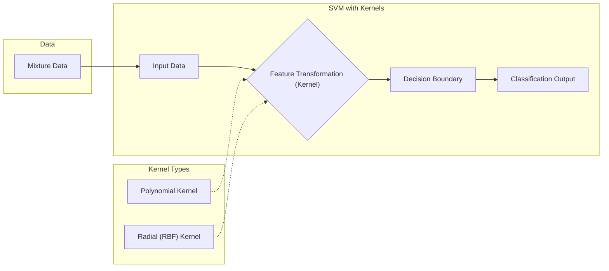
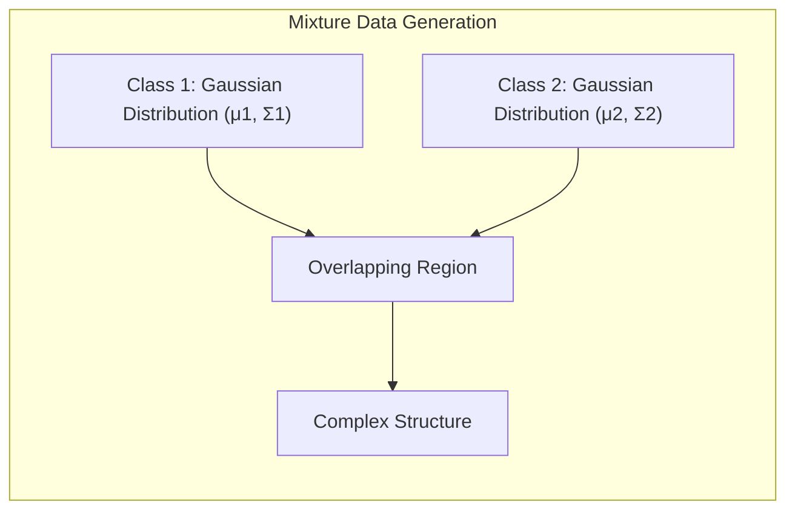
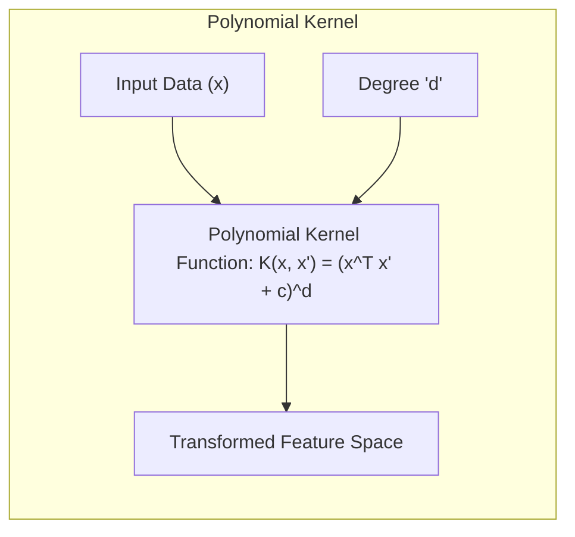
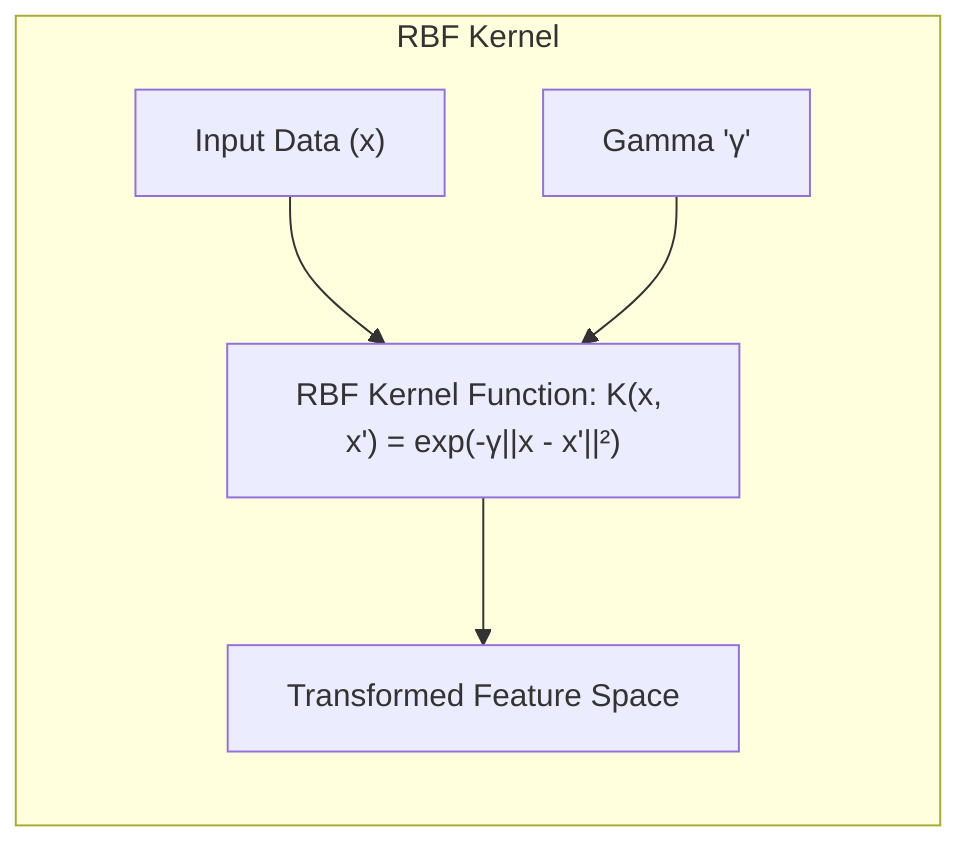
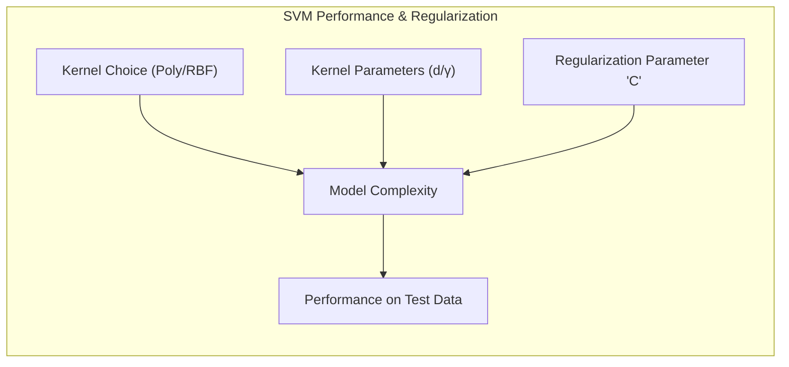

Okay, here's the enhanced text with Mermaid diagrams, focusing on mathematical and statistical clarity:

## Título: Análise de Desempenho de SVMs Não Lineares com Kernels Polinomiais e Radiais em Dados de Mistura



### Introdução

Em capítulos anteriores, exploramos os fundamentos teóricos das **Support Vector Machines (SVMs)**, incluindo a formulação do problema de otimização, a utilização de **kernels** e o conceito de **vetores de suporte**. Neste capítulo, vamos analisar o desempenho prático das SVMs não lineares em um conjunto de dados específico, conhecido como **dados de mistura**. Analisaremos o impacto da escolha do *kernel* (polinomial e radial) e de seus parâmetros associados na complexidade da fronteira de decisão e na capacidade de generalização dos modelos.

Os **dados de mistura** são um conjunto de dados sintético que apresenta características de sobreposição entre as classes e uma distribuição complexa, que não pode ser facilmente separada por um hiperplano linear. A análise do desempenho de modelos SVM nesse conjunto de dados nos fornecerá *insights* sobre a capacidade dos diferentes tipos de *kernels* em modelar relações não lineares complexas e sobre a necessidade de ajustar cuidadosamente os parâmetros dos modelos para obter um bom desempenho.

Este capítulo apresentará exemplos práticos, com resultados obtidos a partir da aplicação das SVMs com *kernels* polinomial e radial aos dados de mistura, o que nos permitirá avaliar as vantagens e desvantagens de cada tipo de *kernel*. Analisaremos também o efeito da regularização (parâmetro $C$) sobre os resultados obtidos.

### O Conjunto de Dados de Mistura

**Conceito 1: Descrição dos Dados de Mistura**

Os **dados de mistura** são um conjunto de dados sintético, amplamente utilizado para avaliar o desempenho de algoritmos de classificação não lineares. O conjunto de dados consiste em duas classes que se sobrepõem, formando uma estrutura complexa que não pode ser separada por uma fronteira de decisão linear.



Em geral, cada classe é gerada a partir de uma distribuição gaussiana bivariada, com médias e covariâncias específicas. Os centros das distribuições são escolhidos de forma a gerar uma área de sobreposição entre as classes. A distribuição dos dados de mistura cria um desafio para modelos lineares, que têm dificuldade de construir uma fronteira de decisão que separe as duas classes de forma adequada.

Os dados de mistura são, por isso, um conjunto de dados apropriado para testar modelos não lineares como SVMs com *kernels* polinomiais e radiais, como mencionado em [^12.2]. A utilização dos dados de mistura permite verificar como a escolha do *kernel* e seus parâmetros influenciam na capacidade do modelo de se adaptar a dados complexos e com sobreposição de classes.

> 💡 **Exemplo Numérico:**
> Vamos criar um exemplo simplificado de dados de mistura em 2D. Imagine que temos duas classes, cada uma com 100 pontos. A Classe 1 tem uma média de (1, 1) e a Classe 2 tem uma média de (2, 2), ambas com desvio padrão de 0.7 em ambas as dimensões.
> ```python
> import numpy as np
> import matplotlib.pyplot as plt
> from sklearn.svm import SVC
> from sklearn.model_selection import train_test_split
> from sklearn.metrics import accuracy_score
>
> # Gerar dados de mistura
> np.random.seed(42)
> class1_mean = [1, 1]
> class2_mean = [2, 2]
> class_std = 0.7
> class1_data = np.random.normal(class1_mean, class_std, size=(100, 2))
> class2_data = np.random.normal(class2_mean, class_std, size=(100, 2))
> X = np.concatenate((class1_data, class2_data))
> y = np.concatenate((np.zeros(100), np.ones(100)))
>
> # Dividir em treino e teste
> X_train, X_test, y_train, y_test = train_test_split(X, y, test_size=0.3, random_state=42)
>
> plt.scatter(X_train[:, 0], X_train[:, 1], c=y_train, cmap='viridis', edgecolors='k')
> plt.title('Dados de Mistura (Treino)')
> plt.xlabel('Feature 1')
> plt.ylabel('Feature 2')
> plt.show()
> ```
> Este código gera e visualiza os dados de treino. A sobreposição entre as classes é visível.

**Lemma 1:** O conjunto de dados de mistura apresenta uma estrutura complexa, com sobreposição entre as classes, que exige modelos não lineares para uma separação adequada.

A demonstração desse lemma se baseia na descrição das características dos dados de mistura, que são gerados de forma a criar uma região de sobreposição entre as classes, dificultando a separação linear dos dados.

### Análise de Desempenho com Kernel Polinomial



O **kernel polinomial** permite que a SVM construa fronteiras de decisão não lineares, mapeando os dados para um espaço de *features* de maior dimensão, que inclui todos os termos como produtos e potências das *features* originais, até um certo grau $d$. A função *kernel* polinomial é dada por:

$$ K(x, x') = (x^T x' + c)^d $$

onde $c$ é uma constante e $d$ é o grau do polinômio.

A aplicação da SVM com *kernel* polinomial aos dados de mistura mostra como o parâmetro $d$ influencia a complexidade da fronteira de decisão. Para valores baixos de $d$ (por exemplo, $d=2$), a fronteira de decisão tende a ser relativamente simples e não consegue capturar todas as nuances da distribuição dos dados, o que pode levar a classificações incorretas em áreas com sobreposição das classes. Para valores mais altos de $d$ (por exemplo, $d=5$ ou $d=10$), a fronteira de decisão se torna mais complexa, ajustando-se aos detalhes dos dados de treinamento e reduzindo o número de erros de classificação nesse conjunto, mas aumentando o risco de *overfitting* e de redução do desempenho em novos dados.

A escolha do valor apropriado de $d$ envolve um compromisso entre a complexidade do modelo e sua capacidade de generalização. A utilização da validação cruzada é uma prática para ajustar o parâmetro $d$ de forma a obter um modelo com boa capacidade de generalizar para novos dados.

> 💡 **Exemplo Numérico:**
> Vamos treinar SVMs com kernel polinomial com diferentes graus (d=2 e d=5) nos dados de mistura que geramos.
> ```python
> # Treinar SVM com kernel polinomial (d=2)
> svm_poly_2 = SVC(kernel='poly', degree=2, C=1)
> svm_poly_2.fit(X_train, y_train)
> y_pred_poly_2 = svm_poly_2.predict(X_test)
> accuracy_poly_2 = accuracy_score(y_test, y_pred_poly_2)
>
> # Treinar SVM com kernel polinomial (d=5)
> svm_poly_5 = SVC(kernel='poly', degree=5, C=1)
> svm_poly_5.fit(X_train, y_train)
> y_pred_poly_5 = svm_poly_5.predict(X_test)
> accuracy_poly_5 = accuracy_score(y_test, y_pred_poly_5)
>
> print(f"Acurácia (Kernel Polinomial, d=2): {accuracy_poly_2:.4f}")
> print(f"Acurácia (Kernel Polinomial, d=5): {accuracy_poly_5:.4f}")
>
> # Visualizar as fronteiras de decisão (simplificado)
> # Note: Visualização completa da fronteira de decisão seria mais complexa
>
> plt.figure(figsize=(10, 5))
> plt.subplot(1, 2, 1)
> plt.scatter(X_test[:, 0], X_test[:, 1], c=y_pred_poly_2, cmap='viridis', edgecolors='k')
> plt.title('Kernel Polinomial (d=2)')
> plt.xlabel('Feature 1')
> plt.ylabel('Feature 2')
>
> plt.subplot(1, 2, 2)
> plt.scatter(X_test[:, 0], X_test[:, 1], c=y_pred_poly_5, cmap='viridis', edgecolors='k')
> plt.title('Kernel Polinomial (d=5)')
> plt.xlabel('Feature 1')
> plt.ylabel('Feature 2')
> plt.tight_layout()
> plt.show()
> ```
> Executando o código, podemos observar que com `d=2` a acurácia é menor e a fronteira de decisão é mais simples, enquanto com `d=5` a acurácia aumenta e a fronteira de decisão se torna mais complexa. Os valores de acurácia podem variar um pouco devido à aleatoriedade da divisão de treino/teste, mas a tendência é que um valor maior de `d` se ajuste melhor aos dados de treino, mas pode não generalizar tão bem quanto um menor valor de `d`.

**Lemma 2:** O parâmetro $d$ do *kernel* polinomial controla a complexidade da fronteira de decisão e a capacidade do modelo de capturar relações não lineares complexas, e a escolha adequada de $d$ envolve um compromisso entre viés e variância.

A demonstração desse lemma se baseia na análise do *kernel* polinomial e como o parâmetro $d$ controla a dimensão do espaço de *features* transformado e, consequentemente, a complexidade da fronteira de decisão e sua capacidade de se ajustar aos dados de treinamento.

### Análise de Desempenho com Kernel Radial (RBF)



O **kernel radial ou Gaussiano (RBF)** é um *kernel* amplamente utilizado em SVMs, pois ele tem a capacidade de modelar relações não lineares complexas e oferece um bom desempenho em uma variedade de problemas de classificação. O *kernel* RBF é dado por:

$$ K(x, x') = \exp(-\gamma ||x - x'||^2) $$

onde $\gamma > 0$ é um parâmetro que controla a largura da função gaussiana.

A aplicação da SVM com *kernel* RBF aos dados de mistura mostra como o parâmetro $\gamma$ influencia a complexidade da fronteira de decisão. Valores altos de $\gamma$ levam a modelos com alta variância e fronteiras de decisão complexas, com grande capacidade de ajustar-se aos dados de treinamento, o que pode resultar em *overfitting*. Valores baixos de $\gamma$, por outro lado, levam a modelos mais simples, com baixa variância e fronteiras de decisão mais suaves, o que pode resultar em alto viés.

A escolha do valor apropriado de $\gamma$ envolve o ajuste do compromisso entre viés e variância, com a necessidade de balancear a complexidade do modelo com sua capacidade de generalizar para dados não vistos. A validação cruzada é uma técnica útil para escolher um valor de $\gamma$ que equilibre esses fatores.

> 💡 **Exemplo Numérico:**
> Vamos treinar SVMs com kernel RBF com diferentes valores de gamma (γ=0.1 e γ=10) nos mesmos dados de mistura.
> ```python
> # Treinar SVM com kernel RBF (gamma=0.1)
> svm_rbf_01 = SVC(kernel='rbf', gamma=0.1, C=1)
> svm_rbf_01.fit(X_train, y_train)
> y_pred_rbf_01 = svm_rbf_01.predict(X_test)
> accuracy_rbf_01 = accuracy_score(y_test, y_pred_rbf_01)
>
> # Treinar SVM com kernel RBF (gamma=10)
> svm_rbf_10 = SVC(kernel='rbf', gamma=10, C=1)
> svm_rbf_10.fit(X_train, y_train)
> y_pred_rbf_10 = svm_rbf_10.predict(X_test)
> accuracy_rbf_10 = accuracy_score(y_test, y_pred_rbf_10)
>
> print(f"Acurácia (Kernel RBF, gamma=0.1): {accuracy_rbf_01:.4f}")
> print(f"Acurácia (Kernel RBF, gamma=10): {accuracy_rbf_10:.4f}")
>
> # Visualizar as fronteiras de decisão (simplificado)
> plt.figure(figsize=(10, 5))
> plt.subplot(1, 2, 1)
> plt.scatter(X_test[:, 0], X_test[:, 1], c=y_pred_rbf_01, cmap='viridis', edgecolors='k')
> plt.title('Kernel RBF (gamma=0.1)')
> plt.xlabel('Feature 1')
> plt.ylabel('Feature 2')
>
> plt.subplot(1, 2, 2)
> plt.scatter(X_test[:, 0], X_test[:, 1], c=y_pred_rbf_10, cmap='viridis', edgecolors='k')
> plt.title('Kernel RBF (gamma=10)')
> plt.xlabel('Feature 1')
> plt.ylabel('Feature 2')
> plt.tight_layout()
> plt.show()
> ```
> Ao executar o código, observamos que com `gamma=0.1` a fronteira de decisão é mais suave, enquanto com `gamma=10`, a fronteira é mais complexa e se ajusta mais aos dados de treino. A acurácia pode variar um pouco devido à aleatoriedade, mas em geral, um valor de `gamma` menor pode apresentar um viés maior, enquanto um valor maior pode apresentar um overfitting, especialmente se `C` for alto também.

**Lemma 3:** O parâmetro $\gamma$ do *kernel* RBF controla a largura da função gaussiana e a complexidade da fronteira de decisão, e a escolha apropriada de $\gamma$ envolve a busca por um equilíbrio entre viés e variância.

A demonstração desse lemma se baseia na análise do efeito de $\gamma$ no *kernel* RBF, e como esse parâmetro afeta a capacidade do modelo de modelar detalhes dos dados de treinamento. Valores baixos de $\gamma$ levam a uma função mais "larga", com menos precisão, e valores altos, a uma função mais "estreita", com mais precisão, o que resulta em modelos mais ou menos complexos, respectivamente.

### Comparação do Desempenho e Impacto de C



A comparação do desempenho das SVMs com *kernels* polinomial e RBF nos dados de mistura revela que o *kernel* RBF geralmente oferece uma performance melhor, especialmente quando as relações entre as *features* e as classes são complexas, e não podem ser modeladas por polinômios. O *kernel* polinomial é mais adequado para problemas onde existe uma estrutura polinomial entre as *features*. No entanto, o RBF oferece uma maior flexibilidade e capacidade de adaptação a diferentes tipos de dados.

Além da escolha do *kernel*, o ajuste do parâmetro de regularização **C** é crucial para o desempenho do modelo. Como discutido em capítulos anteriores, o parâmetro $C$ controla o equilíbrio entre a maximização da margem e a penalização por erros de classificação [^12.2]. Valores altos de $C$ tendem a levar a modelos com margens menores e um maior número de vetores de suporte, e esses modelos são mais propensos a *overfitting*. Valores baixos de $C$, por outro lado, levam a modelos com margem maior, menos vetores de suporte e mais robustos, com uma melhor capacidade de generalizar.

A escolha do valor apropriado de $C$ e dos parâmetros do *kernel* é um processo empírico, que envolve a experimentação e a utilização de técnicas de validação cruzada para obter modelos SVM com bom desempenho em dados não vistos.

> 💡 **Exemplo Numérico:**
> Vamos treinar SVMs com kernel RBF usando diferentes valores de C (C=0.1 e C=10) para analisar o efeito da regularização. Vamos usar um valor fixo para gamma (γ=1) para simplificar.
> ```python
> # Treinar SVM com kernel RBF (C=0.1, gamma=1)
> svm_rbf_c01 = SVC(kernel='rbf', gamma=1, C=0.1)
> svm_rbf_c01.fit(X_train, y_train)
> y_pred_rbf_c01 = svm_rbf_c01.predict(X_test)
> accuracy_rbf_c01 = accuracy_score(y_test, y_pred_rbf_c01)
>
> # Treinar SVM com kernel RBF (C=10, gamma=1)
> svm_rbf_c10 = SVC(kernel='rbf', gamma=1, C=10)
> svm_rbf_c10.fit(X_train, y_train)
> y_pred_rbf_c10 = svm_rbf_c10.predict(X_test)
> accuracy_rbf_c10 = accuracy_score(y_test, y_pred_rbf_c10)
>
> print(f"Acurácia (Kernel RBF, C=0.1, gamma=1): {accuracy_rbf_c01:.4f}")
> print(f"Acurácia (Kernel RBF, C=10, gamma=1): {accuracy_rbf_c10:.4f}")
>
> # Visualizar as fronteiras de decisão (simplificado)
> plt.figure(figsize=(10, 5))
> plt.subplot(1, 2, 1)
> plt.scatter(X_test[:, 0], X_test[:, 1], c=y_pred_rbf_c01, cmap='viridis', edgecolors='k')
> plt.title('Kernel RBF (C=0.1)')
> plt.xlabel('Feature 1')
> plt.ylabel('Feature 2')
>
> plt.subplot(1, 2, 2)
> plt.scatter(X_test[:, 0], X_test[:, 1], c=y_pred_rbf_c10, cmap='viridis', edgecolors='k')
> plt.title('Kernel RBF (C=10)')
> plt.xlabel('Feature 1')
> plt.ylabel('Feature 2')
> plt.tight_layout()
> plt.show()
> ```
> Executando o código, podemos observar que com `C=0.1` a fronteira é mais suave e há uma maior tolerância a erros de classificação, enquanto com `C=10` a fronteira tenta classificar corretamente todos os dados de treino, o que pode levar a um overfitting. A acurácia nos dados de teste pode variar um pouco, mas um valor menor de `C` tende a generalizar melhor.

**Corolário 3:** A escolha do *kernel* e de seus parâmetros, juntamente com o ajuste do parâmetro de regularização C, são cruciais para o desempenho das SVMs e a escolha apropriada depende das características específicas dos dados e do problema de classificação.

A demonstração desse corolário se baseia na análise do impacto da escolha do *kernel* e de seus parâmetros na função de decisão e no desempenho do modelo, onde a validação cruzada se torna um mecanismo para selecionar os melhores parâmetros para a generalização e performance.

### Conclusão

Neste capítulo, analisamos o desempenho de **SVMs não lineares** utilizando **kernels polinomial e radial** em um conjunto de dados de mistura. Vimos como a escolha do *kernel* e de seus parâmetros influencia a complexidade da fronteira de decisão, o número de vetores de suporte e a capacidade de generalização do modelo.

Exploramos a importância do parâmetro $C$ e como ele controla o equilíbrio entre a maximização da margem e a tolerância a erros de classificação, e como a escolha apropriada dos parâmetros do modelo é crucial para a obtenção de um bom desempenho em dados não vistos.

A utilização de dados de mistura ilustra as vantagens de SVMs com kernels, especialmente o RBF, para a modelagem de dados complexos com sobreposição de classes. A experimentação com diferentes valores de parâmetros (C e os parâmetros do *kernel*) permite que o profissional tenha mais *insights* sobre o problema e a resposta do modelo. A capacidade de ajustar os parâmetros do modelo de acordo com as características do conjunto de dados é um dos pontos fortes das SVMs, o que permite criar modelos flexíveis e robustos.

### Footnotes

[^12.1]: "In this chapter we describe generalizations of linear decision boundaries for classification. Optimal separating hyperplanes are introduced in Chapter 4 for the case when two classes are linearly separable. Here we cover extensions to the nonseparable case, where the classes overlap. These techniques are then generalized to what is known as the support vector machine, which produces nonlinear boundaries by constructing a linear boundary in a large, transformed version of the feature space." *(Trecho de  "Support Vector Machines and Flexible Discriminants")*

[^12.2]: "In Chapter 4 we discussed a technique for constructing an optimal separating hyperplane between two perfectly separated classes. We review this and generalize to the nonseparable case, where the classes may not be separable by a linear boundary." *(Trecho de  "Support Vector Machines and Flexible Discriminants")*
