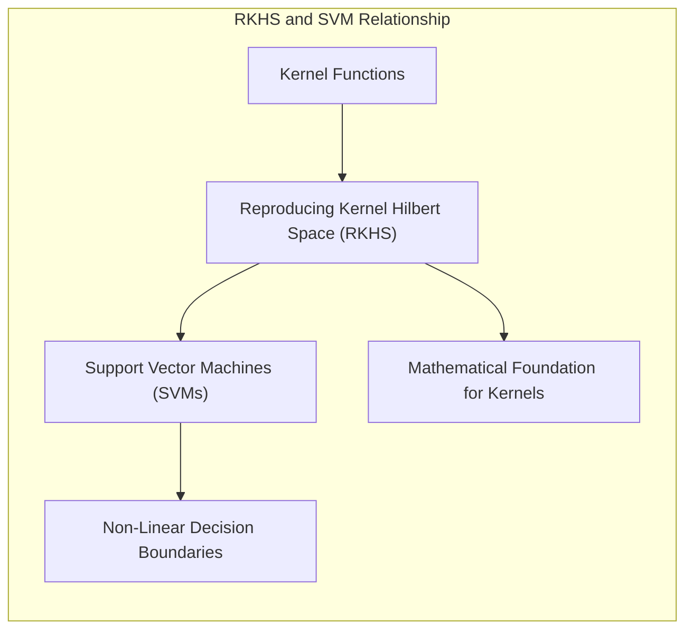
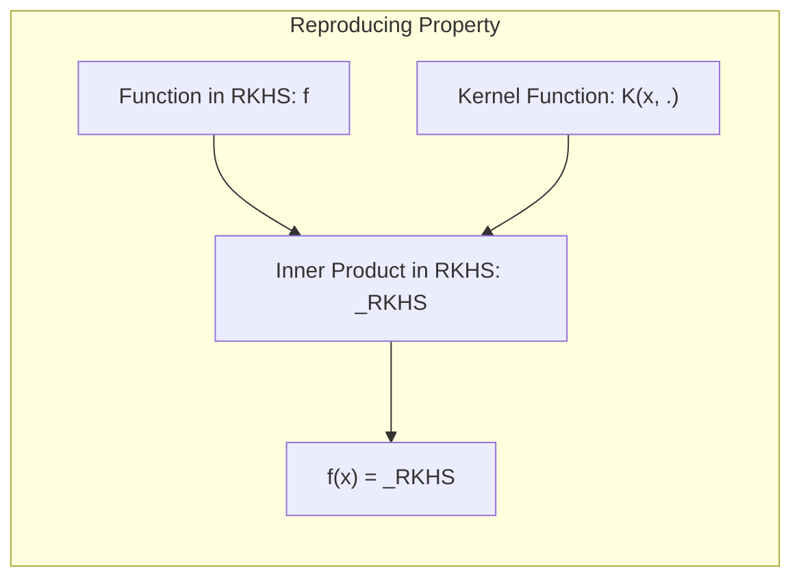
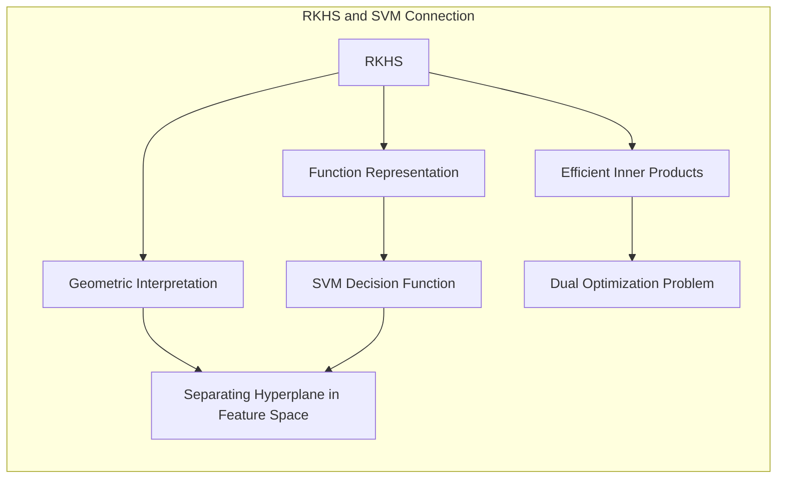
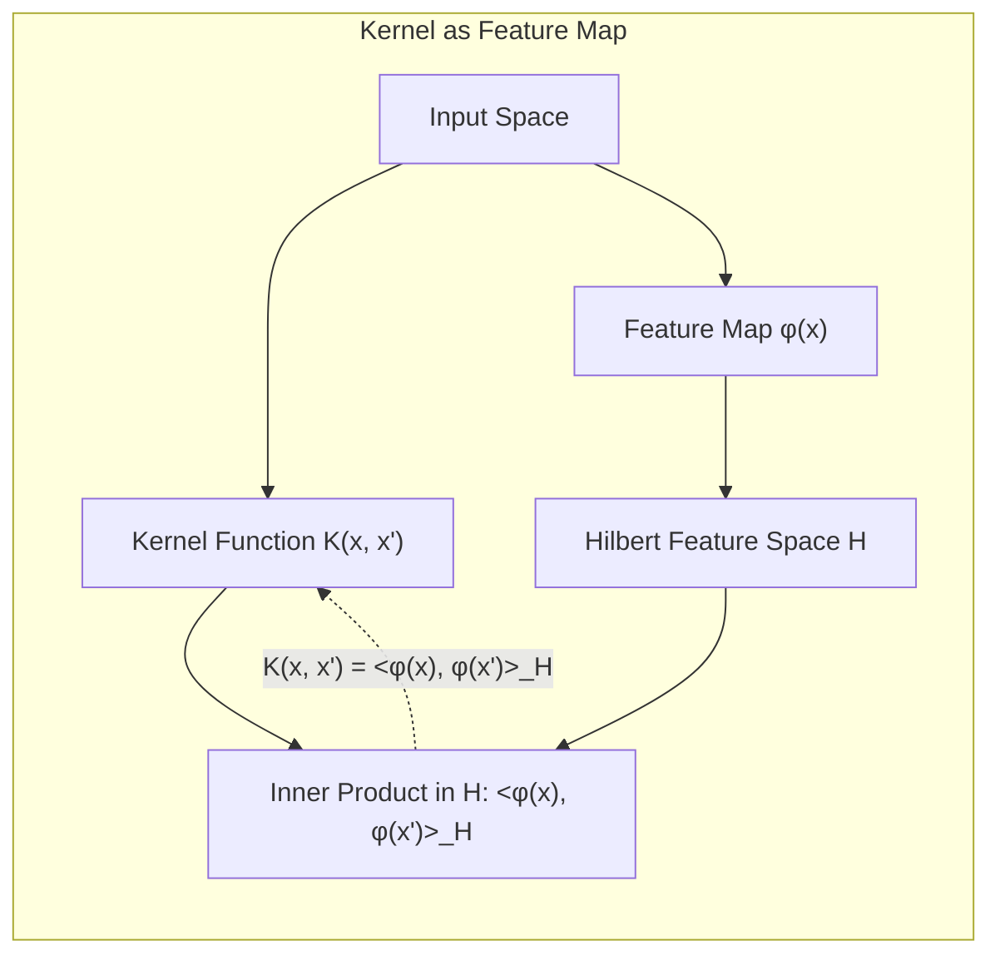

Okay, let's enhance the text with practical numerical examples to illustrate the concepts of Reproducing Kernel Hilbert Spaces (RKHS) and their connection to Support Vector Machines (SVMs).

## Título: Espaços de Hilbert com Kernel Reprodutor (RKHS): Fundamentos Teóricos e sua Relação com SVMs

### Introdução

No contexto das **Support Vector Machines (SVMs)**, as **funções kernel** desempenham um papel crucial, permitindo que o modelo opere em espaços de *features* de alta dimensão sem explicitar a transformação dos dados. A teoria por trás dessas funções se baseia no conceito de **Espaços de Hilbert com Kernel Reprodutor (RKHS)**, que fornecem uma estrutura matemática rigorosa para compreender como as funções *kernel* definem um espaço de funções com propriedades específicas [^12.3].

Neste capítulo, exploraremos em detalhe os fundamentos teóricos dos Espaços de Hilbert com Kernel Reprodutor (RKHS), analisando como a propriedade de reprodução do *kernel* permite que o produto interno em espaços de alta dimensão seja calculado de forma eficiente e como essa propriedade se relaciona com a capacidade das SVMs de construir modelos não lineares. Analisaremos também como as funções *kernel* definem um espaço de funções com propriedades específicas que são essenciais para o funcionamento das SVMs.

A compreensão do conceito de RKHS é fundamental para uma visão completa da teoria por trás das SVMs e para a utilização avançada desse método em problemas complexos de classificação e regressão. Essa compreensão também possibilita o estudo de outros métodos baseados em *kernel*, como a regressão de *kernel* e análise de componentes principais com *kernel*.

### Definição de Espaços de Hilbert com Kernel Reprodutor (RKHS)

**Conceito 1: Espaço de Hilbert**

Um **Espaço de Hilbert** é um espaço vetorial com um produto interno que também é completo em relação à norma definida pelo produto interno. Essa propriedade garante a existência de limites de sequências de vetores no espaço. A completude é uma propriedade importante em espaços funcionais, garantindo a existência de funções que representam limites de sequências de outras funções.

Um espaço de Hilbert é um tipo particular de espaço vetorial com produto interno, e que também possui completude. Um produto interno, representado por $\langle \cdot, \cdot \rangle$, é uma função que associa a cada par de vetores um escalar, e que satisfaz certas propriedades de linearidade, simetria e positividade. A norma de um vetor $x$, denotada por $||x||$, é definida como $||x|| = \sqrt{\langle x, x \rangle}$.

**Lemma 1:** Um Espaço de Hilbert é um espaço vetorial completo com produto interno, o que garante a existência de limites de sequências de vetores.

A demonstração desse lemma se baseia na definição de um espaço de Hilbert e nas propriedades do produto interno. A propriedade de completude garante que qualquer sequência de Cauchy converge para um vetor no espaço.

**Conceito 2: Kernel Reprodutor e a Propriedade de Reprodução**

Um **Espaço de Hilbert com Kernel Reprodutor (RKHS)** é um espaço de Hilbert de funções que possui uma função *kernel* $K(x, x')$, também conhecida como *kernel* reprodutor, que satisfaz a propriedade de reprodução:

$$ f(x) = \langle f, K(x, \cdot) \rangle_{RKHS} $$

onde $f$ é qualquer função no RKHS, $\langle \cdot, \cdot \rangle_{RKHS}$ é o produto interno no RKHS, e $K(x, \cdot)$ é a função *kernel* fixando o primeiro argumento e variando o segundo. Essa propriedade demonstra que a função *kernel* pode ser vista como um "vetor" de *features* em um espaço de dimensão possivelmente infinita.

A propriedade de reprodução garante que o produto interno de qualquer função $f$ com a função *kernel* $K(x, \cdot)$, avaliada em $x$, reproduz o valor da função $f$ no ponto $x$.

> 💡 **Exemplo Numérico:**
>
> Vamos considerar um RKHS com um kernel gaussiano (RBF) definido como:
>
> $$ K(x, x') = \exp\left(-\frac{||x - x'||^2}{2\sigma^2}\right) $$
>
> Onde $\sigma$ é um parâmetro que controla a largura do kernel. Suponha que temos uma função $f$ no RKHS e queremos calcular $f(x)$ para um ponto $x=2$. Segundo a propriedade de reprodução, devemos realizar o produto interno de $f$ com $K(2, \cdot)$.  Assumindo que a representação da função $f$ no RKHS é dada por $f = \sum_{i=1}^n \alpha_i K(x_i, \cdot)$, onde $x_i$ são pontos de referência.
>
> Para simplificar, vamos supor que  $f(x) = 0.5K(1, x) + 0.3K(3, x)$ e $\sigma = 1$. Então, para calcular $f(2)$:
>
> $f(2) = \langle f, K(2, \cdot) \rangle_{RKHS} = 0.5K(1, 2) + 0.3K(3, 2)$
>
> Calculando os valores do kernel:
>
> $K(1, 2) = \exp\left(-\frac{||1 - 2||^2}{2}\right) = \exp\left(-\frac{1}{2}\right) \approx 0.6065$
>
> $K(3, 2) = \exp\left(-\frac{||3 - 2||^2}{2}\right) = \exp\left(-\frac{1}{2}\right) \approx 0.6065$
>
> Portanto,
>
> $f(2) = 0.5 \times 0.6065 + 0.3 \times 0.6065 = 0.4852$
>
> Este exemplo ilustra como a propriedade de reprodução do kernel nos permite calcular o valor da função $f$ em qualquer ponto $x$ usando apenas produtos internos com o kernel, sem precisar conhecer a representação da função $f$ no espaço de features.

**Corolário 1:** A propriedade de reprodução do kernel permite que o produto interno entre funções no RKHS seja calculado de forma eficiente, sem explicitar a representação das funções, e esse mecanismo é essencial para o funcionamento das SVMs.

A demonstração desse corolário se baseia na análise da propriedade de reprodução e como essa propriedade é utilizada na definição do produto interno no RKHS, permitindo calcular produtos internos com uma complexidade que não depende da dimensão do espaço de *features*.

### Propriedades dos RKHS e sua Relação com SVMs

Os **Espaços de Hilbert com Kernel Reprodutor (RKHS)** possuem propriedades que são fundamentais para a construção e o entendimento das SVMs:

1.  **Representação da Função de Decisão:** A função de decisão das SVMs pode ser expressa como uma combinação linear de funções *kernel* centradas nos vetores de suporte:
    $$ f(x) = \sum_{i \in SV} \alpha_i y_i K(x_i, x) + \beta_0 $$
    Essa equação demonstra que a função de decisão reside no RKHS definido pelo *kernel* $K$.

> 💡 **Exemplo Numérico:**
>
> Suponha que, após o treinamento de uma SVM, identificamos três vetores de suporte ($x_1$, $x_2$, $x_3$) com rótulos ($y_1 = 1$, $y_2 = -1$, $y_3 = 1$) e pesos $\alpha_1 = 0.5$, $\alpha_2 = 0.7$, $\alpha_3 = 0.3$, respectivamente, e um bias $\beta_0 = 0.1$. Usando o mesmo kernel gaussiano (RBF) com $\sigma = 1$ do exemplo anterior, a função de decisão para um novo ponto $x = 2$ seria:
>
> $f(2) = 0.5 \cdot 1 \cdot K(x_1, 2) - 0.7 \cdot 1 \cdot K(x_2, 2) + 0.3 \cdot 1 \cdot K(x_3, 2) + 0.1$
>
> Vamos assumir que $x_1=1$, $x_2=3$, e $x_3=4$
>
> Já calculamos $K(1, 2) \approx 0.6065$ e $K(3, 2) \approx 0.6065$. Vamos calcular $K(4, 2)$:
>
> $K(4, 2) = \exp\left(-\frac{||4 - 2||^2}{2}\right) = \exp\left(-\frac{4}{2}\right) \approx 0.1353$
>
> Substituindo na função de decisão:
>
> $f(2) = 0.5 \times 0.6065 - 0.7 \times 0.6065 + 0.3 \times 0.1353 + 0.1$
>
> $f(2) = 0.30325 - 0.42455 + 0.04059 + 0.1 = 0.01929$
>
> Se $f(2) > 0$, o novo ponto é classificado como classe 1, e se $f(2) < 0$, como classe -1. Neste caso, $x=2$ seria classificado como classe 1.

2.  **Dualidade de Wolfe:** A dualidade de Wolfe transforma o problema de otimização primal em um problema dual, onde a função objetivo depende apenas de produtos internos entre os dados. Ao substituir o produto interno pela função *kernel* $K(x, x')$, o problema dual se torna um problema de otimização sobre funções no RKHS.
3.  **Interpretação Geométrica:** O RKHS fornece um espaço onde os dados são representados como funções, e o hiperplano separador ótimo do modelo SVM é um hiperplano linear nesse espaço de funções. O RKHS também permite interpretar o produto interno como a similaridade entre as amostras no espaço de funções.

**Lemma 3:** Os RKHS fornecem uma estrutura matemática rigorosa para entender como as funções *kernel* definem um espaço de funções com propriedades específicas que são essenciais para o funcionamento das SVMs.

A demonstração desse lemma se baseia na análise das propriedades dos RKHS e como o *kernel* reproduz o produto interno neste espaço, o que leva à formulação do problema dual da SVM e sua solução.

### O Kernel como um Mapa de Features e o Espaço de Hilbert

A função *kernel* $K(x, x')$ pode ser vista como um mapa de *features* implícito $\phi(x)$ para um espaço de Hilbert. Este espaço pode ter dimensão finita ou infinita, e o *kernel* calcula o produto interno entre as transformações dos dados nesse espaço:

$$ K(x, x') = \langle \phi(x), \phi(x') \rangle_{\mathcal{H}} $$

O *kernel* define implicitamente um espaço de *features* através da sua propriedade de reprodução, mesmo que não explicitemos a forma da transformação $\phi(x)$. Esse resultado é garantido pelo **Teorema de Mercer**.

A representação de um vetor $x$ no RKHS, usando a função *kernel* é dada por $K(x, \cdot)$, e o produto interno entre dois vetores $x$ e $x'$ nesse espaço é dado por $K(x, x')$.

A utilização da função *kernel* na formulação das SVMs permite realizar as operações necessárias no espaço de *features* (como cálculo de produto interno), sem explicitamente calcular a transformação dos dados. Essa é a essência do "*kernel trick*", que permite lidar com a não linearidade e com espaços de *features* de dimensão alta, o que torna as SVMs uma ferramenta poderosa no aprendizado de máquina.

> 💡 **Exemplo Numérico:**
>
> Considere um kernel polinomial de grau 2:
>
> $K(x, x') = (x^T x' + c)^2$, onde $c$ é uma constante.
>
> No caso de $x$ e $x'$ serem vetores unidimensionais, a transformação $\phi(x)$ para este kernel pode ser expressa explicitamente como:
>
> $\phi(x) = [x^2, \sqrt{2c}x, c]$,
>
> O produto interno entre $\phi(x)$ e $\phi(x')$ seria:
>
> $\langle \phi(x), \phi(x')\rangle = x^2x'^2 + 2cx x' + c^2 = (x x' + c)^2 = K(x, x')$.
>
> O kernel nos permite calcular o produto interno no espaço transformado sem explicitar $\phi(x)$. Por exemplo, se $x = 2$, $x' = 3$ e $c = 1$, então:
>
> $K(2, 3) = (2 \cdot 3 + 1)^2 = (6 + 1)^2 = 49$.
>
> Calculando explicitamente no espaço transformado:
>
> $\phi(2) = [2^2, \sqrt{2} \cdot 2, 1] = [4, 2\sqrt{2}, 1]$
>
> $\phi(3) = [3^2, \sqrt{2} \cdot 3, 1] = [9, 3\sqrt{2}, 1]$
>
> $\langle \phi(2), \phi(3)\rangle = 4 \cdot 9 + 2\sqrt{2} \cdot 3\sqrt{2} + 1 \cdot 1 = 36 + 12 + 1 = 49$
>
> Este exemplo demonstra como o kernel polinomial calcula o produto interno no espaço transformado implicitamente, sem a necessidade de calcular a transformação $\phi$ explicitamente.

**Corolário 2:** O *kernel trick*, baseado na teoria dos RKHS, permite trabalhar com espaços de *features* de alta dimensão sem explicitar a transformação, e essa é a base para a modelagem não linear em SVMs.

A demonstração desse corolário se baseia na análise da função *kernel* e como essa função é utilizada para representar o produto interno no espaço de *features* transformado, sem a necessidade de calcular explicitamente a transformação.

### Conclusão

Neste capítulo, exploramos em detalhe os **Espaços de Hilbert com Kernel Reprodutor (RKHS)** e sua importância para as **Support Vector Machines (SVMs)**. Vimos como as funções *kernel* definem um espaço de funções com propriedades específicas, e como a propriedade de reprodução permite calcular produtos internos em espaços de alta dimensão sem explicitar a transformação dos dados.

Analisamos as propriedades fundamentais de um *kernel* válido (simetria e positividade semidefinida) e como elas garantem que o *kernel* corresponda a um produto interno em algum espaço de *features*. Vimos como a utilização de *kernels* permite que as SVMs construam fronteiras de decisão não lineares e como a formulação do problema dual e a aplicação do "kernel trick" são essenciais para a eficiência e a capacidade de generalização das SVMs.

A compreensão dos fundamentos teóricos dos RKHS e do papel dos *kernels* é fundamental para a aplicação avançada das SVMs e de outros métodos baseados em *kernel*. Essa compreensão permite escolher o *kernel* mais apropriado para um dado problema e entender como o *kernel* molda a representação dos dados no espaço de *features*.

### Footnotes

[^12.1]: "In this chapter we describe generalizations of linear decision boundaries for classification. Optimal separating hyperplanes are introduced in Chapter 4 for the case when two classes are linearly separable. Here we cover extensions to the nonseparable case, where the classes overlap. These techniques are then generalized to what is known as the support vector machine, which produces nonlinear boundaries by constructing a linear boundary in a large, transformed version of the feature space." *(Trecho de  "Support Vector Machines and Flexible Discriminants")*

[^12.2]: "In Chapter 4 we discussed a technique for constructing an optimal separating hyperplane between two perfectly separated classes. We review this and generalize to the nonseparable case, where the classes may not be separable by a linear boundary." *(Trecho de  "Support Vector Machines and Flexible Discriminants")*

[^12.3]: "The support vector machine classifier is an extension of this idea, where the dimension of the enlarged space is allowed to get very large, infinite in some cases. It might seem that the computations would become prohibitive. It would also seem that with sufficient basis functions, the data would be separable, and overfitting would occur. We first show how the SVM technology deals with these issues. We then see that in fact the SVM classifier is solving a function-fitting problem using a particular criterion and form of regularization, and is part of a much bigger class of problems that includes the smoothing splines of Chapter 5." *(Trecho de  "Support Vector Machines and Flexible Discriminants")*
