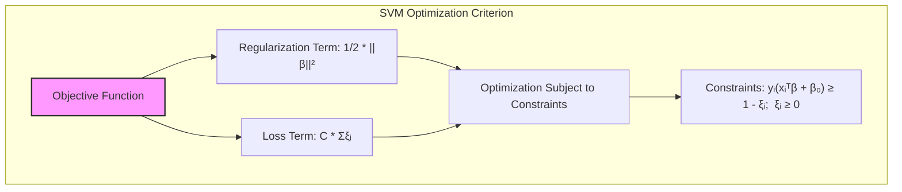
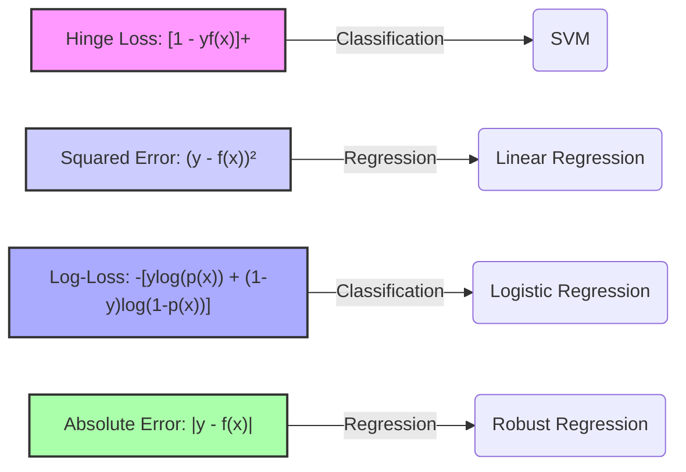
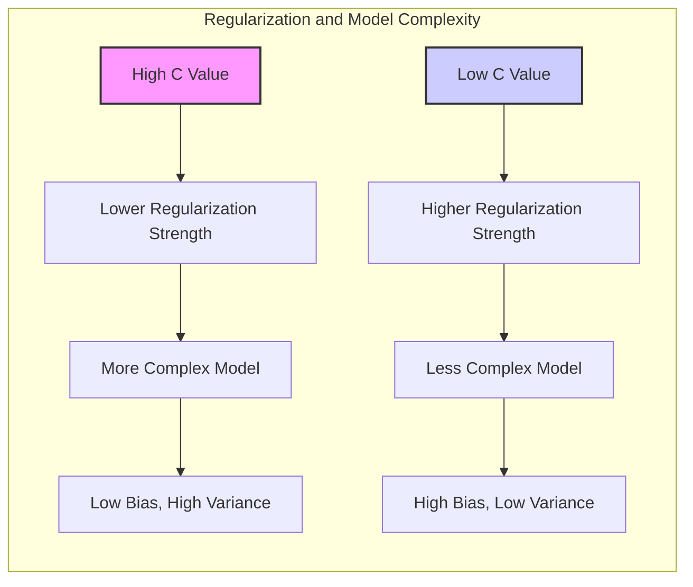
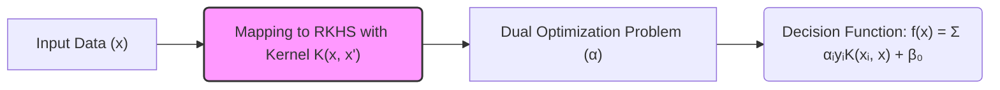

Okay, let's enhance the text with practical numerical examples to solidify the understanding of SVMs as a penalized regression approach in RKHS.

## Título: SVMs como Regressão Penalizada em RKHS: Uma Abordagem de Ajuste de Função

### Introdução

Além da visão tradicional das **Support Vector Machines (SVMs)** como métodos de classificação baseados na maximização da margem, as SVMs também podem ser interpretadas como uma forma de **regressão penalizada** em um **Espaço de Hilbert com Kernel Reprodutor (RKHS)**. Essa perspectiva oferece uma visão complementar sobre o funcionamento das SVMs, conectando-as com outros métodos de ajuste de função e destacando o papel da regularização na construção de modelos robustos e com boa capacidade de generalização.

Neste capítulo, vamos analisar a SVM como um problema de ajuste de função, onde o objetivo é encontrar uma função que minimiza um certo erro, sujeito a uma restrição de regularização que controla a complexidade do modelo. Discutiremos como a função de perda *hinge loss* e o termo de regularização em SVMs se relacionam com outras funções de perda e regularizações comuns em problemas de regressão. Exploraremos como a teoria dos RKHS fornece uma base para entender a relação entre as funções *kernel* e as funções de ajuste no espaço de *features* transformado.

A visão das SVMs como um método de regressão penalizada em um RKHS oferece *insights* valiosos sobre as propriedades dos modelos SVM e sua conexão com outras técnicas de aprendizado de máquina, o que contribui para uma compreensão mais profunda do funcionamento e das aplicações das SVMs.

### SVMs como um Problema de Ajuste de Função

**Conceito 1: O Problema de Ajuste de Função e a Minimização do Risco Empírico**

No aprendizado de máquina, o problema de ajuste de função consiste em encontrar uma função $f(x)$ que se aproxima o máximo possível dos valores de resposta $y$ em função das *features* $x$. Em muitos problemas, como a regressão, o objetivo é encontrar uma função que minimize um certo erro ou perda entre a função $f(x)$ e o valor de resposta $y$. Essa busca é geralmente feita através da minimização do risco empírico:

$$ \min_f \frac{1}{N} \sum_{i=1}^{N} L(y_i, f(x_i)) $$

onde $L(y_i, f(x_i))$ é uma função de perda que quantifica o erro entre a predição $f(x_i)$ e o valor de resposta $y_i$.

No contexto de classificação, o problema de ajuste de função consiste em encontrar uma função $f(x)$ que separe as classes de forma adequada, e a função de perda mede a inadequação da classificação. A função de perda é a medida utilizada para definir quão errado um modelo está em relação à tarefa de aprender.

**Lemma 1:** O problema de ajuste de função consiste em encontrar uma função $f(x)$ que minimize uma função de perda, a qual quantifica a diferença entre as predições e os valores de resposta.

A demonstração desse lemma se baseia na análise da formulação geral de problemas de aprendizado de máquina, onde o objetivo é minimizar o erro entre a predição do modelo e o valor desejado.

**Conceito 2: O Critério de Otimização das SVMs como um Ajuste de Função Penalizado**

O critério de otimização das SVMs, para o caso não separável, pode ser expresso como:

$$ \min_{\beta, \beta_0, \xi} \frac{1}{2} ||\beta||^2 + C \sum_{i=1}^{N} \xi_i $$

sujeito a:

$$ y_i(x_i^T\beta + \beta_0) \geq 1 - \xi_i, \quad \forall i $$
$$ \xi_i \geq 0, \quad \forall i $$

Esse critério pode ser interpretado como um problema de ajuste de função penalizado, onde:

*   O termo $\frac{1}{2} ||\beta||^2$ é um termo de regularização que penaliza a complexidade da função de decisão, mantendo os coeficientes do modelo pequenos e controlando o *overfitting*.
*   O termo $C \sum_{i=1}^{N} \xi_i$ é um termo que penaliza os erros de classificação (as amostras que violam a margem). As variáveis de folga $\xi_i$ são utilizadas para representar o grau de inadequação dos dados em relação à margem. A restrição $\xi_i \geq 0$ garante que as variáveis de folga sejam não negativas, o que faz com que o modelo não seja penalizado por erros nulos ou pequenos.

A restrição $y_i(x_i^T\beta + \beta_0) \geq 1 - \xi_i$ pode ser vista como uma forma de definir uma função de perda específica, conhecida como ***hinge loss***, que é dada por:

$$ L(y_i, f(x_i)) = [1 - y_i f(x_i)]_+ $$

onde $f(x_i) = x_i^T\beta + \beta_0$, e $[z]_+$ significa que se o valor dentro do colchete for positivo, o resultado é o próprio valor, e se for negativo, o resultado é 0. O *hinge loss* penaliza erros de classificação, mas não penaliza pontos que estão corretamente classificados e a uma distância suficiente do hiperplano de decisão.

> 💡 **Exemplo Numérico:**
>
> Considere um problema de classificação binária com duas amostras:
>
> - Amostra 1: $x_1 = [1, 2]$, $y_1 = 1$
> - Amostra 2: $x_2 = [2, 1]$, $y_2 = -1$
>
> Suponha que após a otimização, tenhamos os seguintes parâmetros para o SVM:
>
> - $\beta = [-0.5, 0.5]$
> - $\beta_0 = 0.2$
>
> Vamos calcular o valor da função de decisão $f(x)$ para cada amostra:
>
> $f(x_1) = x_1^T\beta + \beta_0 = [1, 2] \cdot [-0.5, 0.5] + 0.2 = -0.5 + 1 + 0.2 = 0.7$
>
> $f(x_2) = x_2^T\beta + \beta_0 = [2, 1] \cdot [-0.5, 0.5] + 0.2 = -1 + 0.5 + 0.2 = -0.3$
>
> Agora, vamos calcular o *hinge loss* para cada amostra:
>
> $L(y_1, f(x_1)) = [1 - y_1 f(x_1)]_+ = [1 - 1 * 0.7]_+ = [0.3]_+ = 0.3$
>
> $L(y_2, f(x_2)) = [1 - y_2 f(x_2)]_+ = [1 - (-1) * (-0.3)]_+ = [1 - 0.3]_+ = [0.7]_+ = 0.7$
>
> Observe que ambas as amostras têm *hinge loss* diferente de zero, pois nenhuma está no lado correto da margem com uma distância maior ou igual a 1. O modelo tentará minimizar a soma desses *losses* penalizando os erros de classificação, juntamente com o termo de regularização.

**Corolário 1:** As SVMs podem ser interpretadas como um método de ajuste de função penalizado, onde a função de custo combina um termo de regularização que controla a complexidade do modelo com uma função de perda que penaliza os erros de classificação.

A demonstração desse corolário se baseia na análise da função de custo das SVMs, que pode ser decomposta em um termo de regularização (a norma ao quadrado de $\beta$) e uma função de perda (*hinge loss*).

### A Função de Perda Hinge Loss e Outras Alternativas

A função de perda **hinge loss**, utilizada nas SVMs, é uma função específica projetada para problemas de classificação. A função de perda *hinge loss* é definida como:

$$ L(y, f(x)) = [1 - y f(x)]_+ $$

onde $y \in \{-1, 1\}$ é o rótulo da classe e $f(x)$ é a função de decisão. A função *hinge loss* penaliza linearmente erros de classificação e não penaliza pontos que estão corretamente classificados e a uma distância suficiente da margem. A propriedade de não penalizar os dados corretamente classificados leva à esparsidade da solução, onde o modelo só depende dos vetores de suporte.

Outras funções de perda comuns em problemas de regressão e classificação incluem:

1.  **Erro Quadrático:**
    $$ L(y, f(x)) = (y - f(x))^2 $$
    O erro quadrático é uma função de perda comum em problemas de regressão e penaliza fortemente erros grandes, o que a torna sensível a *outliers*.
2.  **Log-Loss ou Entropia Cruzada:**
    $$ L(y, f(x)) = - [y \log(p(x)) + (1-y) \log(1-p(x))] $$
    onde $p(x)$ é a probabilidade de pertencer à classe 1, e essa função é utilizada em problemas de classificação logística. O log-loss penaliza o modelo de forma mais suave quando as classes são mais sobrepostas.
3.  **Erro Absoluto:**
    $$ L(y, f(x)) = |y - f(x)| $$
    O erro absoluto é uma função de perda robusta a *outliers*, mas não é diferenciável na origem, o que dificulta sua otimização usando gradiente.

Cada função de perda tem características e propriedades específicas, e a escolha da função de perda apropriada depende da natureza do problema e das propriedades que se desejam obter no modelo resultante. A função *hinge loss* é uma escolha adequada para problemas de classificação, pois ela leva à maximização da margem, à esparsidade dos modelos (somente os vetores de suporte são importantes para a solução) e à robustez em relação a dados ruidosos ou *outliers*.

> 💡 **Exemplo Numérico:**
>
> Vamos comparar o *hinge loss* com o erro quadrático para o mesmo exemplo anterior:
>
> - Amostra 1: $x_1 = [1, 2]$, $y_1 = 1$, $f(x_1) = 0.7$
> - Amostra 2: $x_2 = [2, 1]$, $y_2 = -1$, $f(x_2) = -0.3$
>
> *Hinge Loss* (já calculado):
>
> $L_{hinge}(y_1, f(x_1)) = 0.3$
> $L_{hinge}(y_2, f(x_2)) = 0.7$
>
> Erro Quadrático:
>
> $L_{quad}(y_1, f(x_1)) = (y_1 - f(x_1))^2 = (1 - 0.7)^2 = 0.09$
> $L_{quad}(y_2, f(x_2)) = (y_2 - f(x_2))^2 = (-1 - (-0.3))^2 = (-0.7)^2 = 0.49$
>
> Observe que o *hinge loss* atribui um valor maior de perda para amostras que estão dentro da margem ou classificadas incorretamente, enquanto o erro quadrático penaliza o erro de predição em si. Para a amostra 1, que está no lado correto mas dentro da margem, o *hinge loss* é maior que o erro quadrático. Para a amostra 2, que está no lado errado, o *hinge loss* também é maior.
>
> Para um exemplo de regressão, considere que $y_1=2$ e $f(x_1)=1.5$, e $y_2=5$ e $f(x_2)=6$.
>
> Erro Quadrático:
>
> $L_{quad}(y_1, f(x_1)) = (y_1 - f(x_1))^2 = (2 - 1.5)^2 = 0.25$
> $L_{quad}(y_2, f(x_2)) = (y_2 - f(x_2))^2 = (5 - 6)^2 = 1$
>
> Erro Absoluto:
>
> $L_{abs}(y_1, f(x_1)) = |y_1 - f(x_1)| = |2 - 1.5| = 0.5$
> $L_{abs}(y_2, f(x_2)) = |y_2 - f(x_2)| = |5 - 6| = 1$

**Lemma 3:** A função de perda *hinge loss* em SVMs leva à maximização da margem e a modelos esparsos, onde a solução depende apenas dos vetores de suporte, e com boa robustez a *outliers*.

A demonstração desse lemma se baseia na análise da forma da função de perda *hinge loss*, que é zero para pontos que estão no lado correto da margem e cresce linearmente para pontos classificados incorretamente. A natureza da função leva a soluções esparsas, onde apenas vetores de suporte são importantes, e a margem de separação leva a modelos mais robustos a *outliers*.

### Regularização em SVMs e o Controle da Complexidade do Modelo

O termo $\frac{1}{2} ||\beta||^2$ na função de custo das SVMs é um termo de **regularização**, especificamente a regularização L2, também conhecida como regularização *ridge*, que penaliza a complexidade da função de decisão e ajuda a evitar o *overfitting*. A regularização L2 adiciona à função de custo a soma dos quadrados dos coeficientes do modelo, o que reduz a magnitude desses coeficientes e torna o modelo mais estável.

A regularização também influencia a escolha dos vetores de suporte. Ao reduzir a magnitude dos coeficientes, a regularização L2 faz com que menos amostras se tornem vetores de suporte, o que leva a modelos mais simples e com melhor capacidade de generalização.

A escolha do parâmetro de regularização $C$ controla a força da regularização. Valores altos de $C$ levam a modelos mais complexos, com menor regularização, enquanto valores baixos de $C$ levam a modelos mais simples, com maior regularização, como já mencionado em [^12.2].

> 💡 **Exemplo Numérico:**
>
> Vamos considerar o mesmo problema de classificação e comparar o efeito de diferentes valores de $C$. Para simplificar, vamos assumir que, após o treinamento com $C=1$, encontramos $\beta = [-0.5, 0.5]$. Agora, vamos treinar com um valor de $C=0.1$ (maior regularização) e $C=10$ (menor regularização).
>
> Com $C=0.1$, a regularização é mais forte, e o modelo tende a ter coeficientes menores. Suponha que o modelo encontre $\beta = [-0.2, 0.2]$.
>
> Com $C=10$, a regularização é mais fraca, e o modelo tem mais liberdade para ajustar os dados. Suponha que o modelo encontre $\beta = [-0.8, 0.8]$.
>
> A norma L2 de $\beta$ para cada caso é:
>
> -  $C=0.1$: $||\beta||^2 = (-0.2)^2 + (0.2)^2 = 0.08$
> -  $C=1$: $||\beta||^2 = (-0.5)^2 + (0.5)^2 = 0.5$
> -  $C=10$: $||\beta||^2 = (-0.8)^2 + (0.8)^2 = 1.28$
>
> O termo de regularização $\frac{1}{2} ||\beta||^2$ será maior para $C=10$ do que para $C=0.1$. Isso significa que, para valores maiores de $C$, o modelo pode se ajustar mais aos dados de treinamento, mas pode ter um desempenho pior em dados não vistos, enquanto para valores menores de $C$, o modelo é mais simples e pode generalizar melhor, mas pode ter um viés maior.

A combinação do termo de regularização com a função de perda *hinge loss* é fundamental para a construção de modelos SVM robustos e com boa capacidade de generalização. A regularização controla a complexidade do modelo, enquanto a função de perda *hinge loss* promove a esparsidade da solução e leva à maximização da margem, um resultado que garante boa capacidade de generalização.

**Corolário 2:** A regularização L2 e a escolha do parâmetro C controlam a complexidade do modelo SVM e seu comportamento em dados de treinamento e teste, e um equilíbrio apropriado entre complexidade e ajuste é crucial para um bom desempenho.

A demonstração desse corolário se baseia na análise da função de custo da SVM e como o termo de regularização L2 e o parâmetro C afetam a magnitude dos coeficientes e o número de vetores de suporte, e, por consequência, a generalização do modelo.

### Conexão com o Problema Dual e o Uso de Kernels

A utilização de **kernels** em SVMs transforma o espaço de *features* e permite que o modelo construa fronteiras de decisão não lineares. A função de custo das SVMs com *kernels* pode ser expressa como:

$$ \min_{\alpha} \frac{1}{2} \sum_{i=1}^{N} \sum_{j=1}^{N} \alpha_i \alpha_j y_i y_j K(x_i, x_j) - \sum_{i=1}^{N} \alpha_i $$
sujeito a:
$$ 0 \leq \alpha_i \leq C $$
$$ \sum_{i=1}^{N} \alpha_i y_i = 0 $$

Nessa formulação, a função *kernel* $K(x_i, x_j)$ substitui o produto interno $x_i^T x_j$ no espaço original de *features*, e os parâmetros do modelo são determinados através da maximização da função objetivo acima, e sujeitos às restrições de igualdade e desigualdade.

The decision function of the kernel SVM is given by:
$$ f(x) = \sum_{i \in SV} \alpha_i y_i K(x_i, x) + \beta_0 $$

where support vectors, constants $\alpha_i$ and bias $\beta_0$ are defined according to the KKT conditions and the optimization criteria of the dual problem.

A função de decisão da SVM com *kernel* é dada por:

$$ f(x) = \sum_{i \in SV} \alpha_i y_i K(x_i, x) + \beta_0 $$

onde os vetores de suporte, as constantes $\alpha_i$ e o *bias* $\beta_0$ são definidos de acordo com as condições KKT e o critério de otimização do problema dual.

A utilização de *kernels* no contexto da função de perda e regularização das SVMs permite construir modelos complexos e capazes de lidar com dados de alta dimensão, sem explicitar a transformação para o espaço de *features* transformado.

> 💡 **Exemplo Numérico:**
>
> Vamos considerar um exemplo com um *kernel* linear e outro com um *kernel* gaussiano (RBF). Suponha que temos duas amostras:
>
> - $x_1 = [1, 1]$, $y_1 = 1$
> - $x_2 = [2, 2]$, $y_2 = -1$
>
> *Kernel* Linear: $K(x_i, x_j) = x_i^T x_j$
>
> $K(x_1, x_1) = [1, 1] \cdot [1, 1] = 2$
> $K(x_1, x_2) = [1, 1] \cdot [2, 2] = 4$
> $K(x_2, x_1) = [2, 2] \cdot [1, 1] = 4$
> $K(x_2, x_2) = [2, 2] \cdot [2, 2] = 8$
>
> *Kernel* Gaussiano (RBF): $K(x_i, x_j) = \exp(-\gamma ||x_i - x_j||^2)$, com $\gamma = 0.5$
>
> $K(x_1, x_1) = \exp(-0.5 * 0) = 1$
> $K(x_1, x_2) = \exp(-0.5 * ||[1, 1] - [2, 2]||^2) = \exp(-0.5 * (1^2 + 1^2)) = \exp(-1) \approx 0.368$
> $K(x_2, x_1) = \exp(-0.5 * ||[2, 2] - [1, 1]||^2) = \exp(-0.5 * (1^2 + 1^2)) = \exp(-1) \approx 0.368$
> $K(x_2, x_2) = \exp(-0.5 * 0) = 1$
>
> Usando esses valores de *kernel*, o problema de otimização dual é resolvido para encontrar os valores de $\alpha_i$. Se por exemplo, após a otimização, $\alpha_1 = 0.5$, $\alpha_2 = 0.2$, e $\beta_0=0.1$, a função de decisão para um novo ponto $x=[1.5, 1.5]$ usando o *kernel* linear seria:
>
> $f(x) = \alpha_1 y_1 K(x_1, x) + \alpha_2 y_2 K(x_2, x) + \beta_0$
>
> $K(x_1, x) = [1, 1] \cdot [1.5, 1.5] = 3$
> $K(x_2, x) = [2, 2] \cdot [1.5, 1.5] = 6$
>
> $f(x) = 0.5 * 1 * 3 + 0.2 * (-1) * 6 + 0.1 = 1.5 - 1.2 + 0.1 = 0.4$
>
> A função de decisão para um novo ponto $x=[1.5, 1.5]$ usando o *kernel* gaussiano (RBF) seria:
>
> $K(x_1, x) = \exp(-0.5 * ||[1, 1] - [1.5, 1.5]||^2) = \exp(-0.5 * (0.5^2 + 0.5^2)) \approx 0.882$
> $K(x_2, x) = \exp(-0.5 * ||[2, 2] - [1.5, 1.5]||^2) = \exp(-0.5 * (0.5^2 + 0.5^2)) \approx 0.882$
>
> $f(x) = 0.5 * 1 * 0.882 + 0.2 * (-1) * 0.882 + 0.1 = 0.441 - 0.1764 + 0.1 =  0.3646$
>
> Observe que a escolha do *kernel* influencia o resultado da função de decisão.

**Corolário 3:** O uso de *kernels* em SVMs, juntamente com a função de perda *hinge loss* e o termo de regularização, leva a modelos com bom desempenho e com capacidade de generalizar para novos dados.

A demonstração desse corolário se baseia na análise da formulação da SVM com *kernels*, e como a função de perda *hinge loss* leva à maximização da margem e à esparsidade da solução, e como o termo de regularização controla a complexidade do modelo, e os *kernels* mapeiam os dados em espaços de alta dimensão, que permite modelar relações não lineares.

### Conclusão

Neste capítulo, exploramos a visão das **Support Vector Machines (SVMs)** como um método de **regressão penalizada** em um **Espaço de Hilbert com Kernel Reprodutor (RKHS)**. Vimos como a função de custo das SVMs combina um termo de regularização com uma função de perda *hinge loss*, e como essa combinação leva a modelos robustos e com boa capacidade de generalização.

Analisamos a função de perda *hinge loss* e como ela se compara a outras funções de perda comuns em problemas de regressão e classificação. Vimos como a regularização L2 controla a complexidade do modelo e como o parâmetro $C$ determina o compromisso entre a maximização da margem e a tolerância a erros. Exploramos também como o *kernel trick* é utilizado para mapear os dados para um espaço de alta dimensão, transformando um problema de classificação não linear em um problema linear no espaço de *features* transformado.

A compreensão das SVMs como um método de regressão penalizada em um RKHS proporciona uma visão complementar sobre a formulação desse método e sua relação com outras técnicas de aprendizado de máquina. A combinação da teoria dos RKHS com a utilização de *kernels* e a formulação do problema de otimização fazem das SVMs uma ferramenta poderosa e flexível para problemas de classificação e regressão.

### Footnotes

[^12.1]: "In this chapter we describe generalizations of linear decision boundaries for classification. Optimal separating hyperplanes are introduced in Chapter 4 for the case when two classes are linearly separable. Here we cover extensions to the nonseparable case, where the classes overlap. These techniques are then generalized to what is known as the support vector machine, which produces nonlinear boundaries by constructing a linear boundary in a large, transformed version of the feature space." *(Trecho de  "Support Vector Machines and Flexible Discriminants")*

[^12.2]: "In Chapter 4 we discussed a technique for constructing an optimal separating hyperplane between two perfectly separated classes. We review this and generalize to the nonseparable case, where the classes may not be separable by a linear boundary." *(Trecho de  "Support Vector Machines and Flexible Discriminants")*

[^12.3]: "The support vector machine classifier is an extension of this idea, where the dimension of the enlarged space is allowed to get very large, infinite in some cases. It might seem that the computations would become prohibitive. It would also seem that with sufficient basis functions, the data would be separable, and overfitting would occur. We first show how the SVM technology deals with these issues. We then see that in fact the SVM classifier is solving a function-fitting problem using a particular criterion and form of regularization, and is part of a much bigger class of problems that includes the smoothing splines of Chapter 5." *(Trecho de  "Support Vector Machines and Flexible Discriminants")*
