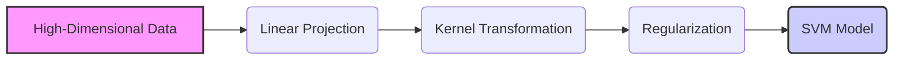
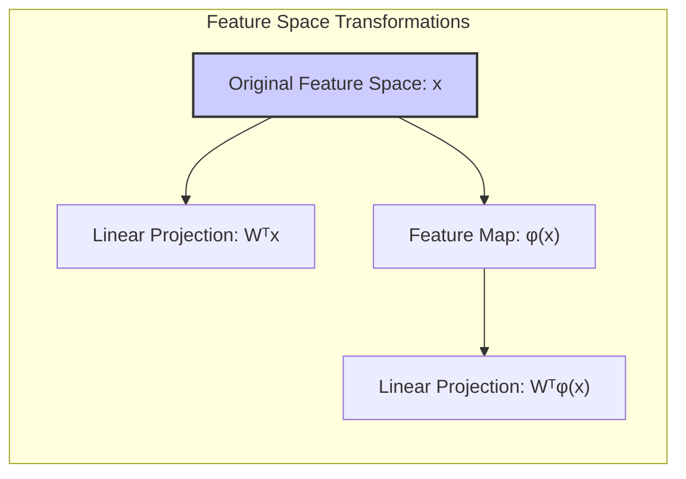
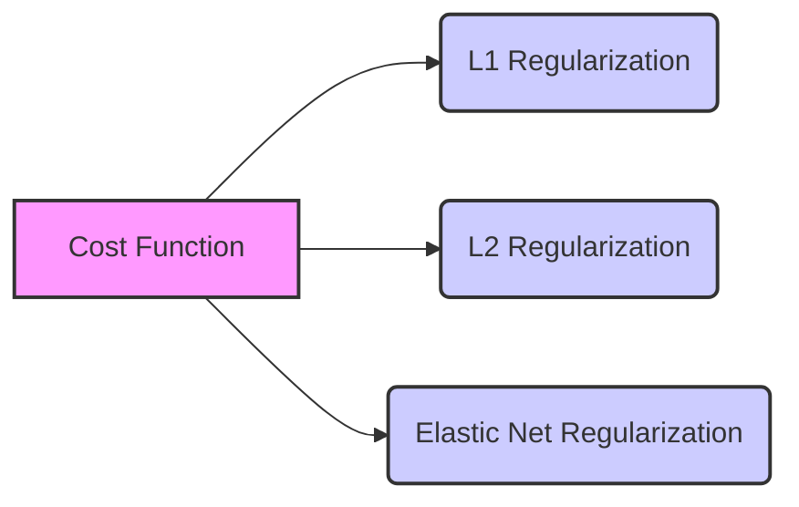
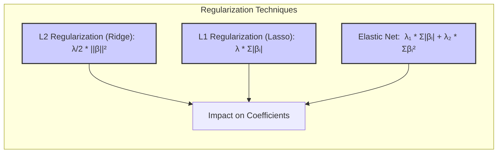
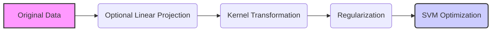
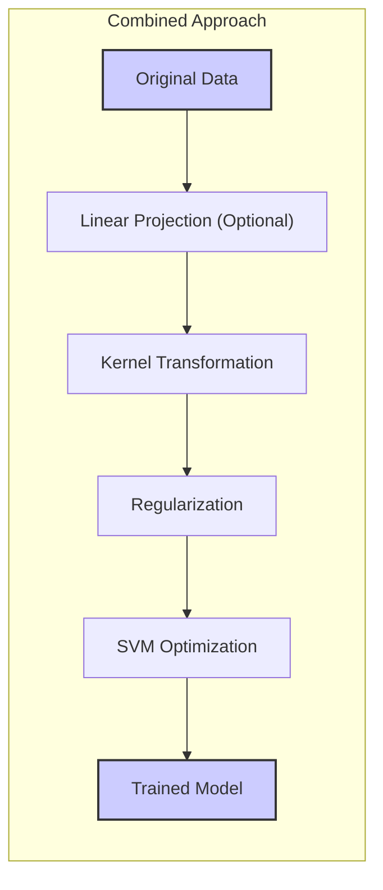

Okay, let's enhance the text with practical numerical examples to illustrate the concepts discussed.

## Título: SVMs em Espaços de Alta Dimensionalidade: Projeções Lineares e Regularização com Métodos Kernel



### Introdução

Em muitos problemas de aprendizado de máquina, especialmente aqueles que envolvem dados complexos, como imagens e texto, a dimensionalidade do espaço de *features* pode ser extremamente alta. A aplicação direta de **Support Vector Machines (SVMs)** em espaços de alta dimensão pode ser computacionalmente custosa e pode levar a problemas de *overfitting*. Neste capítulo, exploraremos estratégias para lidar com dados de alta dimensionalidade, combinando **métodos kernel** com **projeções lineares** em diferentes espaços de *features* e técnicas de **regularização**.

A combinação de projeções lineares e métodos *kernel* oferece uma abordagem flexível e poderosa para construir modelos SVM eficientes e com boa capacidade de generalização em dados de alta dimensão. As projeções lineares podem ser utilizadas para reduzir a dimensionalidade dos dados antes de aplicar o *kernel trick*, enquanto a regularização controla a complexidade do modelo e evita o *overfitting*. Essas abordagens também podem ser utilizadas para facilitar a interpretação dos modelos SVM em dados de alta dimensão.

Neste capítulo, analisaremos como as funções de base (explícita ou implicitamente com o uso de *kernels*) são combinadas com projeções lineares e técnicas de regularização, e como essas técnicas são utilizadas na construção de modelos SVM eficientes em espaços de alta dimensão.

### Projeções Lineares em Diferentes Espaços de Features

**Conceito 1: Projeções Lineares e Redução de Dimensionalidade**

As **projeções lineares** são utilizadas para mapear os dados de um espaço de *features* de alta dimensão para um espaço de *features* de menor dimensão. As projeções lineares podem ser realizadas através da multiplicação dos dados por uma matriz de projeção, que é obtida através de diferentes técnicas de redução de dimensionalidade, como a **Análise de Componentes Principais (PCA)** ou a **Análise Discriminante Linear (LDA)**.

Formalmente, dado um vetor de *features* $x \in \mathbb{R}^p$, a projeção linear $x'$ para um espaço de dimensão $k < p$ é dada por:

$$ x' = W^T x $$

onde $W$ é uma matriz de projeção de dimensão $p \times k$, cujas colunas representam os eixos do novo espaço. As componentes das novas *features* $x'$ são obtidas como uma combinação linear das *features* originais, com os pesos dados pelas entradas da matriz $W$.

The process of dimensionality reduction using linear projections is shown below:


A redução da dimensionalidade por projeção linear tem como objetivo selecionar as *features* mais relevantes e eliminar as *features* redundantes ou pouco informativas, o que leva a modelos mais eficientes e menos propensos ao *overfitting*.

> 💡 **Exemplo Numérico:**
>
> Vamos considerar um exemplo simples com um vetor de *features* $x$ em $\mathbb{R}^3$ e uma matriz de projeção $W$ para reduzir a dimensionalidade para 2.
>
> Suponha que temos:
>
> $$ x = \begin{bmatrix} 1 \\ 2 \\ 3 \end{bmatrix} $$
>
> E uma matriz de projeção $W$ de dimensão $3 \times 2$:
>
> $$ W = \begin{bmatrix} 0.5 & 0.2 \\ 0.3 & 0.8 \\ 0.1 & 0.4 \end{bmatrix} $$
>
> A projeção linear $x'$ é calculada como:
>
> $$ x' = W^T x = \begin{bmatrix} 0.5 & 0.3 & 0.1 \\ 0.2 & 0.8 & 0.4 \end{bmatrix} \begin{bmatrix} 1 \\ 2 \\ 3 \end{bmatrix} = \begin{bmatrix} 0.5 \cdot 1 + 0.3 \cdot 2 + 0.1 \cdot 3 \\ 0.2 \cdot 1 + 0.8 \cdot 2 + 0.4 \cdot 3 \end{bmatrix} = \begin{bmatrix} 1.4 \\ 3 \end{bmatrix} $$
>
> Assim, o vetor de *features* original $x$ de dimensão 3 é projetado em um novo vetor $x'$ de dimensão 2. A matriz $W$ efetivamente combina as *features* originais em novas representações de menor dimensionalidade.

**Lemma 1:** As projeções lineares podem ser utilizadas para mapear os dados de um espaço de *features* de alta dimensão para um espaço de menor dimensão, preservando a maior parte da informação relevante e reduzindo a complexidade do modelo.

A demonstração desse lemma se baseia na análise da transformação linear, que projeta os dados em um subespaço de dimensão menor, e como essa transformação seleciona componentes mais relevantes dos dados, eliminando as redundâncias.

**Conceito 2: Projeções Lineares em Conjunto com Funções de Base e Kernels**

As projeções lineares podem ser aplicadas tanto no espaço original de *features* quanto no espaço de *features* transformado por funções de base.

*   **Projeções Lineares no Espaço Original:** Nesse caso, as projeções lineares são aplicadas diretamente aos dados de entrada antes da aplicação do *kernel*. Essa abordagem pode ser usada quando a dimensionalidade do espaço original é muito alta, e a projeção linear é utilizada para reduzir a dimensão dos dados antes de aplicar o *kernel trick*.

*   **Projeções Lineares no Espaço de Features Transformado:** Nesse caso, as projeções lineares são aplicadas às *features* transformadas por uma função de base, que pode ser a transformação explícita $\phi(x)$ associada a um *kernel* ou uma transformação definida por funções de base polinomiais, radiais ou outras. Essa abordagem permite combinar a flexibilidade das transformações não lineares de *kernel* com as vantagens da redução de dimensionalidade.



Ao aplicar projeções lineares aos dados transformados (ou não), o modelo SVM constrói um hiperplano separador linear no espaço de *features* de dimensão reduzida. Essa combinação de projeções lineares com a utilização do *kernel trick* permite construir modelos SVM eficientes e com boa capacidade de generalização em dados de alta dimensão.

> 💡 **Exemplo Numérico:**
>
> Vamos expandir o exemplo anterior. Suponha que, após a projeção linear, desejamos aplicar um *kernel* polinomial de grau 2. Primeiro, vamos aplicar a projeção linear e, depois, aplicar o *kernel*.
>
> Tínhamos $x = \begin{bmatrix} 1 \\ 2 \\ 3 \end{bmatrix}$ e $x' = \begin{bmatrix} 1.4 \\ 3 \end{bmatrix}$.
>
> Agora, vamos usar um *kernel* polinomial de grau 2, que transforma $x'$ em um espaço de maior dimensão. A transformação para um *kernel* polinomial de grau 2 é dada por $\phi(x') = [1, x_1', x_2', x_1'^2, x_2'^2, x_1'x_2']$, onde $x' = [x_1', x_2']$.
>
> Então, $\phi(x') = [1, 1.4, 3, 1.4^2, 3^2, 1.4 \cdot 3] = [1, 1.4, 3, 1.96, 9, 4.2]$.
>
> A projeção linear reduziu a dimensão e o *kernel* polinomial expandiu a representação para um espaço de dimensão mais alta, permitindo que o SVM capture não-linearidades.

**Corolário 1:** As projeções lineares podem ser utilizadas para reduzir a dimensionalidade tanto do espaço original das *features* como do espaço de *features* transformado por funções de base, permitindo construir modelos SVM mais eficientes e com melhor capacidade de generalização.

A demonstração desse corolário se baseia na análise da natureza da transformação linear e como ela pode ser utilizada para reduzir o número de *features* necessárias para representar a informação dos dados, o que leva a modelos mais simples e eficientes.

### Regularização em Espaços de Alta Dimensionalidade



Em espaços de alta dimensionalidade, a **regularização** é uma técnica fundamental para controlar a complexidade dos modelos SVM e evitar o *overfitting*. A regularização adiciona um termo de penalização à função de custo, que restringe a magnitude dos coeficientes do modelo, levando a modelos mais simples, robustos e com melhor capacidade de generalização.

A regularização pode ser aplicada de diferentes formas:

1.  **Regularização L2 (Ridge):** A regularização L2 penaliza a soma dos quadrados dos coeficientes do modelo:
    $$ \frac{1}{2} ||\beta||^2 $$
    Essa forma de regularização reduz a magnitude dos coeficientes, mas não os força a serem exatamente zero, o que resulta em modelos mais estáveis, mas não necessariamente esparsos.
2.  **Regularização L1 (Lasso):** A regularização L1 penaliza a soma dos valores absolutos dos coeficientes do modelo:
    $$ \lambda \sum_{i=1}^p |\beta_i| $$
    Essa forma de regularização leva a modelos esparsos, onde alguns coeficientes são exatamente zero, o que realiza a seleção de *features* e facilita a interpretabilidade do modelo.
3.  **Regularização Elástica (Elastic Net):** A regularização elástica combina as penalizações L1 e L2:
    $$ \lambda_1 \sum_{i=1}^p |\beta_i| + \lambda_2 \sum_{i=1}^p \beta_i^2 $$
    Essa forma de regularização oferece um compromisso entre a esparsidade da L1 e a estabilidade da L2, e geralmente leva a modelos mais robustos e com melhor desempenho.

The different forms of regularization can be broken down as follows:


A escolha da técnica de regularização e seus parâmetros associados depende das características dos dados e dos objetivos do modelo. Em geral, a regularização L1 é mais apropriada quando se deseja obter modelos esparsos e selecionar *features* relevantes, enquanto a regularização L2 pode ser mais adequada quando o objetivo é obter modelos mais estáveis. A regularização elástica combina vantagens da L1 e L2, oferecendo uma opção mais flexível e robusta.

> 💡 **Exemplo Numérico:**
>
> Suponha que temos um modelo SVM com coeficientes $\beta = \begin{bmatrix} 2 \\ -3 \\ 1 \\ 0.5 \end{bmatrix}$ e queremos aplicar diferentes tipos de regularização. Vamos usar $\lambda = 0.5$ para L1 e $\lambda_1 = 0.3$, $\lambda_2 = 0.2$ para Elastic Net.
>
> *   **Regularização L2 (Ridge):**
>     $$ \frac{1}{2} ||\beta||^2 = \frac{1}{2} (2^2 + (-3)^2 + 1^2 + 0.5^2) = \frac{1}{2} (4 + 9 + 1 + 0.25) = \frac{1}{2} (14.25) = 7.125 $$
>
> *   **Regularização L1 (Lasso):**
>     $$ \lambda \sum_{i=1}^p |\beta_i| = 0.5 (|2| + |-3| + |1| + |0.5|) = 0.5 (2 + 3 + 1 + 0.5) = 0.5 (6.5) = 3.25 $$
>
> *   **Regularização Elástica (Elastic Net):**
>     $$ \lambda_1 \sum_{i=1}^p |\beta_i| + \lambda_2 \sum_{i=1}^p \beta_i^2 = 0.3 (6.5) + 0.2 (14.25) = 1.95 + 2.85 = 4.8 $$
>
> A penalidade L2 é maior por penalizar os quadrados, enquanto a L1 resulta em um valor menor devido aos valores absolutos. Elastic Net oferece um meio termo com um valor intermediário. A ideia é que na função de custo total, essas penalidades serão adicionadas para restringir o valor dos coeficientes, evitando o overfitting.

**Lemma 4:** A regularização controla a complexidade do modelo SVM em espaços de alta dimensionalidade, e a escolha da técnica de regularização e seus parâmetros depende das características do conjunto de dados e dos objetivos do modelo.

A demonstração desse lemma se baseia na análise do impacto de cada tipo de regularização na função de custo e como eles influenciam a magnitude dos coeficientes e a estrutura do modelo.

### A Combinação de Projeções Lineares, Kernels e Regularização



A combinação de **projeções lineares**, **kernels** e **regularização** oferece uma abordagem poderosa e flexível para a construção de modelos SVM eficientes e com boa capacidade de generalização em dados de alta dimensão.

In summary, the entire pipeline can be represented as:


Em resumo, o processo pode ser descrito como:

1.  **Projeção Linear (Opcional):** Aplicar uma projeção linear para reduzir a dimensão do espaço original de *features*, utilizando técnicas como PCA ou LDA.
2.  **Transformação com Funções de Base (Implícita ou Explícita):** Aplicar uma transformação não linear usando *kernels* ou funções de base explícitas.
3.  **Regularização:** Adicionar um termo de penalização na função de custo para controlar a complexidade do modelo e evitar o *overfitting*.
4.  **Otimização:** Ajustar os parâmetros do modelo (e.g., multiplicadores de Lagrange, parâmetros de *kernel* e parâmetro de regularização) através da minimização da função de custo penalizada.

A escolha apropriada de cada um desses passos depende das características específicas dos dados e do problema de aprendizado de máquina. A utilização de projeções lineares pode reduzir o custo computacional da aplicação dos *kernels*, enquanto a regularização controla o *overfitting*. A combinação dessas técnicas permite construir modelos SVM mais eficientes e com melhor capacidade de generalização em problemas de alta dimensionalidade.

> 💡 **Exemplo Numérico:**
>
> Vamos resumir o processo com um exemplo prático usando Python e `sklearn`.
>
> ```python
> import numpy as np
> from sklearn.svm import SVC
> from sklearn.preprocessing import StandardScaler
> from sklearn.pipeline import Pipeline
> from sklearn.decomposition import PCA
> from sklearn.model_selection import train_test_split
>
> # Dados de exemplo (alta dimensão)
> np.random.seed(42)
> X = np.random.rand(100, 20)
> y = np.random.randint(0, 2, 100)
>
> # Divisão em treino e teste
> X_train, X_test, y_train, y_test = train_test_split(X, y, test_size=0.3, random_state=42)
>
> # Pipeline com projeção linear (PCA), kernel e regularização
> pipeline = Pipeline([
>     ('scaler', StandardScaler()),
>     ('pca', PCA(n_components=10)),
>     ('svm', SVC(kernel='rbf', C=1.0, gamma='scale')) # C controla a regularização
> ])
>
> # Treinamento do modelo
> pipeline.fit(X_train, y_train)
>
> # Avaliação do modelo
> accuracy = pipeline.score(X_test, y_test)
> print(f"Acurácia do modelo: {accuracy}")
>
> # Exemplo sem PCA
> pipeline_no_pca = Pipeline([
>     ('scaler', StandardScaler()),
>     ('svm', SVC(kernel='rbf', C=1.0, gamma='scale'))
> ])
> pipeline_no_pca.fit(X_train, y_train)
> accuracy_no_pca = pipeline_no_pca.score(X_test, y_test)
> print(f"Acurácia do modelo sem PCA: {accuracy_no_pca}")
> ```
>
> Neste exemplo, criamos um pipeline que primeiro escala os dados, depois aplica o PCA para reduzir para 10 dimensões, e por fim aplica um SVM com kernel RBF e regularização definida pelo parâmetro `C`. A acurácia do modelo com e sem PCA são calculadas e impressas. Este exemplo ilustra como as técnicas podem ser combinadas na prática.

**Corolário 3:** A combinação de projeções lineares, *kernels* e regularização oferece uma abordagem flexível e robusta para a construção de modelos SVM eficientes e com boa capacidade de generalização em espaços de alta dimensão.

A demonstração desse corolário se baseia na análise de como as diferentes técnicas se complementam para resolver o problema da alta dimensionalidade e complexidade, com as projeções reduzindo o espaço de *features*, os *kernels* mapeando os dados para espaços de maior dimensão e a regularização controlando a complexidade do modelo.

### Conclusão

Neste capítulo, exploramos a utilização de **métodos *kernel* para espaços de alta dimensionalidade**, utilizando **projeções lineares** e **regularização**. Vimos como as projeções lineares podem ser utilizadas para mapear os dados para um espaço de *features* de menor dimensão, preservando a informação relevante, e como as funções de base e o *kernel trick* permitem lidar com a não linearidade em espaços de alta dimensão.

Analisamos também as técnicas de regularização (L1, L2 e elástica), que controlam a complexidade do modelo e evitam o *overfitting* em espaços de alta dimensionalidade. A combinação de projeções lineares, *kernels* e regularização oferece uma abordagem flexível e poderosa para a construção de modelos SVM eficientes e com boa capacidade de generalização.

A compreensão das técnicas discutidas neste capítulo é fundamental para a aplicação bem-sucedida das SVMs em problemas com dados de alta dimensionalidade. A escolha adequada do método de redução de dimensionalidade, do *kernel*, da técnica de regularização e de seus parâmetros associados é crucial para obter modelos robustos e com boa capacidade de generalização.

### Footnotes

[^12.1]: "In this chapter we describe generalizations of linear decision boundaries for classification. Optimal separating hyperplanes are introduced in Chapter 4 for the case when two classes are linearly separable. Here we cover extensions to the nonseparable case, where the classes overlap. These techniques are then generalized to what is known as the support vector machine, which produces nonlinear boundaries by constructing a linear boundary in a large, transformed version of the feature space." *(Trecho de  "Support Vector Machines and Flexible Discriminants")*

[^12.2]: "In Chapter 4 we discussed a technique for constructing an optimal separating hyperplane between two perfectly separated classes. We review this and generalize to the nonseparable case, where the classes may not be separable by a linear boundary." *(Trecho de  "Support Vector Machines and Flexible Discriminants")*
