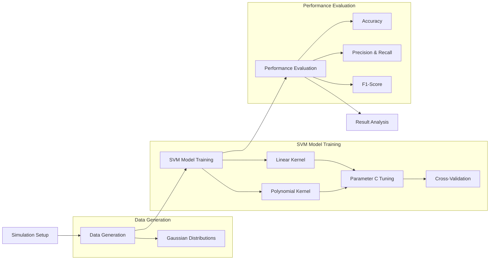
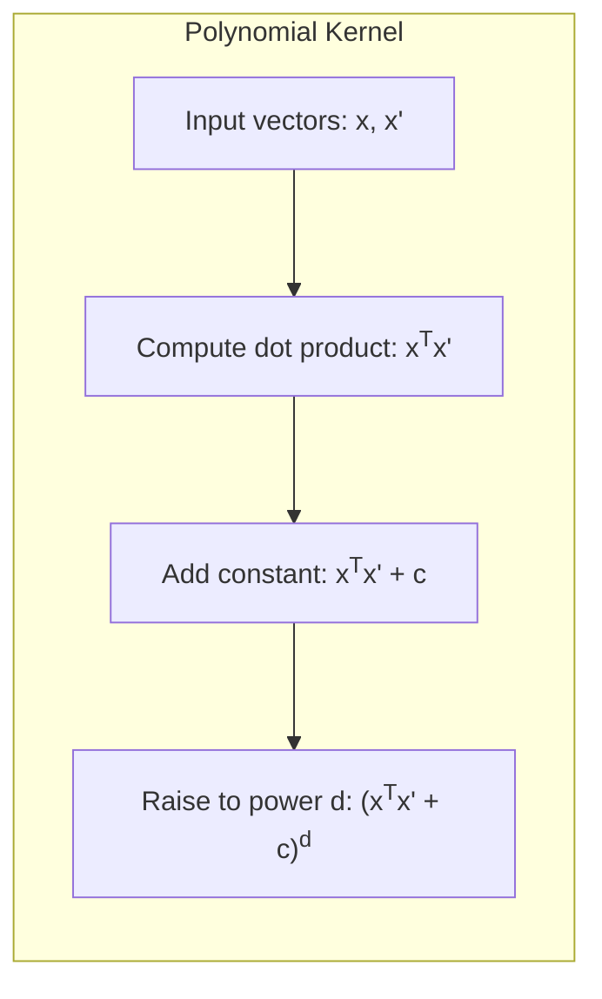
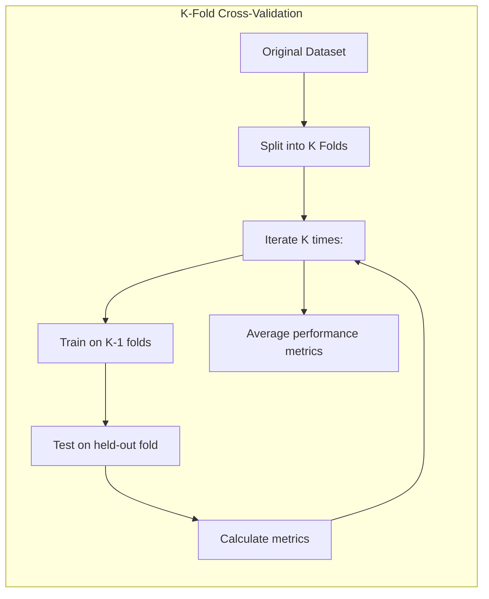
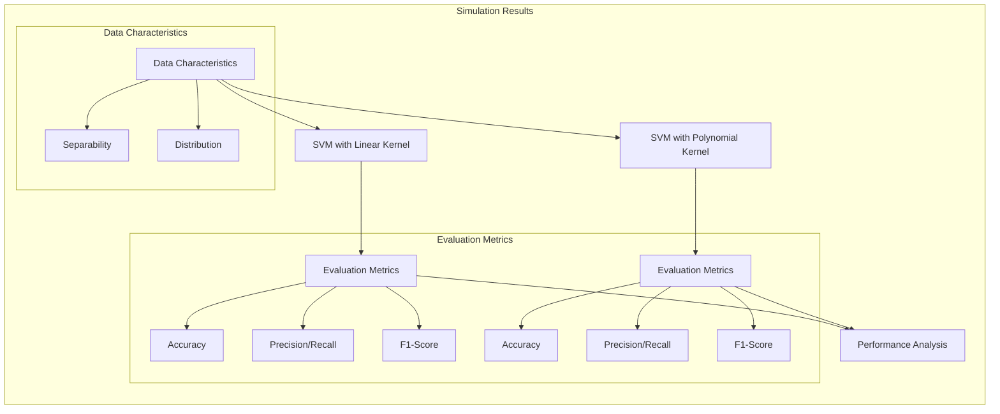

## Título: SVMs em Simulações: Avaliação de Desempenho de Kernels Polinomiais e Modelos Lineares em Dados Sintéticos



### Introdução

Para avaliar o desempenho de modelos de aprendizado de máquina em condições controladas, é comum utilizar **simulações**, onde dados são gerados artificialmente de acordo com um modelo específico. No contexto das **Support Vector Machines (SVMs)**, as simulações permitem analisar como diferentes tipos de *kernels* e seus parâmetros associados, bem como as técnicas de regularização, afetam a capacidade do modelo de classificar corretamente dados gerados a partir de distribuições conhecidas.

Neste capítulo, exploraremos o uso de SVMs em um cenário de simulação, onde geraremos dados sintéticos com diferentes características de separabilidade e avaliaremos o desempenho de modelos SVM utilizando **kernels polinomiais** de diferentes graus e modelos **lineares** (SVM com *kernel* linear). Analisaremos como a complexidade da fronteira de decisão e a capacidade de generalização do modelo variam de acordo com os parâmetros do *kernel* e a natureza dos dados gerados.

O objetivo deste capítulo é fornecer uma análise prática sobre o uso de SVMs em um ambiente simulado, demonstrando como a escolha dos parâmetros e do tipo de modelo pode influenciar o desempenho e a capacidade de adaptação a diferentes tipos de dados. A simulação também permite explorar os limites do modelo linear e da modelagem não linear por *kernels*.

### Definição do Cenário de Simulação

**Conceito 1: Geração de Dados Sintéticos para Classificação**

Para analisar o desempenho das SVMs em um ambiente controlado, vamos gerar dados sintéticos para um problema de classificação binária, com as seguintes propriedades:

1.  **Duas Classes:** Os dados serão gerados para duas classes, com rótulos $y \in \{-1, 1\}$.
2.  **Distribuição das Classes:** As amostras de cada classe serão geradas a partir de distribuições gaussianas multivariadas com médias e matrizes de covariância específicas. A escolha das médias e covariâncias permite controlar o grau de sobreposição entre as classes e a complexidade do problema de classificação.

    Por exemplo, podemos gerar dados a partir de duas gaussianas, com médias $\mu_1 = [-1, -1]$ e $\mu_2 = [1, 1]$, e covariâncias $\Sigma_1 = \Sigma_2 = I$, onde $I$ é a matriz identidade, gerando classes sobrepostas. Em outros cenários, podemos aumentar o distanciamento entre as médias para simular dados linearmente separáveis ou alterar as covariâncias para simular distribuições não isotrópicas.

    > 💡 **Exemplo Numérico:**
    > Vamos gerar 200 amostras para cada classe utilizando as médias e covariâncias descritas acima. Podemos usar a biblioteca `numpy` para isso.
    >
    ```python
    import numpy as np

    # Define as médias das gaussianas
    mu1 = np.array([-1, -1])
    mu2 = np.array([1, 1])

    # Define a matriz de covariância (identidade)
    sigma = np.array([[1, 0], [0, 1]])

    # Gera 200 amostras para cada classe
    np.random.seed(42) # Define uma semente para reprodutibilidade
    X1 = np.random.multivariate_normal(mu1, sigma, 200)
    X2 = np.random.multivariate_normal(mu2, sigma, 200)

    # Cria os rótulos
    y1 = np.ones(200) * -1  # Classe -1
    y2 = np.ones(200)       # Classe 1

    # Concatena os dados e rótulos
    X = np.concatenate((X1, X2))
    y = np.concatenate((y1, y2))
    ```
    >
    > Este código gera dados com classes sobrepostas, onde é esperado que um modelo linear tenha dificuldade em separar completamente as classes.

3.  **Número de Amostras:** O número de amostras em cada classe será determinado pelos parâmetros da simulação, e podemos controlar o tamanho do conjunto de treinamento e teste.

A simulação nos permitirá analisar como diferentes parâmetros da distribuição dos dados influenciam o desempenho dos modelos SVM e como a escolha do *kernel* e seus parâmetros se adaptam a diferentes condições de separabilidade das classes, como discutido em capítulos anteriores.

**Lemma 1:** A geração de dados sintéticos permite criar um ambiente controlado para testar e avaliar o desempenho de modelos de aprendizado de máquina, variando os parâmetros de geração para simular diferentes cenários de classificação.

A demonstração desse lemma se baseia na análise do processo de simulação, que permite controlar as características dos dados de entrada e avaliar como a escolha do modelo e seus parâmetros afetam o desempenho no cenário simulado.

**Conceito 2: Modelos SVM e Kernels Polinomiais**

Neste cenário de simulação, vamos avaliar o desempenho dos seguintes modelos:

1.  **SVM com *Kernel* Linear:** Este modelo é equivalente a uma SVM com um *kernel* linear, que gera fronteiras de decisão lineares no espaço original das *features*.

2.  **SVM com *Kernel* Polinomial:** Este modelo utiliza a função *kernel* polinomial, que permite construir fronteiras de decisão não lineares através da combinação de produtos e potências das *features* originais. A função *kernel* polinomial é definida como:

    $$ K(x, x') = (x^T x' + c)^d $$

    onde $d$ é o grau do polinômio e $c$ é uma constante. Avaliaremos o desempenho do modelo com diferentes valores de $d$, variando a complexidade do modelo.

    > 💡 **Exemplo Numérico:**
    >
    > Considere dois pontos de dados $x = [2, 1]$ e $x' = [1, 3]$. Vamos calcular o *kernel* polinomial com $c = 1$ e $d = 2$.
    >
    > $x^T x' = (2 * 1) + (1 * 3) = 2 + 3 = 5$
    >
    > $K(x, x') = (5 + 1)^2 = 6^2 = 36$
    >
    > Agora, com $d=3$:
    >
    > $K(x, x') = (5 + 1)^3 = 6^3 = 216$
    >
    > Este exemplo mostra como o grau $d$ aumenta a complexidade da função *kernel* e como ela mapeia os dados para um espaço de maior dimensão.



3. **Seleção do Parâmetro C:** O parâmetro C, que controla o compromisso entre a maximização da margem e a penalidade por erros de classificação, será ajustado para cada modelo utilizando validação cruzada.

**Corolário 1:** A utilização de modelos SVM com *kernels* lineares e polinomiais em dados sintéticos permite comparar o desempenho desses modelos em diferentes condições de separabilidade e analisar como a escolha do *kernel* afeta a complexidade da fronteira de decisão e a capacidade de generalização.

A demonstração desse corolário se baseia na análise das propriedades dos *kernels* lineares e polinomiais, e como eles geram fronteiras de decisão com diferentes níveis de complexidade.

### Avaliação do Desempenho: Métricas e Validação

Para avaliar o desempenho dos modelos SVM no ambiente simulado, utilizaremos as seguintes métricas e técnicas de avaliação:

1.  **Acurácia:** A acurácia mede a proporção de classificações corretas no conjunto de teste. A acurácia é uma métrica comum para problemas de classificação, mas ela pode não ser adequada para conjuntos de dados desbalanceados, onde uma classe tem muito mais amostras do que a outra.

2.  **Precisão e Recall:** A precisão mede a proporção de amostras corretamente classificadas como pertencentes a uma classe, entre todas as amostras classificadas como pertencentes a essa classe. O *recall* mede a proporção de amostras corretamente classificadas como pertencentes a uma classe, entre todas as amostras que realmente pertencem a essa classe. Essas métricas são úteis para conjuntos de dados desbalanceados e problemas com diferentes custos de classificação errada para cada classe.

3.  **F1-Score:** O F1-score é a média harmônica entre a precisão e o *recall*, e é uma métrica que oferece um bom compromisso entre precisão e *recall*.

4.  **Validação Cruzada:** Para escolher o valor apropriado do parâmetro C e os parâmetros do *kernel*, utilizaremos a validação cruzada k-fold, onde os dados são divididos em k partes, o modelo é treinado em k-1 partes e avaliado na parte restante. O processo é repetido k vezes, com cada parte sendo utilizada como conjunto de teste, e a média das avaliações é utilizada como estimativa do desempenho.

    > 💡 **Exemplo Numérico:**
    >
    > Vamos demonstrar a validação cruzada com k=5 usando os dados gerados anteriormente. Dividiremos os dados em 5 partes e para cada iteração, usaremos 4 partes para treinamento e 1 para teste.
    >
    ```python
    from sklearn.model_selection import KFold
    from sklearn.svm import SVC
    from sklearn.metrics import accuracy_score

    # Define o número de folds
    kf = KFold(n_splits=5, shuffle=True, random_state=42)

    # Lista para armazenar as acurácias
    accuracies = []

    # Loop através dos folds
    for train_index, test_index in kf.split(X):
        X_train, X_test = X[train_index], X[test_index]
        y_train, y_test = y[train_index], y[test_index]

        # Cria um modelo SVM com kernel linear
        model = SVC(kernel='linear', C=1)
        model.fit(X_train, y_train)
        y_pred = model.predict(X_test)

        # Calcula a acurácia e armazena
        acc = accuracy_score(y_test, y_pred)
        accuracies.append(acc)

    # Calcula a acurácia média
    mean_accuracy = np.mean(accuracies)
    print(f"Acurácia média da validação cruzada: {mean_accuracy:.4f}")
    ```
    >
    > Este código demonstra como a validação cruzada é aplicada na prática para avaliar o desempenho do modelo. A acurácia média obtida fornece uma estimativa mais robusta do desempenho do modelo em dados não vistos.



Ao analisar os resultados da simulação, prestaremos atenção na acurácia, precisão, *recall* e F1-score em cada configuração, além de observar as fronteiras de decisão e a localização dos vetores de suporte.

**Lemma 2:** A utilização de métricas como acurácia, precisão, recall e F1-score, juntamente com a validação cruzada, permite obter uma avaliação robusta do desempenho dos modelos SVM em dados de teste.

A demonstração desse lemma se baseia na análise das propriedades de cada métrica e como a validação cruzada estima o desempenho do modelo em dados não vistos, o que garante maior confiança na qualidade do modelo final.

### Resultados da Simulação e Análise



Os resultados da simulação mostrarão como o desempenho dos modelos SVM varia de acordo com o tipo de *kernel*, seus parâmetros associados, o parâmetro de regularização $C$ e a natureza da distribuição dos dados.

*   **Modelos Lineares:** Para dados linearmente separáveis (onde há pouca sobreposição entre as classes), o modelo linear geralmente apresenta um desempenho satisfatório e com baixo custo computacional. No entanto, em dados não linearmente separáveis, a performance do modelo linear é claramente inferior, o que se manifesta em uma acurácia baixa e em uma grande quantidade de erros de classificação.

    > 💡 **Exemplo Numérico:**
    >
    > Usando os dados gerados anteriormente, vamos treinar um modelo linear e avaliar seu desempenho.
    >
    ```python
    from sklearn.model_selection import train_test_split
    from sklearn.svm import SVC
    from sklearn.metrics import accuracy_score, classification_report

    # Divide os dados em treinamento e teste
    X_train, X_test, y_train, y_test = train_test_split(X, y, test_size=0.3, random_state=42)

    # Cria um modelo SVM com kernel linear
    model_linear = SVC(kernel='linear', C=1)
    model_linear.fit(X_train, y_train)
    y_pred_linear = model_linear.predict(X_test)

    # Avalia o desempenho
    accuracy_linear = accuracy_score(y_test, y_pred_linear)
    report_linear = classification_report(y_test, y_pred_linear)

    print(f"Acurácia do modelo linear: {accuracy_linear:.4f}")
    print("Relatório de classificação do modelo linear:\n", report_linear)
    ```
    >
    > Este código mostra como avaliar o desempenho de um modelo linear em dados não linearmente separáveis. É esperado que a acurácia seja menor do que para dados linearmente separáveis.

*   **Modelos Polinomiais:** O desempenho dos modelos polinomiais varia de acordo com o grau do polinômio $d$. Para valores baixos de $d$, o modelo pode apresentar baixo desempenho, pois a fronteira de decisão é muito simples para capturar a complexidade dos dados. Para valores mais altos de $d$, o modelo pode apresentar *overfitting*, ajustando-se demais aos dados de treinamento, o que resulta em baixo desempenho em dados novos. O valor adequado para $d$ depende da complexidade dos dados e deve ser escolhido através de validação cruzada.

    > 💡 **Exemplo Numérico:**
    >
    > Agora, vamos treinar um modelo polinomial com grau $d=2$ e avaliar seu desempenho.
    >
    ```python
    # Cria um modelo SVM com kernel polinomial
    model_poly = SVC(kernel='poly', degree=2, C=1)
    model_poly.fit(X_train, y_train)
    y_pred_poly = model_poly.predict(X_test)

    # Avalia o desempenho
    accuracy_poly = accuracy_score(y_test, y_pred_poly)
    report_poly = classification_report(y_test, y_pred_poly)

    print(f"Acurácia do modelo polinomial (d=2): {accuracy_poly:.4f}")
    print("Relatório de classificação do modelo polinomial (d=2):\n", report_poly)
    ```
    >
    > Este exemplo ilustra como o desempenho do modelo pode mudar com a utilização de um *kernel* polinomial, e como o parâmetro $d$ influencia a complexidade da fronteira de decisão.

*   **Impacto do Parâmetro C:** Para ambos os modelos, o parâmetro $C$ influencia o equilíbrio entre a margem de separação e a tolerância a erros. Valores altos de $C$ levam a modelos mais complexos, com menos erros de classificação nos dados de treinamento, mas com maior risco de *overfitting*. Valores baixos de $C$, por outro lado, levam a modelos mais simples, com margem maior e menor risco de *overfitting*. A escolha do valor adequado para $C$ também envolve a utilização de validação cruzada.

    > 💡 **Exemplo Numérico:**
    >
    > Vamos comparar o desempenho de um modelo com valores diferentes de $C$, utilizando validação cruzada.
    >
    ```python
    from sklearn.model_selection import GridSearchCV

    # Define os valores de C a serem testados
    param_grid = {'C': [0.1, 1, 10, 100]}

    # Cria um modelo SVM com kernel linear
    model = SVC(kernel='linear')

    # Utiliza GridSearchCV para encontrar o melhor valor de C
    grid = GridSearchCV(model, param_grid, cv=5, scoring='accuracy')
    grid.fit(X_train, y_train)

    print(f"Melhor valor de C: {grid.best_params_['C']}")
    print(f"Acurácia com melhor valor de C: {grid.best_score_:.4f}")
    ```
    >
    > Este código demonstra como o parâmetro $C$ pode ser otimizado utilizando validação cruzada, mostrando a importância de ajustar esse parâmetro para obter o melhor desempenho do modelo.

Através da análise dos resultados da simulação, será possível obter *insights* sobre a influência dos diferentes parâmetros no desempenho das SVMs e como ajustar esses parâmetros para obter modelos com bom desempenho e boa capacidade de generalização.

**Corolário 2:** A simulação permite analisar o comportamento dos modelos SVM e como a escolha do *kernel* e seus parâmetros associados, juntamente com o ajuste do parâmetro C, afetam a capacidade de generalização e a eficiência do modelo.

A demonstração desse corolário se baseia na análise dos resultados da simulação, onde é possível verificar como as diferentes escolhas de parâmetros impactam nas métricas de desempenho dos modelos e como esses modelos se adaptam aos dados de treinamento.

### Conclusão

Neste capítulo, exploramos a utilização de **SVMs** em um ambiente de **simulação**, com foco na avaliação do desempenho de modelos com **kernels polinomiais** e **modelos lineares** em dados sintéticos. Vimos como a complexidade da fronteira de decisão e a capacidade de generalização dos modelos variam de acordo com o tipo de *kernel* utilizado, seus parâmetros associados e o parâmetro de regularização $C$.

A análise dos resultados da simulação ilustra as vantagens e desvantagens de diferentes modelos SVM e como a escolha adequada dos parâmetros é crucial para obter um bom desempenho. A utilização da validação cruzada para ajustar os parâmetros do modelo é essencial para garantir que o modelo tenha boa capacidade de generalizar para dados não vistos e que a escolha do melhor modelo não seja baseada apenas em um conjunto específico de dados.

A simulação permite explorar o funcionamento das SVMs em condições controladas, o que fornece *insights* valiosos para a utilização eficiente desse método em aplicações práticas.

### Footnotes

[^12.1]: "In this chapter we describe generalizations of linear decision boundaries for classification. Optimal separating hyperplanes are introduced in Chapter 4 for the case when two classes are linearly separable. Here we cover extensions to the nonseparable case, where the classes overlap. These techniques are then generalized to what is known as the support vector machine, which produces nonlinear boundaries by constructing a linear boundary in a large, transformed version of the feature space." *(Trecho de  "Support Vector Machines and Flexible Discriminants")*

[^12.2]: "In Chapter 4 we discussed a technique for constructing an optimal separating hyperplane between two perfectly separated classes. We review this and generalize to the nonseparable case, where the classes may not be separable by a linear boundary." *(Trecho de  "Support Vector Machines and Flexible Discriminants")*
