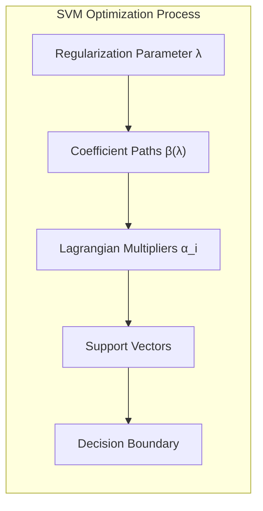
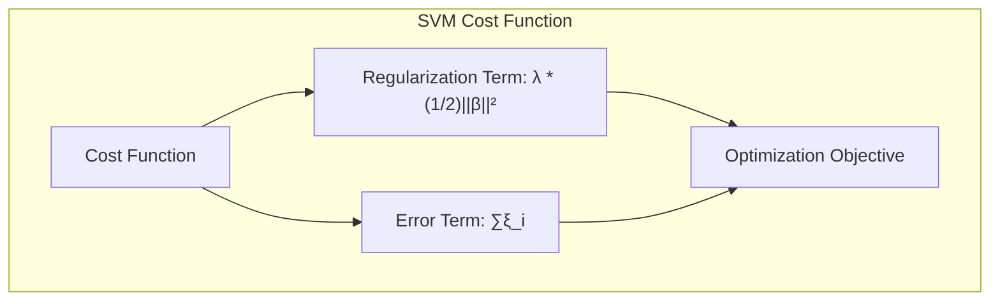
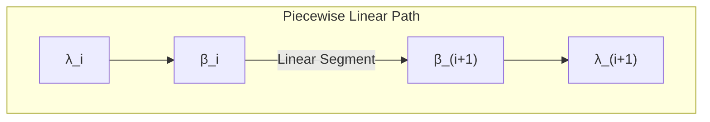
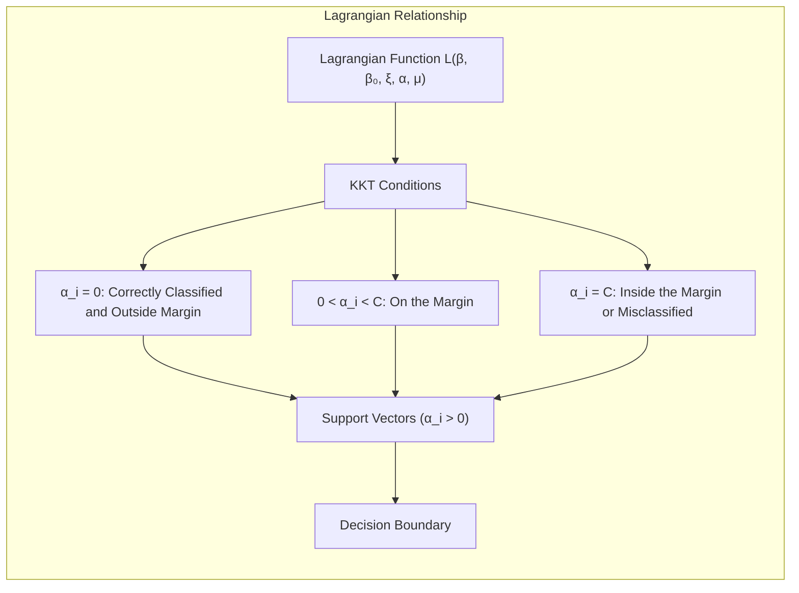
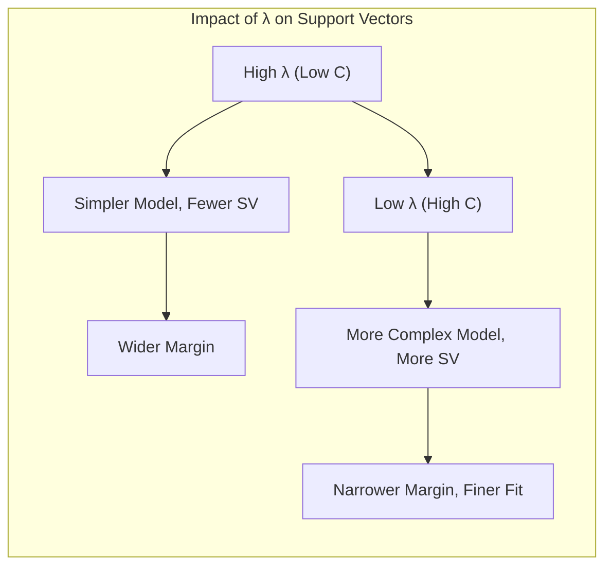

Okay, let's explore the concept of **piecewise linear coefficient paths** and their connection to points on the margin and Lagrangian multipliers in the context of Support Vector Machines (SVMs). This section will delve into the geometrical interpretation of the optimization process and how the solution evolves as the regularization parameter changes.

## Título: Caminhos de Coeficientes Lineares por Partes em SVMs: Uma Análise Geométrica com Multiplicadores de Lagrange e Pontos na Margem



### Introdução

No contexto da otimização de **Support Vector Machines (SVMs)**, a análise dos **caminhos de coeficientes lineares por partes** oferece *insights* valiosos sobre o comportamento dos parâmetros do modelo à medida que o parâmetro de regularização é ajustado. Esses caminhos revelam como a magnitude dos coeficientes $\beta$ e o valor dos **multiplicadores de Lagrange** $\alpha_i$ variam ao longo do processo de otimização e como isso impacta a localização dos **vetores de suporte** em relação à margem de separação.

Este capítulo explora em detalhes os caminhos de coeficientes lineares por partes em SVMs, analisando como esses caminhos são formados e como as mudanças no parâmetro de regularização influenciam a forma da fronteira de decisão. Examinaremos a relação entre os multiplicadores de Lagrange, a localização das amostras em relação à margem e a forma como os vetores de suporte são selecionados ao longo do processo de otimização.

A compreensão dos caminhos de coeficientes lineares por partes oferece uma visão mais aprofundada da formulação matemática das SVMs e auxilia na interpretação do comportamento dos modelos em diferentes cenários. Essa visão também pode ser utilizada para o desenvolvimento de algoritmos de treinamento mais eficientes e para a escolha de parâmetros ótimos para cada problema específico.

### O Conceito de Caminhos de Coeficientes Lineares por Partes

**Conceito 1: Regularização e o Parâmetro $\lambda$**

Em SVMs, o parâmetro de regularização, que denotamos por $\lambda$ (que é o inverso do parâmetro $C$), controla o compromisso entre a complexidade do modelo e a tolerância a erros de classificação. A função de custo com essa regularização pode ser escrita como:

$$ \min_{\beta, \beta_0, \xi} \lambda \frac{1}{2} ||\beta||^2 + \sum_{i=1}^{N} \xi_i $$

sujeito a:

$$ y_i(x_i^T\beta + \beta_0) \geq 1 - \xi_i, \quad \forall i $$
$$ \xi_i \geq 0, \quad \forall i $$



O parâmetro $\lambda$ (o inverso de C) controla a importância relativa do termo de regularização (a norma ao quadrado de $\beta$) em relação à penalidade por erros de classificação. Quando $\lambda$ é grande, o modelo prioriza a simplicidade da função de decisão, mesmo que isso signifique cometer mais erros de classificação. Quando $\lambda$ é pequeno, o modelo prioriza a correção das classificações, mesmo que isso leve a um modelo mais complexo.

A análise do comportamento do modelo para diferentes valores de $\lambda$ nos leva ao conceito de **caminho de coeficientes**, que descreve como os coeficientes do modelo (o vetor $\beta$) variam em função de $\lambda$.

> 💡 **Exemplo Numérico:**
>
> Suponha que temos um problema de classificação binária com duas características ($x_1$ e $x_2$) e que o vetor de coeficientes $\beta$ é dado por $\beta = [\beta_1, \beta_2]$. Inicialmente, com um $\lambda$ grande (digamos, $\lambda = 1$), o modelo prefere um $\beta$ com norma pequena, por exemplo, $\beta = [0.2, 0.1]$. À medida que diminuímos $\lambda$ (por exemplo, para $\lambda = 0.1$), o modelo permite um $\beta$ com norma maior, como $\beta = [0.8, 0.5]$, para classificar melhor os pontos. Isso ilustra como o caminho do coeficiente $\beta$ se move no espaço de parâmetros conforme $\lambda$ varia.
>
> ```python
> import numpy as np
> import matplotlib.pyplot as plt
>
> # Lambda values
> lambda_values = np.array([1, 0.5, 0.1, 0.01])
>
> # Corresponding beta coefficients (example)
> beta_values = np.array([[0.2, 0.1], [0.4, 0.2], [0.8, 0.5], [1.2, 0.8]])
>
> # Plot the path of beta
> plt.figure(figsize=(8, 6))
> plt.plot(beta_values[:, 0], beta_values[:, 1], marker='o')
> for i, lambda_val in enumerate(lambda_values):
>     plt.annotate(f'λ={lambda_val}', (beta_values[i, 0], beta_values[i, 1]), textcoords="offset points", xytext=(5,5), ha='left')
> plt.xlabel('β1')
> plt.ylabel('β2')
> plt.title('Path of Coefficients β with varying λ')
> plt.grid(True)
> plt.show()
> ```
>
> Este exemplo mostra como os coeficientes $\beta_1$ e $\beta_2$ variam em função de $\lambda$. Inicialmente, com $\lambda = 1$, ambos os coeficientes têm valores pequenos, indicando um modelo mais simples. À medida que $\lambda$ diminui, os coeficientes aumentam, o que significa que o modelo se torna mais complexo para se ajustar melhor aos dados. O gráfico mostra o caminho dos coeficientes no espaço de parâmetros, demonstrando a natureza do "caminho de coeficientes".

**Lemma 1:** O parâmetro de regularização $\lambda$ controla o compromisso entre a complexidade do modelo e a tolerância a erros de classificação, e sua variação influencia a magnitude dos coeficientes do modelo.

A demonstração desse lemma se baseia na análise da função de custo e como o parâmetro $\lambda$ controla o peso do termo de regularização em relação à penalização das variáveis de folga.

**Conceito 2: O Caminho de Coeficientes Lineares por Partes**

Em SVMs, o caminho de coeficientes $\beta(\lambda)$ não é uma função contínua e suave, mas sim uma função **linear por partes**, o que significa que o caminho dos coeficientes $\beta$ é formado por segmentos de reta e que a sua derivada é constante em cada intervalo entre os nós da função. Isso ocorre devido à natureza do problema de otimização das SVMs e à forma da função de perda *hinge loss*.



O caminho de coeficientes lineares por partes pode ser entendido como uma sequência de etapas, onde os parâmetros do modelo são ajustados linearmente ao longo de intervalos de $\lambda$, e ocorrem mudanças nas direções e magnitudes das atualizações quando $\lambda$ assume certos valores críticos.

Em cada etapa, as condições de Karush-Kuhn-Tucker (KKT) determinam quais amostras se tornam vetores de suporte e como os multiplicadores de Lagrange $\alpha_i$ variam com $\lambda$. As mudanças no vetor $\beta$ são definidas pelas amostras que se tornam ou deixam de ser vetores de suporte.

> 💡 **Exemplo Numérico:**
>
> Imagine que temos três pontos de dados $(x_1, y_1)$, $(x_2, y_2)$, e $(x_3, y_3)$. Inicialmente, com um $\lambda$ grande, o modelo pode ter apenas um vetor de suporte, digamos $x_1$, resultando em um $\beta$ inicial. À medida que diminuímos $\lambda$, o ponto $x_2$ pode se tornar um vetor de suporte, e o vetor $\beta$ se desloca linearmente para um novo valor. Se continuarmos diminuindo $\lambda$, o ponto $x_3$ pode se tornar um vetor de suporte, causando outra mudança linear no vetor $\beta$. Este processo cria um caminho linear por partes para $\beta$ em função de $\lambda$.
>
> ```mermaid
> graph LR
>     A[λ = λ_high] --> B(β_1, SV: x1);
>     B --> C(λ = λ_mid, β_2, SV: x1, x2);
>     C --> D(λ = λ_low, β_3, SV: x1, x2, x3);
>     style A fill:#f9f,stroke:#333,stroke-width:2px
>     style B fill:#ccf,stroke:#333,stroke-width:2px
>     style C fill:#ccf,stroke:#333,stroke-width:2px
>     style D fill:#ccf,stroke:#333,stroke-width:2px
> ```
>
> Neste diagrama, cada nó representa um valor específico de $\lambda$, o vetor de coeficientes $\beta$ correspondente e os vetores de suporte (SV) ativos naquele ponto. As transições entre os nós indicam as mudanças lineares no vetor $\beta$ à medida que o valor de $\lambda$ diminui e novos pontos se tornam vetores de suporte.

**Corolário 1:** O caminho de coeficientes lineares por partes surge devido à natureza da função de perda *hinge loss* e à forma como os vetores de suporte são selecionados ao longo do processo de otimização.

A demonstração desse corolário se baseia na análise das condições KKT e como a função *hinge loss* impõe mudanças discretas na localização dos vetores de suporte à medida que o parâmetro $\lambda$ varia, o que resulta em uma mudança linear por partes dos coeficientes do modelo.

### Multiplicadores de Lagrange e Pontos na Margem: Uma Relação Geometríca



Os **multiplicadores de Lagrange** $\alpha_i$ desempenham um papel crucial na definição dos caminhos de coeficientes e na relação entre os vetores de suporte e a margem de separação. A função Lagrangiana da SVM é:

$$ L(\beta, \beta_0, \xi, \alpha, \mu) = \lambda \frac{1}{2} ||\beta||^2 +  \sum_{i=1}^{N} \xi_i - \sum_{i=1}^{N} \alpha_i [y_i(x_i^T\beta + \beta_0) - 1 + \xi_i] - \sum_{i=1}^{N} \mu_i \xi_i $$

As condições de Karush-Kuhn-Tucker (KKT) mostram a seguinte relação:

1.  Se uma amostra está corretamente classificada e fora da margem, então o multiplicador de Lagrange $\alpha_i$ correspondente é igual a zero.
2.  Se uma amostra está sobre a margem, então o multiplicador de Lagrange $\alpha_i$ correspondente está entre 0 e C (o inverso de $\lambda$).
3.  Se uma amostra está dentro da margem ou classificada erroneamente, então o multiplicador de Lagrange $\alpha_i$ correspondente é igual a $C$.

A relação entre os multiplicadores de Lagrange e a localização dos pontos em relação à margem é fundamental para entender o conceito de vetores de suporte, como já mencionado em [^12.2]. Os vetores de suporte são os pontos para os quais $\alpha_i > 0$, o que significa que esses pontos têm um impacto direto na definição do hiperplano separador.

Os multiplicadores de Lagrange também controlam a forma como o vetor $\beta$ evolui com $\lambda$, e as amostras que entram e saem do conjunto de vetores de suporte a medida que $\lambda$ é alterado.

> 💡 **Exemplo Numérico:**
>
> Vamos considerar três pontos de dados:
>  * $x_1 = [1, 1]$, $y_1 = 1$ (classe positiva)
>  * $x_2 = [2, 2]$, $y_2 = 1$ (classe positiva)
>  * $x_3 = [2, 0]$, $y_3 = -1$ (classe negativa)
>
>  Inicialmente, com um $\lambda$ grande, apenas $x_3$ pode ser um vetor de suporte com $\alpha_3 > 0$, enquanto $\alpha_1 = \alpha_2 = 0$. À medida que $\lambda$ diminui, $x_1$ pode se tornar um vetor de suporte, e seu $\alpha_1$ se torna positivo, enquanto $\alpha_3$ pode mudar. Se $\lambda$ diminuir ainda mais, $x_2$ também pode se tornar um vetor de suporte, com $\alpha_2 > 0$.
>
>  Vamos supor que para um determinado $\lambda$, os multiplicadores de Lagrange são:
>  *  $\alpha_1 = 0.2$
>  *  $\alpha_2 = 0$
>  *  $\alpha_3 = 0.5$
>
>  Isso significa que $x_1$ e $x_3$ são vetores de suporte, e $x_2$ não está influenciando a fronteira de decisão naquele momento. Se diminuirmos $\lambda$, $\alpha_2$ pode se tornar positivo, indicando que $x_2$ se tornou um vetor de suporte e está agora influenciando a fronteira de decisão.
>
> ```mermaid
> graph LR
>     A[λ_high] --> B(x3: α>0);
>     B --> C(λ_mid, x1: α>0, x3: α>0);
>     C --> D(λ_low, x1: α>0, x2: α>0, x3: α>0);
>     style A fill:#f9f,stroke:#333,stroke-width:2px
>     style B fill:#ccf,stroke:#333,stroke-width:2px
>     style C fill:#ccf,stroke:#333,stroke-width:2px
>     style D fill:#ccf,stroke:#333,stroke-width:2px
> ```
>
> O diagrama mostra a evolução dos vetores de suporte com a variação de $\lambda$. Inicialmente, apenas $x_3$ é um vetor de suporte. Em seguida, $x_1$ se junta, e finalmente, $x_2$ também se torna um vetor de suporte à medida que $\lambda$ diminui. Os valores dos multiplicadores $\alpha_i$ associados a cada ponto determinam seu impacto na definição da fronteira de decisão.

**Lemma 3:** Os multiplicadores de Lagrange $\alpha_i$ determinam se uma amostra é um vetor de suporte e sua localização em relação à margem de separação, fornecendo uma interpretação geométrica da solução do problema de otimização.

A demonstração desse lemma se baseia na análise das condições KKT e como elas relacionam os multiplicadores de Lagrange à posição de cada amostra em relação à margem.

### O Impacto de $\lambda$ nos Vetores de Suporte



O parâmetro de regularização $\lambda$ (inverso do C) tem um impacto direto na localização dos vetores de suporte e na forma da fronteira de decisão. Inicialmente, com um $\lambda$ alto (baixo C), o modelo busca uma fronteira de decisão mais simples e com uma margem mais larga, o que pode resultar em um número menor de vetores de suporte. Conforme $\lambda$ diminui (C aumenta), o modelo é menos penalizado por erros de classificação, e mais pontos passam a ser vetores de suporte, e o modelo se torna mais complexo, ajustando-se aos detalhes dos dados de treinamento.

A medida que $\lambda$ diminui, pontos que antes estavam corretamente classificados e fora da margem começam a se aproximar da margem, tornando-se vetores de suporte. Pontos que estavam dentro da margem ou classificados incorretamente também se tornam vetores de suporte e sua influencia sobre a função de decisão aumenta.

Os caminhos de coeficientes lineares por partes descrevem como o vetor $\beta$ e, portanto, a fronteira de decisão, se modifica ao longo desse processo. Em cada etapa, alguns vetores de suporte podem sair da margem e deixar de influenciar a solução, enquanto novos vetores de suporte podem entrar no modelo e influenciar o hiperplano de decisão.

A análise dos caminhos de coeficientes lineares por partes e da evolução dos vetores de suporte ao longo desses caminhos fornece uma visão detalhada do processo de otimização das SVMs e como o parâmetro $\lambda$ controla a complexidade e a capacidade de generalização do modelo.

> 💡 **Exemplo Numérico:**
>
> Vamos usar os mesmos pontos anteriores:
>  * $x_1 = [1, 1]$, $y_1 = 1$
>  * $x_2 = [2, 2]$, $y_2 = 1$
>  * $x_3 = [2, 0]$, $y_3 = -1$
>
> Suponha que, com $\lambda = 1$, o modelo tenha apenas $x_3$ como vetor de suporte, e a margem é relativamente larga, e os pontos $x_1$ e $x_2$ estão bem longe da margem. Quando $\lambda$ diminui para $0.5$, o ponto $x_1$ se torna um vetor de suporte, e a margem se ajusta para incluir esse ponto. Se $\lambda$ diminuir ainda mais para $0.1$, $x_2$ também se torna um vetor de suporte, e a margem se ajusta novamente, ficando mais estreita e se ajustando mais aos dados.
>
> ```mermaid
> graph LR
>    A[λ=1] --> B(Margem Larga, SV: x3);
>    B --> C(λ=0.5, Margem Ajustada, SV: x1, x3);
>    C --> D(λ=0.1, Margem Estreita, SV: x1, x2, x3);
>    style A fill:#f9f,stroke:#333,stroke-width:2px
>    style B fill:#ccf,stroke:#333,stroke-width:2px
>    style C fill:#ccf,stroke:#333,stroke-width:2px
>    style D fill:#ccf,stroke:#333,stroke-width:2px
> ```
>
> Este diagrama mostra como a margem e os vetores de suporte evoluem com a variação de $\lambda$. Inicialmente, com um $\lambda$ alto, a margem é larga e apenas $x_3$ é um vetor de suporte. À medida que $\lambda$ diminui, a margem se ajusta, e mais pontos se tornam vetores de suporte, refletindo a complexidade crescente do modelo.

**Corolário 2:** As mudanças no parâmetro de regularização $\lambda$ afetam a localização dos vetores de suporte e a forma da fronteira de decisão ao longo dos caminhos de coeficientes lineares por partes.

A demonstração desse corolário se baseia na análise do impacto do parâmetro $\lambda$ na função de custo das SVMs, nas condições de KKT e como essas condições levam à mudança dos vetores de suporte e seus multiplicadores de Lagrange com a mudança do parâmetro $\lambda$.

### Conclusão

Neste capítulo, exploramos o conceito de **caminhos de coeficientes lineares por partes** em **Support Vector Machines (SVMs)**, analisando como esses caminhos são formados e como eles se relacionam com os multiplicadores de Lagrange, os vetores de suporte e o parâmetro de regularização $\lambda$. Vimos como o parâmetro $\lambda$ controla o compromisso entre a complexidade do modelo e a tolerância a erros de classificação, e como a mudança desse parâmetro influencia a localização dos vetores de suporte e a forma da fronteira de decisão.

A análise dos caminhos de coeficientes lineares por partes oferece uma perspectiva geométrica sobre o processo de otimização das SVMs, e como o ajuste do parâmetro $\lambda$ leva a diferentes soluções para o modelo, com diferentes níveis de complexidade. A relação entre multiplicadores de Lagrange e a localização dos pontos em relação à margem é fundamental para a compreensão da formulação matemática e para o entendimento do funcionamento das SVMs.

A compreensão das propriedades dos caminhos de coeficientes lineares por partes é valiosa para a construção de modelos SVM eficientes e robustos, além de fornecer *insights* importantes para o desenvolvimento de algoritmos de treinamento mais avançados e para a escolha de parâmetros otimizados para cada problema específico.

### Footnotes

[^12.1]: "In this chapter we describe generalizations of linear decision boundaries for classification. Optimal separating hyperplanes are introduced in Chapter 4 for the case when two classes are linearly separable. Here we cover extensions to the nonseparable case, where the classes overlap. These techniques are then generalized to what is known as the support vector machine, which produces nonlinear boundaries by constructing a linear boundary in a large, transformed version of the feature space." *(Trecho de  "Support Vector Machines and Flexible Discriminants")*

[^12.2]: "In Chapter 4 we discussed a technique for constructing an optimal separating hyperplane between two perfectly separated classes. We review this and generalize to the nonseparable case, where the classes may not be separable by a linear boundary." *(Trecho de  "Support Vector Machines and Flexible Discriminants")*
