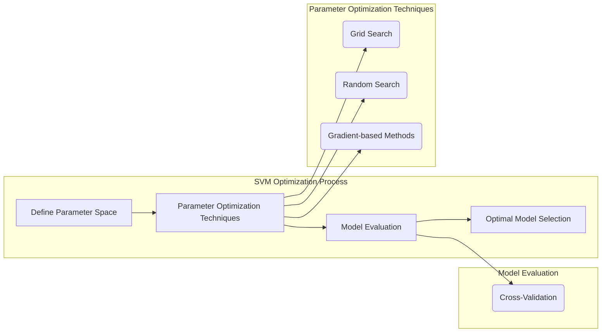
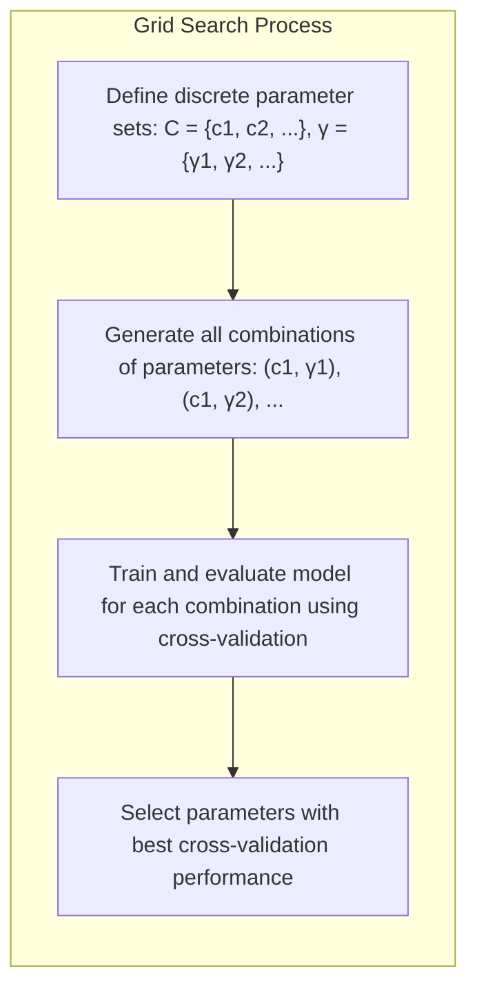
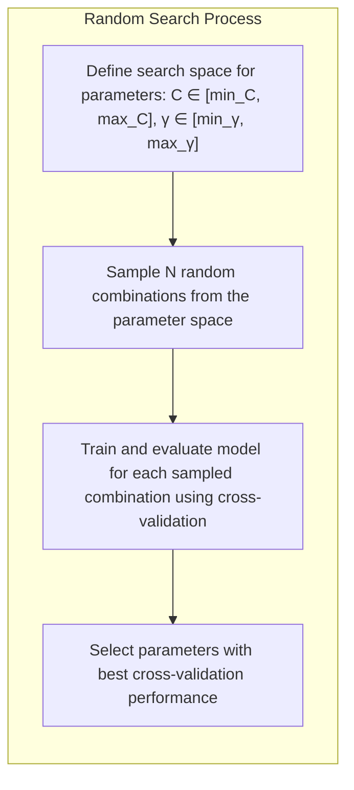
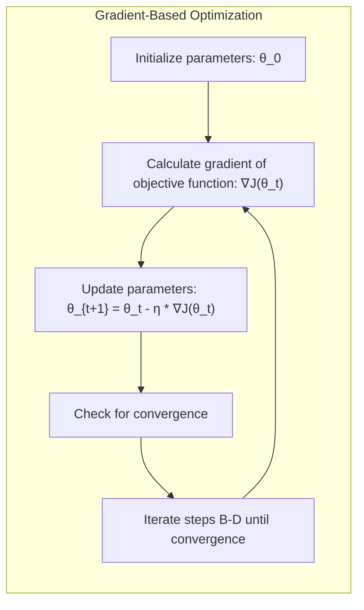
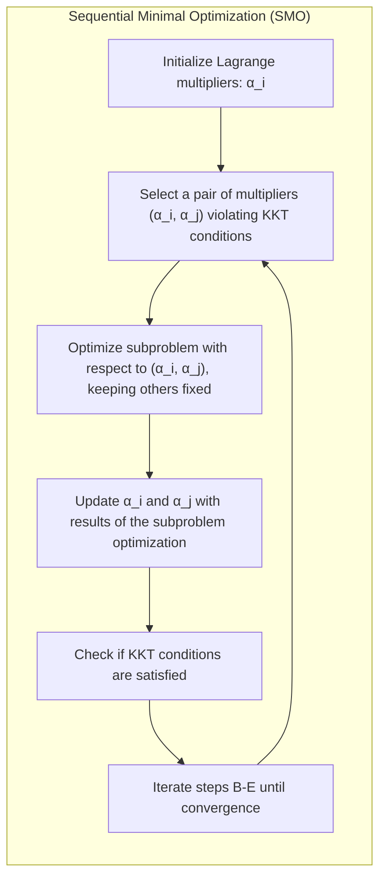
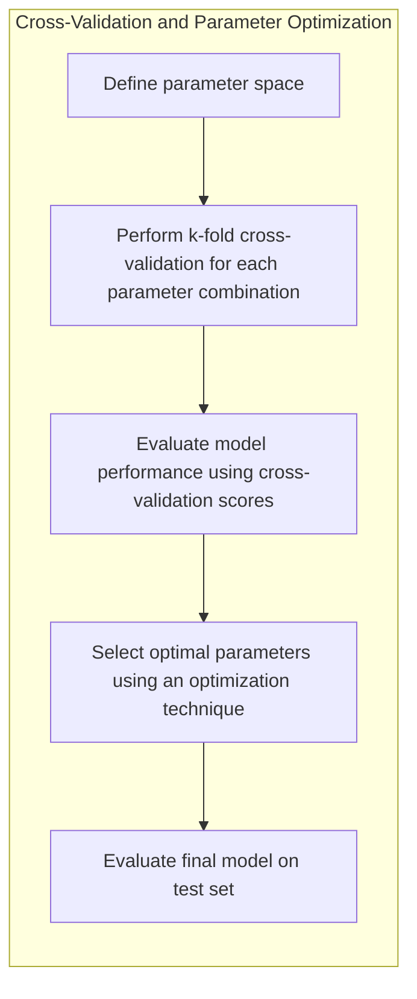

Okay, let's enhance this text with practical numerical examples.

## Título: Técnicas Eficientes para Otimização de SVMs com Diferentes Valores de Parâmetros: Algoritmos e Estratégias

### Introdução

A otimização dos parâmetros das **Support Vector Machines (SVMs)**, especialmente o parâmetro de regularização $C$ e os parâmetros do *kernel*, é um passo fundamental para obter modelos com bom desempenho e capacidade de generalização. A escolha apropriada desses parâmetros pode ser um processo computacionalmente custoso, pois a função de custo das SVMs é não linear, e a busca por valores ótimos geralmente envolve a avaliação do modelo com diferentes combinações de parâmetros, como visto nos capítulos anteriores.

Neste capítulo, exploraremos técnicas eficientes para a resolução do problema de otimização das SVMs com diferentes valores de parâmetros, focando em algoritmos e estratégias que permitem reduzir o tempo de computação e encontrar soluções que são, no mínimo, próximas da solução ótima. Abordaremos técnicas como a **busca em grade (*grid search*)**, a **busca aleatória (*random search*)**, e **métodos baseados em gradiente**, analisando suas vantagens e desvantagens e como elas são utilizadas para otimizar os parâmetros das SVMs. Também discutiremos a importância da validação cruzada nesse processo de escolha dos hiperparâmetros.

A compreensão dessas técnicas é fundamental para a aplicação prática das SVMs, permitindo construir modelos eficientes e robustos, mesmo com recursos computacionais limitados.

### Técnicas para Exploração do Espaço de Parâmetros

**Conceito 1: Busca em Grade (*Grid Search*)**

A **busca em grade** é uma técnica de otimização de parâmetros que consiste em definir um conjunto discreto de valores para cada parâmetro a ser otimizado, e então testar todas as combinações possíveis de valores. Por exemplo, para otimizar os parâmetros $C$ e $\gamma$ de uma SVM com *kernel* RBF, definimos um conjunto de valores para $C$ (ex: $C = [0.1, 1, 10, 100]$) e um conjunto de valores para $\gamma$ (ex: $\gamma = [0.01, 0.1, 1, 10]$), e testamos todas as combinações possíveis, que resultam em um número total de 16 combinações.

> 💡 **Exemplo Numérico:**
>
> Vamos supor que estamos treinando uma SVM com kernel RBF e temos os seguintes valores para os parâmetros $C$ e $\gamma$:
>
> $C = [0.1, 1, 10]$
> $\gamma = [0.01, 0.1, 1]$
>
> A busca em grade testaria todas as combinações possíveis:
>
> | Combinação | C    | γ    |
> |------------|------|------|
> | 1          | 0.1  | 0.01 |
> | 2          | 0.1  | 0.1  |
> | 3          | 0.1  | 1    |
> | 4          | 1    | 0.01 |
> | 5          | 1    | 0.1  |
> | 6          | 1    | 1    |
> | 7          | 10   | 0.01 |
> | 8          | 10   | 0.1  |
> | 9          | 10   | 1    |
>
> Isso resulta em 9 modelos diferentes para serem avaliados. Cada modelo é treinado e avaliado usando validação cruzada, e a combinação que apresenta o melhor desempenho é selecionada como a melhor. Por exemplo, suponha que a combinação $C=10$ e $\gamma = 0.1$ apresentou a maior acurácia média na validação cruzada. Esta combinação seria escolhida como a ideal.

A avaliação de cada combinação é feita utilizando validação cruzada, como descrito em capítulos anteriores, o que permite obter uma estimativa do desempenho do modelo em dados não vistos. A combinação de parâmetros que resulta no melhor desempenho na validação cruzada é escolhida como a solução ótima.

A busca em grade é simples de implementar e garante que o espaço de parâmetros seja explorado de forma exaustiva. No entanto, ela pode se tornar computacionalmente custosa quando o número de parâmetros é grande ou quando a quantidade de valores testados para cada parâmetro é muito grande.

**Lemma 1:** A busca em grade é um método simples e sistemático para explorar o espaço de parâmetros, mas pode ser computacionalmente custoso para problemas com muitos parâmetros.

A demonstração desse lemma se baseia na análise do processo de busca em grade, que explora todas as combinações possíveis de valores dos parâmetros, o que garante uma busca exaustiva, mas com alto custo computacional.

**Conceito 2: Busca Aleatória (*Random Search*)**

A **busca aleatória** é uma técnica de otimização de parâmetros que consiste em selecionar um número fixo de combinações aleatórias de valores dentro de um espaço de parâmetros definido. Ao contrário da busca em grade, que explora todas as combinações possíveis, a busca aleatória seleciona um subconjunto aleatório de combinações, o que pode levar a uma exploração mais eficiente do espaço de parâmetros.

> 💡 **Exemplo Numérico:**
>
> Imagine que temos os mesmos parâmetros $C$ e $\gamma$ como no exemplo da busca em grade, com os seguintes intervalos de busca:
>
> $C \in [0.1, 10]$ (escala logarítmica)
> $\gamma \in [0.01, 1]$ (escala logarítmica)
>
> Em vez de testar todas as combinações, definimos que vamos testar 5 combinações aleatórias. Podemos gerar aleatoriamente os seguintes valores:
>
> | Combinação | C          | γ          |
> |------------|------------|------------|
> | 1          | 0.56       | 0.03       |
> | 2          | 7.89       | 0.87       |
> | 3          | 1.23       | 0.15       |
> | 4          | 3.45       | 0.08       |
> | 5          | 9.12       | 0.42       |
>
> Esses valores são gerados aleatoriamente dentro dos intervalos definidos, seguindo uma distribuição uniforme (ou outra distribuição pré-definida). Cada combinação é avaliada usando validação cruzada. A vantagem aqui é que exploramos diferentes partes do espaço de parâmetros sem testar todas as combinações, o que pode economizar tempo computacional.

A busca aleatória geralmente é mais rápida do que a busca em grade para problemas com muitos parâmetros, e é capaz de encontrar soluções com desempenho similar à busca em grade, muitas vezes em um tempo de computação muito menor.

A busca aleatória requer a definição de um espaço de busca para cada parâmetro, que pode ser um intervalo de valores ou uma distribuição de probabilidade. As combinações de parâmetros são selecionadas aleatoriamente dentro desses espaços de busca.

**Corolário 1:** A busca aleatória é uma alternativa à busca em grade que oferece um bom compromisso entre eficiência computacional e desempenho, e é especialmente útil em problemas com muitos parâmetros.

A demonstração desse corolário se baseia na análise da natureza da busca aleatória, que explora um subconjunto aleatório de combinações de parâmetros, o que leva a um tempo de computação menor e resultados comparáveis com a busca em grade.

### Métodos Baseados em Gradiente para Otimização de Hiperparâmetros

Os **métodos baseados em gradiente** são algoritmos de otimização que utilizam o gradiente da função objetivo para encontrar o mínimo ou máximo da função. Esses métodos são particularmente úteis para problemas de otimização com muitas variáveis, onde a busca exaustiva do espaço de parâmetros se torna inviável.

No contexto da otimização de hiperparâmetros de SVMs, os métodos baseados em gradiente podem ser utilizados para ajustar os parâmetros $C$ e $\gamma$ (para o kernel RBF) ou outros parâmetros, utilizando a validação cruzada como forma de estimar a função objetivo (ou seja, o desempenho do modelo).

O algoritmo básico de um método baseado em gradiente segue os seguintes passos:

1.  **Inicialização:** Inicializar os parâmetros com valores iniciais.
2.  **Cálculo do Gradiente:** Calcular o gradiente da função objetivo (desempenho na validação cruzada) em relação aos parâmetros atuais.
3.  **Atualização:** Atualizar os parâmetros na direção oposta ao gradiente (para minimização) ou na direção do gradiente (para maximização).
4.  **Iteração:** Repetir os passos 2 e 3 até que um critério de convergência seja satisfeito.

Existem diversas variações de métodos baseados em gradiente, como o **gradiente descendente**, **gradiente descendente estocástico (SGD)** e métodos de segunda ordem, como **BFGS**.

> 💡 **Exemplo Numérico:**
>
> Vamos considerar a otimização do parâmetro $C$ usando o método do gradiente descendente. A função objetivo será o erro de validação cruzada.
>
> 1.  **Inicialização:** Começamos com um valor inicial para $C$, por exemplo, $C_0 = 1$. Definimos uma taxa de aprendizagem (learning rate), $\eta = 0.1$.
>
> 2.  **Cálculo do Gradiente:** Calculamos o gradiente da função de custo (erro de validação cruzada) em relação a $C$. Digamos que, para o valor atual $C_0 = 1$, o gradiente seja $\frac{\partial \text{erro}}{\partial C} = 0.5$.
>
> 3.  **Atualização:** Atualizamos o valor de $C$ usando a fórmula $C_{t+1} = C_t - \eta \frac{\partial \text{erro}}{\partial C}$. Então, $C_1 = 1 - 0.1 \times 0.5 = 0.95$.
>
> 4.  **Iteração:** Repetimos os passos 2 e 3 com o novo valor de $C$. Suponha que o gradiente agora seja $\frac{\partial \text{erro}}{\partial C} = 0.2$. Atualizamos novamente: $C_2 = 0.95 - 0.1 \times 0.2 = 0.93$.
>
> Repetimos esse processo até que o valor do erro de validação cruzada pare de diminuir significativamente. Este exemplo ilustra como o método do gradiente descendente ajusta o parâmetro $C$ iterativamente.

**Lemma 3:** Os métodos baseados em gradiente utilizam o gradiente da função objetivo para guiar a busca pelos valores ótimos dos parâmetros, o que pode ser mais eficiente do que as técnicas de busca em grade ou busca aleatória.

A demonstração desse lemma se baseia na análise dos métodos baseados em gradiente e como eles utilizam a informação do gradiente para encontrar o mínimo ou máximo de uma função, o que permite uma busca mais rápida e eficiente do que abordagens de busca aleatória ou exaustiva.

### Técnicas Específicas para SVMs: SMO e Subproblemas

Além dos métodos gerais de otimização, existem algoritmos específicos para otimizar os parâmetros das SVMs, como o **Sequential Minimal Optimization (SMO)**. O algoritmo SMO explora a estrutura específica do problema dual das SVMs, onde a função objetivo depende apenas dos produtos internos entre os dados e dos multiplicadores de Lagrange $\alpha_i$, como discutido em capítulos anteriores.

O SMO resolve o problema de otimização através da resolução de uma sequência de subproblemas, onde cada subproblema envolve a otimização de apenas dois multiplicadores de Lagrange, enquanto os demais são mantidos fixos. Essa estratégia simplifica o problema de otimização e o torna computacionalmente eficiente.

O algoritmo SMO tem os seguintes passos:

1.  **Inicialização:** Inicializa os multiplicadores de Lagrange $\alpha_i$ com valores válidos.
2.  **Seleção de um Par:** Seleciona um par de multiplicadores de Lagrange $(\alpha_i, \alpha_j)$ que violam as condições de Karush-Kuhn-Tucker (KKT).
3.  **Otimização do Subproblema:** Resolve o subproblema de otimização com relação a $\alpha_i$ e $\alpha_j$, mantendo todos os demais multiplicadores fixos. Esse subproblema pode ser resolvido analiticamente.
4.  **Atualização:** Atualiza os valores de $\alpha_i$ e $\alpha_j$ com os resultados da otimização do subproblema.
5.  **Verificação da Convergência:** Repete os passos 2 a 4 até que as condições KKT sejam satisfeitas (ou próximas de serem satisfeitas).

> 💡 **Exemplo Numérico:**
>
> Vamos simplificar para ilustrar o conceito. Suponha que tenhamos um problema de SVM com apenas 3 pontos de dados, e portanto 3 multiplicadores de Lagrange: $\alpha_1, \alpha_2, \alpha_3$.
>
> 1.  **Inicialização:** Inicializamos todos os $\alpha_i$ com valores, por exemplo, $\alpha_1 = 0.1$, $\alpha_2 = 0.2$, $\alpha_3 = 0.3$.
>
> 2.  **Seleção de um Par:** O algoritmo SMO seleciona um par de multiplicadores, digamos $\alpha_1$ e $\alpha_2$, que violam as condições KKT.
>
> 3.  **Otimização do Subproblema:** Resolvemos o problema de otimização apenas com relação a $\alpha_1$ e $\alpha_2$, mantendo $\alpha_3$ fixo. Isso pode ser feito analiticamente, encontrando novos valores para $\alpha_1$ e $\alpha_2$, por exemplo, $\alpha_1 = 0.15$ e $\alpha_2 = 0.25$.
>
> 4.  **Atualização:** Atualizamos os valores de $\alpha_1$ e $\alpha_2$ com os novos valores encontrados.
>
> 5.  **Verificação da Convergência:** Repetimos esse processo, selecionando outro par de multiplicadores que violam as condições KKT, até que as condições de convergência sejam satisfeitas.
>
> Na prática, o SMO opera em um conjunto muito maior de multiplicadores, mas a ideia de otimizar pares de multiplicadores de forma iterativa é a mesma.

O SMO é um algoritmo eficiente e fácil de implementar, especialmente adequado para a otimização do problema dual das SVMs. Ele explora a esparsidade dos multiplicadores de Lagrange e utiliza técnicas de caching para evitar recálculos desnecessários. O SMO também oferece uma maneira de avaliar o erro do modelo e como as amostras de treinamento se encontram em relação a margem, o que pode ser usado para a escolha apropriada de parâmetros.

**Corolário 2:** O algoritmo SMO é uma técnica eficiente para resolver o problema dual das SVMs, utilizando a estrutura do problema e a otimização de subproblemas com apenas duas variáveis.

A demonstração desse corolário se baseia na análise do funcionamento do algoritmo SMO e como ele simplifica o problema de otimização através da divisão em subproblemas, o que permite uma implementação eficiente.

### Combinação de Técnicas: Validação Cruzada e Otimização de Parâmetros

A combinação da validação cruzada com técnicas de otimização de parâmetros é uma prática fundamental para construir modelos SVM eficientes e com boa capacidade de generalização.

O processo de otimização de parâmetros utilizando validação cruzada e técnicas de otimização pode ser resumido nos seguintes passos:

1.  **Definição do Espaço de Parâmetros:** Definir um espaço de busca para os parâmetros a serem otimizados, como o parâmetro $C$ e os parâmetros do *kernel*.
2.  **Validação Cruzada:** Utilizar validação cruzada k-fold para avaliar o desempenho do modelo com diferentes combinações de parâmetros.
3.  **Otimização dos Parâmetros:** Utilizar técnicas de otimização (busca em grade, busca aleatória ou métodos baseados em gradiente) para encontrar a combinação de parâmetros que maximiza o desempenho na validação cruzada.
4.  **Avaliação Final:** Avaliar o desempenho do modelo com os parâmetros ótimos no conjunto de teste, obtendo uma estimativa final da sua capacidade de generalização.

> 💡 **Exemplo Numérico:**
>
> Vamos considerar um exemplo onde combinamos validação cruzada com busca em grade.
>
> 1.  **Definição do Espaço de Parâmetros:** Definimos que queremos otimizar $C$ e $\gamma$ com os seguintes valores: $C = [0.1, 1, 10]$ e $\gamma = [0.01, 0.1, 1]$.
>
> 2.  **Validação Cruzada:** Usamos validação cruzada com k=5 folds. Isso significa que, para cada combinação de $C$ e $\gamma$, treinamos o modelo 5 vezes, cada vez usando um fold diferente como conjunto de validação e os outros 4 folds como conjunto de treinamento. Calculamos a acurácia média nos 5 folds para cada combinação.
>
> 3.  **Otimização dos Parâmetros:**
>   | C    | γ    | Acurácia Média (Validação Cruzada) |
>   |------|------|-----------------------------------|
>   | 0.1  | 0.01 | 0.75                              |
>   | 0.1  | 0.1  | 0.80                              |
>   | 0.1  | 1    | 0.70                              |
>   | 1    | 0.01 | 0.82                              |
>   | 1    | 0.1  | 0.85                              |
>   | 1    | 1    | 0.78                              |
>   | 10   | 0.01 | 0.83                              |
>   | 10   | 0.1  | 0.88                              |
>   | 10   | 1    | 0.81                              |
>
>   A combinação $C=10$ e $\gamma=0.1$ apresenta a melhor acurácia média na validação cruzada (0.88).
>
> 4.  **Avaliação Final:** Treinamos o modelo final usando todos os dados de treinamento com $C=10$ e $\gamma=0.1$ e avaliamos o desempenho em um conjunto de teste separado.

A validação cruzada garante que os modelos sejam avaliados em dados não vistos, enquanto as técnicas de otimização de parâmetros ajudam a encontrar a combinação de parâmetros que leva ao melhor desempenho.

A combinação dessas técnicas permite construir modelos SVM robustos e eficientes, que são capazes de se adaptar às características dos dados e de obter um bom desempenho em diferentes cenários.

**Corolário 3:** A combinação da validação cruzada e das técnicas de otimização de parâmetros oferece uma abordagem robusta e eficiente para a construção de modelos SVM com bom desempenho e capacidade de generalização.

A demonstração desse corolário se baseia na análise do papel da validação cruzada e dos algoritmos de otimização e como essas abordagens se complementam para a escolha do melhor modelo.

### Conclusão

Neste capítulo, exploramos **técnicas eficientes para a otimização de SVMs com diferentes valores de parâmetros**, incluindo busca em grade, busca aleatória e métodos baseados em gradiente. Vimos como o algoritmo SMO é utilizado para resolver o problema dual das SVMs e como ele explora a estrutura do problema para realizar uma otimização eficiente.

Discutimos também a importância da combinação da validação cruzada com técnicas de otimização para escolher os parâmetros do modelo e garantir que ele tenha uma boa capacidade de generalização. A aplicação adequada dessas técnicas de otimização é fundamental para a construção de modelos SVM robustos e eficientes, capazes de lidar com dados complexos e de alta dimensionalidade. A combinação de validação cruzada com técnicas de otimização garante que o modelo seja avaliado corretamente e os parâmetros apropriados sejam escolhidos, levando a um resultado com melhor qualidade.

### Footnotes

[^12.1]: "In this chapter we describe generalizations of linear decision boundaries for classification. Optimal separating hyperplanes are introduced in Chapter 4 for the case when two classes are linearly separable. Here we cover extensions to the nonseparable case, where the classes overlap. These techniques are then generalized to what is known as the support vector machine, which produces nonlinear boundaries by constructing a linear boundary in a large, transformed version of the feature space." *(Trecho de  "Support Vector Machines and Flexible Discriminants")*

[^12.2]: "In Chapter 4 we discussed a technique for constructing an optimal separating hyperplane between two perfectly separated classes. We review this and generalize to the nonseparable case, where the classes may not be separable by a linear boundary." *(Trecho de  "Support Vector Machines and Flexible Discriminants")*

[^12.3]: "The support vector machine classifier is an extension of this idea, where the dimension of the enlarged space is allowed to get very large, infinite in some cases. It might seem that the computations would become prohibitive. It would also seem that with sufficient basis functions, the data would be separable, and overfitting would occur. We first show how the SVM technology deals with these issues. We then see that in fact the SVM classifier is solving a function-fitting problem using a particular criterion and form of regularization, and is part of a much bigger class of problems that includes the smoothing splines of Chapter 5." *(Trecho de  "Support Vector Machines and Flexible Discriminants")*
