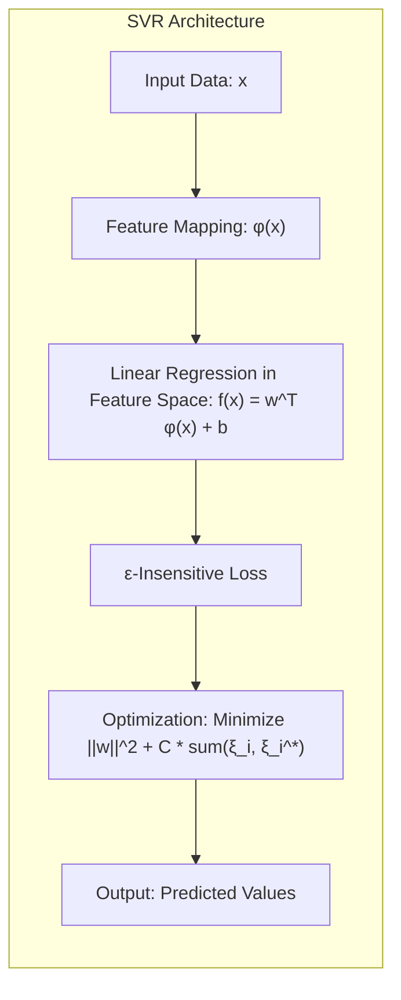
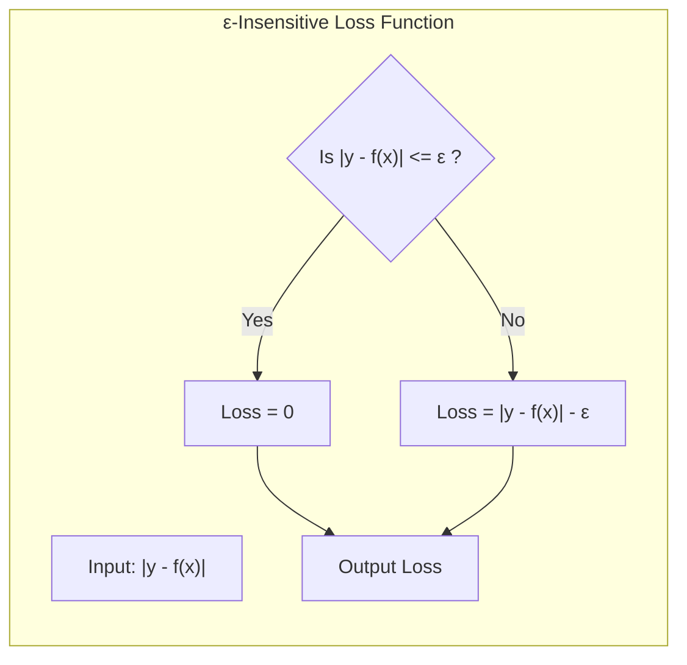
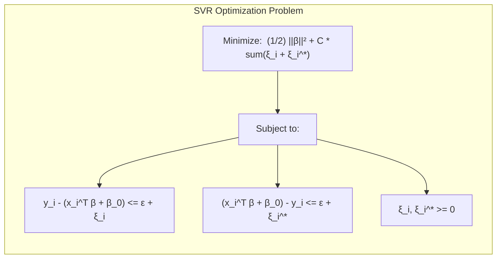
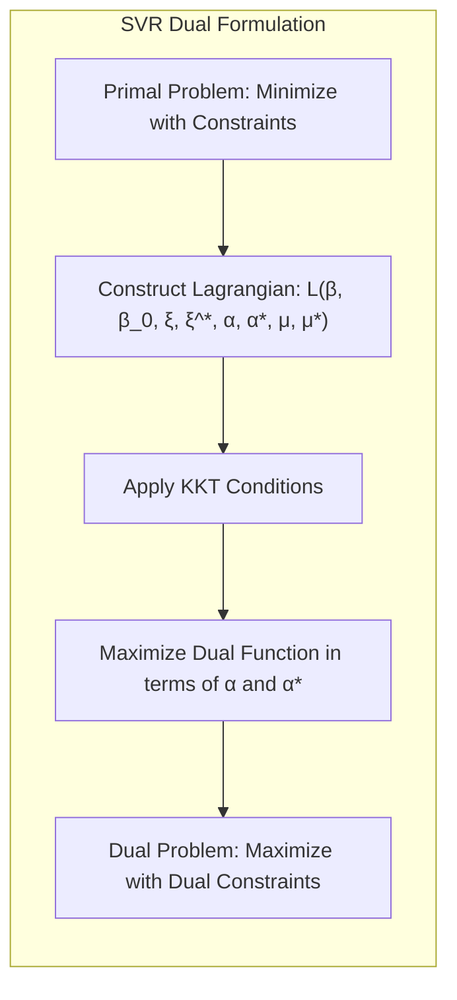
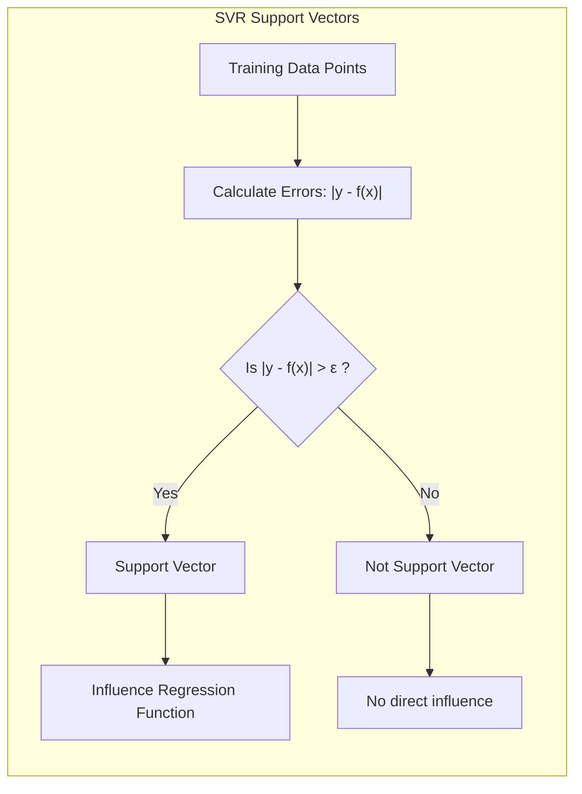

Okay, let's enhance the text with practical numerical examples where appropriate, while preserving the existing content and formatting.

## Título: Support Vector Regression: Adaptação de SVMs para Problemas de Regressão com Função de Perda ε-Insensível

### Introdução

Embora as **Support Vector Machines (SVMs)** sejam originalmente concebidas para problemas de classificação, sua formulação matemática e sua capacidade de trabalhar em espaços de alta dimensão tornam-nas também uma ferramenta eficaz para problemas de **regressão**. A adaptação das SVMs para problemas de regressão, conhecida como **Support Vector Regression (SVR)**, envolve a utilização de uma função de perda específica, a **função de perda ε-insensível**, e a definição de um problema de otimização penalizado com uma restrição e um parâmetro de penalização.

Neste capítulo, exploraremos em detalhes como as SVMs são adaptadas para problemas de regressão, analisando a função de perda ε-insensível e suas propriedades, bem como a formulação do problema de otimização e a sua relação com a formulação das SVMs para classificação. Discutiremos como a regularização é utilizada para controlar a complexidade do modelo e como a escolha dos parâmetros influencia a capacidade de generalização do modelo. Além disso, abordaremos como os conceitos de vetores de suporte e o *kernel trick* são adaptados para o contexto da regressão.

A compreensão da formulação das SVRs e de seus parâmetros é fundamental para a aplicação bem-sucedida desse método em problemas práticos de regressão.

### A Função de Perda ε-Insensível

**Conceito 1: A Necessidade de uma Função de Perda Diferente**

Em problemas de regressão, o objetivo é encontrar uma função $f(x)$ que se aproxime o máximo possível dos valores de resposta $y$. Para isso, a função de perda utilizada para quantificar o erro entre a predição $f(x)$ e o valor de resposta $y$ precisa ser diferente das funções de perda utilizadas em problemas de classificação, onde o objetivo é separar as classes de forma adequada.

Funções de perda comuns em problemas de regressão incluem o erro quadrático:

$$ L(y, f(x)) = (y - f(x))^2 $$

e o erro absoluto:

$$ L(y, f(x)) = |y - f(x)| $$

No entanto, essas funções de perda penalizam todos os erros de forma igualitária, mesmo quando os erros são pequenos. Em muitas situações, é desejável ignorar pequenos erros e penalizar apenas erros maiores, o que leva ao conceito de **função de perda ε-insensível**.

**Lemma 1:** A função de perda quadrática e o erro absoluto penalizam todos os erros, o que as torna inadequadas para lidar com problemas de regressão onde é desejável ignorar erros pequenos.

A demonstração desse lemma se baseia na análise da natureza dessas funções de perda e como elas penalizam erros pequenos e grandes de forma semelhante, o que pode levar a modelos com baixo desempenho.

> 💡 **Exemplo Numérico:**
> Vamos considerar um cenário de regressão simples com um único ponto de dado: $x = 2$ e $y = 3$. Suponha que nosso modelo prediz $f(x) = 2.5$.
>
> *   **Erro Quadrático:** $L(3, 2.5) = (3 - 2.5)^2 = 0.25$.
> *   **Erro Absoluto:** $L(3, 2.5) = |3 - 2.5| = 0.5$.
>
> Agora, considere uma predição ligeiramente melhor, $f(x) = 2.9$.
>
> *   **Erro Quadrático:** $L(3, 2.9) = (3 - 2.9)^2 = 0.01$.
> *   **Erro Absoluto:** $L(3, 2.9) = |3 - 2.9| = 0.1$.
>
> Ambas as funções de perda penalizam os erros, mesmo quando a predição está muito próxima do valor real. Em cenários com muitos pontos e algum ruído, penalizar todos os pequenos erros pode levar o modelo a se ajustar excessivamente aos dados de treinamento, perdendo capacidade de generalização.

**Conceito 2: Definição da Função de Perda ε-Insensível**

A **função de perda ε-insensível** é definida como:

$$ L_\epsilon(y, f(x)) = \begin{cases} 0 & \text{se } |y - f(x)| \leq \epsilon \\ |y - f(x)| - \epsilon & \text{se } |y - f(x)| > \epsilon \end{cases} $$

onde $\epsilon$ é um parâmetro que define a largura da região insensível ao erro. Essa função de perda ignora erros menores ou iguais a $\epsilon$, e penaliza erros maiores que $\epsilon$ de forma linear.

Essa função de perda é utilizada para definir a formulação da Support Vector Regression (SVR), e ela introduz uma região de tolerância em torno da função de regressão, onde os erros não são penalizados, como discutido em [^12.3].

> 💡 **Exemplo Numérico:**
> Usando o mesmo exemplo anterior, vamos definir $\epsilon = 0.2$.
>
> *   Se $f(x) = 2.5$, então $|y - f(x)| = |3 - 2.5| = 0.5$. Como $0.5 > 0.2$, a perda é $L_{0.2}(3, 2.5) = 0.5 - 0.2 = 0.3$.
> *   Se $f(x) = 2.9$, então $|y - f(x)| = |3 - 2.9| = 0.1$. Como $0.1 \leq 0.2$, a perda é $L_{0.2}(3, 2.9) = 0$.
>
> Neste exemplo, a perda ε-insensível ignora o erro menor quando a predição está mais próxima do valor real. A região de tolerância $\epsilon$ permite que o modelo se concentre em erros maiores, que são mais significativos para a qualidade da regressão.

**Corolário 1:** A função de perda ε-insensível ignora erros menores que ε e penaliza erros maiores que ε de forma linear, o que leva a modelos de regressão mais robustos e menos sensíveis a pequenas variações nos dados de treinamento.

A demonstração desse corolário se baseia na análise da definição da função de perda ε-insensível e como ela afeta a função de custo e, portanto, o processo de treinamento. A função de perda leva a modelos menos sensíveis a dados ruidosos.

### O Problema de Otimização Penalizado para SVR

A formulação do problema de otimização da **Support Vector Regression (SVR)** envolve a minimização de uma função de custo penalizada, que combina o termo de regularização (para controlar a complexidade do modelo) com a penalização por erros de regressão, através da função de perda ε-insensível.

O problema de otimização da SVR pode ser formulado como:

$$ \min_{\beta, \beta_0, \xi, \xi^*} \frac{1}{2} ||\beta||^2 + C \sum_{i=1}^N (\xi_i + \xi_i^*) $$

sujeito a:

$$ y_i - (x_i^T\beta + \beta_0) \leq \epsilon + \xi_i $$
$$ (x_i^T\beta + \beta_0) - y_i \leq \epsilon + \xi_i^* $$
$$ \xi_i, \xi_i^* \geq 0 $$

onde:

*   $\frac{1}{2} ||\beta||^2$ é o termo de regularização, que penaliza a complexidade do modelo.
*   $C \sum_{i=1}^N (\xi_i + \xi_i^*)$ é o termo de penalização, onde $\xi_i$ e $\xi_i^*$ são as variáveis de folga que medem o erro de regressão, sendo $\xi_i$ o erro no lado de sobre-predição e $\xi_i^*$ o erro no lado de sub-predição.
*   $C$ é o parâmetro de regularização, que controla o compromisso entre a complexidade do modelo e a tolerância a erros.

A utilização da função de perda ε-insensível, juntamente com as variáveis de folga $\xi_i$ e $\xi_i^*$, permite que o modelo tolere erros de regressão dentro do intervalo $[-\epsilon, \epsilon]$, e penaliza os erros maiores de forma linear. Essa formulação leva a modelos de regressão mais robustos e menos sensíveis a *outliers*.

> 💡 **Exemplo Numérico:**
> Vamos considerar um conjunto de dados com dois pontos: $(x_1, y_1) = (1, 2)$ e $(x_2, y_2) = (2, 3)$. Vamos assumir um modelo linear simples $f(x) = \beta x + \beta_0$. Seja $\epsilon = 0.2$ e $C = 1$. Vamos supor, para fins de ilustração, que após a otimização, obtemos $\beta = 0.8$ e $\beta_0 = 1.1$.
>
> *   Para $x_1 = 1$, $f(x_1) = 0.8 * 1 + 1.1 = 1.9$. O erro é $|y_1 - f(x_1)| = |2 - 1.9| = 0.1$. Como $0.1 < \epsilon = 0.2$, então $\xi_1 = 0$ e $\xi_1^* = 0$.
> *   Para $x_2 = 2$, $f(x_2) = 0.8 * 2 + 1.1 = 2.7$. O erro é $|y_2 - f(x_2)| = |3 - 2.7| = 0.3$. Como $0.3 > \epsilon = 0.2$, então a restrição é $0.3 \leq 0.2 + \xi_2$ e $0.3 \leq 0.2 + \xi_2^*$. Para otimizar, $\xi_2 = 0.1$ e $\xi_2^* = 0$.
>
> A função de custo a ser minimizada é $\frac{1}{2} ||\beta||^2 + C \sum_{i=1}^2 (\xi_i + \xi_i^*) = \frac{1}{2} (0.8)^2 + 1 * (0 + 0.1) = 0.32 + 0.1 = 0.42$. O termo de regularização penaliza o valor de $\beta$ e o termo de penalização penaliza os erros que estão fora da região $\epsilon$.

**Lemma 4:** O problema de otimização da SVR combina um termo de regularização, que controla a complexidade do modelo, com um termo de penalização que mede os erros de regressão utilizando a função de perda ε-insensível.

A demonstração desse lemma se baseia na análise da função de custo da SVR, mostrando como os diferentes termos do custo e as restrições se combinam para encontrar a função de regressão que minimiza o erro e controla a complexidade do modelo.

### Multiplicadores de Lagrange e a Formulação Dual da SVR

Assim como nas SVMs para classificação, a resolução do problema de otimização da SVR pode ser simplificada através da utilização da **dualidade Lagrangeana**. Para isso, construímos a função Lagrangiana:

$$ L(\beta, \beta_0, \xi, \xi^*, \alpha, \alpha^*, \mu, \mu^*) = \frac{1}{2} ||\beta||^2 + C \sum_{i=1}^N (\xi_i + \xi_i^*) - \sum_{i=1}^N \alpha_i [\epsilon + \xi_i - (y_i - f(x_i))] - \sum_{i=1}^N \alpha_i^* [\epsilon + \xi_i^* - (f(x_i) - y_i)] - \sum_{i=1}^N (\mu_i \xi_i + \mu_i^* \xi_i^*) $$

onde $\alpha_i$, $\alpha_i^*$, $\mu_i$ e $\mu_i^*$ são os multiplicadores de Lagrange associados às restrições de desigualdade. Aplicando as condições de Karush-Kuhn-Tucker (KKT) e minimizando a função Lagrangiana em relação aos parâmetros primais $\beta$, $\beta_0$, $\xi$ e $\xi^*$, e maximizando em relação aos parâmetros duais $\alpha$, $\alpha^*$, $\mu$, e $\mu^*$, obtemos o problema dual:

$$ \max_{\alpha, \alpha^*} \frac{1}{2} \sum_{i=1}^N \sum_{j=1}^N (\alpha_i - \alpha_i^*) (\alpha_j - \alpha_j^*) K(x_i, x_j) - \epsilon \sum_{i=1}^N (\alpha_i + \alpha_i^*) + \sum_{i=1}^N y_i (\alpha_i - \alpha_i^*)  $$

sujeito a:

$$ 0 \leq \alpha_i, \alpha_i^* \leq C $$
$$ \sum_{i=1}^N (\alpha_i - \alpha_i^*) = 0 $$

onde $K(x_i, x_j)$ é a função *kernel* utilizada para calcular o produto interno entre os dados.

A solução do problema dual nos fornece os multiplicadores de Lagrange $\alpha_i$ e $\alpha_i^*$, que são utilizados para calcular os parâmetros do modelo e identificar os **vetores de suporte** da SVR. Os vetores de suporte da SVR são as amostras de treinamento para as quais $\alpha_i \neq 0$ ou $\alpha_i^* \neq 0$.

> 💡 **Exemplo Numérico:**
> Vamos continuar com o exemplo anterior, assumindo que $K(x_i, x_j) = x_i \cdot x_j$ (kernel linear). Após resolver o problema dual (o que é computacionalmente complexo e geralmente feito por softwares), suponha que encontramos:
>
> *   $\alpha_1 = 0.3$, $\alpha_1^* = 0$
> *   $\alpha_2 = 0.1$, $\alpha_2^* = 0$
>
> Note que, como $\alpha_1 \neq 0$ e $\alpha_2 \neq 0$, ambos os pontos ($x_1$ e $x_2$) são vetores de suporte.
>
> A função de regressão se torna:
>
> $f(x) = \sum_{i=1}^2 (\alpha_i - \alpha_i^*) K(x_i, x) + \beta_0 = (0.3 * 1 * x) + (0.1 * 2 * x) + \beta_0 = 0.5x + \beta_0$
>
>  O valor de $\beta_0$ é encontrado usando os vetores de suporte e as condições KKT. Para simplificar, vamos supor que $\beta_0 = 1.4$. Então, $f(x) = 0.5x + 1.4$.
>
> Os multiplicadores $\alpha_i$ e $\alpha_i^*$ determinam a importância de cada ponto na construção da função de regressão. Pontos com multiplicadores iguais a zero não são vetores de suporte e não influenciam diretamente a função de regressão.

**Lemma 4:** A dualidade Lagrangeana transforma o problema primal da SVR em um problema dual, onde a solução depende dos multiplicadores de Lagrange e dos produtos internos, permitindo o uso de *kernels*.

A demonstração desse lemma se baseia na derivação do problema dual da SVR, onde as variáveis primais são eliminadas e o problema é reformulado em termos de multiplicadores de Lagrange e produtos internos, o que possibilita a aplicação do *kernel trick*.

### Os Vetores de Suporte em SVR e a Forma da Função de Regressão

Assim como nas SVMs para classificação, a função de regressão na SVR depende unicamente dos **vetores de suporte**. A função de regressão é dada por:

$$ f(x) = \sum_{i=1}^N (\alpha_i - \alpha_i^*) K(x_i, x) + \beta_0 $$

onde os multiplicadores de Lagrange $\alpha_i$ e $\alpha_i^*$ são obtidos através da solução do problema dual, e os vetores de suporte são as amostras para as quais $\alpha_i \neq 0$ ou $\alpha_i^* \neq 0$. O termo $\beta_0$ é calculado utilizando os vetores de suporte.

A função de regressão da SVR é uma combinação linear de funções *kernel* centradas nos vetores de suporte, com pesos dados pelos multiplicadores de Lagrange. A forma da função de regressão é influenciada pela escolha do *kernel* e pela localização dos vetores de suporte.

A função de perda ε-insensível faz com que os pontos de treinamento que se encontram dentro da região $\epsilon$ não se tornem vetores de suporte, o que contribui para a robustez e generalização do modelo. Os vetores de suporte são os pontos que estão fora da região $\epsilon$ e, portanto, que têm maior influência na definição da função de regressão.

> 💡 **Exemplo Numérico:**
> Retomando o exemplo anterior, temos $f(x) = 0.5x + 1.4$. Os vetores de suporte são $x_1 = 1$ e $x_2 = 2$.
>
> *   Se avaliarmos $f(x)$ para um novo ponto $x = 1.5$: $f(1.5) = 0.5 * 1.5 + 1.4 = 2.15$.
>
> A função de regressão é construída com base nos vetores de suporte, e os multiplicadores de Lagrange determinam a influência de cada vetor de suporte na função de regressão. A escolha do kernel também influencia a forma da função de regressão, e kernels não lineares podem ser utilizados para modelar relações não lineares entre as variáveis.

**Corolário 4:** A função de regressão na SVR depende unicamente dos vetores de suporte, que são os pontos que estão fora da região ε-insensível e que têm um impacto direto na modelagem da função de regressão.

A demonstração desse corolário se baseia na análise da função de decisão da SVR, onde a contribuição de cada amostra é determinada pelo valor dos multiplicadores de Lagrange. Os multiplicadores $\alpha_i$ e $\alpha_i^*$ são iguais a zero para as amostras que estão dentro da região $\epsilon$, que não são consideradas vetores de suporte, logo a função de regressão depende unicamente dos vetores de suporte.

### Conclusão

Neste capítulo, exploramos a adaptação das **Support Vector Machines (SVMs)** para problemas de **regressão**, através da utilização da **função de perda ε-insensível** e da formulação de um problema de otimização penalizado com uma restrição e um parâmetro de penalização. Analisamos em detalhes a função de perda ε-insensível, como ela permite ignorar erros menores que ε e como ela leva a modelos mais robustos e menos sensíveis a *outliers*.

Discutimos a formulação do problema de otimização da SVR e como as variáveis de folga são utilizadas para representar erros de regressão. Vimos como a dualidade Lagrangeana transforma o problema primal em um problema dual, que depende apenas dos multiplicadores de Lagrange e dos produtos internos, permitindo o uso de *kernels*. Exploramos o papel dos vetores de suporte na construção da função de regressão, mostrando como a solução depende apenas dos pontos que estão fora da região ε-insensível.

A compreensão da formulação das SVRs e de seus parâmetros é fundamental para a utilização bem-sucedida desse método em problemas práticos de regressão. A combinação da função de perda ε-insensível, da regularização e do *kernel trick* torna a SVR uma ferramenta flexível e poderosa para lidar com problemas de regressão complexos.

### Footnotes

[^12.1]: "In this chapter we describe generalizations of linear decision boundaries for classification. Optimal separating hyperplanes are introduced in Chapter 4 for the case when two classes are linearly separable. Here we cover extensions to the nonseparable case, where the classes overlap. These techniques are then generalized to what is known as the support vector machine, which produces nonlinear boundaries by constructing a linear boundary in a large, transformed version of the feature space." *(Trecho de  "Support Vector Machines and Flexible Discriminants")*

[^12.2]: "In Chapter 4 we discussed a technique for constructing an optimal separating hyperplane between two perfectly separated classes. We review this and generalize to the nonseparable case, where the classes may not be separable by a linear boundary." *(Trecho de  "Support Vector Machines and Flexible Discriminants")*

[^12.3]:  "We showed that this problem can be more conveniently rephrased as min ||β|| subject to yi(x+β + β‰) ≥ 1, i = 1, ..., N"  *(Trecho de "Support Vector Machines and Flexible Discriminants")*
