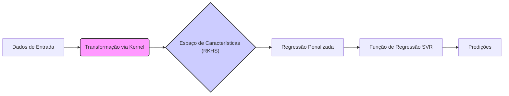
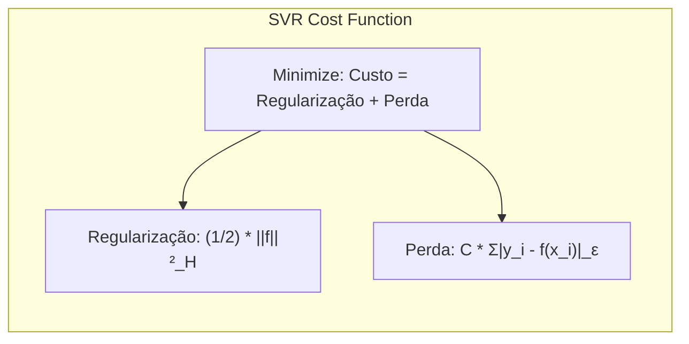
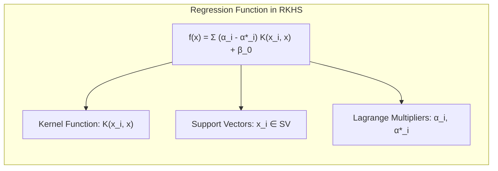
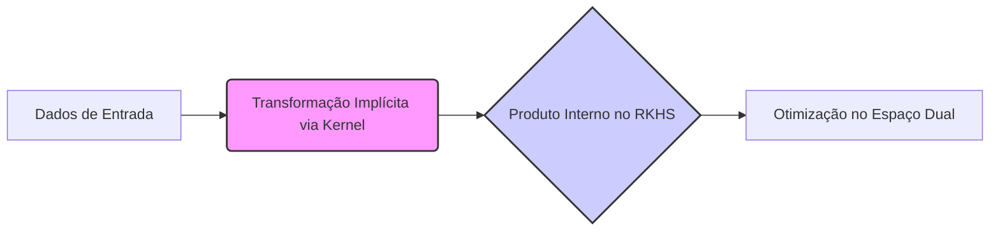

Okay, let's enhance the text with practical numerical examples to solidify the understanding of Support Vector Regression (SVR) and kernel methods.

## Título: Conexão Explícita entre Support Vector Regression e Métodos Kernel: Regressão Penalizada em RKHS

### Introdução

Em capítulos anteriores, exploramos a formulação da **Support Vector Regression (SVR)** e o uso de **funções *kernel*** para lidar com a não linearidade. Neste capítulo, vamos estabelecer a conexão explícita entre SVR e métodos *kernel*, através da perspectiva da **regressão penalizada** em um **Espaço de Hilbert com Kernel Reprodutor (RKHS)**. Demonstraremos como a função de perda ε-insensível, o termo de regularização e o *kernel trick* se combinam para construir um método de regressão poderoso e flexível, capaz de lidar com dados complexos.

A visão das SVRs como um método de regressão penalizada em um RKHS fornece uma base teórica sólida para entender como as funções *kernel* definem um espaço de funções onde as operações são realizadas de forma eficiente. Analisaremos como a função de perda ε-insensível e a regularização afetam a forma da função de regressão e como o *kernel trick* permite trabalhar com espaços de *features* de dimensão muito alta sem explicitar a transformação dos dados.

A compreensão da conexão explícita entre SVR, métodos *kernel* e RKHS permite que as SVMs sejam vistas como uma ferramenta de regressão flexível e com resultados robustos.

### SVR como Regressão Penalizada em um RKHS

**Conceito 1: A Função de Perda ε-Insensível e o Termo de Regularização**

A formulação da SVR como um problema de regressão penalizada em um RKHS envolve minimizar uma função de custo que combina uma função de perda com um termo de regularização. O objetivo é encontrar uma função $f(x)$ que minimize o erro de regressão, ao mesmo tempo em que evita o *overfitting*.

A função de custo da SVR é dada por:

$$ \min_{f \in \mathcal{H}} \frac{1}{2} ||f||_{\mathcal{H}}^2 + C \sum_{i=1}^N |y_i - f(x_i)|_\epsilon $$

onde:

*   $||f||_{\mathcal{H}}^2$ é um termo de regularização que controla a complexidade da função $f$ no RKHS $\mathcal{H}$, e representa a norma ao quadrado de $f$ neste espaço.
*   $|y_i - f(x_i)|_\epsilon$ é a função de perda ε-insensível, que mede o erro de regressão entre a predição $f(x_i)$ e o valor de resposta $y_i$, ignorando erros menores que $\epsilon$.
*   $C$ é o parâmetro de regularização, que controla o compromisso entre a minimização do erro de regressão e a complexidade do modelo.

Essa função de custo penaliza a complexidade da função de regressão (através da regularização) e também penaliza erros de regressão com o uso da função de perda ε-insensível, que penaliza erros de forma linear se o valor absoluto do erro for maior do que $\epsilon$, e ignora erros menores ou iguais a $\epsilon$.

> 💡 **Exemplo Numérico:**
>
> Vamos supor que temos um conjunto de dados com um único ponto $(x_1, y_1) = (2, 5)$ e queremos ajustar um modelo SVR. Vamos usar $\epsilon = 1$ e $C = 1$. Considere uma função $f(x)$ tal que $f(x_1) = 6$. O erro é $|y_1 - f(x_1)| = |5 - 6| = 1$. Como este erro é igual a $\epsilon$, a função de perda ε-insensível $|y_1 - f(x_1)|_\epsilon$ será 0. Se $f(x_1) = 7$, o erro seria $|5 - 7| = 2$, e a função de perda ε-insensível será $2 - 1 = 1$. Se $f(x_1) = 4$, o erro seria $|5 - 4| = 1$, e a função de perda ε-insensível será 0. Se $f(x_1) = 3$, o erro seria $|5 - 3| = 2$, e a função de perda ε-insensível será $2 - 1 = 1$.
>
> Agora, vamos considerar um cenário mais completo com três pontos: $(x_1, y_1) = (1, 2)$, $(x_2, y_2) = (2, 4)$, e $(x_3, y_3) = (3, 5)$. Suponha que tenhamos uma função $f(x)$ tal que $f(x_1) = 2.5$, $f(x_2) = 3.8$, e $f(x_3) = 5.2$.
>
> 1.  **Cálculo dos Erros:**
>    *   $|y_1 - f(x_1)| = |2 - 2.5| = 0.5$
>    *   $|y_2 - f(x_2)| = |4 - 3.8| = 0.2$
>    *   $|y_3 - f(x_3)| = |5 - 5.2| = 0.2$
>
> 2.  **Cálculo da Perda ε-Insensível (com $\epsilon = 0.3$):**
>    *   $|y_1 - f(x_1)|_\epsilon = max(0, 0.5 - 0.3) = 0.2$
>    *   $|y_2 - f(x_2)|_\epsilon = max(0, 0.2 - 0.3) = 0$
>    *   $|y_3 - f(x_3)|_\epsilon = max(0, 0.2 - 0.3) = 0$
>
> 3.  **Cálculo do Termo de Regularização:**
>    Para simplificar, vamos assumir que $||f||_{\mathcal{H}}^2 = 0.1$ (em uma aplicação real, este valor seria calculado com base na função $f$ e no kernel).
>
> 4.  **Função de Custo Total (com $C=1$):**
>
>     $ \text{Custo} = \frac{1}{2} \times 0.1 + 1 \times (0.2 + 0 + 0) = 0.05 + 0.2 = 0.25 $
>
> Se tivéssemos uma função $g(x)$ com  $g(x_1) = 2.4$, $g(x_2) = 4.1$, e $g(x_3) = 4.9$, com um termo de regularização $||g||_{\mathcal{H}}^2 = 0.15$:
>
>  *   $|y_1 - g(x_1)| = |2 - 2.4| = 0.4$
>  *   $|y_2 - g(x_2)| = |4 - 4.1| = 0.1$
>  *   $|y_3 - g(x_3)| = |5 - 4.9| = 0.1$
>
>  *   $|y_1 - g(x_1)|_\epsilon = max(0, 0.4 - 0.3) = 0.1$
>  *   $|y_2 - g(x_2)|_\epsilon = max(0, 0.1 - 0.3) = 0$
>  *   $|y_3 - g(x_3)|_\epsilon = max(0, 0.1 - 0.3) = 0$
>
>   $ \text{Custo} = \frac{1}{2} \times 0.15 + 1 \times (0.1 + 0 + 0) = 0.075 + 0.1 = 0.175 $
>
>   Neste exemplo simplificado, a função $g(x)$ teria um custo menor e seria preferível.

**Lemma 1:** A função de custo da SVR combina um termo de regularização que controla a complexidade da função com uma função de perda ε-insensível que penaliza erros de regressão maiores que ε.

A demonstração desse lemma se baseia na análise da função de custo e como ela é construída para combinar os conceitos de regressão, regularização e tolerância a erros, com a função de perda ε-insensível e o termo de regularização, que trabalham em conjunto para construir o modelo.

**Conceito 2: A Representação da Função de Regressão no RKHS**

The solution to the SVR optimization problem can be expressed as a linear combination of kernel functions centered on the support vectors:

$$ f(x) = \sum_{i \in SV} (\alpha_i - \alpha_i^*) K(x_i, x) + \beta_0 $$

where $\alpha_i$ and $\alpha_i^*$ are the Lagrange multipliers obtained from solving the dual problem, $K(x_i, x)$ is the kernel function, and $SV$ is the set of support vectors.

Essa equação demonstra que a função de regressão reside no Espaço de Hilbert com Kernel Reprodutor (RKHS) definido pelo *kernel* $K(x, x')$. A função de regressão também é uma combinação linear de funções definidas em termos de $x$.

> 💡 **Exemplo Numérico:**
>
> Suponha que após resolver o problema dual, identificamos dois vetores de suporte: $x_1 = 1$ e $x_2 = 3$, e os multiplicadores de Lagrange resultantes são: $\alpha_1 = 0.5$, $\alpha_1^* = 0$, $\alpha_2 = 0.2$, e $\alpha_2^* = 0.1$. Além disso, $\beta_0 = 0.1$. Vamos usar um kernel gaussiano com $\gamma = 0.5$: $K(x_i, x_j) = \exp(-\gamma ||x_i - x_j||^2)$.
>
>  1. **Cálculo dos Kernels para um novo ponto $x = 2$:**
>
>    *   $K(x_1, x) = \exp(-0.5 * (1 - 2)^2) = \exp(-0.5) \approx 0.606$
>    *   $K(x_2, x) = \exp(-0.5 * (3 - 2)^2) = \exp(-0.5) \approx 0.606$
>
>  2. **Cálculo da Predição $f(x)$:**
>
>    $f(x) = (0.5 - 0) * 0.606 + (0.2 - 0.1) * 0.606 + 0.1 = 0.303 + 0.0606 + 0.1 = 0.4636$
>
>    Portanto, a predição para $x=2$ usando esses vetores de suporte e seus multiplicadores, seria aproximadamente 0.4636.

**Corolário 1:** A função de regressão na SVR é uma combinação linear de funções *kernel* centradas nos vetores de suporte, o que a coloca no RKHS definido pelo *kernel* utilizado.

A demonstração desse corolário se baseia na análise da solução do problema dual da SVR, onde a função de regressão é expressa como uma combinação linear de funções *kernel* centradas nos vetores de suporte, e como esta representação garante a sua inclusão no RKHS.

### A Conexão com Métodos Kernel via o "Kernel Trick"

A conexão explícita da SVR com os métodos *kernel* se dá através do "kernel trick", que permite que o problema de otimização seja resolvido utilizando apenas os produtos internos no espaço transformado de *features*. Ao expressar o problema de otimização no espaço dual, onde os parâmetros são os multiplicadores de Lagrange, a função objetivo depende apenas dos produtos internos entre os dados de treinamento:

$$ \max_{\alpha, \alpha^*} \frac{1}{2} \sum_{i=1}^N \sum_{j=1}^N (\alpha_i - \alpha_i^*) (\alpha_j - \alpha_j^*) K(x_i, x_j) - \epsilon \sum_{i=1}^N (\alpha_i + \alpha_i^*) + \sum_{i=1}^N y_i (\alpha_i - \alpha_i^*)  $$

O *kernel trick* permite substituir o produto interno $x_i^T x_j$ por uma função *kernel* $K(x_i, x_j)$, que pode ser utilizada para mapear os dados para espaços de *features* de alta dimensão, sem explicitar a transformação. Essa propriedade é fundamental para a capacidade da SVR de modelar relações não lineares entre as *features* e a variável de resposta.

The SVR regression function, as previously seen, is also expressed in terms of the kernel function:

$$ f(x) = \sum_{i \in SV} (\alpha_i - \alpha_i^*) K(x_i, x) + \beta_0 $$

where $SV$ is the set of support vectors.

The utilization of the *kernel trick* in SVR, together with the ε-insensitive loss function and regularization, allows for the construction of robust and flexible models for regression problems, which adapt to the complexity of the data and exhibit good generalization capabilities.

> 💡 **Exemplo Numérico:**
>
> Vamos considerar um exemplo simplificado com dois pontos de dados: $x_1 = [1, 2]$ e $x_2 = [2, 1]$. Usaremos um kernel polinomial de grau 2: $K(x_i, x_j) = (x_i^T x_j + 1)^2$.
>
> 1.  **Cálculo do produto interno no espaço original:**
>
>     $x_1^T x_2 = (1 * 2) + (2 * 1) = 4$
>
>  2.  **Cálculo do Kernel:**
>
>     $K(x_1, x_2) = (4 + 1)^2 = 25$
>
> Agora, vamos visualizar o que o kernel faz de forma implícita. O kernel polinomial de grau 2 com um offset de 1 expande os dados para um espaço de 6 dimensões:
>
> $\phi(x) = [x_1^2, x_2^2, \sqrt{2}x_1x_2, \sqrt{2}x_1, \sqrt{2}x_2, 1]$
>
> Aplicando essa transformação aos nossos dados:
>
> $\phi(x_1) = [1, 4, 2\sqrt{2}, \sqrt{2}, 2\sqrt{2}, 1]$
> $\phi(x_2) = [4, 1, 2\sqrt{2}, 2\sqrt{2}, \sqrt{2}, 1]$
>
> 3.  **Cálculo do produto interno no espaço transformado:**
>
>     $\phi(x_1)^T \phi(x_2) = (1*4) + (4*1) + (2\sqrt{2}*2\sqrt{2}) + (\sqrt{2}*2\sqrt{2}) + (2\sqrt{2}*\sqrt{2}) + (1*1) = 4 + 4 + 8 + 4 + 4 + 1 = 25$
>
>     Observe que $K(x_1, x_2) = \phi(x_1)^T \phi(x_2)$, ou seja, o kernel nos permite calcular o produto interno no espaço transformado sem explicitamente transformar os dados.

**Lemma 2:** A dualidade permite que a SVR utilize o *kernel trick*, onde o produto interno no espaço de *features* transformado é calculado através da função *kernel*, o que permite que o problema seja resolvido de forma eficiente, mesmo em espaços de alta dimensão.

A demonstração desse lemma se baseia na análise da formulação do problema dual da SVR e como a função *kernel* se integra nessa formulação, permitindo que a solução seja expressa em termos de produto interno no espaço transformado.

### A Interpretação Geométrica da Regularização no RKHS

A regularização L2, expressa pelo termo $\frac{1}{2} ||f||_{\mathcal{H}}^2$ na função de custo da SVR, pode ser interpretada como uma forma de controlar a complexidade da função $f$ no **Reproducing Kernel Hilbert Space (RKHS)**. A minimização da norma da função $f$ no RKHS leva a funções mais suaves, com menor variabilidade e, consequentemente, com melhor capacidade de generalização para dados não vistos.

O RKHS, como discutido em capítulos anteriores, é um espaço de funções definido pelo *kernel* utilizado. A norma no RKHS $||f||_{\mathcal{H}}$ pode ser vista como uma medida da complexidade da função $f$ nesse espaço. Ao minimizar a norma, a SVR busca uma solução que é "simples" no espaço de *features* transformado.

> 💡 **Exemplo Numérico:**
>
> Imagine que temos duas funções $f_1(x)$ e $f_2(x)$ no RKHS. $f_1(x)$ é uma função muito complexa, que se ajusta perfeitamente aos dados de treinamento, mas tem muitas oscilações. $f_2(x)$ é uma função mais suave, que não se ajusta perfeitamente aos dados de treinamento, mas tem menos oscilações.
>
> Suponha que a norma de $f_1(x)$ no RKHS seja $||f_1||_{\mathcal{H}} = 5$ (então $||f_1||_{\mathcal{H}}^2 = 25$) e a norma de $f_2(x)$ seja $||f_2||_{\mathcal{H}} = 2$ (então $||f_2||_{\mathcal{H}}^2 = 4$). O termo de regularização $\frac{1}{2} ||f||_{\mathcal{H}}^2$ penalizará $f_1(x)$ mais fortemente do que $f_2(x)$, favorecendo a função mais suave.
>
> Isso ocorre porque a regularização L2 busca minimizar a norma da função no RKHS, o que, geometricamente, corresponde a encontrar funções mais próximas da origem nesse espaço, resultando em funções com menor variação.

The use of L2 regularization, together with the ε-insensitive loss function, allows us to achieve a good balance between the model's ability to fit training data and its ability to generalize to new data. The parameter C controls the relative importance of these two terms in the cost function.

**Corolário 2:** A regularização L2 no RKHS controla a complexidade da função de regressão e leva a modelos mais estáveis e com melhor capacidade de generalização para dados não vistos.

A demonstração desse corolário se baseia na análise da influência do termo de regularização no espaço RKHS e como esse termo restringe a variabilidade das funções de regressão.

### Conclusão

Neste capítulo, estabelecemos a conexão explícita entre a **Support Vector Regression (SVR)** e os **métodos *kernel*** através da perspectiva da **regressão penalizada** em um **Espaço de Hilbert com Kernel Reprodutor (RKHS)**. Vimos como a função de perda ε-insensível, o termo de regularização e o *kernel trick* se combinam para construir um método de regressão poderoso e flexível.

Analisamos a interpretação da função de custo da SVR como um problema de minimização de erro com uma penalização que controla a complexidade do modelo. Exploramos também a formulação da SVR no RKHS, onde a função de regressão reside nesse espaço e é expressa em termos de produtos internos, o que permite o uso de funções *kernel*. Discutimos a importância do parâmetro C e como ele controla a força da regularização, levando a modelos mais ou menos complexos.

A compreensão das SVRs como um método de regressão penalizada em um RKHS proporciona uma visão mais completa e profunda sobre o funcionamento desse método e suas conexões com outras técnicas de aprendizado de máquina, além de explicitar a utilização da função de perda ε-insensível e o papel dos kernels em sua formulação.

### Footnotes

[^12.1]: "In this chapter we describe generalizations of linear decision boundaries for classification. Optimal separating hyperplanes are introduced in Chapter 4 for the case when two classes are linearly separable. Here we cover extensions to the nonseparable case, where the classes overlap. These techniques are then generalized to what is known as the support vector machine, which produces nonlinear boundaries by constructing a linear boundary in a large, transformed version of the feature space." *(Trecho de  "Support Vector Machines and Flexible Discriminants")*

[^12.2]: "In Chapter 4 we discussed a technique for constructing an optimal separating hyperplane between two perfectly separated classes. We review this and generalize to the nonseparable case, where the classes may not be separable by a linear boundary." *(Trecho de  "Support Vector Machines and Flexible Discriminants")*

[^12.3]:  "We showed that this problem can be more conveniently rephrased as min ||β|| subject to yi(x+β + β‰) ≥ 1, i = 1, ..., N"  *(Trecho de "Support Vector Machines and Flexible Discriminants")*
