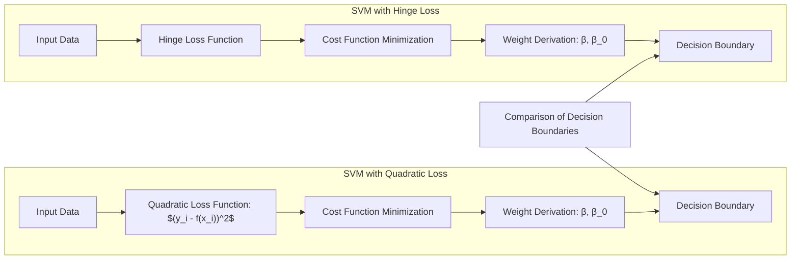
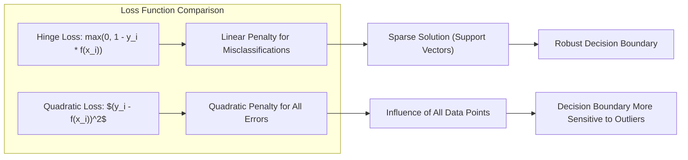
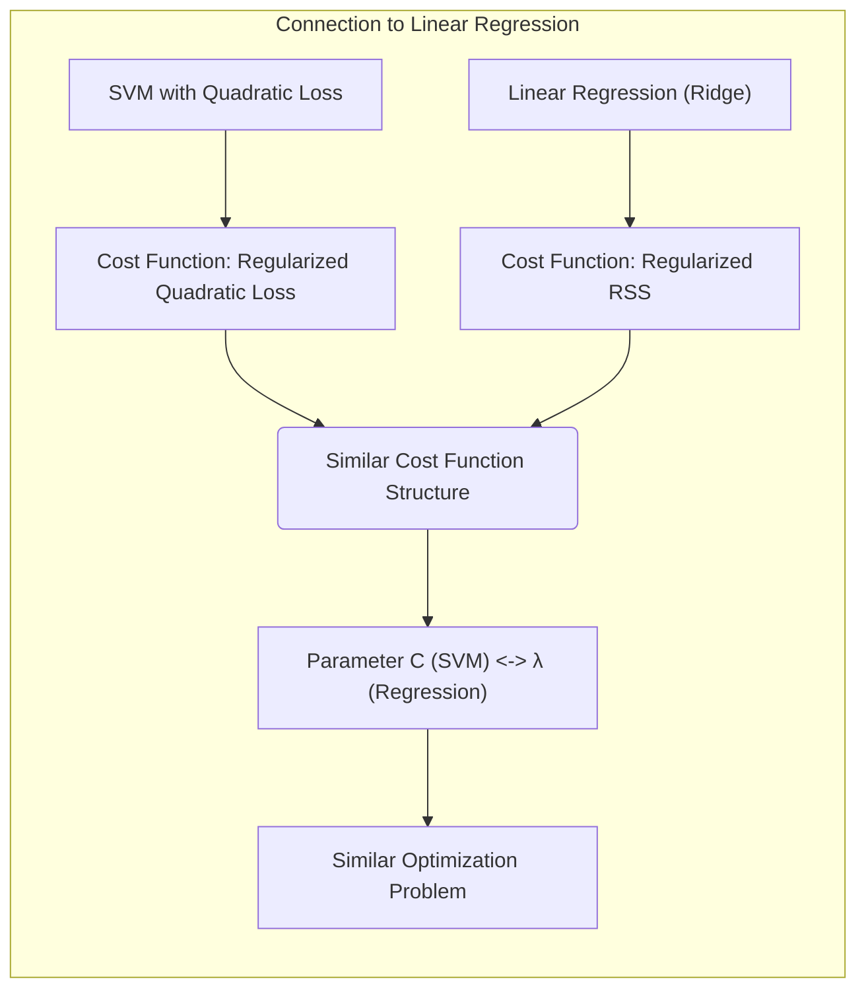
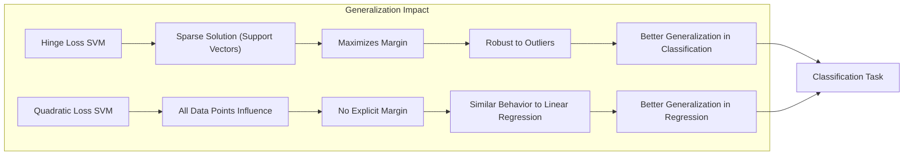

Okay, let's enhance the text with practical numerical examples to illustrate the concepts discussed.

## Título: SVMs com Perda Quadrática: Derivação dos Pesos e Conexão com Métodos de Regressão



### Introdução

Embora as **Support Vector Machines (SVMs)** sejam geralmente associadas à utilização da função de perda *hinge loss* para problemas de classificação e da função de perda ε-insensível para problemas de regressão, a análise do comportamento das SVMs com uma **função de perda quadrática** fornece uma perspectiva interessante sobre a formulação matemática do modelo e sua relação com outros métodos de aprendizado de máquina, como a regressão linear.

Neste capítulo, exploraremos como a utilização da função de perda quadrática afeta a derivação dos pesos nas SVMs e como essa abordagem se conecta com a solução de problemas de ajuste de função. Analisaremos as diferenças entre a utilização da função de perda quadrática e a utilização da função de perda *hinge loss* e como essas diferenças impactam a forma da fronteira de decisão e a capacidade de generalização do modelo. Além disso, examinaremos a relação entre a solução obtida com o uso da função de perda quadrática e métodos tradicionais de regressão, como a regressão linear.

A compreensão da utilização da função de perda quadrática no contexto das SVMs fornece *insights* valiosos sobre a natureza desse método e como sua formulação pode ser adaptada para diferentes tipos de problemas e dados.

### Derivação dos Pesos com Perda Quadrática

**Conceito 1: Função de Perda Quadrática e a Formulação do Problema**

No contexto das SVMs, vamos analisar o efeito da substituição da função de perda *hinge loss* pela **função de perda quadrática**, que penaliza o erro ao quadrado, similar ao que é feito na regressão linear. A função de perda quadrática é dada por:

$$ L(y_i, f(x_i)) = (y_i - f(x_i))^2 $$

onde $y_i$ é o rótulo da classe e $f(x_i)$ é a predição do modelo. A função de perda quadrática penaliza erros de predição de forma proporcional ao quadrado da magnitude do erro.

Utilizando essa função de perda, a função de custo da SVM pode ser expressa como:

$$ \min_{\beta, \beta_0} \frac{1}{2} ||\beta||^2 + C \sum_{i=1}^N (y_i - (x_i^T\beta + \beta_0))^2 $$

onde o primeiro termo é o termo de regularização que controla a complexidade do modelo e o segundo termo penaliza o erro quadrático entre as predições e os rótulos das classes.

> 💡 **Exemplo Numérico:**
>
> Imagine um conjunto de dados simples com duas amostras, onde $x_1 = [1, 2]^T$, $y_1 = 1$ e $x_2 = [2, 1]^T$, $y_2 = -1$. Vamos supor $C = 1$.  A função de custo a ser minimizada é:
>
> $$ J(\beta, \beta_0) = \frac{1}{2} ||\beta||^2 + 1 \cdot \left[ (1 - (x_1^T\beta + \beta_0))^2 + (-1 - (x_2^T\beta + \beta_0))^2 \right] $$
>
> Expandindo:
>
> $$ J(\beta, \beta_0) = \frac{1}{2} (\beta_1^2 + \beta_2^2) + (1 - (\beta_1 + 2\beta_2 + \beta_0))^2 + (-1 - (2\beta_1 + \beta_2 + \beta_0))^2 $$
>
> Este exemplo ilustra como a função de custo penaliza tanto a magnitude dos pesos ($\beta$) quanto os erros de predição.

**Lemma 1:** A substituição da função de perda *hinge loss* pela função de perda quadrática leva a um problema de otimização que penaliza todos os erros de forma proporcional ao quadrado de sua magnitude, o que é diferente da *hinge loss*, que penaliza erros de classificação de forma linear, apenas quando a amostra está do lado errado da margem.



A demonstração desse lemma se baseia na análise da forma da função de perda quadrática e como ela penaliza erros grandes de forma mais acentuada que a *hinge loss*.

**Conceito 2: Derivação dos Pesos utilizando Mínimos Quadrados**

Para encontrar a solução ótima do problema de otimização com a função de perda quadrática, podemos utilizar o método dos **mínimos quadrados**. A ideia é encontrar os valores de $\beta$ e $\beta_0$ que minimizam a função de custo acima. A derivação dos pesos envolve calcular as derivadas parciais da função de custo em relação a $\beta$ e $\beta_0$ e igualar essas derivadas a zero.

A derivada da função de custo em relação a $\beta$ é dada por:

$$ \frac{\partial}{\partial \beta} \left[ \frac{1}{2} ||\beta||^2 + C \sum_{i=1}^N (y_i - (x_i^T\beta + \beta_0))^2 \right] = \beta - 2C \sum_{i=1}^N (y_i - (x_i^T\beta + \beta_0))x_i = 0 $$

e em relação a $\beta_0$:

$$ \frac{\partial}{\partial \beta_0} \left[ \frac{1}{2} ||\beta||^2 + C \sum_{i=1}^N (y_i - (x_i^T\beta + \beta_0))^2 \right] = -2C \sum_{i=1}^N (y_i - (x_i^T\beta + \beta_0)) = 0 $$

Da primeira equação, podemos derivar a expressão para $\beta$:

$$ \beta = 2C \sum_{i=1}^N (y_i - (x_i^T\beta + \beta_0))x_i $$

e da segunda equação, podemos derivar a expressão para $\beta_0$:

$$ \sum_{i=1}^N (y_i - (x_i^T\beta + \beta_0)) = 0 $$

que pode ser reescrita como:

$$ \beta_0 = \frac{1}{N} \sum_{i=1}^N y_i - \frac{1}{N} \sum_{i=1}^N x_i^T\beta  $$

Essas equações demonstram como o vetor $\beta$ e o parâmetro $\beta_0$ são relacionados aos dados de treinamento e ao parâmetro de regularização $C$ com uma função de perda quadrática.

> 💡 **Exemplo Numérico:**
>
> Continuando o exemplo anterior, podemos escrever as equações para $\beta$ e $\beta_0$. Primeiro, vamos calcular $\beta_0$:
>
> $$ \beta_0 = \frac{1}{2} (1 + (-1)) - \frac{1}{2} \left( [1, 2]\beta + [2, 1]\beta \right) =  - \frac{1}{2} (3\beta_1 + 3\beta_2) = - \frac{3}{2}(\beta_1 + \beta_2) $$
>
> Agora, vamos calcular $\beta$:
>
> $$ \beta = 2 \cdot 1 \cdot \left( (1 - (\beta_1 + 2\beta_2 + \beta_0))[1, 2]^T + (-1 - (2\beta_1 + \beta_2 + \beta_0))[2, 1]^T \right) $$
>
> Substituindo $\beta_0$:
>
> $$ \beta = 2 \cdot \left( (1 - (\beta_1 + 2\beta_2 - \frac{3}{2}(\beta_1 + \beta_2)))[1, 2]^T + (-1 - (2\beta_1 + \beta_2 - \frac{3}{2}(\beta_1 + \beta_2)))[2, 1]^T \right) $$
>
> Simplificando:
>
> $$ \beta = 2 \cdot \left( (1 + \frac{1}{2}\beta_1 - \frac{1}{2}\beta_2)[1, 2]^T + (-1 - \frac{1}{2}\beta_1 + \frac{1}{2}\beta_2)[2, 1]^T \right) $$
>
> $$ \beta = \left[ 2(1 + \frac{1}{2}\beta_1 - \frac{1}{2}\beta_2) + 4(-1 - \frac{1}{2}\beta_1 + \frac{1}{2}\beta_2), 4(1 + \frac{1}{2}\beta_1 - \frac{1}{2}\beta_2) + 2(-1 - \frac{1}{2}\beta_1 + \frac{1}{2}\beta_2) \right]^T $$
>
> $$ \beta = \left[ -2 - \beta_1 + \beta_2, 2 + \beta_1 - \beta_2 \right]^T $$
>
>  Este sistema de equações pode ser resolvido numericamente para encontrar $\beta_1$ e $\beta_2$, que em conjunto com $\beta_0$ definem o modelo.

**Corolário 1:** A utilização da função de perda quadrática leva a uma solução em forma fechada para o vetor $\beta$ e o parâmetro $\beta_0$ por meio do método dos mínimos quadrados, com uma dependência do parâmetro de regularização $C$ e dos dados de treinamento.

A demonstração desse corolário se baseia na análise das derivadas da função de custo e como elas são usadas para derivar as expressões de $\beta$ e $\beta_0$, que são definidas em termos de uma equação que pode ser resolvida através dos métodos de mínimos quadrados.

### Conexão com Métodos de Regressão Linear



A utilização da função de perda quadrática nas SVMs aproxima o método da **regressão linear**. A função de custo da regressão linear com regularização L2 (ridge regression) é dada por:

$$ \min_{\beta, \beta_0} \frac{1}{2} ||\beta||^2 + \lambda \sum_{i=1}^N (y_i - (x_i^T\beta + \beta_0))^2 $$

Essa função de custo é similar àquela utilizada na SVM com perda quadrática, com a diferença de que a constante $C$ na SVM corresponde ao inverso do parâmetro de regularização $\lambda$ na regressão linear.

A similaridade entre os dois métodos demonstra que a SVM com função de perda quadrática pode ser vista como uma versão regularizada da regressão linear, onde o termo de regularização $\frac{1}{2} ||\beta||^2$ controla a complexidade do modelo, e a função de perda $(y_i - (x_i^T\beta + \beta_0))^2$ penaliza os erros de predição.

A diferença fundamental entre as SVMs e a regressão linear reside na utilização da função de perda *hinge loss* nas SVMs, que leva a soluções esparsas (com vetores de suporte) e a um comportamento diferente da função de decisão, que é mais robusta e menos propensa ao *overfitting*. A função de perda quadrática é uma alternativa quando se quer um modelo mais próximo da regressão linear.

> 💡 **Exemplo Numérico:**
>
>  Considerando um problema de regressão com os mesmos dados do exemplo anterior, onde $x_1 = [1, 2]^T$, $y_1 = 1$ e $x_2 = [2, 1]^T$, $y_2 = -1$, e usando a função de custo da regressão linear com regularização L2 (Ridge) com $\lambda = 1$.  A função de custo se torna:
>
> $$ J(\beta, \beta_0) = \frac{1}{2} ||\beta||^2 + 1 \cdot \left[ (1 - (x_1^T\beta + \beta_0))^2 + (-1 - (x_2^T\beta + \beta_0))^2 \right] $$
>
>  Note que esta é a mesma função de custo do exemplo anterior para SVM com perda quadrática com $C=1$. Isso demonstra a equivalência entre os dois métodos sob certas condições. Se usarmos um valor diferente de $\lambda$, por exemplo $\lambda=0.5$, isso seria equivalente a uma SVM com $C=2$.
>
>  Para encontrar os pesos, podemos usar a mesma estratégia de minimizar a função de custo derivando e igualando a zero, como feito anteriormente.

**Lemma 3:** A SVM com função de perda quadrática pode ser vista como uma versão regularizada da regressão linear, com uma função de custo similar, mas com um comportamento diferente da função de decisão em comparação com a SVM com *hinge loss*.

A demonstração desse lemma se baseia na comparação da função de custo da SVM com perda quadrática e da função de custo da regressão linear com regularização L2, mostrando a similaridade das duas formulações e como o parâmetro de regularização controla a complexidade do modelo em ambos os casos.

### Impacto da Perda Quadrática na Generalização



A substituição da função de perda *hinge loss* pela função de perda quadrática tem um impacto significativo na forma da fronteira de decisão e na capacidade de generalização do modelo SVM.

*   **Função de Perda Hinge Loss:** A função de perda *hinge loss* leva a soluções esparsas, onde apenas os vetores de suporte são relevantes para a definição do hiperplano separador. Essa função também incentiva a maximização da margem de separação entre as classes, o que resulta em modelos mais robustos e menos propensos ao *overfitting*.

*   **Função de Perda Quadrática:** A função de perda quadrática penaliza todos os erros de forma igualitária, e a solução é mais influenciada por pontos longe da margem do que a *hinge loss*. A fronteira de decisão com perda quadrática não é definida apenas pelos vetores de suporte e pode apresentar uma maior variância quando comparada com a *hinge loss*. Além disso, a função de decisão não possui um conceito de margem como o definido na SVM com perda hinge, o que leva a um comportamento similar à regressão linear.

> 💡 **Exemplo Numérico:**
>
> Para ilustrar o impacto na generalização, vamos considerar um conjunto de dados bidimensional com duas classes. Suponha que temos os seguintes pontos:
>
> Classe 1: $x_1 = [1, 1]^T$, $x_2 = [2, 2]^T$, $x_3 = [1, 2]^T$ ($y_i = 1$)
>
> Classe -1: $x_4 = [3, 1]^T$, $x_5 = [4, 2]^T$, $x_6 = [3, 2]^T$ ($y_i = -1$)
>
> 1. **SVM com Hinge Loss:** Ao treinar uma SVM com hinge loss, a fronteira de decisão tenderá a maximizar a margem entre as duas classes, possivelmente selecionando $x_1, x_3, x_4$ e $x_6$ como vetores de suporte.
>
> 2. **SVM com Perda Quadrática:** Ao treinar uma SVM com perda quadrática, todos os pontos irão influenciar a decisão.  A fronteira será mais sensível a todos os pontos e tenderá a se comportar de maneira mais similar a uma regressão linear.  A fronteira pode ser mais influenciada por pontos mais distantes da fronteira ideal, o que pode levar a uma menor margem de separação.
>
> Podemos visualizar a diferença entre as duas abordagens no diagrama abaixo:
>
> ```mermaid
> graph LR
>     A[Dados] -->|Hinge Loss| B(Fronteira de Decisão Hinge);
>     A -->|Perda Quadrática| C(Fronteira de Decisão Quadrática);
>     B --> D{Margem Maximizada};
>     C --> E{Sem Margem Maximizada};
>     D --> F[Robustez];
>     E --> G[Influência de Todos os Pontos];
> ```
>
>  A visualização mostra que a *hinge loss* busca uma margem maximizada e a perda quadrática não.

Em geral, a função de perda *hinge loss* é mais adequada para problemas de classificação, onde o objetivo é separar as classes com uma margem de segurança e lidar com *outliers*. A função de perda quadrática pode ser mais apropriada para problemas de regressão, onde se busca minimizar o erro médio de predição, sem uma preocupação com a maximização da margem.

**Corolário 2:** A utilização da função de perda quadrática em SVMs leva a modelos que se aproximam da regressão linear, enquanto a utilização da função de perda *hinge loss* leva a modelos mais robustos, com margem de separação e esparsidade, com a desvantagem de modelos menos suaves, especialmente em problemas de regressão.

A demonstração desse corolário se baseia na análise das propriedades das funções de perda *hinge loss* e quadrática, como elas definem como os erros são penalizados, e como isso se reflete no comportamento da função de decisão e na capacidade de generalização do modelo.

### Conclusão

Neste capítulo, exploramos a utilização da **função de perda quadrática** para derivar os pesos nas **Support Vector Machines (SVMs)**. Vimos como a função de perda quadrática se relaciona com a formulação do problema de otimização, levando a soluções similares às obtidas na regressão linear com regularização L2.

Analisamos as diferenças entre a utilização da função de perda quadrática e da função de perda *hinge loss*, destacando como a escolha da função de perda impacta na forma da fronteira de decisão, na localização dos vetores de suporte e na capacidade de generalização do modelo. A utilização da função de perda quadrática fornece uma visão complementar da formulação das SVMs, mostrando a sua relação com métodos de regressão lineares e como essa relação se afasta ao utilizar a função de perda *hinge loss*.

A compreensão do efeito da função de perda na formulação da SVM permite uma utilização mais apropriada do método e uma escolha adequada dos parâmetros, de acordo com o problema em questão e as características dos dados.

### Footnotes

[^12.1]: "In this chapter we describe generalizations of linear decision boundaries for classification. Optimal separating hyperplanes are introduced in Chapter 4 for the case when two classes are linearly separable. Here we cover extensions to the nonseparable case, where the classes overlap. These techniques are then generalized to what is known as the support vector machine, which produces nonlinear boundaries by constructing a linear boundary in a large, transformed version of the feature space." *(Trecho de  "Support Vector Machines and Flexible Discriminants")*

[^12.2]: "In Chapter 4 we discussed a technique for constructing an optimal separating hyperplane between two perfectly separated classes. We review this and generalize to the nonseparable case, where the classes may not be separable by a linear boundary." *(Trecho de  "Support Vector Machines and Flexible Discriminants")*
