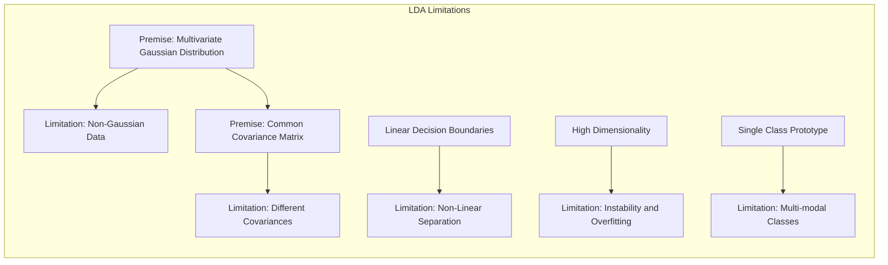
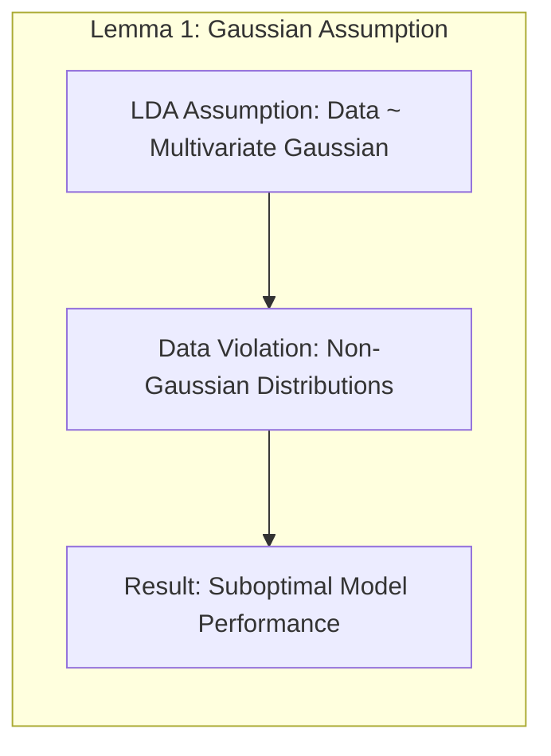
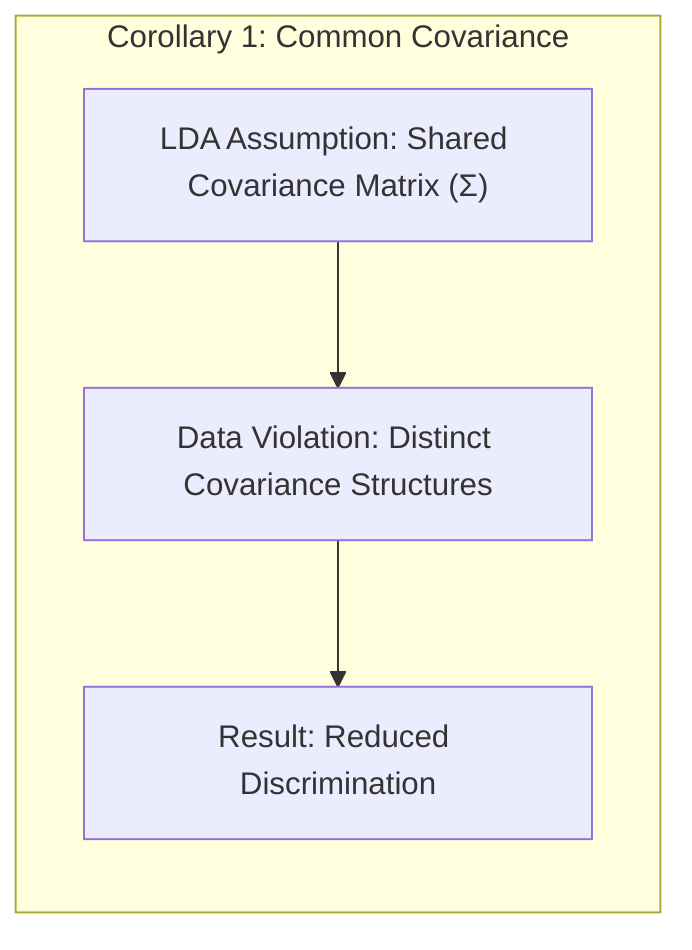
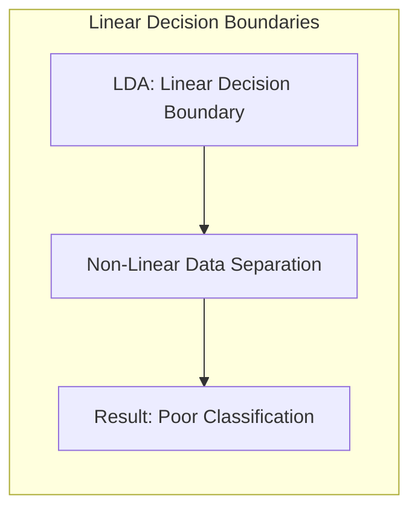
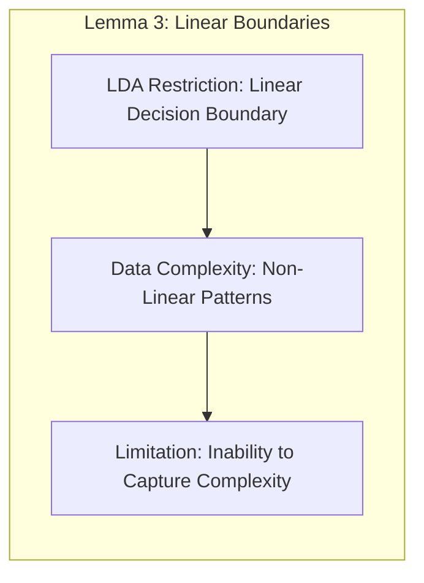
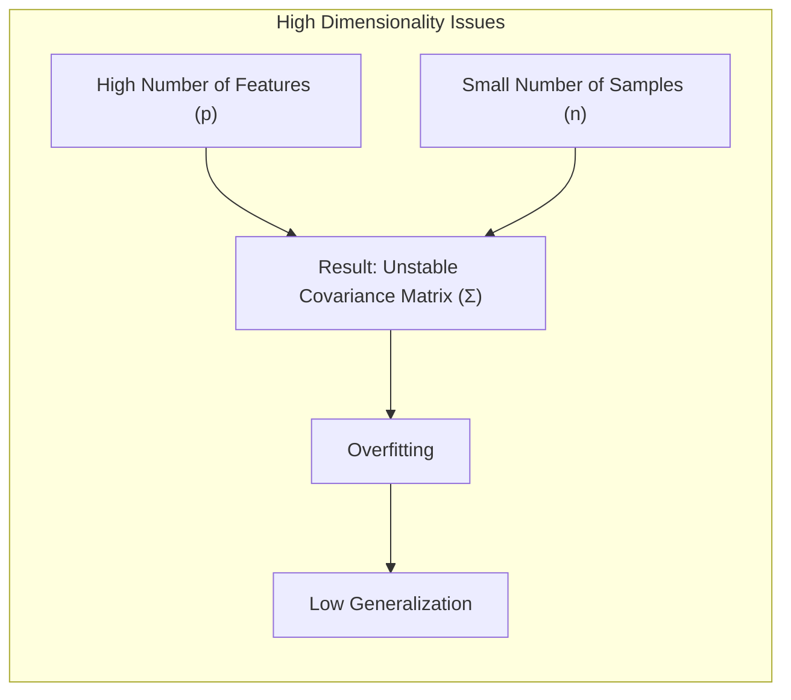
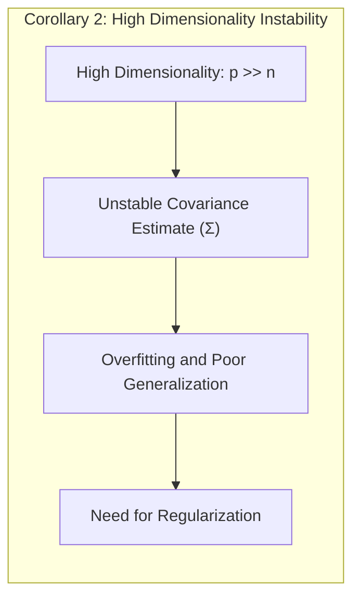
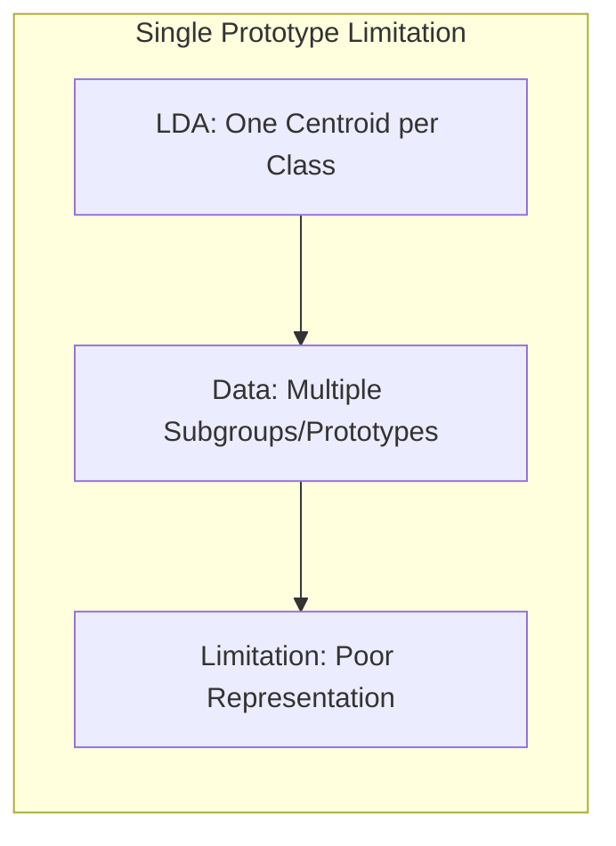
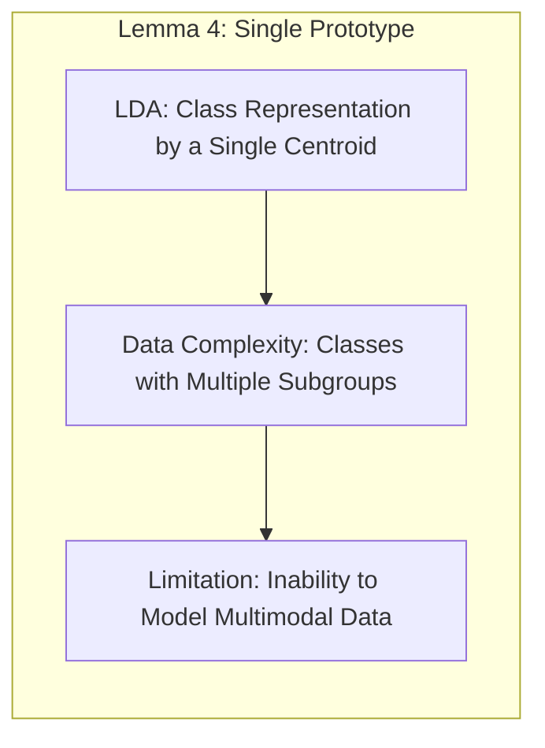

Okay, let's enhance the provided text with practical numerical examples to illustrate the limitations of Linear Discriminant Analysis (LDA).

## Título: Limitações da Análise Discriminante Linear (LDA): Uma Análise Crítica



### Introdução

A **Análise Discriminante Linear (LDA)** é um método clássico de classificação e redução de dimensionalidade que busca encontrar uma projeção linear que maximize a separação entre as classes e minimize a variância dentro de cada classe. Apesar de sua simplicidade e eficiência computacional, a LDA possui algumas **limitações** importantes que restringem sua aplicação em cenários com dados complexos.

Neste capítulo, exploraremos em detalhes as principais limitações da LDA, analisando as premissas subjacentes ao método e como a violação dessas premissas pode afetar o desempenho do modelo. Discutiremos as limitações da LDA em dados com distribuições não gaussianas, classes com covariâncias distintas e padrões de separação não linear. Examinaremos também como a LDA lida com a alta dimensionalidade e como suas limitações motivam a utilização de outras técnicas de classificação, incluindo as generalizações da LDA que serão discutidas em outros capítulos (FDA, PDA, MDA).

A compreensão das limitações da LDA é fundamental para escolher o método de classificação mais adequado para cada problema específico e para avaliar a qualidade dos resultados obtidos. A análise crítica da LDA nos permite apreciar o desenvolvimento de técnicas mais flexíveis e robustas.

### Premissas da LDA e suas Limitações

**Conceito 1: Premissa de Distribuição Gaussiana Multivariada**

A **Análise Discriminante Linear (LDA)** assume que os dados de cada classe seguem uma distribuição **Gaussiana Multivariada** com uma média específica para cada classe ($\mu_k$) e uma matriz de covariância comum para todas as classes ($\Sigma$). Essa premissa, embora simplifique a formulação matemática da LDA, pode não se sustentar em muitos conjuntos de dados do mundo real.

In situations where the distribution of the data is not Gaussian, the use of LDA can lead to suboptimal results, since the model cannot adequately capture the shape of the data distribution. The distribution of the data is a critical point of the LDA, as discussed in [^12.4].

> 💡 **Exemplo Numérico:**
>
> Suponha que temos duas classes de dados, onde a Classe 1 segue uma distribuição normal, e a Classe 2 segue uma distribuição exponencial.
>
> ```python
> import numpy as np
> import matplotlib.pyplot as plt
> from sklearn.discriminant_analysis import LinearDiscriminantAnalysis
>
> # Gerar dados simulados
> np.random.seed(42)
> mean_1 = [2, 2]
> cov_1 = [[1, 0], [0, 1]]
> class_1 = np.random.multivariate_normal(mean_1, cov_1, 100)
>
> class_2 = np.random.exponential(scale=1.5, size=(100,2)) + [0, 0]
>
> # Visualizar as distribuições
> plt.figure(figsize=(8, 6))
> plt.scatter(class_1[:, 0], class_1[:, 1], label='Classe 1 (Gaussiana)')
> plt.scatter(class_2[:, 0], class_2[:, 1], label='Classe 2 (Exponencial)')
> plt.xlabel('Feature 1')
> plt.ylabel('Feature 2')
> plt.title('Distribuições dos Dados')
> plt.legend()
> plt.show()
>
> # Preparar dados para LDA
> X = np.vstack((class_1, class_2))
> y = np.hstack((np.zeros(100), np.ones(100)))
>
> # Aplicar LDA
> lda = LinearDiscriminantAnalysis()
> lda.fit(X, y)
>
> # Criar uma grade para a fronteira de decisão
> x_min, x_max = X[:, 0].min() - 1, X[:, 0].max() + 1
> y_min, y_max = X[:, 1].min() - 1, X[:, 1].max() + 1
> xx, yy = np.meshgrid(np.arange(x_min, x_max, 0.02),
>                      np.arange(y_min, y_max, 0.02))
>
> Z = lda.predict(np.c_[xx.ravel(), yy.ravel()])
> Z = Z.reshape(xx.shape)
>
> # Plotar a fronteira de decisão
> plt.figure(figsize=(8, 6))
> plt.contourf(xx, yy, Z, alpha=0.3)
> plt.scatter(class_1[:, 0], class_1[:, 1], label='Classe 1 (Gaussiana)')
> plt.scatter(class_2[:, 0], class_2[:, 1], label='Classe 2 (Exponencial)')
> plt.xlabel('Feature 1')
> plt.ylabel('Feature 2')
> plt.title('Fronteira de Decisão LDA')
> plt.legend()
> plt.show()
>
> print(f"Acurácia do LDA: {lda.score(X, y):.2f}")
> ```
>
> No exemplo acima, a Classe 1 segue uma distribuição Gaussiana, enquanto a Classe 2 tem uma distribuição exponencial. A LDA, ao assumir gaussianidade para ambas as classes, não consegue modelar a Classe 2 adequadamente, resultando numa fronteira de decisão que não separa as classes de forma ideal. O score de acurácia será menor do que o ideal. A visualização também demonstra que a fronteira linear não consegue capturar a forma da distribuição exponencial.

**Lemma 1:** A premissa de distribuição Gaussiana multivariada é uma limitação da LDA, e a sua violação pode levar a modelos com baixo desempenho em conjuntos de dados com distribuições não gaussianas.



A demonstração desse lemma se baseia na análise da função discriminante da LDA, que é derivada sob a premissa de distribuição gaussiana. Quando a distribuição dos dados se desvia significativamente dessa premissa, a função discriminante não é mais uma boa aproximação da função de decisão Bayesiana.

**Conceito 2: Premissa de Covariância Comum**

A LDA também assume que todas as classes compartilham a mesma **matriz de covariância** $\Sigma$. Essa premissa implica que a forma das distribuições das classes é similar, diferindo apenas em seus centros (as médias). Em muitos conjuntos de dados, as classes podem apresentar estruturas de covariância distintas, e a utilização de uma matriz de covariância comum pode levar a um modelo inadequado.

> 💡 **Exemplo Numérico:**
>
> Considere duas classes com médias próximas, mas covariâncias muito diferentes:
>
> ```python
> import numpy as np
> import matplotlib.pyplot as plt
> from sklearn.discriminant_analysis import LinearDiscriminantAnalysis
>
> # Dados simulados
> np.random.seed(42)
> mean_1 = [0, 0]
> cov_1 = [[1, 0], [0, 1]]
> class_1 = np.random.multivariate_normal(mean_1, cov_1, 100)
>
> mean_2 = [1, 1]
> cov_2 = [[5, 0], [0, 0.2]]
> class_2 = np.random.multivariate_normal(mean_2, cov_2, 100)
>
> # Visualizar as distribuições
> plt.figure(figsize=(8, 6))
> plt.scatter(class_1[:, 0], class_1[:, 1], label='Classe 1')
> plt.scatter(class_2[:, 0], class_2[:, 1], label='Classe 2')
> plt.xlabel('Feature 1')
> plt.ylabel('Feature 2')
> plt.title('Distribuições dos Dados')
> plt.legend()
> plt.show()
>
> # Preparar dados para LDA
> X = np.vstack((class_1, class_2))
> y = np.hstack((np.zeros(100), np.ones(100)))
>
> # Aplicar LDA
> lda = LinearDiscriminantAnalysis()
> lda.fit(X, y)
>
> # Criar uma grade para a fronteira de decisão
> x_min, x_max = X[:, 0].min() - 1, X[:, 0].max() + 1
> y_min, y_max = X[:, 1].min() - 1, X[:, 1].max() + 1
> xx, yy = np.meshgrid(np.arange(x_min, x_max, 0.02),
>                      np.arange(y_min, y_max, 0.02))
>
> Z = lda.predict(np.c_[xx.ravel(), yy.ravel()])
> Z = Z.reshape(xx.shape)
>
> # Plotar a fronteira de decisão
> plt.figure(figsize=(8, 6))
> plt.contourf(xx, yy, Z, alpha=0.3)
> plt.scatter(class_1[:, 0], class_1[:, 1], label='Classe 1')
> plt.scatter(class_2[:, 0], class_2[:, 1], label='Classe 2')
> plt.xlabel('Feature 1')
> plt.ylabel('Feature 2')
> plt.title('Fronteira de Decisão LDA')
> plt.legend()
> plt.show()
>
> print(f"Acurácia do LDA: {lda.score(X, y):.2f}")
> ```
>
> Aqui, a Classe 1 tem uma covariância esférica, enquanto a Classe 2 é mais alongada. A LDA, ao assumir uma covariância comum, gera uma fronteira de decisão que não reflete a estrutura dos dados, levando a classificações incorretas. A fronteira de decisão é uma reta, o que não é ideal para separar as classes com covariâncias diferentes.

A premissa de covariância comum é uma limitação da LDA e, em muitos casos, pode levar a modelos com fronteiras de decisão subótimas.

**Corolário 1:** A premissa de covariância comum em LDA pode ser inadequada quando as classes apresentam formas de distribuição e relações entre as features distintas, e a violação dessa premissa leva a modelos com baixa capacidade de discriminação.



A demonstração desse corolário se baseia na análise da função discriminante da LDA e como ela é influenciada pela matriz de covariância. Quando as matrizes de covariância de diferentes classes são distintas, a função discriminante da LDA não consegue representar adequadamente a distribuição das classes.

### Fronteiras de Decisão Lineares e sua Inadequação



A LDA gera **fronteiras de decisão lineares**, o que pode ser inadequado para conjuntos de dados com padrões de separação não linear. Em muitos problemas práticos, as classes não podem ser separadas por uma linha reta ou por um hiperplano, e a utilização da LDA leva a modelos com alto viés e baixo desempenho.

> 💡 **Exemplo Numérico:**
>
> Considere um conjunto de dados onde as classes são separadas por um círculo, caracterizando uma relação não linear:
>
> ```python
> import numpy as np
> import matplotlib.pyplot as plt
> from sklearn.discriminant_analysis import LinearDiscriminantAnalysis
> from sklearn.datasets import make_circles
>
> # Gerar dados não lineares
> X, y = make_circles(n_samples=200, noise=0.08, factor=0.5, random_state=42)
>
> # Visualizar os dados
> plt.figure(figsize=(8, 6))
> plt.scatter(X[:, 0], X[:, 1], c=y, cmap=plt.cm.RdBu)
> plt.xlabel('Feature 1')
> plt.ylabel('Feature 2')
> plt.title('Dados com Separação Não Linear')
> plt.show()
>
> # Aplicar LDA
> lda = LinearDiscriminantAnalysis()
> lda.fit(X, y)
>
> # Criar uma grade para a fronteira de decisão
> x_min, x_max = X[:, 0].min() - 1, X[:, 0].max() + 1
> y_min, y_max = X[:, 1].min() - 1, X[:, 1].max() + 1
> xx, yy = np.meshgrid(np.arange(x_min, x_max, 0.02),
>                      np.arange(y_min, y_max, 0.02))
>
> Z = lda.predict(np.c_[xx.ravel(), yy.ravel()])
> Z = Z.reshape(xx.shape)
>
> # Plotar a fronteira de decisão
> plt.figure(figsize=(8, 6))
> plt.contourf(xx, yy, Z, alpha=0.3, cmap=plt.cm.RdBu)
> plt.scatter(X[:, 0], X[:, 1], c=y, cmap=plt.cm.RdBu)
> plt.xlabel('Feature 1')
> plt.ylabel('Feature 2')
> plt.title('Fronteira de Decisão LDA')
> plt.show()
>
> print(f"Acurácia do LDA: {lda.score(X, y):.2f}")
> ```
>
> Como podemos ver, a fronteira de decisão gerada pela LDA é uma linha reta, e não consegue separar as classes que estão dispostas em formato circular. Isso resulta em uma acurácia baixa, pois o modelo linear não é capaz de capturar a complexidade dos dados.

A linearidade da fronteira de decisão da LDA é uma consequência direta da sua premissa de que as classes compartilham uma mesma matriz de covariância, como descrito em capítulos anteriores. Quando as classes se sobrepõem ou apresentam padrões de separação complexos, a LDA é incapaz de capturar essas nuances e, por isso, seu desempenho é limitado.

Apesar de sua simplicidade e interpretabilidade, as fronteiras de decisão lineares da LDA são uma limitação para conjuntos de dados não lineares.

**Lemma 3:** A imposição de fronteiras de decisão lineares é uma limitação da LDA, e essa limitação impede que o modelo capture a complexidade de dados com padrões de separação não lineares.



A demonstração desse lemma se baseia na análise da forma da fronteira de decisão da LDA e como a linearidade da projeção limita a capacidade do modelo de se ajustar a conjuntos de dados que apresentam relações não lineares.

### LDA e Problemas de Alta Dimensionalidade



Em problemas com **alta dimensionalidade**, onde o número de *features* é grande, a LDA também pode apresentar limitações importantes. A matriz de covariância $\Sigma$, que é estimada a partir dos dados, pode se tornar instável e com alta variância quando o número de *features* é grande em relação ao número de amostras.

Além disso, a LDA busca projetar os dados em um subespaço de dimensão $K-1$, onde $K$ é o número de classes. Quando o número de classes é pequeno, a redução de dimensionalidade obtida pela LDA pode não ser suficiente, e o modelo pode apresentar *overfitting* e baixo desempenho em dados de teste.

> 💡 **Exemplo Numérico:**
>
> Vamos criar um exemplo com 2 classes e um número de *features* muito maior do que o número de amostras, demonstrando o problema da alta dimensionalidade:
>
> ```python
> import numpy as np
> from sklearn.discriminant_analysis import LinearDiscriminantAnalysis
> from sklearn.model_selection import train_test_split
> from sklearn.metrics import accuracy_score
>
> # Gerar dados com alta dimensionalidade
> np.random.seed(42)
> n_samples = 100
> n_features = 500
> X = np.random.rand(n_samples, n_features)
> y = np.random.randint(0, 2, n_samples)
>
> # Dividir dados em treino e teste
> X_train, X_test, y_train, y_test = train_test_split(X, y, test_size=0.3, random_state=42)
>
> # Aplicar LDA
> lda = LinearDiscriminantAnalysis()
> lda.fit(X_train, y_train)
>
> # Avaliar o modelo
> y_pred = lda.predict(X_test)
> accuracy = accuracy_score(y_test, y_pred)
>
> print(f"Acurácia do LDA em dados de teste com alta dimensionalidade: {accuracy:.2f}")
> ```
>
> Neste exemplo, temos 100 amostras e 500 *features*. A matriz de covariância é estimada com um número de amostras menor do que o número de *features*, e isso leva a uma estimativa instável e a um modelo com baixa capacidade de generalização. O resultado da acurácia será um valor baixo, indicando um *overfitting* nos dados de treino.

Em cenários de alta dimensionalidade, é necessário utilizar técnicas de **regularização** para estabilizar o modelo LDA e evitar o *overfitting*, o que motiva abordagens como a **Análise Discriminante Penalizada (PDA)**, que será discutida em outros capítulos. A falta de mecanismos de regularização na formulação original da LDA faz com que ela seja mais suscetível ao problema de "The Curse of Dimensionality".

**Corolário 2:** Em problemas de alta dimensionalidade, a LDA pode se tornar instável e apresentar *overfitting* devido à dificuldade de estimar a matriz de covariância, e a necessidade de regularização torna a abordagem original da LDA inadequada.



A demonstração desse corolário se baseia na análise da matriz de covariância da LDA e como o seu cálculo é afetado pela alta dimensionalidade. A necessidade de estimar um grande número de parâmetros com um número limitado de amostras leva a modelos com alta variância e baixa capacidade de generalizar.

### A Complexidade do Problema de Classificação com Múltiplos Protótipos



Outra limitação da LDA é a utilização de um **único protótipo** (o centroide da classe) para representar a distribuição de cada classe. Em muitas situações, as classes são compostas por múltiplos subgrupos, ou seja, são misturas de gaussianas, e a utilização de apenas um protótipo é insuficiente para capturar a complexidade de cada classe.

> 💡 **Exemplo Numérico:**
>
> Vamos criar um exemplo com duas classes, onde cada classe é composta por duas gaussianas distintas:
>
> ```python
> import numpy as np
> import matplotlib.pyplot as plt
> from sklearn.discriminant_analysis import LinearDiscriminantAnalysis
> from sklearn.mixture import GaussianMixture
>
> # Gerar dados com múltiplos protótipos
> np.random.seed(42)
>
> # Classe 1: duas gaussianas
> mean_1_1 = [2, 2]
> cov_1_1 = [[0.5, 0], [0, 0.5]]
> class_1_1 = np.random.multivariate_normal(mean_1_1, cov_1_1, 50)
>
> mean_1_2 = [5, 5]
> cov_1_2 = [[0.5, 0], [0, 0.5]]
> class_1_2 = np.random.multivariate_normal(mean_1_2, cov_1_2, 50)
>
> class_1 = np.vstack((class_1_1, class_1_2))
>
> # Classe 2: duas gaussianas
> mean_2_1 = [2, 6]
> cov_2_1 = [[0.5, 0], [0, 0.5]]
> class_2_1 = np.random.multivariate_normal(mean_2_1, cov_2_1, 50)
>
> mean_2_2 = [6, 2]
> cov_2_2 = [[0.5, 0], [0, 0.5]]
> class_2_2 = np.random.multivariate_normal(mean_2_2, cov_2_2, 50)
>
> class_2 = np.vstack((class_2_1, class_2_2))
>
> # Visualizar as distribuições
> plt.figure(figsize=(8, 6))
> plt.scatter(class_1[:, 0], class_1[:, 1], label='Classe 1')
> plt.scatter(class_2[:, 0], class_2[:, 1], label='Classe 2')
> plt.xlabel('Feature 1')
> plt.ylabel('Feature 2')
> plt.title('Dados com Múltiplos Protótipos')
> plt.legend()
> plt.show()
>
> # Preparar dados para LDA
> X = np.vstack((class_1, class_2))
> y = np.hstack((np.zeros(100), np.ones(100)))
>
> # Aplicar LDA
> lda = LinearDiscriminantAnalysis()
> lda.fit(X, y)
>
> # Criar uma grade para a fronteira de decisão
> x_min, x_max = X[:, 0].min() - 1, X[:, 0].max() + 1
> y_min, y_max = X[:, 1].min() - 1, X[:, 1].max() + 1
> xx, yy = np.meshgrid(np.arange(x_min, x_max, 0.02),
>                      np.arange(y_min, y_max, 0.02))
>
> Z = lda.predict(np.c_[xx.ravel(), yy.ravel()])
> Z = Z.reshape(xx.shape)
>
> # Plotar a fronteira de decisão
> plt.figure(figsize=(8, 6))
> plt.contourf(xx, yy, Z, alpha=0.3)
> plt.scatter(class_1[:, 0], class_1[:, 1], label='Classe 1')
> plt.scatter(class_2[:, 0], class_2[:, 1], label='Classe 2')
> plt.xlabel('Feature 1')
> plt.ylabel('Feature 2')
> plt.title('Fronteira de Decisão LDA')
> plt.legend()
> plt.show()
>
> print(f"Acurácia do LDA: {lda.score(X, y):.2f}")
> ```
>
> Neste exemplo, cada classe é formada por dois subgrupos gaussianos. A LDA utiliza um único centroide para cada classe, e não consegue capturar a estrutura multimodal dos dados. Isso resulta em uma fronteira de decisão que não separa as classes corretamente, e uma baixa acurácia.

Em cenários onde as classes têm formas irregulares e misturas de subgrupos, a utilização da LDA pode levar a modelos com baixa capacidade de discriminação e com um alto índice de erros de classificação. Modelos lineares, ao depender apenas de uma média e uma matriz de covariância para cada classe, não tem a capacidade de se adaptar a conjuntos de dados complexos. A dificuldade da LDA em lidar com múltiplas médias para cada classe motiva abordagens como a **Análise Discriminante por Misturas (MDA)**, que será discutida em outros capítulos.

**Lemma 4:** A utilização de apenas um protótipo para representar cada classe é uma limitação da LDA, e essa limitação impede que o modelo capture a complexidade de classes com múltiplos subgrupos e de formas irregulares.



A demonstração desse lemma se baseia na análise da natureza das classes em muitos conjuntos de dados reais, onde as classes podem ser formadas por distribuições multimodais, e como essa complexidade é negligenciada pela abordagem da LDA.

### Conclusão

Neste capítulo, exploramos em detalhe as principais **limitações da Análise Discriminante Linear (LDA)**, analisando as premissas subjacentes ao método e como a violação dessas premissas afeta o desempenho do modelo. Vimos como a LDA é limitada pela sua premissa de distribuição gaussiana multivariada, pela suposição de covariância comum entre as classes e pela imposição de fronteiras de decisão lineares.

Discutimos também como a LDA pode sofrer com o problema da alta dimensionalidade, e como a utilização de um único protótipo para representar cada classe pode ser inadequada em problemas com múltiplas distribuições. Essas limitações motivam a utilização de outras abordagens de classificação, que são mais flexíveis e robustas, como as **generalizações da LDA** que serão abordadas nos próximos capítulos.

A compreensão das limitações da LDA é fundamental para a escolha apropriada do método de classificação e para a análise crítica dos resultados obtidos em problemas de aprendizado de máquina. A análise das limitações da LDA é essencial para compreender os motivos por trás do desenvolvimento de abordagens mais flexíveis e poderosas para a modelagem de dados, como as abordagens apresentadas nos próximos capítulos.

### Footnotes

[^12.1]: "In this chapter we describe generalizations of linear decision boundaries for classification. Optimal separating hyperplanes are introduced in Chapter 4 for the case when two classes are linearly separable. Here we cover extensions to the nonseparable case, where the classes overlap. These techniques are then generalized to what is known as the support vector machine, which produces nonlinear boundaries by constructing a linear boundary in a large, transformed version of the feature space." *(Trecho de  "Support Vector Machines and Flexible Discriminants")*

[^12.2]: "In Chapter 4 we discussed a technique for constructing an optimal separating hyperplane between two perfectly separated classes. We review this and generalize to the nonseparable case, where the classes may not be separable by a linear boundary." *(Trecho de  "Support Vector Machines and Flexible Discriminants")*

[^12.3]: "In LDA, the decision boundary is determined by the covariance of the class distributions and the positions of the class centroids. We will see in Section 12.3.3 that logistic regression is more similar to the support vector classifier in this regard." *(Trecho de "Support Vector Machines and Flexible Discriminants")*

[^12.4]: "LDA is the estimated Bayes classifier if the observations are multivariate Gaussian in each class, with a common covariance matrix." *(Trecho de "Support Vector Machines and Flexible Discriminants")*
