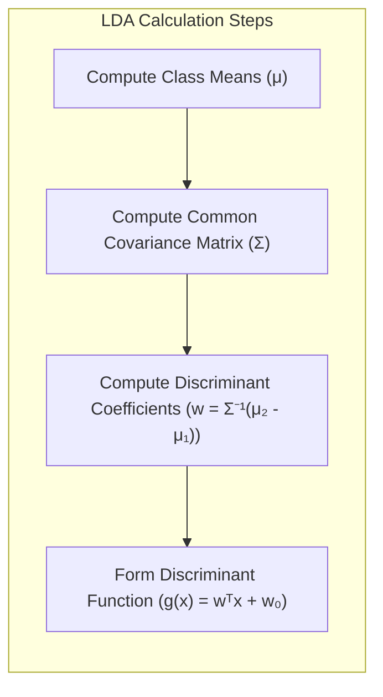
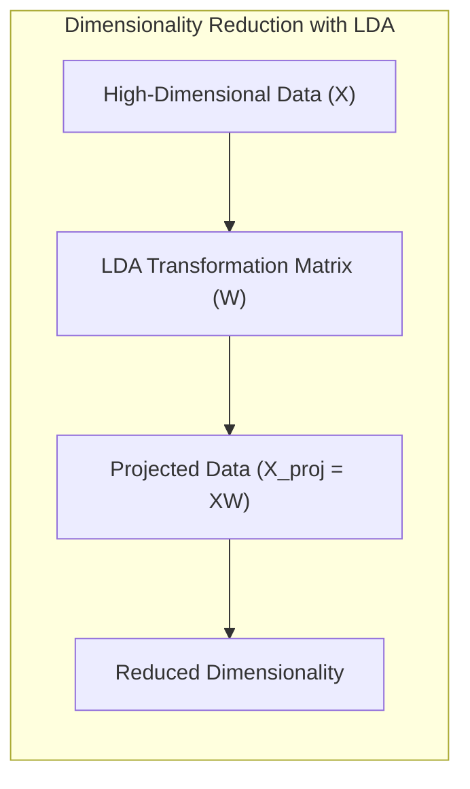
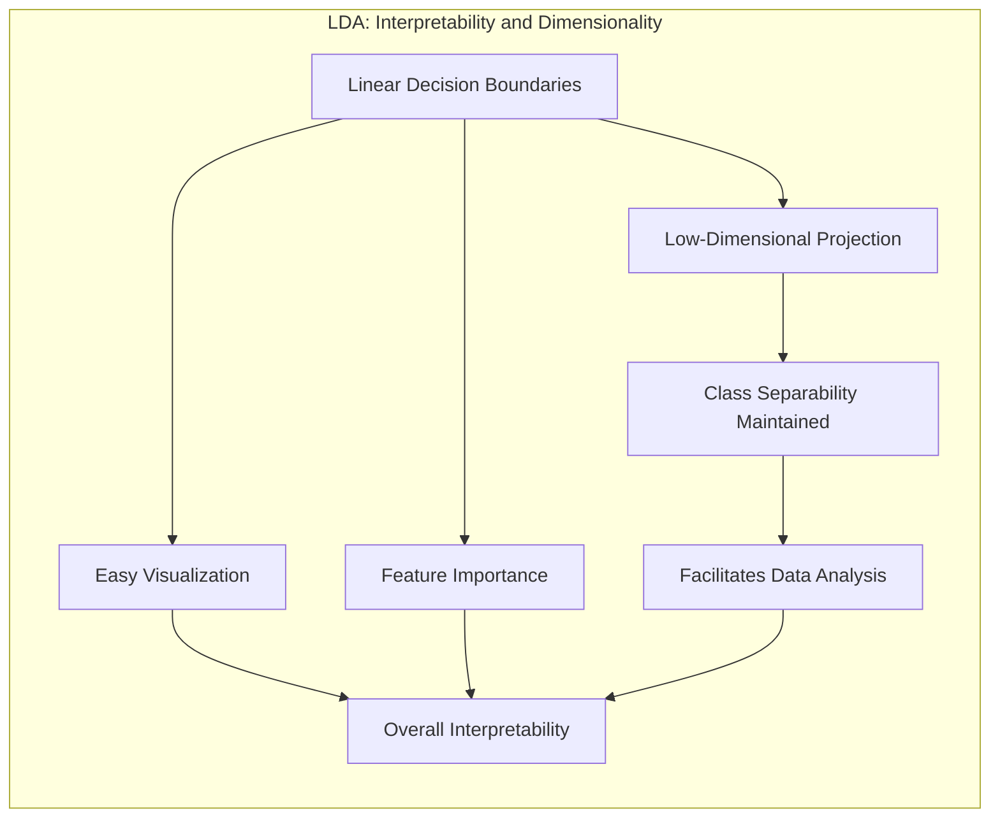
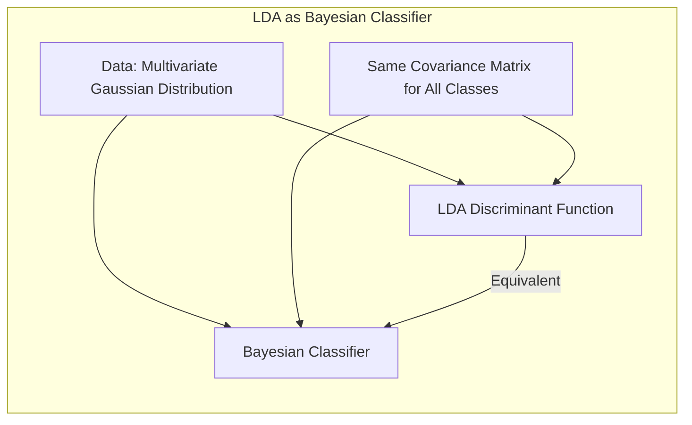
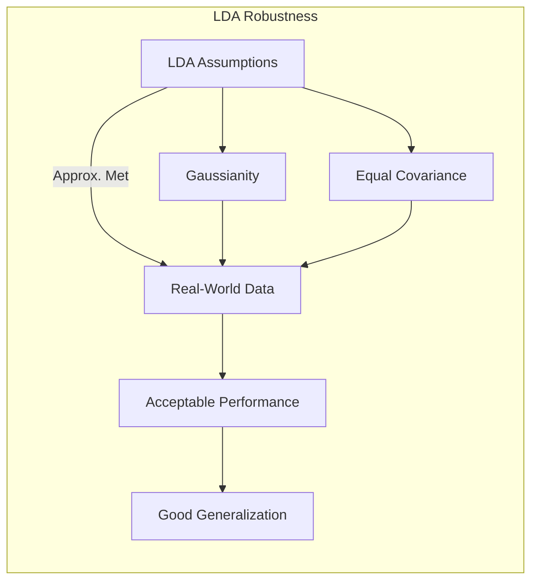

Okay, here's the enhanced text with added Mermaid diagrams:

Okay, now that we've thoroughly explored the limitations of LDA, let's take a balanced view and discuss its **Advantages**. This section will highlight the strengths of LDA, and explain why it remains a useful technique in certain contexts despite its limitations.

## Título: Vantagens da Análise Discriminante Linear (LDA): Simplicidade, Eficiência e Interpretabilidade

```mermaid
graph LR
    subgraph "LDA Advantages"
        A["Simplicity"] --> B["Efficient Computation"]
        A --> C["Interpretability"]
        A --> D["Low-Dimensional Representation"]
        E["Bayesian Classifier (Under Conditions)"]
        D --> E
        B --> D
    end
```



### Introdução

A **Análise Discriminante Linear (LDA)**, apesar de suas limitações, é um método clássico e amplamente utilizado em aprendizado de máquina devido a suas **vantagens** em termos de simplicidade, eficiência computacional, interpretabilidade e capacidade de gerar representações de baixa dimensão. Embora a LDA possa não ser adequada para todos os tipos de conjuntos de dados, ela ainda oferece uma abordagem eficaz para problemas de classificação e redução de dimensionalidade em cenários onde suas premissas são aproximadamente satisfeitas ou quando se busca um modelo rápido e interpretabilidade.

Neste capítulo, exploraremos em detalhe as principais vantagens da LDA, analisando como sua formulação matemática leva a modelos simples e eficientes, e como suas propriedades tornam a LDA uma ferramenta útil em diversas aplicações. Analisaremos também como a LDA pode ser vista como um classificador Bayesiano sob certas condições, e como sua capacidade de gerar representações de baixa dimensão é útil em problemas de alta dimensionalidade.

A compreensão das vantagens e limitações da LDA é fundamental para a escolha apropriada do método de classificação e para a utilização eficaz dessa técnica em diferentes cenários. A análise das vantagens da LDA nos permite apreciar a importância desse método clássico e como ele pode ser utilizado em conjunto com outras técnicas.

### Simplicidade e Eficiência Computacional

**Conceito 1: Formulação Matemática Simples**

Uma das principais vantagens da LDA é a sua **formulação matemática simples**. O método é baseado em operações lineares e na estimação de parâmetros que podem ser obtidos de forma relativamente rápida e eficiente. A função discriminante da LDA é linear e seus parâmetros podem ser estimados analiticamente, o que leva a algoritmos de treinamento com baixo custo computacional.

A simplicidade da formulação da LDA torna-a fácil de entender e implementar, e permite que o método seja aplicado em uma variedade de problemas, mesmo com recursos computacionais limitados. Essa simplicidade também facilita a interpretabilidade do modelo, o que é importante em muitas aplicações práticas, como em estudos sobre análise de padrões.

**Lemma 1:** A formulação matemática simples da LDA leva a algoritmos de treinamento eficientes, com baixo custo computacional.

A demonstração desse lemma se baseia na análise da formulação matemática da LDA e como seus parâmetros são obtidos através de operações lineares e estimações analíticas, que levam a uma baixa complexidade computacional.

> 💡 **Exemplo Numérico:**
>
> Suponha que temos um problema de classificação com duas classes e duas *features*. A LDA envolve calcular as médias das *features* para cada classe, a matriz de covariância comum, e os coeficientes da função discriminante.
>
> **Dados:**
>
> *   Classe 1: \((x_1, x_2) = [(1, 2), (1.5, 1.8), (2, 2.5)]\)
> *   Classe 2: \((x_1, x_2) = [(4, 5), (4.5, 4.8), (5, 5.5)]\)
>
> **Passo 1: Calcular as médias de cada classe**
>
> *   Média da Classe 1: $$\mu_1 = [\frac{1+1.5+2}{3}, \frac{2+1.8+2.5}{3}] = [1.5, 2.1]$$
> *   Média da Classe 2: $$\mu_2 = [\frac{4+4.5+5}{3}, \frac{5+4.8+5.5}{3}] = [4.5, 5.1]$$
>
> **Passo 2: Calcular a matriz de covariância comum (assumindo igual para as duas classes, para simplificar)**
>
> *Para fins de ilustração, vamos assumir que a matriz de covariância comum é dada por:*
>
> $$\Sigma = \begin{bmatrix} 0.2 & 0.1 \\ 0.1 & 0.2 \end{bmatrix}$$
>
>
> **Passo 3: Calcular os coeficientes da função discriminante**
>
> *Os coeficientes *w* são calculados como: $$w = \Sigma^{-1}(\mu_2 - \mu_1)$*
>
> *Invertendo $$\Sigma$$:*
>
> $$\Sigma^{-1} = \frac{1}{0.2*0.2 - 0.1*0.1} \begin{bmatrix} 0.2 & -0.1 \\ -0.1 & 0.2 \end{bmatrix} = \begin{bmatrix} 2.67 & -1.33 \\ -1.33 & 2.67 \end{bmatrix}$$
>
> *Calculando $$w$$:*
>
> $$w = \begin{bmatrix} 2.67 & -1.33 \\ -1.33 & 2.67 \end{bmatrix} \begin{bmatrix} 4.5 - 1.5 \\ 5.1 - 2.1 \end{bmatrix} = \begin{bmatrix} 2.67 & -1.33 \\ -1.33 & 2.67 \end{bmatrix} \begin{bmatrix} 3 \\ 3 \end{bmatrix} = \begin{bmatrix} 4 \\ 4 \end{bmatrix}$$
>
>
>
> *A função discriminante será da forma $$g(x) = w^T x + w_0$$, onde $$w_0$$ é um termo constante que depende das médias e da covariância e pode ser calculado também de forma simples.*
>
> **Interpretação:** O cálculo envolve operações matriciais básicas, como médias, inversão de matrizes e multiplicação, que são computacionalmente eficientes. A simplicidade desses cálculos torna a LDA rápida de treinar, mesmo com um número razoável de dados.



**Conceito 2: Eficiência Computacional em Dados de Alta Dimensão**

A LDA, apesar de suas limitações em problemas com alta dimensionalidade quando aplicada diretamente aos dados, pode ser utilizada de forma eficiente para **reduzir a dimensionalidade** dos dados. A projeção dos dados em um subespaço de menor dimensão, através dos componentes discriminantes obtidos pela LDA, reduz o custo computacional do treinamento de modelos subsequentes, ou mesmo do próprio classificador LDA.

A redução de dimensionalidade através da LDA pode ser feita de forma eficiente, o que permite trabalhar com conjuntos de dados de alta dimensão sem a necessidade de algoritmos mais complexos e com maior custo computacional, conforme discutido em capítulos anteriores. A eficiência computacional da LDA torna-a uma opção atrativa para conjuntos de dados de grande escala.

**Corolário 1:** A LDA, juntamente com sua capacidade de redução de dimensionalidade, permite que ela seja utilizada de forma eficiente em problemas com dados de alta dimensão.

A demonstração desse corolário se baseia na análise da capacidade da LDA de projetar os dados em um subespaço de dimensão reduzida, e como esse processo reduz o custo computacional de outras operações.

> 💡 **Exemplo Numérico:**
>
> Imagine que temos dados com 100 *features* e queremos classificar em 2 classes. Aplicar LDA diretamente pode ser computacionalmente caro. No entanto, a LDA pode ser usada para projetar esses dados em um espaço de dimensão reduzida, digamos 1 ou 2 dimensões (o número de classes - 1).
>
> **Dados:**
>
> *   Dados originais: \(X\) (matriz \(n \times 100\), onde *n* é o número de amostras)
>
> **Passo 1: Aplicar LDA para reduzir a dimensionalidade**
>
> *   A LDA encontra uma matriz de transformação \(W\) (matriz \(100 \times 1\) ou \(100 \times 2\) dependendo do número de classes - 1)
>
> **Passo 2: Projetar os dados no novo espaço**
>
> *   Dados projetados: $$X_{proj} = XW$$ (matriz \(n \times 1\) ou \(n \times 2\))
>
> **Interpretação:** A dimensionalidade foi reduzida de 100 para 1 ou 2. Isso torna o treinamento de outros modelos (ou mesmo a LDA) sobre os dados projetados muito mais rápido. Por exemplo, se cada operação em um modelo subsequente tiver complexidade $$O(d^2)$$, onde *d* é a dimensionalidade, reduzir de 100 para 1 ou 2 reduz o custo computacional significativamente.



### Interpretabilidade e Representação de Baixa Dimensão



Uma das vantagens da LDA é a sua **interpretabilidade**, que significa que a solução obtida pelo método pode ser facilmente compreendida e analisada. As fronteiras de decisão lineares geradas pela LDA podem ser facilmente visualizadas e interpretadas, e os componentes discriminantes obtidos pela LDA revelam informações sobre a importância das *features* para a separação das classes.

A LDA também oferece uma forma natural de obter **representações de baixa dimensão** dos dados, onde a dimensionalidade dos dados é reduzida, mantendo a separabilidade das classes. Essa propriedade é especialmente útil em problemas de alta dimensionalidade, onde a visualização e a interpretação dos dados podem ser difíceis. A utilização das projeções de baixa dimensão geradas pela LDA permite visualizar e analisar os dados com mais facilidade, e também reduzir o custo computacional dos modelos.

A capacidade da LDA de gerar representações de baixa dimensão que preservam a separabilidade das classes torna esse método uma ferramenta valiosa para a análise exploratória de dados e para a redução da dimensionalidade antes da aplicação de outros métodos de aprendizado de máquina.

**Lemma 2:** A LDA oferece modelos interpretáveis com fronteiras de decisão lineares e permite obter representações de baixa dimensão dos dados, o que facilita a visualização e análise da estrutura dos dados.

A demonstração desse lemma se baseia na análise da formulação da LDA e como ela gera fronteiras lineares e projeta os dados em um subespaço de menor dimensão, o que facilita a interpretação e visualização dos resultados.

> 💡 **Exemplo Numérico:**
>
> Suponha que após aplicar LDA para reduzir a dimensionalidade de dados de 3 para 2 dimensões, obtemos os seguintes componentes discriminantes (os vetores de projeção):
>
> $$ w_1 = [0.8, 0.5, 0.3] $$ e $$ w_2 = [-0.2, 0.9, 0.4] $$
>
> **Interpretação:**
>
> *   **Interpretação dos componentes:** O componente $$w_1$$ mostra que a primeira *feature* tem o maior peso (0.8), seguida pela segunda (0.5) e a terceira (0.3). Isso indica que a primeira *feature* é a mais importante para discriminar as classes nesse componente. O componente $$w_2$$ mostra que a segunda *feature* tem o maior peso (0.9), com a terceira (0.4) e a primeira com peso negativo (-0.2), indicando que a segunda *feature* é mais importante nesse componente, e a primeira contribui negativamente.
> *   **Visualização:** Podemos plotar os dados em um gráfico 2D usando as projeções dos dados em relação aos componentes $$w_1$$ e $$w_2$$. Como a LDA maximiza a separabilidade das classes, essa projeção em 2D muitas vezes permite visualizar claramente os grupos, tornando a interpretação mais fácil.
>
> ```mermaid
>  graph LR
>      A[Dados Originais (3D)] --> B(LDA);
>      B --> C[Dados Projetados (2D)];
>      C --> D(Visualização);
> ```

### LDA como Classificador Bayesiano sob Condições Específicas



A LDA pode ser vista como um **classificador Bayesiano** ideal sob condições específicas. Se os dados de cada classe seguem uma distribuição gaussiana multivariada com a mesma matriz de covariância, a função discriminante da LDA se torna equivalente ao classificador Bayesiano, que define que uma dada amostra pertença à classe com maior probabilidade *a posteriori*.

Essa equivalência é uma consequência da premissa da LDA de que as classes têm uma matriz de covariância comum, o que leva à construção de fronteiras de decisão lineares que são ótimas para separar as classes, se a suposição de normalidade é verdadeira. Em outras palavras, se os dados seguem uma distribuição gaussiana com matriz de covariância comum, a LDA gera a fronteira de decisão ótima, que minimiza a probabilidade de erro de classificação.

Sob essa premissa, o classificador Bayesiano e a LDA levam às mesmas decisões de classificação, e por isso podemos utilizar os resultados da teoria Bayesiana para análise da qualidade dos resultados gerados pela LDA, e os valores das decisões de classificação podem ser relacionados às probabilidades *a posteriori*.

**Corolário 2:** Sob a premissa de que as classes seguem uma distribuição Gaussiana multivariada com uma matriz de covariância comum, a LDA se torna equivalente ao classificador Bayesiano, o que garante que a LDA gera a fronteira de decisão ótima para esse caso particular.

A demonstração desse corolário se baseia na análise da função discriminante da LDA e como ela se torna equivalente à regra de decisão Bayesiana, com a hipótese de que as classes seguem distribuições gaussianas com a mesma covariância.

> 💡 **Exemplo Numérico:**
>
> Suponha que temos duas classes, cada uma com uma distribuição gaussiana.
>
> *   Classe 1: $$\mu_1 = [1, 2]$$,  $$\Sigma = \begin{bmatrix} 1 & 0.5 \\ 0.5 & 1 \end{bmatrix}$$
> *   Classe 2: $$\mu_2 = [4, 5]$$,  $$\Sigma = \begin{bmatrix} 1 & 0.5 \\ 0.5 & 1 \end{bmatrix}$$
>
> **Classificador Bayesiano:** O classificador Bayesiano calcula a probabilidade a posteriori $$P(C_i|x)$$ para cada classe $$C_i$$, onde $$x$$ é um ponto de dados, e escolhe a classe com maior probabilidade. Se as classes são Gaussianas com a mesma covariância, a fronteira de decisão é linear.
>
> **LDA:** A LDA calcula uma fronteira de decisão linear com base nas médias e na covariância comum.
>
> **Interpretação:** Sob essas condições, os resultados da LDA e do classificador Bayesiano são equivalentes, e a LDA encontra a fronteira de decisão ótima para esses dados. Em outras palavras, a LDA está fazendo o melhor possível para separar as classes, dada a informação disponível e a sua formulação.

### Robustez e Generalização em Cenários Aproximados



Embora as premissas da LDA (distribuição gaussiana multivariada e covariância comum) nem sempre se sustentem em dados reais, a LDA pode apresentar uma boa performance e **generalização** em cenários onde essas premissas são aproximadamente satisfeitas. Em outras palavras, em problemas com dados que são aproximadamente gaussianos e que têm distribuições de covariâncias similares, a LDA pode ser um método de classificação muito competitivo.

A robustez da LDA se manifesta na sua capacidade de lidar com dados reais que não são perfeitamente gaussianos e onde as covariâncias não são exatamente iguais. Mesmo quando as premissas da LDA são violadas, o método ainda pode gerar resultados satisfatórios, desde que a violação das premissas não seja muito grande. A estabilidade das soluções é uma das características da LDA.

Essa propriedade de robustez da LDA é uma das razões pelas quais esse método continua a ser utilizado em diversas aplicações de classificação, em conjunto com técnicas mais complexas como as SVMs. Além disso, a LDA pode ser utilizada como um passo inicial em um processo de modelagem, como forma de reduzir a dimensionalidade dos dados antes de aplicar modelos mais complexos, e também pode ser usado como *baseline* para analisar e comparar o desempenho de outros métodos de classificação.

**Lemma 3:** Mesmo quando as premissas da LDA não são totalmente satisfeitas, a LDA pode apresentar boa performance e capacidade de generalização em cenários onde as premissas são aproximadamente válidas.

A demonstração desse lemma se baseia na análise do comportamento da LDA quando suas premissas são ligeiramente violadas, e como a solução do modelo ainda pode levar a resultados úteis e generalizáveis, embora não seja a solução ótima.

> 💡 **Exemplo Numérico:**
>
> Vamos considerar um conjunto de dados onde as classes não seguem exatamente distribuições gaussianas e as covariâncias não são exatamente iguais, mas são similares:
>
> **Dados:**
>
> *   Classe 1: Dados com uma distribuição ligeiramente desviada da gaussiana, e uma covariância $$\Sigma_1 = \begin{bmatrix} 1.2 & 0.6 \\ 0.6 & 1.1 \end{bmatrix}$$
> *   Classe 2: Dados com uma distribuição ligeiramente desviada da gaussiana, e uma covariância $$\Sigma_2 = \begin{bmatrix} 1.1 & 0.5 \\ 0.5 & 1.2 \end{bmatrix}$$
>
> **Resultados:**
>
> *   **LDA:** Aplicando LDA, o modelo pode encontrar uma fronteira de decisão razoável, mesmo que não seja a ótima (como seria com a premissa de gaussianidade perfeita).
> *   **Generalização:** O modelo pode apresentar boa capacidade de generalização para novos dados, desde que as novas amostras também sigam uma distribuição que se aproxima das gaussianas com covariâncias similares.
>
> **Interpretação:** A LDA demonstra robustez nesse cenário, pois não exige uma aderência perfeita às suas premissas. Mesmo com pequenas violações, a LDA pode gerar resultados úteis e generalizáveis, o que a torna uma opção prática em muitos problemas do mundo real.

### Conclusão

Neste capítulo, exploramos as **vantagens da Análise Discriminante Linear (LDA)**, analisando suas propriedades de simplicidade, eficiência computacional, interpretabilidade e capacidade de gerar representações de baixa dimensão. Vimos como a LDA pode ser vista como um classificador Bayesiano sob condições específicas, e como ela pode ser utilizada de forma eficaz em problemas onde suas premissas são aproximadamente satisfeitas.

Apesar de suas limitações, a LDA continua a ser um método de classificação e redução de dimensionalidade útil e relevante, e sua compreensão é fundamental para a construção de modelos com melhor desempenho e para a escolha apropriada dos métodos de aprendizado de máquina para problemas específicos. A combinação da LDA com outras abordagens de aprendizado, como as SVMs, também pode resultar em soluções mais robustas e com boa capacidade de generalização.

### Footnotes

[^12.1]: "In this chapter we describe generalizations of linear decision boundaries for classification. Optimal separating hyperplanes are introduced in Chapter 4 for the case when two classes are linearly separable. Here we cover extensions to the nonseparable case, where the classes overlap. These techniques are then generalized to what is known as the support vector machine, which produces nonlinear boundaries by constructing a linear boundary in a large, transformed version of the feature space." *(Trecho de  "Support Vector Machines and Flexible Discriminants")*

[^12.2]: "In Chapter 4 we discussed a technique for constructing an optimal separating hyperplane between two perfectly separated classes. We review this and generalize to the nonseparable case, where the classes may not be separable by a linear boundary." *(Trecho de  "Support Vector Machines and Flexible Discriminants")*

[^12.3]: "In LDA, the decision boundary is determined by the covariance of the class distributions and the positions of the class centroids. We will see in Section 12.3.3 that logistic regression is more similar to the support vector classifier in this regard." *(Trecho de "Support Vector Machines and Flexible Discriminants")*

[^12.4]: "LDA is the estimated Bayes classifier if the observations are multivariate Gaussian in each class, with a common covariance matrix." *(Trecho de "Support Vector Machines and Flexible Discriminants")*
