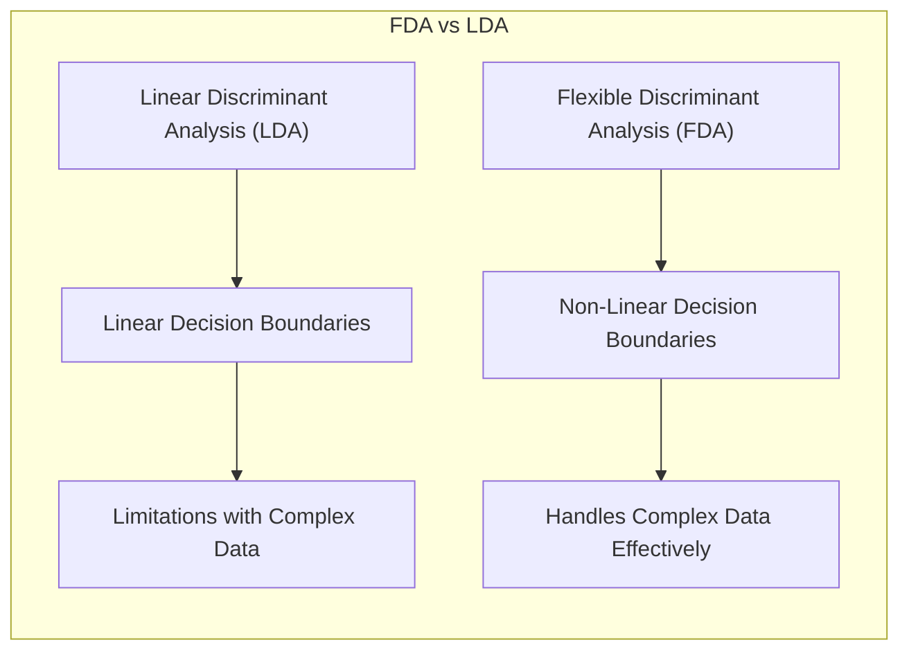
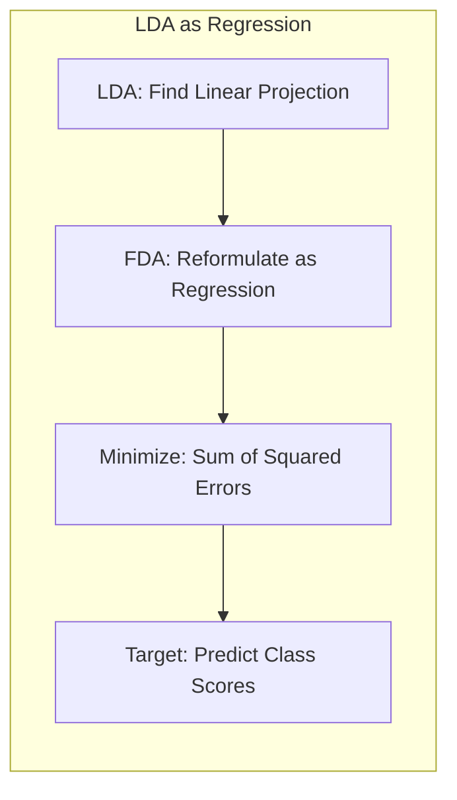
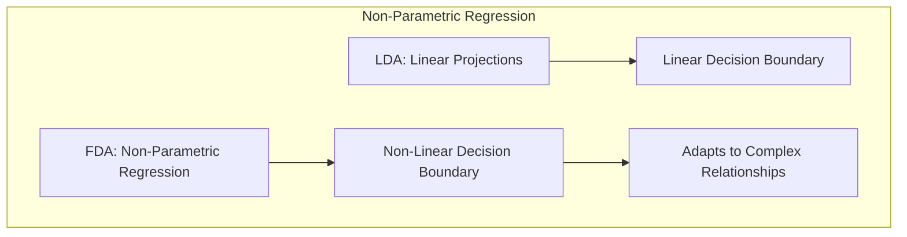
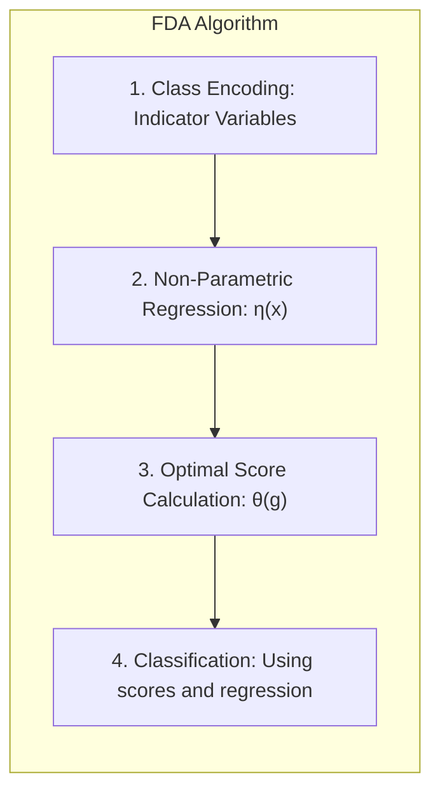
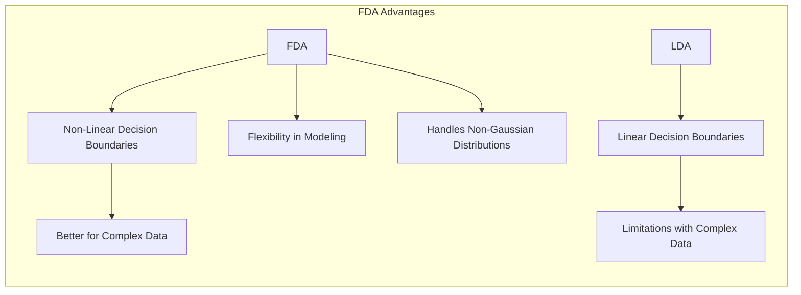
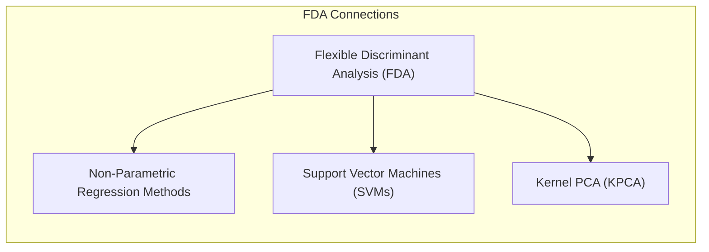

Okay, let's enhance the text with practical numerical examples where appropriate, following your guidelines.

## Título: Análise Discriminante Flexível (FDA): Uma Generalização da LDA para Fronteiras Não Lineares

### Introdução

A **Análise Discriminante Linear (LDA)**, apesar de sua simplicidade e eficiência, apresenta limitações na modelagem de problemas de classificação onde a relação entre as *features* e as classes não é linear, ou onde as classes apresentam distribuições não gaussianas ou com covariâncias distintas. A **Análise Discriminante Flexível (FDA)** surge como uma generalização da LDA, que visa superar essas limitações através da utilização de **regressão flexível** para modelar as relações entre as *features* e as classes.

Neste capítulo, exploraremos em detalhe a formulação da FDA e como ela se diferencia da LDA, com foco em como a utilização da regressão flexível permite construir fronteiras de decisão não lineares e lidar com dados complexos. Analisaremos os passos do algoritmo FDA, incluindo a codificação das classes, a regressão não paramétrica, o cálculo de *scores* ótimos e o uso desses *scores* na classificação. Discutiremos também as vantagens e desvantagens da FDA em relação à LDA e como a FDA se relaciona com outras técnicas de aprendizado de máquina, incluindo as SVMs.

A compreensão da formulação da FDA e de como ela se diferencia da LDA é fundamental para a escolha apropriada do método de classificação em diferentes cenários, permitindo construir modelos mais robustos e com melhor capacidade de generalização em dados complexos.

### Formulação da Análise Discriminante Flexível (FDA)

**Conceito 1: A LDA como Regressão Linear**

Uma das ideias centrais da FDA é reformular o problema da LDA como um problema de regressão linear. Em LDA, o objetivo é encontrar uma projeção linear que maximize a separação entre as classes, e isso pode ser obtido de forma equivalente através da regressão linear nas variáveis indicadoras da classe, como discutido em capítulos anteriores.

No entanto, na FDA, a abordagem é generalizada ao utilizar uma regressão linear em variáveis transformadas das classes. A FDA busca encontrar uma função $\theta$ que atribui scores às classes, de forma que esses scores possam ser preditos por regressão linear no espaço das *features*.

Formalmente, suponha que temos $K$ classes, e $\theta$ é uma função que atribui um score a cada classe ($ \theta : G \rightarrow \mathbb{R}$), onde $G = \{1,..., K \}$. A FDA busca encontrar uma função $\eta(x)$,  que seja uma regressão de $\theta(g)$ sobre os dados $x$, minimizando o seguinte critério de otimização:

$$ \min_{\beta, \theta} \sum_{i=1}^N  [\theta(g_i) - \eta(x_i)]^2 $$

onde $g_i$ é a classe da $i$-ésima amostra, e $\eta(x_i)$ é uma função de regressão flexível dos dados $x_i$.

> 💡 **Exemplo Numérico:**
> Imagine um cenário de classificação com 3 classes (K=3) e um conjunto de dados com duas *features* ($x_1$ e $x_2$). As classes são codificadas usando variáveis indicadoras, como descrito no texto. A função $\theta$ atribui scores a cada classe, por exemplo, $\theta(1) = 0.2$, $\theta(2) = 0.5$, e $\theta(3) = 0.8$. O objetivo da FDA é encontrar uma função $\eta(x)$ (uma regressão sobre as *features*) que se aproxime desses scores. Em vez de tentar ajustar uma reta (como na LDA), a FDA pode usar uma função não linear, como um polinômio ou um *spline*. Por exemplo, $\eta(x) = 0.1 + 0.3x_1 + 0.2x_2 + 0.1x_1^2 -0.05x_2^2$ poderia ser uma função de regressão não linear encontrada pelo FDA. O objetivo é minimizar o erro quadrático entre os scores $\theta(g_i)$ e as predições $\eta(x_i)$ para todas as amostras.

**Lemma 1:** A FDA reformula o problema da LDA como um problema de regressão linear, que busca encontrar scores para as classes que podem ser previstos linearmente a partir das *features*.

A demonstração desse lemma se baseia na análise da formulação matemática da FDA, onde o objetivo é encontrar funções que associem um valor às classes que possam ser preditas através da regressão sobre as *features*, transformando o problema da LDA em um problema de regressão.

**Conceito 2: Regressão Não Paramétrica e a Flexibilidade da FDA**

Ao contrário da LDA, que utiliza projeções lineares no espaço original de *features*, a FDA utiliza **regressão não paramétrica** para modelar a relação entre as *features* e os *scores* das classes. A regressão não paramétrica oferece maior flexibilidade na modelagem, permitindo construir funções de regressão não lineares que se adaptam à estrutura dos dados, e, consequentemente, a construção de funções de decisão que não são lineares.

Ao usar a regressão não paramétrica para encontrar $\eta(x)$, a FDA não se limita a projeções lineares, e permite que o modelo capture as relações não lineares entre as *features* e as classes. A escolha do método de regressão não paramétrica é um passo crucial na aplicação da FDA, e diferentes métodos podem ser utilizados, como *splines*, modelos aditivos ou MARS.

> 💡 **Exemplo Numérico:**
> Imagine que temos duas classes e uma *feature* ($x$) que tem uma relação não linear com as classes. A LDA tentaria encontrar uma linha reta para separar as classes, o que seria ineficaz. No entanto, a FDA, ao usar uma regressão não paramétrica, pode ajustar uma curva que separe melhor as classes. Por exemplo, se os dados da classe 1 estão centrados em torno de $x = 2$ e os dados da classe 2 estão centrados em torno de $x = 5$, com alguma sobreposição, a regressão não paramétrica poderia aprender uma função $\eta(x)$ que tem um valor baixo para valores de x próximos de 2, e um valor alto para valores de x próximos de 5, com uma transição suave entre eles. Uma função *spline* cúbica seria capaz de modelar essa relação.

**Corolário 1:** A utilização de regressão não paramétrica permite que a FDA construa fronteiras de decisão não lineares, superando a limitação da LDA de impor uma fronteira de decisão linear.

A demonstração desse corolário se baseia na análise da formulação da FDA, onde a utilização de regressão não paramétrica permite que a função $\eta(x)$ seja não linear, o que leva à construção de fronteiras de decisão não lineares.

### O Algoritmo FDA: Etapas do Processo

O algoritmo da **Análise Discriminante Flexível (FDA)** pode ser resumido nas seguintes etapas:

1.  **Codificação das Classes:** As classes são codificadas utilizando variáveis indicadoras. Se temos $K$ classes, criamos $K$ variáveis indicadoras, onde $Y_{ik} = 1$ se a $i$-ésima amostra pertence à classe $k$ e $Y_{ik} = 0$ caso contrário.
2.  **Regressão Não Paramétrica:** Para cada classe, ajustamos uma função de regressão não paramétrica, $\eta_l(x)$, utilizando os dados de treinamento. Essas funções de regressão modelam a relação entre as *features* e os scores das classes. Podemos utilizar um modelo de regressão linear (como na LDA) ou, como é comum na FDA, um modelo mais flexível como modelos aditivos, splines ou MARS.
3.  **Cálculo dos Scores Ótimos:** Calculamos os *scores* ótimos $\theta_l(g)$, para $l = 1, ..., L$, onde $L$ é o número de scores calculados (que pode ser igual ou menor que $K-1$). Esses *scores* são obtidos através da decomposição espectral da matriz de respostas ajustadas. Os *scores* ótimos são a solução para o problema de otimização que definimos anteriormente, onde buscamos valores que podem ser bem modelados a partir da regressão feita no passo anterior.
4.  **Classificação:** Para classificar uma nova amostra, calculamos os valores das funções de regressão para cada classe, $\eta_l(x)$, e utilizamos os *scores* ótimos para definir o novo espaço projetado e classificamos as amostras com base na proximidade ao centroide das classes nesse espaço projetado.

> 💡 **Exemplo Numérico:**
> Vamos detalhar as etapas com um exemplo. Suponha que temos 3 classes (K=3) e duas *features* ($x_1$ e $x_2$).
>
> **Etapa 1: Codificação das Classes:**
>
> | Amostra | Classe | $Y_1$ | $Y_2$ | $Y_3$ |
> | ------- | ------ | ----- | ----- | ----- |
> | 1       | 1      | 1     | 0     | 0     |
> | 2       | 2      | 0     | 1     | 0     |
> | 3       | 3      | 0     | 0     | 1     |
> | 4       | 1      | 1     | 0     | 0     |
> | 5       | 2      | 0     | 1     | 0     |
>
> **Etapa 2: Regressão Não Paramétrica:**
> Suponha que ajustamos funções de regressão não paramétrica para cada classe usando *splines* cúbicos:
>
> $\eta_1(x) = 0.1 + 0.5x_1 - 0.2x_2 + 0.1x_1^2 - 0.05x_2^2$ (para a classe 1)
> $\eta_2(x) = 0.3 - 0.1x_1 + 0.4x_2 - 0.05x_1^2 + 0.1x_2^2$ (para a classe 2)
> $\eta_3(x) = 0.2 + 0.2x_1 + 0.3x_2 + 0.02x_1^2 - 0.01x_2^2$ (para a classe 3)
>
> **Etapa 3: Cálculo dos Scores Ótimos:**
> Suponha que a decomposição espectral nos dá dois *scores* (L=2) representados por $\theta_1$ e $\theta_2$. Os valores desses *scores* são calculados de forma a maximizar a separação das classes no espaço transformado. Esses scores são, por exemplo:
>
> $\theta_1(1) = 0.8$, $\theta_1(2) = -0.5$, $\theta_1(3) = -0.3$
> $\theta_2(1) = -0.2$, $\theta_2(2) = 0.7$, $\theta_2(3) = -0.5$
>
> **Etapa 4: Classificação:**
> Para classificar uma nova amostra com $x_1 = 1$ e $x_2 = 2$, calculamos:
>
> $\eta_1(1, 2) = 0.1 + 0.5(1) - 0.2(2) + 0.1(1)^2 - 0.05(2)^2 = 0.1 + 0.5 - 0.4 + 0.1 - 0.2 = 0.0$
> $\eta_2(1, 2) = 0.3 - 0.1(1) + 0.4(2) - 0.05(1)^2 + 0.1(2)^2 = 0.3 - 0.1 + 0.8 - 0.05 + 0.4 = 1.35$
> $\eta_3(1, 2) = 0.2 + 0.2(1) + 0.3(2) + 0.02(1)^2 - 0.01(2)^2 = 0.2 + 0.2 + 0.6 + 0.02 - 0.04 = 0.98$
>
> Os scores projetados para a amostra são:
>
> $score_1 = 0.0 * 0.8 + 1.35 * (-0.5) + 0.98 * (-0.3) = -0.97$
> $score_2 = 0.0 * (-0.2) + 1.35 * 0.7 + 0.98 * (-0.5) = 0.455$
>
> A amostra é classificada com base na proximidade aos centroides das classes no espaço transformado definido pelos scores.

A escolha do tipo de regressão não paramétrica e do número de *scores* ($L$) afetam o desempenho do modelo. A validação cruzada é utilizada para escolher os valores desses parâmetros de forma a obter o melhor desempenho.

**Lemma 4:** O algoritmo FDA envolve a codificação das classes, a utilização de regressão não paramétrica para construir as funções de regressão, e o cálculo de *scores* ótimos, que são utilizados para a classificação.

A demonstração desse lemma se baseia na análise dos passos do algoritmo FDA e como cada um dos passos contribui para a construção do modelo de classificação.

### Vantagens da FDA em Relação à LDA

A **Análise Discriminante Flexível (FDA)** oferece diversas vantagens em relação à **Análise Discriminante Linear (LDA)**, especialmente quando os dados apresentam padrões de separação não linear ou distribuições não gaussianas.

1.  **Fronteiras de Decisão Não Lineares:** A principal vantagem da FDA é a capacidade de construir fronteiras de decisão não lineares, através da utilização de modelos de regressão não paramétricos. Ao contrário da LDA, que gera fronteiras lineares, a FDA pode se adaptar a conjuntos de dados com relações complexas entre as *features* e as classes.
2.  **Flexibilidade na Modelagem:** A FDA oferece maior flexibilidade na modelagem, pois permite a escolha de diferentes métodos de regressão não paramétrica, o que permite ajustar o modelo às características específicas dos dados. A escolha de um modelo de regressão específico para cada classe ou a escolha do tipo de penalização a ser utilizado tornam a FDA mais adaptável a diferentes tipos de dados e problemas de classificação.
3.  **Lidar com Distribuições Não Gaussianas:** A FDA não assume que os dados seguem uma distribuição gaussiana multivariada, o que a torna mais adequada para lidar com dados reais que frequentemente apresentam distribuições não gaussianas. A flexibilidade das funções de regressão não paramétrica permite que a FDA se adapte a diferentes distribuições das classes.

> 💡 **Exemplo Numérico:**
> Imagine um conjunto de dados onde a classe 1 forma um círculo no centro do espaço de *features*, e a classe 2 está ao redor desse círculo. A LDA tentaria encontrar uma linha reta para separar essas classes, o que seria impossível. Já a FDA, ao usar uma regressão não paramétrica, poderia ajustar uma função que modela essa forma circular, separando as classes de forma mais eficiente.
>
> Outro exemplo: suponha que temos um problema de classificação com duas *features* e duas classes, onde os dados da classe 1 têm uma distribuição bimodal (dois picos) e os dados da classe 2 têm uma distribuição gaussiana. A LDA, que assume que os dados seguem uma distribuição gaussiana, terá dificuldades em modelar a distribuição da classe 1. A FDA, por outro lado, pode usar modelos de regressão não paramétricos que se adaptam a essas distribuições não gaussianas, melhorando o desempenho da classificação.

As vantagens da FDA em relação à LDA são particularmente evidentes em problemas com dados não lineares e de alta dimensionalidade, onde a LDA apresenta limitações importantes. A FDA, no entanto, continua a ser um modelo linear sobre as variáveis transformadas, e, por isso, é mais fácil de interpretar do que modelos totalmente não lineares.

**Corolário 2:** A FDA supera as principais limitações da LDA através da utilização de projeções não lineares e do uso de modelos de regressão flexíveis, que lhe permitem modelar relações complexas entre as *features* e as classes.

A demonstração desse corolário se baseia na análise da formulação da FDA e como a utilização de regressão não paramétrica e a projeção nos *scores* das classes leva a um modelo que não apresenta as limitações da LDA.

### Conexão da FDA com Outras Abordagens de Aprendizado

A **Análise Discriminante Flexível (FDA)** pode ser vista como uma abordagem que combina conceitos de **regressão não paramétrica** com a ideia de encontrar projeções discriminantes, utilizada na **Análise Discriminante Linear (LDA)**. A FDA se relaciona com outras abordagens de aprendizado de máquina, como:

1.  **Métodos de Regressão Não Paramétrica:** A FDA utiliza modelos de regressão não paramétricos, como *splines*, modelos aditivos ou MARS, para modelar a relação entre as *features* e os scores das classes. A escolha do modelo de regressão apropriado permite a FDA se adaptar às características dos dados e modelar relações não lineares com flexibilidade.

2.  **Support Vector Machines (SVMs):** A FDA e as SVMs podem ser vistas como abordagens para construir modelos não lineares. Enquanto as SVMs utilizam o *kernel trick* para transformar os dados em um espaço de *features* de alta dimensão, a FDA utiliza regressão não paramétrica para modelar a relação entre as *features* e as classes. Ambos os métodos levam a modelos com alta capacidade de generalização e se baseiam em conceitos de otimização.

3.  **Análise de Componentes Principais (PCA) com Kernel (KPCA):** Assim como a SVD é a base para o método PCA, a FDA pode utilizar um processo similar para realizar a redução de dimensionalidade de forma não linear, ao projetar os dados nos *scores* das classes, que levam a um melhor poder de separação das classes.

> 💡 **Exemplo Numérico:**
>
> Para ilustrar a conexão com SVMs, podemos pensar no caso em que uma SVM usa um kernel radial (RBF) para mapear os dados para um espaço de alta dimensão, onde uma separação linear é possível. A FDA, ao usar uma regressão não paramétrica, tenta encontrar diretamente uma função não linear que separe as classes no espaço original, sem a necessidade de mapeamento para um espaço de alta dimensão. Em ambos os casos, o objetivo é encontrar uma fronteira de decisão não linear.
>
> Para a conexão com KPCA, podemos imaginar que, em vez de usar uma transformação linear para reduzir a dimensionalidade (como no PCA), o KPCA usa um kernel para mapear os dados para um espaço de alta dimensão e depois realiza o PCA nesse espaço. A FDA, de forma similar, projeta os dados nos *scores* das classes, que podem ser vistos como uma redução de dimensionalidade não linear.

A conexão da FDA com outras abordagens de aprendizado de máquina ilustra como a FDA se situa no contexto geral do aprendizado não linear e como suas ideias podem ser integradas com outras técnicas para construir modelos mais poderosos e flexíveis.

**Corolário 3:** A FDA representa uma abordagem que combina conceitos de regressão não paramétrica com a ideia de encontrar projeções discriminantes, se relacionando com outras abordagens de aprendizado de máquina como as SVMs, o PCA com kernel, e outros métodos de regressão não paramétrica.

A demonstração desse corolário se baseia na análise da formulação da FDA e como ela pode ser vista como uma generalização da LDA que incorpora conceitos de regressão não paramétrica e métodos de kernel, o que permite entender como a FDA se relaciona com outras técnicas de aprendizado.

### Conclusão

Neste capítulo, exploramos em detalhe a **Análise Discriminante Flexível (FDA)**, uma generalização da LDA que visa superar suas limitações através da utilização da **regressão flexível** para modelar a relação entre as *features* e as classes. Vimos como a FDA utiliza modelos de regressão não paramétricos para construir fronteiras de decisão não lineares e como o cálculo de *scores* ótimos permite que a FDA combine a flexibilidade da regressão não paramétrica com a busca por projeções discriminantes, que levam a uma melhor capacidade de separação das classes.

Analisamos as vantagens da FDA em relação à LDA, destacando sua capacidade de lidar com dados não lineares e sua flexibilidade na modelagem. Discutimos também como a FDA se relaciona com outras abordagens de aprendizado de máquina, como SVMs e métodos de regressão não paramétrica, o que nos permite entender seu papel no contexto geral do aprendizado não linear. A capacidade de modelar não linearidades, juntamente com sua maior capacidade de adaptação a dados complexos faz com que a FDA se torne uma alternativa interessante à LDA.

### Footnotes

[^12.1]: "In this chapter we describe generalizations of linear decision boundaries for classification. Optimal separating hyperplanes are introduced in Chapter 4 for the case when two classes are linearly separable. Here we cover extensions to the nonseparable case, where the classes overlap. These techniques are then generalized to what is known as the support vector machine, which produces nonlinear boundaries by constructing a linear boundary in a large, transformed version of the feature space." *(Trecho de  "Support Vector Machines and Flexible Discriminants")*

[^12.2]: "In Chapter 4 we discussed a technique for constructing an optimal separating hyperplane between two perfectly separated classes. We review this and generalize to the nonseparable case, where the classes may not be separable by a linear boundary." *(Trecho de  "Support Vector Machines and Flexible Discriminants")*

[^12.3]: "The support vector machine classifier is an extension of this idea, where the dimension of the enlarged space is allowed to get very large, infinite in some cases. It might seem that the computations would become prohibitive. It would also seem that with sufficient basis functions, the data would be separable, and overfitting would occur. We first show how the SVM technology deals with these issues. We then see that in fact the SVM classifier is solving a function-fitting problem using a particular criterion and form of regularization, and is part of a much bigger class of problems that includes the smoothing splines of Chapter 5." *(Trecho de  "Support Vector Machines and Flexible Discriminants")*

[^12.4]: "In the remainder of this chapter we describe a class of techniques that attend to all these issues by generalizing the LDA model. This is achieved largely by three different ideas." *(Trecho de  "Support Vector Machines and Flexible Discriminants")*
[^12.5]:  "In this section we describe a method for performing LDA using linear re-gression on derived responses." *(Trecho de "Support Vector Machines and Flexible Discriminants")*
