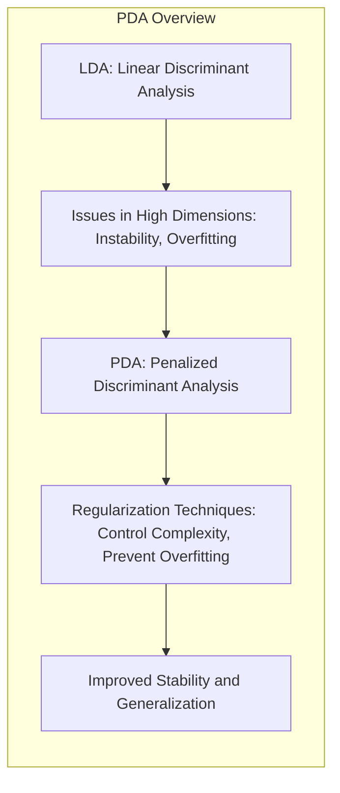
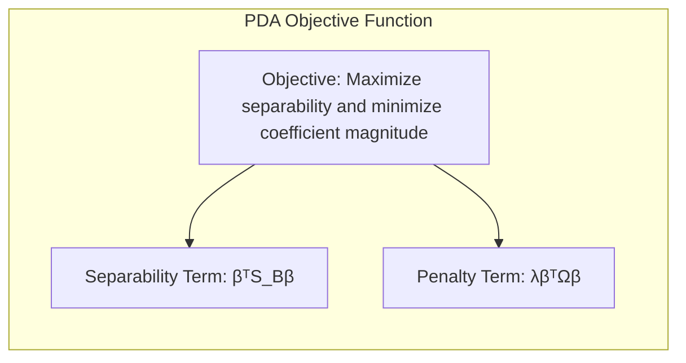
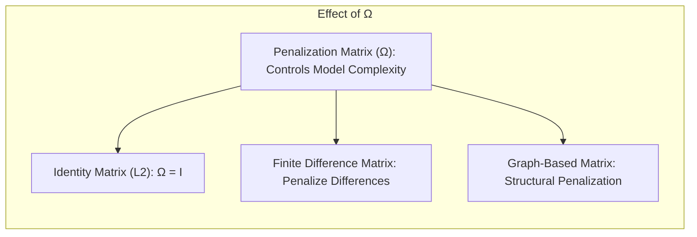
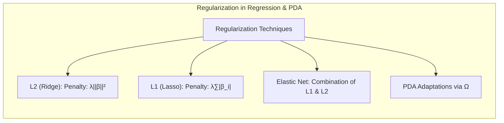
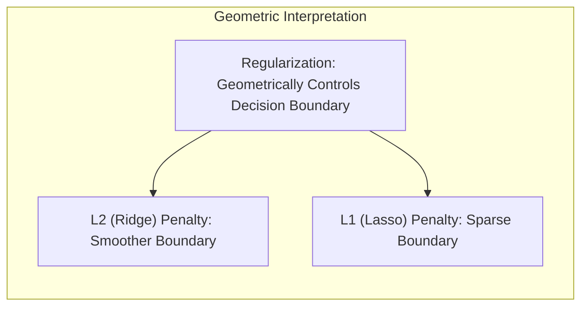

Okay, let's enhance the provided text with practical numerical examples to solidify the understanding of Penalized Discriminant Analysis (PDA).

## Título: Análise Discriminante Penalizada (PDA): Regularização para Estabilidade e Eficiência em Alta Dimensionalidade

### Introdução

A **Análise Discriminante Linear (LDA)**, apesar de sua simplicidade e interpretabilidade, apresenta limitações importantes em problemas de classificação de alta dimensionalidade, onde o número de *features* é grande em relação ao número de amostras. Nestes cenários, a LDA pode se tornar instável, com modelos sujeitos a *overfitting* e baixa capacidade de generalização. A **Análise Discriminante Penalizada (PDA)** surge como uma extensão da LDA que visa resolver esses problemas, através da utilização de técnicas de **regularização**.

Neste capítulo, exploraremos em detalhes a formulação da PDA e como ela se diferencia da LDA, com foco em como a regularização é utilizada para controlar a complexidade do modelo e evitar o *overfitting* em espaços de alta dimensionalidade. Analisaremos a função de custo da PDA e o papel do termo de penalização, e como a escolha desse termo influencia a forma da fronteira de decisão e o desempenho do modelo. Também discutiremos a relação da PDA com outras técnicas de regularização em aprendizado de máquina, e como a PDA se encaixa no contexto geral da classificação em alta dimensionalidade.

A compreensão da formulação da PDA e do impacto da regularização é fundamental para a aplicação bem-sucedida desse método em problemas com dados de alta dimensionalidade e para a construção de modelos robustos e com boa capacidade de generalização.

### Formulação da Análise Discriminante Penalizada (PDA)

**Conceito 1: A Limitação da LDA em Alta Dimensionalidade**

Como vimos em capítulos anteriores, a **Análise Discriminante Linear (LDA)** é um método de classificação que busca uma projeção linear que maximize a separação entre classes. A LDA assume que as classes são gaussianas com uma matriz de covariância comum. No entanto, em espaços de alta dimensionalidade, a estimação da matriz de covariância $\Sigma$ se torna um problema complexo. Se o número de *features* $p$ é grande e comparável ou maior que o número de amostras $N$, a matriz $\Sigma$ pode se tornar singular ou mal condicionada, o que leva a modelos instáveis e com alta variância.

> 💡 **Exemplo Numérico:** Imagine um cenário com $N=50$ amostras e $p=100$ features (atributos). A matriz de covariância $\Sigma$ seria de dimensão $100 \times 100$. Com apenas 50 amostras, estimar essa matriz de forma precisa é difícil, o que pode levar a uma matriz singular ou quase singular. Isso significa que a matriz de covariância não é invertível, tornando a LDA instável.

In other words, the LDA, without regularization, may generate unstable solutions and with low generalization power in problems with high dimensionality, due to the difficulty in obtaining an accurate estimation of the covariance matrix and the risk of *overfitting*, as addressed in [^12.4].

**Lemma 1:** The LDA, when applied to high-dimensional problems, can exhibit instability and *overfitting*, due to the difficulty in estimating the covariance matrix, which is used to project the data in a space of lower dimension.

The demonstration of this lemma is based on the analysis of the calculation of the covariance matrix and how it becomes more unstable when the number of *features* increases in relation to the number of samples, and how this impacts the solution obtained by the LDA.

**Conceito 2: Introdução da Penalização na FDA/LDA**

A **Análise Discriminante Penalizada (PDA)** é uma generalização da LDA que visa mitigar os problemas de instabilidade e *overfitting* através da introdução de um termo de **penalização** na função objetivo. Em PDA, o objetivo passa a ser maximizar a separação entre classes, mas também minimizar a magnitude dos coeficientes, o que leva a modelos mais simples e robustos.

A função objetivo da PDA pode ser expressa como:

$$ \max_{\beta} \beta^T S_B \beta - \lambda \beta^T \Omega \beta $$

onde:

*   $S_B$ é a matriz de dispersão entre classes, que quantifica a separabilidade entre as classes.
*   $\beta$ é o vetor que define a direção da projeção discriminante.
*   $\lambda$ é o parâmetro de regularização, que controla o compromisso entre a separabilidade das classes e a complexidade do modelo.
*   $\Omega$ é a matriz de penalização, que define como a complexidade do modelo é medida e como os coeficientes são penalizados.

O termo $\beta^T S_B \beta$ representa a maximização da separabilidade entre classes, e o termo $\lambda \beta^T \Omega \beta$ penaliza a magnitude dos coeficientes, reduzindo a complexidade do modelo e evitando o *overfitting*.

> 💡 **Exemplo Numérico:** Suponha que temos duas classes e após calcular a matriz de dispersão entre classes $S_B$, encontramos um vetor $\beta$ que maximiza $\beta^T S_B \beta$. Agora, introduzimos a penalização com $\lambda = 0.1$ e $\Omega = I$ (matriz identidade). Se o vetor $\beta$ inicial fosse, por exemplo, $\beta = [10, -5, 2, 8, -1]$, o termo de penalização seria $\lambda \beta^T \Omega \beta = 0.1 * (10^2 + (-5)^2 + 2^2 + 8^2 + (-1)^2) = 0.1 * (100 + 25 + 4 + 64 + 1) = 0.1 * 194 = 19.4$. A PDA busca um novo $\beta$ que, além de maximizar a separação entre classes, minimize este termo de penalização, reduzindo a magnitude dos coeficientes.

**Corolário 1:** A PDA utiliza a regularização para controlar a complexidade do modelo e evitar o overfitting, o que a torna mais adequada para lidar com dados de alta dimensionalidade do que a LDA.

A demonstração desse corolário se baseia na análise da função objetivo da PDA e como a introdução do termo de penalização restringe a magnitude dos coeficientes e leva a modelos mais estáveis e com melhor capacidade de generalização.

### O Papel da Matriz de Penalização $\Omega$

A matriz de penalização $\Omega$ na formulação da PDA tem um papel fundamental na determinação da forma da fronteira de decisão e da complexidade do modelo. A escolha apropriada da matriz $\Omega$ permite modelar diferentes tipos de penalização, o que leva a modelos com propriedades específicas.

Algumas escolhas comuns para a matriz $\Omega$ incluem:

1.  **Matriz Identidade:** Quando $\Omega$ é a matriz identidade, a penalização corresponde à norma L2 dos coeficientes do modelo, ou seja:

    $$ \beta^T \Omega \beta = \beta^T I \beta = ||\beta||^2 $$

    Essa forma de penalização reduz a magnitude dos coeficientes e leva a modelos mais estáveis, mas não força a que os coeficientes sejam zero.

    > 💡 **Exemplo Numérico:** Se $\beta = [3, -2, 1, 4]$, então $\beta^T I \beta = 3^2 + (-2)^2 + 1^2 + 4^2 = 9 + 4 + 1 + 16 = 30$. A penalização com a matriz identidade reduz a magnitude geral dos coeficientes, but it does not force them to zero.

2.  **Matriz de Penalização de Diferenças Finitas:** A matriz $\Omega$ pode ser construída para penalizar diferenças entre os coeficientes de *features* adjacentes, com o objetivo de gerar soluções mais suaves. Essa abordagem é utilizada em problemas com dados espaciais, como imagens, onde coeficientes de *features* próximos têm um efeito similar na modelagem.

    > 💡 **Exemplo Numérico:** Suponha que temos 4 features e $\beta = [5, 2, 4, 1]$. Uma matriz de diferenças finitas pode ser construída para penalizar diferenças entre coeficientes adjacentes. Uma possível matriz $\Omega$ seria tal que $\beta^T \Omega \beta$ penalizasse $(5-2)^2 + (2-4)^2 + (4-1)^2 = 3^2 + (-2)^2 + 3^2 = 9 + 4 + 9 = 22$. Isso favorece soluções onde os coeficientes de *features* adjacentes são mais próximos.

3.   **Matrizes de Penalização Baseadas em Grafos:** A matriz $\Omega$ pode ser construída a partir da estrutura do grafo representando as relações entre *features* ou categorias, penalizando coeficientes que se relacionam com estruturas distantes e que são menos importantes para o modelo.

    > 💡 **Exemplo Numérico:** Considere um grafo onde a feature 1 está conectada à feature 2, e a feature 3 está conectada à feature 4. Se $\beta = [5, 4, 1, 2]$, uma matriz $\Omega$ baseada em grafo pode penalizar mais a diferença entre os grupos (1,2) e (3,4) do que as diferenças dentro dos grupos, o que leva a um vetor $\beta$ com coeficientes similares dentro de grupos e diferentes entre os grupos.

A escolha apropriada da matriz de penalização $\Omega$ é crucial para o desempenho da PDA, e deve ser feita com base nas características dos dados e nas propriedades desejadas para o modelo.

**Lemma 2:** A escolha da matriz de penalização $\Omega$ define como a complexidade do modelo é penalizada e como a regularização afeta a forma da função discriminante.

A demonstração desse lemma se baseia na análise da função objetivo da PDA e como a matriz $\Omega$ determina a forma do termo de penalização. A escolha apropriada da matriz $\Omega$ permite que a penalização se ajuste às características dos dados e auxilie no processo de regularização.

### Conexão com Métodos de Regularização em Regressão

A PDA pode ser vista como uma generalização da LDA que incorpora técnicas de **regularização** que também são utilizadas em problemas de regressão. Como discutido anteriormente, a regularização é utilizada para controlar a complexidade dos modelos e evitar o *overfitting*.

A regularização L2, como mencionada anteriormente, penaliza a norma ao quadrado dos coeficientes:

$$  \lambda ||\beta||^2  $$

A regularização L1 (Lasso) penaliza a norma L1 dos coeficientes:

$$ \lambda \sum_{i=1}^p |\beta_i|  $$

A regularização L1 leva a modelos mais esparsos, onde muitos coeficientes são exatamente zero, o que pode ser útil para a seleção de *features* relevantes. A regularização elástica (Elastic Net) combina as regularizações L1 e L2, e também pode ser utilizada na formulação da PDA.

> 💡 **Exemplo Numérico:** Vamos comparar L1 e L2 penalizações com $\lambda = 0.5$ e $\beta = [3, -2, 0, 1, -1]$.
>
> - L2: $\lambda ||\beta||^2 = 0.5 * (3^2 + (-2)^2 + 0^2 + 1^2 + (-1)^2) = 0.5 * (9 + 4 + 0 + 1 + 1) = 0.5 * 15 = 7.5$
> - L1: $\lambda \sum_{i=1}^p |\beta_i| = 0.5 * (|3| + |-2| + |0| + |1| + |-1|) = 0.5 * (3 + 2 + 0 + 1 + 1) = 0.5 * 7 = 3.5$
>
> Note that L1 penalizes the magnitude of the coefficients linearly and tends to zero out coefficients, while L2 penalizes quadratically and only reduces magnitude.

As técnicas de regularização utilizadas em regressão podem ser adaptadas para a formulação da PDA através da escolha apropriada da matriz de penalização $\Omega$, e a escolha da regularização apropriada depende da natureza dos dados e do problema de classificação em questão.

**Corolário 1:** As técnicas de regularização utilizadas em regressão, como L1, L2 e Elastic Net, podem ser incorporadas na formulação da PDA através da escolha apropriada da matriz de penalização Ω, o que torna a PDA uma ferramenta flexível para lidar com dados de alta dimensão.

A demonstração desse corolário se baseia na análise da formulação da PDA e como a matriz de penalização $\Omega$ pode ser construída para incorporar a regularização L1 e L2, o que leva a modelos com diferentes níveis de esparsidade e estabilidade.

### Interpretação Geométrica da Penalização e a Complexidade da Fronteira

A penalização em PDA pode ser interpretada geometricamente como uma forma de controlar a complexidade da fronteira de decisão. Ao penalizar a magnitude ou as diferenças entre os coeficientes do modelo, a PDA força o hiperplano a ser mais suave, ou com menos variação, o que leva a modelos mais estáveis e com maior capacidade de generalização.

A matriz de penalização $\Omega$ define a forma como os coeficientes são penalizados, e essa escolha influencia a forma da fronteira de decisão. Se a matriz de penalização penaliza fortemente as diferenças entre coeficientes de *features* vizinhas, o modelo tenderá a gerar fronteiras mais suaves. Se a matriz penaliza coeficientes de baixa magnitude, o modelo tenderá a gerar fronteiras mais esparsas.

> 💡 **Exemplo Numérico:** Imagine que temos um problema de classificação com duas features e a fronteira de decisão é definida por um hiperplano. Sem penalização, o hiperplano pode se ajustar perfeitamente aos dados de treinamento, but may have a complex and irregular shape, leading to overfitting. With L2 penalization, the hyperplane tends to be smoother, with less steep inclination, and with L1 penalization, some features may have zero coefficients, which simplifies the decision boundary, leading to a more generalizable model.

A interpretação geométrica da penalização permite entender como o ajuste da matriz $\Omega$ e do parâmetro $\lambda$ afetam a forma da fronteira de decisão e a capacidade do modelo de se adaptar aos dados de treinamento.

**Corolário 2:** A penalização em PDA afeta a forma da fronteira de decisão e sua complexidade, e diferentes matrizes de penalização levam a modelos com propriedades específicas.

A demonstração desse corolário se baseia na análise da função objetivo da PDA e como o termo de penalização restringe a magnitude e as diferenças entre os coeficientes do modelo, o que leva a uma mudança na forma da fronteira de decisão.

### Conclusão

Neste capítulo, exploramos em detalhe a formulação da **Análise Discriminante Penalizada (PDA)**, uma extensão da LDA que visa lidar com problemas de alta dimensionalidade através da utilização de **regularização**. Vimos como a PDA introduz um termo de penalização na função objetivo da LDA, que controla a complexidade do modelo e evita o *overfitting*.

Analisamos o papel da matriz de penalização $\Omega$ e como a sua escolha influencia a forma da fronteira de decisão e as propriedades do modelo. Discutimos como a PDA se relaciona com outras técnicas de regularização utilizadas em problemas de regressão, como L1, L2 e elástica. A escolha apropriada da técnica de regularização e de seus parâmetros dependem da natureza dos dados.

A PDA oferece uma abordagem flexível e robusta para problemas de classificação com alta dimensionalidade, e a sua compreensão é fundamental para a aplicação bem-sucedida desse método em cenários onde a LDA apresenta limitações.

### Footnotes

[^12.1]: "In this chapter we describe generalizations of linear decision boundaries for classification. Optimal separating hyperplanes are introduced in Chapter 4 for the case when two classes are linearly separable. Here we cover extensions to the nonseparable case, where the classes overlap. These techniques are then generalized to what is known as the support vector machine, which produces nonlinear boundaries by constructing a linear boundary in a large, transformed version of the feature space." *(Trecho de  "Support Vector Machines and Flexible Discriminants")*

[^12.2]: "In Chapter 4 we discussed a technique for constructing an optimal separating hyperplane between two perfectly separated classes. We review this and generalize to the nonseparable case, where the classes may not be separable by a linear boundary." *(Trecho de  "Support Vector Machines and Flexible Discriminants")*

[^12.3]: "The support vector machine classifier is an extension of this idea, where the dimension of the enlarged space is allowed to get very large, infinite in some cases. It might seem that the computations would become prohibitive. It would also seem that with sufficient basis functions, the data would be separable, and overfitting would occur. We first show how the SVM technology deals with these issues. We then see that in fact the SVM classifier is solving a function-fitting problem using a particular criterion and form of regularization, and is part of a much bigger class of problems that includes the smoothing splines of Chapter 5." *(Trecho de  "Support Vector Machines and Flexible Discriminants")*

[^12.4]: "Often LDA produces the best classification results, because of its simplicity and low variance. LDA was among the top three classifiers for 11 of the 22 datasets studied in the STATLOG project (Michie et al., 1994)3." *(Trecho de  "Support Vector Machines and Flexible Discriminants")*
