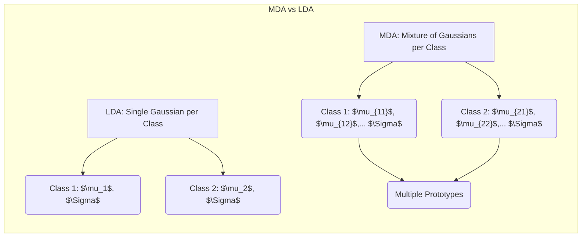
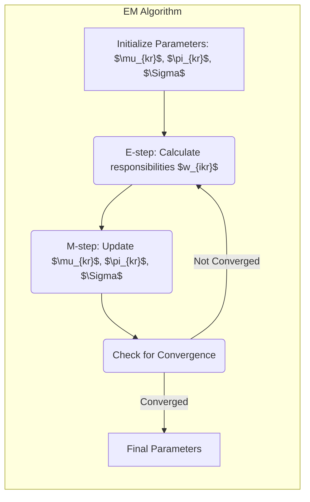
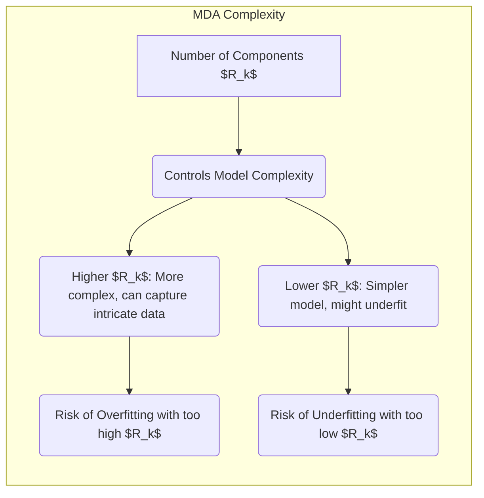
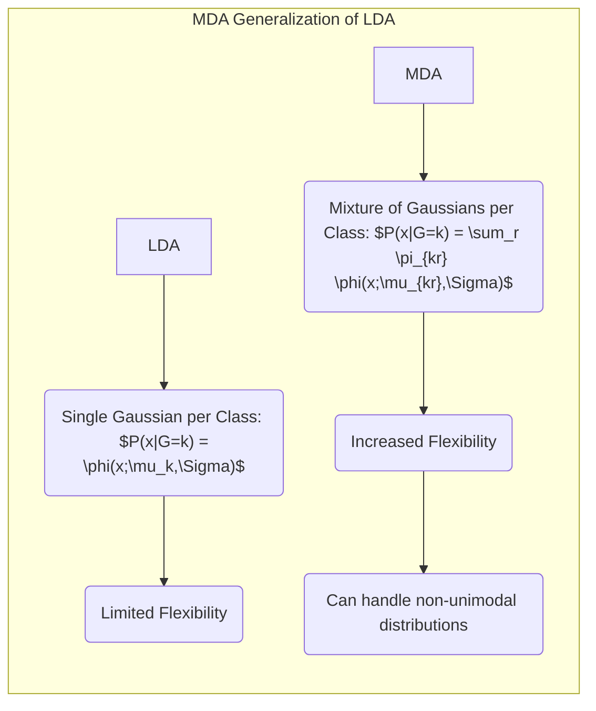

Okay, let's enhance the text with practical numerical examples to illustrate the concepts of Mixture Discriminant Analysis (MDA).

## Título: Análise Discriminante por Misturas (MDA): Modelagem de Classes com Múltiplos Protótipos



### Introdução

A **Análise Discriminante Linear (LDA)**, como vimos em capítulos anteriores, assume que os dados de cada classe seguem uma distribuição gaussiana multivariada com uma matriz de covariância comum, o que pode ser inadequado para muitos conjuntos de dados reais. A **Análise Discriminante por Misturas (MDA)** surge como uma generalização da LDA que visa superar essa limitação, modelando a distribuição de cada classe como uma **mistura de gaussianas** com diferentes centros, mas mantendo uma matriz de covariância compartilhada entre todas as gaussianas de cada classe.

A MDA permite que cada classe seja representada por **múltiplos protótipos**, ao contrário da LDA que utiliza apenas um centroide por classe. Essa flexibilidade permite que a MDA modele melhor a estrutura de classes complexas, que podem ser compostas por diferentes subgrupos, ou podem ter uma estrutura não unimodal.

Neste capítulo, exploraremos em detalhe a formulação da MDA, como os modelos de mistura gaussianas são utilizados para representar as classes, como os parâmetros do modelo são estimados utilizando o **algoritmo Expectation-Maximization (EM)** e como a classificação é realizada com base nos modelos de mistura. Analisaremos também as vantagens e desvantagens da MDA em relação à LDA e como a MDA se relaciona com outros modelos de mistura.

A compreensão da formulação da MDA e de seu processo de otimização é fundamental para a aplicação bem-sucedida desse método em problemas de classificação complexos.

### A Formulação da Análise Discriminante por Misturas (MDA)

**Conceito 1: Modelagem de Classes com Misturas Gaussianas**

A principal característica da **Análise Discriminante por Misturas (MDA)** é a utilização de **modelos de mistura gaussianas** para representar a distribuição de cada classe. Em vez de assumir que cada classe segue uma única distribuição gaussiana, como na LDA, a MDA assume que a distribuição de cada classe é uma combinação de $R_k$ distribuições gaussianas, também chamadas de componentes, onde $R_k$ é o número de gaussianas da classe $k$. A densidade de probabilidade de um ponto $x$ pertencer à classe $k$ é dada por:

$$ P(x | G=k) = \sum_{r=1}^{R_k} \pi_{kr} \phi(x; \mu_{kr}, \Sigma) $$

onde:

*   $\pi_{kr}$ são as **proporções da mistura**, que representam a probabilidade de uma amostra pertencer ao componente $r$ da classe $k$, e $\sum_{r=1}^{R_k} \pi_{kr} = 1$.
*   $\phi(x; \mu_{kr}, \Sigma)$ é a densidade de probabilidade de uma distribuição gaussiana multivariada, com média $\mu_{kr}$ e uma matriz de covariância comum $\Sigma$ para todos os componentes, e entre todas as classes.

Ao modelar cada classe como uma mistura de gaussianas, a MDA oferece maior flexibilidade na representação das classes do que a LDA. Enquanto a LDA utiliza apenas um centroide e uma matriz de covariância comum para cada classe, a MDA utiliza múltiplos protótipos (os centros de cada componente gaussiano), o que permite representar classes com diferentes modos ou subgrupos.

> 💡 **Exemplo Numérico:**
>
> Vamos considerar um problema de classificação com duas classes ($k=1, 2$). Suponha que a classe 1 seja representada por duas gaussianas ($R_1 = 2$) e a classe 2 por uma gaussiana ($R_2 = 1$). Os parâmetros são:
>
> *   Classe 1:
>    *   $\pi_{11} = 0.6$, $\mu_{11} = [1, 1]$,
>    *   $\pi_{12} = 0.4$, $\mu_{12} = [3, 3]$
> *   Classe 2:
>    *    $\pi_{21} = 1.0$, $\mu_{21} = [6, 1]$
> *   Matriz de covariância comum: $\Sigma = \begin{bmatrix} 0.5 & 0 \\ 0 & 0.5 \end{bmatrix}$
>
> Agora, considere um ponto de dado $x = [2, 2]$. Para calcular a probabilidade de $x$ pertencer à classe 1, usamos a fórmula da mistura gaussiana:
>
> $P(x|G=1) = \pi_{11} \phi(x; \mu_{11}, \Sigma) + \pi_{12} \phi(x; \mu_{12}, \Sigma)$
>
> Calculando as densidades gaussianas:
>
> $\phi(x; \mu_{11}, \Sigma) = \frac{1}{(2\pi)^{d/2} |\Sigma|^{1/2}} \exp(-\frac{1}{2}(x-\mu_{11})^T \Sigma^{-1}(x-\mu_{11}))$
>
> $\phi(x; \mu_{11}, \Sigma) = \frac{1}{(2\pi)^{1} (0.5^2)^{1/2}} \exp(-\frac{1}{2} \begin{bmatrix} 2-1 \\ 2-1 \end{bmatrix}^T \begin{bmatrix} 2 & 0 \\ 0 & 2 \end{bmatrix}  \begin{bmatrix} 2-1 \\ 2-1 \end{bmatrix}) \approx 0.159$
>
> $\phi(x; \mu_{12}, \Sigma) = \frac{1}{(2\pi)^{1} (0.5^2)^{1/2}} \exp(-\frac{1}{2} \begin{bmatrix} 2-3 \\ 2-3 \end{bmatrix}^T \begin{bmatrix} 2 & 0 \\ 0 & 2 \end{bmatrix}  \begin{bmatrix} 2-3 \\ 2-3 \end{bmatrix}) \approx 0.063$
>
> $P(x|G=1) = 0.6 \times 0.159 + 0.4 \times 0.063  \approx 0.121$
>
> Da mesma forma, para a classe 2:
>
> $P(x|G=2) = \pi_{21} \phi(x; \mu_{21}, \Sigma)$
>
> $\phi(x; \mu_{21}, \Sigma) = \frac{1}{(2\pi)^{1} (0.5^2)^{1/2}} \exp(-\frac{1}{2} \begin{bmatrix} 2-6 \\ 2-1 \end{bmatrix}^T \begin{bmatrix} 2 & 0 \\ 0 & 2 \end{bmatrix}  \begin{bmatrix} 2-6 \\ 2-1 \end{bmatrix}) \approx 0.000034$
>
> $P(x|G=2) = 1.0 * 0.000034 \approx 0.000034$
>
> Este exemplo ilustra como a densidade de probabilidade de um ponto em cada classe é calculada usando a combinação ponderada das densidades gaussianas.
>
> ```mermaid
>  graph LR
>      subgraph "Mixture Model"
>          A["P(x|G=k)"] --> B("$\sum \pi_{kr} * \phi(x;\mu_{kr},\Sigma)$")
>          B --> C("Class k Density")
>          B-->D("where: $\phi(x;\mu_{kr},\Sigma)$ is Gaussian Density")
>      end
> ```

**Lemma 1:** A MDA modela cada classe como uma mistura de gaussianas, permitindo que classes complexas sejam representadas por múltiplos protótipos em vez de um único centroide como na LDA.

A demonstração desse lemma se baseia na análise da formulação da MDA e como ela utiliza a combinação linear de gaussianas para representar a distribuição das classes.

**Conceito 2: A Função Discriminante da MDA**

A função discriminante da MDA é definida com base na probabilidade *a posteriori* de um ponto $x$ pertencer à classe $k$:

$$ P(G=k | x) = \frac{P(x|G=k)P(G=k)}{P(x)} $$

onde:

*   $P(x|G=k)$ é a densidade de probabilidade de $x$ dado que ele pertence à classe $k$, que é definida pelo modelo de mistura gaussiana para a classe $k$.
*   $P(G=k)$ é a probabilidade *a priori* da classe $k$.
*   $P(x)$ é a probabilidade marginal de $x$.

Como o denominador é comum a todas as classes, a função de decisão da MDA utiliza o numerador para classificar um ponto na classe que maximiza essa probabilidade, sem precisar calcular o denominador.

> 💡 **Exemplo Numérico:**
>
> Continuando com o exemplo anterior, vamos assumir que as probabilidades *a priori* das classes são $P(G=1) = 0.6$ e $P(G=2) = 0.4$. Usando as probabilidades condicionais calculadas anteriormente, podemos calcular o numerador da probabilidade *a posteriori* para cada classe:
>
> $P(x, G=1) = P(x|G=1)P(G=1) = 0.121 * 0.6 = 0.0726$
>
> $P(x, G=2) = P(x|G=2)P(G=2) = 0.000034 * 0.4 = 0.0000136$
>
> Como $0.0726 > 0.0000136$, o ponto $x=[2,2]$ seria classificado na Classe 1. A probabilidade *a posteriori* exata pode ser calculada dividindo cada valor pela soma dos numeradores, mas para classificação, o numerador é suficiente.
>
> ```mermaid
>  graph LR
>    subgraph "MDA Discriminant Function"
>      A["P(G=k|x)"] --> B["P(x|G=k)P(G=k) / P(x)"]
>      B --> C("Classification Decision")
>      C --> D("Maximize P(x,G=k)")
>      D --> E("Assign x to class k")
>     end
> ```

**Corolário 1:** A MDA utiliza a probabilidade a *posteriori* de cada classe para classificar as amostras, e a densidade da classe é dada pela combinação das gaussianas com seus respectivos pesos.

A demonstração desse corolário se baseia na definição da função discriminante e como ela se relaciona com a probabilidade *a posteriori* de cada classe e com os modelos de mistura gaussianos utilizados para representar as classes.

### O Algoritmo Expectation-Maximization (EM) para Ajuste dos Parâmetros



O **algoritmo Expectation-Maximization (EM)** é um método iterativo para ajustar os parâmetros de modelos de mistura, e é utilizado na MDA para estimar os parâmetros das gaussianas (médias e matriz de covariância) e as proporções da mistura ($\pi_{kr}$). O algoritmo EM consiste em duas etapas que são repetidas iterativamente:

1.  **Etapa E (Expectation):** Dado os parâmetros atuais do modelo, calcula-se a probabilidade de que cada amostra $x_i$ pertença a cada componente $r$ de cada classe $k$, que é definida como a responsabilidade $w_{ik_r}$ do componente $r$ sobre a amostra $i$ na classe $k$:

    $$ w_{ikr} = \frac{\pi_{kr} \phi(x_i; \mu_{kr}, \Sigma)}{ \sum_{r'=1}^{R_k} \pi_{kr'} \phi(x_i; \mu_{kr'}, \Sigma) }$$

2.  **Etapa M (Maximization):** Calcula-se os novos valores para os parâmetros do modelo (as médias $\mu_{kr}$, as proporções $\pi_{kr}$ e a matriz de covariância $\Sigma$), maximizando a verossimilhança dos dados utilizando as responsabilidades calculadas no passo anterior. As novas estimativas para os parâmetros são dadas por:

    $$ \mu_{kr}^{new} = \frac{\sum_{i=1}^N w_{ikr} x_i}{\sum_{i=1}^N w_{ikr}} $$

    $$ \pi_{kr}^{new} = \frac{\sum_{i=1}^N w_{ikr}}{\sum_{i=1}^N \sum_{r=1}^{R_k} w_{ikr}}  $$
    $$ \Sigma^{new} = \frac{1}{N}\sum_{k=1}^{K} \sum_{i=1}^N \sum_{r=1}^{R_k}  w_{ikr}(x_i - \mu_{kr}^{new}) (x_i - \mu_{kr}^{new})^T $$

O algoritmo EM itera entre a etapa E e a etapa M até que os parâmetros do modelo convirjam. O algoritmo EM é garantido de aumentar a verossimilhança do modelo a cada iteração, e parar quando um ponto fixo é atingido, mas a função de verossimilhança não é convexa, o que pode levar a convergência a um ótimo local. Por isso, é comum rodar o algoritmo EM com diferentes inicializações.

> 💡 **Exemplo Numérico:**
>
> Vamos simplificar o exemplo e considerar apenas uma amostra $x_1 = [2,2]$ e a classe 1 com dois componentes gaussianos, como no exemplo anterior. Assumindo que os parâmetros iniciais são os mesmos do exemplo anterior, vamos calcular a responsabilidade $w_{111}$ e $w_{112}$:
>
> *   $w_{111} = \frac{\pi_{11} \phi(x_1; \mu_{11}, \Sigma)}{ \pi_{11} \phi(x_1; \mu_{11}, \Sigma) + \pi_{12} \phi(x_1; \mu_{12}, \Sigma) } = \frac{0.6 * 0.159}{0.6 * 0.159 + 0.4 * 0.063} \approx 0.75$
>
> *   $w_{112} = \frac{\pi_{12} \phi(x_1; \mu_{12}, \Sigma)}{ \pi_{11} \phi(x_1; \mu_{11}, \Sigma) + \pi_{12} \phi(x_1; \mu_{12}, \Sigma) } = \frac{0.4 * 0.063}{0.6 * 0.159 + 0.4 * 0.063} \approx 0.25$
>
>  Agora, se essa fosse a única amostra, as novas estimativas seriam:
>
> $\mu_{11}^{new} = \frac{w_{111} x_1}{w_{111}} = \frac{0.75 * [2,2]}{0.75} = [2,2]$
>
> $\mu_{12}^{new} = \frac{w_{112} x_1}{w_{112}} = \frac{0.25 * [2,2]}{0.25} = [2,2]$
>
> $\pi_{11}^{new} = \frac{w_{111}}{w_{111}+w_{112}} = \frac{0.75}{0.75+0.25} = 0.75$
>
> $\pi_{12}^{new} = \frac{w_{112}}{w_{111}+w_{112}} = \frac{0.25}{0.75+0.25} = 0.25$
>
> Este exemplo simplificado mostra como o algoritmo EM atualiza os parâmetros usando as responsabilidades. Em um cenário real, essas etapas são repetidas iterativamente com todas as amostras até a convergência.
>
> ```mermaid
> graph LR
>    subgraph "E-Step"
>       A["Responsibility $w_{ikr}$"] --> B["$w_{ikr} =  \pi_{kr} \phi(x_i; \mu_{kr}, \Sigma) / \sum_{r'} \pi_{kr'} \phi(x_i; \mu_{kr'}, \Sigma)$"]
>       B -->C("Calculated using current parameters")
>    end
>    subgraph "M-Step"
>       D["Updated Parameters"]-->E["$\mu_{kr} =  \sum_i w_{ikr} x_i / \sum_i w_{ikr}$"]
>       D-->F["$\pi_{kr} =  \sum_i w_{ikr} / \sum_i \sum_r w_{ikr}$"]
>       D-->G["$\Sigma = 1/N \sum_k \sum_i \sum_r w_{ikr} (x_i - \mu_{kr})(x_i - \mu_{kr})^T$"]
>        E & F & G --> H("Parameters are updated using responsibilities")
>    end
> ```

**Lemma 3:** O algoritmo EM é uma técnica iterativa para ajustar os parâmetros dos modelos de mistura gaussianas, e garante que o modelo convirja para um máximo local da verossimilhança.

A demonstração desse lemma se baseia na análise das etapas do algoritmo EM, onde a verossimilhança é garantida de aumentar a cada iteração até a convergência.

### A Complexidade da MDA e o Número de Componentes Gaussianas



O número de componentes gaussianas $R_k$ em cada classe é um hiperparâmetro fundamental da MDA que controla a complexidade do modelo. Um número maior de componentes gaussianas permite que a MDA modele distribuições de classes mais complexas, com múltiplos subgrupos ou formas irregulares, como abordado em [^12.4]. No entanto, um número muito grande de componentes pode levar a modelos muito complexos que sofrem *overfitting*, ajustando-se demais aos dados de treinamento e com baixa capacidade de generalização.

A escolha do número apropriado de componentes gaussianas para cada classe deve ser feita considerando a complexidade dos dados, o número de amostras disponíveis e a capacidade de generalização do modelo. A validação cruzada pode ser utilizada para avaliar diferentes valores de $R_k$ e escolher aquele que maximiza o desempenho do modelo em dados não vistos.

Em geral, é recomendado utilizar um número de componentes gaussianas o menor possível, e que seja suficiente para representar a distribuição das classes de forma adequada. Um número muito alto de componentes pode tornar o modelo mais complexo e, consequentemente, aumentar a variância da solução. Uma escolha adequada do número de componentes é essencial para que o modelo MDA tenha uma boa capacidade de modelar os dados.

> 💡 **Exemplo Numérico:**
>
> Suponha que tenhamos um conjunto de dados com duas classes. A classe 1 tem uma distribuição unimodal, enquanto a classe 2 tem uma distribuição bimodal.
>
> *   **Cenário 1:** Usamos $R_1=1$ e $R_2=1$.  Ambas as classes são modeladas com uma única gaussiana. O modelo MDA se comportará de forma similar ao LDA, e pode não modelar adequadamente a classe 2.
>
> *   **Cenário 2:** Usamos $R_1=1$ e $R_2=2$. A classe 1 é modelada com uma gaussiana, e a classe 2 com duas gaussianas. O modelo MDA deve ser capaz de capturar melhor a estrutura bimodal da classe 2, melhorando a precisão da classificação.
>
> *   **Cenário 3:** Usamos $R_1=3$ e $R_2=3$. Ambas as classes são modeladas com três gaussianas. O modelo se torna mais complexo, e pode haver *overfitting* se o número de amostras for baixo, resultando em uma capacidade de generalização ruim.
>
> A escolha correta de $R_k$ é crucial. A validação cruzada pode ser usada para comparar diferentes valores de $R_k$ e selecionar aquele que produz o melhor desempenho em dados não vistos. Por exemplo, podemos usar a validação cruzada para calcular o erro de classificação com diferentes valores de $R_k$ e escolher o que minimiza o erro.

**Corolário 2:** O número de componentes gaussianas em MDA controla a complexidade do modelo, e a escolha apropriada envolve um compromisso entre a capacidade do modelo se ajustar aos dados de treinamento e sua capacidade de generalizar.

A demonstração desse corolário se baseia na análise do efeito do número de componentes gaussianas na capacidade do modelo de representar a distribuição das classes, e como essa propriedade leva a modelos mais flexíveis e, portanto, mais complexos, e propensos ao *overfitting*.

### Conexão da MDA com a LDA



A **Análise Discriminante por Misturas (MDA)** pode ser vista como uma generalização da **Análise Discriminante Linear (LDA)**. Enquanto a LDA assume que cada classe é representada por um único protótipo (o centroide da classe), a MDA permite que cada classe seja representada por múltiplos protótipos (os centros de cada componente gaussiano).

Sob certas condições, a MDA se aproxima da LDA. Por exemplo, se o número de componentes gaussianas para cada classe é igual a um, e as matrizes de covariância são as mesmas para todas as classes, então a MDA se reduz à LDA. No entanto, a MDA oferece uma maior flexibilidade, permitindo que o modelo capture nuances nos dados que não podem ser modeladas pela LDA.

A MDA é uma abordagem mais flexível do que a LDA, e ela é particularmente útil em cenários onde as classes são complexas e não são bem representadas por um único protótipo. A MDA se torna uma ferramenta poderosa para a modelagem de dados complexos, que podem apresentar múltiplas concentrações de probabilidade por classe.

> 💡 **Exemplo Numérico:**
>
> Imagine que temos um conjunto de dados com duas classes.
>
> *   **LDA:** A LDA assume que cada classe tem uma distribuição gaussiana com um único centroide. Se as classes são bem separadas e unimodais, a LDA pode funcionar bem.
>
> *   **MDA (com R_k=1):** Se definirmos $R_k = 1$ para todas as classes, a MDA se reduz à LDA. A função de decisão será linear.
>
> *   **MDA (com R_k>1):** Se a classe 1 tiver uma distribuição bimodal, podemos usar $R_1 = 2$ e $R_2 = 1$. A MDA modela a classe 1 com dois protótipos, enquanto a classe 2 é modelada com um único protótipo. Isso permite que a MDA capture a complexidade da classe 1 e melhore a precisão da classificação.
>
> Por exemplo, se a classe 1 tem dois agrupamentos distintos de amostras, a LDA terá dificuldade em modelar essa classe adequadamente, pois ela tenta ajustar uma única gaussiana para os dois agrupamentos. A MDA, com dois componentes gaussianos para a classe 1, pode ajustar melhor os dois agrupamentos, resultando em uma melhor classificação.

**Corolário 3:** A MDA generaliza a LDA ao modelar cada classe com uma mistura gaussiana, permitindo que cada classe seja representada por múltiplos protótipos e que a função de decisão se adapte à complexidade dos dados, superando algumas das limitações da LDA, como a linearidade das fronteiras e a suposição de um único centroide por classe.

A demonstração desse corolário se baseia na comparação da formulação da LDA e da MDA e como a utilização de modelos de mistura gaussiana nas MDA permite modelar distribuições de dados mais complexas.

### Conclusão

Neste capítulo, exploramos em detalhe a **Análise Discriminante por Misturas (MDA)**, uma generalização da LDA que utiliza **modelos de mistura gaussianas** para representar a distribuição de cada classe. Vimos como a MDA permite que cada classe seja modelada por múltiplos protótipos, superando a limitação da LDA de utilizar apenas um centroide.

Analisamos a formulação matemática da MDA, como o algoritmo EM é utilizado para estimar os parâmetros do modelo e como a classificação é realizada com base nas probabilidades *a posteriori*. Discutimos também a importância da escolha do número de componentes gaussianas e como ela influencia a complexidade do modelo.

A MDA oferece uma abordagem mais flexível e poderosa do que a LDA para problemas de classificação com distribuições complexas, e sua compreensão é fundamental para a escolha apropriada do método de classificação em diferentes cenários. A MDA permite modelar as nuances das distribuições dos dados, e é uma ferramenta que permite generalizar os conceitos da LDA para conjuntos de dados mais complexos.

### Footnotes

[^12.1]: "In this chapter we describe generalizations of linear decision boundaries for classification. Optimal separating hyperplanes are introduced in Chapter 4 for the case when two classes are linearly separable. Here we cover extensions to the nonseparable case, where the classes overlap. These techniques are then generalized to what is known as the support vector machine, which produces nonlinear boundaries by constructing a linear boundary in a large, transformed version of the feature space." *(Trecho de  "Support Vector Machines and Flexible Discriminants")*

[^12.2]: "In Chapter 4 we discussed a technique for constructing an optimal separating hyperplane between two perfectly separated classes. We review this and generalize to the nonseparable case, where the classes may not be separable by a linear boundary." *(Trecho de  "Support Vector Machines and Flexible Discriminants")*

[^12.3]: "The support vector machine classifier is an extension of this idea, where the dimension of the enlarged space is allowed to get very large, infinite in some cases. It might seem that the computations would become prohibitive. It would also seem that with sufficient basis functions, the data would be separable, and overfitting would occur. We first show how the SVM technology deals with these issues. We then see that in fact the SVM classifier is solving a function-fitting problem using a particular criterion and form of regularization, and is part of a much bigger class of problems that includes the smoothing splines of Chapter 5." *(Trecho de  "Support Vector Machines and Flexible Discriminants")*
[^12.4]: "In the remainder of this chapter we describe a class of techniques that attend to all these issues by generalizing the LDA model. This is achieved largely by three different ideas." *(Trecho de  "Support Vector Machines and Flexible Discriminants")*
