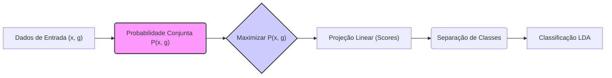
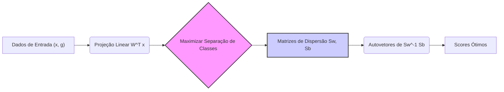
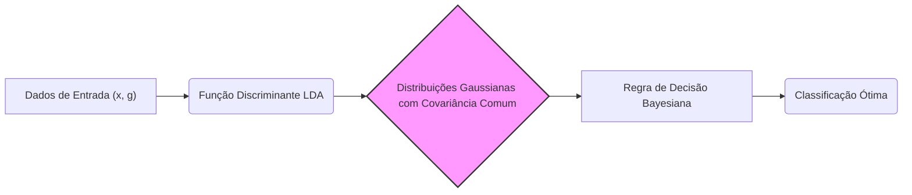

Okay, let's enhance the text with practical numerical examples to illustrate the concepts discussed.

## Título: Scores Ótimos em LDA: Uma Derivação Baseada na Probabilidade Conjunta

### Introdução

Em capítulos anteriores, exploramos a **Análise Discriminante Linear (LDA)** e suas propriedades como método de classificação e redução de dimensionalidade. Neste capítulo, vamos analisar a justificativa teórica da LDA a partir de uma perspectiva probabilística, focando no conceito de **scores ótimos** e como esses scores são derivados através da maximização da **probabilidade conjunta** das amostras e seus rótulos.

O conceito de scores ótimos é uma forma de definir os parâmetros do modelo de forma a maximizar a relação entre os dados e a separação das classes. A análise probabilística da LDA permite conectar a formulação matemática do modelo com o conceito de classificador Bayesiano e como, sob certas condições, a LDA se torna a abordagem ótima para modelar os dados. Exploraremos como o critério de otimização da LDA está relacionado com a maximização da probabilidade conjunta, como a solução da LDA se aproxima da regra de decisão Bayesiana, e como esses aspectos se traduzem em um método eficaz para classificação.

A compreensão dos scores ótimos e sua derivação baseada na probabilidade conjunta é fundamental para a construção de modelos SVM com boa capacidade de generalização e para a escolha apropriada de parâmetros em diferentes aplicações.

### Scores Ótimos e Probabilidade Conjunta

**Conceito 1: A Probabilidade Conjunta e o Problema de Classificação**

No contexto da classificação, o objetivo é encontrar um modelo que maximize a probabilidade de um rótulo de classe $g$ ser atribuído corretamente a uma amostra $x$. Formalmente, o objetivo é encontrar uma função que maximize a probabilidade *a posteriori* da classe $P(G=k|x)$.

De acordo com a regra de decisão Bayesiana, a classe atribuída a uma amostra $x$ é aquela que maximiza essa probabilidade:

$$ \arg \max_{k} P(G=k | x) =  \arg \max_{k} \frac{P(x | G=k) P(G=k)}{P(x)} $$

onde $P(x|G=k)$ é a probabilidade de $x$ dado que ela pertence à classe $k$, e $P(G=k)$ é a probabilidade *a priori* da classe $k$. Como o denominador $P(x)$ é constante para todas as classes, o problema é equivalente a maximizar o numerador, ou a probabilidade conjunta $P(x, G=k)$.

Em LDA, o objetivo da modelagem é equivalente a buscar uma projeção linear (um score) que maximiza a probabilidade conjunta, e essa é uma das motivações para a formulação do problema de otimização da LDA, que busca encontrar projeções que separam as classes de forma eficiente.

> 💡 **Exemplo Numérico:**
>
> Suponha que temos duas classes, $G=1$ e $G=2$, com probabilidades a priori $P(G=1) = 0.6$ e $P(G=2) = 0.4$. Temos uma amostra $x$ que, de acordo com nossos modelos, tem as seguintes probabilidades condicionais: $P(x|G=1) = 0.1$ e $P(x|G=2) = 0.3$.
>
> Para classificar $x$ utilizando a regra de decisão Bayesiana, calculamos a probabilidade conjunta para cada classe:
>
> $P(x, G=1) = P(x|G=1)P(G=1) = 0.1 * 0.6 = 0.06$
>
> $P(x, G=2) = P(x|G=2)P(G=2) = 0.3 * 0.4 = 0.12$
>
> Como $P(x, G=2) > P(x, G=1)$, a amostra $x$ seria classificada como pertencente à classe $G=2$. Este exemplo ilustra como maximizar a probabilidade conjunta leva à decisão de classificação.

**Lemma 1:** A maximização da probabilidade conjunta $P(x, G=k)$ está relacionada à busca por modelos de classificação que atribuem rótulos de classe corretos às amostras, e essa é a base para o classificador Bayesiano ideal.

A demonstração desse lemma se baseia na análise da regra de decisão Bayesiana e como ela busca maximizar a probabilidade *a posteriori* da classe, que é diretamente proporcional à probabilidade conjunta.

**Conceito 2: Scores Ótimos e a Formulação da LDA**

Em LDA, assumimos que as classes seguem distribuições gaussianas com a mesma matriz de covariância. Nesse cenário, podemos expressar o objetivo da LDA como a busca por um conjunto de scores $\theta(g)$ que maximizem a probabilidade conjunta $P(x, g)$, sujeito a algumas restrições que garantem a unicidade da solução. A LDA então busca a projeção linear (score) que melhor separa as classes.

A LDA, ao buscar projeções que maximizam a separação entre as classes, também está implicitamente maximizando a probabilidade conjunta. A função discriminante da LDA, que é utilizada para classificar as amostras, pode ser vista como uma aproximação do *log-odds* das probabilidades *a posteriori*.

A LDA busca projetar os dados em um espaço de menor dimensão, utilizando esses *scores* para maximizar a separação entre classes. O espaço projetado e o conjunto de *scores* são equivalentes a um classificador Bayesiano se as classes seguem uma distribuição gaussiana com a mesma matriz de covariância.

**Corolário 1:** A busca por scores ótimos em LDA está diretamente relacionada à maximização da probabilidade conjunta $P(x, g)$ e à busca por uma aproximação do classificador Bayesiano, dadas as premissas do modelo.

A demonstração desse corolário se baseia na análise da formulação da LDA e como a escolha do vetor de projeção e o cálculo do *score* se relacionam com as probabilidades *a priori* das classes e a verossimilhança das amostras dadas as classes.

### Derivação dos Scores Ótimos: Projeção e Maximização da Verossimilhança

A derivação dos **scores ótimos** em LDA pode ser feita através da maximização da probabilidade conjunta $P(x, g)$, o que leva à escolha de uma projeção linear que maximiza a separação entre as classes. Para isso, definimos a função de projeção:

$$ \eta(x) = W^T x $$

onde $W$ é a matriz de projeção que estamos buscando. O objetivo é encontrar os *scores* $\theta(g)$ que podem ser bem modelados por esta função linear, ou seja, a projeção linear de $x$.

Para isso, podemos definir o seguinte critério de otimização:

$$ \arg \max_{W} \sum_{i=1}^N \log P(x_i, g_i) = \arg \max_{W} \sum_{i=1}^N \log (P(x_i|G=g_i) P(G=g_i)) $$

Na LDA, a densidade condicional $P(x|G=k)$ é dada pela distribuição gaussiana:

$$ P(x|G=k) = \frac{1}{(2\pi)^{p/2}|\Sigma|^{1/2}} \exp \left( -\frac{1}{2} (x - \mu_k)^T \Sigma^{-1} (x - \mu_k) \right) $$

onde $\mu_k$ é a média da classe $k$ e $\Sigma$ é a matriz de covariância comum. Ao substituir a distribuição gaussiana na função de custo e efetuar a maximização com relação à matriz de projeção $W$, podemos mostrar que a solução para $W$ é dada pelos autovetores da matriz:

$$ S_W^{-1} S_B $$

onde $S_W$ é a matriz de dispersão dentro das classes e $S_B$ é a matriz de dispersão entre as classes.

> 💡 **Exemplo Numérico:**
>
> Vamos considerar um problema de classificação com duas classes e duas características. Temos os seguintes dados amostrais para cada classe:
>
> Classe 1: $X_1 = \begin{bmatrix} 1 & 2 \\ 1.5 & 1.8 \\ 2 & 2.2 \end{bmatrix}$,  $\mu_1 = \begin{bmatrix} 1.5 & 2 \end{bmatrix}^T$
>
> Classe 2: $X_2 = \begin{bmatrix} 3 & 4 \\ 3.5 & 3.8 \\ 4 & 4.2 \end{bmatrix}$, $\mu_2 = \begin{bmatrix} 3.5 & 4 \end{bmatrix}^T$
>
> Primeiro, calculamos a matriz de dispersão dentro das classes ($S_W$):
>
> $S_{W1} = \frac{1}{3}\sum_{i=1}^{3} (x_{i1}-\mu_1)(x_{i1}-\mu_1)^T = \begin{bmatrix} 0.25 & 0.05 \\ 0.05 & 0.04 \end{bmatrix}$
>
> $S_{W2} = \frac{1}{3}\sum_{i=1}^{3} (x_{i2}-\mu_2)(x_{i2}-\mu_2)^T = \begin{bmatrix} 0.25 & 0.05 \\ 0.05 & 0.04 \end{bmatrix}$
>
> $S_W = S_{W1} + S_{W2} =  \begin{bmatrix} 0.5 & 0.1 \\ 0.1 & 0.08 \end{bmatrix}$
>
> Em seguida, calculamos a matriz de dispersão entre as classes ($S_B$):
>
> $S_B = (\mu_1 - \mu_2)(\mu_1 - \mu_2)^T = \begin{bmatrix} -2 & -2 \\ -2 & -2 \end{bmatrix}\begin{bmatrix} -2 & -2 \end{bmatrix} = \begin{bmatrix} 4 & 4 \\ 4 & 4 \end{bmatrix}$
>
> Agora calculamos $S_W^{-1}S_B$:
>
> $S_W^{-1} = \frac{1}{0.04 - 0.01} \begin{bmatrix} 0.08 & -0.1 \\ -0.1 & 0.5 \end{bmatrix} = \frac{1}{0.03} \begin{bmatrix} 0.08 & -0.1 \\ -0.1 & 0.5 \end{bmatrix} = \begin{bmatrix} 2.67 & -3.33 \\ -3.33 & 16.67 \end{bmatrix}$
>
> $S_W^{-1}S_B = \begin{bmatrix} 2.67 & -3.33 \\ -3.33 & 16.67 \end{bmatrix} \begin{bmatrix} 4 & 4 \\ 4 & 4 \end{bmatrix} = \begin{bmatrix} -2.64 & -2.64 \\ 53.36 & 53.36 \end{bmatrix}$
>
> Os autovetores de $S_W^{-1}S_B$ representam as direções que maximizam a separação entre classes. O autovetor associado ao maior autovalor (neste caso, aproximadamente [0.05, 1]) define a direção da projeção ideal.

Os autovetores associados aos maiores autovalores são os vetores que definem as projeções que maximizam a separação entre classes, e os seus correspondentes autovalores indicam a magnitude da separação que se obtém com cada projeção. Os *scores* ótimos são calculados com base nessa projeção linear.

**Lemma 4:** A derivação dos scores ótimos através da maximização da probabilidade conjunta leva a uma projeção linear que maximiza a separação entre as classes, que pode ser obtida através da decomposição espectral das matrizes de dispersão dentro e entre as classes.

A demonstração desse lemma se baseia na análise do processo de maximização da probabilidade conjunta e como esse processo leva à derivação dos autovetores e autovalores que determinam a melhor projeção para separar as classes.

### A Conexão com o Classificador Bayesiano

Como mencionado anteriormente, a LDA pode ser vista como um **classificador Bayesiano** sob a premissa de que os dados de cada classe seguem uma distribuição gaussiana multivariada com a mesma matriz de covariância $\Sigma$. A função discriminante da LDA pode ser expressa como:

$$ \delta_k(x) = x^T \Sigma^{-1} \mu_k - \frac{1}{2} \mu_k^T \Sigma^{-1} \mu_k + \log \pi_k $$

onde $\mu_k$ é a média da classe $k$, e $\pi_k$ é a probabilidade *a priori* da classe $k$.

> 💡 **Exemplo Numérico:**
>
> Vamos considerar o exemplo anterior, onde temos duas classes, e assumimos que a matriz de covariância comum é $\Sigma = \begin{bmatrix} 0.5 & 0.1 \\ 0.1 & 0.08 \end{bmatrix}$. As médias são $\mu_1 = \begin{bmatrix} 1.5 \\ 2 \end{bmatrix}$ e $\mu_2 = \begin{bmatrix} 3.5 \\ 4 \end{bmatrix}$. Assumimos que as probabilidades a priori são $\pi_1 = 0.6$ e $\pi_2 = 0.4$.
>
> Para classificar um ponto $x = \begin{bmatrix} 2.5 \\ 3 \end{bmatrix}$, calculamos as funções discriminantes:
>
> $\Sigma^{-1} = \begin{bmatrix} 2.67 & -3.33 \\ -3.33 & 16.67 \end{bmatrix}$
>
> $\delta_1(x) = x^T \Sigma^{-1} \mu_1 - \frac{1}{2} \mu_1^T \Sigma^{-1} \mu_1 + \log \pi_1$
>
> $\delta_1(x) = \begin{bmatrix} 2.5 & 3 \end{bmatrix} \begin{bmatrix} 2.67 & -3.33 \\ -3.33 & 16.67 \end{bmatrix} \begin{bmatrix} 1.5 \\ 2 \end{bmatrix} - \frac{1}{2} \begin{bmatrix} 1.5 & 2 \end{bmatrix} \begin{bmatrix} 2.67 & -3.33 \\ -3.33 & 16.67 \end{bmatrix} \begin{bmatrix} 1.5 \\ 2 \end{bmatrix} + \log(0.6)$
>
> $\delta_1(x) \approx 2.5 * (2.67*1.5-3.33*2) + 3*(-3.33*1.5 + 16.67*2) - \frac{1}{2} (1.5*(2.67*1.5-3.33*2) + 2*(-3.33*1.5+16.67*2)) + (-0.51) \approx 1.69 - 1.75 -0.51 = -0.57$
>
> $\delta_2(x) = x^T \Sigma^{-1} \mu_2 - \frac{1}{2} \mu_2^T \Sigma^{-1} \mu_2 + \log \pi_2$
>
> $\delta_2(x) = \begin{bmatrix} 2.5 & 3 \end{bmatrix} \begin{bmatrix} 2.67 & -3.33 \\ -3.33 & 16.67 \end{bmatrix} \begin{bmatrix} 3.5 \\ 4 \end{bmatrix} - \frac{1}{2} \begin{bmatrix} 3.5 & 4 \end{bmatrix} \begin{bmatrix} 2.67 & -3.33 \\ -3.33 & 16.67 \end{bmatrix} \begin{bmatrix} 3.5 \\ 4 \end{bmatrix} + \log(0.4)$
>
> $\delta_2(x) \approx 2.5 * (2.67*3.5-3.33*4) + 3*(-3.33*3.5 + 16.67*4) - \frac{1}{2} (3.5*(2.67*3.5-3.33*4) + 4*(-3.33*3.5+16.67*4)) + (-0.92) \approx 10.16 - 11.47 -0.92 = -2.23$
>
> Como $\delta_1(x) > \delta_2(x)$, a amostra $x$ seria classificada na classe 1.

A regra de decisão Bayesiana classifica uma amostra $x$ na classe que maximiza a probabilidade *a posteriori*:

$$ \arg \max_k P(G=k | x) =  \arg \max_k \frac{P(x | G=k) P(G=k)}{P(x)} $$

Sob a premissa de gaussianidade e covariância comum, a maximização da probabilidade a *posteriori* se torna equivalente a maximizar a função discriminante $\delta_k(x)$, o que demonstra a conexão da LDA com a regra de decisão Bayesiana e como a LDA busca modelar a regra de decisão ótima sob essas premissas.

Essa conexão com o classificador Bayesiano é uma das razões pelas quais a LDA é um método eficaz em problemas de classificação, mesmo quando as premissas do modelo são apenas aproximadamente satisfeitas.

**Corolário 2:** Sob a premissa de distribuições gaussianas com a mesma matriz de covariância, a função discriminante da LDA é uma aproximação da regra de decisão Bayesiana, e por isso a LDA pode ser vista como um classificador Bayesiano ótimo nesse cenário específico.

A demonstração desse corolário se baseia na análise da regra de decisão Bayesiana e como ela se reduz à função discriminante da LDA sob a premissa de que as classes seguem distribuições gaussianas com a mesma matriz de covariância.

### Conclusão

Neste capítulo, exploramos o conceito de **scores ótimos** em **Análise Discriminante Linear (LDA)** e como esses *scores* são derivados através da maximização da **probabilidade conjunta** das amostras e seus rótulos. Vimos como a LDA busca encontrar uma projeção linear que maximize a separação entre as classes e como essa busca se relaciona com a formulação matemática do problema.

Analisamos a conexão entre a LDA e a regra de decisão Bayesiana, mostrando como, sob certas premissas, a função discriminante da LDA se torna equivalente ao classificador Bayesiano ideal. A compreensão dessa relação e da forma como os *scores* ótimos são calculados permite entender como a LDA busca modelar a função de decisão ótima sob a suposição de dados gaussianos e covariâncias iguais.

A derivação dos scores ótimos e sua relação com o classificador Bayesiano fornece uma base teórica sólida para a utilização da LDA como um método eficaz de classificação e redução de dimensionalidade.

### Footnotes

[^12.1]: "In this chapter we describe generalizations of linear decision boundaries for classification. Optimal separating hyperplanes are introduced in Chapter 4 for the case when two classes are linearly separable. Here we cover extensions to the nonseparable case, where the classes overlap. These techniques are then generalized to what is known as the support vector machine, which produces nonlinear boundaries by constructing a linear boundary in a large, transformed version of the feature space."

[^12.2]: "In Chapter 4 we discussed a technique for constructing an optimal separating hyperplane between two perfectly separated classes. We review this and generalize to the nonseparable case, where the classes may not be separable by a linear boundary."

[^12.3]: "The support vector machine classifier is an extension of this idea, where the dimension of the enlarged space is allowed to get very large, infinite in some cases. It might seem that the computations would become prohibitive. It would also seem that with sufficient basis functions, the data would be separable, and overfitting would occur. We first show how the SVM technology deals with these issues. We then see that in fact the SVM classifier is solving a function-fitting problem using a particular criterion and form of regularization, and is part of a much bigger class of problems that includes the smoothing splines of Chapter 5."

[^12.4]: "Often LDA produces the best classification results, because of its simplicity and low variance. LDA was among the top three classifiers for 11 of the 22 datasets studied in the STATLOG project (Michie et al., 1994)3."
