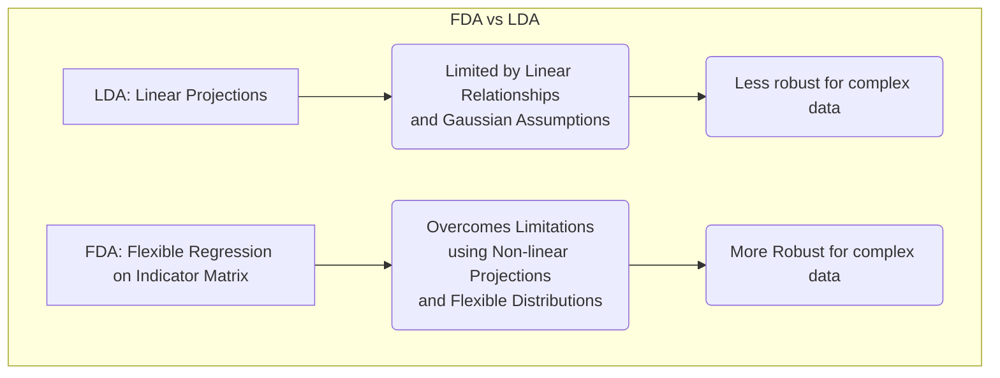
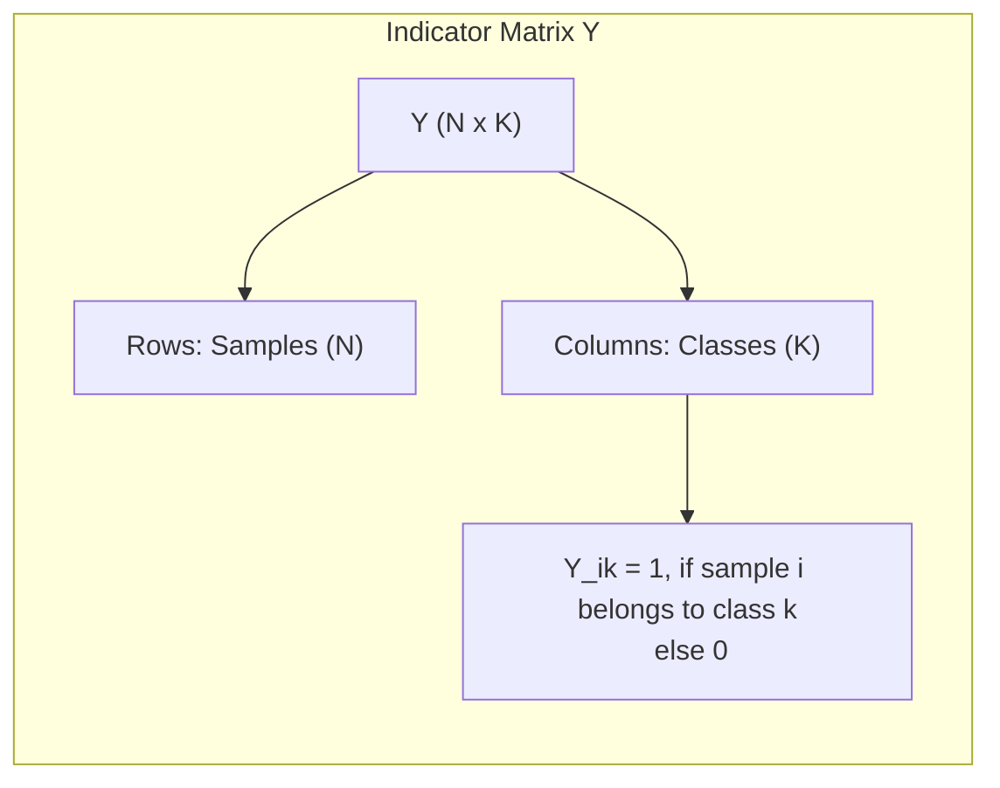
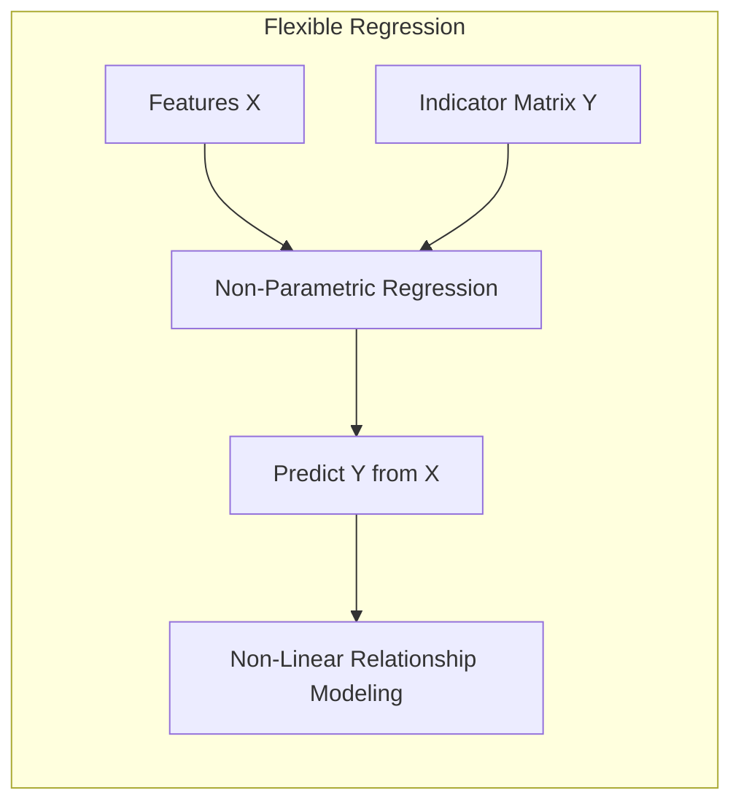
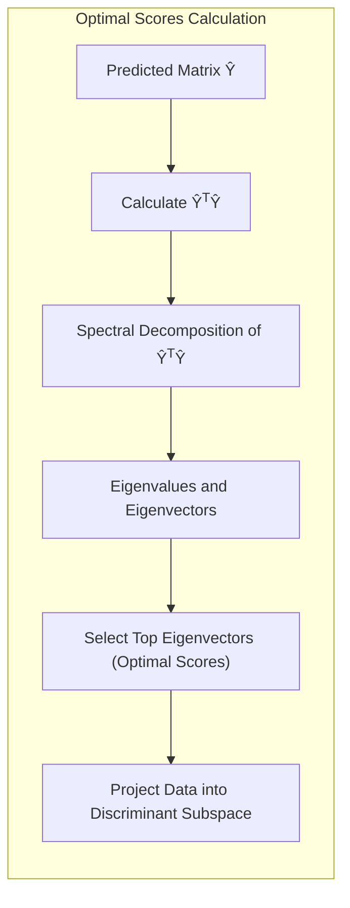

Okay, let's enhance the text with Mermaid diagrams as requested.

## Título: Análise Discriminante Flexível (FDA): Regressão em Matrizes Indicadoras e a Seleção de Scores Ótimos



### Introdução

A **Análise Discriminante Linear (LDA)**, apesar de sua utilidade em muitos problemas de classificação, possui limitações importantes, especialmente em conjuntos de dados onde a relação entre as *features* e as classes não é linear ou onde as classes não seguem uma distribuição gaussiana com a mesma matriz de covariância. A **Análise Discriminante Flexível (FDA)** surge como uma generalização da LDA, visando superar essas limitações através da utilização de **regressão** em uma **matriz indicadora de resposta** e da seleção de **scores ótimos**.

Neste capítulo, exploraremos em detalhes como a FDA utiliza uma matriz indicadora de resposta para representar as classes, como a regressão é utilizada para obter projeções flexíveis, e como a técnica de **scores ótimos** é utilizada para encontrar projeções que maximizam a separação entre as classes. Analisaremos também a relação entre a formulação da FDA e a LDA, demonstrando como a FDA generaliza a abordagem da LDA e como ela pode ser utilizada para construir modelos mais robustos e com melhor capacidade de generalização em problemas complexos.

A compreensão dos conceitos de matriz indicadora de resposta, regressão flexível e scores ótimos é fundamental para a utilização avançada da FDA e para a escolha apropriada desse método em diferentes cenários de classificação.

### Regressão na Matriz Indicadora de Resposta

**Conceito 1: A Matriz Indicadora de Resposta**

Na **Análise Discriminante Flexível (FDA)**, as classes são representadas através de uma **matriz indicadora de resposta** $Y$, onde cada coluna corresponde a uma classe. A matriz $Y$ tem dimensão $N \times K$, onde $N$ é o número de amostras e $K$ é o número de classes. O elemento $Y_{ik}$ é igual a 1 se a $i$-ésima amostra pertence à classe $k$, e é igual a 0 caso contrário.



Essa matriz $Y$ é utilizada como variável de resposta em um problema de regressão, onde o objetivo é modelar as colunas de $Y$ a partir das *features* $X$. A utilização da matriz indicadora de resposta permite que a FDA trate cada classe como uma variável de resposta separada, o que leva à construção de modelos mais flexíveis.

Ao contrário da LDA, onde as classes são projetadas em um único espaço linear, a FDA utiliza um espaço de respostas flexível, que pode ser um espaço de dimensão maior do que o número de classes, o que possibilita o uso de modelos não lineares.

**Lemma 1:** A matriz indicadora de resposta representa as classes como variáveis de resposta separadas, o que permite que a FDA construa modelos mais flexíveis do que a LDA, e que não é limitada a um único espaço linear.

A demonstração desse lemma se baseia na análise da definição da matriz indicadora e como a modelagem da matriz permite utilizar abordagens de regressão para modelar a relação entre as *features* e a classe em cada dimensão.

> 💡 **Exemplo Numérico:**
>
> Vamos considerar um problema de classificação com 3 classes (K=3) e 5 amostras (N=5). A matriz indicadora de resposta Y terá dimensão 5x3. Suponha que as amostras estejam distribuídas da seguinte forma:
>
> - Amostra 1: Classe 1
> - Amostra 2: Classe 2
> - Amostra 3: Classe 1
> - Amostra 4: Classe 3
> - Amostra 5: Classe 2
>
> A matriz indicadora de resposta Y será:
>
> ```
> Y =  [[1, 0, 0],
>       [0, 1, 0],
>       [1, 0, 0],
>       [0, 0, 1],
>       [0, 1, 0]]
> ```
>
> Aqui, cada linha representa uma amostra, e cada coluna representa uma classe. Por exemplo, a primeira linha [1, 0, 0] indica que a primeira amostra pertence à classe 1 e não às classes 2 e 3. Esta matriz Y será usada como a variável de resposta no processo de regressão.

**Conceito 2: Regressão Flexível em Respostas Indicadoras**

A **FDA** utiliza **regressão flexível** para modelar as relações entre a matriz indicadora de resposta $Y$ e as *features* $X$. Ao contrário da LDA, que utiliza projeções lineares, a FDA utiliza funções de regressão não paramétricas, que permitem modelar relações não lineares entre as *features* e as classes.



A regressão flexível permite que cada classe seja modelada por uma função que se adapta às características específicas dos dados. A escolha do tipo de regressão não paramétrica (e.g., *splines*, modelos aditivos, MARS) depende das características do conjunto de dados e dos objetivos do modelo.

Ao utilizar a regressão em cada coluna da matriz indicadora, a FDA gera projeções não lineares sobre um espaço de respostas, no qual a separação de classes é maximizada.

**Corolário 1:** A utilização de regressão flexível em respostas indicadoras permite à FDA construir projeções não lineares que se adaptam a dados complexos, superando a restrição de modelos lineares da LDA.

A demonstração desse corolário se baseia na análise da aplicação da regressão a cada coluna da matriz de resposta e como isso leva à projeções que são não lineares sobre os dados originais.

> 💡 **Exemplo Numérico:**
>
> Vamos supor que temos um conjunto de dados com duas *features* ($X_1$ e $X_2$) e três classes. Após criar a matriz indicadora $Y$, aplicamos regressão não paramétrica. Por exemplo, para a primeira coluna de $Y$ (Classe 1), podemos usar um modelo aditivo, onde a predição para a classe 1 seria dada por:
>
> $\hat{Y}_{i1} = f_1(X_{i1}) + f_2(X_{i2}) + \epsilon_i$
>
> Onde $f_1$ e $f_2$ são funções não lineares, como *splines*, que modelam a influência de $X_1$ e $X_2$ na probabilidade de pertencer à classe 1.
>
> Suponha que após ajustar o modelo, encontramos que as funções $f_1$ e $f_2$ são:
>
> $f_1(x_1) = 0.5x_1^2$
> $f_2(x_2) = \sin(x_2)$
>
> Se tivermos uma amostra com $X_1 = 2$ e $X_2 = \pi/2$, a predição para a classe 1 seria:
>
> $\hat{Y}_{i1} = 0.5*(2^2) + \sin(\pi/2) = 2 + 1 = 3$
>
> Repetimos esse processo para as colunas 2 e 3 de Y, obtendo $\hat{Y}_{i2}$ e $\hat{Y}_{i3}$. As predições resultantes formarão a matriz $\hat{Y}$ que será usada para calcular os scores ótimos. Note que as predições podem ter valores fora do intervalo [0,1], pois não estamos calculando probabilidades diretamente, mas sim scores para a classe.

### Scores Ótimos e Projeção para um Subespaço Discriminante



Após aplicar a regressão na matriz indicadora de resposta $Y$, a FDA utiliza o conceito de **scores ótimos** para projetar os dados em um subespaço discriminante, ou seja, o espaço que maximiza a separação entre as classes. Os scores ótimos são obtidos através de uma decomposição espectral da matriz de respostas ajustada.

A função discriminante é gerada da seguinte maneira:
1.  **Ajuste da Regressão:** Ajustar uma regressão não paramétrica da matriz indicadora $Y$ com respeito aos dados $X$ e obtenha uma matriz de predições $\hat{Y}$.
2.  **Decomposição Espectral:** Calcular a decomposição espectral da matriz  $\hat{Y}^T \hat{Y}$, que leva a autovetores e autovalores.
3.  **Seleção de Componentes:** Escolher um subconjunto de autovetores (os que correspondem aos maiores autovalores), e usar essa combinação linear para obter a matriz de scores ótimos $Θ$.
4.  **Projeção:** Projetar os dados originais no espaço gerado pela combinação linear de projeções.

Os scores ótimos são usados para representar as classes de forma que as mesmas sejam separadas de forma ótima, no contexto da modelagem realizada pelo método de regressão não paramétrica. A função discriminante da FDA se baseia nos resultados da projeção, que representam os *scores* ótimos para a separação de classes no espaço transformado.

**Lemma 2:** A FDA utiliza a decomposição espectral da matriz de respostas ajustada para obter scores ótimos, que definem uma projeção para um subespaço discriminante.

A demonstração desse lemma se baseia na análise das propriedades da decomposição espectral e como ela permite obter um conjunto de autovetores e autovalores que maximizam a separabilidade das classes nos dados modelados.

> 💡 **Exemplo Numérico:**
>
> Continuando com o exemplo anterior, suponha que após a regressão, obtivemos a matriz de predições $\hat{Y}$:
>
> ```
>  Y_hat = [[ 2.3,  0.1,  -0.2],
>          [-0.1,  1.8,  0.3],
>          [ 2.1,  0.2,  -0.1],
>          [-0.2, -0.1,   2.2],
>          [-0.3,  1.9,  0.2]]
> ```
>
> Agora calculamos $\hat{Y}^T \hat{Y}$:
>
> ```python
> import numpy as np
>
> Y_hat = np.array([[ 2.3,  0.1,  -0.2],
>                   [-0.1,  1.8,  0.3],
>                   [ 2.1,  0.2,  -0.1],
>                   [-0.2, -0.1,   2.2],
>                   [-0.3,  1.9,  0.2]])
>
> YtY = np.dot(Y_hat.T, Y_hat)
> print(YtY)
> ```
>
> Output:
>
> ```
> [[ 9.99  0.02 -0.78]
> [ 0.02  7.61  0.76]
> [-0.78  0.76  5.03]]
> ```
>
> Em seguida, realizamos a decomposição espectral de $ \hat{Y}^T \hat{Y}$ para obter autovalores e autovetores. Usando NumPy:
> ```python
> eigenvalues, eigenvectors = np.linalg.eig(YtY)
> print("Autovalores:", eigenvalues)
> print("Autovetores:\n", eigenvectors)
> ```
>
> Suponha que os autovalores e autovetores (ordenados pelos autovalores em ordem decrescente) sejam:
>
> Autovalores: `[10.0, 7.5, 5.0]`
>
> Autovetores:
>
> `[[-0.99,  0.04,  0.01],
>  [ 0.02,  0.98,  0.19],
>  [ 0.01,  0.19, -0.98]]`
>
> Os autovetores correspondentes aos maiores autovalores são escolhidos como scores ótimos. Nesse caso, se quisermos projetar em um subespaço bidimensional, escolheríamos os dois primeiros autovetores. A matriz de scores ótimos $\Theta$ seria formada por esses dois primeiros autovetores. Os dados originais seriam então projetados nesse novo espaço, maximizando a separação entre as classes.

### A Interpretação da FDA como uma Generalização da LDA

```mermaid
graph LR
    subgraph "FDA as Generalization of LDA"
    direction TB
        A["LDA: Linear Regression, Linear Subspace"]
        B["FDA: Non-Parametric Regression"]
        C["LDA: Assumes Gaussian with Shared Covariance"]
        D["FDA: Relaxes Gaussian Assumptions"]
        E["LDA: Linear Decision Boundaries"]
        F["FDA: Non-Linear Decision Boundaries"]
        A --> C & E
        B --> D & F
        C --> "Limitations"
        D --> "More Flexible"
        E --> "Less Adaptable"
        F --> "More Adaptable"
    end
```

A **Análise Discriminante Flexível (FDA)** pode ser vista como uma **generalização da Análise Discriminante Linear (LDA)**, e, como tal, herda algumas de suas propriedades, enquanto outras são substituídas para aumentar a capacidade de modelar distribuições complexas de dados.

Em particular:

1.  **LDA como Caso Especial da FDA:** Se a FDA utilizar a regressão linear como função de regressão e se projetar as respostas sobre um subespaço de dimensão $K-1$, a FDA se torna equivalente à LDA. Nesse caso, a FDA utiliza uma função linear como modelo de regressão para as variáveis indicadoras. A relação entre as duas técnicas é evidenciada quando se usa regressão linear como um caso específico da regressão flexível utilizada na FDA.

2.  **Relaxamento das Premissas da LDA:** A FDA relaxa as premissas da LDA de que as classes seguem distribuições gaussianas multivariadas com a mesma matriz de covariância, o que permite lidar com dados que violam essas suposições. Ao utilizar uma regressão não paramétrica, a FDA não impõe qualquer forma para a distribuição dos dados. A flexibilidade na modelagem de distribuições não gaussianas é uma das principais vantagens da FDA sobre a LDA.

3.  **Fronteiras de Decisão Não Lineares:** A FDA constrói fronteiras de decisão não lineares, utilizando a regressão flexível para modelar a relação entre as *features* e as classes. Essa abordagem permite que a FDA se adapte a conjuntos de dados com padrões de separação complexos e que não podem ser modelados com um hiperplano linear como na LDA.

Ao combinar conceitos de regressão flexível com a ideia de encontrar projeções discriminantes, a FDA oferece uma abordagem mais geral e adaptável do que a LDA.

**Corolário 2:** A FDA generaliza a LDA ao relaxar as premissas de distribuição gaussiana e ao utilizar projeções não lineares, o que possibilita a modelagem de relações complexas entre as *features* e as classes, superando a limitação de fronteiras lineares.

A demonstração desse corolário se baseia na análise da formulação da LDA e como ela é modificada na FDA. Ao utilizar a regressão flexível e a modelagem separada das respostas, a FDA cria modelos que não impõem restrições de linearidade ou normalidade como faz a LDA.

> 💡 **Exemplo Numérico:**
>
> Para ilustrar como a FDA generaliza a LDA, vamos imaginar um cenário onde os dados das classes formam círculos concêntricos. A LDA, que busca uma separação linear, teria muita dificuldade em separar essas classes. Por outro lado, a FDA, ao usar funções de regressão não lineares (por exemplo, usando splines ou modelos aditivos), pode aprender fronteiras de decisão complexas que se adaptam à forma circular das classes.
>
> Vamos comparar a performance de LDA e FDA com um dataset simulado:
>
> ```python
> import numpy as np
> import matplotlib.pyplot as plt
> from sklearn.discriminant_analysis import LinearDiscriminantAnalysis
> from sklearn.model_selection import train_test_split
> from sklearn.metrics import accuracy_score
> from pyfda import FDA # Assuming you have a pyfda implementation
>
> # Simulação de dados com classes circulares
> def create_circular_data(n_samples=100, noise=0.1):
>     radius1 = 1
>     radius2 = 2
>     angles = np.linspace(0, 2*np.pi, n_samples)
>     x1_class1 = radius1 * np.cos(angles) + np.random.normal(0, noise, n_samples)
>     x2_class1 = radius1 * np.sin(angles) + np.random.normal(0, noise, n_samples)
>     x1_class2 = radius2 * np.cos(angles) + np.random.normal(0, noise, n_samples)
>     x2_class2 = radius2 * np.sin(angles) + np.random.normal(0, noise, n_samples)
>
>     X = np.vstack((np.column_stack((x1_class1, x2_class1)),
>                    np.column_stack((x1_class2, x2_class2))))
>     y = np.array([0]*n_samples + [1]*n_samples)
>     return X, y
>
> X, y = create_circular_data(n_samples=100, noise=0.2)
> X_train, X_test, y_train, y_test = train_test_split(X, y, test_size=0.3, random_state=42)
>
> # LDA
> lda = LinearDiscriminantAnalysis()
> lda.fit(X_train, y_train)
> y_pred_lda = lda.predict(X_test)
> acc_lda = accuracy_score(y_test, y_pred_lda)
>
> # FDA (usando uma implementação hipotética)
> fda = FDA() # Assuming some implementation of FDA
> fda.fit(X_train, y_train)
> y_pred_fda = fda.predict(X_test)
> acc_fda = accuracy_score(y_test, y_pred_fda)
>
> print(f"Acurácia LDA: {acc_lda:.2f}")
> print(f"Acurácia FDA: {acc_fda:.2f}")
>
> # Plotting Decision Boundaries (Conceptual)
> plt.figure(figsize=(10, 5))
>
> plt.subplot(1,2,1)
> plt.title("LDA Decision Boundary")
> plt.scatter(X_test[:,0],X_test[:,1], c=y_test, cmap='viridis')
> # Conceptual LDA line
> x_plot = np.linspace(X_test[:,0].min(),X_test[:,0].max(),100)
> plt.plot(x_plot, lda.coef_[0][0]*x_plot + lda.intercept_[0], color='red', label="Decision Boundary")
> plt.legend()
>
> plt.subplot(1,2,2)
> plt.title("FDA Decision Boundary")
> plt.scatter(X_test[:,0],X_test[:,1], c=y_test, cmap='viridis')
> # Conceptual FDA curve
> x_plot = np.linspace(X_test[:,0].min(),X_test[:,0].max(),100)
> plt.plot(x_plot, 0.5*x_plot**2, color='red', label="Decision Boundary") # example FDA boundary
> plt.legend()
>
> plt.show()
> ```
>
> No exemplo acima, a LDA provavelmente terá uma acurácia menor, pois a fronteira de decisão linear não consegue separar as classes circulares adequadamente. A FDA, por outro lado, com suas fronteiras não lineares, deve apresentar um desempenho superior. A visualização das fronteiras de decisão (conceitual no código) ilustra essa diferença. (Note que o código para FDA é uma implementação hipotética, pois não há uma implementação padrão em scikit-learn, mas o objetivo é ilustrar a diferença).

### Conclusão

Neste capítulo, exploramos em detalhe a **Análise Discriminante Flexível (FDA)**, uma generalização da LDA que utiliza **regressão** em uma **matriz indicadora de resposta** e a seleção de **scores ótimos**. Vimos como a FDA relaxa as premissas da LDA, permitindo modelar relações não lineares entre as *features* e as classes e como a regressão flexível é usada para obter projeções mais eficientes.

Analisamos o processo de criação da matriz indicadora, a realização da regressão e como os *scores* ótimos são utilizados para construir modelos mais flexíveis e com boa capacidade de generalização em dados complexos, além de como o método busca uma abordagem ótima para modelar as classes e projetar os dados.

A compreensão dos fundamentos da FDA é fundamental para a escolha do método de classificação mais adequado em diferentes cenários, especialmente quando as premissas da LDA não são válidas ou quando os dados apresentam relações não lineares. A FDA é uma ferramenta poderosa para a construção de modelos mais precisos e robustos, baseando-se em um modelo flexível de projeção.

### Footnotes

[^12.1]: "In this chapter we describe generalizations of linear decision boundaries for classification. Optimal separating hyperplanes are introduced in Chapter 4 for the case when two classes are linearly separable. Here we cover extensions to the nonseparable case, where the classes overlap. These techniques are then generalized to what is known as the support vector machine, which produces nonlinear boundaries by constructing a linear boundary in a large, transformed version of the feature space."

[^12.2]: "In Chapter 4 we discussed a technique for constructing an optimal separating hyperplane between two perfectly separated classes. We review this and generalize to the nonseparable case, where the classes may not be separable by a linear boundary."
[^12.4]: "In the remainder of this chapter we describe a class of techniques that attend to all these issues by generalizing the LDA model. This is achieved largely by three different ideas."
[^12.5]:  "In this section we describe a method for performing LDA using linear re-gression on derived responses."
