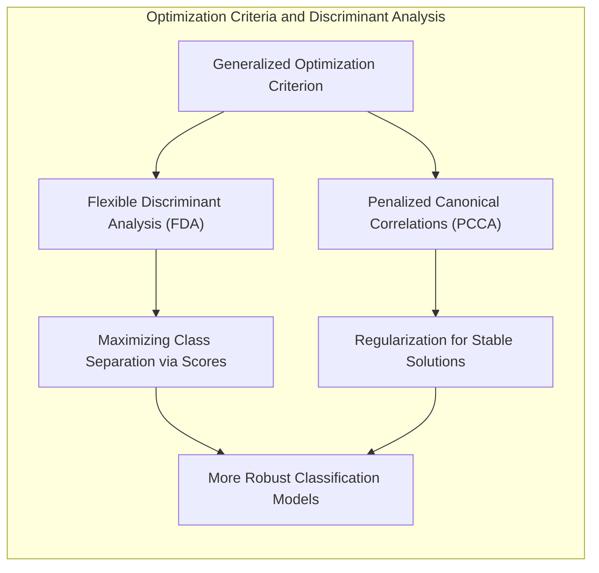
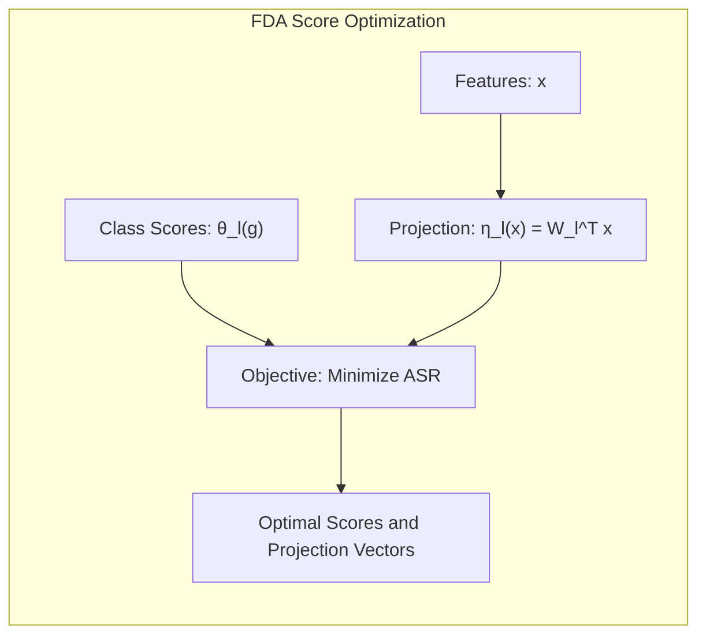
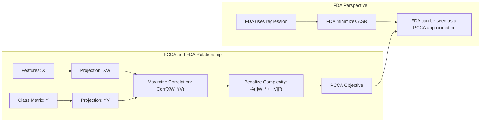
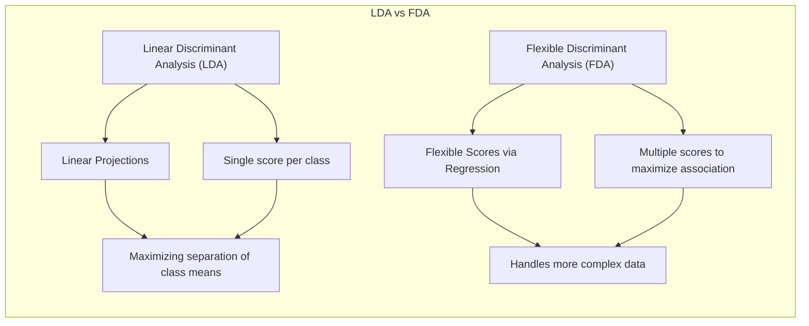

Okay, let's explore the connection between a **more general optimization criteria based on scores** and the link between **penalized canonical correlations** and **discriminant analysis**. This section will delve into the theoretical underpinnings of how FDA can be seen as a more flexible approach to finding optimal discriminant directions.

## Título: Scores Ótimos Generalizados e Análise Discriminante: Conexão com Correlações Canônicas Penalizadas



### Introdução

A **Análise Discriminante Linear (LDA)** e suas generalizações, como a **Análise Discriminante Flexível (FDA)**, buscam encontrar projeções que maximizem a separação entre as classes. A formulação da LDA se baseia na maximização da razão entre a dispersão entre classes e a dispersão dentro das classes, enquanto a FDA utiliza a regressão para encontrar *scores* ótimos que maximizem a relação entre as classes e as *features*. Neste capítulo, vamos explorar uma visão mais geral desse problema, utilizando um **critério de otimização baseado em scores**, e como esse critério se relaciona com o conceito de **correlações canônicas penalizadas**.

A conexão entre a FDA e as correlações canônicas penalizadas oferece uma perspectiva teórica mais profunda sobre o funcionamento da FDA e como ela generaliza a LDA. Analisaremos como a utilização de scores permite que o modelo se adapte a diferentes tipos de dados e como a regularização é utilizada para obter soluções mais estáveis e com melhor capacidade de generalização. A compreensão dessas conexões é fundamental para o desenvolvimento e aplicação de métodos de classificação avançados.

### Um Critério de Otimização Generalizado Baseado em Scores

**Conceito 1: Scores e a Maximização da Relação entre Classes e Features**

Em muitos problemas de classificação, o objetivo é encontrar uma representação dos dados onde a separação entre as classes seja maximizada. Uma abordagem geral para esse problema é através da definição de **scores** para cada classe, e encontrar uma transformação dos dados que maximize a relação entre esses *scores* e as *features*. A relação entre os *scores* e as *features* pode ser medida como uma correlação ou qualquer medida de associação.

Formalmente, seja $\theta(g)$ um *score* associado à classe $g$, e seja $\eta(x)$ uma função que mapeia um vetor de *features* $x$ para um valor no espaço dos *scores*. O objetivo da otimização passa a ser:

$$ \max_{\eta, \theta} \text{Relação}(\theta(g), \eta(x)) $$

onde $\text{Relação}$ é uma função que mede a relação entre os *scores* e a função de mapeamento. Diferentes formas para a função $\text{Relação}$ levam a diferentes abordagens para a projeção das amostras.

> 💡 **Exemplo Numérico:**
>
> Suponha que temos duas classes, $g_1$ e $g_2$, e definimos seus scores como $\theta(g_1) = -1$ e $\theta(g_2) = 1$. Temos também duas features, $x_1$ e $x_2$, e queremos encontrar uma função $\eta(x) = w_1x_1 + w_2x_2$ que mapeie as features para o espaço de scores. O objetivo é encontrar os pesos $w_1$ e $w_2$ que maximizem a relação entre $\theta(g)$ e $\eta(x)$.
>
> Digamos que temos três amostras de cada classe:
>
> - Classe $g_1$: $x^{(1)} = [1, 2]$, $x^{(2)} = [2, 1]$, $x^{(3)} = [1, 1]$
> - Classe $g_2$: $x^{(4)} = [3, 4]$, $x^{(5)} = [4, 3]$, $x^{(6)} = [4, 4]$
>
> Vamos escolher pesos iniciais, por exemplo, $w = [0.5, 0.5]$. Calculamos então os valores de $\eta(x)$ para cada amostra:
>
> - $\eta(x^{(1)}) = 0.5 * 1 + 0.5 * 2 = 1.5$
> - $\eta(x^{(2)}) = 0.5 * 2 + 0.5 * 1 = 1.5$
> - $\eta(x^{(3)}) = 0.5 * 1 + 0.5 * 1 = 1.0$
> - $\eta(x^{(4)}) = 0.5 * 3 + 0.5 * 4 = 3.5$
> - $\eta(x^{(5)}) = 0.5 * 4 + 0.5 * 3 = 3.5$
> - $\eta(x^{(6)}) = 0.5 * 4 + 0.5 * 4 = 4.0$
>
> Agora, queremos ajustar $w$ para que $\eta(x)$ se aproxime dos scores $\theta(g)$. Se usarmos a correlação como a função `Relação`, o objetivo seria encontrar $w$ que maximize a correlação entre os valores de $\eta(x)$ e os scores $\theta(g)$. Este é o tipo de problema que FDA tenta resolver, buscando os pesos que melhor separam as classes no espaço de features transformado. Em uma iteração do algoritmo de FDA, os pesos seriam ajustados de forma a aproximar os valores de $\eta(x)$ dos scores.

**Lemma 1:** Um critério de otimização baseado em *scores* busca encontrar um espaço de representação dos dados onde a relação entre as classes e as *features* seja maximizada, e esta formulação oferece uma generalização de outros modelos de classificação.

A demonstração desse lemma se baseia na análise da definição do critério de otimização e como ele busca encontrar funções de *scores* e *features* que estejam relacionadas de forma ideal, de forma que o problema de classificação possa ser expresso em termos de uma função de mapeamento que esteja bem relacionada com as classes.

**Conceito 2: A FDA e a Maximização de Scores via Regressão**

A **Análise Discriminante Flexível (FDA)** utiliza o conceito de *scores* ótimos para generalizar a LDA. Como visto em capítulos anteriores, a FDA utiliza a regressão não paramétrica para modelar a relação entre as *features* e uma matriz de resposta indicadora, onde cada coluna indica a pertinência a uma dada classe.

A FDA também busca encontrar scores $\theta_l(g)$, para $l = 1, ..., L$, onde $L$ é o número de projeções discriminantes desejadas, de forma a maximizar a associação entre as classes e as *features*. Para isso, FDA utiliza uma projeção do espaço de *features* que é função de uma regressão:

$$ \eta_l(x) = W_l^T x $$

onde $W_l$ é um vetor de coeficientes a serem otimizados, que tem o papel de projetar as amostras no novo espaço de *features*. O objetivo da FDA é encontrar os scores $\theta_l(g)$ e os vetores de projeção $W_l$ que maximizem a relação entre os scores e as projeções dos dados, que é definido como a média do resíduo quadrado (ASR) que deve ser minimizada:

$$ \text{ASR} = \sum_{l=1}^{L} \sum_{i=1}^{N} (\theta_l(g_i) - \eta_l(x_i))^2 $$

Essa formulação mostra que a FDA, ao utilizar regressão, busca por um espaço de scores ótimos que melhor se relacionem com a projeção das amostras sobre um espaço transformado.



> 💡 **Exemplo Numérico:**
>
> Consideremos um problema de classificação com três classes ($g_1, g_2, g_3$) e duas *features* ($x_1, x_2$).  Vamos usar $L=1$ para simplificar, ou seja, queremos encontrar uma única projeção discriminante.
>
> Primeiro, criamos uma matriz de *scores* $\Theta$ onde cada linha representa uma amostra e cada coluna representa um score para cada classe. Para simplificar, vamos usar uma codificação one-hot para as classes. Se tivermos 6 amostras, com as 2 primeiras na classe $g_1$, as 2 seguintes em $g_2$ e as 2 últimas em $g_3$, a matriz $\Theta$ seria:
>
> ```
>  [[1, 0, 0],
>   [1, 0, 0],
>   [0, 1, 0],
>   [0, 1, 0],
>   [0, 0, 1],
>   [0, 0, 1]]
> ```
>
>  Para $L=1$, os scores seriam $\theta_1(g_1)$, $\theta_1(g_2)$ e $\theta_1(g_3)$. Podemos inicializar com valores simples, por exemplo, $\theta_1(g_1) = 1$, $\theta_1(g_2) = 2$, e $\theta_1(g_3) = 3$. A matriz de scores $\Theta$ é então:
>
> ```
>  [[1],
>   [1],
>   [2],
>   [2],
>   [3],
>   [3]]
> ```
>
> Suponha que temos os seguintes dados de *features* $X$:
>
> ```
> [[1, 2],
>  [1.5, 2.5],
>  [3, 4],
>  [3.5, 4.5],
>  [5, 6],
>  [5.5, 6.5]]
> ```
>
> A FDA busca encontrar $W_1 = [w_1, w_2]$ que minimize o ASR. Inicializamos com valores aleatórios, por exemplo, $W_1 = [0.5, 0.5]$. Calculamos $\eta_1(x_i) = W_1^T x_i$ para cada amostra:
>
> - $\eta_1(x_1) = 0.5*1 + 0.5*2 = 1.5$
> - $\eta_1(x_2) = 0.5*1.5 + 0.5*2.5 = 2.0$
> - $\eta_1(x_3) = 0.5*3 + 0.5*4 = 3.5$
> - $\eta_1(x_4) = 0.5*3.5 + 0.5*4.5 = 4.0$
> - $\eta_1(x_5) = 0.5*5 + 0.5*6 = 5.5$
> - $\eta_1(x_6) = 0.5*5.5 + 0.5*6.5 = 6.0$
>
>  Agora podemos calcular o ASR:
>
> $ASR = (1-1.5)^2 + (1-2)^2 + (2-3.5)^2 + (2-4)^2 + (3-5.5)^2 + (3-6)^2 = 0.25+1+2.25+4+6.25+9 = 22.75$
>
> O objetivo da FDA é iterativamente ajustar $W_1$ e os scores $\theta_l(g)$ para minimizar o ASR. Em cada iteração, a regressão é usada para ajustar os pesos $W_1$, buscando um espaço transformado onde os scores das classes se relacionem melhor com a projeção das amostras. Os valores dos scores podem ser ajustados também, para melhor se adequar à projeção.

**Corolário 1:** A FDA utiliza regressão para modelar a relação entre as classes e as *features*, e busca por scores que maximizam a associação entre esses dois espaços, o que se demonstra através da minimização do resíduo quadrado.

A demonstração desse corolário se baseia na análise da formulação da FDA e como a minimização da função de custo de regressão busca um espaço transformado onde os *scores* das classes e a projeção das *features* estão mais fortemente relacionadas.

### Correlações Canônicas Penalizadas e a FDA



A conexão entre a FDA e as **correlações canônicas penalizadas** oferece uma perspectiva teórica alternativa sobre a formulação da FDA. As correlações canônicas (CCA) buscam encontrar as relações lineares entre dois conjuntos de variáveis, por exemplo, entre as *features* $X$ e as classes $Y$. As correlações canônicas penalizadas (PCCA) adicionam um termo de penalização para controlar a complexidade das soluções, o que as torna mais estáveis e com melhor capacidade de generalização.

Em essência, a PCCA busca encontrar projeções para os dados $X$ e para a matriz de respostas $Y$ que maximizam a correlação entre os dois conjuntos de variáveis, ao mesmo tempo em que penaliza a complexidade dos modelos de projeção. A PCCA é formulada como:

$$ \max_{W, V} \text{Corr}(XW, YV) - \lambda (||W||^2 + ||V||^2) $$

onde $W$ e $V$ são as matrizes de projeção para $X$ e $Y$, respectivamente, e $\lambda$ é um parâmetro de regularização.

A formulação da FDA pode ser vista como uma aproximação da PCCA, onde os *scores* $\theta(g)$ representam os resultados da projeção em $Y$, a função de regressão $\eta(x)$ representa a projeção em $X$, e o termo de penalização da FDA contribui para controlar a complexidade dos modelos de projeção, com mecanismos de regularização que penalizam projeções com alta variabilidade nos coeficientes.

> 💡 **Exemplo Numérico:**
>
> Vamos considerar um exemplo simplificado para ilustrar a PCCA. Suponha que temos um conjunto de *features* $X$ e uma matriz de classes $Y$, ambas com 3 amostras e 2 variáveis:
>
> $X = \begin{bmatrix} 1 & 2 \\ 2 & 1 \\ 3 & 3 \end{bmatrix}$
>
> $Y = \begin{bmatrix} 1 & 0 \\ 1 & 1 \\ 0 & 1 \end{bmatrix}$
>
> O objetivo da PCCA é encontrar as matrizes de projeção $W$ e $V$ que maximizem a correlação entre $XW$ e $YV$, penalizando a complexidade de $W$ e $V$.
>
> Seja $W = \begin{bmatrix} w_{11} & w_{12} \\ w_{21} & w_{22} \end{bmatrix}$ e $V = \begin{bmatrix} v_{11} & v_{12} \\ v_{21} & v_{22} \end{bmatrix}$.
>
> A PCCA busca maximizar:
>
> $$ \text{Corr}(XW, YV) - \lambda (||W||^2 + ||V||^2) $$
>
> Inicialmente, vamos simplificar usando $W = \begin{bmatrix} 1 & 0 \\ 0 & 1 \end{bmatrix}$ e $V = \begin{bmatrix} 1 & 0 \\ 0 & 1 \end{bmatrix}$.
>
> Então, $XW = X$ e $YV = Y$.
>
> Vamos calcular a correlação entre as colunas de $X$ e $Y$.
>
> $XW = X = \begin{bmatrix} 1 & 2 \\ 2 & 1 \\ 3 & 3 \end{bmatrix}$
>
> $YV = Y = \begin{bmatrix} 1 & 0 \\ 1 & 1 \\ 0 & 1 \end{bmatrix}$
>
>  Agora, vamos usar uma métrica simplificada para a correlação, como a soma dos produtos das colunas:
>
>  $Corr = (1*1 + 2*1 + 3*0) + (2*0 + 1*1 + 3*1) = 3 + 4 = 7$
>
> Para calcular a norma de $W$ e $V$, vamos usar a norma de Frobenius:
>
> $||W||^2 = 1^2 + 0^2 + 0^2 + 1^2 = 2$
>
> $||V||^2 = 1^2 + 0^2 + 0^2 + 1^2 = 2$
>
> O custo a ser maximizado é então: $7 - \lambda (2 + 2) = 7 - 4\lambda$.
>
> Se $\lambda = 0$, o problema se reduz a maximizar a correlação. Se $\lambda$ for grande, a penalização domina e a solução tende a ser com valores menores em $W$ e $V$.
>
> A PCCA iterativamente ajustaria $W$ e $V$ para maximizar a correlação entre $XW$ e $YV$, enquanto penaliza a complexidade das matrizes de projeção. A escolha de $\lambda$ é crucial para equilibrar a correlação e a complexidade do modelo. No contexto da FDA, o termo de penalização da FDA (como a regularização) desempenha um papel semelhante ao termo de penalização da PCCA, controlando a complexidade dos modelos de projeção para evitar overfitting.

**Lemma 3:** A FDA pode ser vista como uma aproximação da PCCA, e a busca por *scores* ótimos na FDA corresponde à maximização das correlações canônicas penalizadas entre as *features* e as classes.

A demonstração desse lemma envolve analisar a formulação da PCCA e mostrar como ela se relaciona com o problema de otimização da FDA, e como ambas as técnicas buscam encontrar projeções que maximizam a relação entre as variáveis, com o uso de termos de penalização para controlar a complexidade.

### A Interpretação da FDA como uma Generalização da LDA através de Scores



A conexão entre a FDA e as **correlações canônicas penalizadas** ilustra como a FDA generaliza a **Análise Discriminante Linear (LDA)**. Ambas as abordagens buscam encontrar projeções que maximizem a separação entre as classes, mas a LDA utiliza projeções lineares, enquanto a FDA utiliza *scores* mais flexíveis.

A LDA busca encontrar um subespaço onde as médias das classes estão mais separadas, utilizando um único score por classe e uma projeção linear sobre os dados originais. A FDA generaliza essa abordagem, modelando a relação entre as *features* e as classes de forma mais flexível através da regressão não paramétrica, e usando projeções sobre um espaço de dimensão menor ou igual ao número de classes, que maximizam a separação entre elas. A FDA também relaxa as premissas da LDA sobre a distribuição dos dados, permitindo que o método seja aplicado a problemas mais complexos.

A utilização de scores na FDA permite um controle maior sobre o processo de modelagem e a escolha dos parâmetros de otimização, e, por isso, a FDA permite um comportamento mais robusto e com menor risco de *overfitting* do que a LDA para dados complexos.

**Corolário 3:** A FDA generaliza a LDA ao utilizar um critério de otimização mais geral baseado em scores, e ao usar modelos de regressão flexível para modelar a relação entre esses scores e os dados, o que possibilita lidar com dados mais complexos.

A demonstração desse corolário se baseia na análise da formulação da LDA e da FDA, e como a FDA utiliza conceitos de regressão flexível e um modelo baseado em *scores* para generalizar a LDA e construir modelos mais adaptáveis aos dados.

### Conclusão

Neste capítulo, exploramos a conexão entre a **Análise Discriminante Flexível (FDA)** e as **correlações canônicas penalizadas**, e como a FDA busca **scores ótimos** para maximizar a relação entre as classes e as *features*. Vimos como a FDA pode ser vista como uma generalização da LDA que utiliza um critério de otimização mais geral baseado em scores, utilizando projeções não lineares para modelar a relação entre as *features* e as classes.

Discutimos como a utilização de *scores* permite que o modelo se adapte a diferentes tipos de dados e como a regularização é utilizada para obter modelos mais estáveis e com melhor capacidade de generalização. A conexão da FDA com a PCCA proporciona uma base teórica sólida para a compreensão da formulação do método, e como ele busca as melhores projeções sobre os dados originais.

A compreensão da relação entre a FDA, scores ótimos e correlações canônicas penalizadas é fundamental para a utilização avançada da FDA e para a construção de modelos mais robustos em problemas de classificação com dados complexos.

### Footnotes

[^12.1]: "In this chapter we describe generalizations of linear decision boundaries for classification. Optimal separating hyperplanes are introduced in Chapter 4 for the case when two classes are linearly separable. Here we cover extensions to the nonseparable case, where the classes overlap. These techniques are then generalized to what is known as the support vector machine, which produces nonlinear boundaries by constructing a linear boundary in a large, transformed version of the feature space." *(Trecho de  "Support Vector Machines and Flexible Discriminants")*

[^12.2]: "In Chapter 4 we discussed a technique for constructing an optimal separating hyperplane between two perfectly separated classes. We review this and generalize to the nonseparable case, where the classes may not be separable by a linear boundary." *(Trecho de  "Support Vector Machines and Flexible Discriminants")*
[^12.4]: "In the remainder of this chapter we describe a class of techniques that attend to all these issues by generalizing the LDA model. This is achieved largely by three different ideas." *(Trecho de  "Support Vector Machines and Flexible Discriminants")*
[^12.5]:  "In this section we describe a method for performing LDA using linear re-gression on derived responses." *(Trecho de "Support Vector Machines and Flexible Discriminants")*
