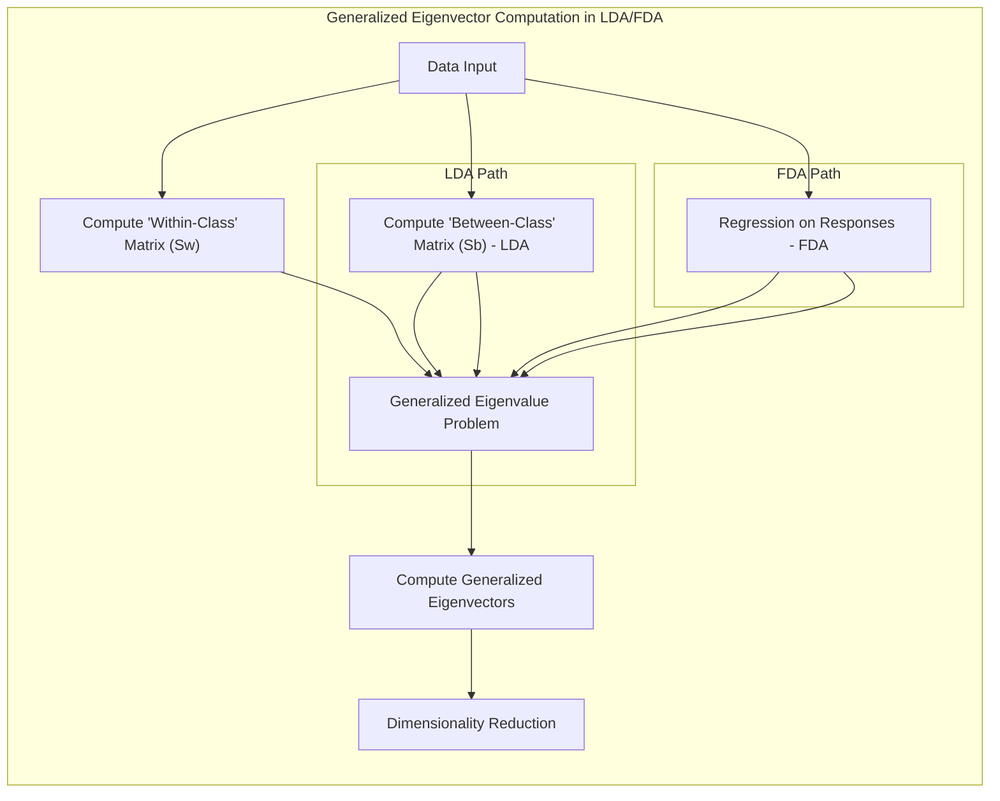
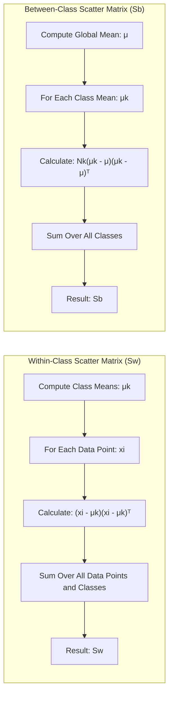
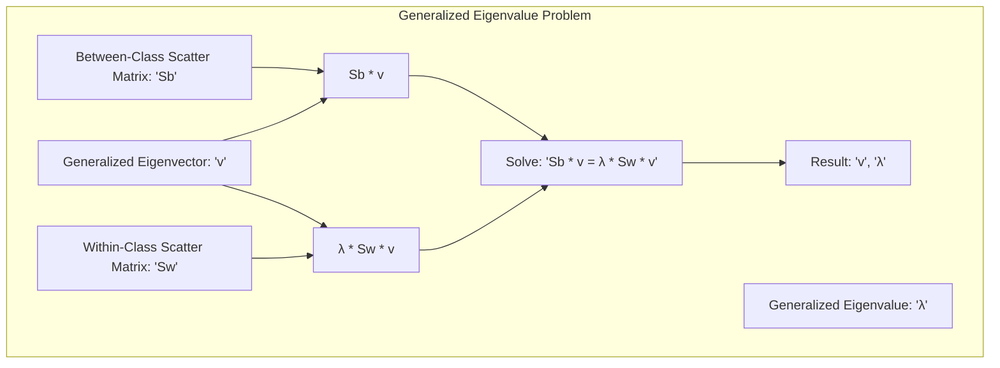
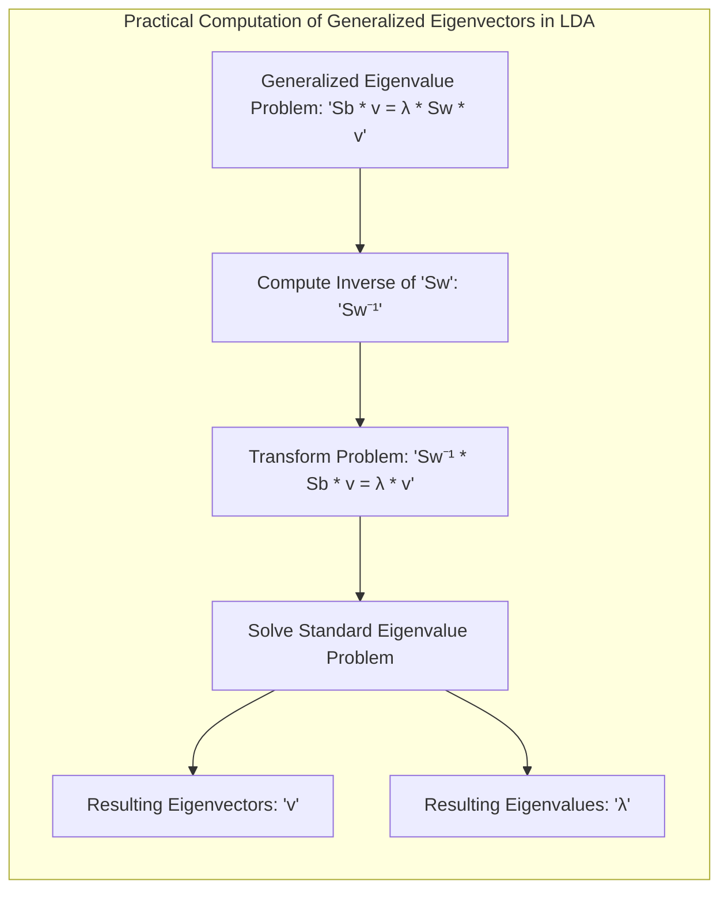
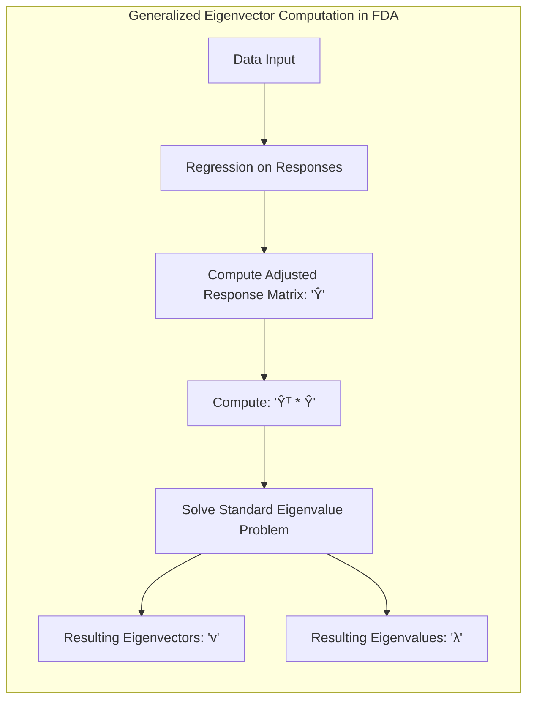
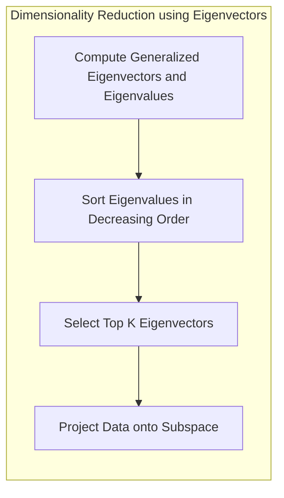

Okay, let's dive into the **Computations Based on Generalized Eigenvectors** within the context of Flexible Discriminant Analysis (FDA) and Linear Discriminant Analysis (LDA). This section will explore how these eigenvectors are derived and used for dimensionality reduction and classification.

## Título: Computações com Autovetores Generalizados em FDA e LDA: Derivação e Aplicação na Redução de Dimensionalidade



### Introdução

No contexto da **Análise Discriminante Linear (LDA)** e da **Análise Discriminante Flexível (FDA)**, o cálculo dos **autovetores generalizados** desempenha um papel fundamental na obtenção das projeções discriminantes que maximizam a separação entre as classes. Os autovetores generalizados são obtidos a partir da solução de um problema de autovalor generalizado, que envolve duas matrizes e nos fornece uma projeção linear que leva ao espaço com a máxima separação das classes.

Neste capítulo, exploraremos em detalhe como os autovetores generalizados são calculados em LDA e FDA, analisando a relação entre as matrizes envolvidas e as propriedades matemáticas dos autovetores obtidos. Examinaremos como esses autovetores são utilizados para projetar os dados em um subespaço de menor dimensão, e como essa projeção auxilia na classificação e na redução de dimensionalidade. Discutiremos também como os autovetores generalizados se relacionam com o conceito de *scores* ótimos na FDA.

A compreensão dos cálculos com autovetores generalizados é fundamental para a aplicação prática da LDA e da FDA, e para o desenvolvimento de algoritmos de classificação eficientes e robustos.

### O Problema de Autovalor Generalizado em LDA

**Conceito 1: A Matriz de Dispersão Dentro e Entre Classes**

Na **Análise Discriminante Linear (LDA)**, o objetivo é encontrar uma projeção linear que maximize a separação entre as classes e minimize a dispersão dentro das classes. Para isso, definimos duas matrizes:

1.  **Matriz de Dispersão Dentro das Classes ($S_W$):** Essa matriz quantifica a dispersão dos dados dentro de cada classe, e é dada por:

    $$ S_W = \sum_{k=1}^{K} \sum_{i \in C_k} (x_i - \mu_k)(x_i - \mu_k)^T $$
    onde $C_k$ é o conjunto de amostras da classe $k$, $x_i$ é uma amostra, e $\mu_k$ é a média da classe $k$.
2.  **Matriz de Dispersão Entre as Classes ($S_B$):** Essa matriz quantifica a dispersão entre as médias das classes, e é dada por:
    $$ S_B = \sum_{k=1}^{K} N_k (\mu_k - \mu)(\mu_k - \mu)^T $$
    onde $N_k$ é o número de amostras na classe $k$, $\mu_k$ é a média da classe $k$ e $\mu$ é a média geral de todas as amostras.



As matrizes $S_W$ e $S_B$ representam as variâncias dentro e entre as classes, e a LDA busca encontrar uma projeção que maximize a razão entre essas duas matrizes, em um espaço onde a separação entre classes seja maximizada.

> 💡 **Exemplo Numérico:**
>
> Vamos considerar um exemplo simples com duas classes e duas features.
>
> **Dados:**
>
> Classe 1: $C_1 = \{(1, 2), (1.5, 1.8), (2, 2.2)\}$
>
> Classe 2: $C_2 = \{(5, 8), (5.5, 8.5), (6, 7.8)\}$
>
> **Cálculo das Médias:**
>
> $\mu_1 = \left(\frac{1+1.5+2}{3}, \frac{2+1.8+2.2}{3}\right) = (1.5, 2)$
>
> $\mu_2 = \left(\frac{5+5.5+6}{3}, \frac{8+8.5+7.8}{3}\right) = (5.5, 8.1)$
>
> $\mu = \left(\frac{1.5+5.5}{2}, \frac{2+8.1}{2}\right) = (3.5, 5.05)$
>
> $N_1 = 3$, $N_2 = 3$
>
> **Cálculo de $S_W$:**
>
> Para a classe 1:
>
> $(1-1.5, 2-2)(1-1.5, 2-2)^T = \begin{bmatrix} -0.5 \\ 0 \end{bmatrix} \begin{bmatrix} -0.5 & 0 \end{bmatrix} = \begin{bmatrix} 0.25 & 0 \\ 0 & 0 \end{bmatrix}$
>
> $(1.5-1.5, 1.8-2)(1.5-1.5, 1.8-2)^T = \begin{bmatrix} 0 \\ -0.2 \end{bmatrix} \begin{bmatrix} 0 & -0.2 \end{bmatrix} = \begin{bmatrix} 0 & 0 \\ 0 & 0.04 \end{bmatrix}$
>
> $(2-1.5, 2.2-2)(2-1.5, 2.2-2)^T = \begin{bmatrix} 0.5 \\ 0.2 \end{bmatrix} \begin{bmatrix} 0.5 & 0.2 \end{bmatrix} = \begin{bmatrix} 0.25 & 0.1 \\ 0.1 & 0.04 \end{bmatrix}$
>
> Para a classe 2:
>
> $(5-5.5, 8-8.1)(5-5.5, 8-8.1)^T = \begin{bmatrix} -0.5 \\ -0.1 \end{bmatrix} \begin{bmatrix} -0.5 & -0.1 \end{bmatrix} = \begin{bmatrix} 0.25 & 0.05 \\ 0.05 & 0.01 \end{bmatrix}$
>
> $(5.5-5.5, 8.5-8.1)(5.5-5.5, 8.5-8.1)^T = \begin{bmatrix} 0 \\ 0.4 \end{bmatrix} \begin{bmatrix} 0 & 0.4 \end{bmatrix} = \begin{bmatrix} 0 & 0 \\ 0 & 0.16 \end{bmatrix}$
>
> $(6-5.5, 7.8-8.1)(6-5.5, 7.8-8.1)^T = \begin{bmatrix} 0.5 \\ -0.3 \end{bmatrix} \begin{bmatrix} 0.5 & -0.3 \end{bmatrix} = \begin{bmatrix} 0.25 & -0.15 \\ -0.15 & 0.09 \end{bmatrix}$
>
> $S_W = \begin{bmatrix} 0.25+0+0.25 & 0+0+0.1 \\ 0+0+0.1 & 0+0.04+0.04 \end{bmatrix} +  \begin{bmatrix} 0.25+0+0.25 & 0.05+0-0.15 \\ 0.05+0-0.15 & 0.01+0.16+0.09 \end{bmatrix} = \begin{bmatrix} 0.5 & 0.1 \\ 0.1 & 0.08 \end{bmatrix} + \begin{bmatrix} 0.5 & -0.1 \\ -0.1 & 0.26 \end{bmatrix} = \begin{bmatrix} 1 & 0 \\ 0 & 0.34 \end{bmatrix}$
>
> **Cálculo de $S_B$:**
>
> $S_B = 3 \begin{bmatrix} 1.5-3.5 \\ 2-5.05 \end{bmatrix} \begin{bmatrix} 1.5-3.5 & 2-5.05 \end{bmatrix} + 3 \begin{bmatrix} 5.5-3.5 \\ 8.1-5.05 \end{bmatrix} \begin{bmatrix} 5.5-3.5 & 8.1-5.05 \end{bmatrix} = 3 \begin{bmatrix} -2 \\ -3.05 \end{bmatrix} \begin{bmatrix} -2 & -3.05 \end{bmatrix} + 3 \begin{bmatrix} 2 \\ 3.05 \end{bmatrix} \begin{bmatrix} 2 & 3.05 \end{bmatrix} = 3 \begin{bmatrix} 4 & 6.1 \\ 6.1 & 9.3025 \end{bmatrix} + 3 \begin{bmatrix} 4 & 6.1 \\ 6.1 & 9.3025 \end{bmatrix} = \begin{bmatrix} 24 & 36.6 \\ 36.6 & 55.815 \end{bmatrix}$
>
> Estes valores de $S_W$ e $S_B$ serão usados no problema de autovalor generalizado. Note que $S_W$ represents the within-class scatter and $S_B$ the between-class scatter.

**Lemma 1:** As matrizes de dispersão dentro e entre classes quantificam a separação entre as classes e a dispersão dos dados dentro de cada classe, e são as bases para a formulação do problema de otimização da LDA.

A demonstração desse lemma se baseia na análise da definição das matrizes de dispersão, que foram criadas para modelar os conceitos de variância dentro e entre classes.

**Conceito 2: O Problema de Autovalor Generalizado**

O problema de otimização da LDA, que busca maximizar a razão entre a dispersão entre classes e a dispersão dentro das classes, pode ser expresso como um **problema de autovalor generalizado**:

$$ S_B v = \lambda S_W v $$

onde $v$ é o autovetor generalizado e $\lambda$ é o autovalor generalizado. Essa equação busca vetores $v$ que maximizem a relação entre a dispersão entre classes ($S_B$) e a dispersão dentro das classes ($S_W$).


Os autovetores generalizados $v$ obtidos da solução desse problema definem as **direções discriminantes** da LDA, ou seja, as direções que melhor separam as classes. Os autovalores correspondentes $\lambda$ indicam a importância da projeção discriminante.

**Corolário 1:** A solução do problema de otimização da LDA é dada pelos autovetores generalizados da equação $S_B v = \lambda S_W v$, e esses autovetores definem as direções que maximizam a separação entre as classes.

A demonstração desse corolário se baseia na análise da relação entre as matrizes de dispersão e a formulação do problema de otimização da LDA, e como a solução desse problema é dada pelos autovetores generalizados da equação do autovalor.

### Cálculo dos Autovetores Generalizados: Abordagem Prática



Na prática, o cálculo dos autovetores generalizados na LDA é realizado transformando o problema de autovalor generalizado em um problema de autovalor padrão, multiplicando ambos os lados da equação por $S_W^{-1}$:

$$ S_W^{-1} S_B v = \lambda v $$

onde $S_W^{-1}$ é a inversa da matriz de dispersão dentro das classes (ou sua pseudo-inversa caso seja singular). A matriz $S_W^{-1} S_B$ não é simétrica, portanto, seus autovetores podem ser complexos, mas a parte imaginária da solução geralmente é nula ou insignificante.

> 💡 **Exemplo Numérico:**
>
> Usando os valores de $S_W$ e $S_B$ do exemplo anterior:
>
> $S_W = \begin{bmatrix} 1 & 0 \\ 0 & 0.34 \end{bmatrix}$
>
> $S_B = \begin{bmatrix} 24 & 36.6 \\ 36.6 & 55.815 \end{bmatrix}$
>
> **Calculando $S_W^{-1}$:**
>
> $S_W^{-1} = \begin{bmatrix} 1 & 0 \\ 0 & 1/0.34 \end{bmatrix} = \begin{bmatrix} 1 & 0 \\ 0 & 2.941 \end{bmatrix}$
>
> **Calculando $S_W^{-1}S_B$:**
>
> $S_W^{-1}S_B = \begin{bmatrix} 1 & 0 \\ 0 & 2.941 \end{bmatrix} \begin{bmatrix} 24 & 36.6 \\ 36.6 & 55.815 \end{bmatrix} = \begin{bmatrix} 24 & 36.6 \\ 107.6 & 164.1 \end{bmatrix}$
>
> Agora, precisamos encontrar os autovalores e autovetores da matriz $S_W^{-1}S_B$.
>
> Usando `numpy` para calcular os autovalores e autovetores:
>
> ```python
> import numpy as np
>
> Sw_inv = np.array([[1, 0], [0, 2.941]])
> Sb = np.array([[24, 36.6], [36.6, 55.815]])
> Sw_inv_Sb = np.dot(Sw_inv, Sb)
>
> eigenvalues, eigenvectors = np.linalg.eig(Sw_inv_Sb)
>
> print("Autovalores:", eigenvalues)
> print("Autovetores:\n", eigenvectors)
> ```
>
> **Resultado:**
>
> ```
> Autovalores: [1.78633194e+02+0.j 1.55984756e-01+0.j]
> Autovetores:
>  [[ 0.29355781 -0.9647944 ]
>  [ 0.9558643   0.26270527]]
> ```
>
> Os autovalores são aproximadamente 178.63 e 0.156. O primeiro autovetor (0.294, 0.956) corresponde à direção que melhor separa as classes. Este vetor pode ser usado como uma projeção para reduzir a dimensão dos dados para uma única dimensão.

Os autovetores generalizados podem ser calculados utilizando algoritmos numéricos para a resolução de problemas de autovalor, como o algoritmo QR ou outros algoritmos mais eficientes para matrizes esparsas.

Os autovetores $v$ que correspondem aos maiores autovalores $\lambda$ são utilizados como projeções discriminantes para reduzir a dimensionalidade dos dados e para classificar novas amostras.

**Lemma 2:** O cálculo dos autovetores generalizados na LDA pode ser feito transformando o problema em um problema de autovalor padrão, através da multiplicação pela inversa da matriz de dispersão dentro das classes.

A demonstração desse lemma se baseia na manipulação da equação do problema de autovalor generalizado e como a multiplicação pela inversa transforma o problema em um problema de autovalor padrão, o que pode ser resolvido por algoritmos convencionais de decomposição espectral.

### Autovetores Generalizados em FDA e a Relação com a Regressão



Na **Análise Discriminante Flexível (FDA)**, o cálculo dos **autovetores generalizados** também desempenha um papel fundamental, mas a forma como eles são obtidos é diferente da LDA. Enquanto a LDA utiliza a matriz de dispersão entre as classes, a FDA utiliza um modelo de regressão para definir a relação entre as *features* e as classes.

Em FDA, o objetivo é maximizar a relação entre os *scores* $\theta_l(g)$ e as *features* $X$. Essa relação é feita utilizando uma abordagem de regressão, que utiliza modelos mais flexíveis do que a LDA para modelar a dependência entre *features* e classes. O problema é formulado como a minimização de um resíduo quadrado, como explicado em capítulos anteriores.

Após o passo da regressão, o cálculo dos autovetores generalizados é feito através da decomposição espectral da matriz $\hat{Y}^T \hat{Y}$, onde $\hat{Y}$ representa a matriz de respostas ajustadas pela regressão, e cujas colunas correspondem aos valores das funções de regressão que modelam as classes.

> 💡 **Exemplo Numérico:**
>
> Vamos supor que após um passo de regressão, temos uma matriz de respostas ajustadas $\hat{Y}$ para um problema com 3 classes e 5 amostras:
>
> $\hat{Y} = \begin{bmatrix}
> 0.1 & 0.9 & 0.2 \\
> 0.2 & 0.8 & 0.3 \\
> 0.8 & 0.1 & 0.8 \\
> 0.9 & 0.2 & 0.7 \\
> 0.3 & 0.7 & 0.1
> \end{bmatrix}$
>
> **Calculando $\hat{Y}^T \hat{Y}$:**
>
> $\hat{Y}^T \hat{Y} = \begin{bmatrix}
> 0.1 & 0.2 & 0.8 & 0.9 & 0.3 \\
> 0.9 & 0.8 & 0.1 & 0.2 & 0.7 \\
> 0.2 & 0.3 & 0.8 & 0.7 & 0.1
> \end{bmatrix} \begin{bmatrix}
> 0.1 & 0.9 & 0.2 \\
> 0.2 & 0.8 & 0.3 \\
> 0.8 & 0.1 & 0.8 \\
> 0.9 & 0.2 & 0.7 \\
> 0.3 & 0.7 & 0.1
> \end{bmatrix} = \begin{bmatrix}
> 1.8 & 0.85 & 1.47 \\
> 0.85 & 2.03 & 0.97 \\
> 1.47 & 0.97 & 1.47
> \end{bmatrix}$
>
> Agora, encontramos os autovalores e autovetores de $\hat{Y}^T \hat{Y}$.
>
> ```python
> import numpy as np
>
> Y_hat = np.array([[0.1, 0.9, 0.2],
>                   [0.2, 0.8, 0.3],
>                   [0.8, 0.1, 0.8],
>                   [0.9, 0.2, 0.7],
>                   [0.3, 0.7, 0.1]])
>
> YtY = np.dot(Y_hat.T, Y_hat)
>
> eigenvalues, eigenvectors = np.linalg.eig(YtY)
>
> print("Autovalores:", eigenvalues)
> print("Autovetores:\n", eigenvectors)
> ```
>
> **Resultado:**
>
> ```
> Autovalores: [ 4.02324826  0.67905928  0.60769246]
> Autovetores:
>  [[ 0.65903242 -0.68243777  0.31965537]
>  [ 0.52236237  0.72916588  0.44592754]
>  [ 0.53744541  0.01193147 -0.84281555]]
> ```
>
> Os autovalores indicam a importância de cada componente discriminante. O primeiro autovetor (0.659, 0.522, 0.537) define a direção com maior separação entre as classes.

Dessa forma, os autovetores generalizados em FDA são obtidos a partir da decomposição espectral de uma matriz construída com base na regressão não linear, e esses autovetores fornecem as projeções que melhor separam as classes no espaço transformado.

**Corolário 1:** Em FDA, os autovetores generalizados são calculados através da decomposição espectral da matriz de respostas ajustadas, e esses autovetores definem a projeção discriminante no espaço das respostas.

A demonstração desse corolário se baseia na análise da formulação da FDA e como o problema de autovalor generalizado é construído para o caso da FDA utilizando o modelo de regressão flexível e a representação das classes no espaço das respostas.

### O Papel dos Autovalores e Componentes Discriminantes



Os **autovalores generalizados** $\lambda_i$ associados aos autovetores $v_i$ representam a magnitude da separação entre as classes ao longo das direções definidas pelos autovetores, como mencionado em [^12.4] e [^12.5]. Os autovalores são ordenados em ordem decrescente, com os maiores autovalores correspondendo às direções que melhor separam as classes, e, portanto, definem as componentes principais do espaço discriminante.

Os autovetores são, então, usados para projetar os dados de um espaço de *features* de alta dimensão para um espaço de menor dimensão, de forma a preservar a informação discriminante entre as classes. O número de componentes (autovetores) utilizados para a projeção define a dimensão do espaço reduzido, e a escolha desse número envolve um compromisso entre a preservação da informação e a redução da complexidade do modelo.

> 💡 **Exemplo Numérico:**
>
> Suponha que temos os autovalores obtidos no exemplo anterior de FDA:
>
> $\lambda = [4.023, 0.679, 0.608]$
>
> Os autovalores já estão em ordem decrescente. O primeiro autovalor, 4.023, é muito maior que os demais, indicando que a primeira componente discriminante captura a maior parte da variação entre as classes.
>
> Para reduzir a dimensionalidade, podemos escolher manter apenas a primeira componente. Isso significa que projetaremos os dados usando apenas o primeiro autovetor (0.659, 0.522, 0.537).
>
>  A redução de dimensionalidade preserva a informação mais importante para a classificação, enquanto reduz a complexidade computacional e potencialmente evita o overfitting.

In general, for a problem with $K$ classes, LDA or FDA can generate up to $K-1$ non-trivial discriminant components. In FDA, however, when using a regression model with a basis of functions, the number of components generated can be limited by the dimensionality of the basis, and, therefore, it is important to choose the number of components that capture most of the data variation.

**Corolário 2:** Os autovalores generalizados indicam a importância de cada componente discriminante, e os autovetores correspondentes são utilizados para projetar os dados em um subespaço de menor dimensão, preservando as propriedades que melhor separam as classes.

A demonstração desse corolário se baseia na análise das propriedades dos autovalores e autovetores generalizados e como eles são utilizados para representar a informação dos dados, indicando como cada dimensão contribui para a separação entre classes.

### Conclusão

Neste capítulo, exploramos em detalhes a utilização de **autovetores generalizados** em **Análise Discriminante Linear (LDA)** e **Análise Discriminante Flexível (FDA)**. Vimos como os autovetores generalizados são derivados do problema de autovalor generalizado e como eles são utilizados para projetar os dados em um subespaço de menor dimensão, buscando maximizar a separação entre as classes.

Analisamos como a LDA e a FDA diferem na forma como os autovetores generalizados são calculados, e como a FDA utiliza a regressão para obter projeções mais flexíveis, com o uso da matriz de respostas ajustada. Discutimos também como os autovalores representam a importância das componentes discriminantes e como a escolha dos autovetores mais relevantes permite reduzir a dimensionalidade dos dados sem perda significativa de informação.

A compreensão dos cálculos com autovetores generalizados é fundamental para a utilização avançada de LDA e FDA, e para a construção de modelos de classificação eficientes e robustos, especialmente em problemas com dados complexos e de alta dimensionalidade.

### Footnotes

[^12.1]: "In this chapter we describe generalizations of linear decision boundaries for classification. Optimal separating hyperplanes are introduced in Chapter 4 for the case when two classes are linearly separable. Here we cover extensions to the nonseparable case, where the classes overlap. These techniques are then generalized to what is known as the support vector machine, which produces nonlinear boundaries by constructing a linear boundary in a large, transformed version of the feature space." *(Trecho de  "Support Vector Machines and Flexible Discriminants")*

[^12.2]: "In Chapter 4 we discussed a technique for constructing an optimal separating hyperplane between two perfectly separated classes. We review this and generalize to the nonseparable case, where the classes may not be separable by a linear boundary." *(Trecho de  "Support Vector Machines and Flexible Discriminants")*

[^12.4]: "Often LDA produces the best classification results, because of its simplicity and low variance. LDA was among the top three classifiers for 11 of the 22 datasets studied in the STATLOG project (Michie et al., 1994)3." *(Trecho de  "Support Vector Machines and Flexible Discriminants")*

[^12.5]:  "In this section we describe a method for performing LDA using linear re-gression on derived responses." *(Trecho de "Support Vector Machines and Flexible Discriminants")*
