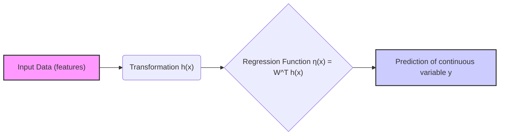
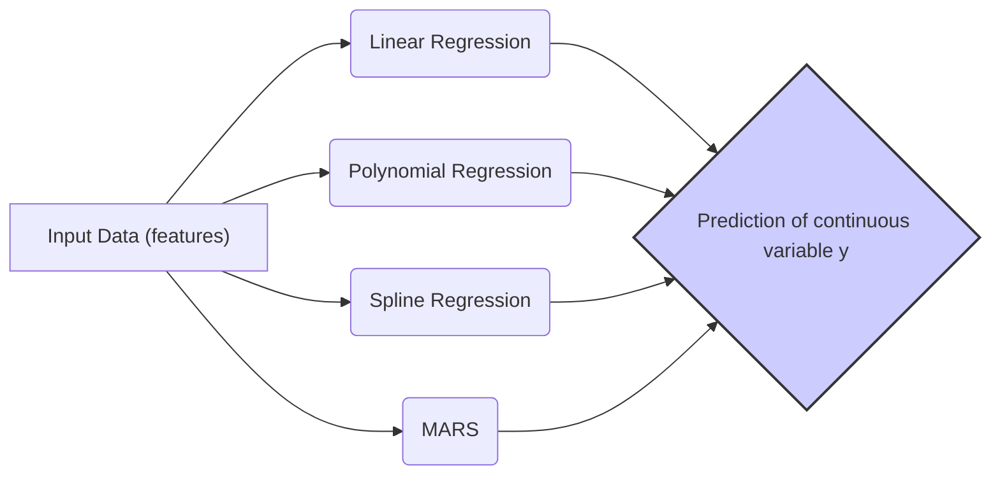
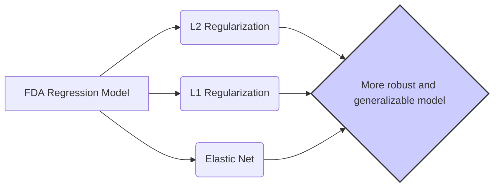

Okay, let's explore the **relation between FDA and linear regression**, and how this connection allows us to use FDA as a **regression tool**. This section will highlight how the core mechanisms of FDA can be adapted beyond classification to handle continuous responses.

## Título: FDA como Ferramenta de Regressão: Conexão com Regressão Linear e Extensões para Respostas Contínuas

### Introdução

A **Análise Discriminante Flexível (FDA)**, como discutido nos capítulos anteriores, é um método de classificação que utiliza regressão para modelar a relação entre as *features* e as classes. No entanto, a formulação da FDA, baseada em **regressão**, pode também ser adaptada para problemas de **regressão**, onde o objetivo é predizer uma resposta contínua em vez de um rótulo de classe.

Neste capítulo, exploraremos em detalhes como a FDA pode ser utilizada como uma ferramenta de regressão, analisando como a formulação original da FDA é adaptada para modelar dados de regressão. Discutiremos como a função de regressão não paramétrica é utilizada para predizer a variável de resposta contínua e como o conceito de *scores* ótimos pode ser adaptado para esse cenário. Analisaremos também a relação entre a FDA como um método de regressão e outros modelos de regressão, como a regressão linear e a regressão não paramétrica.

A compreensão da capacidade da FDA de ser adaptada para problemas de regressão oferece *insights* valiosos sobre a flexibilidade desse método e sobre o seu potencial para a modelagem de diferentes tipos de problemas no aprendizado de máquina.

### FDA como Regressão: O Papel da Regressão na FDA

**Conceito 1: A FDA como um Problema de Regressão**

A formulação da **Análise Discriminante Flexível (FDA)** já se baseia no conceito de regressão. Como discutido anteriormente, o FDA busca encontrar *scores* $\theta(g)$ que podem ser preditos a partir das *features* $x$ utilizando uma função de regressão. Para isso, a FDA define uma função de regressão flexível $\eta(x)$, que modela a relação entre as *features* e os scores das classes:

$$ \eta(x) = W^T h(x) $$

onde $h(x)$ é um conjunto de funções de base que transformam as *features* para um espaço de dimensão maior, e $W$ é uma matriz de coeficientes a serem aprendidos. O objetivo da FDA é encontrar os *scores* $\theta_l(g)$ que podem ser bem modelados por essa função de regressão.

No contexto de classificação, a FDA busca encontrar scores ótimos que maximizem a separação entre as classes, mas o processo subjacente da FDA é um processo de regressão. Ao utilizar uma função de regressão flexível, a FDA supera as limitações da LDA, que se baseia em projeções lineares diretas sobre os dados originais.

> 💡 **Exemplo Numérico:**
>
> Suponha que temos um conjunto de dados com duas *features* ($x_1$ e $x_2$) e queremos prever um *score* $\theta$. Podemos usar uma função de base polinomial de grau 2: $h(x) = [1, x_1, x_2, x_1^2, x_2^2, x_1x_2]$. Se a matriz de coeficientes $W$ for $W = [0.5, 0.2, -0.3, 0.1, 0.05, -0.02]$, então, para um ponto $x = [2, 3]$, teríamos:
>
> $h(x) = [1, 2, 3, 4, 9, 6]$
>
> $\eta(x) = W^T h(x) = 0.5*1 + 0.2*2 - 0.3*3 + 0.1*4 + 0.05*9 - 0.02*6 = 0.5 + 0.4 - 0.9 + 0.4 + 0.45 - 0.12 = 0.73$
>
> Este valor de 0.73 seria a predição do *score* para este ponto. A FDA busca ajustar os coeficientes $W$ para que $\eta(x)$ se aproxime dos *scores* desejados.

**Lemma 1:** A formulação da FDA se baseia na utilização da regressão para modelar a relação entre as *features* e as variáveis de resposta (no caso da classificação, a matriz indicadora das classes), e esta característica pode ser adaptada para problemas de regressão.

A demonstração desse lemma se baseia na análise da formulação da FDA e como o problema da otimização é definido através da busca por parâmetros de um modelo de regressão.

**Conceito 2: Adaptação da FDA para Regressão com Respostas Contínuas**

A adaptação da FDA para problemas de regressão com respostas contínuas envolve apenas a mudança da variável de resposta, de uma matriz de indicadores de classe (como na classificação) para uma variável de resposta contínua, $y$.

Nesse cenário, o objetivo da FDA passa a ser encontrar uma função de regressão $f(x)$ que minimize o erro entre a predição $\eta(x)$ e a variável de resposta contínua $y$. O processo de ajuste do modelo e a seleção dos *scores* ótimos seguem os mesmos passos da FDA para classificação.

Dessa forma, a FDA pode ser vista como uma ferramenta genérica para modelagem, onde a função de regressão $f(x)$ é utilizada para modelar a relação entre as *features* e a variável de resposta, seja ela categórica (como na classificação) ou contínua (como na regressão).

> 💡 **Exemplo Numérico:**
>
> Imagine que temos um conjunto de dados onde $x$ representa o tamanho de uma casa (em metros quadrados) e $y$ o preço da casa (em milhares de reais). Em vez de classificar casas em categorias, queremos prever o preço. A FDA, neste caso, ajustaria a função $\eta(x)$ para que ela seja uma boa aproximação dos preços $y$.

**Corolário 1:** A FDA pode ser adaptada para problemas de regressão ao utilizar a função de regressão não paramétrica para modelar a variável de resposta contínua em vez de uma matriz indicadora de classes.

A demonstração desse corolário se baseia na análise da formulação da FDA e como o conceito de utilizar um modelo de regressão para mapear a informação dos dados sobre a resposta pode ser utilizado para modelar variáveis contínuas, e não somente variáveis discretas.

### Escolha de Funções de Regressão e Scores Ótimos para Regressão

A adaptação da FDA para problemas de regressão envolve a escolha de funções de regressão adequadas para modelar a variável de resposta contínua. Diferentes métodos de regressão não paramétrica podem ser utilizados, como:

1.  **Regressão Linear:** Embora a FDA tenha sido motivada a evitar a linearidade, uma regressão linear pode ser utilizada como um caso especial, quando as relações entre as *features* e a variável de resposta são lineares.
2.  **Regressão Polinomial:** A regressão polinomial pode ser utilizada para modelar relações não lineares em forma de polinômios, onde o grau do polinômio controla a complexidade do modelo.
3.  **Regressão Spline:** As funções de base *spline* podem ser utilizadas para modelar relações não lineares suaves e flexíveis, e permitem modelar funções que são suaves, mas não lineares no espaço de *features*.
4.  **MARS (Multivariate Adaptive Regression Splines):** O modelo MARS é uma técnica de regressão não paramétrica que utiliza funções lineares por partes, e é capaz de modelar relações não lineares complexas com grande flexibilidade.

A escolha da função de regressão depende da natureza dos dados e da complexidade da relação entre as *features* e a variável de resposta. Além da escolha do modelo de regressão, é necessário ajustar os parâmetros de cada modelo através de técnicas de validação cruzada.

> 💡 **Exemplo Numérico:**
>
> Vamos considerar um exemplo simples onde temos uma única *feature* ($x$) e uma variável de resposta contínua ($y$).
>
> 1.  **Regressão Linear:** Se usarmos uma regressão linear, teríamos $\eta(x) = w_0 + w_1x$. Por exemplo, se $w_0 = 2$ e $w_1 = 0.5$, para $x=4$, teríamos $\eta(4) = 2 + 0.5*4 = 4$.
> 2. **Regressão Polinomial:** Se usarmos um polinômio de grau 2, $\eta(x) = w_0 + w_1x + w_2x^2$. Se $w_0 = 1, w_1 = 0.2, w_2 = 0.1$, para $x=4$ teríamos $\eta(4) = 1 + 0.2*4 + 0.1*4^2 = 1 + 0.8 + 1.6 = 3.4$.
> 3. **Regressão Spline:** Uma regressão spline criaria uma função por partes, com diferentes polinômios em diferentes intervalos de $x$. A escolha dos nós e da complexidade das splines influencia a flexibilidade do modelo.
> 4. **MARS:** O MARS adaptaria a função de regressão usando funções lineares por partes que se ajustam automaticamente aos dados, permitindo modelar relações não lineares complexas.
>
> A escolha entre esses métodos dependerá da complexidade da relação entre $x$ e $y$ e do desempenho de cada modelo através de validação cruzada.

Os **scores ótimos**, no contexto da regressão, podem ser interpretados como projeções dos dados que revelam a relação entre as *features* e a variável de resposta. A escolha do número de scores e sua interpretação pode variar dependendo do problema de regressão específico, e o objetivo do uso de scores é também a redução de dimensionalidade e a obtenção de representações que melhor representam as variáveis de resposta.

> 💡 **Exemplo Numérico:**
>
> Suponha que, após aplicar uma transformação de base e ajustar o modelo, descobrimos que os dois primeiros *scores* explicam a maior parte da variabilidade na variável de resposta $y$. Podemos usar esses dois *scores* para visualizar os dados ou como novas *features* para outros modelos, reduzindo a dimensionalidade do problema.

**Lemma 2:** A escolha das funções de regressão e do número de *scores* ótimos na FDA para regressão dependem da complexidade da relação entre as *features* e a variável de resposta, e a validação cruzada é utilizada para escolher os melhores parâmetros.

A demonstração desse lemma se baseia na análise das propriedades de diferentes funções de regressão e como elas modelam diferentes tipos de relações entre as *features* e a resposta. A escolha dos melhores parâmetros deve ser feita através de técnicas que avaliam o desempenho do modelo em dados não vistos.

### Relação da FDA com Métodos de Regressão: Penalização e Regularização

Assim como em outros métodos de regressão, a utilização de técnicas de **penalização** e **regularização** é fundamental para controlar a complexidade do modelo FDA e evitar o *overfitting*, ou seja, o sobreajuste aos dados de treinamento. Em FDA, a regularização pode ser aplicada sobre a função de regressão $\eta(x)$, sobre o vetor de parâmetros $\beta$ que define a projeção discriminante, ou sobre as próprias *features* originais.

Algumas técnicas de regularização que podem ser utilizadas incluem:

1.  **Regularização L2:** Penaliza a norma ao quadrado dos coeficientes do modelo, levando a modelos mais simples e com melhor estabilidade:

    $$ \min_{\eta, \beta} \sum_{i=1}^{N} (y_i - \eta(x_i))^2 + \lambda ||\beta||^2 $$
    onde $\lambda$ é o parâmetro de regularização.
2.  **Regularização L1:** Penaliza a soma dos valores absolutos dos coeficientes, levando a modelos esparsos e realizando seleção de *features*:

    $$ \min_{\eta, \beta} \sum_{i=1}^{N} (y_i - \eta(x_i))^2 + \lambda \sum_{i=1}^p |\beta_i| $$
    onde $\lambda$ é o parâmetro de regularização.
3.  **Regularização Elástica (Elastic Net):** Combina as penalizações L1 e L2, e é uma forma de regularização robusta e flexível:
    $$ \min_{\eta, \beta} \sum_{i=1}^{N} (y_i - \eta(x_i))^2 + \lambda_1 \sum_{i=1}^p |\beta_i| + \lambda_2 ||\beta||^2 $$
    onde $\lambda_1$ e $\lambda_2$ são os parâmetros de regularização.

A escolha da técnica de regularização e de seus parâmetros associados depende das características do conjunto de dados e da complexidade da relação entre as *features* e a variável de resposta.

> 💡 **Exemplo Numérico:**
>
> Suponha que temos um modelo de regressão com coeficientes $\beta = [1.5, -2.0, 0.8, -0.3, 0.2]$ e queremos aplicar regularização.
>
> 1.  **Regularização L2:**  Com $\lambda = 0.1$, a penalidade seria $0.1 * (1.5^2 + (-2.0)^2 + 0.8^2 + (-0.3)^2 + 0.2^2) = 0.1 * (2.25 + 4 + 0.64 + 0.09 + 0.04) = 0.1 * 6.02 = 0.602$. A minimização do erro com essa penalidade tenderá a reduzir os valores de $\beta$.
> 2.  **Regularização L1:** Com $\lambda = 0.1$, a penalidade seria $0.1 * (|1.5| + |-2.0| + |0.8| + |-0.3| + |0.2|) = 0.1 * (1.5 + 2.0 + 0.8 + 0.3 + 0.2) = 0.1 * 4.8 = 0.48$. Isso pode levar alguns coeficientes a serem exatamente zero, realizando seleção de features.
> 3.  **Elastic Net:** Com $\lambda_1 = 0.05$ e $\lambda_2 = 0.05$, a penalidade seria $0.05 * 4.8 + 0.05 * 6.02 = 0.24 + 0.301 = 0.541$. O Elastic Net combina as duas abordagens, oferecendo flexibilidade na regularização.
>
> A escolha de $\lambda$, $\lambda_1$ e $\lambda_2$ é crucial e geralmente é feita usando validação cruzada.

**Lemma 3:** A utilização de técnicas de regularização na FDA para problemas de regressão controla a complexidade do modelo e evita o *overfitting*, levando a modelos mais robustos e com melhor capacidade de generalização.

A demonstração desse lemma se baseia na análise das propriedades dos diferentes tipos de regularização, como elas limitam a magnitude dos coeficientes e como essa limitação contribui para evitar o *overfitting*.

### Conclusão

Neste capítulo, exploramos a adaptação da **Análise Discriminante Flexível (FDA)** para problemas de **regressão**, e como a formulação original da FDA, baseada em regressão, pode ser utilizada para modelar dados com respostas contínuas. Vimos como a FDA utiliza modelos de regressão não paramétrica para modelar a relação entre as *features* e a variável de resposta, e como o conceito de *scores* ótimos é adaptado para esse cenário.

Discutimos também a importância da regularização para controlar a complexidade dos modelos de regressão da FDA e como a escolha apropriada das funções de regressão, dos *scores* e dos parâmetros de regularização impacta a capacidade de generalização do modelo.

A FDA oferece uma abordagem flexível e poderosa para problemas de regressão, combinando a modelagem não paramétrica com técnicas de regularização, e a compreensão dos conceitos explorados neste capítulo é fundamental para a utilização bem-sucedida da FDA em uma ampla gama de aplicações. A capacidade de utilizar a FDA tanto para classificação como para regressão a tornam uma ferramenta flexível.

### Footnotes

[^12.1]: "In this chapter we describe generalizations of linear decision boundaries for classification. Optimal separating hyperplanes are introduced in Chapter 4 for the case when two classes are linearly separable. Here we cover extensions to the nonseparable case, where the classes overlap. These techniques are then generalized to what is known as the support vector machine, which produces nonlinear boundaries by constructing a linear boundary in a large, transformed version of the feature space."

[^12.2]: "In Chapter 4 we discussed a technique for constructing an optimal separating hyperplane between two perfectly separated classes. We review this and generalize to the nonseparable case, where the classes may not be separable by a linear boundary."
[^12.4]: "In the remainder of this chapter we describe a class of techniques that attend to all these issues by generalizing the LDA model. This is achieved largely by three different ideas."
[^12.5]:  "In this section we describe a method for performing LDA using linear re-gression on derived responses."
