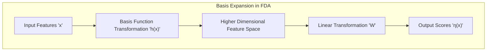
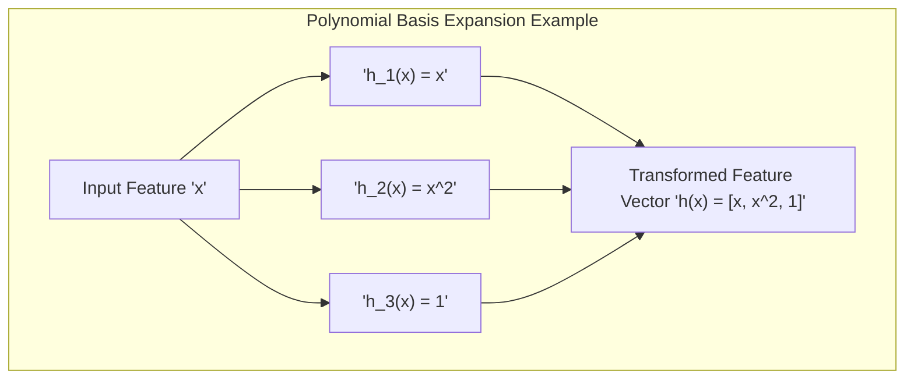
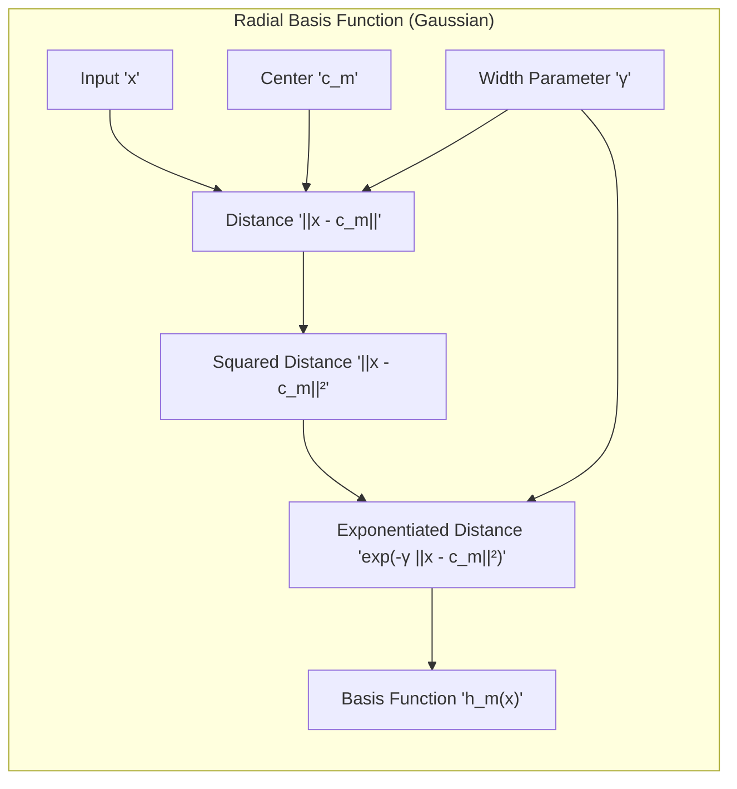
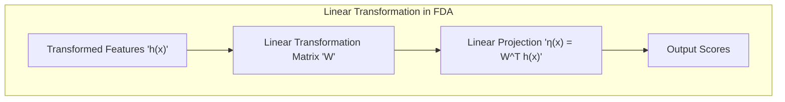
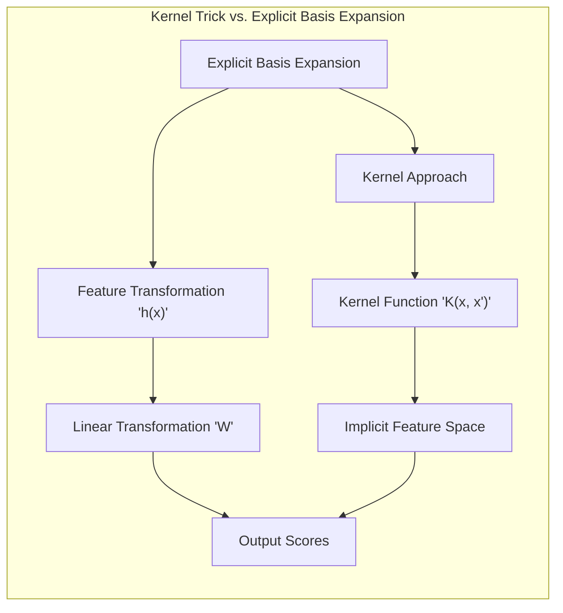
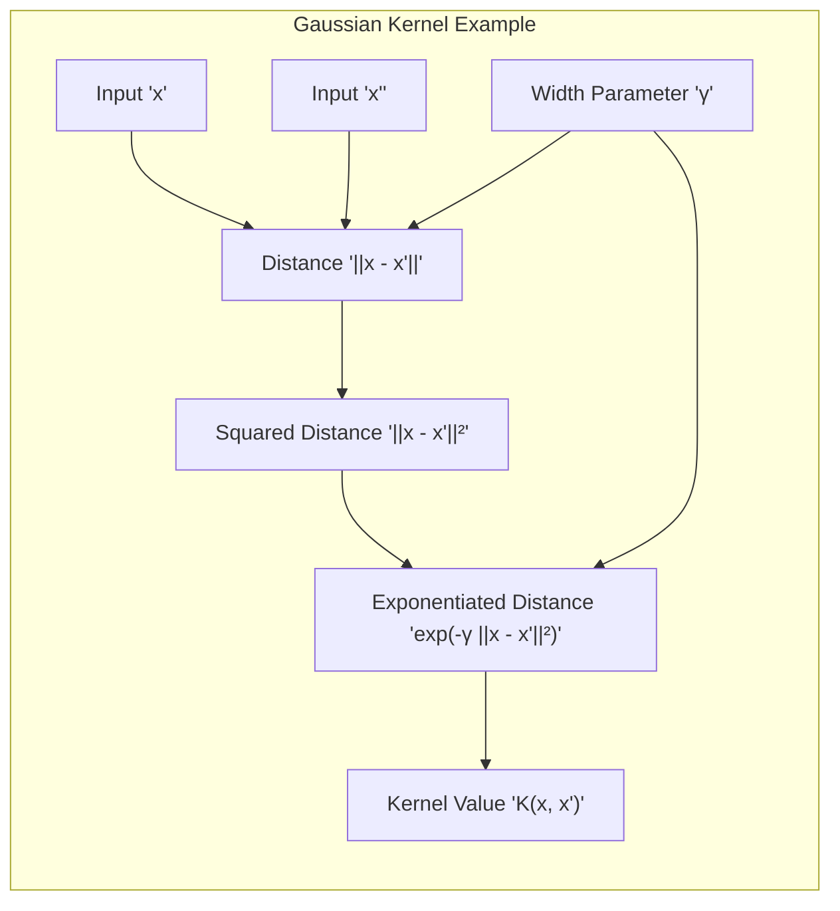

Okay, here's the enhanced text with the added Mermaid diagrams and LaTeX formatting for mathematical expressions:

## Título: Expansão de Base para Transformações Lineares em FDA: Relação entre Inputs e Respostas com Funções de Base



### Introdução

Em problemas de classificação e regressão, a relação entre as *features* (inputs) e a variável de resposta (output) muitas vezes não é linear. Para lidar com essa não linearidade, uma abordagem comum é a utilização de **expansão de base**, onde as *features* originais são transformadas em um espaço de maior dimensão através da utilização de **funções de base**. A combinação de uma transformação não linear com uma transformação linear no espaço de maior dimensão permite modelar relações complexas nos dados originais.

No contexto da **Análise Discriminante Flexível (FDA)**, a expansão de base é utilizada para criar uma transformação não linear dos dados antes de realizar a regressão linear, o que permite que a FDA modele relações não lineares entre as *features* e as classes. Neste capítulo, exploraremos como a expansão de base é utilizada em FDA e como ela se relaciona com o uso de *kernels*, e como essa abordagem permite obter modelos de classificação e regressão mais flexíveis e com maior capacidade de adaptação aos dados.

A compreensão do conceito de expansão de base é fundamental para a utilização avançada da FDA e para a conexão entre diferentes abordagens de aprendizado de máquina que se baseiam na ideia de transformar o espaço de *features* para modelar relações complexas.

### Expansão de Base e Transformação do Espaço de Features

**Conceito 1: A Ideia da Expansão de Base**

A **expansão de base** consiste em transformar o vetor de *features* $x$ em um novo vetor de *features* $\textbf{h}(x)$ que pertence a um espaço de maior dimensão, através da utilização de um conjunto de **funções de base** $h_m(x)$. A transformação é dada por:

$$ \textbf{h}(x) = [h_1(x), h_2(x), \ldots, h_M(x)] $$

onde $h_m(x)$ são as funções de base, e $M$ é o número total de funções de base. Ao criar uma transformação que mapeia o vetor de *features* para um novo espaço, podemos modelar relações não lineares com funções lineares nesse espaço.

As funções de base podem ser polinomiais, radiais (gaussianas), *splines*, ou qualquer outra função apropriada para modelar as relações nos dados. A escolha das funções de base é um passo crucial na utilização da expansão de base, pois ela determina a complexidade do modelo e a capacidade de se adaptar a diferentes tipos de relações.

> 💡 **Exemplo Numérico:**
>
> Suponha que temos uma feature $x$ e queremos usar uma expansão de base com funções polinomiais até o grau 2. Assim, as funções de base seriam $h_1(x) = x$, $h_2(x) = x^2$, e $h_3(x) = 1$ (termo constante). Se tivermos um ponto $x = 2$, o vetor de features transformado seria $\textbf{h}(2) = [2, 2^2, 1] = [2, 4, 1]$. Agora, uma relação linear neste novo espaço, como $\eta(x) = w_1h_1(x) + w_2h_2(x) + w_3h_3(x)$, pode modelar uma relação quadrática em $x$. Por exemplo, se $w = [0.5, 0.2, 1]$, então $\eta(2) = 0.5*2 + 0.2*4 + 1*1 = 1 + 0.8 + 1 = 2.8$.
>
> ```python
> import numpy as np
>
> x = 2
> h = np.array([x, x**2, 1])
> w = np.array([0.5, 0.2, 1])
> eta_x = np.dot(w, h)
> print(f"h(x) = {h}")
> print(f"eta(x) = {eta_x}")
> ```
>
> Este exemplo demonstra como uma transformação linear no espaço expandido pode representar uma relação não linear no espaço original.



**Lemma 1:** A expansão de base transforma os dados de entrada em um espaço de *features* de maior dimensão, onde uma transformação linear pode modelar relações não lineares no espaço original.

A demonstração desse lemma se baseia na análise da definição da expansão de base e como ela transforma o espaço de *features*, permitindo que um modelo linear, aplicado neste espaço, seja equivalente a um modelo não linear no espaço original.

**Conceito 2: Tipos Comuns de Funções de Base**

Alguns tipos comuns de funções de base incluem:

1.  **Funções Polinomiais:** As funções de base polinomiais são termos como $x_1$, $x_1^2$, $x_1x_2$, $x_2^3$, etc. Elas são utilizadas para modelar relações não lineares em forma de polinômios, onde o grau do polinômio controla a complexidade da transformação.

    > 💡 **Exemplo Numérico:**
    >
    > Considere duas *features*, $x_1$ e $x_2$. Uma expansão polinomial de grau 2 poderia incluir as seguintes funções de base: $h_1(x) = 1$, $h_2(x) = x_1$, $h_3(x) = x_2$, $h_4(x) = x_1^2$, $h_5(x) = x_1x_2$, e $h_6(x) = x_2^2$. Se tivermos um ponto $(x_1, x_2) = (2, 3)$, o vetor de *features* transformado seria $\textbf{h}(x) = [1, 2, 3, 4, 6, 9]$.

2.  **Funções Radiais (Gaussianas):** As funções de base radiais são funções gaussianas centradas em pontos específicos no espaço de *features*, e têm a forma:

    $$ h_m(x) = \exp(-\gamma ||x - c_m||^2) $$

    onde $c_m$ é o centro da função radial e $\gamma$ controla a sua largura. Essas funções são utilizadas para modelar relações não lineares com comportamento localizado.

    > 💡 **Exemplo Numérico:**
    >
    > Suponha uma função radial com centro $c_1 = 1$ e $\gamma = 0.5$. Se tivermos um ponto $x = 2$, então $h_1(2) = \exp(-0.5 * (2-1)^2) = \exp(-0.5) \approx 0.6065$. Se tivermos um ponto $x = 1$, então $h_1(1) = \exp(-0.5 * (1-1)^2) = \exp(0) = 1$. Isso mostra que a função radial tem valor máximo quando $x$ está no centro $c_1$.
    >
    > ```python
    > import numpy as np
    >
    > def gaussian_basis(x, c, gamma):
    >   return np.exp(-gamma * np.linalg.norm(x - c)**2)
    >
    > x = 2
    > c = 1
    > gamma = 0.5
    > h_x = gaussian_basis(x, c, gamma)
    > print(f"h(x) = {h_x}")
    > x_center = 1
    > h_x_center = gaussian_basis(x_center, c, gamma)
    > print(f"h(center) = {h_x_center}")
    > ```



3.  **Funções Spline:** As funções de base *spline* são funções polinomiais segmentadas, utilizadas para modelar relações não lineares suaves e flexíveis. A forma da função e sua suavidade dependem dos nós das splines e do grau dos polinômios utilizados para formar as splines.

4.  **Funções de Fourier:** As funções de base de Fourier são utilizadas para modelar relações periódicas nos dados e são formadas por senos e cossenos de diferentes frequências.

A escolha do tipo de função de base depende das características dos dados e do tipo de relações não lineares que se deseja capturar, e a utilização de uma combinação de funções de diferentes tipos também é uma prática comum.

**Corolário 1:** A escolha do tipo de funções de base e de seus parâmetros impactam a forma da transformação e a capacidade de modelar diferentes tipos de relações não lineares.

A demonstração desse corolário se baseia na análise das propriedades de diferentes funções de base e como elas definem um espaço de *features* transformado com diferentes propriedades e características.

### A Transformação Linear e a Modelagem em FDA



No contexto da **Análise Discriminante Flexível (FDA)**, após a transformação dos dados através de uma expansão de base, uma **transformação linear** é utilizada para relacionar as *features* transformadas com as variáveis de resposta ou os *scores* associados a cada classe.

A FDA busca encontrar scores $\theta(g)$ para cada classe $g$, que podem ser preditos por uma função linear sobre as *features* transformadas $\textbf{h}(x)$, como em:

$$ \eta(x) = W^T \textbf{h}(x) $$

onde $\eta(x)$ é a projeção linear dos dados no espaço de *features* transformado, $W$ é a matriz de transformação linear (que é a matriz que contém o vetor de parâmetros $\beta$, discutido em capítulos anteriores), e $\textbf{h}(x)$ é o vetor das funções de base calculadas com $x$.

Essa abordagem permite que a FDA modele relações não lineares através da transformação não linear inicial utilizando as funções de base e da modelagem linear no espaço transformado. As componentes do vetor $\eta(x)$ representam a projeção das amostras sobre um novo espaço, onde a separabilidade das classes é maximizada.

> 💡 **Exemplo Numérico:**
>
> Suponha que temos duas classes e usamos funções de base polinomiais até o grau 2, como no primeiro exemplo numérico. Temos um vetor de *features* transformado $\textbf{h}(x) = [1, x_1, x_2, x_1^2, x_1x_2, x_2^2]$. Suponha que a matriz de transformação linear $W$ seja:
>
> $$ W = \begin{bmatrix} 0.1 \\ 0.2 \\ -0.3 \\ 0.05 \\ 0.1 \\ -0.02 \end{bmatrix} $$
>
> Se tivermos um ponto $(x_1, x_2) = (2, 3)$, então $\textbf{h}(x) = [1, 2, 3, 4, 6, 9]$. Então, o score $\eta(x)$ seria:
>
> $\eta(x) = W^T \textbf{h}(x) = 0.1*1 + 0.2*2 - 0.3*3 + 0.05*4 + 0.1*6 - 0.02*9 = 0.1 + 0.4 - 0.9 + 0.2 + 0.6 - 0.18 = 0.22$.
>
> Este score $\eta(x)$ poderia ser usado para classificar o ponto $x$ em uma das classes, dependendo do limiar utilizado.
>
> ```python
> import numpy as np
>
> h_x = np.array([1, 2, 3, 4, 6, 9])
> W = np.array([0.1, 0.2, -0.3, 0.05, 0.1, -0.02])
> eta_x = np.dot(W, h_x)
> print(f"eta(x) = {eta_x}")
> ```

A utilização de projeções lineares no espaço transformado também permite utilizar resultados da LDA e outras técnicas de projeção linear para obter um novo espaço de dimensão reduzida, mas que preserva a informação relevante sobre a separabilidade das classes.

**Lemma 2:** A FDA utiliza uma transformação linear sobre o espaço de *features* expandido através de funções de base, o que possibilita modelar relações não lineares entre as *features* originais e as variáveis de resposta.

A demonstração desse lemma se baseia na análise da formulação da FDA, como ela utiliza uma combinação linear dos *features* transformadas para obter o resultado da projeção.

### Conexão com Kernels: Uma Abordagem Implícita



A utilização de **kernels** em **Support Vector Machines (SVMs)** pode ser vista como uma forma implícita de expansão de base, onde o produto interno entre os dados transformados é calculado diretamente sem explicitar a transformação para o novo espaço. O *kernel trick*, como discutido em capítulos anteriores, permite que as SVMs operem em espaços de *features* de alta dimensão através do uso de funções *kernel*:

$$ K(x, x') = \langle \phi(x), \phi(x') \rangle $$

onde $\phi(x)$ representa uma transformação dos dados para o espaço de *features* (possivelmente de dimensão infinita).

A conexão entre a expansão de base e os *kernels* reside no fato de que os *kernels* correspondem a produtos internos em um espaço de *features* que pode ser construído através de funções de base, mesmo que a função de transformação $\phi$ não seja explícita. Em outras palavras, as funções *kernel* podem ser vistas como uma forma de realizar uma expansão de base de maneira implícita e eficiente.

> 💡 **Exemplo Numérico:**
>
> Considere um *kernel* gaussiano, $K(x, x') = \exp(-\gamma ||x - x'||^2)$. Este *kernel* pode ser visto como um produto interno em um espaço de *features* de dimensão infinita. Suponha que temos dois pontos $x = 1$ e $x' = 2$, e $\gamma = 0.5$.
>
> $K(1, 2) = \exp(-0.5 * (1-2)^2) = \exp(-0.5) \approx 0.6065$.
>
> O *kernel trick* permite calcular este valor sem explicitamente calcular a transformação $\phi(x)$ e $\phi(x')$. Este valor pode ser usado para calcular a similaridade entre os pontos $x$ e $x'$ no espaço transformado.
>
> ```python
> import numpy as np
>
> def gaussian_kernel(x, x_prime, gamma):
>   return np.exp(-gamma * np.linalg.norm(x - x_prime)**2)
>
> x = 1
> x_prime = 2
> gamma = 0.5
> k_xx_prime = gaussian_kernel(x, x_prime, gamma)
> print(f"K(x, x') = {k_xx_prime}")
> ```



A utilização de *kernels* oferece maior flexibilidade, uma vez que não é necessário escolher um conjunto específico de funções de base, e permite trabalhar com espaços de *features* de dimensão infinita, o que pode ser útil em muitos problemas de aprendizado de máquina.

**Corolário 2:** Os *kernels* podem ser vistos como uma forma de realizar uma expansão de base de forma implícita, onde o produto interno no espaço de *features* transformado é calculado diretamente sem explicitar a transformação.

A demonstração desse corolário se baseia na análise do *kernel trick* e como ele calcula os produtos internos no espaço transformado através da função *kernel*, o que é equivalente a utilizar um produto interno em um espaço gerado por funções de base.

### Conclusão

Neste capítulo, exploramos a utilização de **expansão de base** para transformar um espaço de *features* original em um espaço de maior dimensão, onde uma transformação linear pode modelar relações não lineares. Vimos como a expansão de base é utilizada na **Análise Discriminante Flexível (FDA)** para criar projeções não lineares e como essa transformação permite modelar dados de forma mais flexível.

Analisamos a relação entre a expansão de base e os *kernels* em **Support Vector Machines (SVMs)**, mostrando como os *kernels* podem ser vistos como uma forma implícita de realizar uma expansão de base. A compreensão da relação entre a expansão de base, a transformação linear e os *kernels* fornece uma visão mais completa sobre os diferentes mecanismos utilizados para modelar a não linearidade em problemas de aprendizado de máquina. A flexibilidade dos modelos SVM permite que eles se adaptem a conjuntos de dados complexos e apresentem boa capacidade de generalização.

### Footnotes

[^12.1]: "In this chapter we describe generalizations of linear decision boundaries for classification. Optimal separating hyperplanes are introduced in Chapter 4 for the case when two classes are linearly separable. Here we cover extensions to the nonseparable case, where the classes overlap. These techniques are then generalized to what is known as the support vector machine, which produces nonlinear boundaries by constructing a linear boundary in a large, transformed version of the feature space." *(Trecho de  "Support Vector Machines and Flexible Discriminants")*

[^12.2]: "In Chapter 4 we discussed a technique for constructing an optimal separating hyperplane between two perfectly separated classes. We review this and generalize to the nonseparable case, where the classes may not be separable by a linear boundary." *(Trecho de  "Support Vector Machines and Flexible Discriminants")*

[^12.3]: "The support vector machine classifier is an extension of this idea, where the dimension of the enlarged space is allowed to get very large, infinite in some cases. It might seem that the computations would become prohibitive. It would also seem that with sufficient basis functions, the data would be separable, and overfitting would occur. We first show how the SVM technology deals with these issues. We then see that in fact the SVM classifier is solving a function-fitting problem using a particular criterion and form of regularization, and is part of a much bigger class of problems that includes the smoothing splines of Chapter 5." *(Trecho de  "Support Vector Machines and Flexible Discriminants")*
