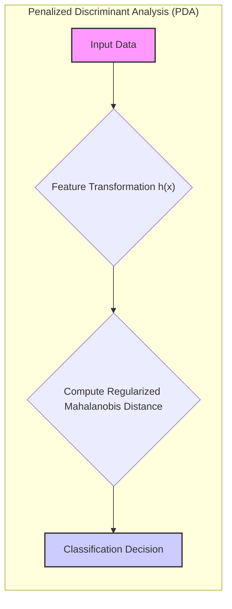
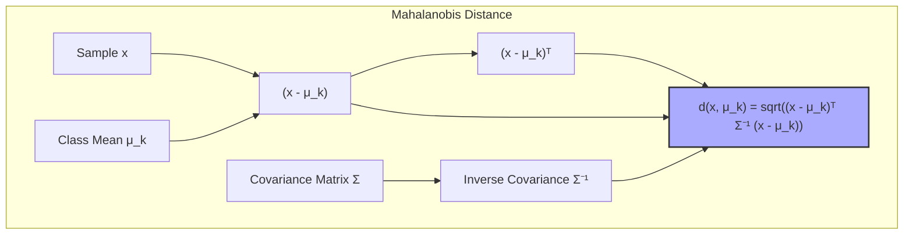
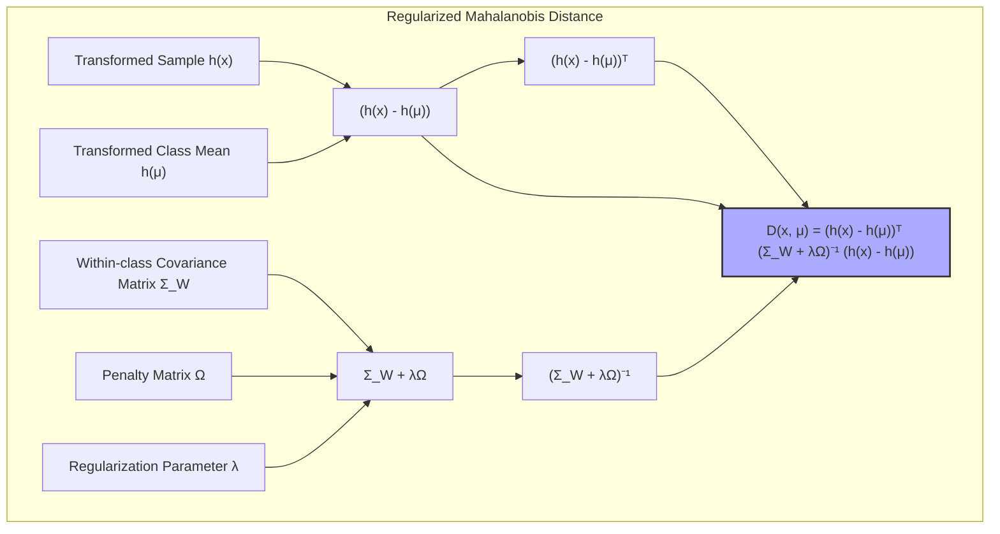
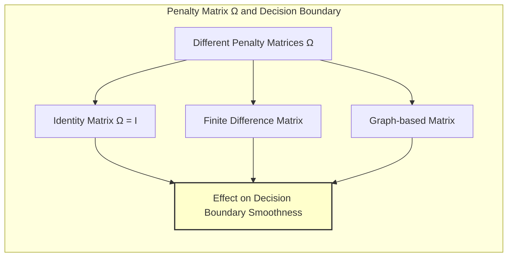
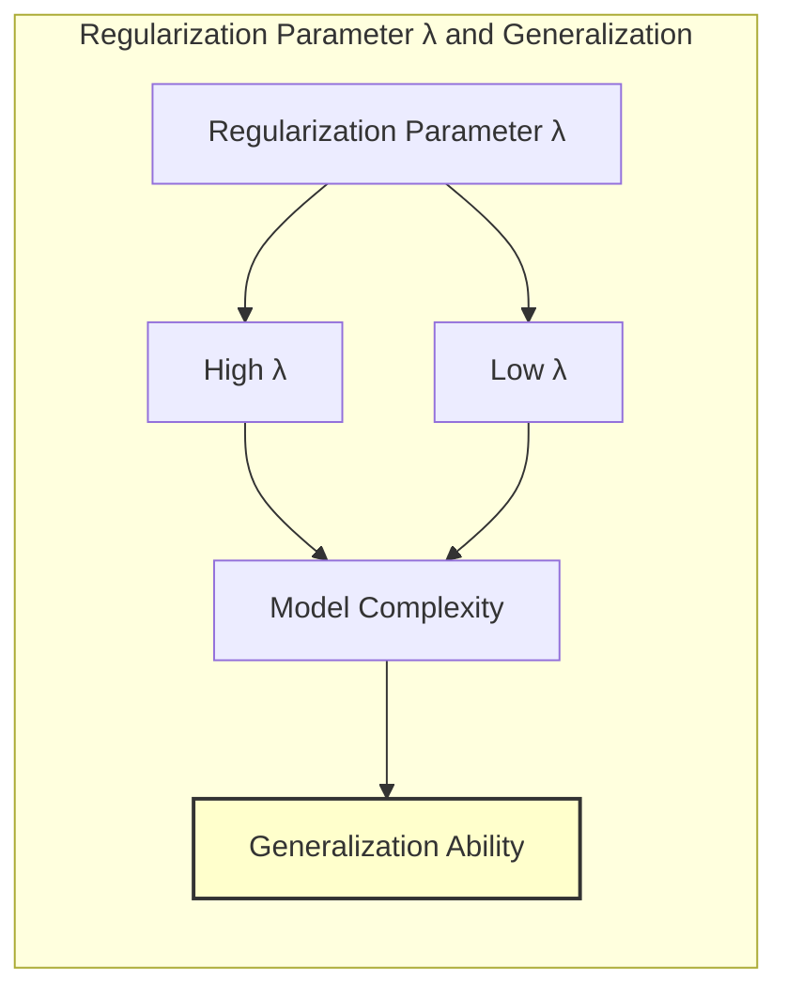
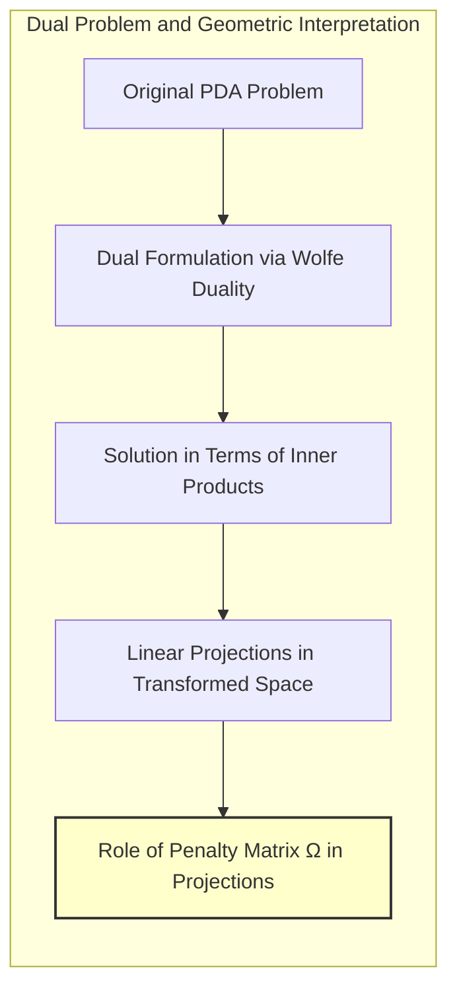

Okay, let's enhance this text with Mermaid diagrams to visualize the concepts.

## Título: Análise Discriminante Penalizada: Imposição de Suavidade com Distância de Mahalanobis Regularizada

### Introdução

Na **Análise Discriminante Penalizada (PDA)**, como explorado em capítulos anteriores, a regularização desempenha um papel fundamental no controle da complexidade do modelo e na estabilidade das soluções, especialmente em problemas de classificação com dados de alta dimensionalidade. Uma abordagem comum para impor regularização em PDA é através da modificação da **distância de Mahalanobis**, utilizando um termo de penalização que incentiva a suavidade dos coeficientes do modelo e impõe restrições sobre a forma da fronteira de decisão.

Neste capítulo, exploraremos em detalhes como a **distância de Mahalanobis regularizada** é utilizada em PDA para impor restrições de suavidade nos coeficientes, analisando como a escolha da matriz de penalização influencia o resultado da otimização e a forma da fronteira de decisão. Discutiremos como a regularização leva a modelos mais robustos e com melhor capacidade de generalização, e como ela pode ser utilizada para lidar com dados correlacionados ou com *outliers*.

A compreensão da utilização da distância de Mahalanobis regularizada e da sua aplicação na PDA fornece uma base teórica e prática para a construção de modelos de classificação eficientes e robustos, especialmente em cenários com dados complexos de alta dimensão.

### A Distância de Mahalanobis Regularizada

**Conceito 1: A Distância de Mahalanobis e a LDA**

A **distância de Mahalanobis** é uma métrica de distância que leva em conta a covariância das variáveis. A distância de Mahalanobis entre uma amostra $x$ e a média da classe $k$, $\mu_k$, é dada por:

$$ d(x, \mu_k) = \sqrt{(x - \mu_k)^T \Sigma^{-1} (x - \mu_k)} $$

onde $\Sigma$ é a matriz de covariância (comum para todas as classes, como assumido na LDA).

Na **Análise Discriminante Linear (LDA)**, a classificação é feita atribuindo a cada amostra a classe cujo centroide tem a menor distância de Mahalanobis. A utilização da distância de Mahalanobis na LDA garante que a distância entre classes seja calculada de forma a ter em conta a variabilidade dos dados.

> 💡 **Exemplo Numérico:**
> Suponha que temos duas classes, com médias $\mu_1 = [1, 1]$ e $\mu_2 = [3, 3]$, e uma matriz de covariância $\Sigma = \begin{bmatrix} 1 & 0.5 \\ 0.5 & 1 \end{bmatrix}$. Vamos calcular a distância de Mahalanobis de um ponto $x = [2, 2]$ a cada uma das médias.
>
> Primeiro, calculamos a inversa de $\Sigma$:
>  $\Sigma^{-1} = \frac{1}{1 - 0.5^2} \begin{bmatrix} 1 & -0.5 \\ -0.5 & 1 \end{bmatrix} = \frac{4}{3}\begin{bmatrix} 1 & -0.5 \\ -0.5 & 1 \end{bmatrix} = \begin{bmatrix} 4/3 & -2/3 \\ -2/3 & 4/3 \end{bmatrix}$
>
> Agora, calculamos a distância para $\mu_1$:
> $d(x, \mu_1) = \sqrt{([2-1, 2-1]) \begin{bmatrix} 4/3 & -2/3 \\ -2/3 & 4/3 \end{bmatrix} [2-1, 2-1]^T} = \sqrt{[1, 1] \begin{bmatrix} 4/3 & -2/3 \\ -2/3 & 4/3 \end{bmatrix} [1, 1]^T} = \sqrt{[1, 1] [2/3, 2/3]^T} = \sqrt{4/3} \approx 1.15$
>
> E para $\mu_2$:
> $d(x, \mu_2) = \sqrt{([2-3, 2-3]) \begin{bmatrix} 4/3 & -2/3 \\ -2/3 & 4/3 \end{bmatrix} [2-3, 2-3]^T} = \sqrt{[-1, -1] \begin{bmatrix} 4/3 & -2/3 \\ -2/3 & 4/3 \end{bmatrix} [-1, -1]^T} = \sqrt{[-1, -1] [-2/3, -2/3]^T} = \sqrt{4/3} \approx 1.15$
>
> Note que o ponto [2,2] está a mesma distância de Mahalanobis das duas médias. A distância de Mahalanobis considera a covariância dos dados, resultando em uma distância diferente da distância euclidiana simples.

**Lemma 1:** A distância de Mahalanobis leva em conta a variabilidade dos dados e é utilizada para calcular a distância entre as amostras e as médias das classes na LDA, o que influencia diretamente o processo de classificação e a separabilidade das classes.

A demonstração desse lemma se baseia na análise da formulação da distância de Mahalanobis e como ela considera a matriz de covariância para o cálculo da distância entre os pontos.

**Conceito 2: Regularização da Distância de Mahalanobis em PDA**

Na **Análise Discriminante Penalizada (PDA)**, a distância de Mahalanobis é modificada com a introdução de um termo de regularização, que tem como objetivo impor restrições de suavidade aos coeficientes do modelo, e, por consequência, nas fronteiras de decisão. A **distância de Mahalanobis regularizada** é definida como:

$$ D(x, \mu) = (h(x) - h(\mu))^T (\Sigma_W + \lambda \Omega)^{-1} (h(x) - h(\mu)) $$

onde:

*   $h(x)$ é a transformação dos dados, por exemplo, aplicando funções de base;
*   $\Sigma_W$ é a matriz de covariância dentro das classes, calculada sobre as *features* transformadas $h(x)$;
*   $\Omega$ é a matriz de penalização, que define como as diferenças nos coeficientes são penalizadas;
*   $\lambda$ é o parâmetro de regularização, que controla a intensidade da penalização.

A matriz de penalização $\Omega$ é utilizada para induzir suavidade nos coeficientes do modelo, evitando variações abruptas e instabilidades. A escolha da matriz $\Omega$ e do parâmetro $\lambda$ é crucial para o desempenho do modelo, e depende da natureza dos dados.

> 💡 **Exemplo Numérico:**
>
> Suponha que após a transformação $h(x)$, temos $\Sigma_W = \begin{bmatrix} 2 & 0.3 \\ 0.3 & 1 \end{bmatrix}$. Vamos usar $\Omega = \begin{bmatrix} 1 & 0 \\ 0 & 1 \end{bmatrix}$ (matriz identidade) e $\lambda = 0.5$.
>
> Então, a matriz regularizada de covariância é:
>
> $\Sigma_W + \lambda \Omega = \begin{bmatrix} 2 & 0.3 \\ 0.3 & 1 \end{bmatrix} + 0.5 \begin{bmatrix} 1 & 0 \\ 0 & 1 \end{bmatrix} = \begin{bmatrix} 2.5 & 0.3 \\ 0.3 & 1.5 \end{bmatrix}$
>
> Calculando a inversa:
>
> $(\Sigma_W + \lambda \Omega)^{-1} = \frac{1}{(2.5)(1.5) - (0.3)^2}\begin{bmatrix} 1.5 & -0.3 \\ -0.3 & 2.5 \end{bmatrix} = \frac{1}{3.66}\begin{bmatrix} 1.5 & -0.3 \\ -0.3 & 2.5 \end{bmatrix} \approx \begin{bmatrix} 0.41 & -0.08 \\ -0.08 & 0.68 \end{bmatrix}$
>
> Agora, se $h(x) = [2, 1]$ e $h(\mu) = [1, 0]$, podemos calcular a distância de Mahalanobis regularizada:
>
> $D(x, \mu) = ([2-1, 1-0]) \begin{bmatrix} 0.41 & -0.08 \\ -0.08 & 0.68 \end{bmatrix} [2-1, 1-0]^T = [1, 1] \begin{bmatrix} 0.41 & -0.08 \\ -0.08 & 0.68 \end{bmatrix} [1, 1]^T = [1, 1] [0.33, 0.60]^T = 0.93$
>
> A regularização altera a matriz de covariância, o que afeta a distância calculada.

**Corolário 1:** A distância de Mahalanobis regularizada incorpora um termo de penalização que controla a complexidade do modelo, induzindo suavidade nos coeficientes e evitando o *overfitting* em dados de alta dimensionalidade.

A demonstração desse corolário se baseia na análise da formulação da distância de Mahalanobis regularizada e como o termo de penalização, que inclui a matriz $\Omega$ e o parâmetro $\lambda$, afeta a solução do problema.

### A Matriz de Penalização $\Omega$ e a Suavidade da Fronteira de Decisão

A matriz de penalização $\Omega$ desempenha um papel crucial na definição da suavidade da fronteira de decisão em PDA. A escolha da matriz $\Omega$ afeta como os coeficientes do modelo são penalizados e, consequentemente, como a fronteira de decisão se adapta aos dados.

Algumas escolhas comuns para a matriz $\Omega$ incluem:

1.  **Matriz Identidade:** Utilizando a matriz identidade, a penalização corresponde à norma L2 dos coeficientes, o que reduz sua magnitude e leva a fronteiras mais estáveis, com os coeficientes menores:
    $$ \Omega = I$$
2.  **Matriz de Diferenças Finitas:** A matriz de diferenças finitas penaliza as diferenças entre coeficientes de *features* vizinhas, induzindo suavidade na fronteira de decisão:
   $$ \Omega_{ij} = \begin{cases}
     1  & \text{se } i = j \\
    -0.5  & \text{se } |i-j| = 1\\
      0  & \text{caso contrário}
  \end{cases} $$

    Essa abordagem é especialmente útil em problemas com dados espaciais ou temporais, onde *features* adjacentes estão correlacionadas e é desejável que os seus coeficientes não apresentem grandes variações.

3.   **Matrizes Baseadas em Grafos:** Nesses casos a matriz $\Omega$ é construída com base em um grafo, que representa as relações entre as variáveis originais, onde os nós representam as variáveis e as arestas representam as relações entre elas. Essa abordagem leva a uma penalização que leva em consideração a estrutura do grafo, com penalidades maiores para componentes mais distantes.

> 💡 **Exemplo Numérico:**
>
> Vamos considerar um caso com 4 features.
>
> 1. **Matriz Identidade:** $\Omega = \begin{bmatrix} 1 & 0 & 0 & 0 \\ 0 & 1 & 0 & 0 \\ 0 & 0 & 1 & 0 \\ 0 & 0 & 0 & 1 \end{bmatrix}$. Esta matriz penaliza a magnitude de cada coeficiente individualmente.
>
> 2.  **Matriz de Diferenças Finitas:**
>
>  $\Omega = \begin{bmatrix} 1 & -0.5 & 0 & 0 \\ -0.5 & 1 & -0.5 & 0 \\ 0 & -0.5 & 1 & -0.5 \\ 0 & 0 & -0.5 & 1 \end{bmatrix}$
>   Esta matriz penaliza as diferenças entre os coeficientes de features adjacentes. Por exemplo, ela penaliza se o coeficiente da feature 1 é muito diferente do coeficiente da feature 2.
>
> Suponha que temos coeficientes $w = [0.8, 0.2, 0.7, 0.3]$.
> A penalização usando a matriz identidade seria: $w^T \Omega w = 0.8^2 + 0.2^2 + 0.7^2 + 0.3^2 = 1.26$.
> A penalização usando a matriz de diferenças finitas seria:
> $w^T \Omega w = [0.8, 0.2, 0.7, 0.3] \begin{bmatrix} 1 & -0.5 & 0 & 0 \\ -0.5 & 1 & -0.5 & 0 \\ 0 & -0.5 & 1 & -0.5 \\ 0 & 0 & -0.5 & 1 \end{bmatrix} [0.8, 0.2, 0.7, 0.3]^T = 0.665$.
> A penalização com diferenças finitas é menor, pois os coeficientes não são tão diferentes entre features adjacentes.

A escolha da matriz $\Omega$ depende da natureza dos dados e do tipo de suavidade desejada. A matriz identidade é utilizada para regularizar a magnitude dos coeficientes, enquanto as matrizes de diferenças finitas e baseadas em grafos são utilizadas para impor suavidade nas fronteiras de decisão.

**Lemma 3:** A escolha da matriz de penalização Ω em PDA afeta a suavidade da fronteira de decisão, onde a matriz identidade penaliza os coeficientes com norma L2, a matriz de diferenças finitas penaliza as mudanças bruscas entre os coeficientes e a matriz baseada em grafos penaliza os coeficientes com base na estrutura do grafo.

A demonstração desse lemma se baseia na análise da forma das diferentes matrizes de penalização e como elas se relacionam com a forma da função de decisão resultante do processo de otimização.

### O Parâmetro de Regularização $\lambda$ e a Generalização

O parâmetro de regularização $\lambda$ controla a intensidade da penalização na distância de Mahalanobis regularizada e tem um impacto direto na **generalização** do modelo. Valores altos de $\lambda$ impõem uma penalização forte sobre os coeficientes, o que leva a modelos mais simples e com fronteiras de decisão mais suaves. Modelos mais simples são menos propensos ao *overfitting*, mas podem apresentar um alto viés, caso não capturem adequadamente as relações entre as *features* e as classes.

Valores baixos de $\lambda$, por outro lado, diminuem a penalização sobre os coeficientes, o que leva a modelos mais complexos e com fronteiras de decisão mais detalhadas. Modelos mais complexos podem se ajustar demais aos dados de treinamento e apresentar *overfitting*.

A escolha do valor apropriado de $\lambda$ é feita através de técnicas de validação cruzada, onde o desempenho do modelo é avaliado com diferentes valores de $\lambda$ e o valor que maximiza o desempenho em dados não vistos é selecionado.

> 💡 **Exemplo Numérico:**
>
> Suponha que estamos treinando um modelo PDA com um conjunto de dados e temos as seguintes métricas de validação cruzada para diferentes valores de $\lambda$:
>
> | $\lambda$ | Acurácia (Validação) |
> |----------|----------------------|
> | 0.01     | 0.82                 |
> | 0.1      | 0.88                 |
> | 1        | 0.91                 |
> | 10       | 0.85                 |
> | 100      | 0.78                 |
>
>  Observamos que a acurácia aumenta até $\lambda = 1$ e depois começa a cair. Isso indica que um valor de $\lambda$ em torno de 1 oferece o melhor equilíbrio entre ajuste e generalização para este conjunto de dados. Um $\lambda$ muito baixo leva ao overfitting, enquanto um $\lambda$ muito alto leva a um modelo com alto viés.

A escolha de $\lambda$ adequado é um compromisso entre o ajuste aos dados de treinamento e a capacidade de generalização, e é crucial para obter um modelo robusto e com boa capacidade de lidar com novos dados.

**Corolário 3:** O parâmetro de regularização $\lambda$ controla a intensidade da penalização e impacta a complexidade da fronteira de decisão e a capacidade de generalização da PDA, e a escolha desse parâmetro depende do equilíbrio entre viés e variância que se deseja obter.

A demonstração desse corolário se baseia na análise do impacto do parâmetro $\lambda$ na função de custo da PDA e como a escolha desse parâmetro afeta a estrutura da solução ótima do modelo, com a busca por um equilíbrio entre ajuste e complexidade.

### Conexão com o Problema Dual e a Interpretação Geométrica

A aplicação da dualidade de Wolfe na formulação da PDA leva a um problema dual, que permite expressar a solução em termos de produtos internos e de um espaço de projeções lineares sobre os dados. No entanto, a formulação e solução explícita do problema dual de PDA é mais complexa do que em SVMs.

A matriz de penalização $\Omega$ desempenha um papel importante na formulação do problema dual e define como os autovetores generalizados são calculados, e como o termo de penalização afeta o espaço transformado. A solução do problema dual da PDA envolve a obtenção das projeções que maximizam a separabilidade entre classes, ao mesmo tempo em que respeitam a penalização definida pela matriz $\Omega$ e o parâmetro $\lambda$.

Essa análise permite entender a importância da matriz de penalização na construção da solução do problema e como a interpretação geométrica da regularização na PDA é importante para entender o comportamento do modelo. A interpretação geométrica das projeções que a PDA gera, mostra como os autovalores definem a separabilidade das classes sobre o espaço projetado, o que é análogo ao que ocorre na LDA.

**Corolário 4:** A formulação dual da PDA permite expressar o problema em termos de produtos internos e revela a importância da matriz de penalização Ω na definição das projeções e na forma da fronteira de decisão.

A demonstração desse corolário se baseia na análise da formulação dual da PDA e como a matriz de penalização é incorporada no processo de otimização, definindo um espaço de projeção que é sensível à estrutura dos dados.

### Conclusão

Neste capítulo, exploramos em detalhes a utilização da **distância de Mahalanobis regularizada** na **Análise Discriminante Penalizada (PDA)**, e como a matriz de penalização e o parâmetro de regularização são utilizados para controlar a complexidade do modelo e a forma da fronteira de decisão. Vimos como a PDA surge como uma extensão da LDA que visa lidar com os problemas de instabilidade e *overfitting* em espaços de alta dimensionalidade, e como a utilização de um termo de regularização na distância de Mahalanobis leva a modelos mais robustos e com melhor capacidade de generalização.

Analisamos também como a escolha da matriz de penalização $\Omega$ permite induzir diferentes tipos de suavidade na fronteira de decisão, e como o parâmetro de regularização $\lambda$ controla a intensidade da penalização, o que leva a diferentes modelos.

A compreensão da distância de Mahalanobis regularizada e do papel da matriz de penalização é fundamental para a aplicação bem-sucedida da PDA em problemas de classificação com dados complexos e de alta dimensionalidade.

### Footnotes

[^12.1]: "In this chapter we describe generalizations of linear decision boundaries for classification. Optimal separating hyperplanes are introduced in Chapter 4 for the case when two classes are linearly separable. Here we cover extensions to the nonseparable case, where the classes overlap. These techniques are then generalized to what is known as the support vector machine, which produces nonlinear boundaries by constructing a linear boundary in a large, transformed version of the feature space." *(Trecho de  "Support Vector Machines and Flexible Discriminants")*

[^12.4]: "Often LDA produces the best classification results, because of its simplicity and low variance. LDA was among the top three classifiers for 11 of the 22 datasets studied in the STATLOG project (Michie et al., 1994)3." *(Trecho de  "Support Vector Machines and Flexible Discriminants")*

[^12.5]:  "In this section we describe a method for performing LDA using linear re-gression on derived responses." *(Trecho de "Support Vector Machines and Flexible Discriminants")*

[^12.6]: "Although FDA is motivated by generalizing optimal scoring, it can also be viewed directly as a form of regularized discriminant analysis. Suppose the regression procedure used in FDA amounts to a linear regression onto a basis expansion h(X), with a quadratic penalty on the coefficients" *(Trecho de "Support Vector Machines and Flexible Discriminants")*
