Okay, let's enhance the text with practical numerical examples to solidify the understanding of Mixture Discriminant Analysis (MDA).

## Título: Análise Discriminante por Misturas (MDA): Generalização da LDA com Modelos de Mistura Gaussianas


### Introdução

A **Análise Discriminante Linear (LDA)**, como vimos, assume que cada classe segue uma distribuição gaussiana multivariada com um centroide e uma matriz de covariância comum entre as classes. Essa premissa, embora simplifique a formulação do modelo, pode ser limitante em cenários onde as classes apresentam distribuições complexas, com múltiplos agrupamentos ou formas não unimodais. A **Análise Discriminante por Misturas (MDA)** surge como uma generalização da LDA, visando superar essa limitação através da utilização de **modelos de mistura gaussianas** para representar cada classe.

Neste capítulo, exploraremos em detalhe a formulação da MDA e como ela se diferencia da LDA, com foco em como os modelos de mistura gaussianas são utilizados para modelar as distribuições das classes, como o **algoritmo Expectation-Maximization (EM)** é utilizado para estimar os parâmetros do modelo, e como a classificação é realizada com base nesses modelos. Analisaremos também como a MDA se relaciona com outras técnicas de modelagem de mistura e como ela oferece uma abordagem mais flexível e robusta para lidar com dados complexos.

A compreensão da formulação da MDA e de seu processo de otimização é fundamental para a aplicação bem-sucedida desse método em problemas de classificação com dados que não seguem uma distribuição gaussiana simples.

### Modelagem de Classes com Misturas Gaussianas em MDA

**Conceito 1: O Modelo de Mistura Gaussiana**

A principal característica da **Análise Discriminante por Misturas (MDA)** é a utilização de **modelos de mistura gaussianas** para representar a distribuição de cada classe. Em vez de assumir que cada classe segue uma única distribuição gaussiana, como na LDA, a MDA assume que cada classe é uma mistura de $R_k$ gaussianas, onde $R_k$ é o número de componentes na mistura da classe $k$.

The probability density of a sample $x$ belonging to class $k$ is given by:

$$ P(x | G=k) = \sum_{r=1}^{R_k} \pi_{kr} \phi(x; \mu_{kr}, \Sigma) $$

onde:

*   $\pi_{kr}$ são as **proporções da mistura**, representando a probabilidade de uma amostra pertencer ao componente $r$ da classe $k$, e satisfazem $\sum_{r=1}^{R_k} \pi_{kr} = 1$.
*   $\phi(x; \mu_{kr}, \Sigma)$ é a densidade de probabilidade de uma distribuição gaussiana multivariada, com média $\mu_{kr}$ e uma matriz de covariância comum $\Sigma$ entre todos os componentes, e entre todas as classes.

The covariance matrix $\Sigma$ is shared by all components and classes, with the objective of modeling the dispersion of all data around their centers, but other options of models with non-shared or non-isotropic covariances can be used, although they will not be explored in this text.

This approach allows MDA to model classes with more complex distributions and multiple groupings, which could not be adequately modeled with a single Gaussian distribution.

> 💡 **Exemplo Numérico:**
>
> Suppose we have a class (k=1) that represents a type of flower, and we observe that it has two distinct subspecies. We can model this class using a GMM with two components (R_1 = 2). Let's say that after training the model, we obtained the following parameters:
>
> *   $\pi_{11} = 0.6$ (proportion of the first subspecies)
> *   $\pi_{12} = 0.4$ (proportion of the second subspecies)
> *   $\mu_{11} = [5, 2]$ (mean of the first subspecies)
> *   $\mu_{12} = [7, 4]$ (mean of the second subspecies)
> *   $\Sigma = \begin{bmatrix} 1 & 0.5 \\ 0.5 & 1 \end{bmatrix}$ (common covariance matrix)
>
> If we have a sample $x = [6, 3]$, we can calculate the probability of x belonging to class k=1:
>
>  $P(x | G=1) = \pi_{11} \phi(x; \mu_{11}, \Sigma) + \pi_{12} \phi(x; \mu_{12}, \Sigma)$
>
>  To calculate $\phi(x; \mu_{kr}, \Sigma)$, we use the multivariate Gaussian density formula:
>
>  $\phi(x; \mu, \Sigma) = \frac{1}{(2\pi)^{D/2} |\Sigma|^{1/2}} \exp\left(-\frac{1}{2} (x - \mu)^T \Sigma^{-1} (x - \mu)\right)$
>
>  Where D is the dimensionality of the data (in this case, D=2).
>
> First, we calculate the inverses and the determinant of $\Sigma$:
>
>  $\Sigma^{-1} = \frac{1}{0.75} \begin{bmatrix} 1 & -0.5 \\ -0.5 & 1 \end{bmatrix} = \begin{bmatrix} 1.33 & -0.67 \\ -0.67 & 1.33 \end{bmatrix}$
>  $|\Sigma| = 1 * 1 - 0.5 * 0.5 = 0.75$
>
>  Now, we calculate the exponential terms for each component:
>
>  $(x - \mu_{11})^T \Sigma^{-1} (x - \mu_{11}) = \begin{bmatrix} 1 & 1 \end{bmatrix} \begin{bmatrix} 1.33 & -0.67 \\ -0.67 & 1.33 \end{bmatrix} \begin{bmatrix} 1 \\ 1 \end{bmatrix} = 1.33 - 0.67 - 0.67 + 1.33 = 1.32$
>
>  $(x - \mu_{12})^T \Sigma^{-1} (x - \mu_{12}) = \begin{bmatrix} -1 & -1 \end{bmatrix} \begin{bmatrix} 1.33 & -0.67 \\ -0.67 & 1.33 \end{bmatrix} \begin{bmatrix} -1 \\ -1 \end{bmatrix} = 1.33 - 0.67 - 0.67 + 1.33 = 1.32$
>
>  $\phi(x; \mu_{11}, \Sigma) = \frac{1}{2\pi * \sqrt{0.75}} \exp(-1.32/2) \approx 0.207$
>  $\phi(x; \mu_{12}, \Sigma) = \frac{1}{2\pi * \sqrt{0.75}} \exp(-1.32/2) \approx 0.207$
>
>  $P(x | G=1) = 0.6 * 0.207 + 0.4 * 0.207 = 0.207$
>
>  This result indicates the probability of observing the sample *x* given that it belongs to class 1, considering the mixture of two Gaussians.

**Lemma 1:** MDA models the distribution of each class as a mixture of Gaussians with specific parameters for each component, which allows to represent complex classes with multiple subgroups.

The proof of this lemma is based on the analysis of the definition of the Gaussian mixture model and how it is used to represent the probability density of each class as a linear combination of Gaussians, where each Gaussian represents a distinct structure.

```mermaid
graph LR
    subgraph "MDA Class Modeling"
        direction TB
        A["Class Density P(x|G=k)"]
        B["Mixture Components (R_k)"]
        C["Mixing Proportions (π_kr)"]
        D["Gaussian Densities φ(x;μ_kr,Σ)"]
        A --> B
        A --> C
        A --> D
        B & C & D --> E["Linear Combination"]
    end
    style A fill:#f9f,stroke:#333,stroke-width:2px
    style E fill:#ccf,stroke:#333,stroke-width:2px
```



**Conceito 2: O Número de Componentes Gaussianas**

The number of Gaussian components $R_k$ in each class is a **hyperparameter** of MDA that controls the complexity of the model. A larger number of Gaussian components allows the model to adapt to more complex distributions, but also increases the risk of *overfitting*. The choice of the appropriate number of components for each class is a model selection problem, where it is important to consider the trade-off between the model's flexibility and its ability to generalize.

The choice of $R_k$ can be made empirically, using cross-validation and model selection criteria, or, in some approaches, the different components can be selected through hierarchical learning techniques.

> 💡 **Exemplo Numérico:**
>
> Imagine we are classifying different types of fruits. The "apple" class may have a relatively simple distribution, requiring only 1 or 2 Gaussian components (R_apple = 1 or 2). The "banana" class may have a more complex distribution, with different sizes and curvatures, requiring 3 or 4 components (R_banana = 3 or 4). If we use a very small number of components for the banana, the model will not be able to capture the variability within the class, resulting in a poor fit (underfitting). If we use a very large number, the model may fit to the noise in the training data, losing generalization ability (overfitting). The ideal choice of R_k for each class should be made with cross-validation, comparing the performance of the model with different numbers of components.

**Corolário 1:** The number of Gaussian components in MDA controls the complexity of the model and should be chosen considering the trade-off between fitting the training data and the ability to generalize.

The proof of this corollary is based on the analysis of the influence of the number of Gaussian components on the ability of the model to represent the characteristics of the distribution of each class.

### O Algoritmo Expectation-Maximization (EM) para MDA


The **Expectation-Maximization (EM) algorithm** is an iterative method used to estimate the parameters of Gaussian mixture models, and is also used to adjust the parameters of MDA. The EM algorithm alternates between two steps:

1.  **E-step (Expectation):** In the E-step, given the current parameters of the model, we calculate the probability of each sample $x_i$ belonging to each Gaussian component $r$ of class $k$. This probability is known as the **responsibility** and is calculated using the following equation:

    $$ w_{ikr} = \frac{\pi_{kr} \phi(x_i; \mu_{kr}, \Sigma)}{\sum_{r'=1}^{R_k} \pi_{kr'} \phi(x_i; \mu_{kr'}, \Sigma) } $$

    where $w_{ikr}$ represents the responsibility of component $r$ of class $k$ for sample $x_i$.

2.  **M-step (Maximization):** In the M-step, the model parameters (means $\mu_{kr}$, mixture proportions $\pi_{kr}$ and covariance matrix $\Sigma$) are updated, maximizing the likelihood function of the data, given the responsibilities calculated in the E-step:

    $$ \mu_{kr}^{new} = \frac{\sum_{i=1}^N w_{ikr} x_i}{\sum_{i=1}^N w_{ikr}} $$

    $$ \pi_{kr}^{new} = \frac{1}{N_k} \sum_{i \in C_k} w_{ikr} $$

    $$ \Sigma^{new} = \frac{1}{N} \sum_{k=1}^{K} \sum_{i \in C_k} \sum_{r=1}^{R_k} w_{ikr} (x_i - \mu_{kr}^{new}) (x_i - \mu_{kr}^{new})^T $$

where $N_k$ is the number of samples in class $k$ and $N$ is the total number of samples.
The EM algorithm iterates between the E-step and the M-step until the model parameters converge.

> 💡 **Exemplo Numérico:**
>
> Suppose we have a class with two Gaussian components (R_k = 2) and two samples, $x_1 = [2, 2]$ and $x_2 = [6, 6]$. We initialize the model parameters:
>
> *   $\pi_{k1} = 0.5$, $\pi_{k2} = 0.5$
> *   $\mu_{k1} = [1, 1]$, $\mu_{k2} = [7, 7]$
> *   $\Sigma = \begin{bmatrix} 1 & 0 \\ 0 & 1 \end{bmatrix}$
>
> **E-step (Expectation):**
>
> Let's calculate the responsibilities $w_{ikr}$ for each sample and component. For simplicity, we will only use the exponential part of the Gaussian, since the normalization term is the same for both components in the same sample:
>
> $exp_1 = \exp(-0.5 * (x_1 - \mu_{k1})^T \Sigma^{-1} (x_1 - \mu_{k1})) = \exp(-0.5 * [1, 1] [1, 0; 0, 1] [1, 1]^T) = \exp(-1) \approx 0.368$
> $exp_2 = \exp(-0.5 * (x_1 - \mu_{k2})^T \Sigma^{-1} (x_1 - \mu_{k2})) = \exp(-0.5 * [-5, -5] [1, 0; 0, 1] [-5, -5]^T) = \exp(-25) \approx 1.38e-11$
>
> $exp_3 = \exp(-0.5 * (x_2 - \mu_{k1})^T \Sigma^{-1} (x_2 - \mu_{k1})) = \exp(-0.5 * [5, 5] [1, 0; 0, 1] [5, 5]^T) = \exp(-25) \approx 1.38e-11$
> $exp_4 = \exp(-0.5 * (x_2 - \mu_{k2})^T \Sigma^{-1} (x_2 - \mu_{k2})) = \exp(-0.5 * [-1, -1] [1, 0; 0, 1] [-1, -1]^T) = \exp(-1) \approx 0.368$
>
> $w_{111} = \frac{0.5 * 0.368}{0.5 * 0.368 + 0.5 * 1.38e-11} \approx 1$
> $w_{112} = \frac{0.5 * 1.38e-11}{0.5 * 0.368 + 0.5 * 1.38e-11} \approx 0$
>
> $w_{211} = \frac{0.5 * 1.38e-11}{0.5 * 1.38e-11 + 0.5 * 0.368} \approx 0$
> $w_{212} = \frac{0.5 * 0.368}{0.5 * 1.38e-11 + 0.5 * 0.368} \approx 1$
>
> **M-step (Maximization):**
>
> $\mu_{k1}^{new} = \frac{w_{111}x_1 + w_{211}x_2}{w_{111}+ w_{211}} = \frac{1 * [2, 2] + 0 * [6, 6]}{1 + 0} = [2, 2]$
> $\mu_{k2}^{new} = \frac{w_{112}x_1 + w_{212}x_2}{w_{112}+ w_{212}} = \frac{0 * [2, 2] + 1 * [6, 6]}{0 + 1} = [6, 6]$
>
> $\pi_{k1}^{new} = \frac{w_{111} + w_{211}}{2} = \frac{1 + 0}{2} = 0.5$
> $\pi_{k2}^{new} = \frac{w_{112} + w_{212}}{2} = \frac{0 + 1}{2} = 0.5$
>
> $\Sigma^{new}$ would be calculated in the same way, with a weighted sum of deviations from the means, but we will keep the initial covariance matrix to simplify this example.
>
> After one iteration, the means were updated closer to the data, and the EM algorithm continues until convergence.

**Lemma 3:** The EM algorithm is an iterative method for fitting the parameters of Gaussian mixture models, which guarantees that the likelihood of the data increases with each iteration until it converges to a local maximum.

The proof of this lemma is based on the analysis of the iterative process of the EM algorithm and how the E and M steps are designed to increase the likelihood of the data with each iteration.

### Classificação com MDA e a Função de Decisão


After adjusting the MDA model parameters using the EM algorithm, the classification of a new sample $x$ is done using the posterior probability of $x$ belonging to class $k$:

$$ P(G=k | x) = \frac{P(x|G=k)P(G=k)}{P(x)} $$

where:

*   $P(x|G=k)$ is the probability density of $x$ given that it belongs to class $k$, which is defined by the Gaussian mixture model of class $k$:
    $$ P(x|G=k) = \sum_{r=1}^{R_k} \pi_{kr} \phi(x; \mu_{kr}, \Sigma) $$
*   $P(G=k)$ is the *a priori* probability of class $k$.
*  $P(x)$ is the marginal probability of $x$, which does not depend on class $k$ and does not alter the classification result.

Sample $x$ is classified into the class $k$ that maximizes the *a posteriori* probability.

This decision function uses the probability of each class generating the data, and combines it with the *a priori* probability of each class, generating a criterion that maximizes the plausibility of the association of the sample with the class.

> 💡 **Exemplo Numérico:**
>
>  Suppose we have two classes (k=1 and k=2) with the following characteristics after training:
>
>  **Class 1 (G=1):**
>  *   $R_1 = 2$ (two Gaussian components)
>  *   $\pi_{11} = 0.6$, $\pi_{12} = 0.4$
>  *   $\mu_{11} = [2, 2]$, $\mu_{12} = [4, 4]$
>
>  **Class 2 (G=2):**
>  *   $R_2 = 1$ (one Gaussian component)
>  *   $\pi_{21} = 1$
>  *   $\mu_{21} = [7, 7]$
>  *   $\Sigma$ (common covariance matrix between classes, already calculated)
>
>  And the prior probabilities: $P(G=1) = 0.6$, $P(G=2) = 0.4$.
>
> Let's classify a new sample $x = [3, 3]$. We have already calculated the Gaussian density in the previous example, we will use a simplified value $\phi(x; \mu, \Sigma)$.
>
>  *   $\phi(x; \mu_{11}, \Sigma) \approx 0.3$
>  *   $\phi(x; \mu_{12}, \Sigma) \approx 0.2$
>  *   $\phi(x; \mu_{21}, \Sigma) \approx 0.05$
>
>  We calculate the conditional probability of $x$ given each class:
>
>  $P(x|G=1) = \pi_{11} \phi(x; \mu_{11}, \Sigma) + \pi_{12} \phi(x; \mu_{12}, \Sigma) = 0.6 * 0.3 + 0.4 * 0.2 = 0.26$
>  $P(x|G=2) = \pi_{21} \phi(x; \mu_{21}, \Sigma) = 1 * 0.05 = 0.05$
>
>  Now, we calculate the posterior probability:
>
>  $P(G=1|x) = \frac{P(x|G=1)P(G=1)}{P(x)} = \frac{0.26 * 0.6}{P(x)}$
>  $P(G=2|x) = \frac{P(x|G=2)P(G=2)}{P(x)} = \frac{0.05 * 0.4}{P(x)}$
>
>  Since $P(x)$ is common to both equations, we can compare the numerators:
>
>  $P(G=1|x) \propto 0.26 * 0.6 = 0.156$
>  $P(G=2|x) \propto 0.05 * 0.4 = 0.02$
>
>  Since $P(G=1|x)$ is greater, we classify the sample *x* into class 1.

**Corolário 2:** Classification in MDA is done using the posterior probability, calculated based on the Gaussian mixture models and the prior probabilities of the classes, allowing each sample to be classified in the most probable class.

The proof of this corollary is based on the analysis of the decision function and how it is constructed according to Bayes' rule, using the properties of the mixture model to determine the most probable class for each sample.

### Conexão com LDA e Vantagens da MDA


The **Mixture Discriminant Analysis (MDA)** can be seen as a generalization of the **Linear Discriminant Analysis (LDA)**. While LDA assumes that each class follows a single Gaussian distribution with a common covariance matrix, MDA models each class as a mixture of Gaussians with a common covariance matrix.

The main advantages of MDA over LDA are:

1.  **Modeling Complex Distributions:** MDA allows modeling classes with more complex distributions, including classes with multiple groupings or non-unimodal shapes. LDA, on the other hand, is limited by its assumption that each class follows a single Gaussian distribution, which can lead to inadequate models when the distribution of the classes does not fit this assumption.

2.  **Multiple Prototypes per Class:** MDA represents each class with multiple prototypes (the centers of the Gaussian components), which allows the model to better capture the structure of the classes, especially in datasets with heterogeneous classes. LDA uses only one prototype (the centroid) per class, which may be insufficient to represent the complexity of classes with complex structures.

3.   **Bias Reduction and Better Generalization:** The ability to model the classes with multiple prototypes and the flexibility of MDA allow the model to obtain results with less bias compared to LDA. By reducing bias in the training data, MDA also has better performance and generalization ability.

> 💡 **Exemplo Comparativo:**
>
> Suppose we have a classification problem with two classes. Class 1 has a bimodal distribution, with data concentrated in two distinct regions of the attribute space. Class 2 has a unimodal distribution.
>
> *   **LDA:** LDA would fit a single Gaussian for each class. For class 1, the Gaussian would have to cover both regions, resulting in a model that does not represent the data well, with high overlap between the classes.
> *   **MDA:** MDA would fit two Gaussians for class 1, one for each region, and one Gaussian for class 2. This would allow the model to represent each class more accurately, resulting in better classification.
>
> The following diagram illustrates the difference:
>
> ```mermaid
>  graph LR
>      A[Classe 1 (Bimodal)] -->|LDA| B(Gaussiana Única);
>      A -->|MDA| C(2 Gaussianas);
>      D[Classe 2 (Unimodal)] -->|LDA/MDA| E(Gaussiana Única);
>
> style B fill:#f9f,stroke:#333,stroke-width:2px
> style C fill:#ccf,stroke:#333,stroke-width:2px
> style E fill:#cfc,stroke:#333,stroke-width:2px
> ```
>
> In terms of performance, if we evaluate the accuracy in classifying a test set, MDA will perform better than LDA, since MDA can better adjust to the complexity of the data.

**Corolário 3:** MDA generalizes LDA by modeling each class as a mixture of Gaussians, allowing to build models with a greater capacity to represent the complex characteristics of the data and overcome some of the limitations of LDA.

The proof of this corollary is based on the comparative analysis of the formulation of LDA and MDA and how the use of Gaussian mixture models leads to more flexible models capable of dealing with complex data.

### Conclusão

In this chapter, we explored in detail the **Mixture Discriminant Analysis (MDA)**, a generalization of LDA that uses **Gaussian mixture models** to model the distribution of each class. We saw how MDA allows each class to be represented by multiple prototypes, overcoming the limitation of LDA to use only one centroid per class.

We analyzed how the Expectation-Maximization (EM) algorithm is used to estimate the parameters of the MDA model and how the samples are classified using the posterior probability, calculated from the Gaussian mixture models and the *a priori* probabilities of the classes. We also discussed the advantages of MDA over LDA, highlighting its ability to model more complex distributions and to deal with classes with multiple subgroups.

The understanding of the formulation of MDA and its practical aspects is fundamental for the successful application of this method in classification problems with complex data. The ability to handle data with non-Gaussian distributions makes MDA an interesting alternative to LDA in many practical situations, and allows the limitations of LDA to be overcome.

### Footnotes

[^12.1]: "In this chapter we describe generalizations of linear decision boundaries for classification. Optimal separating hyperplanes are introduced in Chapter 4 for the case when two classes are linearly separable. Here we cover extensions to the nonseparable case, where the classes overlap. These techniques are then generalized to what is known as the support vector machine, which produces nonlinear boundaries by constructing a linear boundary in a large, transformed version of the feature space." *(Trecho de  "Support Vector Machines and Flexible Discriminants")*

[^12.2]: "In Chapter 4 we discussed a technique for constructing an optimal separating hyperplane between two perfectly separated classes. We review this and generalize to the nonseparable case, where the classes may not be separable by a linear boundary." *(Trecho de  "Support Vector Machines and Flexible Discriminants")*
[^12.4]: "In the remainder of this chapter we describe a class of techniques that attend to all these issues by generalizing the LDA model. This is achieved largely by three different ideas." *(Trecho de  "Support Vector Machines and Flexible Discriminants")*
[^12.7]: "Linear discriminant analysis can be viewed as a prototype classifier. Each class is represented by its centroid, and we classify to the closest using an appropriate metric. In many situations a single prototype is not sufficient to represent inhomogeneous classes, and mixture models are more appropriate. In this section we review Gaussian mixture models and show how they can be generalized via the FDA and PDA methods discussed earlier. A Gaussian mixture model for the kth class has density" *(Trecho de "Support Vector Machines and Flexible Discriminants")*
