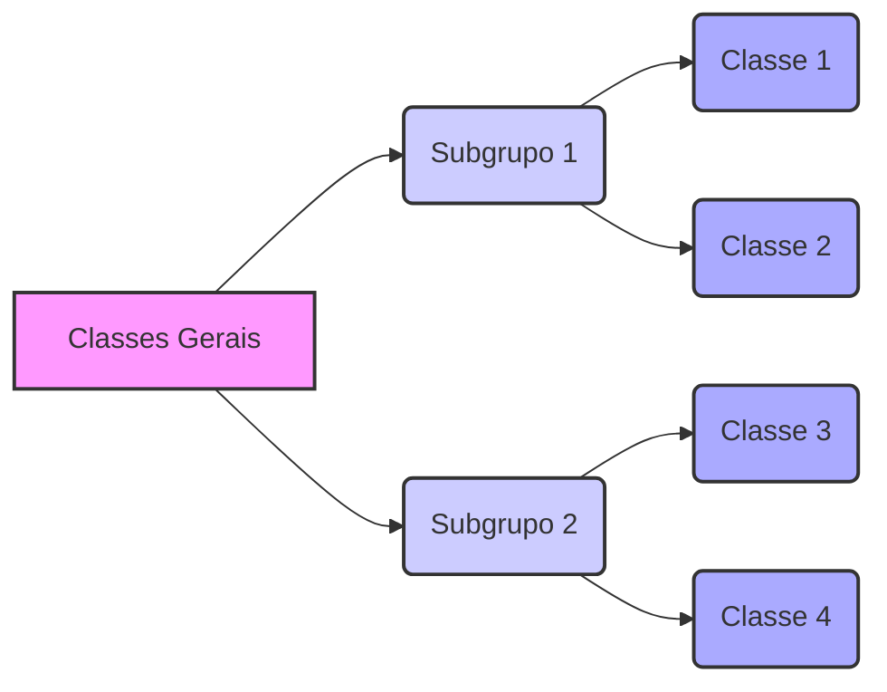
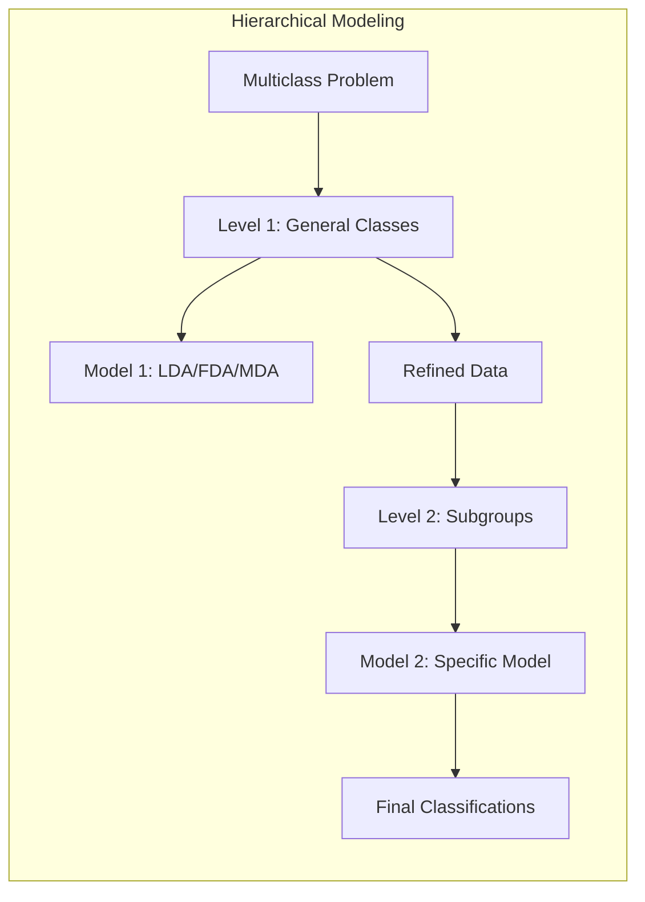
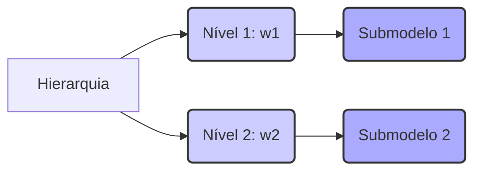
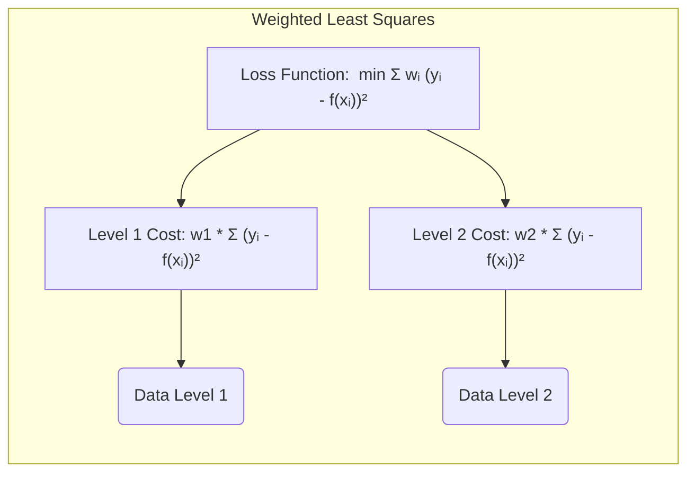
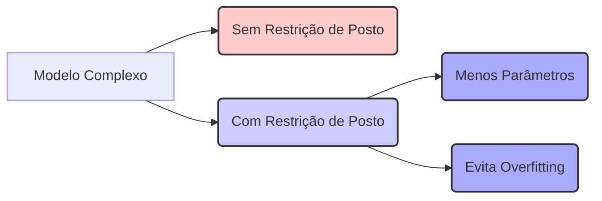
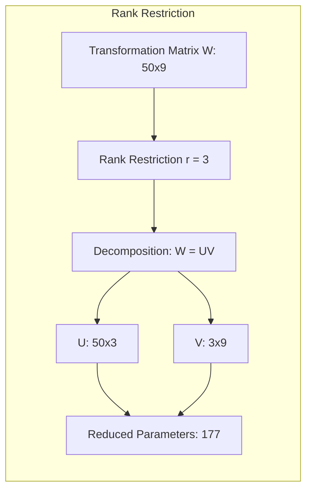
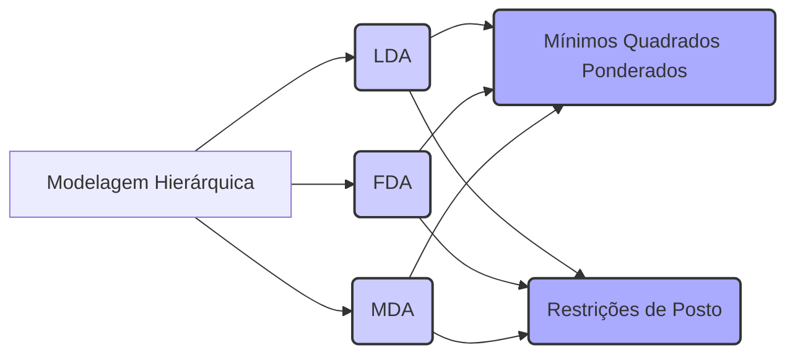
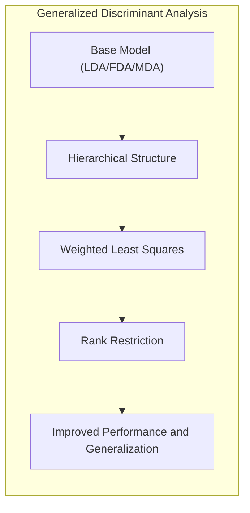

Okay, let's enhance the provided text with practical numerical examples to solidify the theoretical concepts.

## Título: Modelagem Hierárquica com Mínimos Quadrados Ponderados e Restrições de Posto em Classificação Multiclasse

### Introdução

Em problemas de classificação **multiclasse**, onde há mais de duas classes, a modelagem da relação entre as *features* e os rótulos das classes pode se tornar complexa. A utilização de **modelos hierárquicos** oferece uma abordagem para lidar com essa complexidade, decompondo as classes em subgrupos, o que permite que o modelo capture relações mais refinadas entre as *features* e os diferentes níveis da hierarquia.

Neste capítulo, exploraremos como a modelagem hierárquica pode ser utilizada em conjunto com **mínimos quadrados ponderados** e **restrições de posto** para construir modelos de classificação multiclasse mais eficientes e interpretabilidade. Analisaremos como os pesos ponderados são utilizados para adaptar o modelo a diferentes níveis da hierarquia, e como as restrições de posto controlam a complexidade do modelo e evitam o *overfitting*. Discutiremos também como essas técnicas se relacionam com a **Análise Discriminante Linear (LDA)** e suas extensões (FDA e MDA), e como elas podem ser utilizadas para melhorar o desempenho e a capacidade de generalização em problemas de classificação multiclasse.

A compreensão da modelagem hierárquica e da utilização de mínimos quadrados ponderados e restrições de posto é fundamental para a construção de modelos de classificação mais robustos e com melhor capacidade de adaptação a dados complexos.

### Modelagem Hierárquica e Decomposição de Classes

**Conceito 1: A Hierarquia nas Classes**

Em muitos problemas de classificação multiclasse, as classes podem ser organizadas em uma **hierarquia**, onde classes mais gerais são compostas por classes mais específicas. Por exemplo, em um problema de classificação de animais, podemos ter classes gerais como "mamíferos", "aves" e "répteis", e cada uma dessas classes pode ser dividida em subgrupos mais específicos, como "cães", "gatos" e "ursos" dentro de mamíferos, ou "corujas", "pardais" e "gaivotas" dentro de aves.

A **modelagem hierárquica** busca explorar essa estrutura, utilizando diferentes modelos para cada nível da hierarquia. Essa abordagem pode levar a modelos mais precisos e interpretáveis, pois permite que o modelo capture as relações específicas entre as *features* e os diferentes níveis de classes.

A hierarquia pode ser definida explicitamente a partir do conhecimento sobre o problema, ou implicitamente através da análise dos dados. As diferentes opções para hierarquizar as classes permite criar um modelo mais adaptado e com maior capacidade de generalização.

**Lemma 1:** A modelagem hierárquica decompõe as classes em subgrupos, permitindo que o modelo capture relações mais refinadas entre as *features* e os diferentes níveis da hierarquia.

A demonstração desse lemma se baseia na análise da estrutura hierárquica e como essa estrutura permite que diferentes modelos, com diferentes graus de complexidade e flexibilidade, sejam ajustados aos diferentes níveis da hierarquia.

**Conceito 2: Modelagem em Múltiplos Níveis**

A modelagem hierárquica permite que os problemas de classificação sejam decompostos em uma série de **problemas de classificação em múltiplos níveis**. O primeiro nível, por exemplo, pode ser modelar as classes gerais, e os níveis subsequentes podem refinar a classificação em subgrupos mais específicos.

Essa abordagem oferece maior flexibilidade na modelagem, permitindo que os modelos mais simples sejam utilizados para separar classes com maior diferenciação e os modelos mais complexos para separar classes mais sobrepostas. A definição da arquitetura da modelagem hierárquica e a decisão de quais modelos utilizar em cada nível podem ser feitas com base em análise da estrutura dos dados e da natureza do problema.

> 💡 **Exemplo Numérico:**
>
> Imagine um problema de classificação de frutas com três classes gerais: "Cítricas", "Bagas" e "Outras". Em um nível hierárquico inferior, "Cítricas" pode ser dividida em "Laranjas" e "Limões", enquanto "Bagas" pode ser dividida em "Morangos" e "Mirtilos".
>
> No primeiro nível, um modelo simples (e.g., LDA) pode ser usado para separar "Cítricas", "Bagas" e "Outras" com base em *features* como cor e tamanho. No segundo nível, modelos mais específicos (e.g., FDA) podem ser usados dentro de cada grupo para distinguir entre "Laranjas" e "Limões" ou "Morangos" e "Mirtilos" usando *features* adicionais como acidez e doçura.
>
> Essa abordagem multinível permite que o modelo capture sutilezas que seriam perdidas em um modelo de classificação direta com todas as classes juntas.

**Corolário 1:** A modelagem hierárquica permite modelar diferentes níveis de complexidade na estrutura das classes, utilizando diferentes modelos para cada nível da hierarquia, e essa abordagem leva a modelos mais eficientes e com melhor capacidade de lidar com a complexidade das estruturas das classes.

A demonstração desse corolário se baseia na análise da natureza hierárquica e como essa hierarquia é utilizada para decompor o problema de classificação em subproblemas mais simples, cada um com um modelo mais adequado.

### Mínimos Quadrados Ponderados e a Relevância de Cada Nível

Nos modelos hierárquicos, o método dos **mínimos quadrados ponderados** pode ser utilizado para levar em consideração a importância de cada nível da hierarquia no processo de modelagem. Ao atribuir pesos diferentes a cada nível, podemos dar maior importância a alguns níveis em relação a outros, o que pode ser útil quando um nível da hierarquia tem maior impacto no desempenho do modelo, ou quando os erros em um nível específico são mais críticos do que em outros.

Formalmente, o critério de otimização do método dos mínimos quadrados ponderados pode ser expresso como:

$$ \min_{\beta} \sum_{i=1}^{N} w_i (y_i - f(x_i))^2 $$

onde $w_i$ são os pesos associados a cada amostra $x_i$, que dependem de qual nível da hierarquia é utilizada para a análise. Ao utilizar pesos diferentes para cada nível, podemos dar maior importância às amostras dos níveis que são mais importantes ou que são mais relevantes para o problema de classificação.

A escolha dos pesos $w_i$ pode ser feita de diversas formas, como por exemplo:

*   Atribuir pesos maiores aos níveis mais altos da hierarquia, indicando que a separação entre classes gerais é mais importante do que a separação entre classes mais específicas.
*   Atribuir pesos maiores aos níveis onde a informação é mais confiável ou onde o desempenho do modelo é mais sensível.
*   Utilizar técnicas de validação cruzada para ajustar os valores dos pesos, e encontrar um equilíbrio entre a importância dada para cada nível da hierarquia.

> 💡 **Exemplo Numérico:**
>
> Continuando com o exemplo das frutas, suponha que classificar corretamente as categorias gerais ("Cítricas", "Bagas", "Outras") seja mais crucial do que classificar as subclasses (e.g., "Laranjas" vs. "Limões").
>
> Podemos atribuir pesos maiores no primeiro nível da hierarquia. Digamos que temos os seguintes pesos:
> - $w_1 = 0.7$ para amostras no primeiro nível (classificação entre categorias gerais)
> - $w_2 = 0.3$ para amostras no segundo nível (classificação dentro de subgrupos)
>
> Isso significa que erros na classificação das categorias gerais terão um impacto maior na função de custo durante o treinamento do modelo do que erros na classificação das subcategorias.
>
> Se temos um conjunto de dados com 100 amostras, onde 60 são usadas no primeiro nível e 40 no segundo nível, a função de custo ponderada seria:
>
> $$ \text{Custo} = 0.7 \sum_{i=1}^{60} (y_i - f(x_i))^2 + 0.3 \sum_{i=61}^{100} (y_i - f(x_i))^2 $$
>
> Isso garante que o modelo priorize a correção das classificações de nível superior, refletindo a importância relativa de cada nível na hierarquia.

**Lemma 3:** A utilização de mínimos quadrados ponderados permite adaptar o modelo a diferentes níveis da hierarquia, através da atribuição de pesos que priorizam a importância de cada nível.

A demonstração desse lemma se baseia na análise da função de custo dos mínimos quadrados ponderados e como os pesos $w_i$ modificam a importância de cada amostra no processo de otimização, e como esta escolha impacta as soluções dos modelos em diferentes níveis da hierarquia.

### Restrições de Posto e a Complexidade da Modelagem Multiclasse

Em problemas de classificação multiclasse, a complexidade dos modelos pode crescer rapidamente, especialmente quando o número de classes e *features* é grande. As **restrições de posto** podem ser utilizadas para controlar essa complexidade, impondo restrições sobre o número de parâmetros do modelo.

A ideia das restrições de posto é reduzir a dimensionalidade do espaço de saída dos modelos, restringindo o número de componentes independentes utilizados para representar os *scores* das classes. Em outras palavras, impõe-se um limite sobre a dimensão do espaço de *features* transformado.

Formalmente, as restrições de posto são implementadas através da imposição de uma limitação sobre o posto da matriz de transformação linear que mapeia o espaço de *features* para o espaço dos *scores*. O posto de uma matriz representa o número de colunas linearmente independentes. Ao limitar o posto da matriz de transformação, limitamos o número de *features* relevantes para o modelo e, por consequência, a sua complexidade.

O uso de restrições de posto pode ser utilizado para simplificar o modelo, e pode ser implementado na estimação da matriz de projeção da LDA ou da matriz de parâmetros da FDA.

> 💡 **Exemplo Numérico:**
>
> Suponha que temos um problema de classificação com 10 classes e 50 *features*. Em um modelo LDA sem restrição de posto, a matriz de transformação teria dimensões 50x9 (o número de classes menos 1). Isso implica que o modelo necessita de 450 parâmetros.
>
> Se aplicarmos uma restrição de posto com posto = 3, a matriz de transformação seria efetivamente uma composição de duas matrizes, uma 50x3 e outra 3x9. O número de parâmetros se torna 50*3 + 3*9 = 177.
>
> A restrição de posto força o modelo a aprender uma representação de baixa dimensionalidade das *features*, o que reduz a complexidade e previne o *overfitting*, especialmente quando o número de amostras é limitado.
>
> Matematicamente, se $W$ é a matriz de transformação original (50x9), com restrição de posto $r=3$, podemos decompor $W$ em $U$ (50x3) e $V$ (3x9), onde $W = UV$.  A restrição de posto reduz o número de parâmetros a serem estimados, e o modelo se torna mais generalizável.

**Corolário 1:** As restrições de posto são utilizadas para controlar a complexidade dos modelos de classificação multiclasse, impondo restrições sobre a dimensão do espaço de *features* transformado.

A demonstração desse corolário se baseia na análise da definição do posto de uma matriz e como a imposição de restrições sobre o posto leva a modelos com um menor número de parâmetros e com maior capacidade de generalização.

### A Relação com LDA, FDA e MDA

As técnicas de modelagem hierárquica, mínimos quadrados ponderados e restrições de posto podem ser utilizadas em conjunto com a **Análise Discriminante Linear (LDA)**, a **Análise Discriminante Flexível (FDA)** e a **Análise Discriminante por Misturas (MDA)**, como discutido nos capítulos anteriores.

*   **LDA com Modelagem Hierárquica:** A LDA pode ser utilizada em cada nível da hierarquia, modelando cada nível como um problema de classificação separado, onde as decisões de classificação são encadeadas ao longo da hierarquia. A utilização de mínimos quadrados ponderados pode ser feita para controlar a importância de cada nível na modelagem.

*   **FDA com Modelagem Hierárquica:** A FDA pode ser utilizada em cada nível da hierarquia, utilizando funções de regressão flexíveis e projeções não lineares para modelar as relações entre as *features* e as classes. A utilização de mínimos quadrados ponderados pode também ser feita para controlar a importância de cada nível.

*   **MDA com Modelagem Hierárquica:** A MDA pode ser utilizada em cada nível da hierarquia, utilizando modelos de mistura gaussianas para representar as classes e suas subestruturas. A utilização de mínimos quadrados ponderados pode ser feita para equilibrar o peso de cada nível no processo de modelagem.

A utilização de restrições de posto, por sua vez, pode ser aplicada em cada um desses modelos, para controlar a complexidade e reduzir o número de parâmetros, o que pode melhorar a capacidade de generalização. Ao aplicar as técnicas de regularização e restrição da dimensionalidade, todos esses modelos se tornam mais eficientes e robustos.

> 💡 **Exemplo Numérico:**
>
> Vamos considerar LDA com modelagem hierárquica no exemplo das frutas.
>
> **Nível 1 (Classes Gerais):**
>
> - Dados: 100 amostras com *features* (cor, tamanho, etc.) e rótulos: "Cítricas", "Bagas", "Outras".
> - Aplicação de LDA: Treinamos um classificador LDA que mapeia as *features* para um espaço de 2 dimensões (número de classes - 1).
> - Resultados: O LDA produz uma matriz de transformação que separa as classes gerais, e obtemos uma acurácia de 85%.
>
> **Nível 2 (Subclasses):**
>
> - Dados: Dividimos as amostras em subgrupos. Por exemplo, as amostras "Cítricas" são usadas para treinar um LDA para distinguir entre "Laranjas" e "Limões".
> - Aplicação de LDA: Treinamos um classificador LDA para cada subgrupo.
> - Resultados: Cada LDA neste nível tem uma acurácia ligeiramente menor (e.g., 78% para "Laranjas" vs "Limões").
>
> **Mínimos Quadrados Ponderados:**
>
> - Usamos pesos $w_1 = 0.7$ no primeiro nível e $w_2=0.3$ no segundo nível.
> - A função de custo ponderada garante que o modelo priorize a classificação correta das classes gerais.
>
> **Restrição de Posto:**
>
> - Aplicamos restrições de posto aos modelos LDA em cada nível para reduzir a dimensionalidade do espaço de *features* transformado. Isso impede o *overfitting* e melhora a generalização, especialmente se o número de *features* é grande.
>
> **Comparação:**
>
> | Método                                  | Acurácia Geral | Complexidade |
> |-----------------------------------------|----------------|--------------|
> | LDA Simples (Todas as Classes)         | 80%            | Alta         |
> | LDA Hierárquico (Sem Ponderação/Restrição) | 82%            | Média        |
> | LDA Hierárquico (Com Ponderação)       | 86%            | Média        |
> | LDA Hierárquico (Com Ponderação e Posto) | 87%            | Baixa        |

> Como podemos observar, a combinação de modelagem hierárquica, mínimos quadrados ponderados e restrições de posto leva a um desempenho superior e uma menor complexidade.

**Corolário 3:** As técnicas de modelagem hierárquica, mínimos quadrados ponderados e restrições de posto podem ser utilizadas para generalizar a LDA, a FDA e a MDA, levando a modelos mais flexíveis e com melhor capacidade de adaptação a dados complexos.

A demonstração desse corolário se baseia na análise das características de cada método (LDA, FDA e MDA) e como elas podem ser combinadas com técnicas de modelagem hierárquica, mínimos quadrados ponderados e restrições de posto, o que permite construir modelos mais robustos e com melhor capacidade de generalização em dados com estruturas complexas.

### Conclusão

Neste capítulo, exploramos a utilização de **modelagem hierárquica**, **mínimos quadrados ponderados** e **restrições de posto** em problemas de classificação **multiclasse**. Vimos como a modelagem hierárquica permite decompor as classes em subgrupos e modelar as relações entre as *features* e as classes de forma mais refinada.

Analisamos como o método dos mínimos quadrados ponderados pode ser utilizado para atribuir diferentes pesos a cada nível da hierarquia, e como as restrições de posto podem ser utilizadas para controlar a complexidade do modelo e evitar o *overfitting*. Discutimos também como essas técnicas se relacionam com a LDA, FDA e MDA, oferecendo formas de generalizar e melhorar o desempenho desses métodos em problemas de classificação multiclasse.

A compreensão da modelagem hierárquica e da utilização de mínimos quadrados ponderados e restrições de posto é fundamental para a construção de modelos de classificação mais eficientes, robustos e adaptáveis a dados complexos e com estruturas hierárquicas. A utilização dessas técnicas, juntamente com as projeções discriminantes, permite que a modelagem seja realizada em diferentes níveis, com diferentes modelos e com a capacidade de controle da complexidade do modelo em cada nível.

### Footnotes

[^12.1]: "In this chapter we describe generalizations of linear decision boundaries for classification. Optimal separating hyperplanes are introduced in Chapter 4 for the case when two classes are linearly separable. Here we cover extensions to the nonseparable case, where the classes overlap. These techniques are then generalized to what is known as the support vector machine, which produces nonlinear boundaries by constructing a linear boundary in a large, transformed version of the feature space." *(Trecho de  "Support Vector Machines and Flexible Discriminants")*

[^12.4]: "In the remainder of this chapter we describe a class of techniques that attend to all these issues by generalizing the LDA model. This is achieved largely by three different ideas." *(Trecho de  "Support Vector Machines and Flexible Discriminants")*
