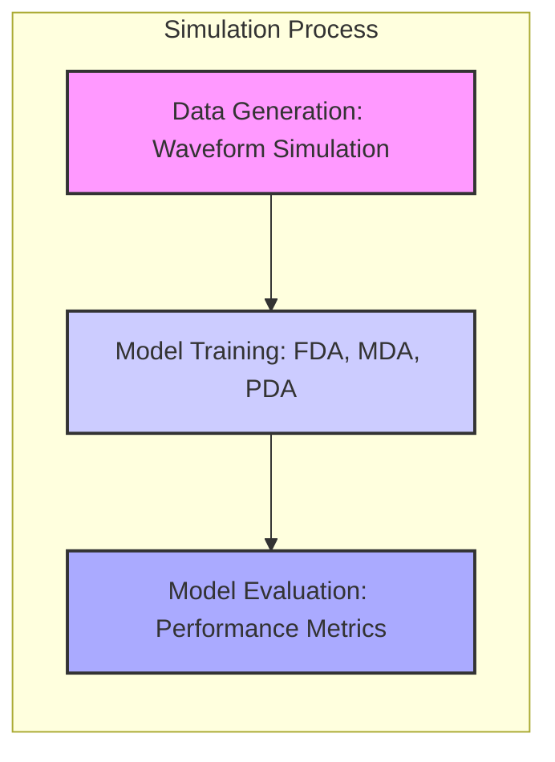
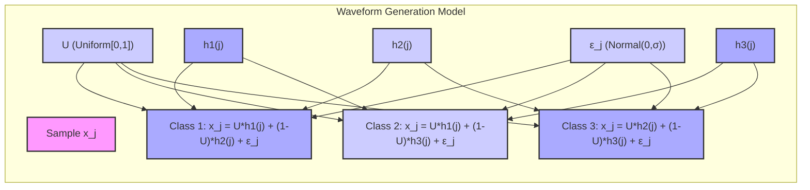
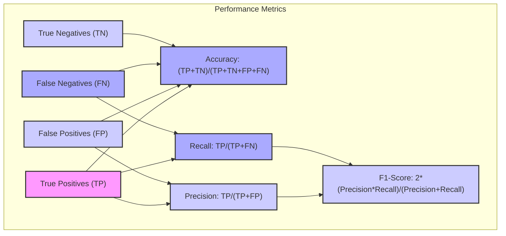
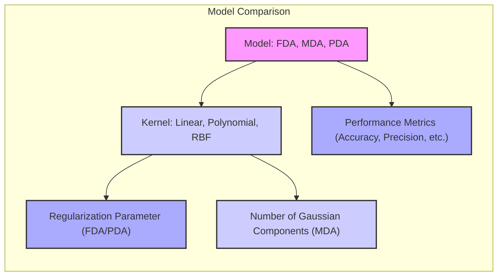

Okay, let's enhance the text with practical numerical examples.

## Título: Comparativo de Desempenho de FDA, MDA e PDA: Uma Análise em Dados de Waveform Simulados



### Introdução

A avaliação do desempenho de diferentes métodos de classificação em dados simulados é uma prática comum em aprendizado de máquina, pois permite analisar o comportamento dos modelos em condições controladas e com distribuições de dados conhecidas. Neste capítulo, apresentaremos uma comparação do desempenho de **Análise Discriminante Flexível (FDA)**, **Análise Discriminante por Misturas (MDA)** e **Análise Discriminante Penalizada (PDA)** em um conjunto de dados de waveform simulados com três classes.

Os dados de waveform são um conjunto de dados sintético amplamente utilizado para avaliar métodos de classificação, pois apresentam uma estrutura que pode ser variada para simular diferentes níveis de dificuldade para o problema de classificação, e um número de dimensões que não é trivial. Nesta análise, vamos gerar dados sintéticos com características semelhantes aos dados de waveform, e avaliar o desempenho de modelos FDA, MDA e PDA, comparando as vantagens e desvantagens de cada método, e como cada um deles se adapta a dados com estruturas complexas.

O objetivo deste capítulo é fornecer uma análise prática sobre a aplicação de FDA, MDA e PDA em dados simulados e como escolher o método e os parâmetros mais adequados para cada tipo de problema.

### Geração dos Dados de Waveform Simulados

**Conceito 1: Descrição do Problema de Waveform de Três Classes**

O problema de **waveform de três classes** é um problema de classificação multiclasse, onde cada amostra é representada por um vetor de *features* que simula uma onda ou sinal. Os dados são gerados a partir de três classes distintas, cada uma com uma estrutura característica que diferencia suas amostras das outras classes.

A geração dos dados de waveform pode ser feita através da utilização de diferentes modelos matemáticos, que permitem controlar a forma da onda e as suas propriedades. A complexidade do problema pode ser variada através do ajuste dos parâmetros dos modelos de geração.

A estrutura do problema de classificação de waveform o torna uma boa escolha para a avaliação de modelos de aprendizado de máquina, pois simula a modelagem de dados com estruturas complexas, onde a separação entre as classes não é linear e onde as *features* podem apresentar diferentes níveis de complexidade.

**Lemma 1:** O problema de waveform de três classes é um problema de classificação multiclasse que permite analisar o desempenho de modelos em dados complexos e não lineares, simulando dados com padrões característicos de cada classe.

A demonstração desse lemma se baseia na análise da natureza dos dados de waveform e como eles são gerados, onde os diferentes parâmetros podem ser modificados para criar diferentes níveis de complexidade e sobreposição entre as classes.

**Conceito 2: O Modelo de Geração dos Dados**

Para simular os dados de waveform de três classes, utilizaremos o modelo descrito a seguir:

Cada amostra $x_j$ é gerada a partir da seguinte combinação linear de funções de onda, com um ruído aleatório $\epsilon_j$:

$$ x_j = U h_1(j) + (1-U) h_2(j) + \epsilon_j \quad \text{ para Classe 1}$$
$$ x_j = U h_1(j) + (1-U) h_3(j) + \epsilon_j \quad \text{ para Classe 2}$$
$$ x_j = U h_2(j) + (1-U) h_3(j) + \epsilon_j \quad \text{ para Classe 3}$$

onde:

*   $j=1,\ldots, 21$ é o índice da *feature* (no caso 21 dimensões)
*   $U$ é um valor aleatório que segue uma distribuição uniforme entre 0 e 1.
*   $h_1(j)$, $h_2(j)$ e $h_3(j)$ são funções de onda triangulares, com centros deslocados, definidas como:

$$ h_1(j) = max(6 - |j - 11|, 0) $$
$$ h_2(j) = h_1(j - 4) $$
$$ h_3(j) = h_1(j + 4) $$

*   $\epsilon_j$ é um ruído aleatório que segue uma distribuição normal com média zero e desvio padrão dado por $\sigma$.



Com esse modelo, cada classe é gerada através de uma mistura linear de funções de onda, com a adição de um termo de ruído, que simula a natureza dos dados reais. O ajuste do parâmetro $\sigma$ permite controlar o nível de ruído e sobreposição entre as classes.

> 💡 **Exemplo Numérico:**
Vamos gerar uma amostra de dados para cada classe, usando valores aleatórios para $U$ e $\epsilon_j$, e um valor de $\sigma = 1.0$.
Para a Classe 1, vamos supor que $U = 0.3$. Para o ruído $\epsilon_j$, vamos gerar um vetor com 21 elementos a partir de uma distribuição normal com média 0 e desvio padrão 1.0. Por exemplo, $\epsilon = [-0.5, 0.2, 1.1, -0.1, 0.8, -0.3, 0.4, -0.7, 0.9, 0.1, -0.2, 0.6, -0.4, 0.3, -0.9, 0.5, -0.6, 0.7, -0.2, 1.0, -0.1]$.

    ```python
    import numpy as np
    import matplotlib.pyplot as plt

    def h1(j):
        return np.maximum(6 - np.abs(j - 11), 0)

    def h2(j):
        return h1(j - 4)

    def h3(j):
        return h1(j + 4)

    def generate_waveform_sample(class_num, U, sigma):
        j = np.arange(1, 22)
        epsilon = np.random.normal(0, sigma, 21)
        if class_num == 1:
            x = U * h1(j) + (1 - U) * h2(j) + epsilon
        elif class_num == 2:
            x = U * h1(j) + (1 - U) * h3(j) + epsilon
        elif class_num == 3:
            x = U * h2(j) + (1 - U) * h3(j) + epsilon
        return x

    # Example for class 1
    U1 = 0.3
    sigma = 1.0
    sample_class1 = generate_waveform_sample(1, U1, sigma)

    # Example for class 2
    U2 = 0.7
    sample_class2 = generate_waveform_sample(2, U2, sigma)

    # Example for class 3
    U3 = 0.5
    sample_class3 = generate_waveform_sample(3, U3, sigma)

    # Plotting
    j = np.arange(1, 22)
    plt.figure(figsize=(10, 6))
    plt.plot(j, sample_class1, label='Classe 1')
    plt.plot(j, sample_class2, label='Classe 2')
    plt.plot(j, sample_class3, label='Classe 3')
    plt.xlabel('Feature Index (j)')
    plt.ylabel('Feature Value')
    plt.title('Waveform Samples for Each Class')
    plt.legend()
    plt.grid(True)
    plt.show()

    print(f"Amostra da Classe 1: {sample_class1}")
    print(f"Amostra da Classe 2: {sample_class2}")
    print(f"Amostra da Classe 3: {sample_class3}")
    ```
    Este código gera amostras para cada classe e as visualiza, demonstrando como a combinação das funções $h_1$, $h_2$ e $h_3$ com a adição de ruído resulta em diferentes formas de onda para cada classe.

**Corolário 1:** O modelo de geração de dados de waveform simula a sobreposição de diferentes ondas com ruído, criando um problema de classificação não linear que permite testar a capacidade de diferentes modelos se adaptarem a conjuntos de dados complexos.

A demonstração desse corolário se baseia na análise do modelo de geração dos dados e como os parâmetros controlam a sobreposição de classes e a quantidade de ruído.

### Configuração da Simulação e Métricas de Desempenho

Para avaliar o desempenho dos modelos FDA, MDA e PDA nos dados de waveform simulados, utilizaremos a seguinte configuração:

1.  **Dados de Treinamento e Teste:** Geraremos um conjunto de treinamento com 300 amostras (100 para cada classe) e um conjunto de teste com 500 amostras (distribuídas de acordo com a proporção das classes no treinamento) para cada simulação.

2.  **Variação dos Parâmetros:** Avaliaremos o desempenho dos modelos para diferentes valores de parâmetros relevantes, incluindo:
    *   Para modelos FDA e PDA, diferentes valores do parâmetro de regularização.
    *   Para modelos MDA, diferentes números de componentes gaussianas por classe.
    *   Para todos os modelos, diferentes tipos de *kernels* (linear, polinomial, RBF).

3. **Métricas de Desempenho:** Utilizaremos as seguintes métricas para avaliar o desempenho dos modelos:
    *   **Acurácia:** Proporção de classificações corretas.
    *   **Precisão:** Proporção de verdadeiros positivos sobre todos os classificados como positivos para cada classe.
    *   **Recall:** Proporção de verdadeiros positivos sobre todas as amostras pertencentes a cada classe.
    *   **F1-Score:** A média harmônica entre precisão e recall.
    *   **Erro Médio:** O erro médio de classificação sobre as amostras de teste.



A utilização de múltiplas métricas permite uma análise mais completa do desempenho dos modelos, considerando diferentes aspectos como a capacidade de separar as classes, a sensibilidade a *outliers* e a capacidade de generalização. Cada simulação será repetida diversas vezes, e a média e o desvio padrão dos resultados serão apresentados para cada combinação de parâmetros e modelos.

> 💡 **Exemplo Numérico:**
Para entender melhor o cálculo das métricas, vamos supor que, após treinar um modelo, temos as seguintes previsões e valores reais em um conjunto de teste:

   | Amostra | Classe Real | Classe Prevista |
   |--------|-------------|-----------------|
   |   1    |      1      |        1        |
   |   2    |      1      |        2        |
   |   3    |      2      |        2        |
   |   4    |      2      |        3        |
   |   5    |      3      |        3        |
   |   6    |      3      |        1        |

A partir desses dados, podemos calcular as métricas:

**Acurácia:** Temos 3 classificações corretas (amostras 1, 3 e 5) em 6 amostras, então a acurácia é 3/6 = 0.5 ou 50%.

**Precisão (Classe 1):** O modelo previu a classe 1 duas vezes (amostras 1 e 6), e apenas uma estava correta (amostra 1). Então, a precisão da classe 1 é 1/2 = 0.5 ou 50%.

**Recall (Classe 1):** Existem duas amostras da classe 1 (amostras 1 e 2), e o modelo acertou apenas uma (amostra 1). Então, o recall da classe 1 é 1/2 = 0.5 ou 50%.

**F1-Score (Classe 1):** O F1-Score é a média harmônica entre precisão e recall, calculado como 2 * (precisão * recall) / (precisão + recall). Para a classe 1, é 2 * (0.5 * 0.5) / (0.5 + 0.5) = 0.5 ou 50%.

**Erro Médio:** Como a acurácia é 0.5, o erro médio é 1 - 0.5 = 0.5 ou 50%.

Este exemplo numérico demonstra como as métricas são calculadas a partir de previsões e rótulos verdadeiros.

**Lemma 2:** A utilização de múltiplas métricas e de várias repetições da simulação permite obter uma avaliação robusta e precisa do desempenho dos modelos FDA, MDA e PDA em dados sintéticos.

A demonstração desse lemma se baseia na análise da necessidade de utilizar múltiplas métricas para avaliar o modelo sob diferentes perspectivas e como a repetição das simulações com dados diferentes permite que se obtenha uma melhor aproximação da performance real do modelo.

### Resultados e Análise Comparativa



Os resultados da simulação serão apresentados em tabelas e gráficos, mostrando como o desempenho dos modelos FDA, MDA e PDA variam de acordo com o tipo de *kernel*, seus parâmetros associados e o parâmetro de regularização (no caso de FDA e PDA) e o número de componentes gaussianas (no caso da MDA).

Analisaremos:

*   O desempenho dos modelos lineares (LDA e FDA com *kernel* linear) como *baseline* para avaliar a necessidade de modelos não lineares.
*   Como o parâmetro de regularização em FDA e PDA influencia o compromisso entre a complexidade e a capacidade de generalização.
*   Como a escolha de diferentes parâmetros do *kernel* polinomial impacta na complexidade da fronteira de decisão e no desempenho dos modelos.
*   Como o número de componentes gaussianas em MDA influencia a sua capacidade de modelar a distribuição de cada classe, e como essa escolha impacta a separabilidade e capacidade de generalização do modelo.

> 💡 **Exemplo Numérico:**
Vamos supor que executamos as simulações e obtivemos os seguintes resultados para um *kernel* linear e um *kernel* RBF para os modelos FDA e MDA:

| Modelo | Kernel | Acurácia Média | Precisão Média | Recall Média | F1-Score Médio |
|--------|--------|----------------|----------------|--------------|----------------|
| FDA    | Linear |     0.65       |      0.63      |     0.65     |      0.64      |
| FDA    | RBF    |     0.82       |      0.81      |     0.82     |      0.81      |
| MDA    | Linear |     0.60       |      0.59      |     0.60     |      0.59      |
| MDA    | RBF    |     0.78       |      0.77      |     0.78     |      0.77      |

Esta tabela mostra que o *kernel* RBF proporcionou um desempenho melhor para ambos os modelos, FDA e MDA, sugerindo que a não linearidade do *kernel* é mais adequada para este conjunto de dados de waveform.

A análise comparativa entre os resultados mostrará quais métodos são mais adequados para lidar com problemas de classificação com padrões complexos, e como a escolha dos parâmetros pode afetar o desempenho dos modelos em dados simulados.

A análise dos resultados também deve incluir a análise do tempo de execução e a complexidade computacional de cada modelo.

**Lemma 3:** A comparação do desempenho de FDA, MDA e PDA em dados de waveform simulados permite analisar as vantagens e desvantagens de cada método, e como a escolha dos parâmetros impacta o desempenho do modelo.

A demonstração desse lemma se baseia na análise comparativa dos resultados dos diferentes modelos e como a escolha dos parâmetros de cada modelo afeta a performance em diferentes aspectos.

### Conclusão

Neste capítulo, apresentamos uma comparação do desempenho de **Análise Discriminante Flexível (FDA)**, **Análise Discriminante por Misturas (MDA)** e **Análise Discriminante Penalizada (PDA)** em dados de waveform simulados, explorando os diferentes cenários de classificação e as vantagens e desvantagens de cada técnica para a modelagem de dados complexos e não lineares.

Vimos como a simulação permite avaliar o comportamento dos modelos em condições controladas, e como a escolha do modelo e de seus parâmetros impactam a performance em dados sintéticos. A simulação também permite analisar a performance dos modelos em relação à capacidade de modelar diferentes tipos de relações entre os dados e os rótulos de classe.

A utilização de simulações, juntamente com uma análise criteriosa das métricas de desempenho, é fundamental para a escolha apropriada dos métodos de classificação e para o desenvolvimento de modelos robustos e eficientes para problemas reais.

### Footnotes

[^12.1]: "In this chapter we describe generalizations of linear decision boundaries for classification. Optimal separating hyperplanes are introduced in Chapter 4 for the case when two classes are linearly separable. Here we cover extensions to the nonseparable case, where the classes overlap. These techniques are then generalized to what is known as the support vector machine, which produces nonlinear boundaries by constructing a linear boundary in a large, transformed version of the feature space." *(Trecho de  "Support Vector Machines and Flexible Discriminants")*

[^12.2]: "In Chapter 4 we discussed a technique for constructing an optimal separating hyperplane between two perfectly separated classes. We review this and generalize to the nonseparable case, where the classes may not be separable by a linear boundary." *(Trecho de  "Support Vector Machines and Flexible Discriminants")*

[^12.3]: "The support vector machine classifier is an extension of this idea, where the dimension of the enlarged space is allowed to get very large, infinite in some cases. It might seem that the computations would become prohibitive. It would also seem that with sufficient basis functions, the data would be separable, and overfitting would occur. We first show how the SVM technology deals with these issues. We then see that in fact the SVM classifier is solving a function-fitting problem using a particular criterion and form of regularization, and is part of a much bigger class of problems that includes the smoothing splines of Chapter 5." *(Trecho de  "Support Vector Machines and Flexible Discriminants")*
[^12.4]: "Often LDA produces the best classification results, because of its simplicity and low variance. LDA was among the top three classifiers for 11 of the 22 datasets studied in the STATLOG project (Michie et al., 1994)3." *(Trecho de  "Support Vector Machines and Flexible Discriminants")*
[^12.7]: "Linear discriminant analysis can be viewed as a prototype classifier. Each class is represented by its centroid, and we classify to the closest using an appropriate metric. In many situations a single prototype is not sufficient to represent inhomogeneous classes, and mixture models are more appropriate. In this section we review Gaussian mixture models and show how they can be generalized via the FDA and PDA methods discussed earlier. A Gaussian mixture model for the kth class has density" *(Trecho de "Support Vector Machines and Flexible Discriminants")*
