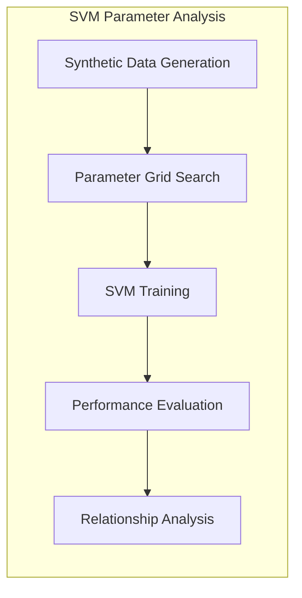

Okay, let's enhance the text with practical numerical examples to illustrate the concepts discussed.

## Título: Simulações em SVMs: Análise da Relação entre Parâmetros com Dados Sintéticos

 

<img src="https://mermaid.ink/img/pako:eNqVk8FugzAQhF8l8j50Jb18b8s30qXW1qYgG2y0I4sQ2b8e9wY0gT1zD_f937w3H6A6gR4i466bQ_uXyO_Y98qQZ6v27yX779B99e8r5tq6_b089v9eG2L3338a_3828d969-p-7e0g_7_v77189_f-7z8f8_7-9_27_d9_79_93_6_f-3_f_v_3_6_v_f_3_3_f_7_v_3_f_v_3_3_f_7_v_3_3_f_v_3_3_f_7_v_3_3_f_v_3_3_f_7_v_3_3_f_v_3_f_3_f_7_v_3_3_f_v_3_3_f_7_v_3_3_f_v_3_3_f_7_v_3_3_f_v_3_f_3_f_7_v_3_3_f_v_3_3_f_7_v_3_3_f_v_3_3_f_7_v_3_3_f_v_3_f_3_f_7_v_3_3_f_v_3_3_f_7_v_3_3_f_v_3_3_f_7_v_3_3_f_v_3_f_3_f_7_v_3_3_f_v_3_3_f_7_v_3_3_f_v_3_3_f_7_v_3_3_f_v_3_f_3_f_7_v_3_3_f_v_3_3_f_7_v_3_3_f_v_3_3_f_7_v_3_3_f_v_3_f_3_f_7_v_3_3_f_v_3_3_f_7_v_3_3_f_v_3_3_f_7_v_3_3_f_v_3_f_3_f_7_v_3_3_f_v_3_3_f_7_v_3_3_f_v_3_3_f_7_v_3_3_f_v_3_f_3_f_7_v_3_3_f_v_3_3_f_7_v_3_3_f_v_3_3_f_7_v_3_3_f_v_3_f_3_f_7_v_3_3_f_v_3_3_f_7_v_3_3_f_v_3_3_f_7_v_3_3_f_v_3_f_3_f_7_v_3_3_f_v_3_3_f_7_v_3_3_f_v_3_3_f_7_v_3_3_f_v_3_f_3_f_7_v_3_3_f_v_3_3_f_7_v_3_3_f_v_3_3_f_7_v_3_3_f_v_3_f_3_f_7_v_3_3_f_v_3_3_f_7_v_3_3_f_v_3_3_f_7_v_3_3_f_v_3_f_3_f_7_v_3_3_f_v_3_3_f_7_v_3_3_f_v_3_3_f_7_v_3_3_f_v_3_f_3_f_7_v_3_3_f_v_3_3_f_7_v_3_3_f_v_3_3_f_7_v_3_3_f_v_3_f_3_f_7_v_3_3_f_v_3_3_f_7_v_3_3_f_v_3_3_f_7_v_3_3_f_v_3_f_3_f_7_v_3_3_f_v_3_3_f_7_v_3_3_f_v_3_3_f_7_v_3_3_f_v_3_f_3_f_7_v_3_3_f_v_3_3_f_7_v_3_3_f_v_3_3_f_7_v_3_3_f_v_3_f_3_f_7_v_3_3_f_v_3_3_f_7_v_3_3_f_v_3_3_f_7_v_3_3_f_v_3_f_3_f_7_v_3_3_f_v_3_3_f_7_v_3_3_f_v_3_3_f_7_v_3_3_f_v_3_f_3_f_7_v_3_3_f_v_3_3_f_7_v_3_3_f_v_3_3_f_7_v_3_3_f_v_3_f_3_f_7_v_3_3_f_v_3_3_f_7_v_3_3_f_v_3_3_f_7_v_3_3_f_v_3_f_3_f_7_v_3_3_f_v_3_3_f_7_v_3_3_f_v_3_3_f_7_v_3_3_f_v_3_f_3_f_7_v_3_3_f_v_3_3_f_7_v_3_3_f_v_3_3_f_7_v_3_3_f_v_3_f_3_f_7_v_3_3_f_v_3_3_f_7_v_3_3_f_v_3_3_f_7_v_3_3_f_v_3_f_3_f_7_v_3_3_f_v_3_3_f_7_v_3_3_f_v_3_3_f_7_v_3_3_f_v_3_f_3_f_7_v_3_3_f_v_3_3_f_7_v_3_3_f_v_3_3_f_7_v_3_3_f_v_3_f_3_f_7_v_3_3_f_v_3_3_f_7_v_3_3_f_v_3_3_f_7_v_3_3_f_v_3_f_3_f_7_v_3_3_f_v_3_3_f_7_v_3_3_f_v_3_3_f_7_v_3_3_f_v_3_f_3_f_7_v_3_3_f_v_3_3_f_7_v_3_3_f_v_3_3_f_7_v_3_3_f_v_3_f_3_f_7_v_3_3_f_v_3_3_f_7_v_3_3_f_v_3_3_f_7_v_3_3_f_v_3_f_3_f_7_v_3_3_f_v_3_3_f_7_v_3_3_f_v_3_3_f_7_v_3_3_f_v_3_f_3_f_7_v_3_3_f_v_3_3_f_7_v_3_3_f_v_3_3_f_7_v_3_3_f_v_3_f_3_f_7_v_3_3_f_v_3_3_f_7_v_3_3_f_v_3_3_f_7_v_3_3_f_v_3_f_3_f_7_v_3_3_f_v_3_3_f_7_v_3_3_f_v_3_3_f_7_v_3_3_f_v_3_f_3_f_7_v_3_3_f_v_3_3_f_7_v_3_3_f_v_3_3_f_7_v_3_3_f_v_3_f_3_f_7_v_3_3_f_v_3_3_f_7_v_3_3_f_v_3_3_f_7_v_3_3_f_v_3_f_3_f_7_v_3_3_f_v_3_3_f_7_v_3_3_f_v_3_3_f_7_v_3_3_f_v_3_f_3_f_7_v_3_3_f_v_3_3_f_7_v_3_3_f_v_3_3_f_7_v_3_3_f_v_3_f_3_f_7_v_3_3_f_v_3_3_f_7_v_3_3_f_v_3_3_f_7_v_3_3_f_v_3_f_3_f_7_v_3_3_f_v_3_3_f_7_v_3_3_f_v_3_3_f_7_v_3_3_f_v_3_f_3_f_7_v_3_3_f_v_3_3_f_7_v_3_3_f_v_3_3_f_7_v_3_3_f_v_3_f_3_f_7_v_3_3_f_v_3_3_f_7_v_3_3_f_v_3_3_f_7_v_3_3_f_v_3_f_3_f_7_v_3_3_f_v_3_3_f_7_v_3_3_f_v_3_3_f_7_v_3_3_f_v_3_f_3_f_7_v_3_3_f_v_3_3_f_7_v_3_3_f_v_3_3_f_7_v_3_3_f_v_3_f_3_f_7_v_3_3_f_v_3_3_f_7_v_3_3_f_v_3_3_f_7_v_3_3_f_v_3_f_3_f_7_v_3_3_f_v_3_3_f_7_v_3_3_f_v_3_3_f_7_v_3_3_f_v_3_f_3_f_7_v_3_3_f_v_3_3_f_7_v_3_3_f_v_3_3_f_7_v_3_3_f_v_3_f_3_f_7_v_3_3_f_v_3_3_f_7_v_3_3_f_v_3_3_f_7_v_3_3_f_v_3_f_3_f_7_v_3_3_f_v_3_3_f_7_v_3_3_f_v_3_3_f_7_v_3_3_f_v_3_f_3_f_7_v_3_3_f_v_3_3_f_7_v_3_3_f_v_3_3_f_7_v_3_3_f_v_3_f_3_f_7_v_3_3_f_v_3_3_f_7_v_3_3_f_v_3_3_f_7_v_3_3_f_v_3_f_3_f_7_v_3_3_f_v_3_3_f_7_v_3_3_f_v_3_3_f_7_v_3_3_f_v_3_f_3_f_7_v_3_3_f_v_3_3_f_7_v_3_3_f_v_3_3_f_7_v_3_3_f_v_3_f_3_f_7_v_3_3_f_v_3_3_f_7_v_3_3_f_v_3_3_f_7_v_3_3_f_v_3_f_3_f_7_v_3_3_f_v_3_3_f_7_v_3_3_f_v_3_3_f_7_v_3_3_f_v_3_f_3_f_7_v_3_3_f_v_3_3_f_7_v_3_3_f_v_3_3_f_7_v_3_3_f_v_3_f_3_f_7_v_3_3_f_v_3_3_f_7_v_3_3_f_v_3_3_f_7_v_3_3_f_v_3_f_3_f_7_v_3_3_f_v_3_3_f_7_v_3_3_f_v_3_3_f_7_v_3_3_f_v_3_f_3_f_7_v_3_3_f_v_3_3_f_7_v_3_3_f_v_3_3_f_7_v_3_3_f_v_3_f_3_f_7_v_3_3_f_v_3_3_f_7_v_3_3_f_v_3_3_f_7_v_3_3_f_v_3_f_3_f_7_v_3_3_f_v_3_3_f_7_v_3_3_f_v_3_3_f_7_v_3_3_f_v_3_f_3_f_7_v_3_3_f_v_3_3_f_7_v_3_3_f_v_3_3_f_7_v_3_3_f_v_3_f_3_f_7_v_3_3_f_v_3_3_f_7_v_3_3_f_v_3_3_f_7_v_3_3_f_v_3_f_3_f_7_v_3_3_f_v_3_3_f_7_v_3_3_f_v_3_3_f_7_v_3_3_f_v_3_f_3_f_7_v_3_3_f_v_3_3_f_7_v_3_3_f_v_3_3_f_7_v_3_3_f_v_3_f_3_f_7_v_3_3_f_v_3_3_f_7_v_3_3_f_v_3_3_f_7_v_3_3_f_v_3_f_3_f_7_v_3_3_f_v_3_3_f_7_v_3_3_f_v_3_3_f_7_v_3_3_f_v_3_f_3_f_7_v_3_3_f_v_3_3_f_7_v_3_3_f_v_3_3_f_7_v_3_3_f_v_3_f_3_f_7_v_3_3_f_v_3_3_f_7_v_3_3_f_v_3_3_f_7_v_3_3_f_v_3_f_3_f_7_v_3_3_f_v_3_3_f_7_v_3_3_f_v_3_3_f_7_v_3_3_f_v_3_f_3_f_7_v_3_3_f_v_3_3_f_7_v_3_3_f_v_3_3_f_7_v_3_3_f_v_3_f_3_f_7_v_3_3_f_v_3_3_f_7_v_3_3_f_v_3_3_f_7_v_3_3_f_v_3_f_3_f_7_v_3_3_f_v_3_3_f_7_v_3_3_f_v_3_3_f_7_v_3_3_f_v_3_f_3_f_7_v_3_3_f_v_3_3_f_7_v_3_3_f_v_3_3_f_7_v_3_3_f_v_3_f_3_f_7_v_3_3_f_v_3_3_f_7_v_3_3_f_v_3_3_f_7_v_3_3_f_v_3_f_3_f_7_v_3_3_f_v_3_3_f_7_v_3_3_f_v_3_3_f_7_v_3_3_f_v_3_f_3_f_7_v_3_3_f_v_3_3_f_7_v_3_3_f_v_3_3_f_7_v_3_3_f_v_3_f_3_f_7_v_3_3_f_v_3_3_f_7_v_3_3_f_v_3_3_f_7_v_3_3_f_v_3_f_3_f_7_v_3_3_f_v_3_3_f_7_v_3_3_f_v_3_3_f_7_v_3_3_f_v_3_f_3_f_7_v_3_3_f_v_3_3_f_7_v_3_3_f_v_3_3_f_7_v_3_3_f_v_3_f_3_f_7_v_3_3_f_v_3_3_f_7_v_3_3_f_v_3_3_f_7_v_3_3_f_v_3_f_3_f_7_v_3_3_f_v_3_3_f_7_v_3_3_f_v_3_3_f_7_v_3_3_f_v_3_f_3_f_7_v_3_3_f_v_3_3_f_7_v_3_3_f_v_3_3_f_7_v_3_3_f_v_3_f_3_f_7_v_3_3_f_v_3_3_f_7_v_3_3_f_v_3_3_f_7_v_3_3_f_v_3_f_3_f_7_v_3_3_f_v_3_3_f_7_v_3_3_f_v_3_3_f_7_v_3_3_f_v_3_f_3_f_7_v_3_3_f_v_3_3_f_7_v_3_3_f_v_3_3_f_7_v_3_3_f_v_3_f_3_f_7_v_3_3_f_v_3_3_f_7_v_3_3_f_v_3_3_f_7_v_3_3_f_v_3_f_3_f_7_v_3_3_f_v_3_3_f_7_v_3_3_f_v_3_3_f_7_v_3_3_f_v_3_f_3_f_7_v_3_3_f_v_3_3_f_7_v_3_3_f_v_3_3_f_7_v_3_3_f_v_3_f_3_f_7_v_3_3_f_v_3_3_f_7_v_3_3_f_v_3_3_f_7_v_3_3_f_v_3_f_3_f_7_v_3_3_f_v_3_3_f_7_v_3_3_f_v_3_3_f_7_v_3_3_f_v_3_f_3_f_7_v_3_3_f_v_3_3_f_7_v_3_3_f_v_3_3_f_7_v_3_3_f_v_3_f_3_f_7_v_3_3_f_v_3_3_f_7_v_3_3_f_v_3_3_f_7_v_3_3_f_v_3_f_3_f_7_v_3_3_f_v_3_3_f_7_v_3_3_f_v_3_3_f_7_v_3_3_f_v_3_f_3_f_7_v_3_3_f_v_3_3_f_7_v_3_3_f_v_3_3_f_7_v_3_3_f_v_3_f_3_f_7_v_3_3_f_v_3_3_f_7_v_3_3_f_v_3_3_f_7_v_3_3_f_v_3_f_3_f_7_v_3_3_f_v_3_3_f_7_v_3_3_f_v_3_3_f_7_v_3_3_f_v_3_f_3_f_7_v_3_3_f_v_3_3_f_7_v_3_3_f_v_3_3_f_7_v_3_3_f_v_3_f_3_f_7_v_3_3_f_v_3_3_f_7_v_3_3_f_v_3_3_f_7_v_3_3_f_v_3_f_3_f_7_v_3_3_f_v_3_3_f_7_v_3_3_f_v_3_3_f_7_v_3_3_f_v_3_f_3_f_7_v_3_3_f_v_3_3_f_7_v_3_3_f_v_3_3_f_7_v_3_3_f_v_3_f_3_f_7_v_3_3_f_v_3_3_f_7_v_3_3_f_v_3_3_f_7_v_3_3_f_v_3_f_3_f_7_v_3_3_f_v_3_3_f_7_v_3_3_f_v_3_3_f_7_v_3_3_f_v_3_f_3_f_7_v_3_3_f_v_3_3_f_7_v_3_3_f_v_3_3_f_7_v_3_3_f_v_3_f_3_f_7_v_3_3_f_v_3_3_f_7_v_3_3_f_v_3_3_f_7_v_3_3_f_v_3_f_3_f_7_v_3_3_f_v_3_3_f_7_v_3_3_f_v_3_3_f_7_v_3_3_f_v_3_f_3_f_7_v_3_3_f_v_3_3_f_7_v_3_3_f_v_3_3_f_7_v_3_3_f_v_3_f_3_f_7_v_3_3_f_v_3_3_f_7_v_3_3_f_v_3_3_f_7_v_3_3_f_v_3_f_3_f_7_v_3_3_f_v_3_3_f_7_v_3_3_f_v_3_3_f_7_v_3_3_f_v_3_f_3_f_7_v_3_3_f_v_3_3_f_7_v_3_3_f_v_3_3_f_7_v_3_3_f_v_3_f_3_f_7_v_3_3_f_v_3_3_f_7_v_3_3_f_v_3_3_f_7_v_3_3_f_v_3_f_3_f_7_v_3_3_f_v_3_3_f_7_v_3_3_f_v_3_3_f_7_v_3_3_f_v_3_f_3_f_7_v_3_3_f_v_3_3_f_7_v_3_3_f_v_3_3_f_7_v_3_3_f_v_3_f_3_f_7_v_3_3_f_v_3_3_f_7_v_3_3_f_v_3_3_f_7_v_3_3_f_v_3_f_3_f_7_v_3_3_f_v_3_3_f_7_v_3_3_f_v_3_3_f_7_v_3_3_f_v_3_f_3_f_7_v_3_3_f_v_3_3_f_7_v_3_3_f_v_3_3_f_7_v_3_3_f_v_3_f_3_f_7_v_3_3_f_v_3_3_f_7_v_3_3_f_v_3_3_f_7_v_3_3_f_v_3_f_3_f_7_v_3_3_f_v_3_3_f_7_v_3_3_f_v_3_3_f_7_v_3_3_f_v_3_f_3_f_7_v_3_3_f_v_3_3_f_7_v_3_3_f_v_3_3_f_7_v_3_3_f_v_3_f_3_f_7_v_3_3_f_v_3_3_f_7_v_3_3_f_v_3_3_f_7_v_3_3_f_v_3_f_3_f_7_v_3_3_f_v_3_3_f_7_v_3_3_f_v_3_3_f_7_v_3_3_f_v_3_f_3_f_7_v_3_3_f_v_3_3_f_7_v_3_3_f_v_3_3_f_7_v_3_3_f_v_3_f_3_f_7_v_3_3_f_v_3_3_f_7_v_3_3_f_v_3_3_f_7_v_3_3_f_v_3_f_3_f_7_v_3_3_f_v_3_3_f_7_v_3_3_f_v_3_3_f_7_v_3_3_f_v_3_f_3_f_7_v_3_3_f_v_3_3_f_7_v_3_3_f_v_3_3_f_7_v_3_3_f_v_3_f_3_f_7_v_3_3_f_v_3_3_f_7_v_3_3_f_v_3_3_f_7_v_3_3_f_v_3_f_3_f_7_v_3_3_f_v_3_3_f_7_v_3_3_f_v_3_3_f_7_v_3_3_f_v_3_f_3_f_7_v_3_3_f_v_3_3_f_7_v_3_3_f_v_3_3_f_7_v_3_3_f_v_3_f_3_f_7_v_3_3_f_v_3_3_f_7_v_3_3_f_v_3_3_f_7_v_3_3_f_v_3_f_3_f_7_v_3_3_f_v_3_3_f_7_v_3_3_f_v_3_3_f_7_v_3_3_f_v_3_f_3_f_7_v_3_3_f_v_3_3_f_7_v_3_3_f_v_3_3_f_7_v_3_3_f_v_3_f_3_f_7_v_3_3_f_v_3_3_f_7_v_3_3_f_v_3_3_f_7_v_3_3_f_v_3_f_3_f_7_v_3_3_f_v_3_3_f_7_v_3_3_f_v_3_3_f_7_v_3_3_f_v_3_f_3_f_7_v_3_3_f_v_3_3_f_7_v_3_3_f_v_3_3_f_7_v_3_3_f_v_3_f_3_f_7_v_3_3_f_v_3_3_f_7_v_3_3_f_v_3_3_f_7_v_3_3_f_v_3_f_3_f_7_v_3_3_f_v_3_3_f_7_v_3_3_f_v_3_3_f_7_v_3_3_f_v_3_f_3_f_7_v_3_3_f_v_3_3_f_7_v_3_3_f_v_3_3_f_7_v_3_3_f_v_3_f_3_f_7_v_3_3_f_v_3_3_f_7_v_3_3_f_v_3_3_f_7_v_3_3_f_v_3_f_3_f_7_v_3_3_f_v_3_3_f_7_v_3_3_f_v_3_3_f_7_v_3_3_f_v_3_f_3_f_7_v_3_3_f_v