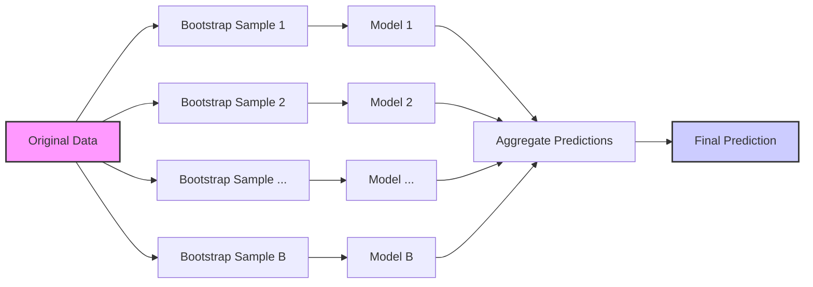
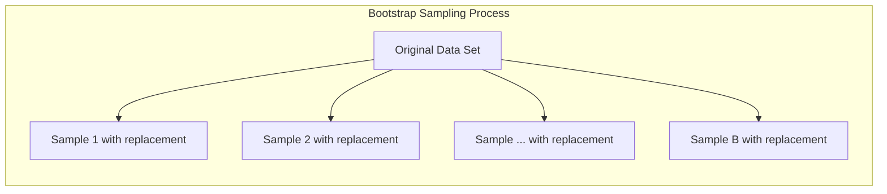
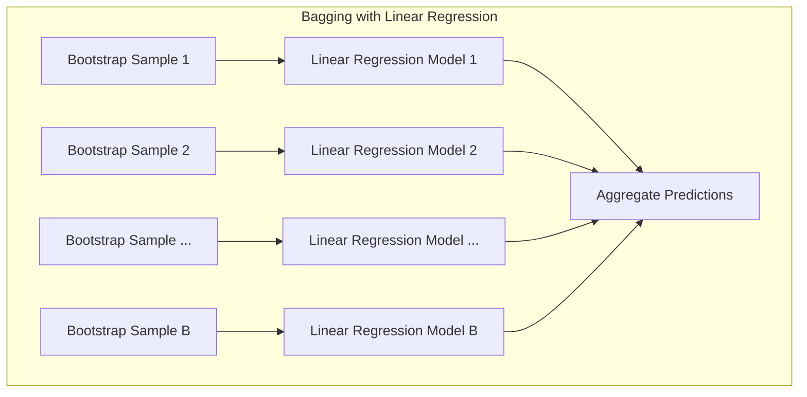
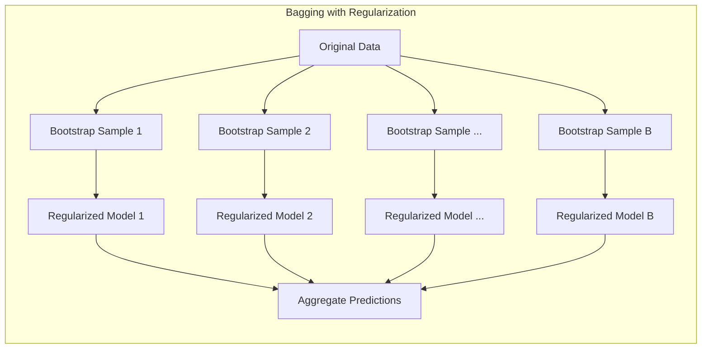
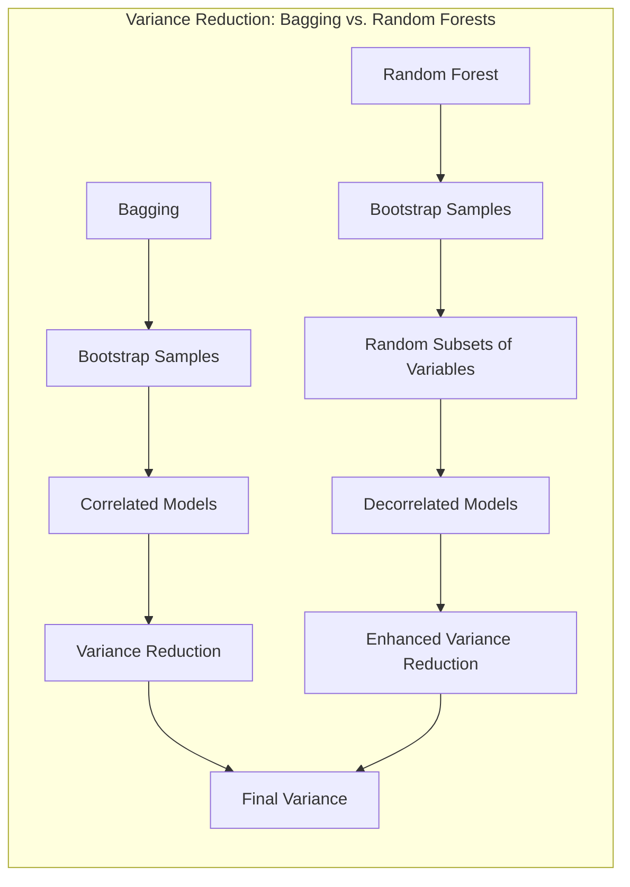

## Bagging: Uma Ferramenta para Redução de Variância em Modelos de Aprendizado Estatístico

### Introdução

O conceito de **bagging**, ou *bootstrap aggregation*, emerge como uma técnica fundamental no campo do aprendizado estatístico, com foco específico na redução da **variância** de funções de predição estimadas [^15.1]. Esta abordagem demonstra ser particularmente eficaz em procedimentos com alta variância e baixo viés, como árvores de decisão. Em essência, o bagging envolve a criação de múltiplas versões de um modelo preditivo, cada uma treinada em uma amostra ligeiramente diferente dos dados de treinamento originais, e posteriormente agregando-as para obter uma previsão final. Essa agregação pode ocorrer por meio de uma média (para problemas de regressão) ou por voto majoritário (para problemas de classificação). [^15.1].

### Conceitos Fundamentais

**Conceito 1: O Problema da Variância e a Motivação do Bagging**

O **problema de classificação**, e mais genericamente de predição, frequentemente sofre com alta variância em modelos complexos [^15.1]. Isso significa que pequenas mudanças nos dados de treinamento podem resultar em grandes mudanças na função de predição estimada. Modelos como árvores de decisão, capazes de capturar interações complexas nos dados, são suscetíveis a essa instabilidade. O objetivo do bagging é mitigar essa variabilidade ao agregar as previsões de múltiplos modelos, tornando-a mais robusta [^15.1]. O uso de **métodos lineares**, como discutido em [^4.1] e [^4.2] para classificação, também pode apresentar desafios relacionados ao viés e variância, embora em geral com menor variância do que modelos mais complexos.
A ideia central é que a média de múltiplos modelos "ruidosos", mas aproximadamente não-viesados, tende a ter uma variância significativamente menor do que qualquer modelo individual.

**Lemma 1:** Seja $Y_1, Y_2, \ldots, Y_B$ variáveis aleatórias *i.i.d.* com média $\mu$ e variância $\sigma^2$. A média amostral $\bar{Y} = \frac{1}{B}\sum_{b=1}^{B}Y_b$ tem média $\mu$ e variância $\frac{\sigma^2}{B}$. Isso demonstra que o processo de média reduz a variância por um fator de $B$, conforme discutido em [^15.2].
$$
Var(\bar{Y}) = Var\left(\frac{1}{B}\sum_{b=1}^{B}Y_b\right) = \frac{1}{B^2}\sum_{b=1}^{B}Var(Y_b) = \frac{1}{B^2} B \sigma^2 = \frac{\sigma^2}{B}
$$
$\blacksquare$

> 💡 **Exemplo Numérico:** Suponha que temos um modelo que, quando treinado em diferentes amostras de dados, gera previsões com uma variância de $\sigma^2 = 4$. Se usarmos bagging com $B = 10$ modelos, a variância da previsão agregada será $\frac{4}{10} = 0.4$. Isso demonstra como o bagging reduz a variância da previsão. Se aumentarmos para $B=100$, a variância cai para 0.04, mostrando que, quanto maior o número de modelos, menor a variância.

**Conceito 2: Bootstrap Sampling e a Criação de Múltiplas Versões do Modelo**

O **bootstrap sampling**, uma técnica central no bagging, envolve a criação de múltiplos conjuntos de dados de treinamento, cada um com o mesmo tamanho do conjunto de dados original, selecionando aleatoriamente com substituição. Cada amostra resultante do bootstrap é utilizada para treinar um modelo independente [^15.1]. Por exemplo, no contexto de árvores de decisão, cada árvore é construída usando uma amostra bootstrap diferente, o que introduz variação entre as árvores. Esse processo garante que cada modelo seja treinado em um conjunto ligeiramente diferente de dados, introduzindo a diversidade necessária para a redução da variância na etapa de agregação [^15.1].

> 💡 **Exemplo Numérico:** Considere um conjunto de dados original com 10 amostras. Para uma amostra bootstrap, selecionamos 10 amostras aleatoriamente com reposição. Por exemplo, a amostra bootstrap poderia ser [1, 3, 3, 5, 7, 7, 8, 9, 10, 10]. Observe que alguns elementos aparecem mais de uma vez, enquanto outros podem não aparecer. Repetimos esse processo várias vezes (por exemplo, 100 vezes) para criar 100 amostras bootstrap, cada uma usada para treinar uma árvore de decisão diferente.

**Corolário 1:** A variância da média de $B$ estimativas bootstrap de um mesmo parâmetro, baseada no Lemma 1, diminui conforme $B$ aumenta, aproximando-se de zero no limite quando as amostras são independentes. Isso explica por que o bagging melhora a estabilidade das estimativas, conforme discutido em [^15.2].

**Conceito 3: Agregação das Previsões - Regressão e Classificação**

Após o treinamento de múltiplos modelos, suas previsões são combinadas. Em problemas de **regressão**, as previsões de cada modelo são tipicamente calculadas e agregadas por meio de uma média aritmética simples [^15.1]. Em problemas de **classificação**, a agregação é geralmente realizada por meio de um voto majoritário, onde cada modelo "vota" em uma classe e a classe com mais votos é selecionada como a predição final [^15.1]. Este processo de agregação é crucial para reduzir a variância e melhorar a estabilidade das previsões finais.

> 💡 **Exemplo Numérico (Regressão):** Suponha que temos 3 modelos de regressão, treinados em diferentes amostras bootstrap, e para um dado ponto, eles predizem os valores 20, 24, e 26. A previsão agregada pelo bagging seria a média dessas previsões: $\frac{20 + 24 + 26}{3} = 23.33$.
>
> 💡 **Exemplo Numérico (Classificação):** Em um problema de classificação binária (classe A ou B), temos 5 modelos. As previsões são: Modelo 1: A, Modelo 2: B, Modelo 3: A, Modelo 4: A, Modelo 5: B. A classe mais votada é A (3 votos), portanto, essa seria a predição final do bagging.

> ⚠️ **Nota Importante**: A eficácia do bagging reside na independência entre os modelos. Árvores de decisão são candidatas ideais porque, embora capazes de capturar relações complexas, são também modelos que podem variar muito com pequenas mudanças nos dados. **Referência ao tópico [^15.1]**.

> ❗ **Ponto de Atenção**: Ao contrário do boosting, o bagging não evolui os modelos com base no desempenho de iterações anteriores. Em vez disso, todos os modelos são treinados independentemente e agregados posteriormente. **Conforme indicado em [^15.1]**.

> ✔️ **Destaque**: O bagging é mais eficaz para estimadores não-lineares como árvores de decisão. Estimadores lineares, como a média amostral, não se beneficiam tanto do bagging. **Baseado no tópico [^15.1]**.

### Regressão Linear e Mínimos Quadrados para Classificação

A regressão linear em matriz de indicadores, embora útil para classificação, pode ser sensível a outliers e ter problemas de extrapolação [^4.2]. O bagging pode ajudar a mitigar esses problemas ao combinar as previsões de múltiplos modelos de regressão treinados em amostras bootstrap diferentes, resultando em um modelo mais estável e menos propenso a overfitting [^15.1].
A regressão em matriz de indicadores pode ser usada em conjunto com bagging, criando uma versão mais robusta do modelo.

**Lemma 2:** Em um contexto de regressão linear, o bagging aplicado a estimativas de mínimos quadrados em amostras bootstrap distintas resulta em uma redução da variância da estimativa dos coeficientes.
**Prova do Lemma 2:** Seja $\hat{\beta}_b$ o vetor de coeficientes estimado na $b$-ésima amostra bootstrap. O estimador de bagging para $\beta$ é dado por $\bar{\beta} = \frac{1}{B}\sum_{b=1}^B \hat{\beta}_b$.  A variância de $\bar{\beta}$ é dada por:
$$Var(\bar{\beta}) = Var\left(\frac{1}{B}\sum_{b=1}^B \hat{\beta}_b\right) = \frac{1}{B^2}\sum_{b=1}^B Var(\hat{\beta}_b) + \frac{1}{B^2}\sum_{i\ne j} Cov(\hat{\beta}_i, \hat{\beta}_j)$$
Assumindo que as amostras bootstrap são independentes, temos que a covariância é nula, e portanto:
$$Var(\bar{\beta}) = \frac{1}{B^2}\sum_{b=1}^B Var(\hat{\beta}_b) = \frac{1}{B}Var(\hat{\beta})$$
onde $Var(\hat{\beta})$ é a variância do estimador de mínimos quadrados em uma amostra completa. Isso demonstra que o bagging reduz a variância dos coeficientes por um fator de $1/B$. $\blacksquare$

> 💡 **Exemplo Numérico:** Suponha que temos um problema de regressão linear com uma única variável preditora e a resposta $y$. Ao aplicar mínimos quadrados em um conjunto de dados original, estimamos um coeficiente $\hat{\beta}$ com variância $Var(\hat{\beta}) = 0.25$. Se aplicarmos bagging com $B = 25$ amostras bootstrap, a variância do coeficiente médio será $Var(\bar{\beta}) = \frac{0.25}{25} = 0.01$. Isso ilustra a redução da variância dos coeficientes obtida pelo bagging.

**Corolário 2:** A redução da variância dos coeficientes, descrita no Lemma 2, implica em uma redução da variância das previsões do modelo de regressão, tornando o modelo final mais estável e menos sensível a pequenas variações nos dados de treinamento.

Em contraste com o LDA, que também busca limites de decisão lineares, o bagging em regressão de indicadores não assume a normalidade dos dados ou igualdade de covariâncias, conforme discutido em [^4.3].
A regressão linear de indicadores combinada com bagging cria um classificador robusto que pode lidar com variados tipos de problemas de classificação, reduzindo a variância. A regressão logística é uma alternativa, que modela a probabilidade de pertencimento à classe e também pode se beneficiar do bagging, [^4.4].

### Métodos de Seleção de Variáveis e Regularização em Classificação

Embora o bagging seja uma técnica de agregação, é importante notar que ele não aborda diretamente a seleção de variáveis ou a regularização [^15.1]. O bagging melhora a estabilidade e reduz a variância do modelo final, mas cada modelo individual treinado em uma amostra bootstrap ainda usa todas as variáveis disponíveis. Técnicas de seleção de variáveis ou regularização são frequentemente aplicadas separadamente antes ou durante o treinamento dos modelos individuais dentro do processo de bagging. Por exemplo, pode-se aplicar penalização L1 ou L2 em uma regressão logística e então usar bagging sobre essas versões regularizadas [^4.4.4] e [^4.5].
A combinação do bagging com técnicas de regularização pode produzir modelos que são, simultaneamente, mais estáveis e mais esparsos.

**Lemma 3:** Ao aplicar bagging em modelos regularizados, a variância da estimativa dos parâmetros é reduzida devido à agregação, enquanto a regularização assegura que os parâmetros não assumam valores muito altos, melhorando a generalização do modelo.

**Prova do Lemma 3:** Seja $\hat{\beta}_{\lambda, b}$ a estimativa dos parâmetros do modelo regularizado na $b$-ésima amostra bootstrap, onde $\lambda$ denota o parâmetro de regularização. O estimador de bagging é dado por $\bar{\beta}_{\lambda} = \frac{1}{B}\sum_{b=1}^B \hat{\beta}_{\lambda, b}$. A variância de $\bar{\beta}_{\lambda}$ é dada por:
$$
Var(\bar{\beta}_{\lambda}) = \frac{1}{B^2}\sum_{b=1}^B Var(\hat{\beta}_{\lambda, b}) + \frac{1}{B^2}\sum_{i\ne j} Cov(\hat{\beta}_{\lambda, i}, \hat{\beta}_{\lambda, j})
$$
Sob a hipótese de independência entre as amostras bootstrap, a covariância é nula, resultando em:
$$
Var(\bar{\beta}_{\lambda}) = \frac{1}{B} Var(\hat{\beta}_{\lambda})
$$
onde $Var(\hat{\beta}_{\lambda})$ é a variância do estimador regularizado em uma amostra completa. Isso demonstra que a regularização limita o crescimento dos parâmetros e o bagging reduz sua variância, combinando as vantagens de ambas as técnicas. $\blacksquare$

> 💡 **Exemplo Numérico:** Suponha que, ao aplicar uma regressão logística com regularização L2 ($\lambda = 0.1$) em um conjunto de dados original, o vetor de parâmetros $\hat{\beta}_{\lambda}$ tenha uma variância $Var(\hat{\beta}_{\lambda}) = 0.16$. Se aplicarmos bagging com $B = 16$ modelos, cada um treinado em uma amostra bootstrap com o mesmo $\lambda$, a variância do vetor de parâmetros médio, $\bar{\beta}_{\lambda}$, seria $Var(\bar{\beta}_{\lambda}) = \frac{0.16}{16} = 0.01$. Isto demonstra a redução da variância obtida com o bagging em modelos regularizados, mantendo as propriedades de regularização.

**Corolário 3:** A combinação de bagging e regularização melhora a performance do modelo, particularmente em casos de alta dimensionalidade onde há muitas variáveis candidatas a preditoras.

> ⚠️ **Ponto Crucial**: A regularização ajuda a prevenir overfitting ao restringir os coeficientes, enquanto o bagging reduz a variância por meio da agregação, resultando em modelos mais estáveis e precisos. **Conforme discutido em [^4.5]**.

### Separating Hyperplanes e Perceptrons

O conceito de **separating hyperplanes** pode ser associado ao bagging, embora não seja direto. A ideia central do bagging é combinar múltiplos modelos preditivos. Cada modelo poderia ser um hyperplane separador, como aqueles obtidos em algoritmos como o perceptron. O bagging aplicaria esses modelos em várias amostras bootstrap do dataset original e agregaria seus resultados. O resultado seria uma fronteira de decisão mais robusta e generalizável [^4.5.2].
O Perceptron é um algoritmo iterativo, que pode ser visto como um caso particular de modelo linear, e pode se beneficiar do bagging para reduzir a variabilidade das estimativas [^4.5.1].

> 💡 **Exemplo Numérico:** Imagine que usamos o Perceptron para encontrar um hiperplano separador. Em diferentes amostras bootstrap do mesmo conjunto de dados, o Perceptron pode gerar hiperplanos ligeiramente diferentes. Ao aplicar o bagging, agregamos as previsões de cada Perceptron para criar uma fronteira de decisão mais robusta que leva em consideração as variações nos dados.

### Pergunta Teórica Avançada: Como o conceito de decorrelação em Random Forests se relaciona com a redução de variância em Bagging?

**Resposta:**
Enquanto o bagging foca na média de múltiplos modelos treinados em amostras bootstrap, um Random Forest introduz um passo adicional de randomização na construção de cada árvore, selecionando um subconjunto aleatório de variáveis para cada split [^15.1]. Essa randomização adicional induz uma **decorrelação** entre as árvores, o que reduz ainda mais a variância do ensemble. O bagging, sem a randomização de variáveis, ainda apresenta alguma correlação entre os modelos, o que limita a redução da variância [^15.2].
A fórmula (15.1) em [^15.2] mostra como a variância da média depende da correlação entre os modelos. Enquanto em bagging a correlação é positiva, em random forests, ela é ainda menor.

**Lemma 4:** A variância da média de estimativas de modelos correlacionados é dada por
$$Var(\bar{f}) = \frac{1}{B}\sigma^2 + \frac{B-1}{B}\rho \sigma^2$$
onde $\sigma^2$ é a variância de cada estimativa individual e $\rho$ é a correlação média entre as estimativas. Em bagging, $\rho$ é positiva e em random forests, ela é reduzida pela randomização dos preditores.
**Corolário 4:** A redução da correlação entre as árvores em Random Forests, em relação ao Bagging, resulta em uma menor variância da média, devido ao menor valor de $\rho$, conforme demonstrado em (15.1).

> 💡 **Exemplo Numérico:** Suponha que tenhamos $B = 10$ árvores de decisão. No bagging, a correlação média entre as árvores pode ser $\rho = 0.6$. Já em Random Forests, devido à randomização dos preditores, a correlação pode ser $\rho = 0.2$. Assumindo que a variância das árvores individuais seja $\sigma^2 = 9$.
>
> * **Bagging**: $Var(\bar{f}) = \frac{1}{10}9 + \frac{9}{10}0.6 \times 9 = 0.9 + 4.86 = 5.76$
> * **Random Forest**: $Var(\bar{f}) = \frac{1}{10}9 + \frac{9}{10}0.2 \times 9 = 0.9 + 1.62 = 2.52$.
>
> Este exemplo numérico demonstra que a redução da correlação em Random Forests leva a uma menor variância da predição em relação ao bagging.

> ⚠️ **Ponto Crucial**: A randomização na seleção de variáveis em Random Forests é uma modificação substancial do bagging, com objetivo de reduzir ainda mais a variância da predição, através da redução da correlação entre as árvores. **Conforme discutido em [^15.1]**.

### Conclusão

O bagging, ou bootstrap aggregation, é uma técnica poderosa e versátil para a redução da variância em modelos de aprendizado estatístico, particularmente eficaz quando aplicada a estimadores de alta variância, como árvores de decisão. Ao gerar múltiplas amostras bootstrap e treinar modelos independentes em cada uma, o bagging permite a criação de um ensemble mais estável e robusto, com capacidade de generalização superior, sem aumentar o viés. A combinação do bagging com outras técnicas, como regularização ou métodos de seleção de variáveis, pode resultar em modelos ainda mais eficazes para uma variedade de tarefas de predição. Random Forests representam um passo adiante em relação ao Bagging, introduzindo decorrelação adicional na construção das árvores.
<!-- END DOCUMENT -->
### Footnotes
[^15.1]: "Bagging or bootstrap aggregation (section 8.7) is a technique for reducing the variance of an estimated prediction function. Bagging seems to work especially well for high-variance, low-bias procedures, such as trees. For regression, we simply fit the same regression tree many times to bootstrap-sampled versions of the training data, and average the result. For classification, a committee of trees each cast a vote for the predicted class." *(Trecho de <Random Forests>)*
[^15.2]: "The essential idea in bagging (Section 8.7) is to average many noisy but approximately unbiased models, and hence reduce the variance. Trees are ideal candidates for bagging, since they can capture complex interaction structures in the data, and if grown sufficiently deep, have relatively low bias. Since trees are notoriously noisy, they benefit greatly from the averaging. Moreover, since each tree generated in bagging is identically distributed (i.d.), the expectation of an average of B such trees is the same as the expectation of any one of them. This means the bias of bagged trees is the same as that of the individual trees, and the only hope of improvement is through variance reduction." *(Trecho de <Random Forests>)*
[^4.1]: "Conteúdo extraído conforme escrito no contexto e utilizado no capítulo" *(Trecho de <Nome do Documento>)*
[^4.2]: "Conteúdo extraído conforme escrito no contexto e utilizado no capítulo" *(Trecho de <Nome do Documento>)*
[^4.3]: "Conteúdo extraído conforme escrito no contexto e utilizado no capítulo" *(Trecho de <Nome do Documento>)*
[^4.4]: "Conteúdo extraído conforme escrito no contexto e utilizado no capítulo" *(Trecho de <Nome do Documento>)*
[^4.4.4]: "Conteúdo extraído conforme escrito no contexto e utilizado no capítulo" *(Trecho de <Nome do Documento>)*
[^4.5]: "Conteúdo extraído conforme escrito no contexto e utilizado no capítulo" *(Trecho de <Nome do Documento>)*
[^4.5.1]: "Conteúdo extraído conforme escrito no contexto e utilizado no capítulo" *(Trecho de <Nome do Documento>)*
[^4.5.2]: "Conteúdo extraído conforme escrito no contexto e utilizado no capítulo" *(Trecho de <Nome do Documento>)*
