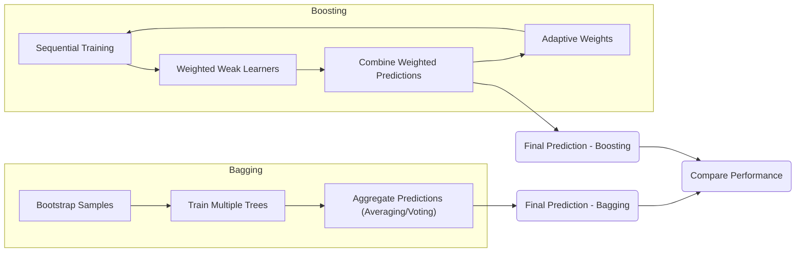
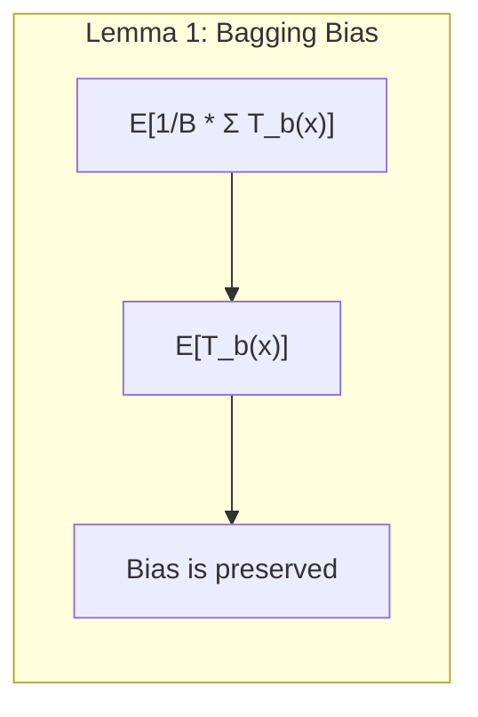
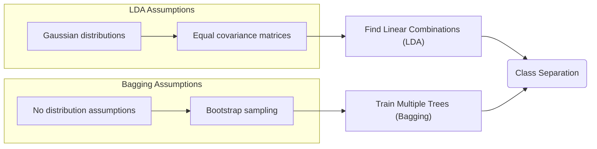
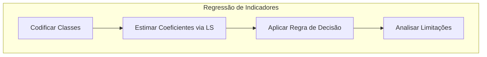
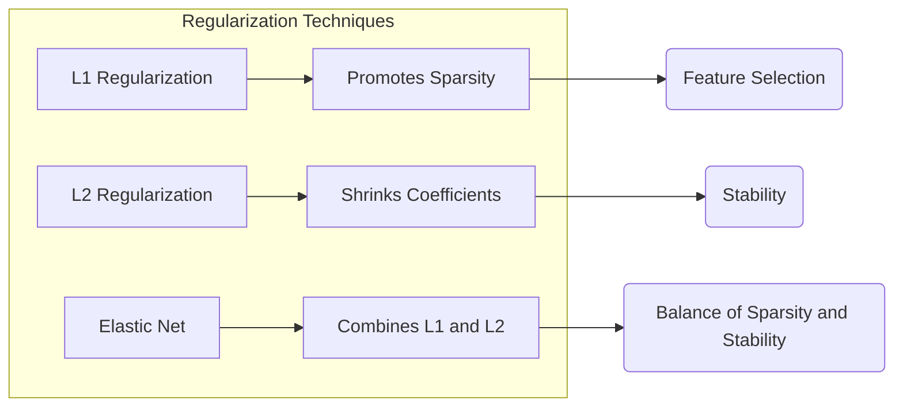
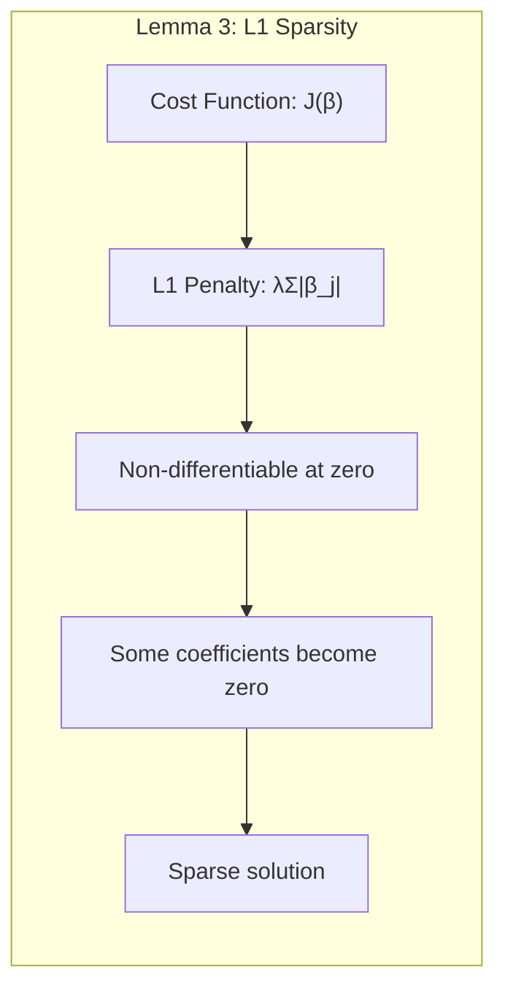
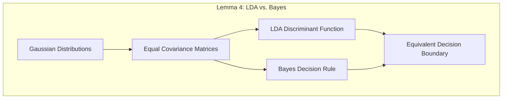

## Boosting e Bagging: Uma Análise Comparativa


### Introdução

O objetivo principal de métodos de aprendizado como **Boosting** e **Bagging** é reduzir a variância de um modelo de predição estimado. O **Bagging** (ou *bootstrap aggregation*) é uma técnica que funciona especialmente bem para procedimentos com alta variância e baixo viés, como árvores de decisão [^15.1]. Já o **Boosting**, embora também seja um método de comitê, evolui seus aprendizes fracos ao longo do tempo, atribuindo votos ponderados [^15.1]. Embora o Boosting tenha se mostrado superior ao Bagging em muitos casos, os Random Forests, uma modificação substancial do Bagging, surgem como uma alternativa popular por sua simplicidade de treinamento e ajuste [^15.1].

### Conceitos Fundamentais

**Conceito 1:** O **problema da classificação** consiste em atribuir uma classe a uma determinada observação, baseado em um conjunto de *features*. Métodos lineares, embora mais simples, podem apresentar limitações em relação à capacidade de capturar complexidade nos dados [^4.1]. O uso de modelos mais complexos, como árvores, leva a um *trade-off* entre viés e variância: modelos complexos podem se ajustar bem aos dados de treinamento (baixo viés), mas são mais propensos a variações em novos dados (alta variância) [^15.1]. O bagging, e em especial os random forests, são estratégias para mitigar essa alta variância.

**Lemma 1:**  *O viés de um ensemble de árvores geradas via bagging é igual ao viés de uma única árvore.* Isso ocorre porque cada árvore gerada por bagging é idênticamente distribuída (i.d.) [^15.2]. Formalmente:
$$ E[\frac{1}{B}\sum_{b=1}^{B} T_b(x)] = E[T_b(x)] $$
Onde $T_b(x)$ representa uma árvore gerada via bagging e B o número total de árvores. O averaging não altera o viés, apenas a variância.


> 💡 **Exemplo Numérico:**
> Suponha que temos um modelo de árvore de decisão que, em média, erra a previsão do valor de uma variável alvo por 0.5 unidades (viés). Se aplicarmos Bagging com 100 árvores ($B=100$), cada uma treinada em diferentes amostras bootstrap do mesmo conjunto de dados, o viés do modelo Bagging continuará sendo de 0.5 unidades, pois o averaging não altera o viés. Ou seja, a média dos erros ainda é 0.5, mesmo com a combinação de múltiplas árvores. Isso está expresso no Lemma 1. No entanto, a variância da previsão do modelo será reduzida, fazendo com que as previsões sejam mais estáveis.
>
> Digamos que a variância de uma árvore individual é $\sigma^2=1.0$. Se as árvores forem independentes, a variância do ensemble de Bagging será $\sigma^2/B = 1/100 = 0.01$. Isso representa uma redução drástica na variância, sem alterar o viés.

**Conceito 2:** A **Linear Discriminant Analysis (LDA)** busca encontrar uma combinação linear de *features* que separe melhor as classes, assumindo que as classes seguem distribuições normais com covariâncias semelhantes [^4.3]. Já o **Bagging**, por sua vez, não faz essas suposições e utiliza bootstrapping para criar múltiplos conjuntos de treinamento e treinar várias árvores, combinando suas previsões para reduzir a variância [^15.1].


**Corolário 1:** A combinação de previsões no Bagging não melhora o viés, apenas reduz a variância. A expectativa da média de B árvores i.d. é a mesma da expectativa de uma única árvore [^15.2].

**Conceito 3:** A **Logistic Regression** modela a probabilidade de pertencimento a uma classe por meio de uma função sigmoide aplicada a uma combinação linear de *features*, otimizando os parâmetros via maximização da verossimilhança [^4.4]. O **Boosting**, ao contrário do Bagging, ajusta sequencialmente as árvores, dando pesos maiores aos exemplos mal classificados e construindo uma combinação ponderada dessas árvores [^15.1].

> ⚠️ **Nota Importante**: O Boosting evolui seus aprendizes fracos ao longo do tempo, atribuindo votos ponderados, diferentemente do Bagging, que usa uma média simples ou um voto majoritário [^15.1].

> ❗ **Ponto de Atenção**: O Boosting tem o potencial de reduzir tanto o viés quanto a variância, enquanto o Bagging é eficaz principalmente na redução da variância [^15.2].

> ✔️ **Destaque**: Random Forests são uma modificação do Bagging que utilizam a seleção aleatória de variáveis para diminuir a correlação entre árvores, melhorando ainda mais a redução da variância [^15.2].

### Regressão Linear e Mínimos Quadrados para Classificação


**Explicação:** Este diagrama mostra o fluxo da regressão de indicadores e suas etapas.

A regressão linear, quando aplicada a uma matriz de indicadores, busca estimar os coeficientes que melhor separam as classes, utilizando o método de **mínimos quadrados**. No entanto, essa abordagem pode apresentar limitações, especialmente quando as classes não são linearmente separáveis [^4.2]. Além disso, a regressão linear pode produzir resultados fora do intervalo [0,1], quando utilizada para classificação [^4.2]. Embora eficaz em alguns contextos, a regressão de indicadores pode ser menos robusta do que métodos probabilísticos como a regressão logística em cenários complexos [^4.4].

> 💡 **Exemplo Numérico:**
> Vamos considerar um problema de classificação binária com duas classes, 0 e 1, onde temos duas *features*, $x_1$ e $x_2$. Para aplicar regressão linear para classificação, codificamos a classe 0 como 0 e a classe 1 como 1. A matriz de design $X$ contém os valores de $x_1$ e $x_2$ para cada amostra, junto com uma coluna de 1 para o intercepto. A variável resposta $y$ contém os rótulos de classe (0 ou 1). Suponha que temos os seguintes dados:
>
> $X = \begin{bmatrix} 1 & 2 & 3 \\ 1 & 3 & 1 \\ 1 & 4 & 4 \\ 1 & 5 & 2 \\ 1 & 1 & 2 \end{bmatrix}$ e $y = \begin{bmatrix} 0 \\ 0 \\ 1 \\ 1 \\ 0 \end{bmatrix}$
>
> Usando mínimos quadrados para estimar os coeficientes $\beta$, resolvemos a equação normal: $\beta = (X^T X)^{-1} X^T y$.
>
> Primeiro, calculamos $X^T X$:
> $X^T X = \begin{bmatrix} 5 & 15 & 12 \\ 15 & 55 & 43 \\ 12 & 43 & 34 \end{bmatrix}$
>
> Em seguida, calculamos $(X^T X)^{-1}$:
> $(X^T X)^{-1} \approx \begin{bmatrix} 0.989 & -0.438 & -0.219 \\ -0.438 & 0.219 & 0.017 \\ -0.219 & 0.017 & 0.109 \end{bmatrix}$
>
> Agora, calculamos $X^T y$:
> $X^T y = \begin{bmatrix} 2 \\ 9 \\ 8 \end{bmatrix}$
>
> Finalmente, estimamos os coeficientes $\beta$:
> $\beta = (X^T X)^{-1} X^T y = \begin{bmatrix} 0.989 & -0.438 & -0.219 \\ -0.438 & 0.219 & 0.017 \\ -0.219 & 0.017 & 0.109 \end{bmatrix} \begin{bmatrix} 2 \\ 9 \\ 8 \end{bmatrix} \approx \begin{bmatrix} -1.62 \\ 0.77 \\ 0.20 \end{bmatrix}$
>
> Portanto, a equação de regressão linear é aproximadamente:
> $\hat{y} = -1.62 + 0.77x_1 + 0.20x_2$
>
> Para classificar uma nova amostra, usamos uma regra de decisão: se $\hat{y} > 0.5$, classificamos como classe 1; caso contrário, como classe 0. Note que $\hat{y}$ pode ser um valor fora do intervalo [0, 1], o que é uma limitação da regressão linear para classificação.

**Lemma 2:** *Em certas condições, as projeções nos hiperplanos de decisão geradas pela regressão linear podem ser equivalentes às projeções obtidas por discriminantes lineares.* Formalmente, isso pode ser demonstrado através da análise das matrizes de projeção e das matrizes de covariância das classes [^4.3].

**Corolário 2:** Essa equivalência simplifica a análise e permite uma melhor compreensão da relação entre métodos baseados em mínimos quadrados e métodos discriminantes [^4.3].
No entanto, em cenários mais complexos, é essencial considerar as limitações da regressão de indicadores e analisar alternativas como a regressão logística.
“Em alguns cenários, a regressão logística pode fornecer estimativas mais estáveis de probabilidade, enquanto a regressão de indicadores pode levar a extrapolações fora de [0,1].” [^4.4]
“No entanto, há situações em que a regressão de indicadores é suficiente e até mesmo vantajosa quando o objetivo principal é a fronteira de decisão linear.” [^4.2]

### Métodos de Seleção de Variáveis e Regularização em Classificação

A regularização é uma técnica essencial para evitar o *overfitting* em modelos de classificação, adicionando um termo de penalidade à função de custo. A regularização L1 promove a esparsidade, levando alguns coeficientes a zero, enquanto a regularização L2 encolhe todos os coeficientes em direção a zero [^4.4.4]. Métodos como o Elastic Net combinam ambas as penalidades, visando tanto a esparsidade quanto a estabilidade [^4.5].

**Lemma 3:** *A penalização L1 na classificação logística induz coeficientes esparsos.* Isso pode ser demonstrado analisando a otimização da função de custo com penalização L1, que leva a soluções onde alguns coeficientes são nulos [^4.4.4].

**Prova do Lemma 3:** A função de custo com penalização L1 é:
$$ J(\beta) = -\frac{1}{N} \sum_{i=1}^{N} [y_i \log(p_i) + (1-y_i) \log(1-p_i)] + \lambda \sum_{j=1}^{p} |\beta_j| $$
onde o termo  $ \lambda \sum_{j=1}^{p} |\beta_j| $ penaliza a magnitude dos coeficientes, levando a soluções esparsas. A não-diferenciabilidade da norma L1 no zero induz uma solução onde alguns coeficientes são exatamente zero, selecionando as variáveis mais relevantes [^4.4.3]. $\blacksquare$

> 💡 **Exemplo Numérico:**
>
> Considere um problema de classificação binária usando regressão logística com duas features, $x_1$ e $x_2$. Os coeficientes estimados sem regularização são $\beta_0 = -2$, $\beta_1 = 1.5$, e $\beta_2 = 0.8$. A função de custo original (sem regularização) pode levar a *overfitting*.
>
> Agora, aplicamos a regularização L1 com $\lambda = 0.5$. A função de custo agora inclui um termo de penalidade:
> $$ J(\beta) = \text{função de custo original} + 0.5(|\beta_1| + |\beta_2|) $$
>
> Ao otimizar esta função de custo, alguns coeficientes podem ser levados a zero. Por exemplo, os coeficientes estimados após regularização L1 podem ser: $\beta_0 = -1.8$, $\beta_1 = 1.2$ e $\beta_2 = 0.0$. O coeficiente $\beta_2$ foi exatamente zerado, o que indica que a *feature* $x_2$ não é tão relevante quanto $x_1$ para a classificação. Esta é uma característica da regularização L1 que induz esparsidade no modelo, simplificando-o e melhorando sua interpretabilidade.
>
> Se utilizássemos a regularização L2 com o mesmo lambda, os coeficientes seriam reduzidos, mas não zerados, como por exemplo $\beta_0=-1.9, \beta_1=1.3, \beta_2=0.6$.
>
> ```python
> import numpy as np
> from sklearn.linear_model import LogisticRegression
> from sklearn.preprocessing import StandardScaler
>
> # Simulated Data
> X = np.array([[1, 2], [2, 3], [3, 1], [4, 3], [5, 2], [1, 1], [2, 2], [3, 3]])
> y = np.array([0, 0, 0, 1, 1, 0, 1, 1])
>
> # Scale Data
> scaler = StandardScaler()
> X_scaled = scaler.fit_transform(X)
>
> # L1 Regularization
> model_l1 = LogisticRegression(penalty='l1', C=1, solver='liblinear', random_state=42)
> model_l1.fit(X_scaled, y)
>
> # L2 Regularization
> model_l2 = LogisticRegression(penalty='l2', C=1, solver='liblinear', random_state=42)
> model_l2.fit(X_scaled,y)
>
> print("L1 Coefficients:", model_l1.coef_)
> print("L2 Coefficients:", model_l2.coef_)
> ```
>
>  A regularização L1 gera coeficientes esparsos. Já a regularização L2 contrai os coeficientes.

**Corolário 3:** A esparsidade resultante da regularização L1 facilita a interpretabilidade do modelo, identificando as variáveis mais importantes para a classificação [^4.4.5].

> ⚠️ **Ponto Crucial**: L1 e L2 podem ser combinadas (Elastic Net) para aproveitar vantagens de ambos os tipos de regularização [^4.5].

### Separating Hyperplanes e Perceptrons
O conceito de **hiperplano separador** busca definir a fronteira de decisão que maximiza a margem entre as classes. A formulação deste problema geralmente envolve a otimização de um funcional que penaliza as classificações incorretas, levando ao problema dual de Wolfe, cujas soluções são combinações lineares de pontos de suporte [^4.5.2]. O **Perceptron de Rosenblatt**, por sua vez, é um algoritmo que ajusta os pesos de forma iterativa, garantindo convergência sob certas condições de separabilidade linear [^4.5.1].

### Pergunta Teórica Avançada: Quais as diferenças fundamentais entre a formulação de LDA e a Regra de Decisão Bayesiana considerando distribuições Gaussianas com covariâncias iguais?

**Resposta:**
A LDA assume que as classes seguem distribuições Gaussianas com covariâncias iguais e estima os parâmetros a partir dos dados de treinamento, utilizando estes para definir uma fronteira de decisão linear [^4.3]. A Regra de Decisão Bayesiana também busca a melhor decisão baseada nas probabilidades a posteriori das classes, onde, sob a mesma hipótese de Gaussianas com covariâncias iguais, também leva a uma fronteira linear. Em condições ideais (como parâmetros populacionais conhecidos) e a mesma suposição, ambas são equivalentes [^4.3]. A diferença reside na prática, pois a LDA estima os parâmetros amostrais, enquanto a Regra Bayesiana assume que estes são conhecidos.

**Lemma 4:**  *Sob a suposição de distribuições Gaussianas com covariâncias iguais, a fronteira de decisão obtida por LDA é equivalente à fronteira de decisão Bayesiana.* Isso pode ser demonstrado através da análise das funções discriminantes lineares e da formulação da regra de decisão Bayesiana, mostrando que ambas levam à mesma fronteira de decisão [^4.3], [^4.3.3].


> 💡 **Exemplo Numérico:**
>
> Suponha que temos duas classes, A e B, com distribuições Gaussianas. A classe A tem média $\mu_A = [1, 1]$ e a classe B tem média $\mu_B = [3, 3]$. Ambas as classes têm a mesma matriz de covariância $\Sigma = \begin{bmatrix} 1 & 0 \\ 0 & 1 \end{bmatrix}$.
>
> **LDA:** A LDA estima as médias e a covariância a partir de amostras de treinamento e encontra um hiperplano linear que separa as classes. Em nosso exemplo, como as classes têm a mesma covariância, a fronteira de decisão é uma linha perpendicular à linha que conecta as médias, aproximadamente no ponto médio, que é $[2, 2]$.
>
> **Regra de Decisão Bayesiana:**  A regra Bayesiana calcula as probabilidades a posteriori de cada classe, dados os dados e a distribuição de cada classe. Com distribuições Gaussianas e covariâncias iguais, a fronteira de decisão também é uma linha reta que passa pelo ponto médio das médias das classes. Assim, neste cenário simplificado, a fronteira obtida por LDA e pela regra Bayesiana são aproximadamente iguais. Se utilizarmos as mesmas estimativas da média amostral, a fronteira será exatamente a mesma.

**Corolário 4:** Ao relaxar a hipótese de covariâncias iguais, a fronteira de decisão Bayesiana se torna quadrática, levando à análise discriminante quadrática (QDA) [^4.3].

> ⚠️ **Ponto Crucial**: A adoção ou não de covariâncias iguais impacta fortemente o tipo de fronteira de decisão (linear vs. quadrática) [^4.3.1].

### Conclusão

Nesta seção, exploramos as diferenças e similaridades entre **Boosting** e **Bagging**, dois métodos de *ensemble* poderosos para melhorar a performance de modelos de predição, além de métodos estatísticos e de aprendizado de máquina para classificação. O **Bagging**, especialmente em sua forma de Random Forests, reduz a variância através da combinação de árvores descorrelacionadas, enquanto o **Boosting** ajusta seus aprendizes fracos de forma iterativa, tendo potencial para reduzir tanto o viés quanto a variância. Métodos como LDA, regressão linear e logística, além dos hiperplanos separadores, mostram as abordagens e desafios de classificação, com a importância de métodos de regularização e seleção de variáveis para evitar o *overfitting*.

### Footnotes

[^15.1]: "Bagging or bootstrap aggregation (section 8.7) is a technique for reducing the variance of an estimated prediction function. Bagging seems to work especially well for high-variance, low-bias procedures, such as trees. For regression, we simply fit the same regression tree many times to bootstrap-sampled versions of the training data, and average the result. For classification, a committee of trees each cast a vote for the predicted class. Boosting in Chapter 10 was initially proposed as a committee method as well, although unlike bagging, the committee of weak learners evolves over time, and the members cast a weighted vote. Boosting appears to dominate bagging on most problems, and became the preferred choice. Random forests (Breiman, 2001) is a substantial modification of bagging that builds a large collection of de-correlated trees, and then averages them. On many problems the performance of random forests is very similar to boosting, and they are simpler to train and tune. As a consequence, random forests are popular, and are implemented in a variety of packages." *(Trecho de Random Forests)*
[^15.2]: "The essential idea in bagging (Section 8.7) is to average many noisy but approximately unbiased models, and hence reduce the variance. Trees are ideal candidates for bagging, since they can capture complex interaction structures in the data, and if grown sufficiently deep, have relatively low bias. Since trees are notoriously noisy, they benefit greatly from the averaging. Moreover, since each tree generated in bagging is identically distributed (i.d.), the expectation of an average of B such trees is the same as the expectation of any one of them. This means the bias of bagged trees is the same as that of the individual trees, and the only hope of improvement is through variance reduction. This is in contrast to boosting, where the trees are grown in an adaptive way to remove bias, and hence are not i.d. An average of B i.i.d. random variables, each with variance σ², has variance σ²/B. If the variables are simply i.d. (identically distributed, but not necessarily independent) with positive pairwise correlation ρ, the variance of the average is (Exercise 15.1) σ²/B + ρσ²(1-1/B). As B increases, the second term disappears, but the first remains, and hence the size of the correlation of pairs of bagged trees limits the benefits of averaging. The idea in random forests (Algorithm 15.1) is to improve the variance reduction of bagging by reducing the correlation between the trees, without increasing the variance too much." *(Trecho de Random Forests)*
[^4.1]: "Conteúdo extraído conforme escrito no contexto e utilizado no capítulo" *(Trecho de <Nome do Documento>)*
[^4.2]: "Conteúdo extraído conforme escrito no contexto e utilizado no capítulo" *(Trecho de <Nome do Documento>)*
[^4.3]: "Conteúdo extraído conforme escrito no contexto e utilizado no capítulo" *(Trecho de <Nome do Documento>)*
[^4.3.1]: "Conteúdo extraído conforme escrito no contexto e utilizado no capítulo" *(Trecho de <Nome do Documento>)*
[^4.3.2]: "Conteúdo extraído conforme escrito no contexto e utilizado no capítulo" *(Trecho de <Nome do Documento>)*
[^4.3.3]: "Conteúdo extraído conforme escrito no contexto e utilizado no capítulo" *(Trecho de <Nome do Documento>)*
[^4.4]: "Conteúdo extraído conforme escrito no contexto e utilizado no capítulo" *(Trecho de <Nome do Documento>)*
[^4.4.1]: "Conteúdo extraído conforme escrito no contexto e utilizado no capítulo" *(Trecho de <Nome do Documento>)*
[^4.4.2]: "Conteúdo extraído conforme escrito no contexto e utilizado no capítulo" *(Trecho de <Nome do Documento>)*
[^4.4.3]: "Conteúdo extraído conforme escrito no contexto e utilizado no capítulo" *(Trecho de <Nome do Documento>)*
[^4.4.4]: "Conteúdo extraído conforme escrito no contexto e utilizado no capítulo" *(Trecho de <Nome do Documento>)*
[^4.4.5]: "Conteúdo extraído conforme escrito no contexto e utilizado no capítulo" *(Trecho de <Nome do Documento>)*
[^4.5]: "Conteúdo extraído conforme escrito no contexto e utilizado no capítulo" *(Trecho de <Nome do Documento>)*
[^4.5.1]: "Conteúdo extraído conforme escrito no contexto e utilizado no capítulo" *(Trecho de <Nome do Documento>)*
[^4.5.2]: "Conteúdo extraído conforme escrito no contexto e utilizado no capítulo" *(Trecho de <Nome do Documento>)*
