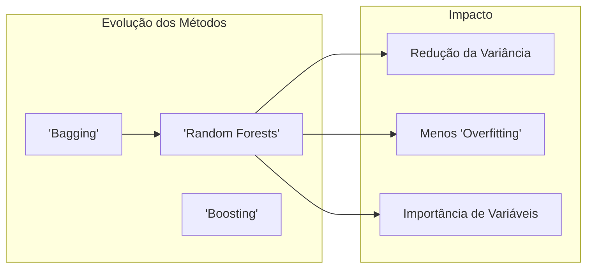
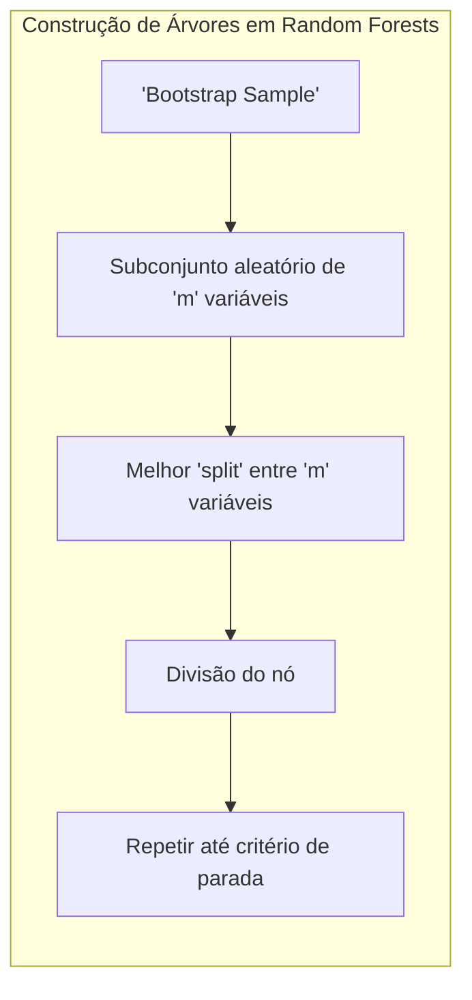
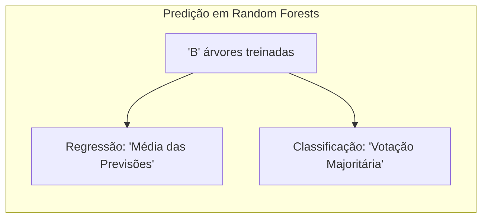
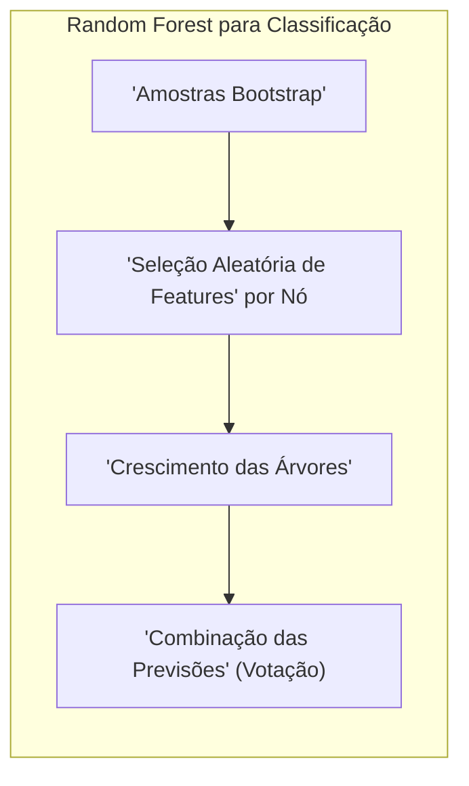
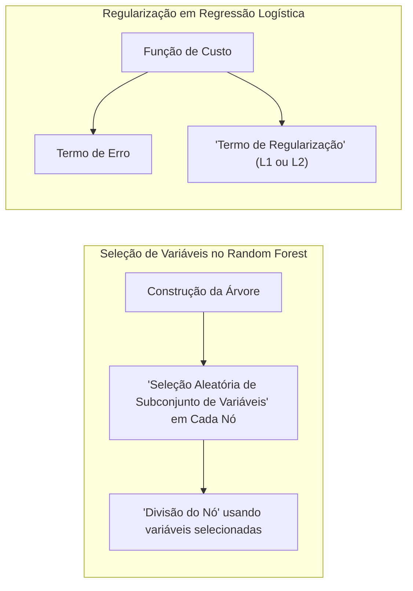

## Random Forests: Uma Análise Profunda da Popularidade em Modelagem Estatística



### Introdução

O presente capítulo explora a fundo o método de **Random Forests**, uma técnica poderosa e popular no campo do aprendizado de máquina, especialmente para problemas de classificação e regressão. Random Forests representam uma evolução significativa da técnica de **bagging**, introduzindo um componente adicional de aleatoriedade no processo de construção das árvores, resultando em modelos mais robustos e menos correlacionados [^15.1]. Entender as nuances de como o Random Forests opera, incluindo seus mecanismos internos, vantagens, limitações e ajustes finos é fundamental para o profissional de estatística e aprendizado de máquina que busca construir modelos preditivos de alto desempenho. O texto abordará desde os fundamentos teóricos até aspectos práticos, como a importância da seleção de variáveis e o impacto de parâmetros de sintonia.

### Conceitos Fundamentais

**Conceito 1: Bagging e a Redução da Variância**

O **bagging**, ou *bootstrap aggregation*, é uma técnica fundamental que visa reduzir a **variância** de um modelo preditivo, especialmente útil em métodos propensos a *overfitting* como as árvores de decisão [^15.1]. A ideia central é criar múltiplas versões do mesmo modelo usando subconjuntos do conjunto de dados original, obtidos por meio de *bootstrap sampling*. Para problemas de regressão, essas árvores são treinadas independentemente e, em seguida, suas previsões são combinadas através da média. Em problemas de classificação, a previsão final é determinada por meio de votação majoritária [^15.1]. O bagging é eficaz porque, ao combinar várias previsões ligeiramente diferentes, reduz a sensibilidade do modelo a ruídos específicos nos dados de treinamento.

> 💡 **Exemplo Numérico:** Imagine que temos um conjunto de dados de regressão com 100 observações. Usando bagging, podemos criar, digamos, 100 árvores de decisão. Cada árvore é treinada em um subconjunto de 100 observações amostradas com reposição do conjunto de dados original. A previsão final para uma nova observação é então a média das previsões dessas 100 árvores. Este processo de agregação reduz a variância em comparação com uma única árvore de decisão treinada em todos os dados.

**Lemma 1:** A esperança da média de *B* árvores de decisão construídas via *bagging* é igual à esperança de uma única árvore construída com o mesmo conjunto de dados, mas com uma amostra bootstrap.

*Prova:*
Seja $T_b(x)$ a previsão da b-ésima árvore. A média das predições de *B* árvores é dada por $\bar{T}(x) = \frac{1}{B}\sum_{b=1}^{B} T_b(x)$. Como as árvores são construídas com amostras *bootstrap* do mesmo conjunto de dados e são, portanto, identicamente distribuídas, temos:
$$E[\bar{T}(x)] = E\left[\frac{1}{B}\sum_{b=1}^{B} T_b(x)\right] = \frac{1}{B}\sum_{b=1}^{B} E[T_b(x)] = E[T_b(x)]$$
Essa igualdade mostra que o *bagging* não afeta o viés, mas sim reduz a variância da previsão. $\blacksquare$

**Conceito 2: Random Forests e Descorrelação de Árvores**



**Random Forests** aprimora a ideia do *bagging*, introduzindo uma camada adicional de aleatoriedade na construção das árvores [^15.1]. Além de usar *bootstrap samples* para treinar cada árvore, o Random Forests seleciona um subconjunto aleatório de variáveis preditoras em cada nó da árvore. Isso força que as árvores sejam mais diversas, reduzindo a correlação entre elas [^15.2]. Esse processo de descorrelação é fundamental para melhorar a eficácia do método. Especificamente, ao construir uma árvore em um *bootstrap dataset*:
1. Um subconjunto de *m* variáveis preditoras é selecionado aleatoriamente dentre as *p* variáveis disponíveis.
2. A melhor variável para *split* e o melhor ponto de corte são escolhidos entre as *m* variáveis candidatas.
3. O nó é dividido em dois filhos, repetindo o processo até que o critério de parada (tamanho mínimo do nó) seja atingido.

> 💡 **Exemplo Numérico:** Suponha que temos um conjunto de dados com 10 variáveis preditoras (p=10). Em um Random Forest, ao construir uma árvore, selecionamos um subconjunto de, digamos, m=3 variáveis aleatoriamente em cada nó. Isso significa que, para cada divisão da árvore, o modelo não tem acesso a todas as 10 variáveis, mas apenas a um subconjunto de 3, promovendo a diversidade nas árvores.

**Corolário 1:** A introdução da seleção aleatória de variáveis em cada *split* no Random Forest leva a uma redução da correlação entre as árvores, impactando positivamente na variância do modelo final.

*Prova:* Como cada árvore em um Random Forest é treinada usando um subconjunto aleatório de variáveis em cada *split*, os resultados das previsões são menos semelhantes entre as árvores do que as previsões geradas pelo *bagging*, onde as mesmas variáveis seriam usadas em cada *split*. Menor correlação entre as árvores significa que a média das árvores (resultado final do Random Forest) é menos sensível às particularidades de um único conjunto de dados de treino. $\blacksquare$

**Conceito 3: Predição em Random Forests**



Em **regressão**, a previsão de um Random Forest é obtida simplesmente calculando a média das previsões das árvores individuais, como na equação:
$$ \hat{f}(x) = \frac{1}{B} \sum_{b=1}^{B} T_b(x) $$
onde $T_b(x)$ representa a previsão da b-ésima árvore para a instância *x*, e *B* é o número total de árvores [^15.2]. Em problemas de **classificação**, a previsão final é determinada através de uma *votação majoritária* [^15.2]. Cada árvore vota na classe que julga ser a mais provável, e a classe com mais votos é a classe predita pelo Random Forest. Essa abordagem robusta de combinação de previsões é a base do sucesso do Random Forests.

> 💡 **Exemplo Numérico:** Para um problema de regressão, suponha que, para uma nova instância, temos as seguintes previsões de 3 árvores individuais: 25, 28 e 31. A previsão do Random Forest seria a média, ou seja, (25+28+31)/3 = 28. Para um problema de classificação binária (classe 0 ou 1), suponha que temos 5 árvores, e as previsões para uma nova instância sejam [0, 1, 1, 0, 1]. A classe predita pelo Random Forest seria 1, pois ela tem 3 votos (maioria).

> ⚠️ **Nota Importante**: A escolha de *m*, o número de variáveis selecionadas aleatoriamente em cada *split*, é um parâmetro crucial que afeta o desempenho do Random Forest. O valor típico para classificação é $\sqrt{p}$ e para regressão é $p/3$ [^15.3], onde *p* é o número total de variáveis preditoras, mas a sintonia desse parâmetro é fundamental para obter um bom desempenho em um determinado problema.

> 💡 **Exemplo Numérico:** Se temos 16 variáveis preditoras (p=16) para um problema de classificação, um valor típico para m seria  $\sqrt{16} = 4$.  Para um problema de regressão com as mesmas 16 variáveis, um valor típico para m seria aproximadamente $16/3 \approx 5$ ou 6. Ajustar esses valores via validação cruzada pode levar a melhor performance.

### Regressão Linear e Mínimos Quadrados para Classificação


A aplicação de **regressão linear** em uma **matriz de indicadores** para problemas de classificação é uma abordagem alternativa que também pode ser utilizada. Nessa técnica, cada classe é codificada por uma coluna de indicadores binários (0 ou 1) e modelos de regressão linear são ajustados para cada coluna. A classe predita é a correspondente à coluna com maior valor de previsão [^15.1]. No entanto, essa abordagem pode apresentar limitações, particularmente se a estrutura dos dados não é linearmente separável. Além disso, a regressão linear pode levar a predições fora do intervalo [0,1], dificultando a interpretação como probabilidades.

> 💡 **Exemplo Numérico:** Suponha que temos um problema de classificação com três classes (A, B, C). A matriz de indicadores seria uma matriz com três colunas, onde a coluna 1 teria 1 para as observações da classe A e 0 para as demais, a coluna 2 teria 1 para as observações da classe B e 0 para as demais, e a coluna 3 teria 1 para as observações da classe C e 0 para as demais. Ajustar um modelo de regressão linear para cada coluna, com um conjunto de dados de treinamento, geraria três modelos. Para uma nova observação, as predições de cada modelo seriam calculadas. A classe predita seria a correspondente ao modelo com maior valor de predição.

**Lemma 2:** A regressão linear na matriz indicadora pode ser vista como uma forma de aproximação da função de decisão, desde que o espaço de atributos seja linearmente separável.

*Prova:* Suponha que cada classe $k$ seja representada por um vetor binário $y_k$, com um '1' na posição $k$ e '0' nas outras. Ajustando um modelo de regressão linear $f(x) = X\beta$ para cada coluna da matriz, o vetor de predições $\hat{y}$ pode ser utilizado para determinar a classe pela escolha do maior valor. Se as classes forem linearmente separáveis, então a aproximação de $f(x)$ a $y$ vai estar diretamente relacionada à decisão de classe. Contudo, caso não haja linear separabilidade, a regressão linear pode não conseguir aproximar bem a função indicadora e gerar resultados problemáticos. $\blacksquare$

**Corolário 2:** O método de regressão linear na matriz indicadora pode ter dificuldade em lidar com classes que são não linearmente separáveis, levando a resultados subótimos.

*Prova:* A regressão linear, por natureza, assume uma relação linear entre as variáveis preditoras e a resposta. Se a relação verdadeira entre as classes e as variáveis preditoras é altamente não linear, um modelo linear ajustado diretamente às variáveis indicadoras terá dificuldade em capturar essa não linearidade. Portanto, as decisões de classe, baseadas em tal modelo, serão subótimas. $\blacksquare$

Random Forests, por sua vez, ao construir árvores de decisão que podem capturar interações complexas entre as variáveis, geralmente superam a regressão linear em situações não lineares, além de fornecer diretamente resultados que se assemelham a probabilidades.

### Métodos de Seleção de Variáveis e Regularização em Classificação

Em Random Forests, a seleção de variáveis ocorre em cada nó da árvore, durante o processo de crescimento, de forma aleatória e sem regularização explícita. Em contrapartida, outros métodos de classificação, como a **regressão logística**, podem se beneficiar de técnicas de **regularização** para evitar *overfitting* e realizar seleção de variáveis [^15.1]. A regularização, em geral, adiciona um termo de penalidade à função de custo, que desfavorece modelos com muitos parâmetros ou parâmetros de grande magnitude [^15.1].

A **regularização L1** (Lasso) é uma forma de regularização que penaliza a soma dos valores absolutos dos coeficientes do modelo, induzindo a esparsidade e realizando a seleção de variáveis [^15.1]. A **regularização L2** (Ridge) penaliza a soma dos quadrados dos coeficientes, que leva a coeficientes menores, porém não exatamente zero.  O uso de **Elastic Net** combina os termos de penalidade L1 e L2, permitindo selecionar as variáveis mais importantes e também limitar a magnitude de coeficientes correlacionados [^15.1].

> 💡 **Exemplo Numérico:**  Considere um modelo de regressão logística com duas variáveis preditoras, X1 e X2. A regularização L1 adiciona um termo à função de custo que é proporcional a $|\beta_1| + |\beta_2|$, onde $\beta_1$ e $\beta_2$ são os coeficientes associados a X1 e X2, respectivamente. A regularização L2 adiciona um termo proporcional a $\beta_1^2 + \beta_2^2$. A regularização L1 tende a forçar alguns coeficientes a serem exatamente zero, eliminando a variável correspondente do modelo, enquanto a L2 apenas reduz a magnitude dos coeficientes, sem necessariamente zerá-los.

```python
import numpy as np
from sklearn.linear_model import LogisticRegression
from sklearn.preprocessing import StandardScaler
from sklearn.model_selection import train_test_split
from sklearn.metrics import accuracy_score

# Generating synthetic data
np.random.seed(42)
X = np.random.rand(100, 5) # 100 samples, 5 features
y = np.random.randint(0, 2, 100) # Binary classification labels

# Feature Scaling
scaler = StandardScaler()
X_scaled = scaler.fit_transform(X)

# Split data
X_train, X_test, y_train, y_test = train_test_split(X_scaled, y, test_size=0.3, random_state=42)

# L1 Regularization (Lasso)
lasso_model = LogisticRegression(penalty='l1', solver='liblinear', C=0.1, random_state=42)
lasso_model.fit(X_train, y_train)
lasso_predictions = lasso_model.predict(X_test)
lasso_accuracy = accuracy_score(y_test, lasso_predictions)
print(f"Lasso Accuracy: {lasso_accuracy:.4f}")
print("Lasso Coefficients:", lasso_model.coef_)

# L2 Regularization (Ridge)
ridge_model = LogisticRegression(penalty='l2', C=0.1, random_state=42)
ridge_model.fit(X_train, y_train)
ridge_predictions = ridge_model.predict(X_test)
ridge_accuracy = accuracy_score(y_test, ridge_predictions)
print(f"Ridge Accuracy: {ridge_accuracy:.4f}")
print("Ridge Coefficients:", ridge_model.coef_)
```

**Lemma 3:** A regularização L1 na regressão logística leva a um modelo com coeficientes esparsos, o que facilita a interpretação do modelo e permite a seleção de variáveis.

*Prova:* A penalidade L1 adicionada à função de verossimilhança da regressão logística, $\sum_{j=1}^{p} |\beta_j|$, força que alguns coeficientes sejam exatamente iguais a zero, especialmente para variáveis que contribuem pouco para a classificação. Isso acontece porque a penalidade L1 tem uma singularidade em zero, que atrai os coeficientes para esse ponto. Consequentemente, apenas as variáveis com maior importância no modelo manterão coeficientes não nulos, realizando implicitamente a seleção de variáveis. $\blacksquare$

**Prova do Lemma 3:**
A otimização da função de custo com penalidade L1 pode ser expressa como:
$$\min_{\beta} -\mathcal{L}(\beta) + \lambda\sum_{j=1}^p |\beta_j|$$
Onde $\mathcal{L}(\beta)$ é a função de log-verossimilhança e $\lambda$ é o parâmetro de regularização. A derivação desta função não é suave em $\beta_j=0$, o que faz com que os coeficientes tendam a ser exatamente iguais a zero quando a penalidade L1 é utilizada, induzindo à esparsidade. $\blacksquare$

**Corolário 3:** Em contraste, a regularização L2, ao penalizar o quadrado dos coeficientes, reduz a magnitude dos coeficientes, mas não leva à esparsidade e, portanto, não realiza explicitamente a seleção de variáveis.

*Prova:* A penalidade L2, $\sum_{j=1}^{p} \beta_j^2$, impõe um custo que é suave em $\beta_j=0$, reduzindo a magnitude de todos os coeficientes, mas raramente os torna exatamente iguais a zero. Portanto, embora a regularização L2 reduza a influência das variáveis menos importantes, ela não realiza uma seleção de variáveis explícita, como a L1.  $\blacksquare$

> ⚠️ **Ponto Crucial**: Random Forests, por outro lado, realiza a seleção de variáveis através da escolha aleatória e não pela penalização na função de custo. A importância das variáveis pode ser medida através do ganho de impureza de Gini ou através da permutação de variáveis usando amostras OOB [^15.3.2].

### Separating Hyperplanes e Perceptrons

Os **hiperplanos separadores** são conceitos cruciais em classificação, representando as fronteiras de decisão lineares entre classes. Um **perceptron** é um algoritmo de aprendizado de máquina que busca encontrar um hiperplano que separa as classes [^15.1]. A ideia é ajustar os pesos do perceptron iterativamente, até que ele seja capaz de classificar corretamente os dados de treinamento. O perceptron é um algoritmo simples e rápido, porém limitado a problemas linearmente separáveis.

No contexto do Random Forest, o processo de construção de cada árvore resulta, essencialmente, em uma partição recursiva do espaço de atributos, gerando regiões com limites definidos por regras simples (split), mas que, quando combinadas, podem resultar em partições não lineares [^15.1]. De forma análoga, cada árvore no Random Forest pode ser vista como uma aproximação a um hiperplano local. A combinação dessas “aproximações” locais através do mecanismo de votação ou de média, leva a uma fronteira de decisão final que, apesar de não ser linear, é capaz de capturar relações não lineares.

O Random Forest, portanto, pode ser visto como uma forma de “generalização” da ideia de hiperplanos separadores, pois, através da combinação de múltiplos hiperplanos locais, pode modelar fronteiras de decisão mais complexas [^15.1].

### Pergunta Teórica Avançada: Qual a relação entre a correlação das árvores em um Random Forest e o viés-variância do modelo final?

**Resposta:**
A correlação entre as árvores em um Random Forest afeta diretamente a **variância** do modelo final, mas não afeta o **viés**. O ideal seria que as árvores não fossem correlacionadas, pois quanto mais correlacionadas elas forem, menos a combinação das previsões ajuda a reduzir a variância. Essa correlação é afetada pela quantidade de features *m* usada em cada nó da árvore, como mostrado em [^15.2].

**Lemma 4:** A variância da média de *B* árvores de decisão com correlação $\rho$ é dada por $\sigma^2(\frac{1}{B} + \frac{B-1}{B}\rho)$, onde $\sigma^2$ é a variância de cada árvore.

*Prova:* Seja $T_b(x)$ a previsão da b-ésima árvore. A variância da média das previsões das *B* árvores, com correlação média $\rho$ entre as árvores, é:
$$Var[\bar{T}(x)] = Var[\frac{1}{B}\sum_{b=1}^{B} T_b(x)] = \frac{1}{B^2} Var[\sum_{b=1}^{B} T_b(x)] $$
Usando a propriedade da variância da soma, e considerando que as árvores têm a mesma variância $\sigma^2$ e uma correlação média $\rho$, temos:
$$Var[\bar{T}(x)] = \frac{1}{B^2} [B\sigma^2 + B(B-1)\rho\sigma^2] = \sigma^2(\frac{1}{B} + \frac{B-1}{B}\rho)$$
Isso mostra que, enquanto o termo $\frac{1}{B}$ reduz a variância, a correlação $\rho$ limita essa redução. Se $\rho$ for igual a zero, a variância da média das árvores é $\frac{\sigma^2}{B}$. Quanto mais as árvores forem correlacionadas, maior será o termo $\rho$, limitando a redução da variância do ensemble. $\blacksquare$

> 💡 **Exemplo Numérico:** Imagine que temos 100 árvores em um Random Forest, cada uma com variância $\sigma^2 = 4$. Se a correlação média entre as árvores fosse $\rho=0$, a variância da média seria $4/100=0.04$. Se a correlação fosse $\rho=0.5$, a variância da média seria $4 * (1/100 + (99/100)*0.5) \approx 2$. Note como a correlação afeta significativamente a variância do modelo.

**Corolário 4:** Reduzir o valor de *m*, o número de variáveis selecionadas aleatoriamente em cada nó, diminui a correlação entre as árvores e, portanto, reduz a variância do Random Forest, como evidenciado em [^15.2].

*Prova:* Ao reduzir o valor de *m*, o número de variáveis candidatas a cada split, as árvores do Random Forest se tornam menos parecidas entre si, pois em cada nó elas escolherão um caminho diferente na árvore, construindo decisões mais independentes e com menor correlação. Assim, o termo $\rho$ apresentado no Lemma anterior será reduzido, diminuindo a variância do ensemble e promovendo melhor desempenho. $\blacksquare$

As perguntas devem ser altamente relevantes, avaliar a compreensão profunda de conceitos teóricos-chave, podem envolver derivações matemáticas e provas, e focar em análises teóricas.

### Conclusão

Este capítulo forneceu uma análise aprofundada do método Random Forests, desde seus fundamentos teóricos até suas aplicações práticas. O Random Forests, ao combinar o poder do bagging com a seleção aleatória de variáveis, oferece um método flexível e robusto para modelagem de dados, seja em classificação ou regressão [^15.1]. As propriedades de redução de variância, a capacidade de lidar com não linearidades, a importância da seleção de variáveis e a necessidade de sintonia de parâmetros foram exploradas em detalhe. O entendimento desses aspectos permite que profissionais de estatística e aprendizado de máquina apliquem o Random Forests de forma eficaz e obtenham modelos preditivos de alta performance.

### Footnotes
[^15.1]: "Bagging or bootstrap aggregation (section 8.7) is a technique for reducing the variance of an estimated prediction function. Bagging seems to work especially well for high-variance, low-bias procedures, such as trees. For regression, we simply fit the same regression tree many times to bootstrap-sampled versions of the training data, and average the result. For classification, a committee of trees each cast a vote for the predicted class." *(Trecho do documento fornecido)*
[^15.2]: "The essential idea in bagging (Section 8.7) is to average many noisy but approximately unbiased models, and hence reduce the variance. Trees are ideal candidates for bagging, since they can capture complex interaction structures in the data, and if grown sufficiently deep, have relatively low bias. Since trees are notoriously noisy, they benefit greatly from the averaging. Moreover, since each tree generated in bagging is identically distributed (i.d.), the expectation of an average of B such trees is the same as the expectation of any one of them." *(Trecho do documento fornecido)*
[^15.3]: "For classification, the default value for m is [√p] and the minimum node size is one. For regression, the default value for m is [p/3] and the minimum node size is five." *(Trecho do documento fornecido)*
[^15.3.2]: "Variable importance plots can be constructed for random forests in exactly the same way as they were for gradient-boosted models (Section 10.13). At each split in each tree, the improvement in the split-criterion is the importance measure attributed to the splitting variable, and is accumulated over all the trees in the forest separately for each variable. " *(Trecho do documento fornecido)*
