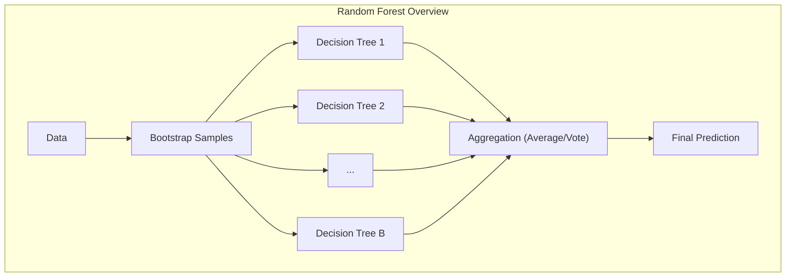
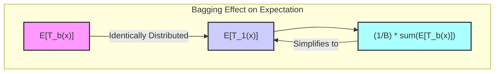
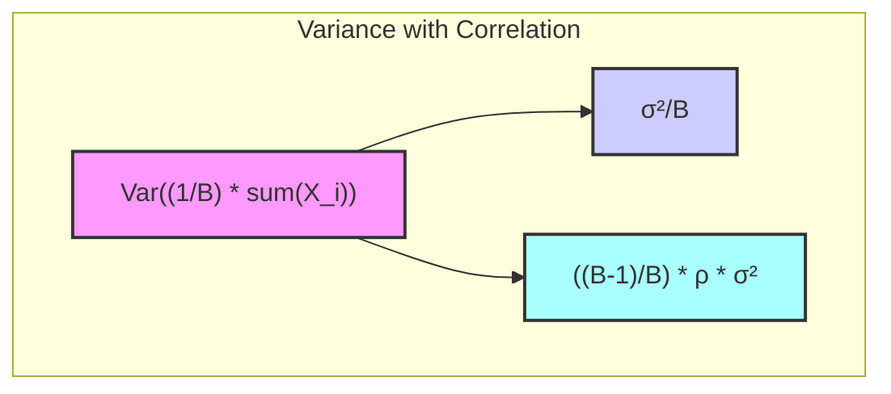
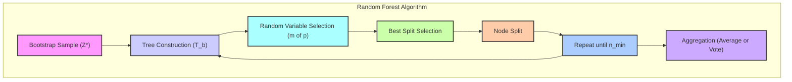
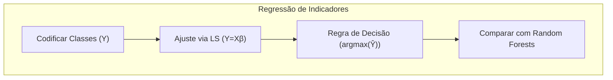
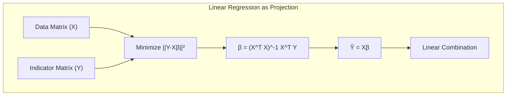
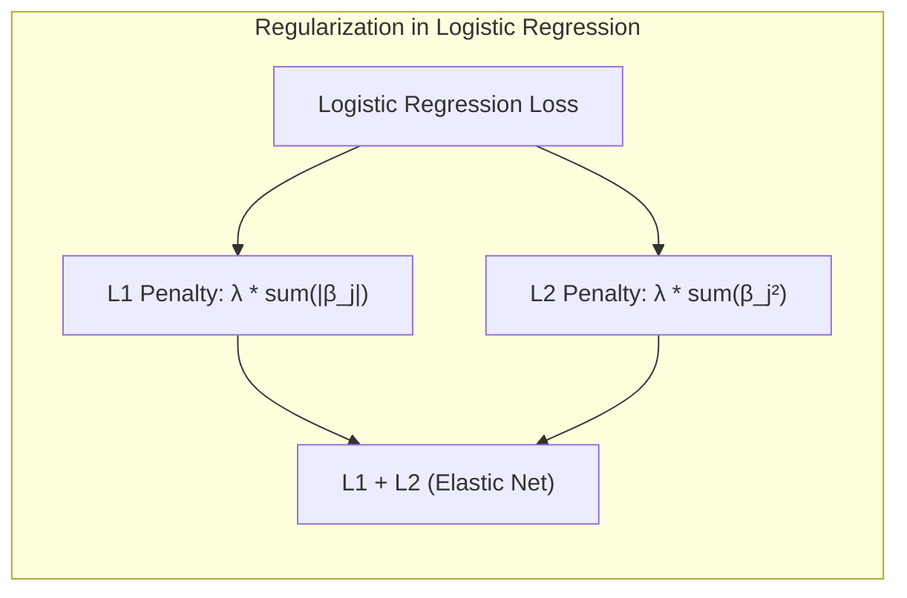
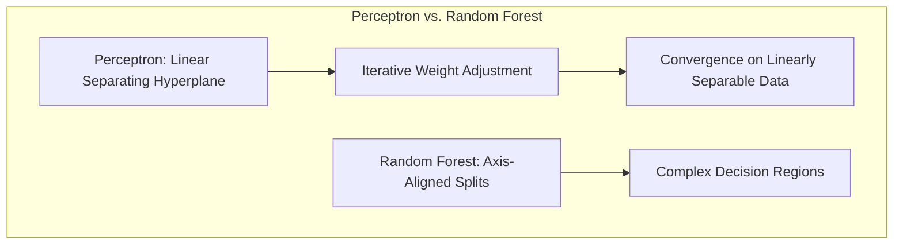
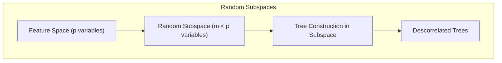

## Random Forests: Uma Análise Detalhada

### Introdução
Os **Random Forests**, introduzidos por Breiman em 2001, representam uma evolução significativa das técnicas de **bagging** (bootstrap aggregation) para a construção de modelos preditivos, especialmente no contexto de árvores de decisão [^15.1]. O bagging, por si só, é uma técnica que visa reduzir a variância de um estimador, através da combinação de múltiplas versões do mesmo modelo, ajustadas a diferentes amostras bootstrap dos dados de treinamento [^15.1]. No entanto, os Random Forests aprimoram o bagging, introduzindo uma **etapa de aleatorização adicional** no processo de construção de cada árvore, visando a descorrelação entre as árvores da floresta [^15.1]. Essa descorrelação é crucial, pois limita a eficácia da redução de variância quando os modelos são muito correlacionados [^15.2]. Ao introduzir a seleção aleatória de variáveis, os Random Forests conseguem gerar uma coleção de árvores menos correlacionadas, melhorando a precisão preditiva e a robustez do modelo final [^15.1]. A simplicidade de treinamento e ajuste, aliada à sua performance, tornam os Random Forests uma escolha popular em diversas aplicações [^15.1].

### Conceitos Fundamentais
**Conceito 1: Bagging e Redução de Variância**
O **bagging** é uma técnica que busca reduzir a variância de modelos preditivos ajustando o mesmo algoritmo de aprendizado a múltiplas amostras bootstrap do conjunto de dados de treinamento e agregando suas previsões [^15.1]. Para regressão, isso envolve ajustar uma árvore de regressão a cada amostra bootstrap e calcular a média das previsões. Para classificação, cada árvore vota na classe predita, e a classe final é decidida por maioria de votos [^15.1]. *Modelos de alta variância e baixo viés, como árvores de decisão, são ideais para o uso em bagging*, já que se beneficiam bastante da redução da variância por meio da agregação [^15.2]. A lógica do bagging reside no fato de que a média de múltiplos estimadores não enviesados tende a ter uma variância menor do que os estimadores individuais [^15.2].

> 💡 **Exemplo Numérico:** Considere um conjunto de dados de regressão com uma variável preditora e uma variável resposta. Ajustamos 3 árvores de decisão em diferentes amostras bootstrap do conjunto de treinamento. As previsões das árvores para um novo ponto de entrada são 8, 12 e 10. A previsão agregada por bagging é a média: (8+12+10)/3 = 10.  O bagging reduz a variância das previsões em comparação com o uso de uma única árvore, que poderia ter retornado 8, 10 ou 12, uma variação maior do que a média.

**Lemma 1:** A expectativa da média de *B* árvores i.i.d. é igual à expectativa de uma única árvore.
$$ E\left[\frac{1}{B}\sum_{b=1}^B T_b(x)\right] = E[T_b(x)] $$
*Prova:* Seja $T_b(x)$ uma árvore individual. Como as árvores são i.i.d, $E[T_b(x)] = E[T_1(x)]$, para todo $b$. Portanto,
$$ E\left[\frac{1}{B}\sum_{b=1}^B T_b(x)\right] = \frac{1}{B} \sum_{b=1}^B E[T_b(x)] = \frac{1}{B} \sum_{b=1}^B E[T_1(x)] = \frac{B}{B} E[T_1(x)] = E[T_1(x)] $$
$\blacksquare$
Isso demonstra que o bagging não altera o viés do modelo, mas apenas reduz a variância.

**Conceito 2: Random Forests: Descorrelação através da Seleção Aleatória de Variáveis**
Random Forests aprimoram o conceito de bagging, introduzindo uma etapa crucial de **seleção aleatória de variáveis** durante o crescimento de cada árvore [^15.2]. Ao construir uma árvore, em cada nó, ao invés de considerar todas as *p* variáveis para encontrar o melhor ponto de divisão, o algoritmo seleciona aleatoriamente um subconjunto de *m* variáveis ($m \leq p$). A melhor divisão é então escolhida dentre as *m* variáveis selecionadas [^15.2]. Essa abordagem reduz a correlação entre as árvores da floresta, o que é fundamental para a redução da variância do modelo agregado [^15.2]. Se *m=p*, a abordagem se torna equivalente ao bagging padrão. O valor de *m* é um hiperparâmetro importante que precisa ser ajustado, e usualmente *m* é configurado próximo a $\sqrt{p}$ para classificação e $p/3$ para regressão [^15.3].

> 💡 **Exemplo Numérico:** Considere um dataset com 9 variáveis preditoras (p=9). Em um Random Forest para classificação, o valor de *m* poderia ser $\sqrt{9} = 3$. Em cada nó da árvore, o algoritmo selecionaria aleatoriamente 3 dessas 9 variáveis para determinar o melhor split. Se fosse uma regressão, o valor *m* poderia ser *p/3* = 9/3 = 3. Essa seleção aleatória garante que cada árvore da floresta não use sempre as mesmas variáveis para fazer as divisões, aumentando a diversidade entre as árvores.

**Corolário 1:** A variância da média de *B* variáveis com correlação positiva *ρ* tende a um limite não nulo quando *B* tende ao infinito, limitando os benefícios do *averaging*.
$$ \text{Var}\left(\frac{1}{B}\sum_{i=1}^{B}X_i\right) = \frac{\sigma^2}{B} + \frac{B-1}{B} \rho \sigma^2 $$
Quando *B* tende ao infinito, a variância tende a $ρ\sigma^2$. Isso demonstra que a correlação positiva entre as árvores é um fator limitante na redução da variância. Portanto, o random forest tenta diminuir essa correlação [^15.2].

> 💡 **Exemplo Numérico:** Suponha que temos 10 árvores (B=10), cada uma com variância σ²=4, e uma correlação média entre elas de ρ=0.8. A variância da média das previsões das árvores é calculada como:
>
>  $\text{Var} = \frac{4}{10} + \frac{9}{10} * 0.8 * 4 = 0.4 + 2.88 = 3.28$. 
>
> Observe que a variância não é simplesmente 4/10=0.4 (o que aconteceria se as árvores não fossem correlacionadas), devido ao efeito da correlação. Se ρ fosse 0 (árvores não correlacionadas), a variância seria 0.4. O Random Forest tenta reduzir essa correlação para aproximar a variância da média de 0.4.

**Conceito 3: O Algoritmo do Random Forest**
O algoritmo do random forest pode ser resumido da seguinte forma [^15.2]:
1.  **Bootstrap:** Para cada árvore *b* de *B*, gere uma amostra bootstrap *Z*** de tamanho *N* do conjunto de dados de treinamento.
2.  **Crescimento da Árvore:** Construa uma árvore de decisão *Tb* usando a amostra bootstrap *Z***. Em cada nó da árvore, siga os seguintes passos:
    -   Selecione aleatoriamente *m* variáveis dentre as *p* variáveis disponíveis.
    -   Encontre a melhor variável e ponto de divisão dentre as *m* variáveis selecionadas.
    -   Divida o nó em dois nós filhos.
    - Repita os passos até que o número de amostras em um nó seja menor que o número mínimo de amostras estipulado (nmin).
3.  **Agregação:** Para fazer uma previsão em um novo ponto *x*:
    -   Para regressão: Calcule a média das previsões de todas as árvores: $$ f(x) = \frac{1}{B}\sum_{b=1}^BT_b(x) $$
    -   Para classificação: Realize uma votação majoritária das previsões de todas as árvores.

   > ⚠️ **Nota Importante**: O Random Forest utiliza a aleatoriedade tanto no processo de amostragem dos dados (*bootstrap*), quanto na seleção das variáveis para a divisão dos nós, o que gera árvores diversas e menos correlacionadas [^15.2].

   > ❗ **Ponto de Atenção**: A escolha do hiperparâmetro *m* (número de variáveis selecionadas aleatoriamente em cada divisão) influencia o desempenho do modelo. Valores pequenos de *m* geram mais descorrelação entre as árvores, mas também podem aumentar o viés [^15.3].

   > 💡 **Exemplo Numérico:**
   > Vamos supor um conjunto de dados com 100 amostras (N=100) e 5 variáveis preditoras (p=5). Queremos construir um Random Forest com 100 árvores (B=100).
   >  1. **Bootstrap:** Para cada uma das 100 árvores, criamos uma amostra de 100 amostras, extraídas aleatoriamente com reposição das 100 amostras originais.
   >  2. **Crescimento da Árvore:** Para cada árvore, começamos na raiz e seguimos os seguintes passos:
   >      - Se *m* = 2, selecionamos aleatoriamente 2 das 5 variáveis.
   >      - Determinamos qual dessas 2 variáveis fornece a melhor divisão do nó atual, baseado em um critério como o ganho de informação.
   >      - Dividimos o nó usando esta divisão.
   >      - Repetimos o processo para cada novo nó, até um critério de parada (por exemplo, número mínimo de amostras em um nó).
   >  3. **Agregação:** Para uma nova amostra, cada uma das 100 árvores faz uma predição. No caso de regressão, a predição final é a média das 100 predições. No caso de classificação, a predição final é a classe com o maior número de votos.
   
    ✔️ **Destaque**: O Random Forest pode ser usado tanto para classificação quanto para regressão e possui uma implementação em diversas linguagens, como R e Python [^15.1].

### Regressão Linear e Mínimos Quadrados para Classificação

A **regressão linear**, embora primariamente utilizada para problemas de regressão, pode ser adaptada para problemas de classificação através da utilização de uma matriz de indicadores. Na prática, cada classe é codificada com um vetor de *k* dimensões, onde *k* é o número de classes, com 1 indicando a classe correspondente e 0 para as outras classes. Um modelo de regressão linear é ajustado usando mínimos quadrados para cada dimensão da matriz de indicadores, e a classe predita é a que corresponde à maior saída do modelo. Esse tipo de abordagem, embora possa ser utilizada como baseline, tem limitações.  *Uma das limitações é que a regressão linear não é um bom estimador de probabilidades, pois as predições não são necessariamente limitadas ao intervalo [0, 1]* [^15.2]. Além disso, a regressão linear pode ser sensível a outliers e não consegue capturar interações não lineares nos dados. Ao contrário das árvores de decisão utilizadas em Random Forests, a regressão linear não consegue adaptar a complexidade do modelo à estrutura dos dados.

> 💡 **Exemplo Numérico:** Considere um problema de classificação com 3 classes (A, B e C). As classes seriam codificadas como vetores: Classe A = [1, 0, 0], Classe B = [0, 1, 0], e Classe C = [0, 0, 1].  Se temos 2 variáveis preditoras, *x1* e *x2*, o modelo linear ajustado seria: $\hat{Y} = \beta_0 + \beta_1 x_1 + \beta_2 x_2$.  Para cada dimensão, teríamos um conjunto de parâmetros $\beta$. As predições seriam um vetor $\hat{Y} = [\hat{Y_A}, \hat{Y_B}, \hat{Y_C}]$. A classe predita seria aquela com o maior valor.
>  - Exemplo: Se  $\hat{Y}$ = [0.3, 0.8, 0.2], a classe predita seria B.
>   - A principal limitação é que esses valores (0.3, 0.8 e 0.2) não são necessariamente probabilidades válidas (não somam 1, e podem ser negativos ou maiores que 1).

**Lemma 2:** A projeção dos dados de treinamento no espaço das classes através de uma regressão linear pode ser vista como uma combinação linear de variáveis, que, em condições específicas, se assemelha ao resultado da LDA.
*Prova:* Sejam as matrizes de variáveis $X$ e $Y$, com $Y$ sendo a matriz de indicadores de classe. Ao minimizar $\left|\left|Y-X\beta\right|\right|_2^2$, a solução de mínimos quadrados é $\beta = (X^T X)^{-1}X^T Y$. As predições no espaço das classes são dadas por $\hat{Y} = X\beta$, que são combinações lineares das variáveis. Similarmente, a Linear Discriminant Analysis (LDA) projeta os dados para maximizar a separação entre classes, o que também resulta em uma combinação linear de variáveis. Embora as soluções e critérios sejam diferentes, em algumas condições (como a distribuição normal dos dados), ambas as abordagens buscam combinações lineares das variáveis que melhor separam as classes [^15.2].
$\blacksquare$

**Corolário 2:** A dificuldade da regressão linear em classificar dados não lineares reside no fato de que a superfície de decisão é um hiperplano, enquanto um modelo mais flexível, como Random Forests, pode gerar superfícies de decisão complexas ao combinar várias árvores [^15.2].

Muitas vezes, a regressão de indicadores pode levar a extrapolações que não correspondem às probabilidades reais, que devem estar no intervalo [0,1], enquanto a regressão logística e outros métodos baseados em probabilidades tendem a fornecer estimativas mais consistentes [^15.2]. Apesar disso, em cenários onde a prioridade é a criação de uma fronteira de decisão linear, a regressão de indicadores pode ser suficiente [^15.2]. No entanto, em datasets complexos e não lineares, random forests tendem a ter um desempenho muito superior [^15.1].

### Métodos de Seleção de Variáveis e Regularização em Classificação
A seleção de variáveis e a regularização são técnicas fundamentais para melhorar a generalização e a interpretabilidade dos modelos de classificação [^15.2]. Em Random Forests, a seleção de variáveis é realizada de forma inerente através do processo de seleção aleatória *m* de variáveis em cada divisão. Embora não utilize regularização explícita como a regressão logística com penalizações L1 e L2, a aleatoriedade na seleção de variáveis atua como uma forma de regularização implícita, reduzindo a variância e o overfitting [^15.2]. Métodos como a penalização L1 na regressão logística podem forçar alguns coeficientes a zero, promovendo a esparsidade do modelo e facilitando a identificação das variáveis mais relevantes. Já a penalização L2 adiciona uma restrição aos coeficientes, evitando que se tornem excessivamente grandes, o que também contribui para a estabilidade do modelo. Em Random Forests, essas técnicas de regularização explícita não são diretamente aplicadas, e a descorrelação das árvores através da seleção aleatória de variáveis é o principal mecanismo para controlar o overfitting.

> 💡 **Exemplo Numérico:** Num modelo de regressão logística com penalização L1, temos: $\text{min}_{\beta} \sum_{i=1}^{n} -[y_i log(p_i) + (1-y_i)log(1-p_i)] + \lambda \sum_{j=1}^{p} |\beta_j|$, onde *pi* é a probabilidade predita, *yi* é o valor real e $\lambda$ é o parâmetro de regularização.  Se $\lambda$ é grande, muitos $\beta_j$ serão 0, resultando em um modelo esparso. Um valor pequeno de $\lambda$ leva a menos esparsidade.
>
>  Para um dataset com 10 variáveis, a penalização L1 pode, por exemplo, zerar os coeficientes de 7 dessas variáveis (selecionando apenas 3). Um Random Forest, por outro lado, selecionaria um subconjunto de variáveis aleatoriamente em cada divisão de cada árvore, o que tem efeito similar de evitar o overfitting por não depender fortemente de um conjunto específico de variáveis.

**Lemma 3:** A seleção aleatória de *m* variáveis em cada split em Random Forests age como uma regularização implícita que reduz a variância do modelo agregado.
*Prova:* A variância da média de *B* árvores com uma correlação ρ é dada por $Var(\frac{1}{B} \sum_{i=1}^B T_i) = \frac{\sigma^2}{B} + \frac{B-1}{B}\rho \sigma^2$. Quando *B* é grande, a variância se aproxima de $ρσ^2$, demonstrando que a correlação entre as árvores tem um impacto significativo na variância. Ao selecionar aleatoriamente *m* variáveis em cada split, é criada diversidade entre as árvores, o que leva à redução de ρ e, consequentemente, à redução da variância do modelo [^15.2]. $\blacksquare$

**Corolário 3:** A regularização L1 na regressão logística leva a coeficientes esparsos, destacando as variáveis mais relevantes para a predição. Essa técnica permite identificar as variáveis com maior poder preditivo, melhorando a interpretabilidade do modelo, o que não ocorre diretamente em Random Forests, onde a importância de variáveis é medida por outros métodos (ex: Gini ou OOB Permutation) [^15.3].

> ⚠️ **Ponto Crucial**: Em modelos logísticos, a combinação das penalizações L1 e L2 (Elastic Net) oferece um equilíbrio entre esparsidade e estabilidade, aproveitando as vantagens de ambas [^15.3].

> 💡 **Exemplo Numérico:** Considere um cenário em que temos 5 variáveis preditoras, e usando um modelo logístico com regularização L1 (Lasso), obtemos os seguintes coeficientes:  $\beta = [2.1, 0, 0.5, 0, -1.3]$. As variáveis 2 e 4 são consideradas irrelevantes devido aos coeficientes iguais a zero. Usando regularização L2 (Ridge), teríamos coeficientes diferentes de zero, mas os coeficientes seriam "encolhidos" em direção a zero.
>
> No contexto de um Random Forest, a seleção aleatória de *m* variáveis atua implicitamente como regularização, diminuindo a influência de variáveis que não são relevantes. A importância de variáveis em um Random Forest é geralmente avaliada por meio de medidas como o ganho de Gini ou a redução na acurácia quando uma variável é permutada, que medem a relevância das variáveis para o modelo.

### Separating Hyperplanes e Perceptrons
A ideia de **hiperplanos separadores** está intimamente ligada à classificação linear. O objetivo é encontrar um hiperplano que divide o espaço das variáveis em regiões que correspondem às diferentes classes, de modo que a distância entre as amostras e o hiperplano seja maximizada [^15.2]. O **Perceptron**, um algoritmo clássico de aprendizado de máquina, busca encontrar um hiperplano separador através de um processo iterativo de ajuste dos pesos do hiperplano. Quando os dados são linearmente separáveis, o Perceptron é garantidamente convergente. No entanto, o Perceptron pode não convergir em problemas com dados não linearmente separáveis. O algoritmo do Random Forest, por outro lado, não busca explicitamente um hiperplano ótimo, mas constrói árvores de decisão cujas partições, embora axis-aligned, podem ser combinadas para formar regiões de decisão complexas e não lineares [^15.2].

> 💡 **Exemplo Numérico:** Em um problema de classificação com duas classes em um espaço 2D, um hiperplano seria uma linha. O Perceptron tentaria encontrar uma linha que separasse as duas classes. Se as classes fossem linearmente separáveis, o Perceptron convergiria para uma solução. Caso contrário, não haveria convergência. Um Random Forest, entretanto, dividiria o espaço com vários cortes paralelos aos eixos, e o resultado final da combinação das árvores poderia resultar em uma região de decisão não linear, que se ajusta melhor aos dados não lineares.

### Pergunta Teórica Avançada: Como a seleção aleatória de variáveis em Random Forests se relaciona com o conceito de subespaços aleatórios e qual é o impacto na descorrelação das árvores?
**Resposta:**
A seleção aleatória de variáveis em Random Forests pode ser vista como uma forma de amostragem de subespaços aleatórios de variáveis. Em cada nó da árvore, o algoritmo não considera o espaço completo de *p* variáveis, mas sim um subespaço de *m* variáveis, que é selecionado aleatoriamente. A ideia de subespaços aleatórios é que, ao construir modelos em diferentes subespaços, é possível reduzir a correlação entre os modelos e melhorar a performance do conjunto. No Random Forest, essa abordagem é combinada com a amostragem bootstrap, que introduz ainda mais diversidade entre as árvores. *A descorrelação das árvores é crucial para reduzir a variância do ensemble, pois a variância da média de estimadores correlacionados não é tão baixa quanto a média de estimadores não correlacionados.* A abordagem do Random Forest consegue obter uma boa descorrelação através da combinação da amostragem bootstrap e da seleção aleatória de variáveis [^15.2].

> 💡 **Exemplo Numérico:** Imagine que temos um problema de classificação com 10 variáveis (p=10). Em cada nó de uma árvore, um Random Forest com m=3 seleciona aleatoriamente 3 das 10 variáveis para realizar a divisão. Uma árvore pode usar as variáveis 1, 4 e 7, outra árvore pode usar 2, 5 e 9, e assim por diante. Ao construir diversas árvores com subconjuntos aleatórios de variáveis, a correlação entre as árvores diminui. Essa diversidade nos subespaços de variáveis é um dos fatores que contribuem para a capacidade do Random Forest de generalizar bem.

**Lemma 4:**  A escolha de m variáveis aleatórias em cada nó da árvore do Random Forest diminui a correlação entre as árvores comparado ao bagging tradicional.
*Prova:* Em cada nó, o Random Forest seleciona m variáveis aleatórias de um total de p. Seja $S_t$ o conjunto de variáveis selecionadas para a árvore *t*. Se $m < p$, então a probabilidade de que a variável j esteja em $S_t$ é $\frac{m}{p}$. Isso resulta em uma diminuição na similaridade entre os conjuntos de variáveis usadas para construir as árvores, reduzindo a correlação entre as árvores. Se *m=p*, então o random forest se torna equivalente ao bagging, e não haverá essa diversidade na escolha de variáveis, fazendo com que as árvores geradas sejam mais correlacionadas.
$\blacksquare$

**Corolário 4:** A intensidade da descorrelação entre as árvores pode ser ajustada através do parâmetro m, que controla a quantidade de variáveis aleatórias que são consideradas em cada nó. Valores menores de m levam a árvores mais descorrelacionadas, mas também podem levar a um aumento do viés [^15.3].

> ⚠️ **Ponto Crucial**: Random forests combinam aleatoriedade na amostragem dos dados e na seleção das variáveis para criar diversidade nas árvores e reduzir a correlação entre elas, um fator essencial para o desempenho.

### Conclusão
Random Forests se estabeleceram como uma técnica robusta e eficiente para problemas de classificação e regressão, oferecendo uma combinação eficaz de *bagging* e seleção aleatória de variáveis. *A capacidade de reduzir a variância por meio da agregação e descorrelação das árvores* faz com que os Random Forests sejam competitivos com outras técnicas de aprendizado de máquina, como boosting [^15.1]. As suas principais vantagens são a simplicidade de treinamento e ajuste, a capacidade de lidar com dados de alta dimensionalidade e a habilidade de fornecer medidas de importância de variáveis.
<!-- END DOCUMENT -->
### Footnotes
[^15.1]: "Bagging or bootstrap aggregation (section 8.7) is a technique for reducing the variance of an estimated prediction function. Bagging seems to work especially well for high-variance, low-bias procedures, such as trees. For regression, we simply fit the same regression tree many times to bootstrap-sampled versions of the training data, and average the result. For classification, a committee of trees each cast a vote for the predicted class." *(Trecho de <página 587>)*
[^15.2]: "The essential idea in bagging (Section 8.7) is to average many noisy but approximately unbiased models, and hence reduce the variance. Trees are ideal candidates for bagging, since they can capture complex interaction structures in the data, and if grown sufficiently deep, have relatively low bias. Since trees are notoriously noisy, they benefit greatly from the averaging. Moreover, since each tree generated in bagging is identically distributed (i.d.), the expectation of an average of B such trees is the same as the expectation of any one of them." *(Trecho de <página 588>)*
[^15.3]: "Typically values for mare √p or even as low as 1." *(Trecho de <página 589>)*
