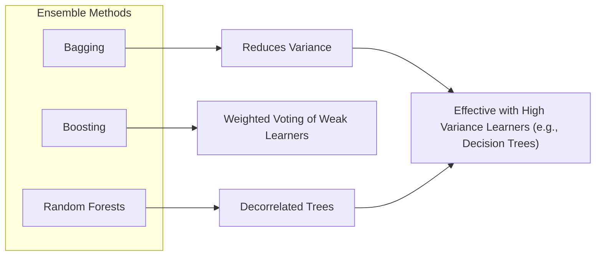
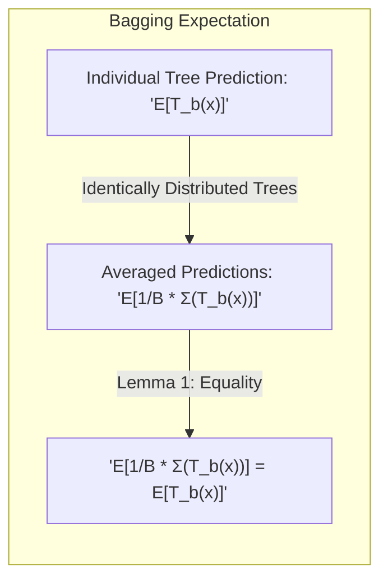
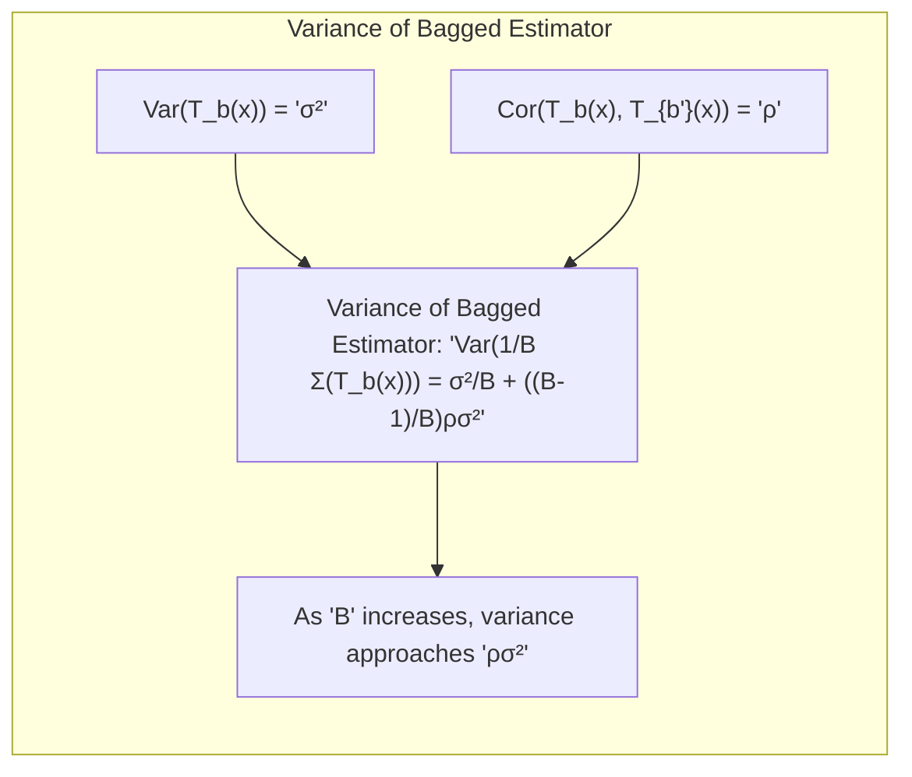
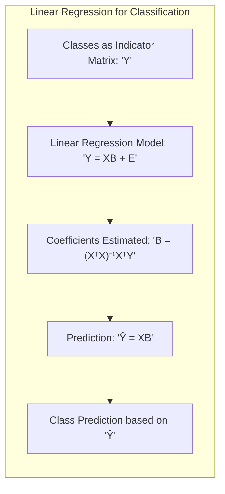
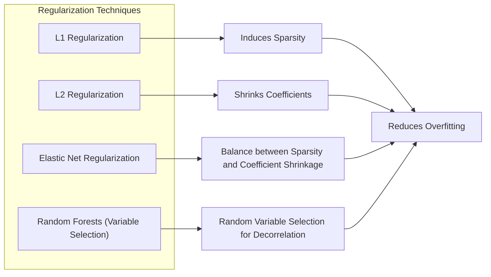
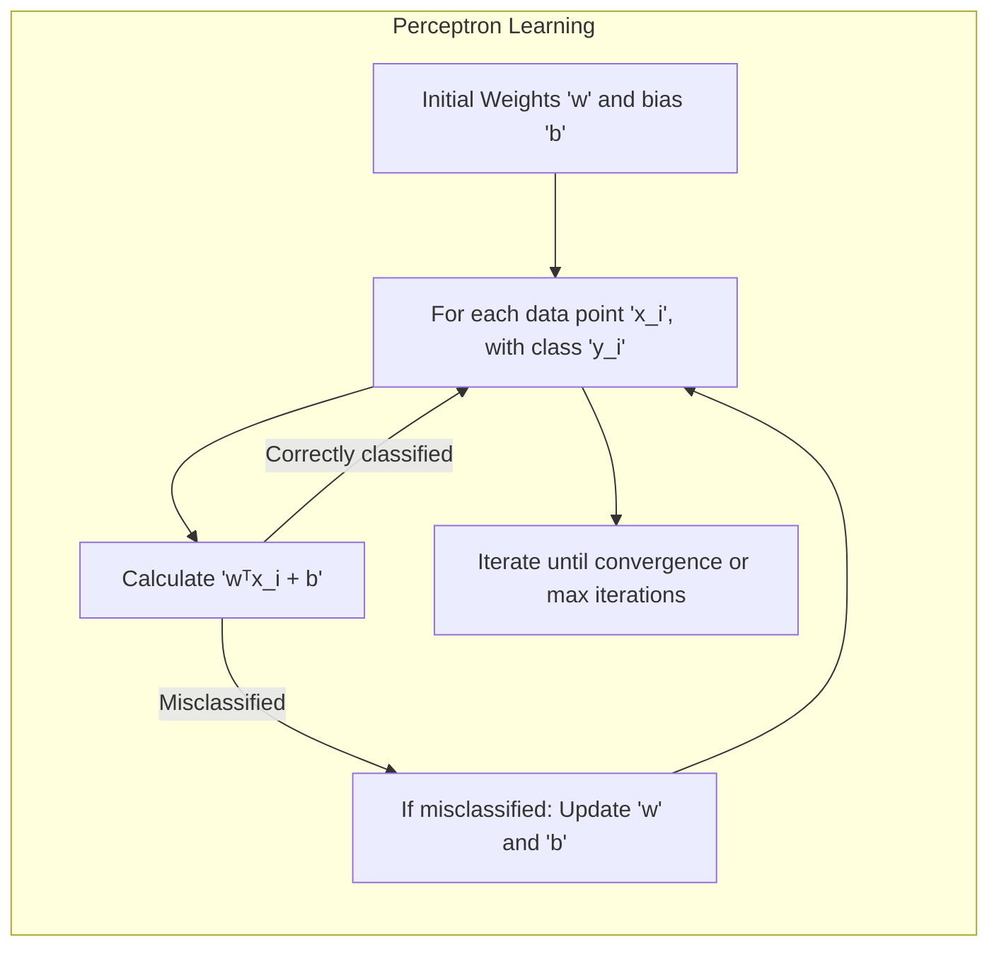
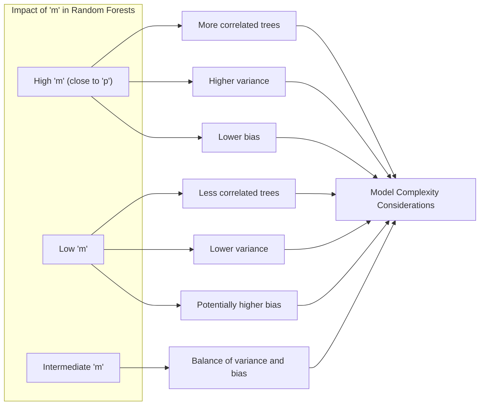

## Árvores como Candidatas para Bagging



### Introdução
O conceito de **bagging** ou *bootstrap aggregation* surge como uma técnica para reduzir a variância de uma função de predição estimada, conforme mencionado em [^15.1]. Este método se mostra particularmente eficaz em procedimentos de alta variância e baixo viés, como as árvores de decisão. Em problemas de regressão, o bagging envolve ajustar a mesma árvore de regressão repetidamente em amostras bootstrap dos dados de treinamento, e então calcular a média dos resultados. Para classificação, um comitê de árvores vota na classe predita [^15.1]. Diferentemente do **boosting**, onde um comitê de *learners* fracos evolui ao longo do tempo e seus membros votam de forma ponderada, o bagging mantém a estrutura de um comitê de *learners* independentes, focando na redução de variância [^15.1]. **Random Forests**, introduzido por Breiman em 2001, é uma modificação substancial do bagging que constrói uma coleção de árvores decorrelacionadas, com desempenho similar ao boosting em muitos problemas, mas com um processo de treinamento e ajuste mais simples [^15.1]. Este capítulo explora as características e mecanismos dos Random Forests, com ênfase nas árvores como candidatas ideais para o bagging.

### Conceitos Fundamentais

**Conceito 1:** O **problema de classificação** envolve a alocação de observações a categorias ou classes predefinidas. Métodos lineares de classificação, como LDA e Regressão Logística, fazem suposições sobre a forma das fronteiras de decisão, o que pode introduzir viés, especialmente quando as relações entre as variáveis não são lineares. Árvores de decisão, por sua vez, podem capturar interações complexas nos dados, mas são propensas a alta variância [^15.1]. O uso de árvores em bagging busca mitigar essa alta variância por meio da agregação, sem aumentar o viés.

**Lemma 1:** *A esperança da média de B árvores geradas por bagging (identicamente distribuídas) é igual à esperança de qualquer uma das árvores individuais.* Isso significa que o viés das árvores em bagging é igual ao viés de uma única árvore, e a melhoria vem da redução de variância [^15.2]. Formalmente, seja $T_b(x)$ a predição da b-ésima árvore, então $$E[\frac{1}{B} \sum_{b=1}^B T_b(x)] = E[T_b(x)].$$
> 💡 **Exemplo Numérico:** Suponha que temos 3 árvores (B=3) treinadas em amostras bootstrap diferentes. Para uma dada observação *x*, as predições das árvores são: $T_1(x) = 5$, $T_2(x) = 7$, e $T_3(x) = 6$. A predição do bagging é a média: $\frac{5 + 7 + 6}{3} = 6$. Se o valor esperado de cada árvore individual $E[T_b(x)]$ fosse 6, então o valor esperado da média das árvores seria também 6, conforme expresso no Lemma 1.


**Conceito 2:** A **Linear Discriminant Analysis (LDA)** assume que as classes seguem distribuições normais com covariâncias iguais. As fronteiras de decisão resultantes são lineares. No entanto, essa suposição nem sempre se mantém nos dados reais [^4.3]. O uso de LDA, embora simples, pode levar a um modelo com alto viés em cenários não lineares. Árvores de decisão, em contraste, não fazem tais suposições e podem se ajustar a diversas formas de fronteiras de decisão, mesmo que de forma complexa e ruidosa [^15.1]. A combinação de árvores em bagging aborda a instabilidade das árvores, sem comprometer a flexibilidade para modelar não-linearidades.

**Corolário 1:** Se as árvores individuais em um modelo de bagging são decorrelacionadas, a variância do estimador agregado é reduzida proporcionalmente ao número de árvores *B*. Ou seja, se $\text{Var}(T_b(x)) = \sigma^2$ e $\text{Cor}(T_b(x),T_{b'}(x)) = \rho$, então a variância do estimador de bagging é dada por $$\text{Var}(\frac{1}{B}\sum_{b=1}^B T_b(x)) = \frac{\sigma^2}{B} + \frac{B-1}{B}\rho\sigma^2$$ que se aproxima de $\rho\sigma^2$ quando $B$ tende ao infinito, indicando que a correlação entre as árvores limita o benefício do bagging [^15.2].
> 💡 **Exemplo Numérico:** Suponha que a variância da predição de cada árvore seja $\sigma^2 = 4$ e que a correlação entre as árvores seja $\rho = 0.5$. Se usarmos 10 árvores (B=10), a variância da predição do bagging será $\frac{4}{10} + \frac{9}{10} \times 0.5 \times 4 = 0.4 + 1.8 = 2.2$. Se usarmos 100 árvores (B=100), a variância será $\frac{4}{100} + \frac{99}{100} \times 0.5 \times 4 = 0.04 + 1.98 = 2.02$.  Como podemos observar, o aumento no número de árvores reduz a variância, embora ela se aproxime de $\rho\sigma^2=2$ quando B é grande, o que mostra como a correlação limita a redução da variância.


**Conceito 3:** A **Regressão Logística** modela a probabilidade de uma observação pertencer a uma classe usando a função logística. O modelo assume uma relação linear entre os preditores e o *logit* da probabilidade [^4.4]. Assim como o LDA, a Regressão Logística é um modelo linear e pode ser inadequado para relações complexas. Árvores de decisão, com sua capacidade de modelar interações, oferecem uma alternativa. A combinação de árvores em um método de ensemble como o random forest, aproveita sua capacidade de modelar não-linearidades, ao mesmo tempo que reduz a variância através do processo de agregação [^15.1].
> ⚠️ **Nota Importante**: A escolha entre métodos lineares como LDA e Regressão Logística ou modelos não lineares como árvores de decisão depende da estrutura dos dados e da complexidade da relação entre as variáveis e a variável resposta.
> ❗ **Ponto de Atenção**: Bagging e Random Forests são especialmente úteis quando os dados exibem relações não lineares e onde o uso de modelos mais simples podem gerar modelos com alto viés.
> ✔️ **Destaque**: Random Forests, ao introduzir aleatoriedade na seleção das variáveis em cada divisão, consegue reduzir a correlação entre as árvores, resultando em uma variância menor em comparação com o bagging simples [^15.2].

### Regressão Linear e Mínimos Quadrados para Classificação



A regressão linear pode ser aplicada na classificação através da regressão em matrizes de indicadores, onde cada classe é representada por uma coluna na matriz, e os valores assumem 0 ou 1 dependendo da classe da observação [^4.2]. Embora esta abordagem possa parecer direta, ela possui limitações. O problema principal é que a regressão linear não restringe as predições entre 0 e 1, podendo gerar valores fora desse intervalo, dificultando a interpretação em termos de probabilidades de classe [^4.2]. Além disso, a regressão linear minimiza o erro quadrático médio, o que não é ideal para classificação, onde o objetivo é maximizar a precisão da previsão da classe correta [^15.1].

A regressão linear com matrizes de indicadores pode ser expressa como:

$$Y = XB + E$$

Onde Y é a matriz de indicadores, X é a matriz de preditores, B é a matriz de coeficientes, e E é a matriz de erros. Os coeficientes B são estimados via o método de mínimos quadrados. Em problemas de classificação, essa técnica pode ser inadequada para determinar fronteiras de decisão precisas, pois o erro quadrático não é uma métrica diretamente relacionada à correta classificação.

**Lemma 2:** Em condições ideais, a fronteira de decisão obtida por regressão linear em uma matriz de indicadores para um problema de classificação binária é equivalente à fronteira de decisão de um modelo discriminante linear. Isso ocorre quando as classes são bem separadas e há um número suficiente de dados, o que leva a que ambas abordagens encontrem hiperplanos de separação similares [^4.2].
**Prova do Lemma 2:** Seja $y_i \in \{0, 1\}$ as classes de resposta, e $x_i$ os preditores. Na regressão linear, buscamos minimizar $||Y-XB||^2$, enquanto na análise discriminante linear (LDA) buscamos encontrar um hiperplano que separe as classes. Quando as classes são bem separadas, ambas abordagens tendem a convergir para hiperplanos similares. Na regressão linear, temos:

$$ \hat{Y} = XB\qquad \text{onde} \quad B = (X^T X)^{-1}X^TY $$

e na LDA, o hiperplano é dado por:

$$ w^T x + b = 0  $$

onde $w$ e $b$ são parâmetros do discriminante linear. Quando as classes são linearmente separáveis e as variâncias são iguais, $w$ e $b$ obtidos pela LDA e os coeficientes B da regressão linear se relacionam de tal maneira que o mesmo hiperplano de decisão é gerado, estabelecendo a equivalência sob certas condições. $\blacksquare$
> 💡 **Exemplo Numérico:** Vamos considerar um exemplo simples com duas classes e dois preditores. Suponha que temos as seguintes observações:
> Classe 0: (1, 1), (2, 1), (1, 2)
> Classe 1: (2, 3), (3, 2), (3, 3)
> A matriz de indicadores Y teria as linhas [1, 0], [1, 0], [1, 0], [0, 1], [0, 1], [0, 1]. A matriz X teria as linhas [1, 1], [2, 1], [1, 2], [2, 3], [3, 2], [3, 3]. Ao aplicar a regressão linear, vamos encontrar uma matriz B que minimiza o erro quadrático, e que sob a condição de separabilidade linear,  fornecerá um hiperplano de separação similar ao que seria encontrado por LDA.
```python
import numpy as np
from sklearn.linear_model import LinearRegression
X = np.array([[1, 1], [2, 1], [1, 2], [2, 3], [3, 2], [3, 3]])
Y = np.array([[1, 0], [1, 0], [1, 0], [0, 1], [0, 1], [0, 1]])

model = LinearRegression()
model.fit(X,Y)

print("Coeficientes B:\n", model.coef_)
print("Intercepto:\n", model.intercept_)

```
> A saída deste código mostra os coeficientes que definem o hiperplano de separação.

**Corolário 2:** Como a regressão linear pode ser interpretada como uma forma de discriminante linear, suas limitações em modelar não-linearidades também se aplicam a esse contexto. Ou seja, se as classes não são linearmente separáveis, ou se as relações entre as variáveis não forem lineares, a regressão linear em matrizes de indicadores terá um desempenho subótimo [^4.2]. Isso ressalta a importância de métodos mais flexíveis, como as árvores de decisão, e da necessidade de técnicas como bagging para reduzir a alta variância dessas árvores [^15.1].

A regressão de indicadores, embora útil para introduzir conceitos básicos, pode levar a extrapolações fora do intervalo [0,1], especialmente quando aplicada em conjunto com modelos lineares. O uso de métodos mais flexíveis, como árvores de decisão e random forests, torna-se essencial para obter modelos robustos e precisos em problemas complexos de classificação [^15.1].

### Métodos de Seleção de Variáveis e Regularização em Classificação


A seleção de variáveis e a regularização são técnicas cruciais para melhorar a generalização de modelos de classificação e para evitar o overfitting [^4.4.4], [^4.5]. Modelos complexos com muitas variáveis tendem a se ajustar ao ruído nos dados de treinamento, perdendo a capacidade de generalizar para novos dados. A regularização L1 adiciona uma penalidade à soma dos valores absolutos dos coeficientes no modelo. Isso tende a gerar modelos esparsos, onde muitos coeficientes são exatamente zero, efetivamente realizando seleção de variáveis [^4.4.4]. A regularização L2, por outro lado, adiciona uma penalidade à soma dos quadrados dos coeficientes, o que tende a encolher todos os coeficientes em direção a zero sem gerar esparsidade completa. A combinação dessas duas penalidades resulta no *Elastic Net*, que busca um equilíbrio entre esparsidade e redução dos coeficientes [^4.5].

No contexto da Regressão Logística, a função de custo penalizada pela regularização L1 pode ser escrita como:

$$-\frac{1}{N} \sum_{i=1}^{N} [y_i \log(p_i) + (1 - y_i)\log(1 - p_i)] + \lambda \sum_{j=1}^{p} |\beta_j|$$

Onde $p_i$ é a probabilidade predita, $y_i$ é o valor da classe (0 ou 1), $\beta_j$ são os coeficientes do modelo, e $\lambda$ é o parâmetro de regularização que controla o balanço entre ajuste aos dados e esparsidade dos coeficientes.
> 💡 **Exemplo Numérico:** Suponha que estamos ajustando um modelo de regressão logística com regularização L1. A função de custo sem regularização é o erro logístico (cross-entropy). Ao adicionarmos a regularização L1, a função de custo é modificada. Vamos considerar um cenário com dois preditores e um parâmetro de regularização $\lambda=0.5$. Os coeficientes são $\beta_1 = 2$ e $\beta_2 = -1$. A penalidade L1 é dada por $\lambda(|\beta_1| + |\beta_2|) = 0.5 \times (|2| + |-1|) = 1.5$.  Quando otimizamos o modelo, a regularização L1 força os coeficientes a serem menores. Em um cenário onde $\beta_1$ é um coeficiente menos importante, a regularização L1 poderia eventualmente zerar $\beta_1$, deixando um modelo esparso com apenas $\beta_2$ como preditor relevante.
> ```python
> import numpy as np
> from sklearn.linear_model import LogisticRegression
> from sklearn.model_selection import train_test_split
> from sklearn.metrics import accuracy_score
>
> # Gerando dados sintéticos
> np.random.seed(42)
> X = np.random.rand(100, 10)
> y = np.random.randint(0, 2, 100)
>
> # Dividindo os dados em treino e teste
> X_train, X_test, y_train, y_test = train_test_split(X, y, test_size=0.3)
>
> # Treinando um modelo de regressão logística sem regularização
> model_no_reg = LogisticRegression(penalty=None, solver='lbfgs')
> model_no_reg.fit(X_train, y_train)
> y_pred_no_reg = model_no_reg.predict(X_test)
>
> # Treinando um modelo com regularização L1
> model_l1_reg = LogisticRegression(penalty='l1', C=0.5, solver='liblinear') # C é o inverso de lambda
> model_l1_reg.fit(X_train, y_train)
> y_pred_l1_reg = model_l1_reg.predict(X_test)
>
>
> print("Acurácia sem regularização:", accuracy_score(y_test, y_pred_no_reg))
> print("Acurácia com regularização L1:", accuracy_score(y_test, y_pred_l1_reg))
> print("Coeficientes sem regularização:", model_no_reg.coef_)
> print("Coeficientes com regularização L1:", model_l1_reg.coef_)
> ```
> Este código exemplifica como a regularização L1 pode zerar alguns coeficientes (tornando o modelo esparso), o que facilita a interpretação e pode melhorar a generalização, embora possa sacrificar a acurácia em alguns casos. A escolha de lambda (C) é crucial e deve ser feita por validação cruzada.

**Lemma 3:** A penalização L1 em modelos de classificação logística induz esparsidade nos coeficientes do modelo, ou seja, muitos coeficientes tornam-se exatamente zero.
**Prova do Lemma 3:** A penalização L1 tem a forma $\lambda \sum_{j=1}^p |\beta_j|$. Ao tentar minimizar a função de custo com essa penalidade, a derivada da penalidade em relação a $\beta_j$ é $\lambda \cdot \text{sign}(\beta_j)$. Essa função derivada não é zero em $\beta_j = 0$, logo durante o processo de otimização, quando um $\beta_j$ se aproxima de zero, a otimização é induzida a torna-lo exatamente zero, pois o gradiente da função de custo (incluindo a penalidade) não é zero nesse ponto. Isso gera um modelo com muitos $\beta_j$ iguais a zero, o que caracteriza a esparsidade [^4.4.4]. $\blacksquare$

**Corolário 3:** A esparsidade induzida pela regularização L1 facilita a interpretação do modelo, pois as variáveis com coeficientes zero não contribuem para a predição, revelando as variáveis mais relevantes para a classificação. Isso auxilia na compreensão do processo e das relações nos dados [^4.4.5].

Random forests utilizam uma estratégia diferente para evitar o overfitting, baseada na seleção aleatória de variáveis em cada divisão da árvore. Ao invés de considerar todas as variáveis para a divisão, um subconjunto aleatório de *m* variáveis é selecionado como candidato. Esse processo de seleção aleatória induz uma descorrelação entre as árvores, o que resulta em uma redução da variância no modelo agregado [^15.2].
> ⚠️ **Ponto Crucial**: A regularização L1 e L2, assim como a seleção aleatória de variáveis em Random Forests, são ferramentas essenciais para evitar o overfitting e construir modelos de classificação robustos.

### Separating Hyperplanes e Perceptrons



A ideia de maximizar a margem de separação em classificadores lineares leva ao conceito de hiperplanos separadores ótimos [^4.5.2]. Em um problema de classificação binária, o objetivo é encontrar um hiperplano que separe as duas classes de forma que a distância (margem) entre o hiperplano e os pontos de dados mais próximos de cada classe seja a maior possível. Este hiperplano é definido por uma função linear:
$$w^Tx+b = 0$$
onde *w* é o vetor de pesos, *x* é o vetor de características e *b* é o bias. A ideia de maximização da margem leva a um problema de otimização quadrática, no qual procuramos maximizar a margem e garantir que todos os pontos de dados estejam corretamente classificados [^4.5.2].

O Perceptron de Rosenblatt é um algoritmo para aprendizado de um hiperplano separador linear. Ele itera sobre os dados, atualizando o vetor de pesos *w* e o bias *b* quando encontra um ponto mal classificado. O algoritmo tem convergência garantida sob a hipótese de separabilidade linear, o que significa que, se existir um hiperplano que separe perfeitamente as classes, o Perceptron o encontrará em um número finito de iterações [^4.5.1]. No entanto, se os dados não são linearmente separáveis, o algoritmo não converge, e este é um dos principais motivos pelos quais métodos como árvores de decisão e Random Forests são tão importantes [^15.1].
> 💡 **Exemplo Numérico:** Vamos simular um problema de classificação binária com dados linearmente separáveis: Classe 1: (1, 1), (2, 2), (3, 1); Classe 2: (4, 4), (5, 5), (6, 4). O perceptron itera atualizando os pesos de forma a encontrar um hiperplano que separe os dados. Vamos ilustrar uma possível iteração:
> 1. Inicialização: $w = [0, 0]$, $b=0$.
> 2. Processa ponto (1,1) - Classe 1:  $w^Tx + b = 0*1 + 0*1 + 0 = 0$.  Como 0 < 0 (critério de classificação errado), atualizamos $w = w + x = [1, 1]$ e $b = b+1 = 1$.
> 3. Processa ponto (4,4) - Classe 2: $w^Tx + b = 1*4 + 1*4 + 1 = 9$. Como 9 > 0 (classificado como classe 1, que está incorreto), atualizamos $w = w - x = [-3, -3]$ e $b = b - 1 = 0$.
> Este processo continua até que todos os pontos sejam classificados corretamente.
> ```python
> import numpy as np
>
> class Perceptron:
>    def __init__(self, learning_rate=0.1, n_iterations=100):
>        self.learning_rate = learning_rate
>        self.n_iterations = n_iterations
>        self.weights = None
>        self.bias = None
>    def fit(self, X, y):
>        self.weights = np.zeros(X.shape[1])
>        self.bias = 0
>        for _ in range(self.n_iterations):
>          errors = 0
>          for xi, yi in zip(X, y):
>            if (np.dot(xi, self.weights) + self.bias) > 0 :
>              prediction = 1
>            else:
>              prediction = -1
>            if prediction != yi:
>                errors += 1
>                self.weights += self.learning_rate * yi * xi
>                self.bias += self.learning_rate * yi
>          if errors == 0:
>            break
>    def predict(self, X):
>      predictions = []
>      for xi in X:
>        if np.dot(xi, self.weights) + self.bias > 0:
>          predictions.append(1)
>        else:
>          predictions.append(-1)
>      return np.array(predictions)
>
>
> X = np.array([[1, 1], [2, 2], [3, 1], [4, 4], [5, 5], [6, 4]])
> y = np.array([1, 1, 1, -1, -1, -1])
>
> perceptron = Perceptron()
> perceptron.fit(X,y)
>
> test_X = np.array([[2,1],[5,6]])
> predictions = perceptron.predict(test_X)
> print("Pesos:", perceptron.weights)
> print("Bias:", perceptron.bias)
> print("Predições:", predictions)
> ```
> Este exemplo mostra como o perceptron aprende um hiperplano separador por meio de ajustes iterativos dos pesos e do bias, até classificar corretamente os pontos de treinamento. Em casos não linearmente separáveis, o perceptron não convergirá para uma solução.

### Pergunta Teórica Avançada (Exemplo): Qual a relação entre a escolha do parâmetro *m* em random forests e a complexidade e variabilidade do modelo?


**Resposta:**
Em Random Forests, o parâmetro *m* controla o número de variáveis candidatas a serem consideradas em cada divisão de uma árvore. Se *m* é próximo de *p*, o número total de variáveis, as árvores tendem a ficar mais correlacionadas, com maior variância e menor viés. Isso ocorre porque cada árvore terá acesso a quase todas as mesmas variáveis para cada divisão, levando a uma alta similaridade entre as árvores. Por outro lado, um valor pequeno de *m* induz árvores mais diversas e menos correlacionadas, resultando em menor variância no modelo agregado, mas com um potencial aumento do viés [^15.2].

**Lemma 4:** A escolha de um valor muito pequeno de *m* aumenta a variabilidade da *contribuição individual* de cada variável em cada árvore, o que pode levar a um modelo com maior viés.
**Prova do Lemma 4:**  Quando m é pequeno, cada árvore vai usar um número muito reduzido de variáveis, sem incluir muitas vezes as variáveis relevantes, o que impede que a árvore se ajuste apropriadamente aos dados. Logo a previsão individual de cada árvore é mais enviesada. $\blacksquare$

**Corolário 4:** A escolha de um valor de *m* intermediário busca um equilíbrio entre a redução da correlação entre as árvores (para diminuir a variância) e a inclusão de variáveis relevantes (para reduzir o viés). Um bom valor de *m* é um hiperparâmetro que precisa ser ajustado usando validação cruzada ou outros métodos de ajuste de hiperparâmetros [^15.3].
> 💡 **Exemplo Numérico:** Suponha que temos um problema de classificação com 10 variáveis (p=10). Se escolhermos $m=1$, cada árvore na random forest considerará apenas uma variável aleatória a cada divisão. Isso resultará em árvores muito diversas, e possivelmente com alto viés, pois elas perdem a oportunidade de combinar informações de variáveis relevantes que não estão selecionadas. Se escolhermos $m=9$, as árvores terão acesso a quase todas as variáveis em cada divisão, resultando em árvores muito similares e correlacionadas. Uma escolha intermediária como $m=3$ busca um equilíbrio entre diversidade e utilização de variáveis relevantes. Usar validação cruzada para encontrar o valor ideal de m é fundamental.
> ```python
> import numpy as np
> from sklearn.ensemble import RandomForestClassifier
> from sklearn.model_selection import train_test_split
> from sklearn.metrics import accuracy_score
>
> # Gerando dados sintéticos
> np.random.seed(42)
> X = np.random.rand(100, 10)
> y = np.random.randint(0, 2, 100)
>
> # Dividindo os dados em treino e teste
> X_train, X_test, y_train, y_test = train_test_split(X, y, test_size=0.3)
>
> # Treinando modelos com diferentes valores de m
> model_m1 = RandomForestClassifier(max_features=1, random_state=42)
> model_m1.fit(X_train, y_train)
> y_pred_m1 = model_m1.predict(X_test)
>
> model_m3 = RandomForestClassifier(max_features=3, random_state=42)
> model_m3.fit(X_train, y_train)
> y_pred_m3 = model_m3.predict(X_test)
>
> model_m9 = RandomForestClassifier(max_features=9, random_state=42)
> model_m9.fit(X_train, y_train)
> y_pred_m9 = model_m9.predict(X_test)
>
> print("Acurácia com m=1:", accuracy_score(y_test, y_pred_m1))
> print("Acurácia com m=3:", accuracy_score(y_test, y_pred_m3))
> print("Acurácia com m=9:", accuracy_score(y_test, y_pred_m9))
> ```
> Este exemplo mostra como diferentes valores de *m* podem afetar a acurácia de um modelo Random Forest. O valor ideal depende da estrutura dos dados.

> ⚠️ **Ponto Crucial**: A escolha do parâmetro *m* em random forests é crucial para equilibrar o viés e a variância do modelo. Valores muito altos de *m* levam a modelos mais similares entre si, com alta variância, e valores muito baixos de *m* levam a modelos enviesados e pouco adaptados aos dados.

### Conclusão

As árvores de decisão, com sua capacidade de capturar interações complexas e não-linearidades, são candidatas ideais para o bagging, e especialmente para o random forest. A combinação da flexibilidade das árvores com técnicas de agregação, e em particular a randomização na seleção de variáveis do random forest, leva a modelos robustos e de alta precisão, com baixa variância e viés adequadamente balanceado, que se destacam em diversas aplicações [^15.1].

### Referências
[^15.1]: "Bagging or bootstrap aggregation (section 8.7) is a technique for reducing the variance of an estimated prediction function. Bagging seems to work especially well for high-variance, low-bias procedures, such as trees. For regression, we simply fit the same regression tree many times to bootstrap-sampled versions of the training data, and average the result. For classification, a committee of trees each cast a vote for the predicted class. Boosting in Chapter 10 was initially proposed as a committee method as well, although unlike bagging, the committee of weak learners evolves over time, and the members cast a weighted vote. Boosting appears to dominate bagging on most problems, and became the preferred choice. Random forests (Breiman, 2001) is a substantial modification of bagging that builds a large collection of de-correlated trees, and then averages them. On many problems the performance of random forests is very similar to boosting, and they are simpler to train and tune. As a consequence, random forests are popular, and are implemented in a variety of packages." *(Trecho de <Random Forests>)*
[^15.2]: "The essential idea in bagging (Section 8.7) is to average many noisy but approximately unbiased models, and hence reduce the variance. Trees are ideal candidates for bagging, since they can capture complex interaction structures in the data, and if grown sufficiently deep, have relatively low bias. Since trees are notoriously noisy, they benefit greatly from the averaging. Moreover, since each tree generated in bagging is identically distributed (i.d.), the expectation of an average of B such trees is the same as the expectation of any one of them. This means the bias of bagged trees is the same as that of the individual trees, and the only hope of improvement is through variance reduction. This is in contrast to boosting, where the trees are grown in an adaptive way to remove bias, and hence are not i.d. An average of B i.i.d. random variables, each with variance σ², has variance σ²/B. If the variables are simply i.d. (identically distributed, but not necessarily independent) with positive pairwise correlation ρ, the variance of the average is (Exercise 15.1) σ²/B + (1-1/B)ρσ². As B increases, the second