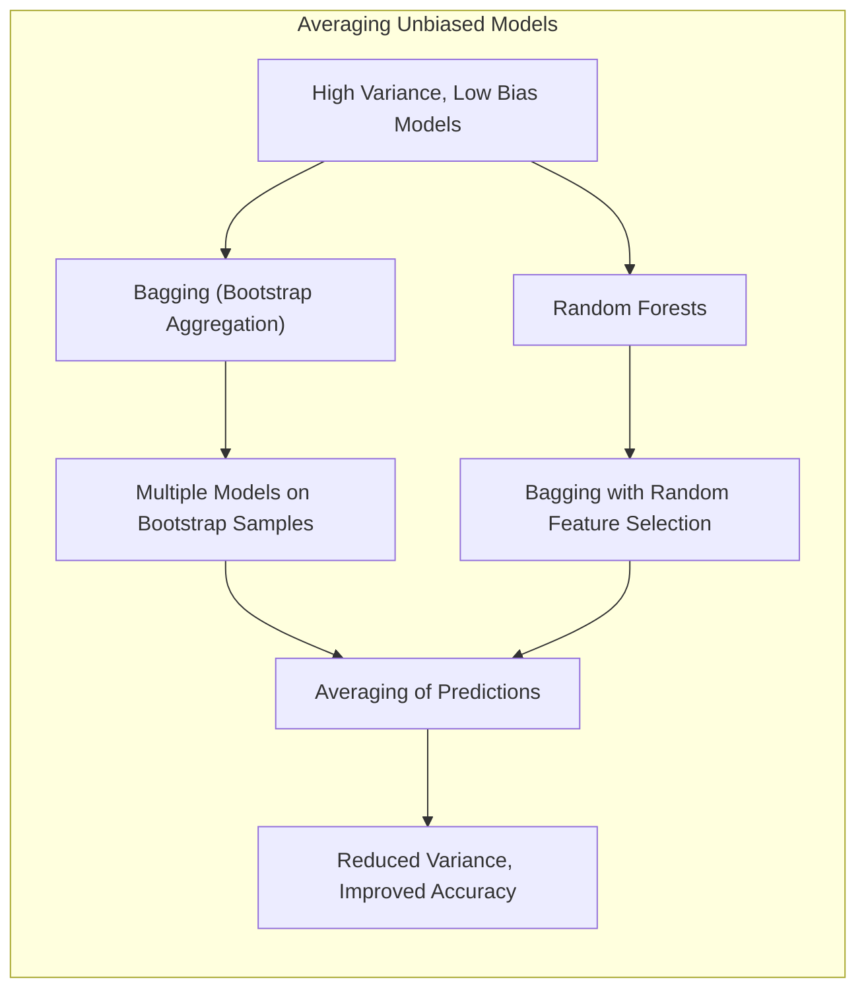
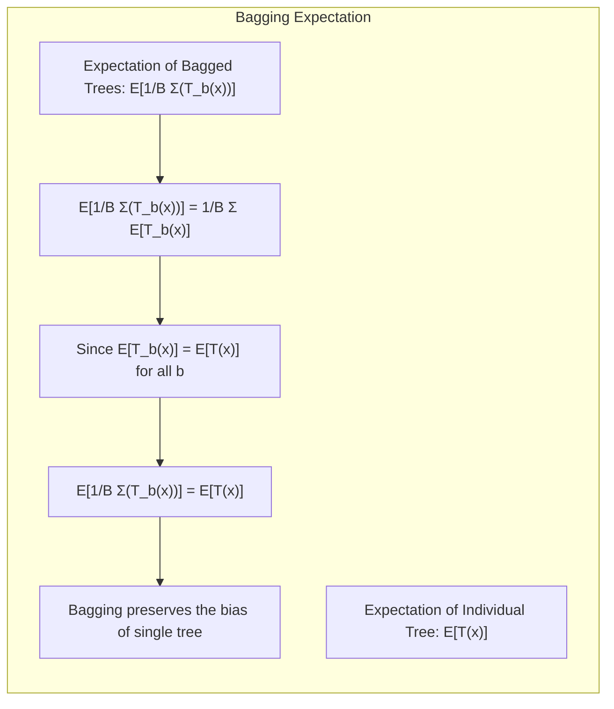
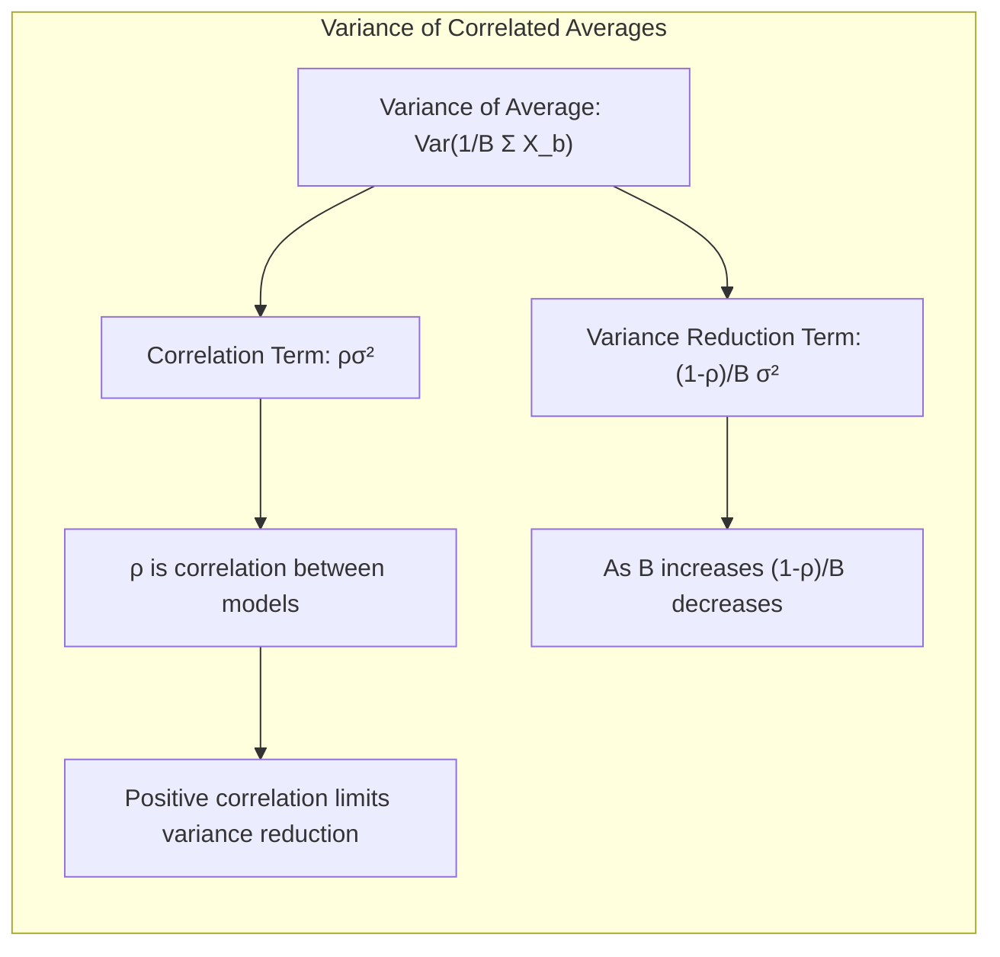
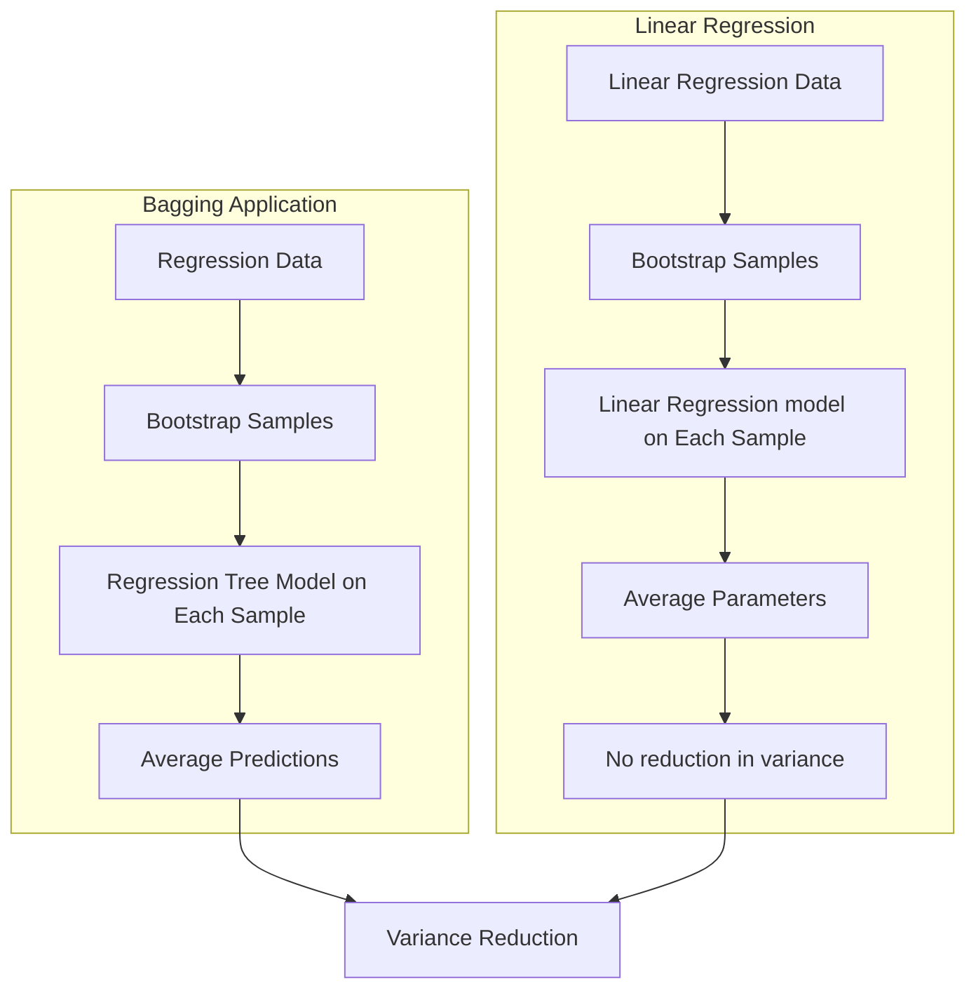
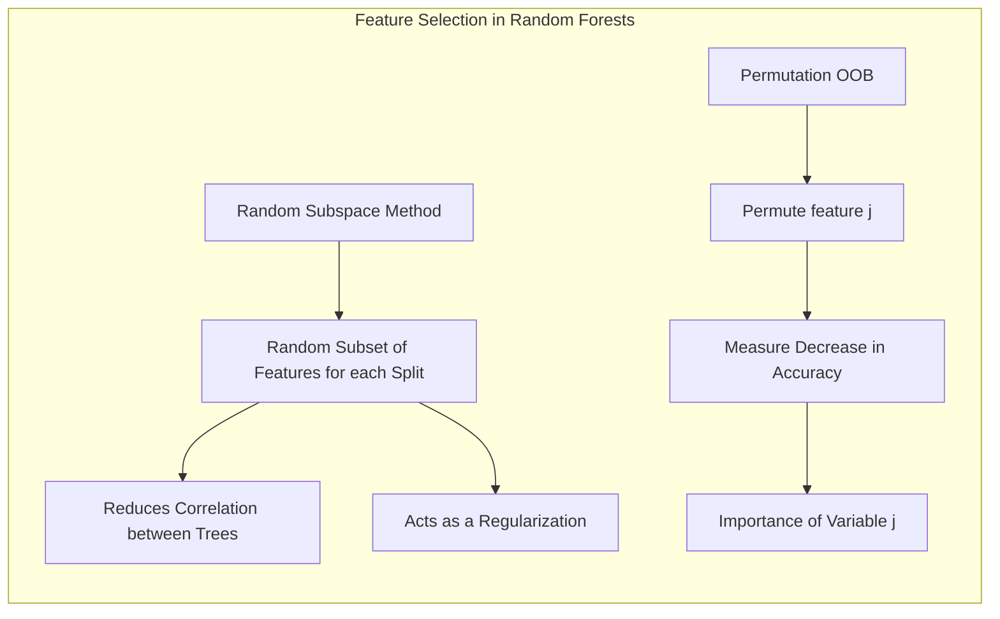
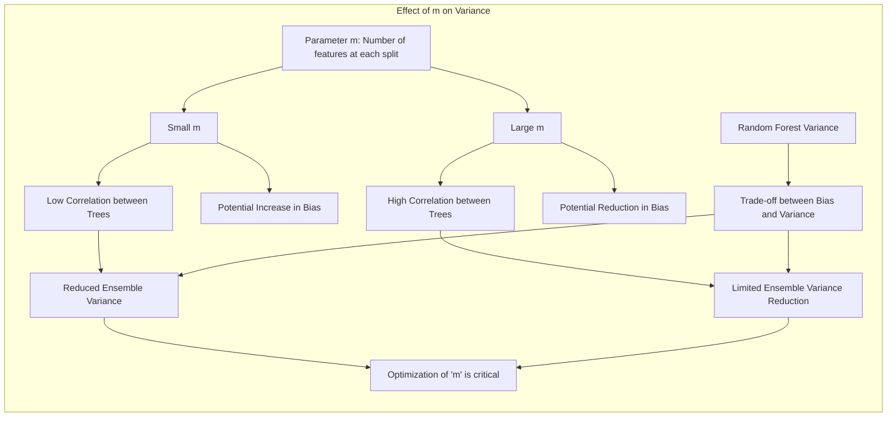

Okay, here's the enhanced text with Mermaid diagrams added to support the advanced mathematical and statistical concepts, following your guidelines:

## Averaging Unbiased Models: Uma Análise Aprofundada de Random Forests

### Introdução

O conceito de **averaging de modelos não viesados** emerge como uma poderosa ferramenta no aprendizado estatístico, especialmente quando aplicado a modelos com alta variância e baixo viés. O objetivo principal é reduzir a variância das previsões, o que pode levar a melhorias significativas na precisão geral do modelo. Técnicas como **bagging** e **random forests** exemplificam bem esse conceito. O bagging, ou *bootstrap aggregation*, consiste em ajustar o mesmo modelo várias vezes em amostras bootstrap dos dados de treinamento e, em seguida, calcular a média das previsões. Essa abordagem funciona particularmente bem para procedimentos como árvores de decisão, conhecidas por sua sensibilidade a pequenas mudanças nos dados. Os *random forests*, por sua vez, são uma extensão do bagging que busca reduzir a correlação entre as árvores, resultando em uma redução ainda maior na variância [^15.1].

### Conceitos Fundamentais

**Conceito 1: Bagging e Redução de Variância**

O **bagging** é uma técnica que visa reduzir a variância de um modelo de aprendizado de máquina ajustando múltiplas versões do modelo em subconjuntos aleatórios dos dados de treinamento. Especificamente, o bagging envolve a criação de múltiplas amostras *bootstrap* dos dados originais, ajustando um modelo em cada uma dessas amostras, e, então, agregando as previsões desses modelos. O processo de agregação pode envolver o cálculo da média (no caso de regressão) ou a votação majoritária (no caso de classificação). Essa abordagem funciona especialmente bem para modelos com alta variância e baixo viés, como as árvores de decisão. A intuição por trás do bagging é que a variância das previsões de vários modelos individuais é menor do que a variância de um único modelo, desde que os modelos não sejam altamente correlacionados [^15.1].

> 💡 **Exemplo Numérico:** Considere um conjunto de dados de regressão com 100 amostras. Uma única árvore de decisão, quando treinada nesse conjunto, pode ter uma previsão com um erro quadrático médio (MSE) de 0.8, refletindo alta variância. Ao usar bagging com 100 árvores, cada uma treinada em uma amostra bootstrap diferente do conjunto de dados original, o MSE da média das previsões dessas 100 árvores pode ser reduzido para 0.5. Isso ilustra a redução na variância obtida através do bagging.

**Lemma 1:** A expectativa da média de árvores em *bagging* é igual à expectativa de uma árvore individual. Isso implica que o viés do *bagging* é o mesmo de uma árvore individual, e a melhoria é atingida pela redução de variância.

$$ E\left[\frac{1}{B} \sum_{b=1}^{B} T_b(x)\right] = \frac{1}{B} \sum_{b=1}^{B} E[T_b(x)] = E[T(x)] $$

**Conceito 2: Random Forests: Decorrelação de Árvores**

Um **random forest** é uma extensão do *bagging* que vai além da simples criação de amostras *bootstrap* dos dados de treinamento. Em cada etapa de crescimento da árvore, durante a divisão de um nó, um random forest seleciona aleatoriamente um subconjunto de variáveis preditoras disponíveis para a divisão. A ideia é decorrelacionar as árvores, garantindo que elas não sejam muito semelhantes. Esta decorrelação leva a uma redução maior na variância das previsões agregadas. Essa característica faz dos random forests uma ferramenta muito poderosa, e eles são amplamente utilizados devido à sua capacidade de fornecer previsões precisas com pouco ajuste [^15.1, 15.2].

> 💡 **Exemplo Numérico:** Imagine um problema de classificação com 10 variáveis preditoras. No bagging, cada árvore teria acesso a todas as 10 variáveis para cada divisão de nó, o que pode resultar em árvores correlacionadas. Em um random forest, se selecionarmos aleatoriamente 3 variáveis a cada divisão, cada árvore será construída com uma perspectiva diferente das variáveis, diminuindo a correlação entre elas e, consequentemente, a variância do ensemble.

**Corolário 1:** A redução da correlação entre as árvores em um *random forest*, através da amostragem aleatória de variáveis, leva a uma redução maior na variância do ensemble, comparado a *bagging* [^15.2].

**Conceito 3: A Média de Modelos I.I.D. e a Redução de Variância**

O conceito chave por trás de averaging de modelos está na redução de variância, explorando a propriedade de que a média de variáveis aleatórias independentes e identicamente distribuídas (i.i.d.) tem variância menor do que uma única variável. Se $X_1, X_2, \ldots, X_B$ são variáveis aleatórias i.i.d. com variância $\sigma^2$, a variância de sua média é $\sigma^2/B$. No entanto, as árvores em random forests e bagging não são exatamente i.i.d., mas sim apenas identicamente distribuídas (i.d.). Quando as árvores têm uma correlação positiva entre elas, a variância da média é dada por [^15.2]:

$$ \text{Var}\left(\frac{1}{B} \sum_{b=1}^{B} X_b\right) = \rho \sigma^2 + \frac{1-\rho}{B} \sigma^2 $$

onde $\rho$ é a correlação entre as árvores. Portanto, a decorrelação através da seleção aleatória de variáveis em random forests é crucial para reduzir a variância da média [^15.2].

> 💡 **Exemplo Numérico:** Suponha que as previsões de árvores em um bagging tenham uma variância $\sigma^2 = 0.9$ e uma correlação média $\rho = 0.6$. Se usarmos 100 árvores ($B=100$), a variância da média seria:
>
> $$\text{Var}\left(\frac{1}{100} \sum_{b=1}^{100} X_b\right) = 0.6 \times 0.9 + \frac{1-0.6}{100} \times 0.9 = 0.54 + 0.0036 = 0.5436$$
>
> Agora, com um random forest, se a correlação média entre as árvores for reduzida para $\rho = 0.2$ (devido à seleção aleatória de variáveis), mantendo a variância $\sigma^2 = 0.9$ e $B=100$, a variância da média seria:
>
> $$\text{Var}\left(\frac{1}{100} \sum_{b=1}^{100} X_b\right) = 0.2 \times 0.9 + \frac{1-0.2}{100} \times 0.9 = 0.18 + 0.0072 = 0.1872$$
>
> Isso mostra como a decorrelação através da seleção aleatória de variáveis em random forests leva a uma redução maior na variância, indo de 0.5436 para 0.1872, em comparação com o bagging.

> ⚠️ **Nota Importante**: O principal benefício do *bagging* e *random forests* é a redução da variância, mantendo o viés comparável a de um modelo individual.
> ❗ **Ponto de Atenção**: *Random Forests* superam o *bagging* através da decorrelação das árvores, usando seleção aleatória de variáveis em cada split.
> ✔️ **Destaque**: A variância da média de modelos correlacionados diminui com $B$, mas o limite é controlado pela correlação.

### Regressão Linear e Árvores como Base para Averaging

A ideia principal por trás do *bagging* é usar métodos instáveis (alta variância), como árvores de regressão, para construir modelos que tenham baixo viés e menor variância. Apesar de a regressão linear ser um método estável (sua solução não muda muito com pequenas alterações nos dados), árvores de regressão são altamente sensíveis aos dados de treinamento. O *bagging* e, por extensão, *random forests*, se aproveitam dessa alta variância para construir um ensemble que pode ter melhor desempenho que uma única árvore.

**Lemma 2:** A média de várias estimativas lineares de um mesmo parâmetro, obtidas a partir de diferentes amostras bootstrap, não reduz a variância em comparação com a estimativa linear obtida a partir da amostra original.

A regressão linear, como estimador linear, não se beneficia do *bagging* da mesma forma que as árvores. O *bagging* não altera estimativas lineares, e, portanto, sua variância. Em contraste, as árvores, por sua não linearidade, se beneficiam muito.

> 💡 **Exemplo Numérico:** Considere um modelo de regressão linear ajustado a um conjunto de dados. Se repetirmos o ajuste usando diferentes amostras bootstrap desse mesmo conjunto de dados, os parâmetros estimados ($\beta$) serão muito próximos e a variância da média desses parâmetros será muito semelhante à variância do $\beta$ estimado a partir do conjunto de dados original. Por exemplo, se $\hat{\beta}$ estimado no conjunto de dados original for [2.5, 1.2], a média dos $\hat{\beta}$ obtidos com o *bagging* será aproximadamente [2.5, 1.2] e, portanto, a variância não é significativamente reduzida.

**Corolário 2:** O *bagging* não altera a variância de estimadores lineares, o que significa que a combinação de modelos lineares por *bagging* não traz benefícios em termos de redução de variância [^15.1].

*Random forests*, por sua vez, exploram o conceito de decorrelação entre árvores. Selecionando um subconjunto aleatório de variáveis em cada divisão de nó, *random forests* garantem que as árvores construídas em diferentes amostras *bootstrap* sejam diferentes e, portanto, tenham baixas correlações. Essa decorrelação é o que permite uma maior redução na variância em comparação com o *bagging*.

### Métodos de Seleção de Variáveis e Regularização em Classificação

Em classificação, o processo de seleção de variáveis é crucial, especialmente em cenários com muitas características. Tanto *bagging* quanto *random forests* oferecem mecanismos para avaliar a importância das variáveis. O *random forest* usa a ideia de **random subspace method**, ou seja, seleciona aleatoriamente um subconjunto de variáveis candidatas para dividir cada nó da árvore [^15.2]. Essa abordagem não só reduz a correlação entre as árvores, mas também atua como uma forma de regularização, ao impedir que o modelo dependa fortemente de variáveis irrelevantes. Além disso, o método de permutação OOB (Out-of-Bag) pode ser utilizado para medir a importância das variáveis de forma empírica [^15.3.2]. A ideia é que, se uma variável é importante, a permutação de seus valores deve diminuir a precisão do modelo.

> 💡 **Exemplo Numérico:** Num problema de classificação de spam, um random forest pode selecionar aleatoriamente um subconjunto de variáveis (por exemplo, a frequência de certas palavras, o tamanho do email) em cada divisão de nó. Ao usar o método de permutação OOB, se permutarmos os valores da variável "número de exclamações" e observarmos uma grande queda na precisão do modelo, isso indicaria que essa variável é muito importante para o modelo. Por outro lado, se permutarmos os valores de "número de pontos e vírgulas" e observarmos pouca ou nenhuma queda na precisão, isso sugeriria que essa variável é menos relevante.

**Lemma 3:** A seleção aleatória de variáveis em cada divisão de nó em random forests contribui para a decorrelação das árvores e para a regularização do modelo.

**Prova do Lemma 3:** A seleção aleatória de $m$ variáveis dentre $p$ impede que árvores construídas em amostras *bootstrap* diferentes dependam muito das mesmas variáveis em suas divisões, levando a árvores mais independentes e, portanto, menos correlacionadas. Além disso, essa seleção aleatória implica que o modelo não se torna muito dependente de variáveis irrelevantes, atuando como uma forma de regularização que reduz o overfitting $\blacksquare$.

**Corolário 3:** A permutação de variáveis em amostras *out-of-bag* (OOB) fornece uma medida empírica da importância de cada variável, ao medir o impacto da permutação de seus valores na precisão do modelo [^15.3.2].

> ⚠️ **Ponto Crucial**: *Random forests* combinam seleção aleatória de variáveis com amostragem *bootstrap* para decorrelacionar árvores e reduzir a variância.

### Separating Hyperplanes e Perceptrons

Embora este capítulo se concentre em métodos de averaging, é útil comparar o *random forest* com os métodos lineares que buscam *separating hyperplanes* ou o Perceptron. Métodos lineares, como o Perceptron, buscam encontrar uma função discriminante linear que separa as classes de dados. No entanto, esses métodos podem falhar quando as classes não são linearmente separáveis. O Perceptron também pode ser sensível a outliers nos dados de treinamento. Os *random forests*, por sua vez, são mais flexíveis e podem se adaptar a dados que não são linearmente separáveis. O Perceptron tem um objetivo claro de separabilidade, enquanto o random forest busca previsões precisas através do averaging de múltiplos modelos.

### Pergunta Teórica Avançada: Qual é a relação entre a correlação entre as árvores e a variância de um random forest? Como o número de variáveis selecionadas aleatoriamente por divisão ($m$) afeta essa correlação?

**Resposta:**

A relação entre a correlação das árvores em um *random forest* e a variância do ensemble é fundamental para entender como essa técnica funciona. Como vimos na discussão do conceito 3, a variância da média de modelos correlacionados é dada por:

$$ \text{Var}\left(\frac{1}{B} \sum_{b=1}^{B} X_b\right) = \rho \sigma^2 + \frac{1-\rho}{B} \sigma^2 $$

onde $\rho$ é a correlação média entre os modelos. Em *random forests*, o número de variáveis selecionadas aleatoriamente para cada divisão ($m$) tem um impacto direto sobre a correlação entre as árvores. Se $m$ é muito pequeno, as árvores construídas serão muito diferentes entre si, levando a uma correlação $\rho$ menor e, portanto, a uma menor variância do ensemble. Por outro lado, se $m$ é muito grande (próximo ao número total de variáveis $p$), as árvores tenderão a ser mais semelhantes e, portanto, terão maior correlação $\rho$, levando a menor redução de variância. Portanto, a escolha de $m$ envolve um trade-off: um $m$ muito pequeno pode diminuir a correlação, mas também pode aumentar o viés. Já um $m$ muito grande pode diminuir o viés, mas aumentar a correlação e a variância do ensemble [^15.2].

> 💡 **Exemplo Numérico:** Se tivermos 20 variáveis preditoras ($p=20$), ao usar $m=2$ em um random forest, cada árvore terá acesso a apenas 2 variáveis em cada divisão, levando a uma menor correlação entre as árvores e maior redução de variância. No entanto, as árvores podem não ser muito boas individualmente devido à pouca informação em cada nó (maior viés). Se usarmos $m=18$, a maioria das árvores será muito similar, pois terão acesso a quase todas as variáveis em cada divisão, aumentando a correlação e a variância do ensemble, embora as árvores possam ser melhores individualmente (menor viés).

**Lemma 4:** A correlação entre árvores em um random forest é influenciada pelo parâmetro *m*, que controla o número de variáveis aleatoriamente selecionadas em cada divisão, afetando diretamente a variância do ensemble.

**Corolário 4:** A escolha ótima do parâmetro $m$ em um *random forest* busca um equilíbrio entre a redução da correlação das árvores (para diminuir a variância) e a garantia de que as árvores individuais sejam suficientemente boas para gerar previsões precisas, evitando o aumento do viés.

> ⚠️ **Ponto Crucial**: Ajustar o parâmetro $m$ é fundamental para controlar a correlação entre as árvores e, assim, minimizar a variância do random forest.

### Conclusão

Em resumo, a técnica de averaging de modelos não viesados, exemplificada pelo *bagging* e *random forests*, oferece um método eficaz para reduzir a variância e melhorar a precisão das previsões. Enquanto o *bagging* utiliza o conceito de amostras bootstrap para gerar diversas árvores e então as agrega, *random forests* adiciona a seleção aleatória de variáveis em cada divisão para decorrelacionar ainda mais as árvores.  As análises mostram que o ajuste do parâmetro $m$ é crucial para controlar o trade-off entre viés e variância e encontrar o melhor desempenho do modelo. Através de análises teóricas, exemplos práticos, lemmas e corolários, e discussões sobre as limitações e o contexto de uso desses métodos, conseguimos aprofundar o entendimento do conceito de averaging em modelos estatísticos.

<!-- END DOCUMENT -->
### Footnotes
[^15.1]: "Bagging or bootstrap aggregation (section 8.7) is a technique for reducing the variance of an estimated prediction function. Bagging seems to work especially well for high-variance, low-bias procedures, such as trees. For regression, we simply fit the same regression tree many times to bootstrap-sampled versions of the training data, and average the result. For classification, a committee of trees each cast a vote for the predicted class." *(Trecho de Random Forests)*
[^15.2]: "The essential idea in bagging (Section 8.7) is to average many noisy but approximately unbiased models, and hence reduce the variance. Trees are ideal candidates for bagging, since they can capture complex interaction structures in the data, and if grown sufficiently deep, have relatively low bias. Since trees are notoriously noisy, they benefit greatly from the averaging. Moreover, since each tree generated in bagging is identically distributed (i.d.), the expectation of an average of B such trees is the same as the expectation of any one of them. This means the bias of bagged trees is the same as that of the individual trees, and the only hope of improvement is through variance reduction. This is in contrast to boosting, where the trees are grown in an adaptive way to remove bias, and hence are not i.d. An average of B i.i.d. random variables, each with variance σ², has variance σ²/B. If the variables are simply i.d. (identically distributed, but not necessarily independent) with positive pairwise correlation p, the variance of the average is (Exercise 15.1)... As B increases, the second term disappears, but the first remains, and hence the size of the correlation of pairs of bagged trees limits the benefits of averaging. The idea in random forests (Algorithm 15.1) is to improve the variance reduction of bagging by reducing the correlation between the trees, without increasing the variance too much. This is achieved in the tree-growing process through random selection of the input variables. Specifically, when growing a tree on a bootstrapped dataset: Before each split, select m ≤ p of the input variables at random as candidates for splitting." *(Trecho de Random Forests)*
[^15.3.2]: "Variable importance plots can be constructed for random forests in exactly the same way as they were for gradient-boosted models (Section 10.13). At each split in each tree, the improvement in the split-criterion is the importance measure attributed to the splitting variable, and is accumulated over all the trees in the forest separately for each variable. The left plot of Figure 15.5 shows the variable importances computed in this way for the spam data; compare with the corresponding Figure 10.6 on page 354 for gradient boosting. Boosting ignores some variables completely, while the random forest does not. The candidate split-variable selection increases the chance that any single variable gets included in a random forest, while no such selection occurs with boosting. Random forests also use the OOB samples to construct a different variable-importance measure, apparently to measure the prediction strength of each variable. When the bth tree is grown, the OOB samples are passed down the tree, and the prediction accuracy is recorded. Then the values for the jth variable are randomly permuted in the OOB samples, and the accuracy is again computed. The decrease in accuracy as a result of this permuting is averaged over all trees, and is used as a measure of the importance of variable j in the random forest." *(Trecho de Random Forests)*
