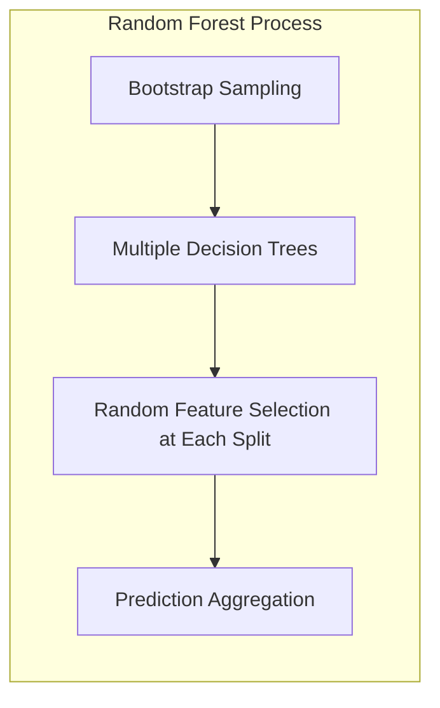
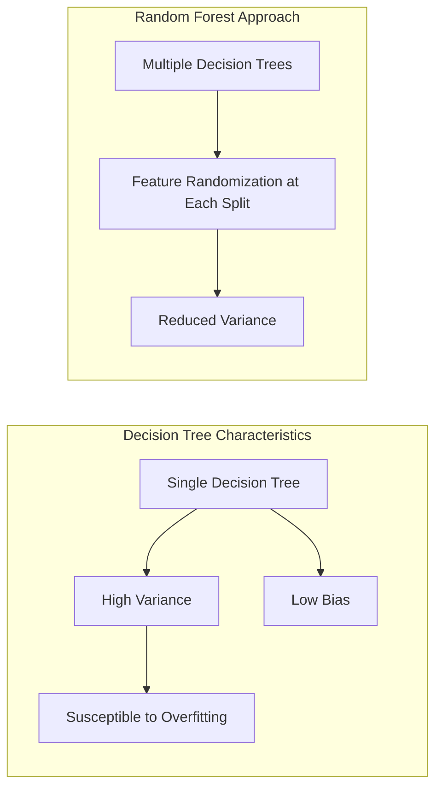
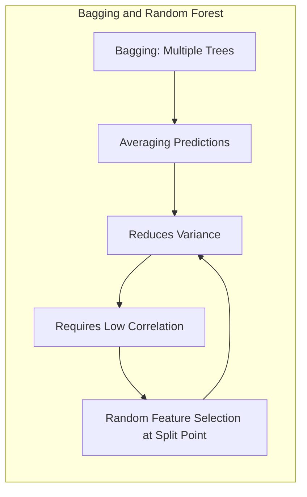
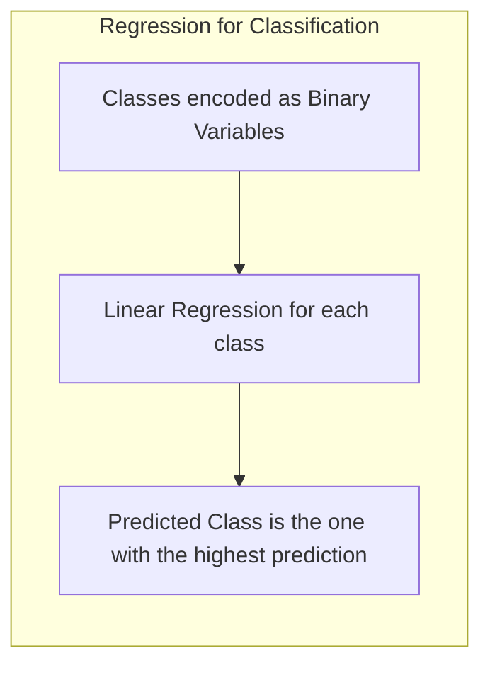
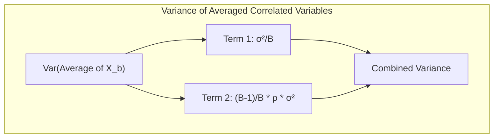
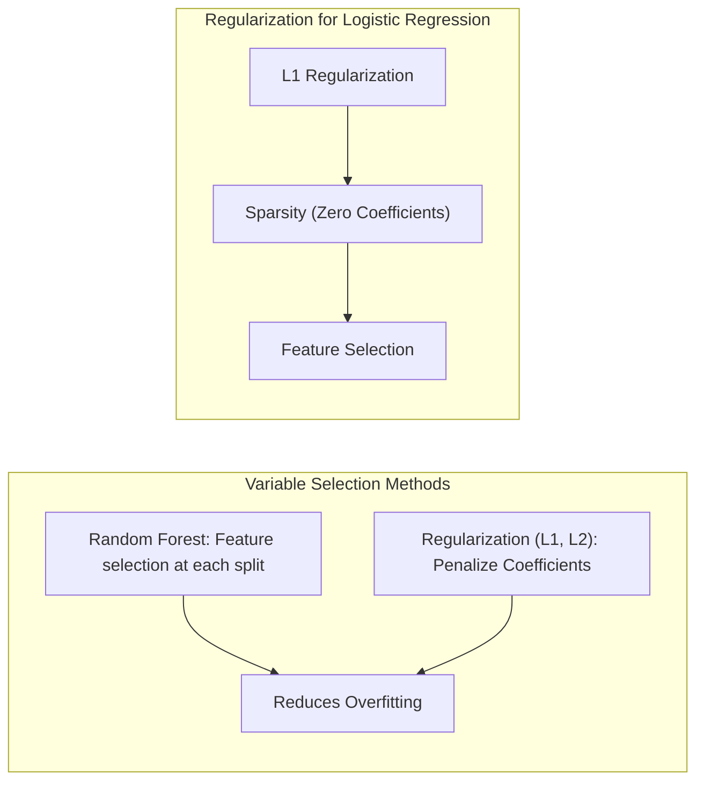
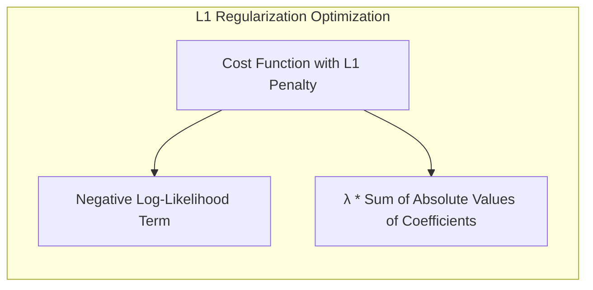
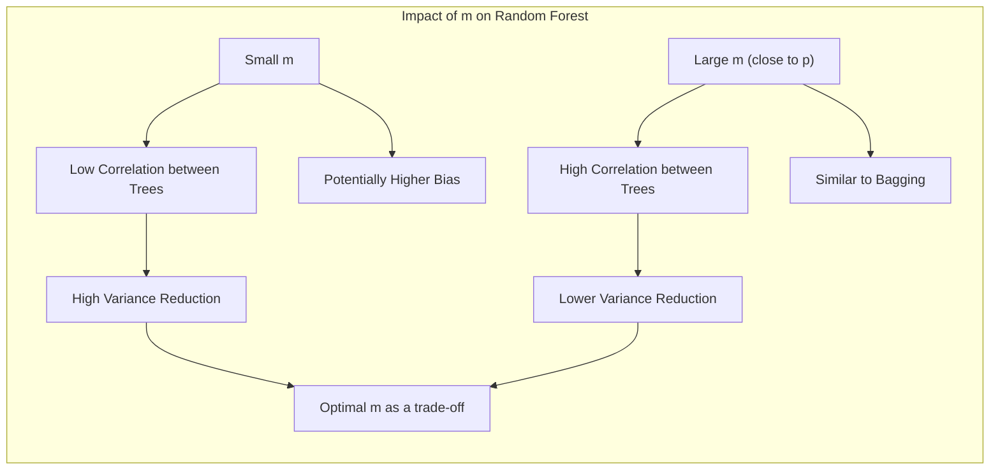

## Random Forests: Feature Selection at Split Points

### Introdução

O **Random Forest** [^15.1] é um algoritmo de aprendizado de máquina versátil, usado tanto para classificação quanto para regressão. Ele se baseia na técnica de **bagging** (bootstrap aggregation) [^15.1], que visa reduzir a variância de estimadores instáveis, como árvores de decisão. Em essência, o Random Forest constrói múltiplas árvores de decisão a partir de diferentes amostras de bootstrap dos dados de treinamento e, em seguida, combina as previsões dessas árvores por meio de um processo de votação (para classificação) ou por meio da média (para regressão). Uma característica fundamental do Random Forest que o distingue do bagging simples é a **seleção aleatória de um subconjunto de variáveis (features) em cada nó de cada árvore** [^15.1]. Esta característica, que chamamos de **seleção de *m* features**, é o foco principal deste capítulo. A capacidade do Random Forest de reduzir a correlação entre as árvores e, assim, reduzir a variância da previsão final, depende crucialmente dessa seleção aleatória de features [^15.2].

### Conceitos Fundamentais

**Conceito 1: O Problema da Classificação e Regressão com Árvores de Decisão**
O uso de árvores de decisão para classificação ou regressão é intuitivo. A árvore particiona o espaço de entrada em regiões menores, de forma hierárquica, onde a predição é feita com base na maioria da classe predominante (classificação) ou pela média dos valores da variável resposta (regressão) [^15.2]. Árvores, no entanto, são estimadores *high-variance and low-bias*, o que significa que elas podem se ajustar muito bem aos dados de treinamento, mas podem ter um desempenho ruim em novos dados. Em outras palavras, o modelo pode ser instável com pequenas variações nos dados de treinamento. A seleção de *m* features a cada split visa controlar essa instabilidade [^15.2].

> 💡 **Exemplo Numérico:** Imagine que temos um conjunto de dados de treinamento com 100 amostras e 5 variáveis preditoras ($p=5$). Uma única árvore de decisão pode criar um modelo complexo, ajustando-se excessivamente aos dados de treinamento, o que resulta em alta variância. Por exemplo, uma pequena mudança em alguns pontos de dados de treinamento pode levar a uma árvore muito diferente. O Random Forest aborda isso construindo várias árvores, cada uma com um subconjunto aleatório de variáveis (digamos, $m=2$) em cada split. Isso reduz a sensibilidade a pontos de dados individuais e, portanto, a variância do modelo.

**Lemma 1:** A esperança da média de um conjunto de árvores geradas por bagging é igual à esperança de uma única árvore, ou seja, o viés do conjunto é igual ao viés de uma única árvore [^15.2].
$$E\left[\frac{1}{B}\sum_{b=1}^{B}T_b(x)\right] = E[T(x)]$$
onde $T_b(x)$ é a predição da *b*-ésima árvore e $T(x)$ é a predição de uma árvore aleatória. Esta propriedade é essencial para justificar o uso de bagging, dado que o objetivo não é reduzir o viés, mas sim a variância [^15.2]. $\blacksquare$

**Conceito 2: Linear Discriminant Analysis (LDA)**
O LDA, discutido em outros contextos, busca encontrar um hiperplano que separe diferentes classes. Ele assume que os dados são normalmente distribuídos com covariâncias iguais para cada classe [^15.2]. O LDA pode ser comparado a métodos baseados em árvores, pois ambos visam encontrar fronteiras de decisão. No entanto, o LDA é um método paramétrico que impõe uma forma funcional sobre os dados, enquanto o random forest é um método não paramétrico.

**Corolário 1:** A combinação de árvores (bagging) em Random Forests não altera o viés, mas reduz a variância se as árvores forem menos correlacionadas. A seleção de *m* variáveis é o mecanismo essencial para reduzir a correlação entre as árvores. [^15.2]

**Conceito 3: Regressão Logística**
A regressão logística, outro método para classificação, modela a probabilidade de uma variável binária usando uma função logística. Ao contrário das árvores de decisão, ela é um modelo linear. A seleção de variáveis em modelos lineares, como regressão logística, é importante para reduzir complexidade e evitar overfitting. No random forest, essa seleção é feita a cada split, tornando o processo mais robusto [^15.2].

### Regressão Linear e Mínimos Quadrados para Classificação

A regressão linear pode ser adaptada para problemas de classificação usando uma matriz de indicadores. As classes são codificadas como variáveis binárias e, em seguida, uma regressão linear é feita em cada variável indicadora. A classe prevista é aquela que corresponde à variável indicadora com a maior predição. Embora seja uma abordagem simples, ela apresenta limitações quando as classes são muito correlacionadas [^15.1], [^15.2]. O random forest, com a seleção de *m* features, é uma alternativa mais robusta para lidar com este problema.

**Lemma 2:** A variância da média de variáveis aleatórias *identicamente distribuídas*, mas *não independentes*, com variância $\sigma^2$ e correlação par a par $\rho$, é dada por:
$$Var\left[\frac{1}{B}\sum_{b=1}^B X_b\right] = \frac{\sigma^2}{B} + \frac{B-1}{B}\rho \sigma^2$$
Esta equação demonstra explicitamente como a correlação entre as árvores limita a redução da variância por meio da média [^15.2]. $\blacksquare$

> 💡 **Exemplo Numérico:** Suponha que temos 10 árvores ($B=10$) com variância $\sigma^2 = 1$ e correlação média $\rho = 0.6$. Sem a seleção de features, a variância da média das previsões seria:
> $$Var\left[\frac{1}{10}\sum_{b=1}^{10} X_b\right] = \frac{1}{10} + \frac{10-1}{10}(0.6)(1) = 0.1 + 0.54 = 0.64$$
> Se pudermos reduzir a correlação entre as árvores, digamos para $\rho=0.2$, usando a seleção de *m* features, a variância da média seria:
> $$Var\left[\frac{1}{10}\sum_{b=1}^{10} X_b\right] = \frac{1}{10} + \frac{10-1}{10}(0.2)(1) = 0.1 + 0.18 = 0.28$$
> Claramente, a redução na correlação levou a uma redução significativa na variância da média das previsões.

**Corolário 2:** Quando *B* tende ao infinito, o termo $\frac{\sigma^2}{B}$ desaparece, e a variância da média torna-se $\rho \sigma^2$. Portanto, quanto menor a correlação $\rho$, menor a variância da média. O objetivo da seleção de *m* features é reduzir a correlação $\rho$ entre as árvores de decisão. [^15.2]

“A regressão linear para classificação pode levar a extrapolações fora do intervalo \[0,1], enquanto a regressão logística fornece probabilidades entre 0 e 1, sendo esta uma vantagem da regressão logística em problemas de classificação [^15.1], [^15.2]. No entanto, a regressão linear ainda pode ser vantajosa quando o principal objetivo é a fronteira de decisão linear e o foco não é a estimativa de probabilidades. [^15.2]”

### Métodos de Seleção de Variáveis e Regularização em Classificação

A seleção de variáveis em modelos de classificação visa identificar as features mais relevantes para a predição. No contexto do random forest, essa seleção ocorre a cada split da árvore, escolhendo aleatoriamente *m* features dentre as *p* disponíveis. Essa abordagem é diferente da regularização (L1 ou L2), que penaliza os coeficientes de modelos lineares para reduzir a complexidade e evitar overfitting [^15.2].
Em regressão logística, a regularização L1 pode levar a soluções esparsas, ou seja, alguns coeficientes serão exatamente zero, o que promove a seleção de variáveis mais relevantes para a classificação [^15.2]. A seleção de *m* features em random forest atinge objetivo similar de redução de overfitting mas por um processo diferente, através da aleatorização da seleção de features e subsequente média.

**Lemma 3:** Em regressão logística, a penalização L1 leva a soluções esparsas, o que significa que alguns coeficientes são exatamente zero [^15.2]. Essa propriedade pode ser derivada da formulação do problema de otimização, que busca o mínimo da soma da *log-likelihood* negativa com o termo de regularização L1:
$$ \min_{\beta} \left( -\sum_{i=1}^{n} \left[ y_i \log(\sigma(\mathbf{x}_i^T\beta)) + (1-y_i) \log(1-\sigma(\mathbf{x}_i^T\beta)) \right] + \lambda \sum_{j=1}^p |\beta_j| \right) $$
onde $\sigma(\cdot)$ é a função logística, $\lambda$ é o parâmetro de regularização, e $\beta_j$ são os coeficientes [^15.2]. $\blacksquare$

> 💡 **Exemplo Numérico:** Considere um problema de classificação binária com 3 features ($p=3$) usando regressão logística. Sem regularização, a regressão logística pode atribuir pesos não nulos a todas as 3 features. Aplicando regularização L1 com um certo $\lambda$, a otimização pode forçar um dos coeficientes, digamos $\beta_2$, para exatamente zero, resultando em um modelo que apenas usa as features 1 e 3. Em contraste, um random forest com a seleção de *m* features realiza a seleção de variáveis *em cada split*, de forma estocástica, resultando em um modelo que, em média, dá menos peso às variáveis menos importantes e com menor frequência na divisão das árvores.

**Prova do Lemma 3:** A prova envolve mostrar que, ao minimizar a função de custo com penalização L1, alguns coeficientes são levados a zero. Isto ocorre porque a penalização L1 não é diferenciável na origem, e a otimização leva a soluções em que alguns coeficientes são zerados exatamente, promovendo sparsity. [^15.2] $\blacksquare$
**Corolário 3:** A esparsidade induzida pela regularização L1 em modelos de regressão logística leva a modelos mais interpretáveis e robustos ao overfitting, já que as variáveis menos relevantes são efetivamente excluídas do modelo. [^15.2]

> ⚠️ **Ponto Crucial**: A combinação de regularização L1 e L2 (Elastic Net) oferece um balanço entre sparsity e estabilidade, combinando as vantagens de ambos os tipos de regularização. [^15.2]
### Separating Hyperplanes e Perceptrons

Hiperplanos separadores são usados em algoritmos como SVM (Support Vector Machines) para encontrar uma fronteira linear ótima que maximize a margem entre as classes [^15.2]. O Perceptron, por sua vez, é um algoritmo de aprendizado mais antigo que busca um hiperplano capaz de separar as classes. Random forests, ao contrário desses métodos, não dependem diretamente de hiperplanos, mas sim de particionamentos hierárquicos do espaço, e a seleção de *m* features auxilia na diversificação dessas partições [^15.2].

### Pergunta Teórica Avançada: Qual o impacto da escolha do valor de *m* (número de features a serem consideradas em cada split) no desempenho do Random Forest?
**Resposta:**
A escolha do valor de *m* é crucial para o desempenho de um Random Forest [^15.2]. Se *m* for muito pequeno, as árvores serão pouco correlacionadas, levando a uma redução na variância. Por outro lado, se *m* for muito grande (próximo a *p*), as árvores serão mais correlacionadas, e a redução na variância será menor. Em casos extremos, se $m=p$, o método se torna equivalente a bagging simples, sem a aleatoriedade na seleção de features [^15.2]. Normalmente, o valor de $m$ para classificação é dado como $m=\lfloor \sqrt{p} \rfloor$ e para regressão como $m= \lfloor \frac{p}{3} \rfloor$, mas a melhor escolha de $m$ depende dos dados [^15.2].

> 💡 **Exemplo Numérico:** Suponha que temos um problema de classificação com $p=16$ variáveis preditoras. Usando a regra geral, o valor de *m* para classificação seria $\lfloor \sqrt{16} \rfloor = 4$. Isso significa que em cada nó de cada árvore, o algoritmo escolherá aleatoriamente 4 features para decidir qual usar para a divisão. Se usássemos $m=1$, as árvores seriam menos correlacionadas, mas também menos capazes de capturar relacionamentos entre as variáveis, potencialmente aumentando o viés. Se usássemos $m=16$, estaríamos usando todas as variáveis em cada split, e isso seria equivalente a um bagging simples, sem a redução na correlação entre as árvores, e consequentemente menos redução de variância.

**Lemma 4:** A correlação entre duas árvores aleatórias no Random Forest, em função da escolha de *m* é:
$$ \rho(x) = \text{corr}[T(x; \Theta_1(Z)), T(x; \Theta_2(Z))]$$
onde $\Theta_1(Z)$ e $\Theta_2(Z)$ são árvores geradas a partir de amostras bootstrap aleatórias, e a correlação $\rho(x)$ é uma função de *m* [^15.2].

**Corolário 4:** Reduzindo o valor de *m*, a correlação entre as árvores diminui, o que leva a uma maior redução de variância do modelo Random Forest. Entretanto, ao reduzir excessivamente *m*, as árvores podem se tornar muito fracas e apresentar vieses maiores, resultando em performance sub-ótima. A escolha de *m* envolve um trade-off entre viés e variância. [^15.2]
> ⚠️ **Ponto Crucial**: A escolha de *m* é um parâmetro de ajuste que pode afetar significativamente o desempenho do Random Forest, sendo necessária atenção especial para otimizar esse valor para cada problema específico. [^15.2]
### Conclusão

A seleção de *m* features em cada split é uma característica central do Random Forest, que contribui significativamente para a sua capacidade de reduzir a variância e evitar o overfitting. Essa abordagem, combinada com a aleatoriedade do bootstrap e a média das predições, torna o Random Forest um método de aprendizado de máquina robusto e eficaz, tanto para problemas de classificação quanto de regressão [^15.2]. <!-- END DOCUMENT -->

### Footnotes
[^15.1]: "Bagging or bootstrap aggregation (section 8.7) is a technique for reducing the variance of an estimated prediction function. Bagging seems to work especially well for high-variance, low-bias procedures, such as trees. For regression, we simply fit the same regression tree many times to bootstrap-sampled versions of the training data, and average the result. For classification, a committee of trees each cast a vote for the predicted class. Random forests (Breiman, 2001) is a substantial modification of bagging that builds a large collection of de-correlated trees, and then averages them. On many problems the performance of random forests is very similar to boosting, and they are simpler to train and tune. As a consequence, random forests are popular, and are implemented in a variety of packages." *[Trecho do documento Random Forests]*
[^15.2]: "The essential idea in bagging (Section 8.7) is to average many noisy but approximately unbiased models, and hence reduce the variance. Trees are ideal candidates for bagging, since they can capture complex interaction structures in the data, and if grown sufficiently deep, have relatively low bias. Since trees are notoriously noisy, they benefit greatly from the averaging. Moreover, since each tree generated in bagging is identically distributed (i.d.), the expectation of an average of B such trees is the same as the expectation of any one of them. This means the bias of bagged trees is the same as that of the individual trees, and the only hope of improvement is through variance reduction. This is in contrast to boosting, where the trees are grown in an adaptive way to remove bias, and hence are not i.d. As B increases, the second term disappears, but the first remains, and hence the size of the correlation of pairs of bagged trees limits the benefits of averaging. The idea in random forests (Algorithm 15.1) is to improve the variance reduction of bagging by reducing the correlation between the trees, without increasing the variance too much. This is achieved in the tree-growing process through random selection of the input variables." *[Trecho do documento Random Forests]*
[^15.3]: "For each observation zi = (xi, Yi), construct its random forest predictor by averaging only those trees corresponding to bootstrap samples in which zi did not appear. An oob error estimate is almost identical to that obtained by N-fold cross-validation; see Exercise 15.2." *[Trecho do documento Random Forests]*
[^15.4]: "When the number of variables is large, but the fraction of relevant variables small, random forests are likely to perform poorly with small m. At each split the chance can be small that the relevant variables will be selected." *[Trecho do documento Random Forests]*
[^15.5]: "The limiting form (B → ∞) of the random forest regression estimator is frf(x) = EezT(x; Θ(Ζ)), where we have made explicit the dependence on the training data Z. Here we consider estimation at a single target point x. From (15.1) we see that Varfrf(x) = p(x)σ²(x)." *[Trecho do documento Random Forests]*
[^15.6]: "Bias(x) = μ(x) – Ezfrf(x) = μ(x) – ΕΖΕezT(x; Θ(Ζ)). This is also typically greater (in absolute terms) than the bias of an un- pruned tree grown to Z, since the randomization and reduced sample space impose restrictions. Hence the improvements in prediction obtained by bagging or random forests are solely a result of variance reduction." *[Trecho do documento Random Forests]*
[^15.7]: "In practice the best values for these parameters will depend on the problem, and they should be treated as tuning parameters." *[Trecho do documento Random Forests]*
[^15.8]: "Typically values for m are √p or even as low as 1." *[Trecho do documento Random Forests]*
[^15.9]: "For classification, the default value for m is [√p] and the minimum node size is one." *[Trecho do documento Random Forests]*
[^15.10]: "For regression, the default value for m is [p/3] and the minimum node size is five." *[Trecho do documento Random Forests]*
[^15.11]: "At each split in each tree, the improvement in the split-criterion is the importance measure attributed to the splitting variable, and is accumulated over all the trees in the forest separately for each variable." *[Trecho do documento Random Forests]*
[^15.12]: "Random forests also use the OOB samples to construct a different variable- importance measure, apparently to measure the prediction strength of each variable." *[Trecho do documento Random Forests]*
[^15.13]: "The tree-growing algorithm finds an "optimal" path to that observation, choosing the most informative predictors from those at its disposal. The averaging process assigns weights to these training responses, which ultimately vote for the prediction. Hence via the random-forest voting mechanism, those observations close to the target point get assigned weights—an equivalent kernel-which combine to form the classification decision." *[Trecho do documento Random Forests]*
[^15.14]: "It is easy to confuse p(x) with the average correlation between fitted trees in a given random-forest ensemble; that is, think of the fitted trees as N-vectors, and compute the average pairwise correlation between these vectors, conditioned on the data. This is not the case; this conditional correlation is not directly relevant in the averaging process, and the dependence on x in p(x) warns us of the distinction. Rather, p(x) is the theoretical correlation between a pair of random-forest trees evaluated at x, induced by repeatedly making training sample draws Z from the population, and then drawing a pair of random forest trees. In statistical jargon, this is the correlation induced by the sampling distribution of Z and O." *[Trecho do documento Random Forests]*
