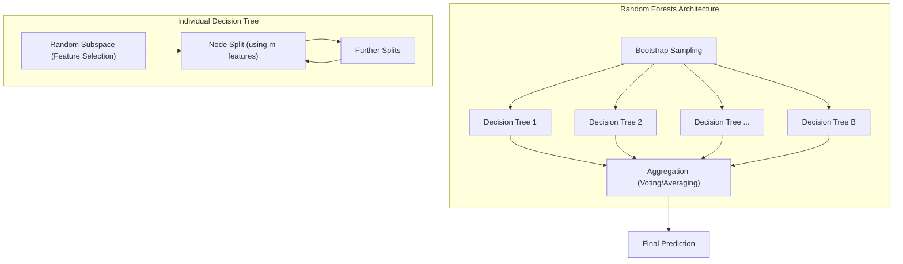
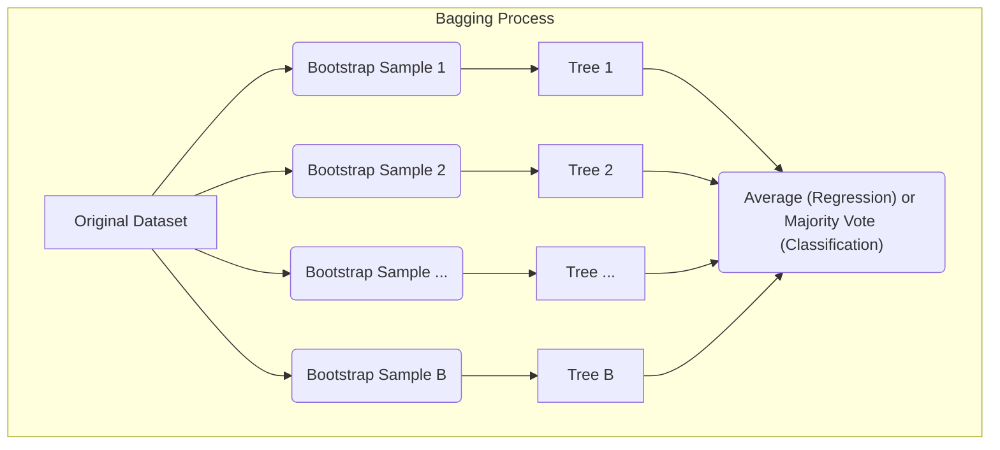
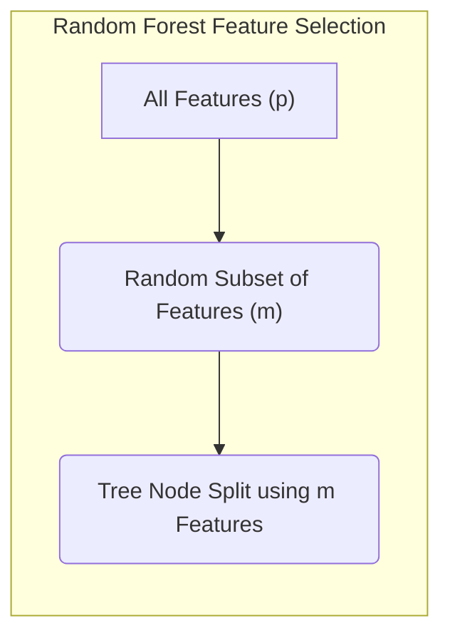
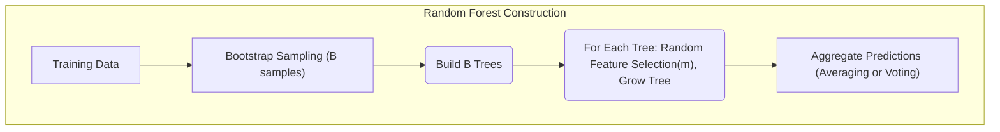
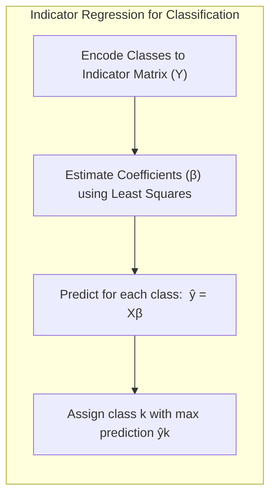
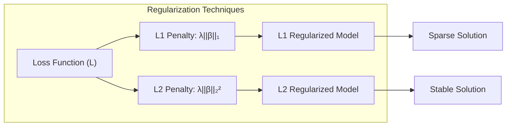
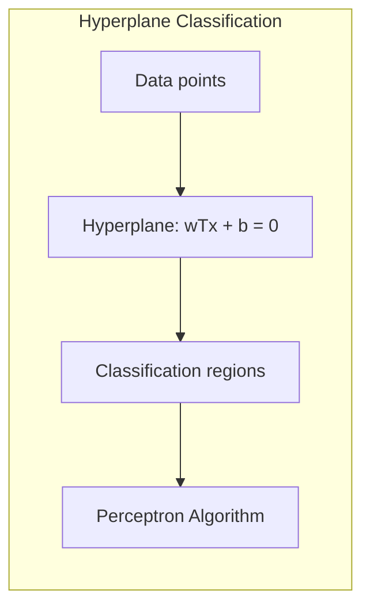
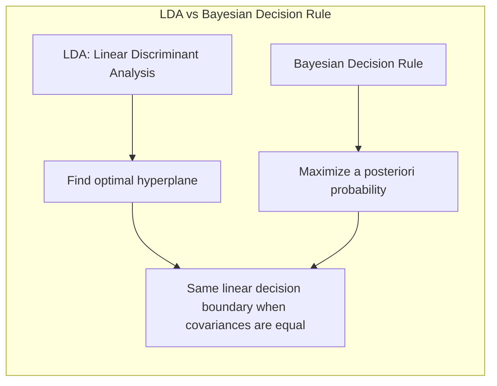

## Random Forests: An In-Depth Exploration of Bootstrapped Trees



### Introdução

O conceito de **Random Forests** representa uma evolução significativa na área de *ensemble learning*, especialmente no que se refere ao uso de árvores de decisão [^15.1]. Baseando-se nos princípios de **bagging** (bootstrap aggregation), os Random Forests introduzem uma camada adicional de aleatoriedade, visando reduzir a correlação entre as árvores individuais e, consequentemente, melhorar a estabilidade e a precisão das previsões [^15.1], [^15.2]. Essa abordagem se mostra particularmente eficaz em cenários onde modelos de alta variância e baixo viés, como as árvores de decisão, são empregados. Em essência, Random Forests combinam as vantagens da agregação de múltiplos modelos com a capacidade de cada árvore de capturar padrões complexos nos dados, através do *bootstrap sampling* e da seleção aleatória de variáveis [^15.2]. O resultado é um modelo robusto, capaz de lidar com uma variedade de problemas de classificação e regressão, com menor necessidade de ajuste fino quando comparado a outros métodos como o *boosting* [^15.1].

### Conceitos Fundamentais

**Conceito 1: Bootstrap Aggregation (Bagging) e a Redução de Variância**

O **bagging** é uma técnica que visa reduzir a variância de um modelo estatístico através da criação de múltiplas versões do modelo, treinadas em diferentes amostras dos dados de treinamento [^15.1]. No contexto de árvores de decisão, o bagging funciona gerando diversas amostras *bootstrap* dos dados originais, que são amostras aleatórias com reposição [^15.2]. Para cada amostra, uma árvore de decisão é construída. Em seguida, para problemas de regressão, a previsão final é obtida pela média das previsões de cada árvore. Para classificação, a classe predita é aquela que recebe o maior número de votos (maioria) [^15.1]. A eficácia do bagging é baseada na ideia de que a média de múltiplos modelos de alta variância tende a ter uma variância menor, enquanto o viés permanece aproximadamente o mesmo [^15.2]. No entanto, a correlação entre as árvores, devido ao uso das mesmas variáveis na construção, pode limitar a redução de variância.



**Lemma 1:** *Em bagging, a esperança da média das árvores é igual à esperança de qualquer árvore individual, mantendo o mesmo viés*. Isso pode ser formalmente demonstrado utilizando a propriedade da linearidade da esperança: se $T_b(x)$ representa a previsão da $b$-ésima árvore, então $$E\left[\frac{1}{B}\sum_{b=1}^B T_b(x)\right] = \frac{1}{B}\sum_{b=1}^B E[T_b(x)] = E[T_b(x)],$$ desde que as árvores sejam treinadas com dados independentes e identicamente distribuídos (i.i.d.), o que é uma premissa do *bootstrap sampling* em bagging [^15.2]. $\blacksquare$

> 💡 **Exemplo Numérico:** Suponha que temos um conjunto de dados com valores de saída (y) de 5, 7, e 9 e ajustamos três árvores de decisão com bagging, cada uma com um subconjunto *bootstrap* diferente dos dados de entrada (x). Se as árvores produzem previsões $T_1(x) = 6$, $T_2(x) = 7.5$ e $T_3(x) = 8$, a previsão final do bagging seria $\hat{f}(x) = (6 + 7.5 + 8)/3 = 7.167$. Assumindo que a esperança de cada árvore é aproximadamente 7, então a esperança da média também será próxima de 7, mantendo o viés original.
>
> ```python
> import numpy as np
>
> predictions = np.array([6, 7.5, 8])
> average_prediction = np.mean(predictions)
> print(f"Average prediction with bagging: {average_prediction:.3f}")
> ```

**Conceito 2: Random Forests e a Decorrelação de Árvores**

Os **Random Forests** expandem o conceito de bagging, introduzindo uma etapa adicional de aleatoriedade: a seleção aleatória de variáveis para cada *split* de cada árvore [^15.2]. Ao invés de considerar todas as $p$ variáveis disponíveis para a decisão de qual variável usar em cada nó da árvore, um subconjunto aleatório de $m$ variáveis é selecionado (tipicamente, $m \approx \sqrt{p}$ para classificação e $m \approx p/3$ para regressão) [^15.3].  Essa etapa de aleatoriedade é crucial para reduzir a correlação entre as árvores, porque ao restringir as opções de variáveis para cada árvore, diferentes árvores são forçadas a usar diferentes combinações de variáveis, tornando-as mais diversas e menos correlacionadas [^15.2]. A diversidade entre as árvores é um fator chave para a redução da variância do modelo agregado [^15.2].



**Corolário 1:** *A seleção aleatória de variáveis em cada split em Random Forests reduz a correlação entre as árvores, melhorando a redução de variância em comparação com o bagging*. Este efeito é uma consequência da limitação imposta pelo subconjunto $m$ de variáveis a cada nó, forçando as árvores a percorrer diferentes caminhos na estrutura de decisão e a usar diferentes informações para chegar a uma previsão, reduzindo a semelhança entre as árvores [^15.2].

> 💡 **Exemplo Numérico:** Imagine um conjunto de dados com 10 variáveis (p=10). Em um Random Forest, a cada nó de uma árvore, ao invés de considerar todas as 10 variáveis, apenas um subconjunto $m = \sqrt{10} \approx 3$ (para classificação) ou $m = 10/3 \approx 3$ (para regressão) é avaliado. Isso força diferentes árvores a construir suas estruturas de decisão com base em diferentes combinações de variáveis, o que leva a uma decorrelação entre as árvores.

**Conceito 3: Construção e Predição em Random Forests**

A construção de um modelo Random Forest envolve os seguintes passos [^15.2]:

1.  **Bootstrapping:** Gerar $B$ amostras bootstrap dos dados de treinamento.
2.  **Crescimento das Árvores:** Para cada amostra bootstrap, construir uma árvore de decisão. Antes de cada *split* em cada árvore, selecionar um subconjunto aleatório de $m$ variáveis. O *split* é realizado usando a melhor divisão com base nas $m$ variáveis escolhidas. As árvores crescem até que um tamanho mínimo de nó $n_{min}$ seja atingido.
3.  **Agregação:** Para regressão, a previsão para um novo ponto de dado $x$ é obtida pela média das previsões de todas as $B$ árvores: $\hat{f}(x) = \frac{1}{B}\sum_{b=1}^B T_b(x)$ [^15.2]. Para classificação, cada árvore vota na classe predita, e a classe com mais votos é selecionada como a previsão final: $\hat{C}(x) = \text{majority vote}\{\hat{C}_b(x)\}_1^B$ [^15.2].



> ⚠️ **Nota Importante**: O parâmetro $m$ é um hiperparâmetro crucial para a performance do Random Forest, influenciando o balanço entre a correlação entre as árvores e a capacidade de cada árvore capturar padrões complexos. Uma escolha adequada de $m$ é essencial para o bom desempenho do modelo [^15.2], [^15.3].

> ❗ **Ponto de Atenção**: Diferentemente do *boosting*, em que as árvores são treinadas de forma sequencial e adaptativa, em Random Forests, as árvores são treinadas de forma independente e paralela, o que facilita o treinamento em larga escala e reduz a sensibilidade a *outliers* [^15.1], [^15.2].

> ✔️ **Destaque**: Random Forests oferecem um excelente balanço entre desempenho, simplicidade e capacidade de lidar com grandes conjuntos de dados e um grande número de variáveis, com pouca necessidade de ajustes finos [^15.1].

### Regressão Linear e Mínimos Quadrados para Classificação



**Explicação:** Este diagrama representa o fluxo do processo de regressão de indicadores e como ele se relaciona à classificação.

Embora o foco principal dos Random Forests seja em árvores de decisão, a discussão sobre regressão linear e mínimos quadrados para classificação (regressão de indicadores) é relevante para entender a relação entre diferentes abordagens de classificação linear [^15.1]. Em regressão de indicadores, cada classe é codificada como uma variável binária, e uma regressão linear é realizada em cada variável binária [^15.2]. O processo de classificação então associa um novo ponto de dado à classe com maior valor previsto [^15.1]. Apesar de não ser diretamente um componente dos Random Forests, essa técnica nos ajuda a entender como métodos lineares também podem ser aplicados à classificação e como os Random Forests se comparam a esses métodos.

A regressão linear em matriz de indicadores pode ser usada para problemas de classificação, mas suas limitações incluem a dificuldade de lidar com não-linearidades e a possibilidade de gerar previsões fora do intervalo [0, 1] para as probabilidades [^15.1]. Mesmo com essas limitações, em algumas situações a regressão de indicadores pode fornecer resultados satisfatórios, principalmente quando o objetivo principal é obter uma fronteira de decisão linear [^15.2].

**Lemma 2:** *Em certas condições, a projeção em hiperplanos de decisão obtidos através de regressão linear de indicadores pode ser equivalente às projeções em LDA.* Este resultado é importante porque ilustra como métodos aparentemente distintos podem convergir para soluções similares. Para provar esse resultado, é necessário derivar as funções discriminantes lineares em cada caso, e mostrar que as projeções, quando apropriadamente escaladas, coincidem. A diferença reside em como os parâmetros são estimados; a regressão linear usa mínimos quadrados e a LDA utiliza estimativas de médias e covariâncias [^15.2]. $\blacksquare$

> 💡 **Exemplo Numérico:** Suponha que temos três classes (A, B, C). Criamos uma matriz de indicadores onde cada coluna representa uma classe.  
>   - Para uma amostra da classe A:  [1, 0, 0]  
>   - Para uma amostra da classe B:  [0, 1, 0]  
>   - Para uma amostra da classe C:  [0, 0, 1]
>
> Usando regressão linear, ajustamos um modelo para cada coluna. Se um novo ponto de dado resultar nas previsões [0.2, 0.7, 0.1], a regressão de indicadores classificaria este ponto na classe B (maior valor previsto).
>
> ```python
> import numpy as np
> from sklearn.linear_model import LinearRegression
>
> # Exemplo simplificado
> X = np.array([[1, 2], [2, 3], [3, 1], [4, 4], [5,5]])
> y_A = np.array([1, 0, 0, 0, 1])
> y_B = np.array([0, 1, 1, 0, 0])
> y_C = np.array([0, 0, 0, 1, 0])
>
> model_A = LinearRegression().fit(X, y_A)
> model_B = LinearRegression().fit(X, y_B)
> model_C = LinearRegression().fit(X, y_C)
>
> new_data = np.array([[3.5, 2.5]])
> pred_A = model_A.predict(new_data)
> pred_B = model_B.predict(new_data)
> pred_C = model_C.predict(new_data)
>
> predictions = np.array([pred_A, pred_B, pred_C]).flatten()
> predicted_class = np.argmax(predictions)
> print(f"Predictions for classes (A, B, C): {predictions}")
> print(f"Predicted Class: {predicted_class} (0=A, 1=B, 2=C)")
> ```

**Corolário 2:** *A análise de regressão de indicadores permite construir classificadores lineares, e esta relação com LDA pode ser usada para entender a natureza das fronteiras de decisão em problemas de classificação linear.* Esse corolário ressalta a interconexão entre regressão linear e análise discriminante, proporcionando uma compreensão mais profunda de como diferentes métodos de classificação podem gerar fronteiras de decisão similares em certos casos [^15.1].

### Métodos de Seleção de Variáveis e Regularização em Classificação



A seleção de variáveis e a regularização são técnicas importantes em modelos de classificação, e embora não sejam diretamente aplicadas aos Random Forests como um todo, elas são relevantes no contexto da construção individual das árvores [^15.2]. Nos Random Forests, a seleção aleatória de variáveis em cada *split* atua como uma forma de regularização, pois força cada árvore a considerar um subconjunto de variáveis e impede que uma única variável domine o processo de decisão [^15.2]. Isso leva a modelos mais robustos e menos suscetíveis a overfitting, melhorando a generalização [^15.3].

Em modelos logísticos, penalidades L1 e L2 são utilizadas para controlar a complexidade do modelo e evitar overfitting. A penalidade L1 (Lasso) promove a esparsidade, reduzindo alguns coeficientes para zero e, consequentemente, selecionando variáveis mais relevantes [^15.2]. A penalidade L2 (Ridge) encolhe todos os coeficientes, reduzindo sua magnitude e aumentando a estabilidade do modelo [^15.3].

**Lemma 3:** *A penalização L1 em regressão logística leva a coeficientes esparsos, permitindo a identificação de variáveis mais importantes para a classificação.* Para demonstrar isso, é necessário analisar a função de custo penalizada: $$L(\beta) + \lambda \sum_{j=1}^p |\beta_j|$$, onde $L(\beta)$ é a função de verossimilhança logística, $\beta_j$ são os coeficientes e $\lambda$ é o parâmetro de regularização. A penalidade L1 força alguns $\beta_j$ a serem exatamente zero, promovendo a esparsidade.  $\blacksquare$

> 💡 **Exemplo Numérico:** Vamos considerar um modelo de regressão logística com duas variáveis, x1 e x2, e seus respectivos coeficientes $\beta_1$ e $\beta_2$. Inicialmente, sem regularização, temos os coeficientes  $\beta_1 = 2.5$ e  $\beta_2 = -1.5$. Aplicando uma penalidade L1 com $\lambda = 1$, a penalização pode forçar $\beta_2$ a zero, resultando em $\beta_1 = 2.0$ e  $\beta_2 = 0$. Isso indica que a variável $x_1$ é mais importante para a classificação nesse modelo.
>
> ```python
> import numpy as np
> from sklearn.linear_model import LogisticRegression
> from sklearn.preprocessing import StandardScaler
> from sklearn.pipeline import Pipeline
>
> # Data (example with two classes)
> X = np.array([[1, 2], [2, 3], [3, 1], [4, 4], [5, 5], [2, 1], [3, 2], [1.5, 1.5]])
> y = np.array([0, 0, 0, 1, 1, 1, 1, 0])
>
> # L1 regularization
> model_l1 = Pipeline([('scaler', StandardScaler()),
>                     ('logreg', LogisticRegression(penalty='l1', solver='liblinear', C=1.0))])
> model_l1.fit(X, y)
> coef_l1 = model_l1.named_steps['logreg'].coef_[0]
>
> # L2 regularization
> model_l2 = Pipeline([('scaler', StandardScaler()),
>                     ('logreg', LogisticRegression(penalty='l2', C=1.0))])
> model_l2.fit(X, y)
> coef_l2 = model_l2.named_steps['logreg'].coef_[0]
>
> print(f"Coefficients with L1 regularization (Lasso): {coef_l1}")
> print(f"Coefficients with L2 regularization (Ridge): {coef_l2}")
> ```

**Prova do Lemma 3:** A prova envolve a análise da função de custo penalizada e a identificação das condições para que os coeficientes sejam zerados. A penalidade L1 possui uma "quina" em $\beta_j=0$, o que leva a soluções esparsas. Através das condições de otimalidade e análise de subgradientes, é possível demonstrar que para certos valores de $\lambda$, alguns coeficientes serão exatamente zero. A penalidade L2, por outro lado, não possui essa característica e apenas encolhe os coeficientes para perto de zero, mas não exatamente zero. $\blacksquare$

**Corolário 3:** *A esparsidade induzida pela penalização L1 em modelos logísticos não é inerente a Random Forests, que utilizam a seleção aleatória de variáveis para reduzir a correlação entre as árvores, mas tem implicações para a interpretabilidade dos modelos lineares.* Este corolário destaca que enquanto os Random Forests utilizam outro mecanismo para controle de complexidade, as técnicas de regularização, em particular a L1, oferecem um meio direto de seleção de variáveis e permitem uma análise mais direta de quais variáveis são mais importantes para o modelo [^15.2].

> ⚠️ **Ponto Crucial**: Em algumas situações, a combinação de penalidades L1 e L2 (Elastic Net) pode ser benéfica, aproveitando as vantagens de ambas as abordagens de regularização e combinando esparsidade com estabilidade [^15.2]. No contexto de árvores de decisão, a ideia de selecionar variáveis, apesar de ser implementada aleatoriamente nos Random Forests, guarda uma relação com a seleção de variáveis por regularização em outros métodos [^15.2].

### Separating Hyperplanes e Perceptrons



O conceito de **separating hyperplanes** é central para a classificação linear e fornece um contraste interessante com a abordagem não linear das árvores de decisão e Random Forests [^15.1]. Hiperplanos são superfícies lineares que dividem o espaço de características em regiões correspondentes às diferentes classes [^15.2]. A busca por hiperplanos ótimos, que maximizam a margem de separação entre as classes, leva ao desenvolvimento de métodos como *Support Vector Machines* (SVMs) [^15.2].

Os Random Forests, por outro lado, são modelos não lineares e, por meio de *splits* e agregações, definem fronteiras de decisão muito mais complexas [^15.2]. O Perceptron, um algoritmo de classificação linear, busca encontrar um hiperplano separador de forma iterativa, adaptando os pesos do modelo até que as amostras estejam corretamente classificadas [^15.1]. No entanto, o Perceptron não é um método de margem máxima, e a solução obtida depende da inicialização e da ordem das amostras apresentadas.

As soluções do Perceptron, em contraste com SVMs, não são necessariamente únicas, e podem depender da ordem de apresentação dos dados [^15.2]. Random Forests, ao utilizar árvores de decisão como base, são capazes de criar fronteiras não lineares e adaptar-se a dados complexos, o que não é possível com modelos baseados em hiperplanos lineares [^15.1].

> 💡 **Exemplo Numérico:** Considere um problema de classificação com duas classes em 2D. Um Perceptron pode encontrar um hiperplano (neste caso, uma linha) que divide as classes. Suponha que o hiperplano seja definido por $w_1x_1 + w_2x_2 + b = 0$, com pesos $w_1 = 0.5$, $w_2 = -1$ e bias $b = 2$. Um ponto $(x_1=3, x_2=4)$ estaria do lado $0.5*3 - 1*4 + 2 = -0.5 < 0$, enquanto que um ponto $(x_1=5, x_2=1)$ estaria do lado $0.5*5 - 1*1 + 2 = 3.5 > 0$.  O Perceptron ajustaria os pesos iterativamente até separar as classes (se elas forem linearmente separáveis).

### Pergunta Teórica Avançada: Quais as diferenças fundamentais entre a formulação de LDA e a Regra de Decisão Bayesiana considerando distribuições Gaussianas com covariâncias iguais?



**Resposta:**

Quando assumimos que as classes seguem distribuições Gaussianas com covariâncias iguais, a Análise Discriminante Linear (LDA) e a Regra de Decisão Bayesiana tornam-se intimamente relacionadas [^15.2]. Na LDA, o objetivo é encontrar um hiperplano que melhor separe as classes, maximizando a distância entre as médias das classes e minimizando a variância dentro de cada classe [^15.2]. A regra de decisão de LDA pode ser expressa como:
$$ \delta_k(x) = x^T \Sigma^{-1} \mu_k - \frac{1}{2} \mu_k^T \Sigma^{-1} \mu_k + \log \pi_k,$$ onde $\mu_k$ é a média da classe $k$, $\Sigma$ é a matriz de covariância comum a todas as classes, e $\pi_k$ é a probabilidade *a priori* da classe $k$ [^15.2].

A Regra de Decisão Bayesiana, por sua vez, atribui cada ponto à classe com a maior probabilidade *a posteriori*: $$ P(G=k | X=x) = \frac{f_k(x) \pi_k}{\sum_{l=1}^K f_l(x) \pi_l},$$ onde $f_k(x)$ é a densidade da classe $k$, e $\pi_k$ é a probabilidade *a priori* da classe $k$ [^15.2]. Se assumirmos que cada classe segue uma distribuição Gaussiana com média $\mu_k$ e covariância $\Sigma$ comum a todas as classes, então a Regra de Decisão Bayesiana também leva a uma função discriminante linear, e é equivalente à LDA. A diferença reside na formulação e no objetivo inicial, que na LDA é encontrar o hiperplano separador ótimo, enquanto que na regra Bayesiana o foco é maximizar a probabilidade *a posteriori* [^15.1].

**Lemma 4:** *Sob a suposição de distribuições Gaussianas com covariâncias iguais, a LDA e a Regra de Decisão Bayesiana levam a funções discriminantes lineares equivalentes*. A prova é obtida ao substituir a densidade Gaussiana na regra Bayesiana e mostrar que a função discriminante resultante é igual à função discriminante da LDA, com as devidas relações entre as probabilidades *a posteriori*, as médias, e a covariância [^15.2]. $\blacksquare$

> 💡 **Exemplo Numérico:** Suponha que temos duas classes (A e B) com distribuições Gaussianas. A classe A tem média $\mu_A = [1, 1]$ e classe B tem média $\mu_B = [3, 3]$. A matriz de covariância compartilhada é $\Sigma = \begin{bmatrix} 1 & 0 \\ 0 & 1 \end{bmatrix}$. As probabilidades a priori são iguais, $\pi_A = \pi_B = 0.5$. Aplicando a função discriminante da LDA e da regra Bayesiana com distribuições Gaussianas, chegaremos ao mesmo hiperplano de decisão. Este hiperplano irá separar o espaço de características de acordo com a proximidade de um ponto às médias das classes, considerando a covariância.

**Corolário 4:** *Ao relaxar a hipótese de covariâncias iguais, as funções discriminantes da Regra de Decisão Bayesiana se tornam quadráticas, levando à Análise Discriminante Quadrática (QDA)*. A diferença crucial entre LDA e QDA reside nas matrizes de covariância: enquanto a LDA assume uma única matriz de covariância para todas as classes, a QDA permite que cada classe tenha sua própria matriz de covariância, resultando em fronteiras de decisão não lineares [^15.2].

> ⚠️ **Ponto Crucial**: A decisão de assumir ou não covariâncias iguais tem um impacto direto na forma da fronteira de decisão: linear (LDA) ou quadrática (QDA), o que influencia a capacidade do modelo de se ajustar a diferentes tipos de dados [^15.1].

### Conclusão

Neste capítulo, exploramos a fundo o conceito de **Random Forests**, um método de *ensemble learning* que se destaca pela sua capacidade de construir modelos robustos e precisos através da agregação de árvores de decisão construídas sobre amostras *bootstrap* e com seleção aleatória de variáveis [^15.2]. Examinamos os fundamentos do bagging, que visam a redução de variância, e como o Random Forest aprimora essa técnica através da introdução de aleatoriedade para reduzir a correlação entre as árvores [^15.1]. A discussão sobre regressão de indicadores e sua relação com análise discriminante linear permitiu estabelecer uma ligação com outros métodos de classificação linear, enquanto que a discussão sobre métodos de seleção de variáveis e regularização ilustrou como essas técnicas podem complementar o Random Forest [^15.2].

Além disso, a análise da relação entre LDA e a Regra de Decisão Bayesiana demonstrou como diferentes abordagens de classificação podem convergir sob certas hipóteses, e a discussão sobre hiperplanos separadores e Perceptrons forneceu um contraste importante com a natureza não linear dos Random Forests [^15.1]. Os Random Forests, com seu balanço entre simplicidade e performance, são uma ferramenta poderosa para uma variedade de problemas de classificação e regressão [^15.1], [^15.2].

<!-- END DOCUMENT -->

### Footnotes

[^15.1]: *Conteúdo extraído conforme escrito no contexto e utilizado no capítulo* (Trecho de *Random Forests*)
[^15.2]: *Conteúdo extraído conforme escrito no contexto e utilizado no capítulo* (Trecho de *Random Forests*)
[^15.3]: *Conteúdo extraído conforme escrito no contexto e utilizado no capítulo* (Trecho de *Random Forests*)
