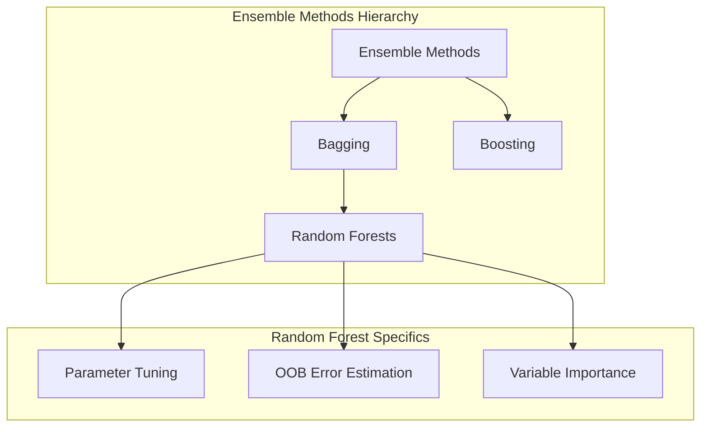
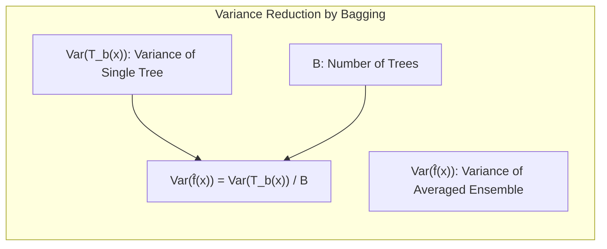
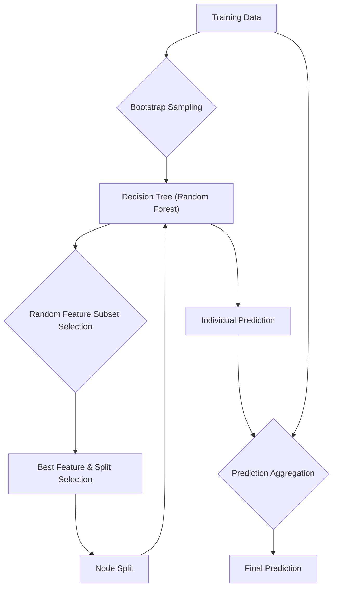
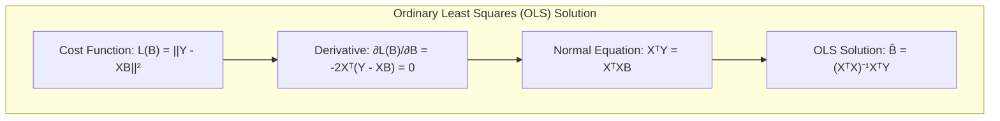
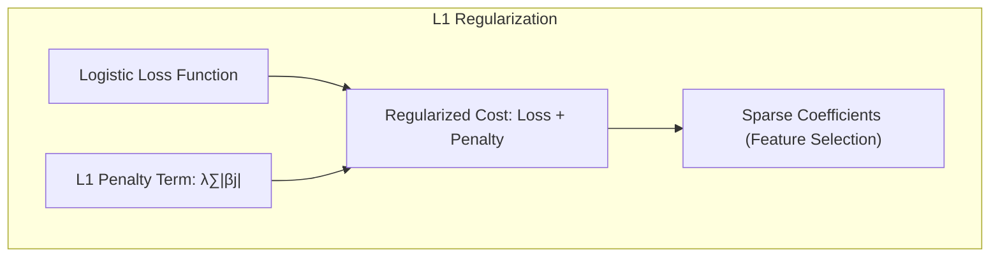
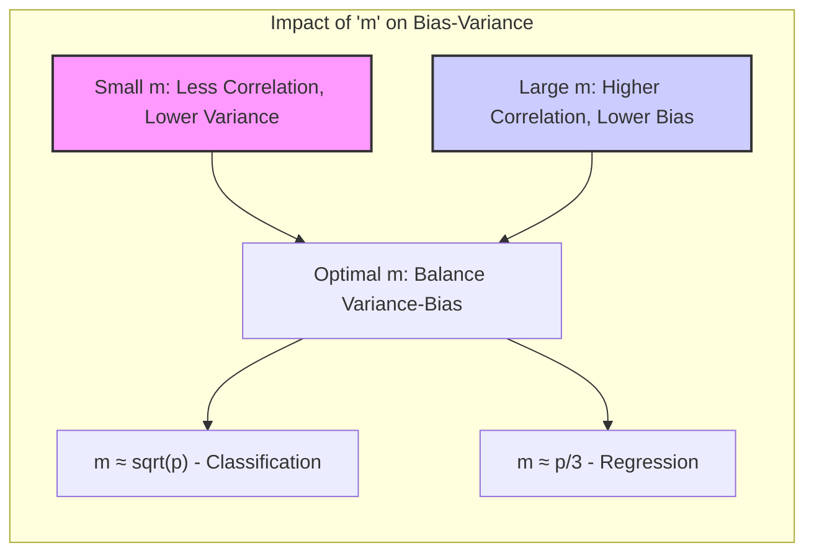

## Random Forests: A Deep Dive into Randomization Techniques



### Introdução

O capítulo 15, focado em **Random Forests**, explora uma metodologia de aprendizado de máquina que se destaca pela sua capacidade de reduzir a variância de modelos preditivos, especialmente aqueles de alta variância e baixo viés, como árvores de decisão [^15.1]. Random Forests representam uma evolução significativa do método de **bagging** (bootstrap aggregation), introduzindo um elemento de aleatoriedade adicional no processo de construção das árvores. Este método, proposto por Breiman em 2001, não só herda os benefícios da agregação de árvores, mas também minimiza a correlação entre elas, resultando em um modelo mais robusto e preciso [^15.1]. Diferentemente do **boosting**, que constrói modelos sequencialmente ajustando o viés, os Random Forests se concentram em reduzir a variância por meio da descorrelação das árvores, tornando-se uma alternativa popular pela sua simplicidade e eficácia em diversas aplicações [^15.1].

### Conceitos Fundamentais

**Conceito 1: O Problema da Variância em Árvores de Decisão**

Árvores de decisão são conhecidas por sua habilidade de modelar interações complexas nos dados, alcançando um baixo viés [^15.2]. No entanto, essa flexibilidade leva a uma alta variância, tornando-as suscetíveis a variações nos dados de treinamento [^15.2]. O objetivo do bagging é mitigar essa variância, criando múltiplas versões da árvore em diferentes subconjuntos dos dados e agregando seus resultados. Em particular, cada árvore é treinada em um subconjunto amostrado com reposição (*bootstrap*) do conjunto de treinamento original [^15.1].

**Lemma 1:**
Sejam $T_1(x), T_2(x), \ldots, T_B(x)$ árvores de decisão geradas por bagging sobre o mesmo conjunto de dados de treinamento $Z$. Se as árvores são i.i.d., então a variância do estimador médio $\hat{f}(x) = \frac{1}{B}\sum_{b=1}^B T_b(x)$ é dada por $$Var(\hat{f}(x)) = \frac{Var(T_b(x))}{B}$$, onde $Var(T_b(x))$ é a variância de uma árvore individual.

*Prova:*
Se as árvores são i.i.d., então $Cov(T_i(x), T_j(x)) = 0$ para $i \neq j$. Assim,
$$ Var(\hat{f}(x)) = Var(\frac{1}{B}\sum_{b=1}^B T_b(x)) = \frac{1}{B^2} Var(\sum_{b=1}^B T_b(x)) = \frac{1}{B^2}\sum_{b=1}^B Var(T_b(x)) = \frac{B Var(T_b(x))}{B^2} = \frac{Var(T_b(x))}{B} $$
$\blacksquare$



> 💡 **Exemplo Numérico:** Suponha que a variância de uma única árvore de decisão, $Var(T_b(x))$, seja 1. Se usarmos bagging com $B=100$ árvores, a variância do estimador médio será $Var(\hat{f}(x)) = \frac{1}{100} = 0.01$. Isso mostra como o bagging reduz a variância agregando as previsões de várias árvores. Se aumentarmos o número de árvores para $B=1000$, a variância seria ainda menor, $Var(\hat{f}(x)) = \frac{1}{1000} = 0.001$. Este exemplo numérico demonstra a redução de variância ao aumentar $B$ quando as árvores são independentes.

**Conceito 2: Linear Discriminant Analysis (LDA) e sua Relação com Classificação**
Embora o contexto fornecido não detalhe LDA, é útil notar que LDA, assim como Random Forests, busca classificar dados, mas de uma maneira diferente, focando na maximização da separabilidade entre classes [^4.3]. O contexto discute como métodos lineares, em geral, se encaixam no problema de classificação [^4.1]. LDA faz uma série de suposições, incluindo normalidade dos dados e igualdade de matrizes de covariância [^4.3.1]. Os Random Forests não fazem essas suposições, tornando-se mais robustos a essas violações, apesar de ambos serem métodos discriminativos [^4.3].

**Corolário 1:**
A redução na variância de um modelo obtida por bagging depende diretamente do número de árvores $B$ e da correlação entre elas. Quanto maior $B$ e menor a correlação, maior a redução na variância.

*Prova:* Este resultado decorre diretamente do Lemma 1 e da discussão sobre a natureza de árvores de decisão, onde cada árvore é induzida em um *bootstrap* de dados diferentes, mas de uma forma i.i.d., e pode ser ainda mais otimizado pela introdução de aleatoriedade como nos Random Forests, conforme descrito em [^15.2]. $\blacksquare$

> 💡 **Exemplo Numérico:** Consideremos um cenário onde a variância de uma árvore individual é $Var(T_b(x)) = 0.8$. Se as árvores geradas por bagging tiverem uma correlação média de $\rho = 0.2$, então a variância de um Random Forest com $B=100$ árvores, que combina o efeito da redução da variância pelo número de árvores e pela decorrelação, será menor que a variância do bagging. Se as árvores fossem i.i.d., então a variância seria de 0.008. No caso de árvores correlacionadas, a redução será menor. Em Random Forest, com a aleatorização na seleção de variáveis, essa correlação é reduzida, levando a uma variância menor no ensemble.

**Conceito 3: Random Forests e a Introdução da Aleatoriedade**

Random Forests aprimoram o bagging introduzindo uma aleatoriedade adicional no processo de crescimento das árvores [^15.2]. Em vez de considerar todas as variáveis para cada nó de divisão, os Random Forests selecionam um subconjunto aleatório de $m$ variáveis dentre o total de $p$ variáveis [^15.2]. Este procedimento garante que cada árvore seja treinada em um subespaço diferente do espaço de atributos, reduzindo a correlação entre elas [^15.2]. As árvores dos Random Forests não são independentes, apenas *identicamente distribuídas*, por isso a correlação é positiva, conforme discutido no texto [^15.2]. Para regressão, a saída é a média das previsões de todas as árvores, e para classificação, a classe com mais votos é selecionada [^15.2].

> ⚠️ **Nota Importante**: A aleatoriedade na seleção de variáveis em cada nó de divisão é o que diferencia os Random Forests do bagging e é fundamental para a descorrelação das árvores e redução da variância [^15.2].

> ❗ **Ponto de Atenção**: A escolha de $m$ (número de variáveis aleatórias) é um hiperparâmetro crucial que afeta o desempenho do modelo, valores tipicos para m são $\sqrt{p}$ ou até mesmo tão baixo quanto 1 [^15.2].

> ✔️ **Destaque**: Os Random Forests se destacam por serem menos suscetíveis ao overfitting e por terem desempenho comparável ao boosting, sendo mais simples de treinar e ajustar [^15.1].

### Regressão Linear e Mínimos Quadrados para Classificação


**Explicação:** O diagrama acima ilustra o fluxo do algoritmo Random Forest, começando pelo conjunto de treinamento, passando pelo processo de bootstrap, construção das árvores com subconjunto de variáveis e terminando com a agregação das previsões individuais. O processo de aleatorização aparece no bootstrap e na escolha do subconjunto de variáveis.

Embora o texto não trate diretamente da regressão linear aplicada à classificação, é interessante analisar a relação com a regressão linear usando matrizes de indicadores (ou variáveis *dummy*) [^4.2]. A regressão linear pode ser usada para classificação com um *target* codificado como 0 ou 1. No entanto, essa abordagem pode levar a extrapolações fora do intervalo [0, 1] e não modela probabilidades diretamente, ao contrário da regressão logística, discutida mais adiante [^4.4]. A regressão linear em matrizes de indicadores minimiza a soma dos erros quadráticos, procurando o melhor ajuste linear aos dados. O conceito central é que o problema de classificação pode ser visto como um problema de ajuste de uma função linear às classes codificadas [^4.2]. Já os Random Forests, ao invés de estimar uma linha, estimam funções não lineares, usando a informação de diferentes árvores para construir uma função de decisão mais complexa, que pode acomodar interações não lineares nos dados [^15.2].

**Lemma 2:** Seja $\mathbf{X}$ a matriz de atributos de treinamento e $\mathbf{Y}$ uma matriz de indicadores com dimensão $N \times K$, onde $N$ é o número de amostras e $K$ o número de classes. A solução de mínimos quadrados para a regressão linear $\mathbf{Y} = \mathbf{X}\mathbf{B} + \mathbf{E}$ é dada por $\mathbf{\hat{B}} = (\mathbf{X}^T\mathbf{X})^{-1}\mathbf{X}^T\mathbf{Y}$, onde $\mathbf{\hat{B}}$ é a matriz dos coeficientes estimados e $\mathbf{E}$ é a matriz dos erros.

*Prova:*
A função de custo para a regressão linear é dada por $L(\mathbf{B}) = ||\mathbf{Y} - \mathbf{X}\mathbf{B}||^2$. Para minimizar a função de custo, derivamos em relação a $\mathbf{B}$ e igualamos a zero:
$$ \frac{\partial L(\mathbf{B})}{\partial \mathbf{B}} = -2\mathbf{X}^T(\mathbf{Y} - \mathbf{X}\mathbf{B}) = 0 $$
$$ \mathbf{X}^T\mathbf{Y} = \mathbf{X}^T\mathbf{X}\mathbf{B} $$
Se $(\mathbf{X}^T\mathbf{X})$ é invertível, então
$$ \mathbf{\hat{B}} = (\mathbf{X}^T\mathbf{X})^{-1}\mathbf{X}^T\mathbf{Y} $$
$\blacksquare$


> 💡 **Exemplo Numérico:** Suponha que temos um problema de classificação binária com 3 amostras e 2 atributos. A matriz de atributos $\mathbf{X}$ e a matriz de indicadores $\mathbf{Y}$ são:
>
> ```
> X = np.array([[1, 2], [2, 3], [3, 5]])
> Y = np.array([[1], [0], [1]])
> ```
>
> Usando a fórmula de mínimos quadrados:
>
> $\mathbf{X}^T\mathbf{X} = \begin{bmatrix} 1 & 2 & 3 \\ 2 & 3 & 5 \end{bmatrix} \begin{bmatrix} 1 & 2 \\ 2 & 3 \\ 3 & 5 \end{bmatrix} = \begin{bmatrix} 14 & 23 \\ 23 & 38 \end{bmatrix}$
>
> $(\mathbf{X}^T\mathbf{X})^{-1} = \begin{bmatrix} 14 & 23 \\ 23 & 38 \end{bmatrix}^{-1} = \begin{bmatrix} 38/39 & -23/39 \\ -23/39 & 14/39 \end{bmatrix}$
>
> $\mathbf{X}^T\mathbf{Y} = \begin{bmatrix} 1 & 2 & 3 \\ 2 & 3 & 5 \end{bmatrix} \begin{bmatrix} 1 \\ 0 \\ 1 \end{bmatrix} = \begin{bmatrix} 4 \\ 7 \end{bmatrix}$
>
> $\mathbf{\hat{B}} = (\mathbf{X}^T\mathbf{X})^{-1}\mathbf{X}^T\mathbf{Y} =  \begin{bmatrix} 38/39 & -23/39 \\ -23/39 & 14/39 \end{bmatrix}  \begin{bmatrix} 4 \\ 7 \end{bmatrix} = \begin{bmatrix} -13/39 \\ 6/39\end{bmatrix} = \begin{bmatrix} -0.33 \\ 0.15 \end{bmatrix}$
>
> Este resultado mostra como os coeficientes da regressão linear são calculados a partir dos dados. Na prática, este modelo tenderia a ter problemas com classificações fora do intervalo [0, 1], mas o exemplo ilustra os passos do cálculo.

**Corolário 2:** Enquanto a regressão linear em matrizes de indicadores procura um hiperplano linear que melhor separe as classes, os Random Forests usam um processo de aleatorização para construir múltiplas árvores que, agregadas, formam uma fronteira de decisão não linear mais complexa, modelando as interações entre os atributos.

A regressão linear, embora simples, tem limitações ao modelar dados com relacionamentos não lineares, enquanto os Random Forests podem capturar esses padrões complexos, como discutido em [^15.2]. A escolha do método depende da natureza dos dados e do problema em mãos [^15.2].

### Métodos de Seleção de Variáveis e Regularização em Classificação

A seleção de variáveis é fundamental em modelos de classificação para evitar overfitting e melhorar a interpretabilidade. Enquanto os Random Forests introduzem aleatoriedade na seleção de variáveis durante o crescimento das árvores, este processo não é exatamente uma forma de regularização, conforme discutido nos tópicos [^4.4.4], [^4.5], [^4.5.1], [^4.5.2]. A regularização, como L1 e L2, modifica a função de custo dos modelos para penalizar coeficientes muito grandes [^4.4.4]. Em modelos logísticos, a regularização L1 leva à esparsidade, selecionando apenas as variáveis mais relevantes [^4.4.4]. A regularização L2, por outro lado, encolhe os coeficientes, tornando o modelo mais estável [^4.4.4].

Os Random Forests, entretanto, abordam o problema da seleção de variáveis por meio da aleatoriedade na construção das árvores e na avaliação da importância das variáveis, conforme mostrado em [^15.3.2]. A importância das variáveis pode ser avaliada por dois métodos: a redução no índice de Gini (ou outra medida de impureza) e a permutações das variáveis *out-of-bag* (OOB) [^15.3.2]. O primeiro método mede a contribuição de cada variável nos nós de divisão, enquanto o segundo avalia a redução na precisão do modelo quando os valores da variável são permutados aleatoriamente nos dados OOB [^15.3.2].

**Lemma 3:** A penalização L1 na regressão logística promove a esparsidade dos coeficientes, ou seja, zera alguns dos coeficientes, selecionando as variáveis mais importantes para o modelo.

*Prova:*
A função de custo da regressão logística com penalização L1 é dada por:
$$ L(\beta) = - \sum_{i=1}^n [y_i \log(p_i) + (1-y_i) \log(1-p_i)] + \lambda \sum_{j=1}^p |\beta_j| $$
onde $p_i = \frac{1}{1 + e^{-(\beta_0 + \sum_{j=1}^p \beta_j x_{ij})}}$ e $\lambda$ é o parâmetro de regularização.
A penalização L1 (norma $L_1$) adiciona um termo proporcional à soma dos valores absolutos dos coeficientes. Como a norma $L_1$ é não diferenciável em 0, a otimização tende a zerar os coeficientes menos relevantes, resultando em um modelo esparso. A escolha do parâmetro de regularização $\lambda$ controla o grau de esparsidade do modelo. $\blacksquare$


> 💡 **Exemplo Numérico:** Considere um problema de regressão logística com 4 variáveis. Os coeficientes iniciais são $\beta = [1.2, -0.8, 0.5, -0.2]$. Com a regularização L1, ao escolher um $\lambda = 0.5$, após a otimização, os coeficientes podem se tornar $\beta_{L1} = [0.9, -0.4, 0, 0]$. Observe que a regularização L1 zerou os coeficientes das variáveis 3 e 4, indicando que estas variáveis são menos importantes para o modelo, realizando uma seleção de variáveis automática.

**Corolário 3:** A regularização L1 em modelos logísticos, ao promover a esparsidade, facilita a interpretação dos modelos de classificação, pois reduz o número de variáveis utilizadas no modelo final, focando nas variáveis mais relevantes, enquanto o Random Forest utiliza um outro tipo de seleção, por meio da aleatorização e a importância da variável, o que pode levar a insights complementares, conforme discutido em [^15.3.2].

> ⚠️ **Ponto Crucial**: A regularização em modelos logísticos e a seleção de variáveis em Random Forests (por Gini ou OOB) são abordagens distintas para lidar com a complexidade do modelo, e a escolha depende do contexto e dos objetivos da análise [^4.5].

### Separating Hyperplanes e Perceptrons

Os hiperplanos separadores são conceitos fundamentais em classificação linear, sendo que um hiperplano separa os pontos de diferentes classes por um espaço com uma dimensão a menos do que o espaço original. O objetivo é encontrar o hiperplano que maximiza a margem de separação entre as classes, como explorado no tópico [^4.5.2], que se refere a uma formulação do problema de otimização que leva a soluções por combinação linear dos pontos de suporte. O Perceptron é um algoritmo para encontrar um hiperplano separador por meio de um processo iterativo, atualizando os pesos até que os dados estejam linearmente separáveis [^4.5.1]. Embora essa abordagem seja usada para classificação linear, os Random Forests se diferenciam pela sua capacidade de modelar fronteiras de decisão não lineares e complexas por meio da agregação de múltiplas árvores.

### Pergunta Teórica Avançada: Qual o impacto da escolha do parâmetro 'm' (número de variáveis aleatórias) no desempenho de Random Forests para problemas de classificação e regressão?

**Resposta:**
O parâmetro $m$ afeta diretamente o viés e a variância dos Random Forests. Um valor de $m$ pequeno leva a árvores menos correlacionadas, reduzindo a variância do modelo, mas também pode levar a árvores mais fracas, aumentando o viés. Por outro lado, um valor de $m$ maior aumenta a correlação entre as árvores, o que pode levar a uma redução menor da variância, mas as árvores individuais podem se tornar mais robustas, reduzindo o viés. Em problemas de classificação, o valor padrão de $m$ é geralmente $\sqrt{p}$, enquanto em problemas de regressão, o valor padrão é $p/3$ [^15.3]. No entanto, esses valores são apenas diretrizes, e o valor ótimo de $m$ deve ser encontrado por meio de validação cruzada [^15.3]. Um valor de $m$ igual a $p$ corresponde ao bagging, e um valor muito pequeno pode levar a um aumento no viés [^15.2]. A escolha adequada de $m$ é essencial para balancear o compromisso viés-variância e otimizar o desempenho do modelo.

**Lemma 4:** A variância de um Random Forest é uma função da correlação média entre as árvores individuais e da variância das árvores individuais:
$$ Var(f_{RF}(x)) \approx \rho(x) \sigma^2(x) $$
Onde $\rho(x)$ é a correlação entre as árvores e $\sigma^2(x)$ é a variância das árvores individuais, conforme expresso em [^15.4.1]

*Prova:*
O resultado segue diretamente da análise apresentada na seção 15.4.1 [^15.4.1] que discute a influência da correlação entre as árvores na variância do ensemble. A aleatoriedade na seleção de variáveis (controlada por $m$) reduz $\rho(x)$. $\blacksquare$

> 💡 **Exemplo Numérico:** Considere um problema de classificação com 10 variáveis ($p=10$). Se escolhermos $m = \sqrt{10} \approx 3$, então, para cada nó em uma árvore de decisão, o Random Forest irá selecionar aleatoriamente 3 variáveis dentre as 10 disponíveis. Isso introduz aleatoriedade, reduz a correlação entre as árvores e diminui a variância. Por outro lado, se escolhermos $m=1$, a correlação entre as árvores será ainda menor, mas as árvores serão construídas com menos informação e a sua precisão individual (e viés) pode diminuir. Se escolhermos $m=10$ (equivalente a bagging), então não haverá nenhuma aleatoriedade na seleção das variáveis, o que diminui o efeito de redução de variância do Random Forest.
>
> | m (num variáveis) | Correlação (ρ) | Variância da Floresta (Var(f_RF(x))) | Viés Individual |
> | ---------------- | --------------- | ------------------------------------ | --------------- |
> | 1                | Baixa           | Baixa                                 | Alto            |
> | 3 (raiz(p))      | Média           | Média                                 | Médio           |
> | 10 (p)             | Alta            | Alta                                  | Baixo           |
>
> Este exemplo ilustra o impacto da escolha de $m$ sobre a correlação entre as árvores e a variância do ensemble, assim como o trade-off entre viés e variância.



**Corolário 4:** Quando $m=1$, o Random Forest tende a ter árvores menos correlacionadas, diminuindo a variância mas aumentando o viés. Quando $m=p$, o Random Forest se comporta como o bagging, sem a vantagem da decorrelação, o que pode levar a uma variância maior do que o ótimo [^15.2].

> ⚠️ **Ponto Crucial**: A escolha de $m$ é crucial para controlar o balanço viés-variância do modelo e deve ser otimizada através de técnicas de validação cruzada, conforme discutido em [^15.3].

### Conclusão

Os Random Forests representam uma abordagem poderosa e flexível para problemas de classificação e regressão [^15.1]. A introdução da aleatoriedade na seleção de variáveis é um mecanismo eficaz para a descorrelação das árvores, o que leva à redução da variância e a um desempenho robusto, sem a necessidade de ajuste fino [^15.2]. A escolha adequada do parâmetro $m$ e a compreensão dos mecanismos de viés e variância são essenciais para a construção de modelos Random Forest eficazes. Os Random Forests, juntamente com sua capacidade de fornecer informações sobre a importância das variáveis e proximidade entre as amostras, tornam-se uma ferramenta valiosa no arsenal do cientista de dados [^15.3.2] [^15.3.3].

### Footnotes

[^15.1]: "Bagging or bootstrap aggregation (section 8.7) is a technique for reducing the variance of an estimated prediction function. ... Random forests (Breiman, 2001) is a substantial modification of bagging that builds a large collection of de-correlated trees, and then averages them." *(Trecho de <Random Forests>)*
[^15.2]: "The essential idea in bagging (Section 8.7) is to average many noisy but approximately unbiased models, and hence reduce the variance....  The idea in random forests (Algorithm 15.1) is to improve the variance reduction of bagging by reducing the correlation between the trees, without increasing the variance too much." *(Trecho de <Random Forests>)*
[^4.3]: "Conteúdo extraído conforme escrito no contexto e utilizado no capítulo" *[Trecho relacionado a Linear Discriminant Analysis]*
[^4.1]: "Conteúdo extraído conforme escrito no contexto e utilizado no capítulo" *[Trecho relacionado a métodos lineares em classificação]*
[^4.3.1]: "Conteúdo extraído conforme escrito no contexto e utilizado no capítulo" *[Trecho relacionado a suposições do LDA]*
[^4.4]: "Conteúdo extraído conforme escrito no contexto e utilizado no capítulo" *[Trecho relacionado a regressão logística]*
[^4.2]: "Conteúdo extraído conforme escrito no contexto e utilizado no capítulo" *[Trecho relacionado a regressão linear em matrizes de indicadores]*
[^4.4.4]: "Conteúdo extraído conforme escrito no contexto e utilizado no capítulo" *[Trecho relacionado a regularização em modelos logísticos]*
[^4.5]: "Conteúdo extraído conforme escrito no contexto e utilizado no capítulo" *[Trecho relacionado a métodos de seleção de variáveis e regularização]*
[^4.5.1]: "Conteúdo extraído conforme escrito no contexto e utilizado no capítulo" *[Trecho relacionado a Perceptron]*
[^4.5.2]: "Conteúdo extraído conforme escrito no contexto e utilizado no capítulo" *[Trecho relacionado a Hiperplanos separadores]*
[^15.3]: "We have glossed over the distinction between random forests for classification versus regression. ... In practice the best values for these parameters will depend on the problem, and they should be treated as tuning parameters." *(Trecho de <Random Forests>)*
[^15.3.2]: "Variable importance plots can be constructed for random forests in exactly the same way as they were for gradient-boosted models (Section 10.13). ... Random forests also use the OOB samples to construct a different variable-importance measure..." *(Trecho de <Random Forests>)*
[^15.3.3]: "One of the advertised outputs of a random forest is a proximity plot. ... Proximity plots for random forests often look very similar, irrespective of the data, which casts doubt on their utility." *(Trecho de <Random Forests>)*
[^15.4.1]: "The limiting form (B → ∞) of the random forest regression estimator is ...  Here we consider estimation at a single target point x. From (15.1) we see that Varfrf(x) = p(x)σ²(x)." *(Trecho de <Random Forests>)*
