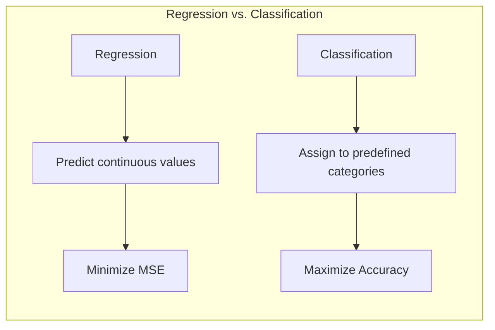
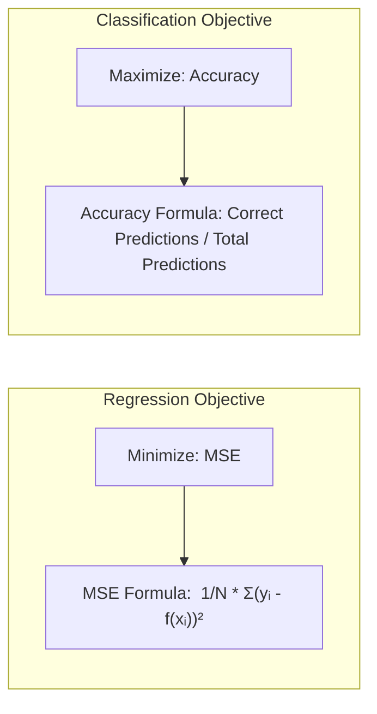
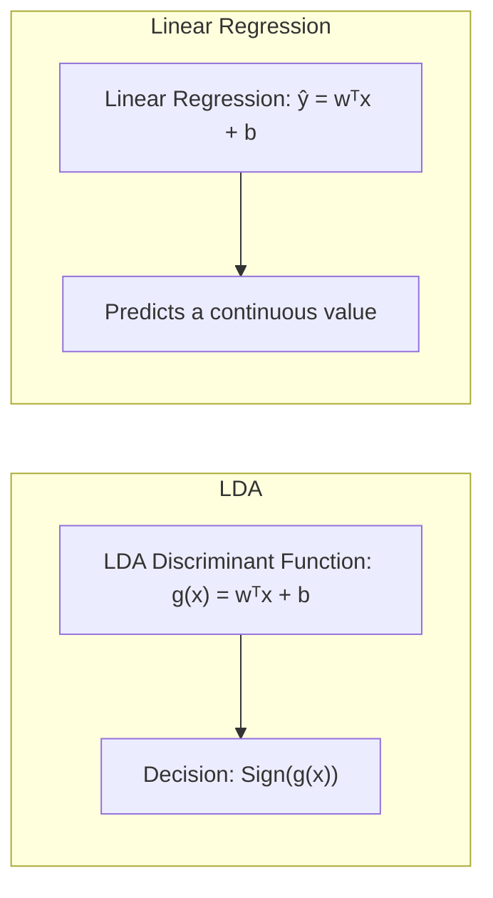
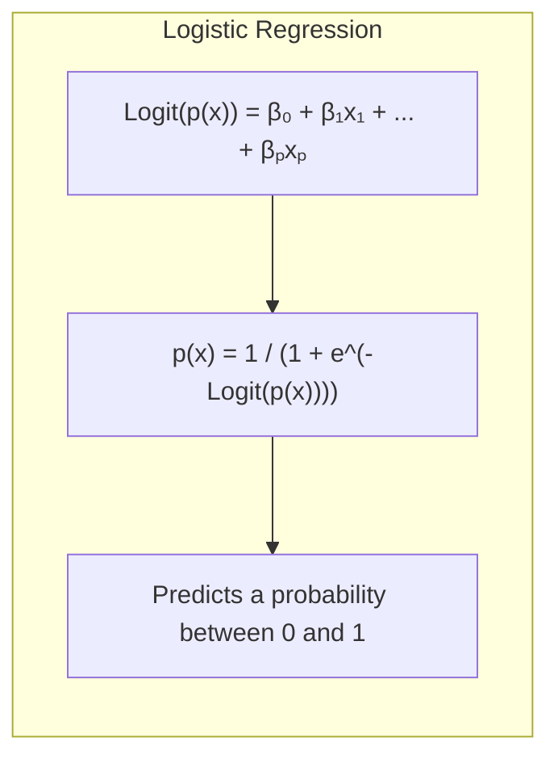
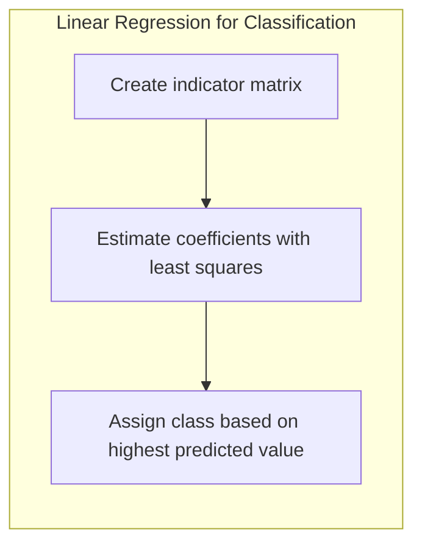
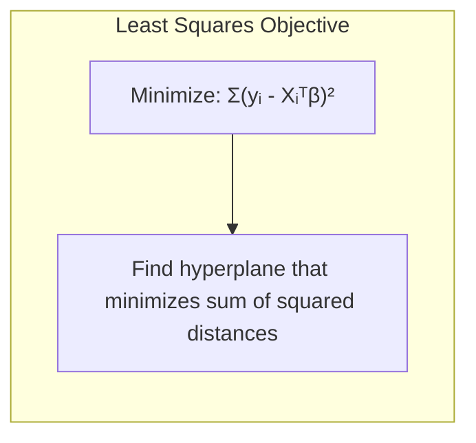
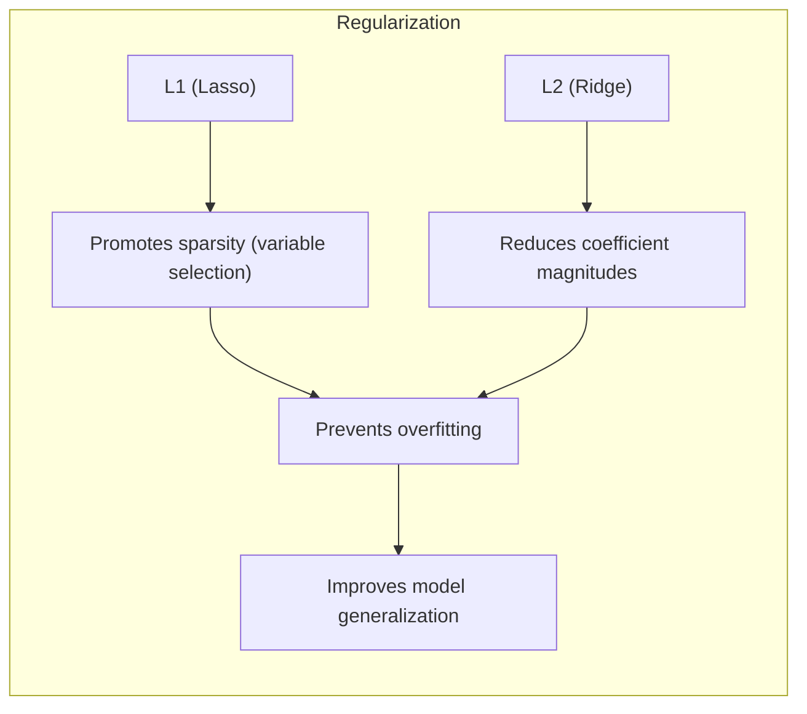
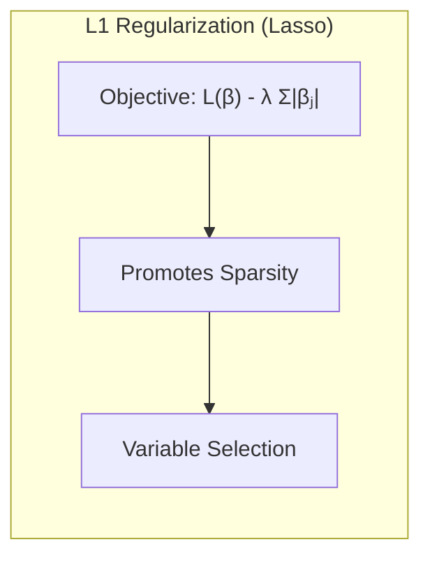
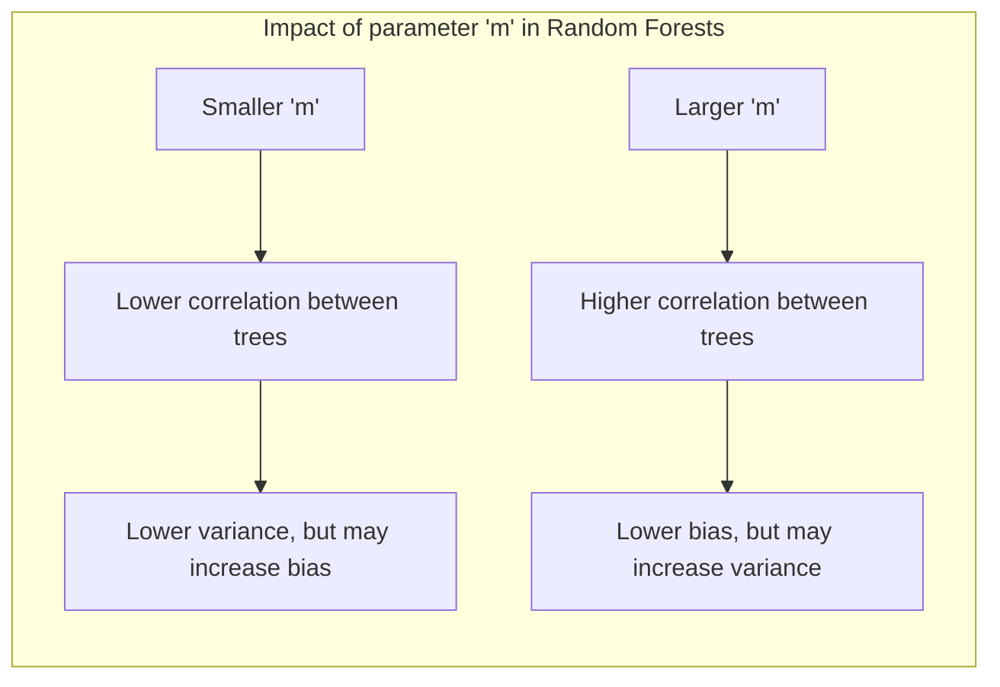
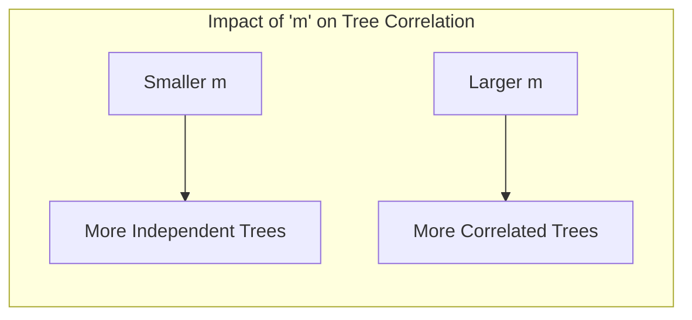

## Regressão vs. Classificação: Uma Análise Comparativa no Contexto de Random Forests

### Introdução

A escolha entre **regressão** e **classificação** é fundamental no aprendizado de máquina, determinando a natureza do problema a ser resolvido e o tipo de modelo mais adequado. Enquanto a regressão busca prever um valor contínuo, a classificação visa atribuir uma observação a uma categoria predefinida. Este capítulo explora as nuances dessas abordagens, especialmente no contexto de **Random Forests**, um método versátil que pode ser adaptado tanto para regressão quanto para classificação [^15.1]. Discutiremos os princípios teóricos, as adaptações algorítmicas e as implicações práticas de cada abordagem, com foco em como a estrutura e a aleatoriedade dos Random Forests influenciam seu desempenho em cada cenário.

### Conceitos Fundamentais

**Conceito 1:** O problema de **regressão**, como discutido em [^15.1], envolve a modelagem da relação entre variáveis preditoras e uma variável de resposta contínua. O objetivo é aprender uma função que mapeie as entradas para os valores de saída mais precisos possíveis. Em contraste, a **classificação**, conforme mencionado em [^15.1], trata de prever a qual de um conjunto de categorias discretas uma observação pertence. A diferença fundamental reside na natureza da variável de resposta: contínua para regressão e discreta para classificação. A escolha de qual usar impacta diretamente na formulação do problema, na escolha dos algoritmos e na avaliação do modelo.

**Lemma 1:** Dado um conjunto de dados com variáveis preditoras $X$ e uma variável de resposta $Y$, para um problema de regressão, o objetivo é encontrar uma função $f(X)$ que minimize o erro entre $f(X)$ e $Y$, geralmente medido pelo erro quadrático médio (MSE). Em um problema de classificação, o objetivo é encontrar uma função que atribua corretamente cada observação a sua categoria correspondente, maximizando a acurácia ou uma métrica similar, levando em consideração a matriz de confusão e outras medidas de desempenho [^15.1]. Formalmente, para regressão, buscamos minimizar $$MSE = \frac{1}{N}\sum_{i=1}^{N} (y_i - f(x_i))^2$$, enquanto para classificação, buscamos maximizar a acurácia $$Accuracy = \frac{Número\ de\ previsões\ corretas}{Número\ total\ de\ previsões}$$.  $\blacksquare$
> 💡 **Exemplo Numérico:**
>
> Imagine que temos um conjunto de dados com duas variáveis preditoras ($x_1$ e $x_2$) e uma variável resposta $y$.
>
> **Regressão:** Queremos prever o preço de uma casa ($y$) com base na sua área ($x_1$) e número de quartos ($x_2$). Suponha que temos um modelo de regressão linear simples: $f(x) = 50 + 100x_1 + 50x_2$. Se uma casa tem área $x_1 = 20$ e $x_2 = 3$ quartos, o preço previsto seria $f(x) = 50 + 100*20 + 50*3 = 2150$. O MSE avaliaria o quão bem esses preços previstos se aproximam dos preços reais das casas, considerando todos os dados do conjunto.
>
> **Classificação:** Queremos classificar emails como "spam" (classe 1) ou "não spam" (classe 0) usando as palavras mais frequentes no email. Uma Random Forest de classificação poderia dar uma probabilidade de um email ser spam, e a classe é decidida por um limiar (por exemplo, probabilidade > 0.5). A acurácia seria a porcentagem de emails corretamente classificados em comparação com todos os emails.
>
> Suponha que o modelo previu para 5 emails:
>
> | Email | Previsão (Probabilidade Spam) | Classe Prevista | Classe Real |
> | ----- | --------------------------- | ------------- | ---------- |
> | 1     | 0.9                         | Spam (1)      | Spam (1)   |
> | 2     | 0.2                         | Não Spam (0)  | Não Spam (0) |
> | 3     | 0.7                         | Spam (1)      | Não Spam (0) |
> | 4     | 0.1                         | Não Spam (0)  | Não Spam (0) |
> | 5     | 0.6                         | Spam (1)      | Spam (1) |
>
> A acurácia seria 4/5 = 80%, pois 4 dos 5 emails foram corretamente classificados.

**Conceito 2:** A **Linear Discriminant Analysis (LDA)**, embora primariamente um método de classificação, pode ser vista como um método de redução de dimensionalidade que busca projetar dados em subespaços que maximizam a separabilidade entre classes [^15.4.1]. Essa projeção linear pode, em certas circunstâncias, ser relacionada à modelagem de regressão linear, porém, sua aplicação primária é a discriminação e não a predição de um valor numérico contínuo. Em contraste, a regressão linear visa encontrar a melhor reta ou hiperplano que se ajusta aos dados, com o objetivo de prever um valor contínuo com base em variáveis preditoras [^15.1].

**Corolário 1:** A função discriminante linear da LDA pode ser expressa como $g(x) = w^T x + b$, onde $w$ é o vetor de pesos e $b$ é o bias. A decisão de classe é tomada com base no sinal de $g(x)$, por exemplo, se $g(x) > 0$, a observação é classificada em uma classe, caso contrário, em outra.  Em contraste, para uma regressão linear, a previsão é dada por $\hat{y} = w^T x + b$ e $\hat{y}$ é uma estimativa do valor contínuo da variável resposta, não apenas um classificador de categoria. Enquanto LDA otimiza a separação entre classes, a regressão linear otimiza o ajuste aos dados contínuos. [^15.1] $\blacksquare$

> 💡 **Exemplo Numérico:**
>
> **LDA:** Suponha que temos duas classes de flores (classe 0 e classe 1) e duas características (comprimento da sépala ($x_1$) e largura da sépala ($x_2$)).
>
> O LDA pode encontrar uma linha (hiperplano em 2D) para separar essas duas classes. Suponha que a função discriminante linear seja: $g(x) = 0.5x_1 - 0.3x_2 + 1$. Se para uma flor, $x_1 = 5$ e $x_2 = 3$, então $g(x) = 0.5*5 - 0.3*3 + 1 = 2.6$. Como $g(x) > 0$, a flor seria classificada como classe 1.
>
> **Regressão Linear:** Se estivéssemos usando regressão linear para prever o comprimento da pétala ($y$) usando o mesmo comprimento ($x_1$) e largura da sépala ($x_2$) como preditores, o modelo seria $\hat{y} = 0.2x_1 + 0.4x_2 + 0.1$. Com os mesmos valores $x_1 = 5$ e $x_2 = 3$, teríamos  $\hat{y} = 0.2*5 + 0.4*3 + 0.1 = 2.3$.  O valor de 2.3 é a previsão para o comprimento da pétala, que é uma variável contínua e não uma classificação.

**Conceito 3:** A **Logistic Regression**, embora apresentada no contexto de classificação [^15.1], utiliza uma função sigmoide para modelar a probabilidade de uma observação pertencer a uma determinada classe. Em termos matemáticos, o log-odds (logit) da probabilidade é modelado como uma combinação linear das variáveis preditoras. Isso difere da regressão linear, onde o valor esperado da resposta é diretamente modelado como uma função linear das variáveis preditoras. A Logistic Regression, portanto, embora use uma combinação linear, visa classificar e não prever valores contínuos. A função logística, que define a forma como os dados são "esmagados" para o intervalo [0,1] é:
$$p(x) = \frac{1}{1 + e^{-(\beta_0 + \beta_1x_1 + \ldots + \beta_px_p)}} $$
onde $p(x)$ é a probabilidade da observação pertencer à classe 1 e os parâmetros $\beta_i$ são obtidos por meio da maximização da verossimilhança. [^15.1]

> 💡 **Exemplo Numérico:**
>
> Suponha que, para um problema de classificação binária (0 ou 1), a regressão logística encontrou os seguintes parâmetros: $\beta_0 = -2$, $\beta_1 = 1.5$, e temos apenas uma variável preditora $x_1$.
>
> A probabilidade de uma observação com $x_1 = 2$ pertencer à classe 1 é:
>
> $p(x) = \frac{1}{1 + e^{-(-2 + 1.5 * 2)}} = \frac{1}{1 + e^0} = \frac{1}{2} = 0.5$
>
> Já para $x_1 = 3$, a probabilidade é:
>
> $p(x) = \frac{1}{1 + e^{-(-2 + 1.5 * 3)}} = \frac{1}{1 + e^{-2.5}} \approx 0.92$
>
> O limite de decisão seria $p(x) = 0.5$, e, neste caso, qualquer $x_1 > 2$ seria classificado como 1 (probabilidade maior do que 0.5). Perceba que os valores previstos são probabilidades entre 0 e 1, ao contrário da regressão linear.

> ⚠️ **Nota Importante**: A escolha entre regressão e classificação depende da natureza da variável de resposta, e o modelo deve ser escolhido para otimizar a métrica relevante ao problema específico, conforme em [^15.1].

> ❗ **Ponto de Atenção**: Mesmo modelos lineares podem ser usados tanto para classificação como para regressão, mas com abordagens distintas.

> ✔️ **Destaque**: A análise comparativa de modelos de classificação e regressão é essencial para selecionar a abordagem mais adequada a um problema, conforme discutido em [^15.1].

### Regressão Linear e Mínimos Quadrados para Classificação

A regressão linear, quando aplicada a problemas de classificação, geralmente envolve a criação de uma **matriz de indicadores** para representar as classes, onde cada coluna indica a pertinência de uma observação a uma classe específica [^15.1]. Os coeficientes são então estimados utilizando o método dos **mínimos quadrados**. A decisão de classe pode ser tomada atribuindo a observação à classe correspondente à coluna com o maior valor previsto. No entanto, esta abordagem pode apresentar problemas como extrapolações fora do intervalo [0, 1] para probabilidades e a falta de otimização para a métrica de classificação.

**Lemma 2:** Em um cenário de classificação binária, a regressão linear aplicada à matriz indicadora, com uma variável resposta indicando a pertinência de uma observação à classe 1 (e 0 caso contrário), minimiza o erro quadrático médio entre os valores previstos e os valores reais. Matematicamente, a regressão linear tenta encontrar um hiperplano que minimiza a soma dos quadrados das distâncias verticais entre os pontos de dados e esse hiperplano, com a função objetivo de $$ \min_\beta \sum_{i=1}^{n} (y_i - X_i^T \beta)^2 $$. Entretanto, essa minimização não garante uma boa classificação, pois a métrica é diferente. [^15.1] $\blacksquare$

> 💡 **Exemplo Numérico:**
>
> Suponha que temos um problema de classificação binária com duas observações e uma variável preditora $x$.  Nossa variável resposta $y$ é 0 ou 1, representando a classe a qual a observação pertence.
>
> | Observação | $x$   | $y$ (Classe) |
> |------------|-------|--------------|
> | 1          | 1     | 0            |
> | 2          | 2     | 1            |
>
> Usando regressão linear para classificação, encontraríamos uma linha que minimiza o MSE para prever $y$ usando $x$. Digamos que a regressão linear encontra o modelo: $\hat{y} = -0.5 + 0.75x$.
>
> Para a observação 1:  $\hat{y} = -0.5 + 0.75*1 = 0.25$
> Para a observação 2:  $\hat{y} = -0.5 + 0.75*2 = 1$
>
> Se usarmos um limite de decisão de 0.5 para classificar, a observação 1 seria classificada como 0 e a observação 2 como 1, o que é correto nesse caso. Contudo, se a observação 1 tivesse $x = 0.1$, $\hat{y} = -0.425$, que não seria uma probabilidade significativa. Além disso, se tivéssemos uma observação com $x=5$, teriamos $\hat{y} = 3.25$ que é bem fora do intervalo [0, 1]. Isso demonstra que a regressão linear não foi projetada para esse tipo de problema, porque não é um classificador propriamente dito, e os valores estimados não são probabilidades.

**Corolário 2:** O uso da regressão linear diretamente para classificação pode levar a decisões subótimas em termos de probabilidade e limites de decisão, em relação a métodos projetados especificamente para classificação, como Logistic Regression e LDA. Em particular, os valores previstos podem não estar entre 0 e 1, dificultando a interpretação como probabilidades.  [^15.1] $\blacksquare$

"Embora a regressão linear possa ser usada para problemas de classificação, como mencionado em [^15.1], sua adequação é questionável devido à sua formulação voltada para a modelagem de variáveis contínuas e não para a discriminação entre classes."

"Além disso, a regressão linear para classificação pode ser sensível a outliers, pois o método dos mínimos quadrados tende a minimizar a soma dos quadrados dos erros, dando peso excessivo a grandes erros. Em contraste, métodos como a regressão logística são mais robustos a outliers e oferecem probabilidades mais significativas para a classificação, conforme em [^15.1]."

### Métodos de Seleção de Variáveis e Regularização em Classificação

A seleção de variáveis e a regularização são cruciais em modelos de classificação, especialmente quando se lida com um grande número de preditores, como discutido em [^15.1]. Métodos como a **penalização L1 (Lasso)** induzem esparsidade, selecionando apenas as variáveis mais importantes, e a **penalização L2 (Ridge)** reduz a magnitude dos coeficientes, estabilizando o modelo e prevenindo o overfitting.  Em modelos logísticos, essas técnicas de regularização são implementadas pela adição de um termo de penalidade à função de verossimilhança a ser maximizada, controlando a complexidade do modelo.

**Lemma 3:** A penalização L1 em regressão logística, dada pela adição de um termo de penalidade proporcional à soma dos valores absolutos dos coeficientes,  $\lambda \sum_{j=1}^p |\beta_j|$ , promove soluções esparsas. Isso ocorre porque a norma L1 possui uma forma geométrica que leva a muitos coeficientes iguais a zero, efetivamente selecionando um subconjunto de variáveis, [^15.1]. $\blacksquare$

**Prova do Lemma 3:** Ao maximizar a verossimilhança com penalização L1, a função objetivo toma a forma: $$ L(\beta) - \lambda \sum_{j=1}^p |\beta_j| $$, onde L(β) é a função de verossimilhança logística e λ é o parâmetro de regularização. Geometricamente, a penalização L1 tende a "empurrar" os coeficientes para o eixo, o que resulta em muitos coeficientes iguais a zero quando a função de verossimilhança é maximizada. Ao contrário da penalização L2, que encolhe todos os coeficientes, a L1 realiza a seleção, desconsiderando alguns, o que resulta em modelos mais simples e interpretáveis, [^15.1]. $\blacksquare$

> 💡 **Exemplo Numérico:**
>
> Suponha que temos um modelo de regressão logística com 4 variáveis preditoras ($x_1, x_2, x_3, x_4$). Sem regularização, o modelo encontra os coeficientes:
>
> $\beta_0 = -0.5, \beta_1 = 1.2, \beta_2 = -0.8, \beta_3 = 0.5, \beta_4 = 0.1$
>
> Com regularização L1 (Lasso), com um valor de $\lambda=0.6$, o modelo pode encontrar os seguintes coeficientes:
>
> $\beta_0 = -0.3, \beta_1 = 0.9, \beta_2 = 0, \beta_3 = 0, \beta_4 = 0$
>
> Veja que $\beta_2, \beta_3$ e $\beta_4$ foram zerados, indicando que as variáveis $x_2, x_3, x_4$ não foram consideradas importantes para o modelo, demonstrando a esparsidade que o Lasso promove. Com regularização L2 (Ridge), os coeficientes seriam apenas reduzidos em valor, mas sem que muitos fossem zerados:
>
> $\beta_0 = -0.4, \beta_1 = 0.8, \beta_2 = -0.6, \beta_3 = 0.3, \beta_4 = 0.05$
>
> A escolha do $\lambda$ controla o trade-off entre a complexidade do modelo e a performance nos dados de treino: Valores maiores de $\lambda$ levam a modelos mais simples, com menos parâmetros, e valores menores tendem a modelos mais complexos, com mais parâmetros.

**Corolário 3:**  A esparsidade induzida pela penalização L1 facilita a interpretação do modelo, identificando as variáveis mais relevantes para a classificação. A escolha do parâmetro de regularização λ controla o compromisso entre viés e variância: valores maiores de λ levam a modelos mais simples e com maior viés, enquanto valores menores levam a modelos mais complexos com menor viés, [^15.1]. $\blacksquare$

> ⚠️ **Ponto Crucial**: A escolha entre L1 e L2, ou uma combinação delas (Elastic Net), depende do problema específico e da necessidade de esparsidade e estabilidade do modelo, conforme em [^15.1].

### Separating Hyperplanes e Perceptrons

A ideia de **hiperplanos separadores** surge como uma forma de encontrar uma fronteira de decisão linear que divide o espaço de características em regiões correspondentes a diferentes classes [^15.1]. O **Perceptron**, um algoritmo simples de aprendizado, busca um hiperplano que separe os dados corretamente, e se os dados forem linearmente separáveis, o Perceptron converge para uma solução que separa as classes. O Perceptron é treinado de forma iterativa, ajustando os pesos do hiperplano sempre que uma observação é classificada erroneamente. A ideia de maximizar a margem de separação entre as classes leva a modelos mais robustos, como as Support Vector Machines (SVMs), que usam os pontos de suporte para definir o hiperplano ótimo.

### Pergunta Teórica Avançada: Qual o impacto da escolha do parâmetro m na performance dos Random Forests em problemas de regressão e classificação?

**Resposta:**

O parâmetro $m$ em Random Forests, que define o número de variáveis selecionadas aleatoriamente em cada nó da árvore, tem um papel crucial na modelagem do viés e da variância, tanto em problemas de regressão como classificação, conforme em [^15.2]. Em problemas de **regressão**, um valor de $m$ menor reduz a correlação entre as árvores, levando a menor variância do modelo, mas pode aumentar o viés, especialmente se variáveis importantes não são selecionadas com frequência [^15.2]. A seleção de um $m$ maior aumenta a correlação entre as árvores, diminuindo o viés, mas aumentando a variância, portanto a escolha de $m$ ideal envolve um equilíbrio. Em geral, um valor padrão de $m$ em problemas de regressão é $p/3$, onde $p$ é o número total de variáveis [^15.2].

Em problemas de **classificação**, um valor de $m$ menor também reduz a correlação entre as árvores, diminuindo a variância, mas também pode aumentar o viés, da mesma forma que acontece na regressão. A escolha de um valor muito baixo de $m$ faz com que cada árvore aprenda com um subconjunto muito limitado dos preditores, o que pode levar à falta de capacidade preditiva. Da mesma forma, um $m$ muito alto aumenta a correlação entre as árvores, o que diminui a capacidade do Random Forest de reduzir a variância. Um valor padrão de $m$ é $\sqrt{p}$ para problemas de classificação [^15.2]. O impacto do parâmetro $m$ também é influenciado pela natureza da base de dados, como a quantidade de ruído e a complexidade das interações entre os atributos.

**Lemma 4:** A correlação entre árvores em um Random Forest é inversamente relacionada ao valor de $m$. Um valor menor de $m$ promove árvores mais independentes, enquanto um valor maior de $m$ aumenta a similaridade entre as árvores, com impacto direto na redução da variância do modelo, [^15.2]. $\blacksquare$

> 💡 **Exemplo Numérico:**
>
> Suponha que temos um dataset com $p=9$ variáveis preditoras.
>
> **Regressão:**
> O valor padrão para m seria $m = p/3 = 9/3 = 3$.
> Se diminuíssemos para $m=1$, teríamos uma menor correlação entre as árvores, pois cada árvore usaria apenas uma variável aleatória, mas isso poderia aumentar o viés. Se aumentarmos para $m=7$, a correlação entre as árvores aumentaria, diminuindo o viés, mas aumentando a variância.
> **Classificação:**
> O valor padrão para m seria $m = \sqrt{p} = \sqrt{9} = 3$.
> Usando a mesma lógica da regressão, diminuir m para 1 pode reduzir a variância e aumentar o viés e vice-versa. A escolha de m deve ser encontrada por meio de validação cruzada, testando diferentes valores.

**Corolário 4:** A escolha de $m$ é um ponto crucial a ser afinado em Random Forests. Para problemas complexos com grande número de variáveis, uma seleção de $m$ mais baixa pode levar à estabilização do modelo, e para problemas com poucos preditores relevantes, um $m$ mais alto pode ser mais adequado para incluir todos os preditores relevantes em cada árvore. [^15.2] $\blacksquare$

> ⚠️ **Ponto Crucial**:  A escolha de $m$ deve ser feita considerando o trade-off entre viés e variância, ajustando-o empiricamente através de validação cruzada, conforme discutido em [^15.2].

### Conclusão

Em síntese, a escolha entre regressão e classificação define o problema e o tipo de modelo mais apropriado. Random Forests, com sua flexibilidade e aleatoriedade, adaptam-se a ambos os cenários, mas requerem ajustes nos parâmetros, como o valor de $m$, para otimizar seu desempenho, como em [^15.1] e [^15.2]. A compreensão das nuances teóricas e dos trade-offs práticos é crucial para a construção de modelos preditivos eficazes em diversas aplicações. A análise comparativa apresentada neste capítulo fornece uma base sólida para entender as diferenças e similaridades entre regressão e classificação, e como aplicá-las com sucesso em modelos de Random Forest.

<!-- END DOCUMENT -->
### Footnotes
[^15.1]: "Bagging or bootstrap aggregation (section 8.7) is a technique for reducing the variance of an estimated prediction function. Bagging seems to work especially well for high-variance, low-bias procedures, such as trees. For regression, we simply fit the same regression tree many times to bootstrap-sampled versions of the training data, and average the result. For classification, a committee of trees each cast a vote for the predicted class." *(Trecho de <Random Forests>)*
[^15.2]: "The essential idea in bagging (Section 8.7) is to average many noisy but approximately unbiased models, and hence reduce the variance. Trees are ideal candidates for bagging, since they can capture complex interaction structures in the data, and if grown sufficiently deep, have relatively low bias. Since trees are notoriously noisy, they benefit greatly from the averag- ing. Moreover, since each tree generated in bagging is identically distributed (i.d.), the expectation of an average of B such trees is the same as the ex- pectation of any one of them." *(Trecho de <Random Forests>)*
[^15.3]:  "As B increases, the second term disappears, but the first remains, and hence the size of the correlation of pairs of bagged trees limits the benefits of averaging. The idea in random forests (Algorithm 15.1) is to improve the variance reduction of bagging by reducing the correlation between the trees, without increasing the variance too much. This is achieved in the tree-growing process through random selection of the input variables." *(Trecho de <Random Forests>)*
[^15.4]: "Typically values for m are √p or even as low as 1." *(Trecho de <Random Forests>)*
[^15.4.1]: "The limiting form (B → ∞) of the random forest regression estimator is
frf(x) = EezT(x; Θ(Ζ)),
(15.4)
where we have made explicit the dependence on the training data Z. Here we consider estimation at a single target point x. From (15.1) we see that" *(Trecho de <Random Forests>)*
[^15.4.2]:  "Random forests with small m perform a similar averaging. Each of the relevant variables get their turn to be the primary split, and the ensemble averaging reduces the contribution of any individual variable." *(Trecho de <Random Forests>)*
