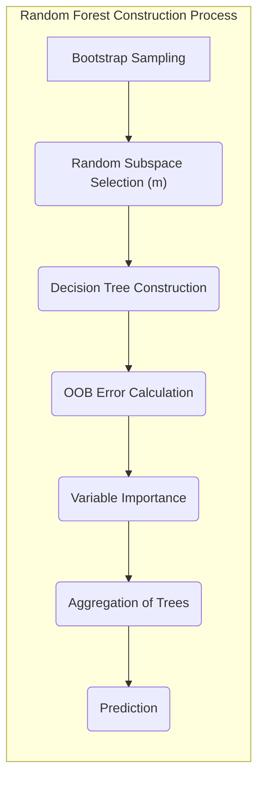
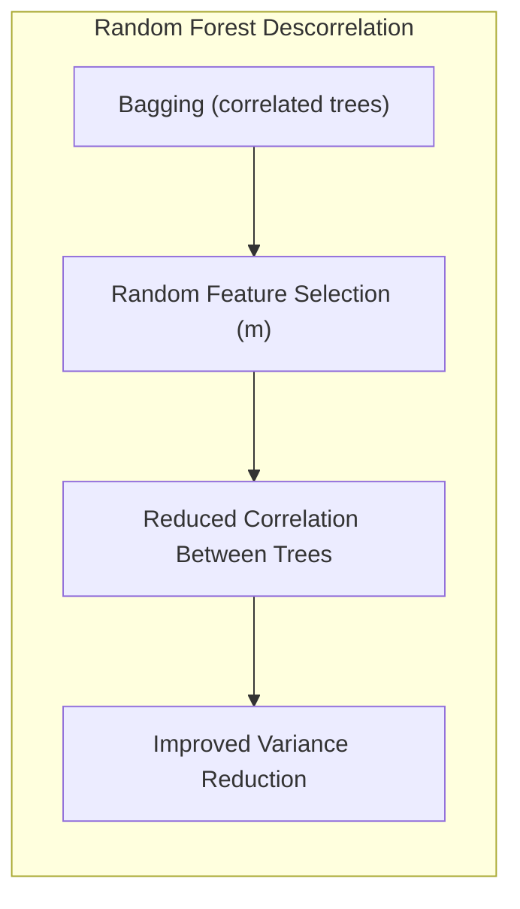
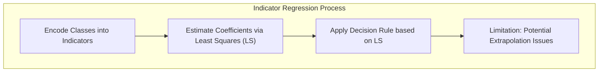
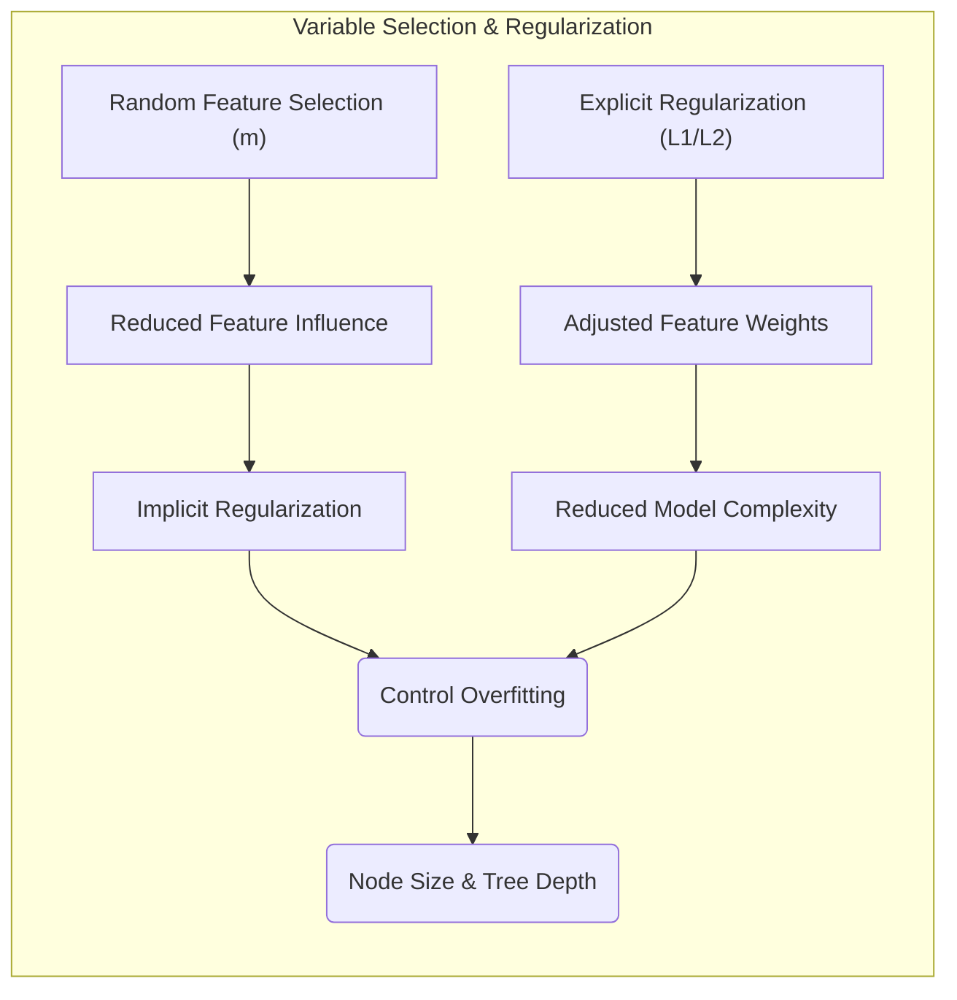
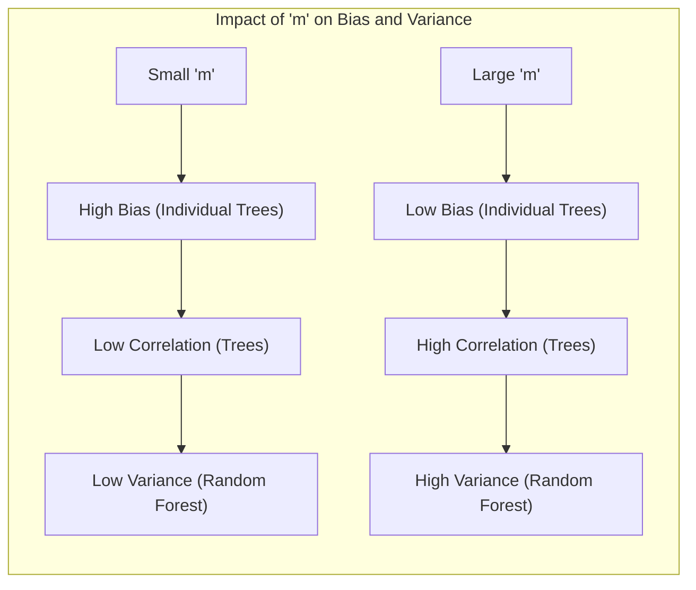

## Random Forests: An In-Depth Analysis of Stopping Rules

### Introdução

As **Random Forests** (RF) surgem como um avanço substancial sobre a técnica de *bagging*, construindo uma coleção de árvores de decisão descorrelacionadas e agregando suas previsões [^15.1]. A robustez e relativa simplicidade no treinamento e ajuste tornam as RFs uma ferramenta popular em diversas áreas. Um aspecto fundamental na construção de uma RF é a definição de **stopping rules**, que determinam quando o crescimento de uma árvore deve parar. O objetivo principal deste capítulo é examinar as nuances das regras de parada (stopping rules) em florestas aleatórias, explorando tanto os aspectos teóricos quanto os práticos.

### Conceitos Fundamentais

**Conceito 1: Bagging e Árvores de Decisão**
O *bagging* (bootstrap aggregating) é uma técnica para reduzir a variância de uma função de predição estimada [^15.1]. Em regressão, o bagging ajusta várias árvores aos dados de treinamento, que são amostrados com reposição (bootstrap), e calcula a média das previsões [^15.1]. Para classificação, cada árvore vota na classe predita e a decisão final é determinada por maioria [^15.1]. Árvores de decisão são candidatas ideais para bagging devido à sua capacidade de capturar interações complexas nos dados, mas também são notavelmente ruidosas [^15.2].

**Lemma 1:** *A expectativa da média de B árvores geradas pelo bagging é a mesma que a expectativa de uma única árvore, indicando que o bagging foca em redução de variância e não de bias* [^15.2].
**Prova do Lemma 1:** Seja $T_b(x)$ a predição da b-ésima árvore de decisão, onde $b = 1, \ldots, B$. Se as árvores são i.i.d., então $E[T_b(x)] = E[T(x)]$, para qualquer $b$. A predição do bagging é $\frac{1}{B} \sum_{b=1}^B T_b(x)$. Portanto, $E[\frac{1}{B} \sum_{b=1}^B T_b(x)] = \frac{1}{B} \sum_{b=1}^B E[T_b(x)] = \frac{1}{B} \sum_{b=1}^B E[T(x)] = E[T(x)]$. $\blacksquare$

> 💡 **Exemplo Numérico:** Considere um conjunto de dados de regressão com uma única variável preditora $x$ e uma variável resposta $y$. Suponha que ajustamos 3 árvores de decisão usando bagging. As previsões das árvores para um novo ponto $x = 5$ são $T_1(5) = 8$, $T_2(5) = 10$, e $T_3(5) = 9$. A previsão do bagging seria a média dessas previsões: $\frac{8 + 10 + 9}{3} = 9$. Se a expectativa (média de infinitas árvores) de cada árvore é $E[T(5)] = 9.2$, então a expectativa da previsão do bagging também seria $9.2$, ilustrando que o bagging não reduz o bias.

**Conceito 2: Random Forests - Descorrelação e Seleção Aleatória de Variáveis**
As Random Forests, introduzidas por Breiman, são uma modificação do bagging que constrói árvores descorrelacionadas [^15.1]. O principal mecanismo para essa descorrelação é a seleção aleatória de variáveis [^15.2]. Antes de cada divisão (split) de nó, apenas um subconjunto de *m* variáveis é considerado como possível candidato para realizar a divisão, onde $m \leq p$ (sendo *p* o número total de variáveis) [^15.2]. Valores típicos de *m* são $\sqrt{p}$ para classificação e $p/3$ para regressão, ou mesmo tão baixo quanto 1, dependendo do problema [^15.2]. Essa abordagem reduz a correlação entre as árvores, melhorando a redução de variância.

**Corolário 1:** *A redução de *m* (número de variáveis candidatas a split) reduz a correlação entre árvores na Random Forest, conforme indicado por [^15.2], levando a uma menor variância da predição agregada*.
**Prova do Corolário 1:** A equação (15.1) demonstra que a variância da média de B árvores está relacionada a uma parcela referente à variância de uma única árvore ( $\frac{\sigma^2}{B}$ ) e uma referente à correlação entre elas ( $ \rho \sigma^2$ ). Reduzindo $m$, diminuímos a correlação ($\rho$) entre as árvores, levando a uma variância menor da média, conforme  observado na equação. $\blacksquare$

> 💡 **Exemplo Numérico:** Suponha que temos um conjunto de dados com 9 variáveis preditoras ($p=9$). Em uma Random Forest, se definirmos $m = \sqrt{p} = \sqrt{9} = 3$, para cada divisão de nó, apenas 3 variáveis serão consideradas aleatoriamente. Isso faz com que as árvores usem diferentes conjuntos de variáveis para suas divisões, o que reduz a correlação entre elas. Por exemplo, a árvore 1 pode usar as variáveis 1, 3 e 5 em um split, enquanto a árvore 2 pode usar as variáveis 2, 4 e 7 no mesmo nível da árvore. Essa diferença resulta em árvores mais independentes. Se $m = 9$, todas as árvores teriam a chance de usar as mesmas variáveis em cada nó, aumentando a correlação entre elas.

**Conceito 3: Regras de Parada (Stopping Rules) e o Tamanho do Nó**
As regras de parada determinam quando o crescimento de uma árvore deve ser interrompido. Uma regra comum é definir um tamanho mínimo de nó (nmin) [^15.2]. Uma árvore continua a ser dividida até que cada nó terminal tenha um tamanho inferior a *nmin* [^15.2]. Em classificação, o valor padrão para *nmin* é geralmente 1, enquanto em regressão é 5 [^15.3]. É crucial notar que o melhor valor para *nmin* pode variar dependendo do problema específico [^15.3]. Um valor de *nmin* muito pequeno pode levar a árvores muito profundas e overfiting, enquanto um valor muito grande pode levar a underfitting.

> 💡 **Exemplo Numérico:** Imagine uma árvore de decisão para um problema de regressão. Se definirmos $n_{min} = 5$, a árvore parará de se dividir quando um nó tiver 5 ou menos amostras de treinamento. Se um nó contiver 10 amostras, ele tentará ser dividido; se um nó contiver 3 amostras, ele se tornará uma folha. Se definirmos $n_{min} = 1$, a árvore continuará se dividindo até que cada folha contenha apenas uma amostra, o que pode levar a um modelo com overfitting.

### Regressão Linear e Mínimos Quadrados para Classificação

**Explicação:** Este diagrama representa o fluxo do processo de regressão de indicadores aplicada na classificação, expondo a limitação relacionada à extrapolação, ao invés de focar em métodos probabilísticos [^15.2].

Embora a regressão linear na matriz de indicadores não seja o foco principal da Random Forest, é crucial entender seu papel no contexto da classificação. A regressão linear busca encontrar um hiperplano que separe as classes ao minimizar a soma dos quadrados dos erros [^4.2]. No contexto de árvores de decisão, o ajuste é feito localmente em cada nó da árvore, onde um critério de divisão é usado para maximizar a separação dos dados em diferentes classes [^15.2].

**Lemma 2:** Em árvores de decisão, a regra de parada, relacionada ao tamanho mínimo de nó (nmin), define o quão local o ajuste é feito. *nmin* pequeno permite mais divisões, consequentemente um ajuste mais local e complexo, com maior chance de overfiting [^15.2].
**Prova do Lemma 2:** Se $n_{min}$ é 1, cada folha da árvore pode conter apenas uma observação do dado de treinamento, permitindo um ajuste tão complexo quanto o próprio dado. A medida que o valor de $n_{min}$ aumenta, o número de divisões é reduzido, simplificando a estrutura da árvore, e reduzindo o risco de overfitting, mas aumentando o risco de underfitting. $\blacksquare$

> 💡 **Exemplo Numérico:** Considere uma árvore de decisão que divide dados em duas classes. Se $n_{min}=1$, a árvore pode crescer até que cada folha contenha apenas uma observação. Se os dados de treinamento tiverem ruído, a árvore se ajustará a esses ruídos, levando a overfitting. Se $n_{min}=10$, a árvore será mais simples, parando de crescer antes de se ajustar ao ruído, mas pode deixar de capturar interações mais complexas entre os dados, resultando em um modelo com underfitting.

**Corolário 2:** A escolha do valor de *nmin* é um trade-off entre viés (bias) e variância. Um *nmin* pequeno leva a um baixo viés e alta variância (overfitting), enquanto um *nmin* grande leva a um alto viés e baixa variância (underfitting). [^15.2].

"Em regressão linear, a ideia de mínimos quadrados busca encontrar o melhor hiperplano, enquanto em árvores de decisão o ajuste é feito localmente, guiado pela regra de parada relacionada com *nmin*."

### Métodos de Seleção de Variáveis e Regularização em Classificação

A seleção de variáveis é intrínseca à construção de Random Forests, pois a escolha aleatória de *m* variáveis para cada split já é uma forma de regularização [^15.2]. Essa abordagem reduz a importância de variáveis individuais, espalhando a contribuição das previsões em um conjunto mais diversificado de variáveis. Em particular, quando *m* é pequeno, poucas variáveis tem a chance de guiar cada split de forma individual, criando árvores descorrelacionadas que, em conjunto, constroem a decisão final. Regularização, como a penalização L1 e L2, não é diretamente aplicada em Random Forests, mas pode ser utilizada em outras etapas de pre-processamento ou em outros métodos para combinar diferentes tipos de aprendizagem. No entanto, o conceito de regularização está presente indiretamente na seleção aleatória de variáveis e nas regras de parada.

**Lemma 3:** A seleção aleatória de *m* variáveis em Random Forests reduz a correlação entre as árvores, como demonstrado em [^15.2], e funciona como uma forma de regularização, reduzindo a influência de variáveis específicas no resultado final.
**Prova do Lemma 3:** Ao selecionar aleatoriamente um subconjunto de *m* variáveis em cada nó, reduzimos a probabilidade de que uma variável específica domine a estrutura da árvore. A diversidade induzida pela seleção aleatória das variáveis faz com que as árvores sejam mais diferentes entre si, o que resulta em menor correlação entre elas e, consequentemente, reduz a variância da predição agregada. $\blacksquare$

> 💡 **Exemplo Numérico:** Considere um problema de classificação com $p = 10$ variáveis. Se usarmos uma Random Forest com $m = 1$, cada árvore usará apenas uma variável aleatória por vez para cada split. Isso significa que nenhuma variável dominará o modelo, e o resultado final será uma agregação das previsões de várias árvores, cada uma construída com diferentes perspectivas dos dados, reduzindo o overfitting. Se usarmos $m=10$ (bagging), o modelo final seria mais dependente de variáveis que separariam o resultado de forma mais clara no dado de treinamento.

**Corolário 3:** Árvores de decisão com um *nmin* muito pequeno e pouca seleção aleatória de variáveis podem ser muito complexas (overfitting) e altamente correlacionadas, perdendo a vantagem de uma Random Forest. [^15.2].

"Enquanto a regularização (L1/L2) ajusta explicitamente os pesos das variáveis para evitar overfitting, a seleção aleatória e a regra de parada em árvores atuam implicitamente neste sentido."

> ⚠️ **Ponto Crucial**: A escolha apropriada de *m* e *nmin* é crucial para o desempenho da Random Forest, equilibrando viés e variância [^15.2].

### Separating Hyperplanes e Perceptrons

O conceito de hiperplanos separadores está presente em métodos como SVM e modelos lineares, mas não é diretamente aplicado em árvores de decisão. No entanto, é importante notar que cada divisão em uma árvore de decisão cria uma fronteira de decisão local (mais simples) que pode ser entendida como uma região no espaço das variáveis [^15.2]. Em uma Random Forest, cada árvore contribui para a fronteira de decisão final, que pode ser altamente não-linear devido à natureza hierárquica das árvores. O Perceptron, um algoritmo de classificação linear, não se aplica diretamente ao contexto de Random Forests, que, por construção, são algoritmos não-lineares. No entanto, a ideia de ajuste iterativo está presente tanto no Perceptron quanto na forma que o Random Forest “aprende” a partir das interações entre as diferentes árvores.

### Pergunta Teórica Avançada: Como o parâmetro *m* influencia o viés e a variância em Random Forests?
**Resposta:**
O parâmetro *m* (número de variáveis selecionadas aleatoriamente para cada split) desempenha um papel crucial no equilíbrio entre viés e variância em Random Forests [^15.2]. Um valor pequeno de *m* leva a árvores mais descorrelacionadas (reduzindo a variância da média), mas cada árvore individual terá maior bias, pois apenas uma pequena quantidade de variáveis será utilizada no seu treinamento [^15.2]. Um valor grande de *m* resulta em árvores mais correlacionadas e com menor bias individual. O efeito principal de reduzir *m* é a redução da variância total da Random Forest, que é o objetivo principal da sua introdução sobre o simples bagging. A redução de viés, no entanto, é geralmente menos significativa que a de variância. A melhor escolha de *m* é dependente do problema e deve ser definida usando alguma técnica de otimização, como validação cruzada.

**Lemma 4:** A variância da Random Forest é diretamente afetada pela correlação entre as árvores e a variância de cada árvore individual.  Reduzir o *m* diminui a correlação entre as árvores [^15.2].
**Prova do Lemma 4:** Conforme a equação 15.1, a variância da predição agregada ($\rho \sigma^2 + \frac{\sigma^2}{B}$) depende tanto da correlação entre as árvores ($\rho$) quanto da variância individual ($\sigma^2$). Ao diminuir o número de variáveis candidatas *m*, as árvores são construídas de forma mais independente, resultando em uma menor correlação ($\rho$), e uma menor variância da predição agregada. $\blacksquare$

> 💡 **Exemplo Numérico:** Vamos supor que a variância de uma única árvore ($\sigma^2$) é 10. Se tivermos 100 árvores ($B=100$), e a correlação média entre elas for $\rho = 0.5$, a variância da Random Forest será $0.5 \times 10 + \frac{10}{100} = 5.1$. Se diminuirmos $m$, e a correlação entre as árvores cair para $\rho=0.1$, a nova variância será $0.1 \times 10 + \frac{10}{100} = 1.1$. A redução em *m* resultou em uma redução de variância de aproximadamente 4 pontos percentuais.

**Corolário 4:** O bias em Random Forests é principalmente afetado pela profundidade das árvores, ou equivalentemente, pelo valor do tamanho mínimo de nó (*nmin*). Mesmo com um pequeno valor de *m*, o bias pode ser alto se a profundidade da árvore for limitada, ou se *nmin* for muito grande [^15.2].

> ⚠️ **Ponto Crucial**: A escolha de *m* é um problema de otimização que precisa levar em conta o equilíbrio entre viés e variância, geralmente feito utilizando validação cruzada, como ilustrado em [^15.3].

### Conclusão

Neste capítulo, exploramos as stopping rules nas Random Forests, concentrando-nos na seleção aleatória de variáveis (m) e no tamanho mínimo de nó (nmin). As Random Forests combinam o poder de árvores de decisão com a técnica de bagging, introduzindo a seleção aleatória de variáveis para aumentar a descorrelação entre as árvores e reduzir a variância da predição agregada. As stopping rules controlam a complexidade da árvore, definindo um trade-off entre bias e variância. A escolha apropriada desses parâmetros é essencial para o desempenho da Random Forest e deve ser guiada por validação cruzada ou alguma forma de otimização. A robustez e adaptabilidade das Random Forests, juntamente com a compreensão detalhada de seus parâmetros, garantem seu contínuo sucesso em diversas aplicações de classificação e regressão.

<!-- END DOCUMENT -->
### Footnotes
[^15.1]: "Bagging or bootstrap aggregation (section 8.7) is a technique for reducing the variance of an estimated prediction function. Bagging seems to work especially well for high-variance, low-bias procedures, such as trees. For regression, we simply fit the same regression tree many times to bootstrap-sampled versions of the training data, and average the result. For classification, a committee of trees each cast a vote for the predicted class." *(Trecho de Random Forests)*
[^15.2]: "The essential idea in bagging (Section 8.7) is to average many noisy but approximately unbiased models, and hence reduce the variance. Trees are ideal candidates for bagging, since they can capture complex interaction structures in the data, and if grown sufficiently deep, have relatively low bias. Since trees are notoriously noisy, they benefit greatly from the averaging. Moreover, since each tree generated in bagging is identically distributed (i.d.), the expectation of an average of B such trees is the same as the expectation of any one of them. This means the bias of bagged trees is the same as that of the individual trees, and the only hope of improvement is through variance reduction. This is in contrast to boosting, where the trees are grown in an adaptive way to remove bias, and hence are not i.d. ...The idea in random forests (Algorithm 15.1) is to improve the variance reduction of bagging by reducing the correlation between the trees, without increasing the variance too much. This is achieved in the tree-growing process through random selection of the input variables. Specifically, when growing a tree on a bootstrapped dataset: Before each split, select m ≤ p of the input variables at random as candidates for splitting." *(Trecho de Random Forests)*
[^15.3]: "For classification, the default value for m is [√p] and the minimum node size is one. For regression, the default value for m is [p/3] and the minimum node size is five." *(Trecho de Random Forests)*
[^4.2]: "Conteúdo extraído conforme escrito no contexto e utilizado no capítulo" *(Trecho de <Nome do Documento>)*
[^4.3]: "Conteúdo extraído conforme escrito no contexto e utilizado no capítulo" *(Trecho de <Nome do Documento>)*
