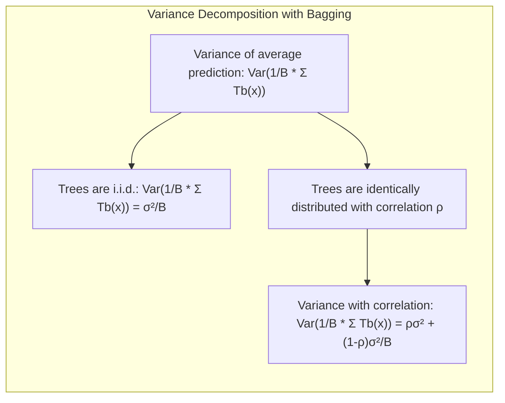
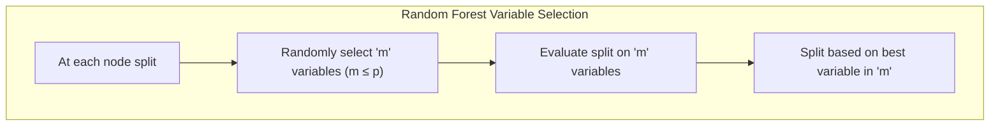
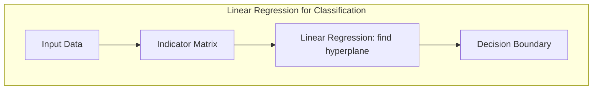
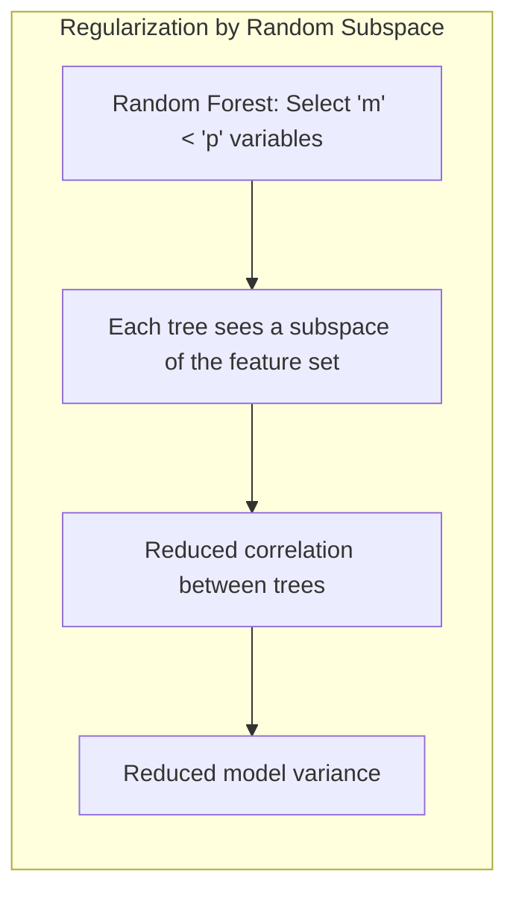
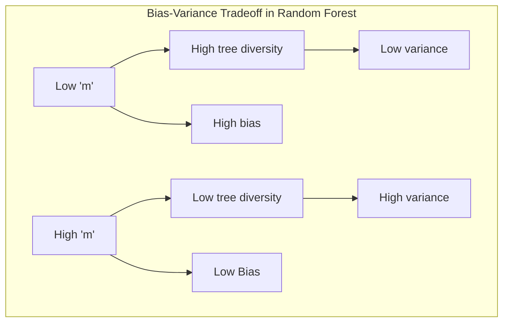

## Árvores de Decisão e Construção de Random Forests
<imagem: Um diagrama de árvore complexo que ilustra a construção de uma árvore de decisão, desde a seleção das variáveis e pontos de divisão até a formação dos nós terminais. Os passos do algoritmo de Random Forest devem ser também destacados.>

### Introdução
O conceito de **árvores de decisão**, e mais especificamente a construção de **Random Forests**, representam uma abordagem poderosa e flexível para modelagem preditiva, tanto em classificação quanto em regressão [^15.1]. A técnica de *bagging*, ou *bootstrap aggregation* [^15.1], desempenha um papel crucial na redução da variância de modelos preditivos, e as árvores de decisão, conhecidas por sua alta variância e baixo viés, são candidatas ideais para este procedimento [^15.1]. Random forests, uma extensão sofisticada do bagging, constroem uma coleção de árvores descorrelacionadas, resultando em um modelo robusto e com alta capacidade preditiva [^15.1]. Este capítulo explora em detalhes a construção dessas árvores, os mecanismos por trás do Random Forest, e suas aplicações práticas.

### Conceitos Fundamentais

**Conceito 1: Bagging e a Redução da Variância**
O *bagging* é uma técnica que visa reduzir a variância de modelos preditivos por meio da agregação de múltiplas versões do modelo ajustadas em amostras bootstrap [^15.1]. Em árvores de decisão, essa técnica consiste em criar várias árvores, cada uma treinada em uma amostra bootstrap do conjunto de dados original, e então agregar suas previsões. A ideia central é que, ao promediar muitos modelos ruidosos, mas aproximadamente não viesados, a variância do modelo preditivo final diminui significativamente [^15.2]. Para problemas de regressão, as predições são simplesmente promediadas, enquanto para classificação, as árvores "votam" na classe predita [^15.1].

**Lemma 1:** Se temos *B* árvores de decisão i.i.d. com variância $\sigma^2$, a variância da média das predições é $\frac{\sigma^2}{B}$. Quando as árvores não são i.i.d., mas apenas identicamente distribuídas com correlação par-a-par $\rho$, a variância da média é dada por $\rho\sigma^2 + \frac{1-\rho}{B}\sigma^2$ [^15.2].
$$ Var\left(\frac{1}{B}\sum_{b=1}^B T_b(x)\right) = \rho\sigma^2 + \frac{1-\rho}{B}\sigma^2 $$
*Prova:* A variância da soma de variáveis aleatórias é dada por
$$Var(\sum_{b=1}^B T_b(x)) = \sum_{b=1}^B Var(T_b(x)) + 2\sum_{i < j} Cov(T_i(x), T_j(x)).$$
Se as árvores são i.i.d., $Var(T_b(x)) = \sigma^2$ e $Cov(T_i(x), T_j(x)) = 0$. Portanto, a variância da média, $\frac{1}{B}\sum_{b=1}^B T_b(x)$, é $\frac{\sigma^2}{B}$. Se elas são identicamente distribuídas com correlação $\rho$, $Cov(T_i(x), T_j(x)) = \rho\sigma^2$ e temos $$ Var\left(\frac{1}{B}\sum_{b=1}^B T_b(x)\right) = \frac{1}{B^2} (B\sigma^2 + B(B-1)\rho\sigma^2) = \frac{\sigma^2}{B} + \frac{B-1}{B} \rho\sigma^2 \approx \rho\sigma^2 + \frac{1-\rho}{B}\sigma^2 .$$
$\blacksquare$


> 💡 **Exemplo Numérico:** Vamos supor que temos 10 árvores de decisão (*B* = 10), cada uma com variância nas suas predições de $\sigma^2 = 4$.
>
> 1. **Caso i.i.d.:** Se as árvores são independentes e identicamente distribuídas (i.i.d.), a variância da média das predições é $\frac{\sigma^2}{B} = \frac{4}{10} = 0.4$. Isso mostra que a média das predições é menos variável do que as predições individuais.
>
> 2. **Caso com Correlação:** Se as árvores são identicamente distribuídas, mas com uma correlação par-a-par de $\rho = 0.2$, a variância da média é $\rho\sigma^2 + \frac{1-\rho}{B}\sigma^2 = 0.2 * 4 + \frac{1-0.2}{10} * 4 = 0.8 + 0.32 = 1.12$. Aqui, a variância é maior devido à correlação entre as árvores, o que demonstra como a correlação prejudica a redução da variância.
>
> Este exemplo ilustra numericamente como o *bagging* reduz a variância quando as árvores são independentes, e como a correlação entre as árvores limita essa redução. Random Forests buscam descorrelacionar as árvores para obter o máximo benefício do *bagging*.

**Conceito 2: Random Forests e a Descorrelação de Árvores**
Random Forests, introduzido por Breiman em 2001 [^15.1], aprimora o *bagging* através da descorrelação das árvores. O processo de construção de cada árvore envolve uma seleção aleatória de variáveis em cada nó de divisão. Em vez de considerar todas as *p* variáveis de entrada para a divisão, apenas um subconjunto *m ≤ p* é considerado [^15.2]. Este processo reduz a correlação entre as árvores, o que é essencial para obter uma redução significativa da variância [^15.2]. A escolha de *m* é um hiperparâmetro importante que afeta o desempenho do modelo [^15.3].


**Corolário 1:** Ao selecionar um número *m* de variáveis em cada nó, o limite da redução da variância pelo método de bagging é aumentado. A descorrelação entre as árvores geradas pelo Random Forest leva a uma redução da variância maior em relação ao bagging [^15.2]. O termo $\rho\sigma^2$  na variância da média de um conjunto de *B* árvores identicamente distribuídas diminui, levando a um melhor resultado em termos de redução da variância.

**Conceito 3: Construção de uma Árvore de Random Forest**
O processo de construção de uma árvore de Random Forest envolve os seguintes passos [^15.2]:
1.  **Amostragem Bootstrap:** Criar uma amostra bootstrap *Z*** do tamanho *N* do conjunto de dados de treino.
2.  **Crescimento da Árvore:** Para cada nó terminal da árvore:
    *   Selecionar aleatoriamente *m* variáveis dentre as *p* variáveis disponíveis.
    *   Escolher a melhor variável e ponto de divisão entre as *m* variáveis selecionadas.
    *   Dividir o nó em dois nós filhos.
3.  **Repetir o processo** até atingir um tamanho mínimo de nó *nmin*.
4.  **Ensemble de Árvores:** O resultado final é um conjunto de *B* árvores {T<sub>b</sub>}<sub>1</sub><sup>B</sup>.

Para classificação, cada árvore prediz uma classe, e a classe final é determinada por voto majoritário. Para regressão, a predição final é obtida pela média das predições de todas as árvores [^15.2].

> 💡 **Exemplo Numérico:** Considere um dataset com *p* = 5 variáveis (A, B, C, D, E) e queremos construir uma árvore de Random Forest.
>
> 1.  **Amostragem Bootstrap:** Uma amostra bootstrap do conjunto de dados é criada (com possível repetição de instâncias).
> 2.  **Crescimento da Árvore:**
>     *   **Nó Raiz:** Selecionamos aleatoriamente *m* = 2 variáveis, digamos, B e D. Avaliamos qual dessas variáveis proporciona a melhor divisão, vamos supor que seja a variável D no ponto de corte 0.5. O nó raiz é então dividido com base em D <= 0.5.
>     *   **Nó Filho Esquerdo:** Em seguida, para o nó filho esquerdo (D <= 0.5), selecionamos novamente *m* = 2 variáveis aleatoriamente, digamos A e C. Avaliamos a melhor divisão e continuamos o processo recursivamente.
>     *   **Nó Filho Direito:**  Similarmente, no nó filho direito (D > 0.5) selecionamos outras 2 variáveis aleatoriamente e prosseguimos.
> 3.  **Repetição:** O processo é repetido até que cada nó tenha um número mínimo de amostras *nmin*.
> 4.  **Ensemble de Árvores:** O processo é repetido para *B* = 100 árvores.
>
> Este exemplo ilustra como cada árvore é construída com amostras bootstrap e seleção aleatória de variáveis, resultando em um ensemble diversificado e descorrelacionado.

### Regressão Linear e Mínimos Quadrados para Classificação
<imagem: Diagrama de fluxo detalhando o processo de construção de árvores no Random Forest, desde o bootstrap até a predição final. Incluir os passos de seleção aleatória de variáveis em cada split e a agregação das predições.>
```mermaid
flowchart TD
    A[Conjunto de Dados] --> B(Bootstrap);
    B --> C{Selecionar Subconjunto de Variáveis (m)};
    C --> D[Encontrar Melhor Split];
    D --> E{Nó Terminal?};
    E -- Sim --> F[Adicionar Nó à Árvore];
    E -- Não --> C;
    F --> G{Repetir para B Árvores};
     G --> H[Agregação de Predições];
     H --> I[Predição Final];
```
A regressão linear, quando utilizada diretamente para classificação através da regressão em uma matriz de indicadores, pode apresentar limitações devido à sua natureza linear. No entanto, o conceito de minimização dos quadrados dos resíduos é um princípio fundamental no treinamento de muitos modelos, incluindo árvores de decisão e suas variações [^15.1].
A regressão de indicadores pode ser entendida como uma aproximação linear da função de decisão, onde os coeficientes são estimados por mínimos quadrados. Embora seja simples de implementar, essa abordagem pode ser inadequada quando a relação entre as variáveis de entrada e as classes é não linear [^15.1]. A complexidade de modelos como árvores de decisão e random forests permite o aprendizado de relações não lineares.

**Lemma 2:** A regressão linear aplicada a uma matriz de indicadores busca encontrar hiperplanos que separam as classes. Se as classes forem linearmente separáveis, a regressão linear pode funcionar bem. No entanto, para problemas não linearmente separáveis, a regressão linear pode gerar limites de decisão inadequados, com altas taxas de erro [^15.2]. Árvores, por sua vez, usam partições lineares (ortogonais), mas são capazes de aproximar limites não lineares por meio da combinação de múltiplos splits.


*Prova:* A regressão linear na forma matricial é dada por  $\hat{\beta} = (X^T X)^{-1}X^Ty$ onde $X$ é a matriz de design e $y$ o vetor de respostas. Se $y$ for uma codificação binária de classes (por exemplo, 0 e 1), o resultado é um hiperplano de separação linear. Para dados não linearmente separáveis, esse hiperplano pode não se adequar bem às separações das classes. Árvores, por outro lado, constroem partições retangulares que aproximam regiões de decisão não lineares.
$\blacksquare$

> 💡 **Exemplo Numérico:** Suponha que temos um problema de classificação binária com duas variáveis preditoras, *x1* e *x2*, e duas classes, 0 e 1. As instâncias são distribuídas de forma que não podem ser separadas por uma única linha reta.
>
> 1.  **Regressão Linear:** Ao aplicar regressão linear diretamente, o modelo pode gerar um hiperplano (neste caso, uma linha) que tenta separar as classes, mas comete muitos erros, já que os dados não são linearmente separáveis. O resultado é um limite de decisão linear, que não captura a complexidade dos dados.
> 2.  **Árvore de Decisão:** Uma árvore de decisão, por outro lado, pode criar partições retangulares no espaço, dividindo o espaço em regiões mais complexas. Por exemplo, um primeiro split pode dividir os dados com base em *x1* <= 0.5, criando dois nós filhos. Cada um desses nós pode ser dividido novamente, resultando em um limite de decisão não linear, que se ajusta melhor aos dados.
>
> Este exemplo demonstra a limitação da regressão linear em problemas não linearmente separáveis e como árvores de decisão podem aproximar limites de decisão mais complexos.

**Corolário 2:** O Random Forest, ao combinar múltiplas árvores treinadas em diferentes subespaços de variáveis e subamostras, pode contornar as limitações impostas pela linearidade da regressão de indicadores. Isso leva a fronteiras de decisão mais complexas e adaptáveis, melhorando a precisão do modelo em problemas de classificação mais desafiadores [^15.1]. Random forests usam *bagging* e seleção aleatória de variáveis para reduzir correlação entre árvores e aumentar a robustez do modelo.

> ⚠️ **Nota Importante**: A regressão linear na matriz de indicadores pode levar a problemas de extrapolação fora do intervalo [0,1] para as probabilidades, o que não ocorre na regressão logística ou em árvores, que se adaptam aos dados de forma mais eficaz. [^15.1]

### Métodos de Seleção de Variáveis e Regularização em Classificação

A seleção aleatória de variáveis no Random Forest é um tipo de regularização. Ao selecionar um subconjunto de *m* variáveis em cada split, o modelo evita o overfitting, já que cada árvore não utiliza todas as variáveis [^15.2]. Essa abordagem reduz a correlação entre as árvores, que é fundamental para o desempenho do Random Forest.

A regularização, em geral, visa penalizar a complexidade do modelo, reduzindo a variância, mas às vezes aumentando o viés. Em modelos como a regressão logística, a regularização L1 e L2 adicionam termos de penalização à função de custo, controlando o tamanho dos coeficientes e evitando o overfitting [^15.1].

**Lemma 3:** A seleção de um subconjunto aleatório de variáveis *m*, com *m < p*, em cada split da árvore, introduz uma forma de regularização que evita o overfitting e reduz a variância do modelo final. Isso ocorre pois as árvores se tornam mais descorrelacionadas e o resultado da média é mais estável [^15.2].

*Prova:*  A variância da média das predições de *B* árvores é dada por $Var(\frac{1}{B}\sum_{b=1}^B T_b(x)) = \rho\sigma^2 + \frac{1-\rho}{B}\sigma^2$. Reduzir a correlação $\rho$ entre as árvores leva a uma diminuição na variância do modelo agregado. A seleção aleatória de variáveis *m*, onde $m < p$, força as árvores a aprender diferentes aspectos dos dados, reduzindo $\rho$ e, portanto, a variância final. $\blacksquare$

> 💡 **Exemplo Numérico:** Suponha que temos um dataset com *p* = 10 variáveis e construímos um Random Forest com 100 árvores (*B* = 100).
>
> 1.  **Seleção de Variáveis:** Se escolhermos *m* = 2 variáveis em cada nó, a cada split, a árvore terá acesso apenas a uma pequena parte da informação, forçando-a a aprender relações específicas nos dados. Isso cria árvores mais diversas e descorrelacionadas, diminuindo a variância do modelo final.
> 2.  **Comparação:** Se escolhermos *m* = 9 variáveis, as árvores seriam muito mais semelhantes entre si, pois teriam acesso a quase todas as informações. A correlação entre elas aumentaria, diminuindo o efeito do *bagging* e não reduzindo a variância na mesma magnitude.
>
> Este exemplo ilustra como a escolha de *m* afeta a descorrelação entre as árvores e, portanto, a variância do modelo. Valores menores de *m* promovem maior regularização, descorrelacionando as árvores.

**Corolário 3:** Em Random Forests, a escolha do hiperparâmetro *m* tem um efeito direto na complexidade e desempenho do modelo. Valores menores de *m* aumentam a descorrelação entre as árvores, o que reduz a variância, mas pode aumentar o viés. Valores maiores de *m*, por outro lado, diminuem a descorrelação, levando a uma variância maior, mas menor viés. A seleção de *m* é um compromisso entre viés e variância, que deve ser ajustado de acordo com a complexidade do problema [^15.2]. Em geral, um valor $m=\sqrt{p}$ é uma boa escolha para problemas de classificação, e *m = p/3* para regressão [^15.3].

> ❗ **Ponto de Atenção**: A escolha do valor de *m* (número de variáveis selecionadas em cada split) é crucial para o desempenho do Random Forest. Um valor muito baixo pode levar a um modelo de alto viés, enquanto um valor muito alto pode resultar em árvores correlacionadas e menor redução da variância [^15.2].

### Separating Hyperplanes e Perceptrons

A ideia de encontrar hiperplanos ótimos para separação de classes é fundamental em muitos algoritmos de classificação. Em Random Forests, embora cada split seja um hiperplano no espaço das variáveis selecionadas, a combinação de vários splits em diferentes árvores leva a um particionamento muito mais complexo do espaço de entrada [^15.2]. O Perceptron de Rosenblatt, um método simples de classificação linear, busca um hiperplano que separa linearmente as classes. Random Forests, ao contrário, usam uma estratégia não linear, construindo partições hierárquicas do espaço de entrada [^15.2].

### Pergunta Teórica Avançada (Exemplo): Como a escolha do hiperparâmetro *m* influencia o viés e a variância no Random Forest?
**Resposta:**
O hiperparâmetro *m*, que controla o número de variáveis selecionadas aleatoriamente em cada split, tem um efeito crucial no compromisso entre viés e variância em Random Forests [^15.2]. Um valor baixo de *m* aumenta a descorrelação entre as árvores, o que leva a uma redução na variância. No entanto, ao limitar as variáveis disponíveis para cada divisão, o modelo se torna mais restrito, o que pode aumentar o viés. Por outro lado, um valor alto de *m* faz com que cada árvore tenha acesso a mais informação, resultando em árvores mais correlacionadas e uma redução menor da variância, mas com um viés menor.


**Lemma 4:** Em Random Forests, a variância do estimador é influenciada pela correlação entre as árvores, conforme dado por $Var(\frac{1}{B}\sum_{b=1}^B T_b(x)) = \rho\sigma^2 + \frac{1-\rho}{B}\sigma^2$ [^15.2]. Reduzir o valor de *m* diminui a correlação $\rho$, diminuindo a variância total do modelo. No entanto, o viés do modelo também aumenta.

*Prova:* Árvores com *m* pequeno, selecionando poucas variáveis, são menos propensas a capturar as relações existentes entre as variáveis relevantes. O aumento do viés é devido à maior restrição nas variáveis disponíveis a cada nó de divisão, levando a modelos mais simples. Com *m* maior, as árvores se tornam mais complexas, com menos viés, porém mais correlacionadas.
$\blacksquare$

> 💡 **Exemplo Numérico:** Considere novamente o dataset com *p* = 10 variáveis e o objetivo de construir um Random Forest.
>
> 1.  **Baixo *m* (ex: *m* = 1):** Ao usar *m* = 1, cada árvore só pode usar uma variável para cada split. Isso torna as árvores muito simples e pouco adaptáveis a relações complexas nos dados, resultando em alto viés. No entanto, como as árvores são muito diferentes entre si, a correlação entre elas é baixa, reduzindo a variância do conjunto final de árvores.
> 2.  **Alto *m* (ex: *m* = 9):** Ao usar *m* = 9, as árvores são muito mais parecidas entre si, pois em cada split elas podem usar quase todas as variáveis. Isso leva a um viés menor, pois as árvores podem modelar relações mais complexas, mas como as árvores são mais correlacionadas, a variância do modelo final é maior.
>
> Este exemplo ilustra o compromisso entre viés e variância ao variar o hiperparâmetro *m*. Valores muito baixos aumentam o viés, enquanto valores muito altos aumentam a variância, sendo necessário encontrar um valor ideal que equilibre os dois.

**Corolário 4:** A escolha de *m* é um problema de otimização que depende da complexidade do problema. Em problemas com muitas variáveis irrelevantes, um valor menor de *m* pode ser preferível para evitar overfitting. Em problemas com muitas variáveis relevantes, um valor maior de *m* pode levar a um melhor desempenho [^15.2]. A seleção ótima de *m* frequentemente envolve a avaliação do desempenho do modelo em um conjunto de validação e pode ser obtida por métodos como validação cruzada [^15.1].

> ✔️ **Destaque**: Em geral, a escolha de $m=\sqrt{p}$ para classificação e $m=\frac{p}{3}$ para regressão são boas heurísticas, mas ajustes podem ser necessários para cada problema específico [^15.3].

### Conclusão

Random Forests representam uma ferramenta poderosa no campo do aprendizado de máquina, oferecendo uma solução robusta para problemas de classificação e regressão [^15.1]. Através da combinação de *bagging* com seleção aleatória de variáveis, Random Forests são capazes de construir modelos com alta precisão e generalização, mesmo em conjuntos de dados complexos e com alta dimensionalidade. A capacidade de lidar com dados não lineares e a robustez ao overfitting tornam o Random Forest uma das abordagens mais populares e eficazes para modelagem preditiva [^15.1].

### Footnotes
[^15.1]: "Bagging or bootstrap aggregation (section 8.7) is a technique for reducing the variance of an estimated prediction function. Bagging seems to work especially well for high-variance, low-bias procedures, such as trees. For regression, we simply fit the same regression tree many times to bootstrap-sampled versions of the training data, and average the result. For classification, a committee of trees each cast a vote for the predicted class. Boosting in Chapter 10 was initially proposed as a committee method as well, although unlike bagging, the committee of weak learners evolves over time, and the members cast a weighted vote. Boosting appears to dominate bagging on most problems, and became the preferred choice. Random forests (Breiman, 2001) is a substantial modification of bagging that builds a large collection of de-correlated trees, and then averages them. On many problems the performance of random forests is very similar to boosting, and they are simpler to train and tune. As a consequence, random forests are popular, and are implemented in a variety of packages." *[Trecho de Random Forests]*

[^15.2]: "The essential idea in bagging (Section 8.7) is to average many noisy but approximately unbiased models, and hence reduce the variance. Trees are ideal candidates for bagging, since they can capture complex interaction structures in the data, and if grown sufficiently deep, have relatively low bias. Since trees are notoriously noisy, they benefit greatly from the averaging. Moreover, since each tree generated in bagging is identically distributed (i.d.), the expectation of an average of B such trees is the same as the expectation of any one of them. This means the bias of bagged trees is the same as that of the individual trees, and the only hope of improvement is through variance reduction. This is in contrast to boosting, where the trees are grown in an adaptive way to remove bias, and hence are not i.d. An average of B i.i.d. random variables, each with variance σ², has variance σ²/B. If the variables are simply i.d. (identically distributed, but not necessarily independent) with positive pairwise correlation p, the variance of the average is (Exercise 15.1)... As B increases, the second term disappears, but the first remains, and hence the size of the correlation of pairs of bagged trees limits the benefits of averaging. The idea in random forests (Algorithm 15.1) is to improve the variance reduction of bagging by reducing the correlation between the trees, without increasing the variance too much. This is achieved in the tree-growing process through random selection of the input variables. Specifically, when growing a tree on a bootstrapped dataset: Before each split, select m ≤ p of the input variables at random as candidates for splitting." *[Trecho de Random Forests]*

[^15.3]: "Typically values for m are √p or even as low as 1. After B such trees {T(x; Θ₁)}B b=1 are grown, the random forest (regression) predictor is ...For classification, the default value for m is [√p] and the minimum node size is one. For regression, the default value for m is [p/3] and the minimum node size is five." *[Trecho de Random Forests]*

<!-- END DOCUMENT -->
