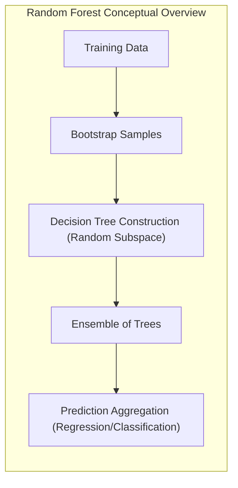
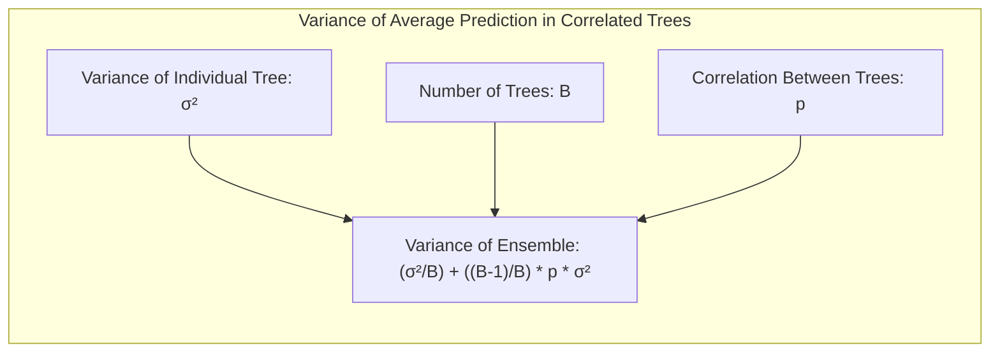
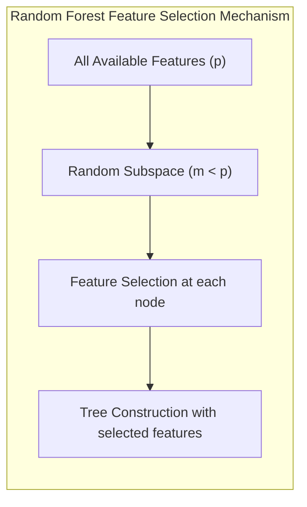
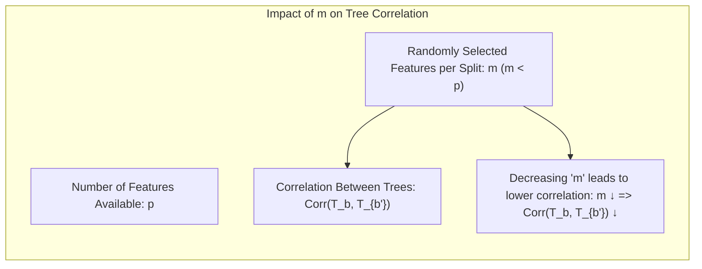
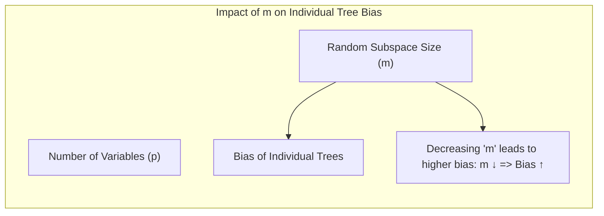
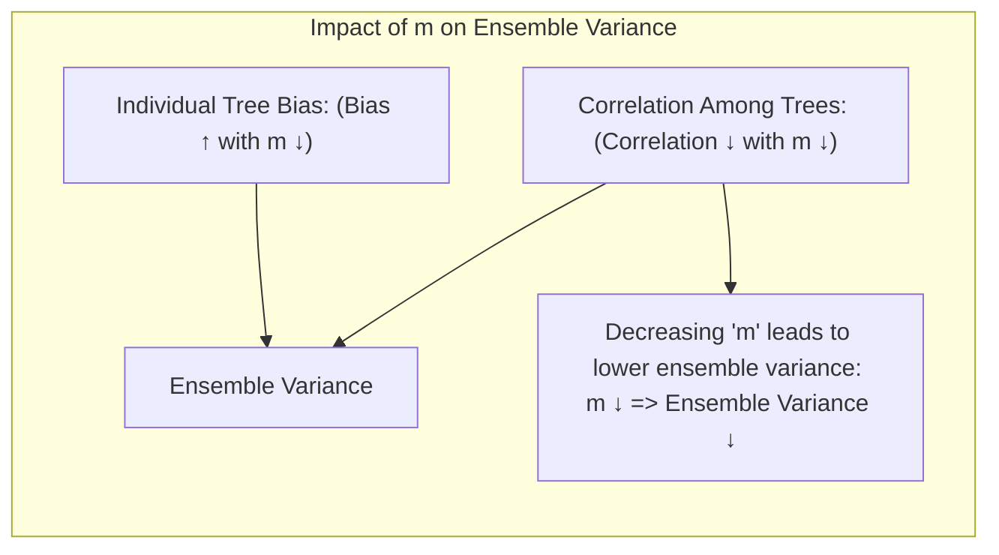

Okay, here's the enhanced version of the text with Mermaid diagrams, focusing on architectural and mathematical relationships as requested:

## Random Forests: A Deep Dive into Ensemble Learning with Random Subspace Selection



### Introdução

O capítulo aborda **Random Forests**, uma técnica de aprendizado de máquina que se destaca pela sua capacidade de construir modelos preditivos robustos e precisos. Esta abordagem, derivada de **bagging**, utiliza a aleatoriedade na seleção de variáveis e amostras de treinamento para criar um conjunto diversificado de árvores de decisão, que então são agregadas para realizar previsões. Random Forests são especialmente eficazes em cenários com grande quantidade de dados e alta dimensionalidade, onde árvores de decisão individuais podem apresentar alta variância e baixa estabilidade [^15.1]. A técnica equilibra simplicidade e eficácia, tornando-se uma escolha popular tanto em problemas de classificação quanto de regressão, com uma implementação disponível em várias bibliotecas de software [^15.1].

### Conceitos Fundamentais

**Conceito 1:** **Bagging (Bootstrap Aggregating)** [^15.1]
O conceito central de **bagging** é reduzir a variância de um modelo através da agregação de múltiplas versões do mesmo modelo. No contexto de árvores de decisão, o bagging envolve o treinamento de diversas árvores em *datasets* gerados por *bootstrap* a partir dos dados de treinamento originais. Cada árvore é treinada em uma amostra *bootstrap*, que é uma amostra aleatória com reposição dos dados de treinamento. Em regressão, a predição final é a média das predições individuais de cada árvore. Em classificação, a predição final é determinada por meio do voto da maioria das classes preditas por cada árvore. Bagging é particularmente eficaz com modelos de alta variância e baixo viés, como árvores de decisão, devido à sua sensibilidade a pequenas mudanças nos dados de treinamento [^15.1].

> 💡 **Exemplo Numérico:** Imagine um dataset de regressão com 100 amostras. No *bagging*, para construir 3 árvores, três datasets de 100 amostras cada seriam criados por *bootstrap*. Amostras dos dados originais podem aparecer mais de uma vez, e outras podem não aparecer em cada dataset de *bootstrap*. Se para um dado ponto de entrada x, as predições das 3 árvores fossem 12.5, 13.1 e 11.8, a predição final do modelo *bagging* seria a média: (12.5 + 13.1 + 11.8) / 3 = 12.47. Em um problema de classificação com 2 classes (0 e 1), se as predições de 5 árvores fossem [0, 1, 1, 0, 1], a predição final seria a classe 1, pois é a classe mais votada.

**Lemma 1:** *A esperança da média de B árvores i.i.d. é igual à esperança de uma única árvore*
Dado que cada árvore gerada em *bagging* é treinada em uma amostra *bootstrap* diferente, e se as árvores forem consideradas independentes e identicamente distribuídas (i.i.d.), a esperança da média das predições de *B* árvores é igual à esperança da predição de uma única árvore. Formalmente, se $T_b(x)$ representa a predição da $b$-ésima árvore para um ponto $x$, e $T(x)$ é a predição de uma única árvore, então:
$$E\left[\frac{1}{B}\sum_{b=1}^{B} T_b(x)\right] = E[T(x)]$$
Essa propriedade demonstra que *bagging* reduz a variância sem aumentar o viés [^15.2].  $\blacksquare$
```mermaid
graph LR
    subgraph "Bagging: Expectation of Average Prediction"
        direction TB
        A["Individual Tree Prediction: T_b(x)"]
        B["Average Prediction: (1/B) * Σ T_b(x)"]
        C["Expectation of Average: E[(1/B) * Σ T_b(x)]"]
        D["Expectation of Single Tree: E[T(x)]"]
        C -->| "i.i.d. assumption" | D
    end
```
**Conceito 2:** **Random Forests**
Random Forests aprimoram o *bagging* ao introduzir uma camada adicional de aleatoriedade no processo de construção de cada árvore de decisão. Além do *bootstrap* de amostras de treinamento, o Random Forest seleciona um subconjunto aleatório de *m* variáveis (preditoras) como candidatos para divisão em cada nó da árvore. A ideia central é **decorrelacionar as árvores** no *ensemble*, de forma que os erros cometidos por cada árvore sejam menos correlacionados, resultando numa redução da variância da predição agregada. O número de variáveis *m* é um parâmetro ajustável; valores típicos são $m=\sqrt{p}$ para classificação e $m=p/3$ para regressão, onde *p* é o número total de variáveis [^15.2].

> 💡 **Exemplo Numérico:** Suponha que tenhamos um conjunto de dados com 9 variáveis (p=9). Em um problema de classificação, um valor comum para *m* seria $m = \sqrt{9} = 3$. Em cada nó de cada árvore, apenas 3 dessas 9 variáveis seriam consideradas para encontrar a melhor divisão. Em um problema de regressão, o valor de *m* poderia ser $m = 9 / 3 = 3$. Este processo é repetido para cada nó e cada árvore, fazendo com que diferentes árvores usem diferentes subconjuntos de variáveis.

**Corolário 1:** *A variância da média de árvores com correlação positiva limitada por um fator proporcional à correlação.*
A variância da média de B árvores com correlação positiva $p$ é dada por:
$$ \frac{\sigma^2}{B} + \frac{B-1}{B}p\sigma^2 $$
Onde $\sigma^2$ é a variância de cada árvore.  Quando B aumenta, o primeiro termo da expressão desaparece, mas o segundo termo, que contém a correlação, permanece, estabelecendo um limite inferior na variância do ensemble. Random Forests busca reduzir a correlação *p* para limitar essa variância [^15.2].  $\blacksquare$


> 💡 **Exemplo Numérico:** Se a variância de uma única árvore ($\sigma^2$) fosse 10, e tivéssemos 10 árvores (B=10) com uma correlação média de 0.2 entre elas (p=0.2). A variância da predição média do ensemble seria:
>
> $\text{Variância} = \frac{10}{10} + \frac{10 - 1}{10} * 0.2 * 10 = 1 + 9 * 0.2 = 2.8$.
>
> Se as árvores fossem não correlacionadas (p=0), a variância do ensemble seria apenas 1. Isso demonstra como a correlação entre as árvores afeta a variância final do modelo, e porque é importante reduzir essa correlação.

**Conceito 3:** **Seleção Aleatória de Variáveis ($m < p$)**
A seleção aleatória de variáveis em cada nó da árvore é um componente crítico do Random Forest. Em cada divisão, em vez de avaliar todas as variáveis disponíveis (preditores), apenas um subconjunto aleatório *m* é considerado. O objetivo principal dessa estratégia é descorrelacionar as árvores no *ensemble*.  Ao limitar as variáveis consideradas, o processo de crescimento de árvores se torna mais diversificado e os modelos tornam-se menos sensíveis a variáveis altamente correlacionadas. Ao reduzir *m*, as árvores individuais tendem a ser mais fracas e com um viés ligeiramente maior, mas a média dessas árvores resulta em um modelo com menor variância. Em contraste com *boosting*, onde as árvores são construídas sequencialmente, as árvores em random forests são construídas independentemente, o que torna o processo de treinamento mais fácil de paralelizar [^15.1].

> ⚠️ **Nota Importante**: Random Forests combinam a ideia de *bagging* com a seleção aleatória de variáveis para construir um modelo de alta performance e robusto. [^15.2]
> ❗ **Ponto de Atenção**: Reduzir o parâmetro *m* aumenta a decorrelação das árvores no *ensemble*, mas também pode reduzir a capacidade preditiva individual de cada árvore. [^15.2]
> ✔️ **Destaque**: A capacidade de selecionar um subconjunto de variáveis aleatoriamente em cada divisão é um mecanismo crucial para reduzir a correlação entre as árvores e melhorar a estabilidade da predição. [^15.2]

### Regressão Linear e Mínimos Quadrados para Classificação

```mermaid
graph LR
    subgraph "Relationship Between Linear Regression and Random Forest"
        direction TB
        A["Linear Regression with Indicator Vectors (for Classification)"]
        B["Random Forest (Tree-Based Partitions)"]
        A -->| "Different Approaches" | B
        subgraph "Linear Regression"
            C["Minimize ||y - Xβ||² (Least Squares)"]
            A --> C
        end
        subgraph "Random Forest"
           D["Impurity-Based Splits (Gini, Entropy)"]
           B --> D
        end
    end
```

O conceito central de regressão linear e mínimos quadrados (LS) não é diretamente aplicado no coração do Random Forest para classificação, embora ambos compartilhem conceitos fundamentais. A regressão de indicadores, no entanto, é uma forma possível de usar regressão linear para classificação, onde cada classe é representada por um vetor indicador binário. O objetivo é criar uma função de predição linear para cada classe, e a classe com a maior predição é selecionada como a classe predita. No entanto, Random Forests não usam a regressão linear ou os mínimos quadrados diretamente na sua forma clássica. Em vez disso, eles constroem árvores de decisão individuais com base em critérios de impureza (como o índice de Gini ou entropia) para determinar como as variáveis devem dividir o espaço de atributos. As árvores são projetadas para particionar o espaço em regiões mais homogêneas em termos de classe.

A escolha de um modelo de classificação é crucial e pode ser motivada por diferentes perspectivas. Por exemplo, a regressão de indicadores para classificação, por meio da estimação de coeficientes via mínimos quadrados, é uma forma linear de produzir predições de classe. No entanto, essa abordagem linear pode ser limitada em cenários onde as relações entre as variáveis e as classes não são lineares. A escolha entre métodos como regressão logística ou LDA, por outro lado, é baseada em considerações teóricas e suposições sobre os dados, como a distribuição das classes e a igualdade de covariâncias. É importante notar que o Random Forest não se enquadra nestes métodos lineares, uma vez que utiliza árvores de decisão, que são capazes de representar modelos não lineares e complexos [^15.2].

**Lemma 2**: *A média da predição das árvores é uma aproximação da esperança da predição.*
No contexto de Random Forest, a média das predições de todas as árvores, $\hat{f}_{rf}(x)$, converge para a esperança da predição de uma única árvore, $E_{Z, \Theta}[T(x; \Theta(Z))]$, conforme o número de árvores, $B$, tende ao infinito. Esta convergência é garantida devido ao fato de que as árvores são i.i.d. e independentes umas das outras, dado $Z$ e a aleatoriedade no sorteio de variáveis. Formalmente, temos:
$$ \lim_{B \to \infty} \frac{1}{B} \sum_{b=1}^B T_b(x) = E_{Z, \Theta}[T(x; \Theta(Z))] $$
onde $Z$ denota o conjunto de dados de treinamento, e $\Theta$ os parâmetros da árvore [^15.4.1]. $\blacksquare$

```mermaid
graph LR
    subgraph "Convergence of Random Forest Prediction"
        direction TB
        A["Average Prediction of Trees: (1/B) * Σ T_b(x)"]
        B["Number of Trees: B -> ∞"]
        C["Expectation of Single Tree: E_{Z,Θ}[T(x; Θ(Z))]"]
        A -->| "Limit as B approaches infinity" | B
        B --> C
     end
```

**Corolário 2**: *A variância da predição do Random Forest é menor do que a variância de uma única árvore.*
Com o aumento do número de árvores no Random Forest, a variância da média das predições, $\operatorname{Var}[\hat{f}_{rf}(x)]$, diminui, pois a média de um conjunto de variáveis aleatórias independentes e identicamente distribuídas tem uma variância menor do que a variância de uma única variável. Esta redução da variância é um dos principais benefícios do Random Forest [^15.2]. $\blacksquare$

“No entanto, há situações em que a regressão linear, de acordo com [^15.2], é suficiente e até mesmo vantajosa quando o objetivo principal é modelar relações lineares entre as variáveis, o que não é o foco principal dos random forests.”  É importante ressaltar que a regressão linear não é usada diretamente dentro da estrutura do algoritmo do Random Forest, mas a ideia de criar funções de predição e calcular seus resíduos está relacionada, embora de forma indireta.  Random Forests utilizam divisões baseadas em impureza nas árvores, que são mecanismos distintos da regressão linear.

### Métodos de Seleção de Variáveis e Regularização em Classificação



Random Forests, por sua própria natureza, incorporam um método intrínseco de seleção de variáveis. Ao selecionar um subconjunto de *m* variáveis aleatoriamente em cada nó de cada árvore, o Random Forest efetivamente reduz o conjunto de variáveis candidatas a serem consideradas para dividir o nó, sem exigir uma abordagem de regularização adicional para seleção de variáveis, como penalizações L1 ou L2. Esta seleção aleatória de variáveis atua como uma forma de regularização, incentivando que cada árvore seja construída com base em um subconjunto diversificado de variáveis, evitando que árvores individuais se tornem muito complexas e propensas a *overfitting*. A importância de cada variável é então avaliada usando medidas como a redução da impureza (índice Gini) ou a variação na predição causada pela permutação aleatória dos valores da variável (usando amostras OOB). Essas medidas podem ser usadas para classificar as variáveis de acordo com sua relevância preditiva [^15.3.2].

> 💡 **Exemplo Numérico:** Considere um problema de classificação com 10 variáveis. Em um dado nó, o algoritmo seleciona aleatoriamente 3 variáveis (m=3). A árvore pode escolher a variável 'idade' para a primeira divisão e, em nós seguintes, selecionar um subconjunto diferente de variáveis, como 'renda' e 'educação'. Ao final do treinamento, uma medida de importância de variável pode indicar que a variável 'idade' foi usada em muitas divisões e resultou em uma grande redução de impureza (por exemplo, índice Gini), sendo portanto mais importante para o modelo. Além disso, se ao embaralhar aleatoriamente os valores da variável "renda" no conjunto de dados OOB, as previsões do modelo se tornarem significativamente piores, isso indica que a variável é importante para o modelo.

Em contraste com métodos como a regressão logística, onde a regularização L1 ou L2 são aplicadas diretamente aos coeficientes do modelo para realizar a seleção de variáveis e evitar o *overfitting*, os random forests empregam a seleção aleatória de variáveis e o mecanismo de *bagging* para evitar o *overfitting* e melhorar a robustez das previsões. A regularização, no contexto de random forests, se refere mais a um mecanismo de controle da complexidade do modelo através da redução do parâmetro *m* e da profundidade máxima das árvores. O random forest também pode usar técnicas de regularização (para o problema de overfitting) como o controle da profundidade máxima das árvores e o uso de amostras OOB.

**Lemma 3:** *A seleção aleatória de variáveis reduz a correlação entre as árvores.*
Dado um conjunto de dados com p variáveis e um parâmetro m (onde m < p), ao selecionar m variáveis aleatoriamente em cada divisão, a probabilidade de árvores independentes escolherem exatamente as mesmas variáveis para as divisões diminui, resultando numa redução na correlação entre as árvores. A correlação entre as árvores é crucial porque a variância de um ensemble é diretamente afetada pela correlação entre os modelos. Ao reduzir a correlação, Random Forests consegue reduzir a variância do modelo final [^15.2].
$$ Corr(T_b, T_{b'}) \downarrow \text{ com } m \downarrow $$ $\blacksquare$


**Prova do Lemma 3:**
Considere duas árvores, $T_b$ e $T_{b'}$, cada uma construída utilizando um subconjunto de *m* variáveis selecionadas aleatoriamente a partir de um total de *p* variáveis. A probabilidade de $T_b$ e $T_{b'}$ escolherem exatamente as mesmas *m* variáveis para a primeira divisão é $\frac{\binom{m}{m}}{\binom{p}{m}} = \frac{1}{\binom{p}{m}}$. Se $m$ é pequeno em relação a $p$, essa probabilidade é baixa. Consequentemente, as duas árvores terão diferentes subconjuntos de variáveis para trabalhar, o que induz a uma decorrelação entre elas. As divisões subsequentes tendem a reforçar a diferença, pois a seleção é feita de maneira independente em cada nó, garantindo que as árvores sigam caminhos distintos na construção, o que reduz a sua correlação.  $\blacksquare$

**Corolário 3:** *Reduzir a correlação entre as árvores leva à redução da variância do ensemble*
A variância da predição média do ensemble de árvores é dada por:
$$ Var[\frac{1}{B}\sum_{b=1}^B T_b(x)] = \frac{1}{B}Var[T(x)] + \frac{B-1}{B}Cov(T_b(x), T_{b'}(x)) $$
Se as árvores fossem completamente independentes, o termo de covariância seria zero, e a variância do ensemble seria reduzida em um fator de B, em relação a uma única árvore. Como a correlação entre as árvores (induzida pela similaridade nos dados de treinamento) não é nula, é necessário reduzir o termo de covariância para obter a maior redução possível na variância, e a seleção aleatória de variáveis é crucial para tal efeito [^15.2]. $\blacksquare$

> ⚠️ **Ponto Crucial**: A seleção aleatória de variáveis contribui para a diversidade das árvores no *ensemble*, reduzindo a correlação e a variância da predição final. [^15.2]

### Separating Hyperplanes e Perceptrons
```mermaid
graph LR
subgraph "Separating Hyperplanes vs Random Forests"
    direction TB
    A["Linear Models (LDA, Perceptron)"]
    B["Random Forests"]
    A -->| "Separating Hyperplanes (Explicit)" | C["Explicit Hyperplanes for Class Separation"]
    B -->| "Tree-Based Partitions (Implicit Hyperplanes)" | D["Implicit Hyperplanes via Hierarchical Partitions"]
  subgraph "Perceptron Details"
    E["Iterative Adjustment of Hyperplane Weights"]
    A --> E
   end
   subgraph "Random Forest Details"
    F["Impurity-Based Splits"]
        G["Combination of Predictions"]
       B --> F
     F --> G
    end
 end
```

O conceito de **separating hyperplanes** está intimamente relacionado com modelos de classificação linear, como a LDA (Linear Discriminant Analysis) e o Perceptron, mas difere fundamentalmente da abordagem de Random Forests.  Enquanto a LDA busca encontrar um hiperplano ótimo que separe as classes de forma linear, maximizando a separação entre as médias das classes e minimizando a variância dentro de cada classe, e o Perceptron ajusta um hiperplano com base em erros de classificação, o Random Forest utiliza árvores de decisão para dividir o espaço de características em regiões, com o objetivo de maximizar a homogeneidade das classes em cada região, utilizando uma abordagem não linear. Random Forests não formam hiperplanos explicitamente, mas podem aproximá-los por meio de particionamento hierárquico do espaço de atributos.

O Perceptron, por outro lado, é um algoritmo de aprendizagem linear que visa encontrar um hiperplano que separe as classes de forma linear, e que aprende por meio de iterações ajustando os pesos do hiperplano com base nos erros de classificação encontrados durante as iterações de treinamento. Em contraste, Random Forests não iteram sobre os dados de treinamento para ajustar um hiperplano, mas em vez disso constroem um conjunto de árvores que operam de forma independente e, em seguida, combinam as suas previsões. Os Random Forests não fazem suposições sobre a forma das fronteiras de decisão, mas aproximam essas fronteiras utilizando uma série de partições de acordo com as variáveis mais informativas a cada nó da árvore [^15.3.2].

Random Forests, por meio da construção de árvores de decisão, podem criar partições do espaço de atributos que se assemelham a hiperplanos locais. As árvores individuais tentam dividir o espaço de entrada de modo a criar regiões que contenham amostras de uma única classe. Os nós terminais da árvore representam regiões no espaço de atributos, e a predição de cada árvore é baseada na classe majoritária nessas regiões terminais. Ao combinar as predições de várias árvores, o Random Forest cria uma fronteira de decisão mais complexa que não é necessariamente linear [^15.3.2].

### Pergunta Teórica Avançada: Como o parâmetro *m* em Random Forests afeta o viés e a variância do modelo?

**Resposta:**

O parâmetro *m* (o número de variáveis selecionadas aleatoriamente para cada divisão) em Random Forests desempenha um papel crucial na determinação do equilíbrio entre viés e variância do modelo. Em geral, diminuir o valor de *m* aumenta a variância das árvores individuais, mas diminui a correlação entre elas. Por outro lado, aumentar *m* leva a árvores individuais mais precisas (e menos variadas), mas aumenta a correlação entre elas.

**Lemma 4:** *Reduzir m aumenta o viés de cada árvore individual.*
Quando m é pequeno, as árvores são forçadas a usar um subconjunto menor de variáveis em cada divisão, o que limita sua capacidade de aprender as relações complexas nos dados. Isso resulta em um viés ligeiramente maior para cada árvore individual [^15.2]. $\blacksquare$


**Prova do Lemma 4:**
Árvores de decisão, por definição, selecionam a melhor divisão dentre as variáveis disponíveis a cada nó. Ao limitar o número de variáveis por meio do parâmetro *m*, as árvores são impedidas de encontrar a divisão que otimiza a redução de impureza do nó. Esta restrição na seleção da melhor divisão implica que as árvores tenderão a ser mais simples e potencialmente a apresentar um maior erro de treinamento (isto é, um maior viés). Ao diminuir *m*, cada árvore fica mais restrita na escolha da melhor divisão, o que leva a uma árvore que talvez não capture toda a complexidade dos dados [^15.2]. $\blacksquare$

> 💡 **Exemplo Numérico:** Imagine um dataset com 10 variáveis relevantes para um problema de regressão. Se usarmos m=10 (todas as variáveis), as árvores tendem a se ajustar bem aos dados, com menor viés, mas com maior risco de *overfitting*. Se reduzirmos *m* para 2, cada árvore individual terá um viés maior (pois só usa 2 variáveis), mas as árvores serão mais diferentes entre si (menor correlação). A média dessas árvores (com viés maior e menor correlação) pode levar a uma predição final com um erro menor, pois a redução na variância é maior que o aumento no viés.

**Corolário 4:** *Reduzir *m* diminui a variância do ensemble.*
Embora árvores individuais fiquem mais enviesadas ao reduzir m, a decorrelação entre as árvores aumenta, o que leva à diminuição da variância do ensemble de árvores. Essa redução na variância da média das árvores é o principal objetivo do Random Forest. Ao agregar árvores mais enviesadas, mas decorrelacionadas, o Random Forest consegue um modelo final que é robusto a pequenas mudanças nos dados de treinamento e tem uma variância menor [^15.2].  $\blacksquare$


> ⚠️ **Ponto Crucial**: A escolha adequada de *m* é crucial para otimizar o desempenho do Random Forest, pois um valor muito baixo pode aumentar o viés e um valor muito alto pode aumentar a variância do modelo. O valor ideal de *m* deve ser definido com base em validação cruzada.

### Conclusão

Random Forests são um método de *ensemble* poderoso e versátil, que combina *bagging* com seleção aleatória de variáveis para gerar modelos robustos e eficazes para classificação e regressão. A seleção aleatória de variáveis em cada nó é crucial para descorrelacionar as árvores no *ensemble*, resultando numa redução significativa da variância. O parâmetro *m* influencia o equilíbrio entre viés e variância do modelo, e a sua escolha adequada é fundamental para o bom desempenho do Random Forest. Em geral, random forests são bem adequados a problemas com dados de alta dimensionalidade e podem alcançar um desempenho superior a modelos de árvore única, ao mesmo tempo em que são menos propensos a *overfitting*.  O mecanismo *Out-of-bag* (OOB) permite estimar o erro de generalização sem a necessidade de validação cruzada.

### Footnotes

[^15.1]: *“Bagging or bootstrap aggregation (section 8.7) is a technique for reducing the variance of an estimated prediction function. Bagging seems to work especially well for high-variance, low-bias procedures, such as trees.”* *(Trecho de "The Elements of Statistical Learning", página 587)*
[^15.2]: *“The essential idea in bagging (Section 8.7) is to average many noisy but approximately unbiased models, and hence reduce the variance. Trees are ideal candidates for bagging, since they can capture complex interaction structures in the data, and if grown sufficiently deep, have relatively low bias.”* *(Trecho de "The Elements of Statistical Learning", página 587-588)*
[^15.3.2]: *“Variable importance plots can be constructed for random forests in exactly the same way as they were for gradient-boosted models (Section 10.13). At each split in each tree, the improvement in the split-criterion is the importance measure attributed to the splitting variable, and is accumulated over all the trees in the forest separately for each variable.”* *(Trecho de "The Elements of Statistical Learning", página 593)*
[^15.4.1]: *“The limiting form (B → ∞) of the random forest regression estimator is frf(x) = EezT(x; Θ(Z)), where we have made explicit the dependence on the training data Z. Here we consider estimation at a single target point x.”* *(Trecho de "The Elements of Statistical Learning", página 597)*
