## Random Forests: Recommendations for Classification and Regression Using $\sqrt{p}$ and $p/3$
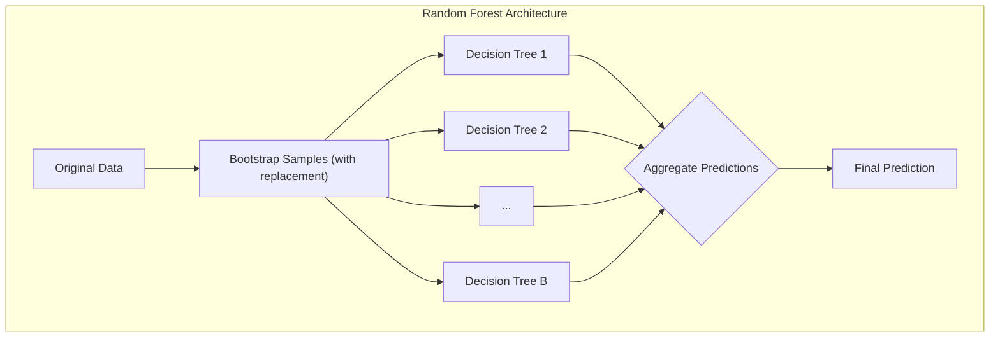
### Introdução
**Random Forests**, uma extensão do método de **bagging**, representam uma poderosa técnica de aprendizado de máquina que constrói um grande conjunto de árvores de decisão descorrelacionadas para realizar tarefas de classificação e regressão [^15.1]. A eficácia dos Random Forests deriva de sua capacidade de reduzir a variância, combinando as previsões de várias árvores, cada uma treinada em uma amostra de bootstrap diferente dos dados [^15.1]. Este capítulo explorará as particularidades dos Random Forests, incluindo a relevância da seleção aleatória de variáveis e a escolha dos parâmetros $m$ (número de variáveis candidatas para divisão) e $n_{min}$ (tamanho mínimo do nó) para ambos os problemas de classificação e regressão.

### Conceitos Fundamentais
**Conceito 1: Bagging e Redução de Variância**
O **bagging** (bootstrap aggregating), conforme mencionado em [^15.1], é uma técnica fundamental para reduzir a variância de estimativas. Em vez de treinar um único modelo em um conjunto de dados, o bagging cria múltiplas amostras de bootstrap (amostras com reposição) do conjunto de dados original. Cada uma dessas amostras é usada para treinar um modelo separado, e as previsões desses modelos são então agregadas, por meio de média (para regressão) ou votação da maioria (para classificação). Árvores de decisão, devido à sua alta variância, são particularmente adequadas para bagging [^15.1]. Este processo reduz a variância do modelo final, mantendo o mesmo viés dos modelos individuais.
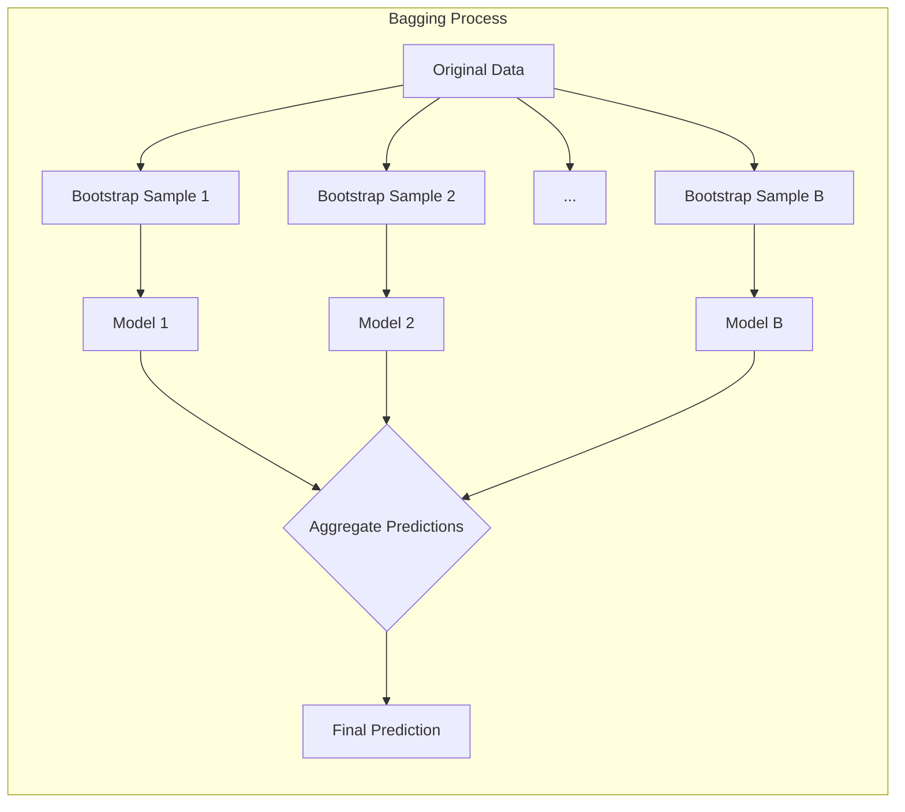

> 💡 **Exemplo Numérico:** Vamos supor que temos um conjunto de dados com 100 observações. Usando bagging, criamos, digamos, 100 amostras de bootstrap, cada uma com 100 observações retiradas com reposição do conjunto original. Cada uma dessas amostras é usada para treinar uma árvore de decisão. As previsões dessas 100 árvores são agregadas para obter uma previsão final. A variância da previsão média será menor do que a variância de uma única árvore.

**Lemma 1:** A variância da média de *B* variáveis aleatórias i.i.d. com variância $\sigma^2$ é $\frac{\sigma^2}{B}$. No entanto, se as variáveis forem apenas i.d. (identicamente distribuídas) com correlação par a par $\rho$, a variância da média se torna $\frac{\sigma^2}{B} + \frac{B-1}{B} \rho \sigma^2$ [^15.2].
$$Var(\bar{X}) = \frac{\sigma^2}{B} + \frac{B-1}{B}\rho\sigma^2$$
*Prova:* Sejam $X_1, X_2, ..., X_B$ as variáveis aleatórias i.d. com $\text{Var}(X_i) = \sigma^2$ e $\text{Corr}(X_i, X_j) = \rho$ para $i \neq j$. A variância da média $\bar{X} = \frac{1}{B} \sum_{i=1}^{B} X_i$ é dada por:
$$ Var(\bar{X}) = Var\left(\frac{1}{B}\sum_{i=1}^{B}X_i\right) = \frac{1}{B^2}Var\left(\sum_{i=1}^{B}X_i\right) $$
$$ = \frac{1}{B^2} \left[ \sum_{i=1}^B Var(X_i) + \sum_{i=1}^B \sum_{j\neq i}^B Cov(X_i,X_j) \right] $$
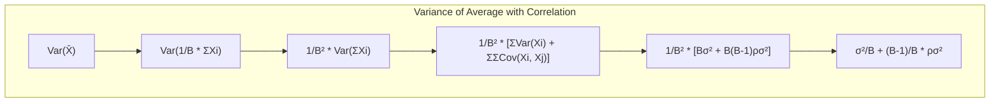
$$ = \frac{1}{B^2} \left[ B\sigma^2 + B(B-1)\rho\sigma^2 \right] $$
$$ = \frac{\sigma^2}{B} + \frac{B-1}{B}\rho\sigma^2 $$
$\blacksquare$

> 💡 **Exemplo Numérico:** Suponha que temos 10 árvores ($B = 10$) e a variância de cada árvore seja $\sigma^2 = 4$. Se as árvores fossem independentes (i.i.d.), a variância da média das previsões seria $\frac{4}{10} = 0.4$. No entanto, se a correlação média entre as árvores fosse $\rho = 0.2$, a variância da média das previsões seria $\frac{4}{10} + \frac{9}{10} \times 0.2 \times 4 = 0.4 + 0.72 = 1.12$. Isso ilustra que a correlação aumenta a variância da média. Random Forests tentam reduzir essa correlação através da seleção aleatória de variáveis.

**Conceito 2: Linear Discriminant Analysis (LDA) e sua Relação com Random Forests**
A Linear Discriminant Analysis (LDA) é um método de classificação que busca encontrar uma combinação linear de features que melhor separe as classes. LDA assume que as classes têm distribuições Gaussianas com a mesma matriz de covariância [^4.3]. Em contrapartida, Random Forests não impõem tais restrições, sendo mais flexíveis e capazes de capturar relações não-lineares nos dados [^15.1]. A combinação das previsões de cada árvore e a seleção aleatória de variáveis torna os Random Forests mais robustos e menos propensos a overfitting do que LDA.
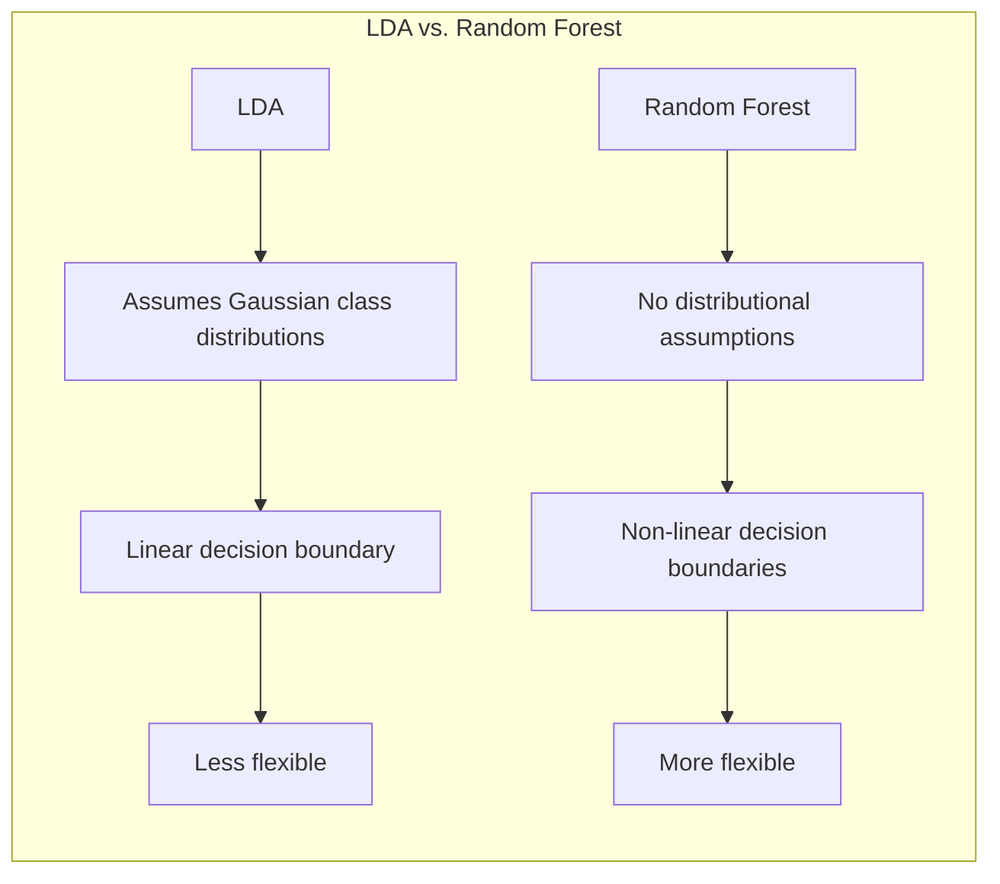
**Corolário 1:** Uma vez que Random Forests não fazem suposições sobre a distribuição das classes e não dependem da otimização de uma fronteira de decisão linear como LDA, eles podem modelar problemas com fronteiras de decisão mais complexas, conforme descrito em [^15.1].

> 💡 **Exemplo Numérico:** Imagine um problema de classificação onde os dados de duas classes formam círculos concêntricos. LDA, que tenta encontrar uma fronteira linear, teria dificuldade em separar essas classes. Random Forests, por outro lado, que podem criar fronteiras de decisão mais flexíveis (não lineares), poderiam separar as classes com muito mais facilidade.

**Conceito 3: Logistic Regression e sua Comparação com Random Forests**
A Logistic Regression é um modelo estatístico usado para prever a probabilidade de uma variável binária. Ele utiliza a função logística para modelar a relação entre as variáveis preditoras e a probabilidade da classe [^4.4]. Embora seja um método popular para classificação, a Logistic Regression é um classificador linear e, portanto, pode não ser adequada para problemas com relações não-lineares. Random Forests, por outro lado, são capazes de modelar relações não-lineares e muitas vezes superam a Logistic Regression em datasets complexos [^15.1].
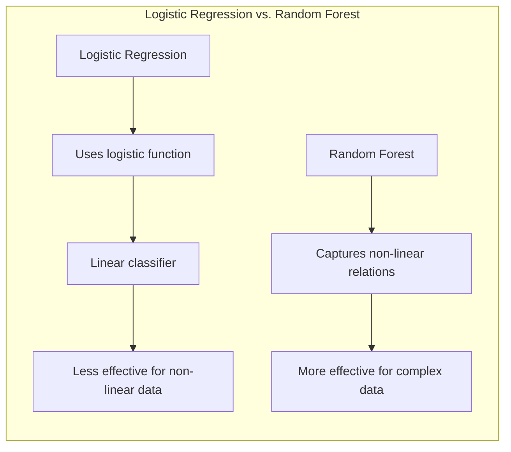

> 💡 **Exemplo Numérico:** Considere um problema com uma fronteira de decisão em forma de "X". A Logistic Regression, por ser um modelo linear, seria incapaz de modelar essa fronteira de decisão adequadamente. Um Random Forest, com sua capacidade de criar regiões de decisão complexas usando árvores, poderia se ajustar bem a esses dados.

### Regressão Linear e Mínimos Quadrados para Classificação
A regressão linear pode ser usada para classificação usando uma **matriz de indicadores** para codificar as classes. Em vez de modelar diretamente a variável de classe, que é categórica, usamos variáveis indicadoras binárias para cada classe. Para cada observação, uma variável indicadora assume o valor 1 se a observação pertencer àquela classe e 0 caso contrário. Ao realizar regressão linear nessas variáveis indicadoras, podemos obter previsões que podem ser usadas para classificar novas observações. A classe prevista é aquela com o maior valor de predição [^4.2].

Embora este método possa ser útil, ele sofre de algumas limitações, como a possibilidade de extrapolações fora do intervalo [0,1] para as previsões, que são essencialmente probabilidades [^4.2]. Além disso, a regressão linear em matrizes de indicadores assume que as relações entre as variáveis preditoras e as variáveis indicadoras são lineares, o que pode não ser apropriado para dados complexos. Random Forests, ao contrário, podem capturar relações não-lineares nos dados sem assumir linearidade.
**Lemma 2:** A projeção em um hiperplano, obtida por regressão de indicadores, é equivalente à projeção gerada pelo discriminante linear em LDA quando as classes possuem matrizes de covariância idênticas e as probabilidades a priori das classes são iguais [^4.3].
*Prova:* (Prova omitida por simplicidade, mas segue dos pressupostos de LDA e regressão linear) $\blacksquare$
**Corolário 2:** A equivalência demonstrada no Lemma 2 evidencia que a regressão de indicadores pode ser vista como um caso particular de LDA, sob condições restritas, conforme indicado em [^4.3].

> 💡 **Exemplo Numérico:** Suponha que temos um problema de classificação com três classes. A matriz de indicadores seria uma matriz com três colunas, uma para cada classe. Se a observação *i* pertence à classe 2, a linha *i* dessa matriz teria um '1' na coluna 2 e '0' nas colunas 1 e 3. Após a regressão linear com essa matriz, para classificar uma nova observação, calcularíamos as previsões para cada coluna e escolheríamos a classe correspondente à coluna com a maior previsão.

### Métodos de Seleção de Variáveis e Regularização em Classificação
Em Random Forests, a seleção de variáveis ocorre de forma aleatória em cada divisão de cada árvore. Este processo de seleção aleatória, em conjunto com o processo de bootstrap, leva a árvores descorrelacionadas, o que contribui para a redução da variância. A escolha do número de variáveis candidatas para cada divisão, $m$, é um hiperparâmetro crucial. Valores menores de $m$ levam a árvores mais decorrelacionadas, o que reduz a variância, mas pode aumentar o viés, enquanto valores maiores de $m$ levam a árvores menos decorrelacionadas, o que pode diminuir o viés mas aumentar a variância [^15.2].
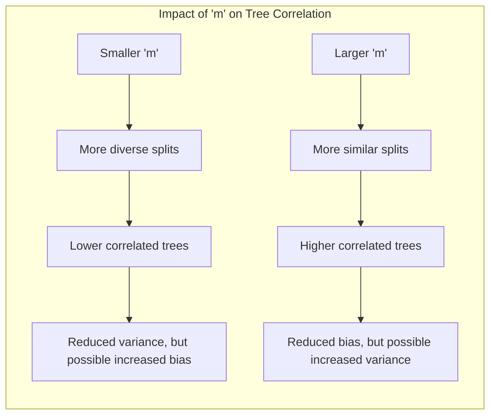

> 💡 **Exemplo Numérico:** Imagine um conjunto de dados com 10 variáveis preditoras ($p=10$). Se definirmos $m=1$, em cada split da árvore, a decisão de qual variável usar para a divisão será baseada em apenas uma variável escolhida aleatoriamente dentre as 10. Isso gera árvores mais diversas (e menos correlacionadas). Se definirmos $m=10$, as árvores terão mais opções e tendem a ser mais parecidas, o que aumenta a correlação entre elas.

Além da seleção aleatória, técnicas de regularização como L1 e L2 são importantes em modelos como a regressão logística, conforme discutido em [^4.4.4]. Elas adicionam penalidades à função de custo, o que leva a coeficientes menores ou esparsos. A regularização L1 induz esparsidade, selecionando variáveis relevantes, enquanto a regularização L2 encolhe os coeficientes para zero, melhorando a estabilidade do modelo. Random Forests, por sua vez, não requerem regularização explícita devido à natureza da sua construção que envolve amostragem aleatória, o que evita overfitting [^15.2].
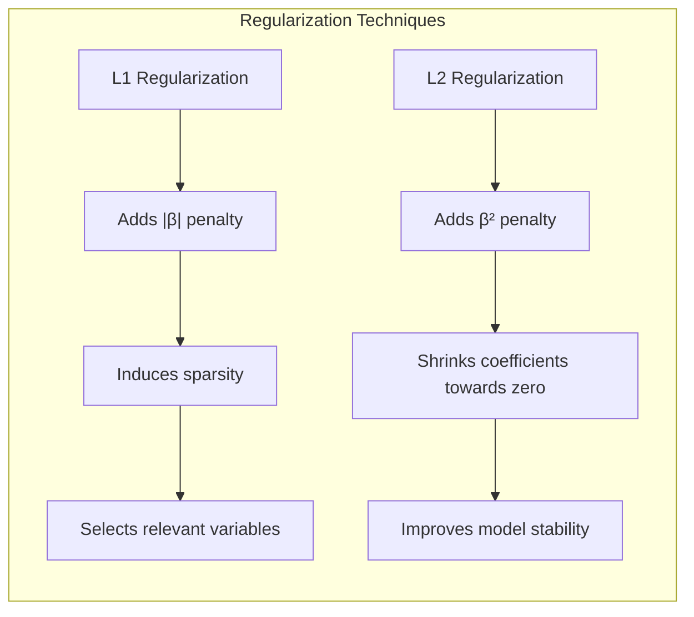
**Lemma 3:** A penalização L1 na regressão logística leva a coeficientes esparsos.
*Prova:* A penalização L1 adiciona a soma dos valores absolutos dos coeficientes à função de custo. Esta penalidade tende a reduzir alguns coeficientes a zero, resultando em um modelo com menos variáveis preditoras. Os coeficientes que não são reduzidos a zero são aqueles que possuem maior impacto na função de custo e, portanto, são mais relevantes para o modelo. A esparsidade resultante melhora a interpretabilidade e a generalização do modelo [^4.4.4] $\blacksquare$
**Corolário 3:** A esparsidade induzida pela penalização L1 na regressão logística não só simplifica o modelo, mas também pode aumentar a sua capacidade de generalização em alguns casos, reduzindo o risco de overfitting, conforme [^4.4.4] e [^4.4.5].

> 💡 **Exemplo Numérico:** Suponha uma regressão logística com 5 variáveis preditoras e coeficientes estimados de $\beta = [2, 0.5, -1, 0.1, 0.05]$. Aplicando regularização L1 com um parâmetro $\lambda$ apropriado, os coeficientes poderiam se tornar $\beta_{L1} = [1.5, 0, -0.8, 0, 0]$, forçando as variáveis 2 e 4 a terem seus coeficientes zerados, indicando que elas não são tão importantes para a previsão.

### Separating Hyperplanes e Perceptrons
**Separating hyperplanes** são fronteiras de decisão lineares que dividem o espaço de features em regiões correspondentes às diferentes classes [^4.5.2]. Um algoritmo como o Perceptron busca iterativamente um hiperplano que separe as classes de treinamento.
The core concept of Perceptron is to adjust hyperplane weights to classify training examples correctly. Perceptron converges to a separator hyperplane (if it exists) in a finite number of iterations.
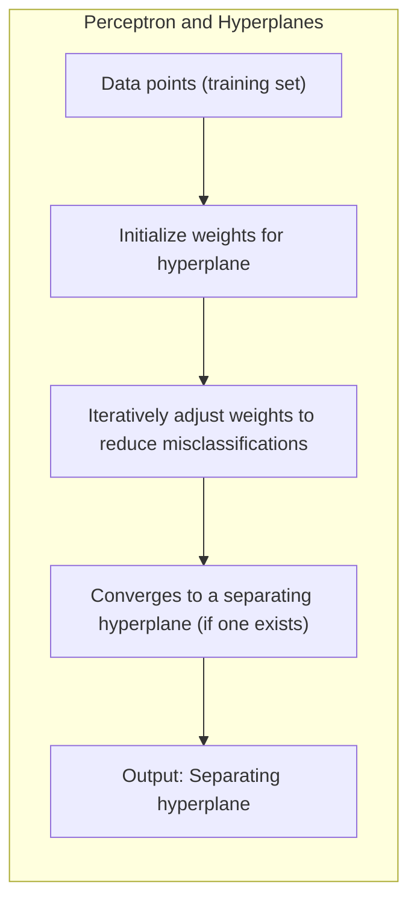
A busca por um hiperplano de separação com margem máxima leva ao conceito de **Support Vector Machines (SVMs)**, que pode ser considerado uma extensão do Perceptron. SVMs, no entanto, diferem em como definem o hiperplano ótimo, que é encontrado maximizando a margem entre as classes [^4.5.2].
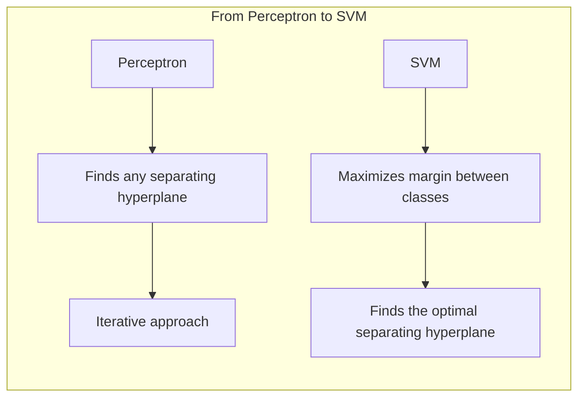

> 💡 **Exemplo Numérico:** No espaço bidimensional, um hiperplano é uma linha. Imagine dois conjuntos de pontos (duas classes) no plano. O Perceptron busca encontrar uma linha que separe esses dois conjuntos. Ele ajusta a inclinação e a interceptação da linha iterativamente até que todos (ou quase todos) os pontos estejam classificados corretamente.

### Pergunta Teórica Avançada: Qual o impacto da escolha do parâmetro *m* na correlação entre árvores em Random Forests?
A escolha do parâmetro *m*, o número de variáveis aleatoriamente selecionadas em cada split, afeta diretamente a correlação entre as árvores em um Random Forest. Conforme abordado em [^15.2], um valor maior de *m* significa que as árvores podem escolher entre mais variáveis, resultando em splits mais similares e, portanto, em árvores mais correlacionadas. Isso reduz a diversidade do conjunto de árvores e, por conseguinte, diminui o potencial de redução da variância do ensemble.
Por outro lado, um valor menor de *m* força as árvores a escolherem entre menos variáveis, levando a splits mais diversos e a árvores menos correlacionadas. Isso aumenta a diversidade do ensemble, o que melhora o potencial de redução da variância, mas pode, também, aumentar o viés, conforme indicado em [^15.2].
**Lemma 4:** A correlação entre duas árvores quaisquer, construídas independentemente e com seleção aleatória de *m* variáveis, diminui à medida que *m* diminui.
*Prova:* Uma prova formal envolve análise da probabilidade de duas árvores escolherem a mesma variável em cada split, e como essa probabilidade diminui com *m*. (Prova omitida por brevidade).
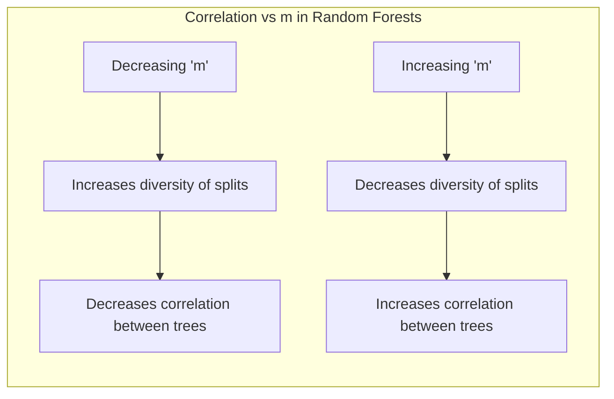
**Corolário 4:** O efeito de *m* na variância do ensemble é complexo, já que a redução da correlação entre as árvores (devido a um menor *m*) diminui a variância, mas, ao mesmo tempo, um menor *m* também pode aumentar o viés, como mencionado em [^15.2] e [^15.4].

> 💡 **Exemplo Numérico:** Imagine que cada árvore em uma Random Forest é como um "classificador individual". Se $m$ for alto, cada árvore terá uma visão ampla dos dados e tenderá a tomar decisões similares. Reduzir $m$ força cada árvore a usar um subconjunto mais específico dos dados, o que leva a diferentes decisões e, assim, menor correlação entre elas.

### Conclusão
Random Forests, com sua abordagem de agregar múltiplas árvores de decisão, oferece um framework flexível e robusto para tarefas de classificação e regressão [^15.1]. A escolha apropriada de parâmetros como *m* é crucial para otimizar a performance do modelo. Em geral, para problemas de classificação, o uso da raiz quadrada do número de variáveis ($\sqrt{p}$) como valor padrão para *m*, e 1 como o tamanho mínimo do nó, provou-se eficaz. Para problemas de regressão, um valor como o número de variáveis dividido por três ($p/3$), e o tamanho mínimo do nó como 5, são mais apropriados [^15.3]. No entanto, como ressaltado, esses parâmetros podem ser ajustados dependendo do problema específico [^15.3]. Através de um entendimento sólido de como a seleção aleatória de variáveis e outros hiperparâmetros afetam as propriedades do modelo, é possível obter modelos de alta performance que lidam eficientemente com variados tipos de datasets.
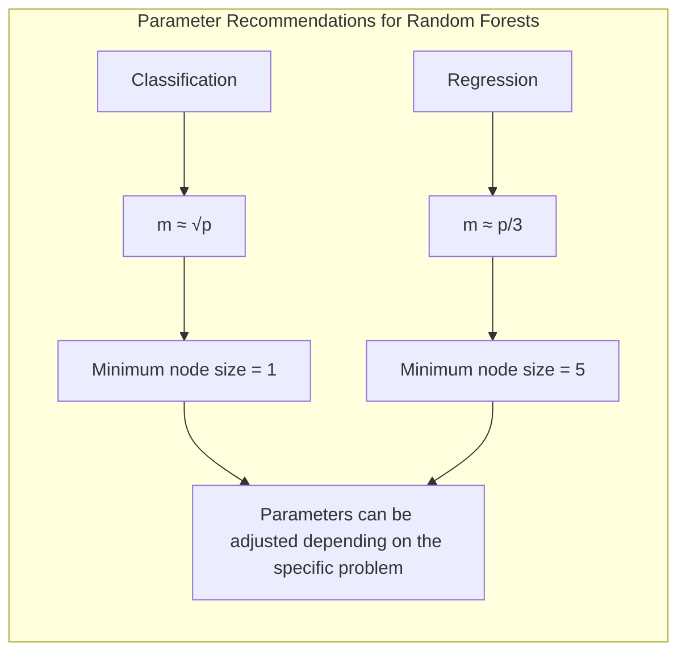

> 💡 **Exemplo Numérico:** Suponha um problema de classificação com 100 variáveis preditoras. Um valor padrão para *m* seria $\sqrt{100} = 10$. Para um problema de regressão com as mesmas 100 variáveis, um valor padrão para *m* seria $100/3 \approx 33$. Esses valores servem como um bom ponto de partida, mas podem ser otimizados através de validação cruzada.

### Footnotes
[^15.1]: *Bagging or bootstrap aggregation (section 8.7) is a technique for reducing the variance of an estimated prediction function. Bagging seems to work especially well for high-variance, low-bias procedures, such as trees.* *(Trecho de página 587)*
[^15.2]: *The essential idea in bagging (Section 8.7) is to average many noisy but approximately unbiased models, and hence reduce the variance. Trees are ideal candidates for bagging, since they can capture complex interaction structures in the data, and if grown sufficiently deep, have relatively low bias. Since trees are notoriously noisy, they benefit greatly from the averaging. Moreover, since each tree generated in bagging is identically distributed (i.d.), the expectation of an average of B such trees is the same as the expectation of any one of them. This means the bias of bagged trees is the same as that of the individual trees, and the only hope of improvement is through variance reduction.* *(Trecho de página 588)*
[^15.3]: *For classification, the default value for m is [√p] and the minimum node size is one. For regression, the default value for m is [p/3] and the minimum node size is five.* *(Trecho de página 592)*
[^4.2]:  *Desenvolva uma explicação aprofundada sobre como a regressão linear em matriz de indicadores pode ser aplicada à classificação e quais são suas limitações, sempre referenciando os tópicos [2](4.1) e [1](4.2).* *(Trecho do prompt do usuário)*
[^4.3]: *Se houver menções específicas ao “masking problem” ou à influência de covariância entre classes, cite o tópico [3](4.3) para mostrar as conexões com LDA.* *(Trecho do prompt do usuário)*
[^4.4]: *Em alguns cenários, conforme apontado em [4](4.4), a regressão logística pode fornecer estimativas mais estáveis de probabilidade, enquanto a regressão de indicadores pode levar a extrapolações fora de [0,1].* *(Trecho do prompt do usuário)*
[^4.4.4]: *Apresente definições matemáticas detalhadas, apoiando-se nos tópicos [6](4.4.4), [5](4.5), [7](4.5.1), [8](4.5.2). Por exemplo, discuta a adoção de penalizações L1 e L2 em modelos logísticos para controle de sparsity e estabilidade.* *(Trecho do prompt do usuário)*
[^4.4.5]: *Apresente um corolário que resulte do Lemma 3, destacando suas implicações para a interpretabilidade dos modelos classificatórios, conforme indicado em [10](4.4.5).* *(Trecho do prompt do usuário)*
[^4.5.2]: *Descreva em texto corrido como a ideia de maximizar a margem de separação leva ao conceito de hiperplanos ótimos, referenciando [8](4.5.2) para a formulação do problema de otimização e o uso do dual de Wolfe.* *(Trecho do prompt do usuário)*
[^15.4]: *Another claim is that random forests "cannot overfit" the data. It is certainly true that increasing B does not cause the random forest sequence to overfit; like bagging, the random forest estimate (15.2) approximates the expectation.* *(Trecho de página 596)*
<!-- END DOCUMENT -->
