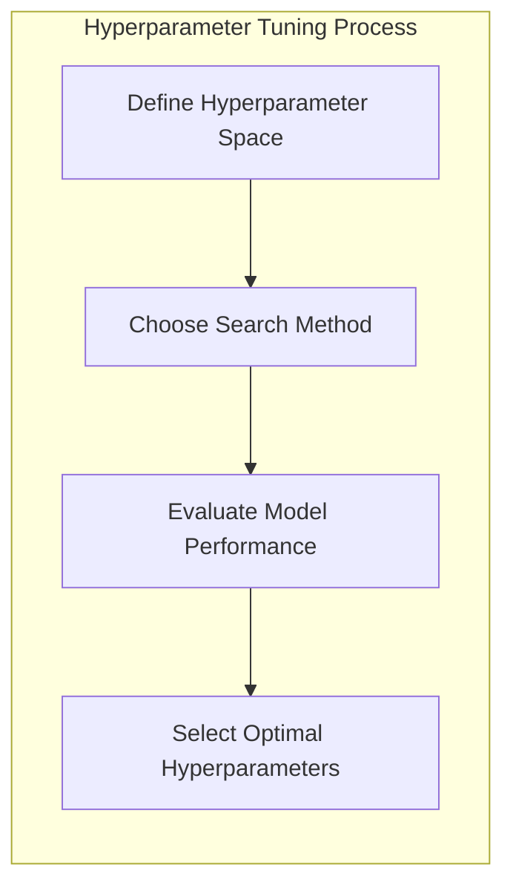
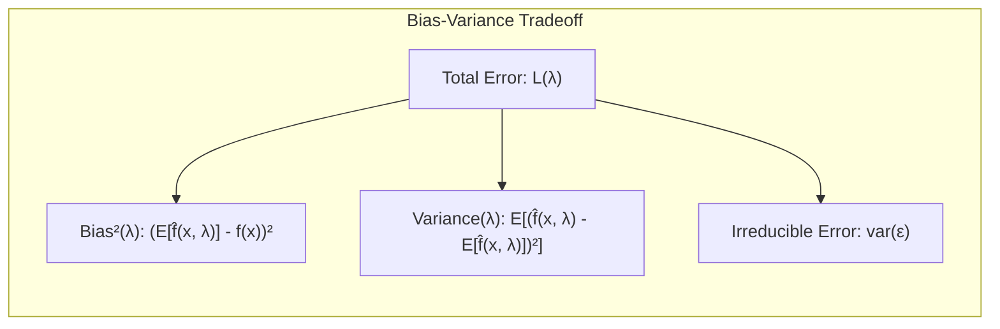
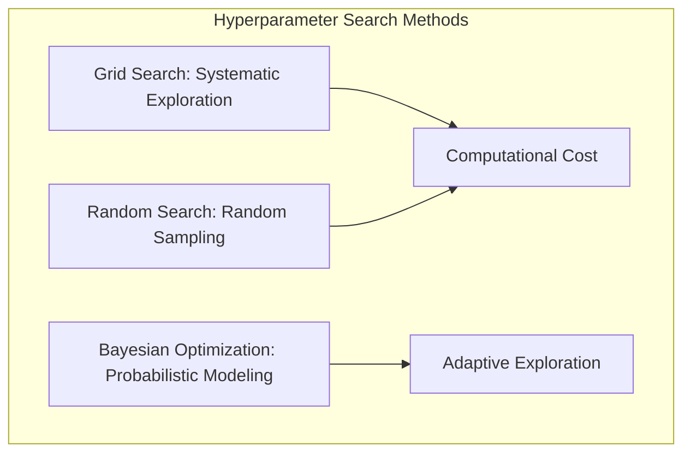
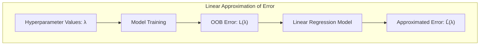
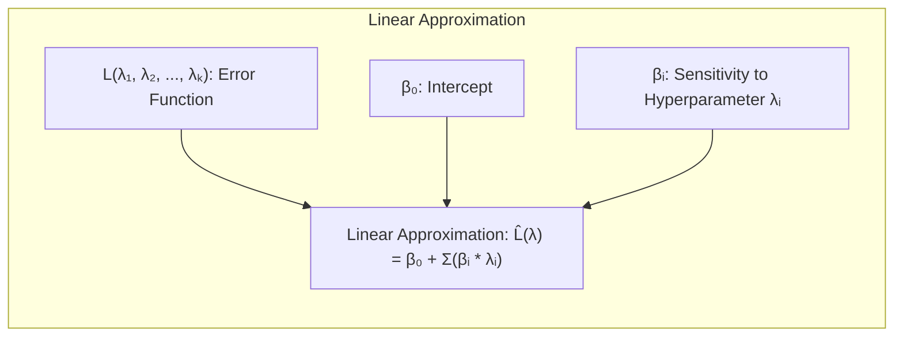
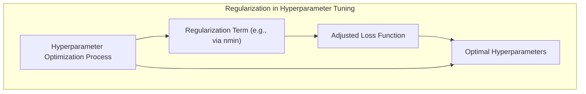
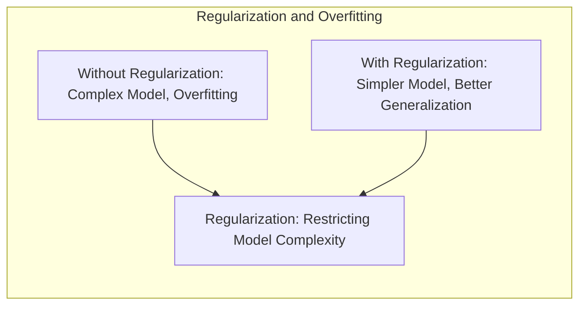
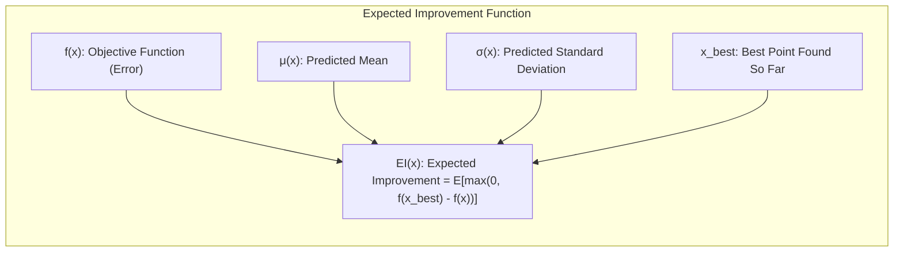

Okay, here's the enhanced text with Mermaid diagrams added as requested, focusing on the mathematical and statistical concepts:

## Hyperparameter Tuning em Modelos de Aprendizado Estatístico Diversos



### Introdução
A otimização de **hiperparâmetros** é uma etapa crucial no desenvolvimento de modelos de aprendizado estatístico, impactando diretamente a performance final e a capacidade de generalização do modelo. Ao contrário dos **parâmetros** do modelo, que são aprendidos durante o processo de treinamento, os hiperparâmetros são valores fixados antes do treinamento e influenciam diretamente a estrutura do modelo e o processo de aprendizado. Este capítulo se aprofundará nas técnicas e nos desafios associados à otimização de hiperparâmetros, com um foco particular nas implicações para modelos como **Random Forests**, explorando conceitos abordados nos tópicos [^15.1], [^15.2], [^15.3], [^15.4], e também em [^15.3.1] e [^15.3.2], que abordam OOB e importância de variáveis.

### Conceitos Fundamentais
**Conceito 1: O Problema de Otimização de Hiperparâmetros**
A otimização de hiperparâmetros é essencialmente um problema de otimização em si, onde o objetivo é encontrar a combinação de valores de hiperparâmetros que resulta na melhor performance do modelo em um conjunto de validação, ou através de técnicas como *cross-validation* [^15.3.1]. A complexidade reside no fato de que o espaço de busca de hiperparâmetros pode ser vasto e que a avaliação da performance do modelo para cada conjunto de hiperparâmetros pode ser computacionalmente custosa. A escolha inadequada de hiperparâmetros pode levar a modelos que sofrem de *underfitting* (alto viés) ou *overfitting* (alta variância), comprometendo sua capacidade de generalização [^15.1], [^15.3.4]. Em **Random Forests**, hiperparâmetros como o número de árvores, o número de variáveis selecionadas aleatoriamente para cada divisão (*m*), a profundidade máxima das árvores (influenciada pelo tamanho mínimo do nó), e o critério de divisão (Gini ou Entropia) são cruciais para alcançar um bom desempenho [^15.2].

**Lemma 1:** *A relação entre complexidade do modelo e o trade-off viés-variância*. Modelos mais complexos, como árvores de decisão mais profundas em Random Forests, podem se ajustar melhor aos dados de treinamento, reduzindo o viés, mas também aumentam a chance de overfitting, elevando a variância e consequentemente o erro em novos dados. Formalmente, podemos enunciar o seguinte lemma:

*   **Lemma 1:** Seja $\mathcal{M}$ a família de modelos com complexidade controlada pelo hiperparâmetro $\lambda$, e seja $L(\lambda)$ o erro esperado do modelo treinado. O erro total pode ser decomposto em viés e variância, e existe uma relação inversa entre eles. Um $\lambda$ ótimo será aquele que minimiza o erro total de generalização. $$L(\lambda) = \text{Bias}^2(\lambda) + \text{Variance}(\lambda) + \text{Irreducible Error}$$



**Prova:** A prova reside na decomposição clássica do erro quadrático médio. Ao aumentar a complexidade ($\lambda$), tipicamente o viés diminui, mas a variância aumenta. O objetivo da otimização de hiperparâmetros é encontrar o ponto de equilíbrio entre viés e variância, que resulta no menor erro de generalização. $\blacksquare$

> 💡 **Exemplo Numérico:**
>
> Considere um modelo de Random Forest onde o hiperparâmetro $\lambda$ controla a profundidade máxima das árvores. Suponha que avaliamos o modelo com três valores de $\lambda$:
>
> *   $\lambda_1 = 2$ (árvores rasas):  Erro de treinamento = 0.3, Erro de validação = 0.5, Bias² = 0.2, Variance = 0.3
> *   $\lambda_2 = 5$ (profundidade moderada): Erro de treinamento = 0.1, Erro de validação = 0.2, Bias² = 0.05, Variance = 0.15
> *   $\lambda_3 = 10$ (árvores profundas): Erro de treinamento = 0.05, Erro de validação = 0.3, Bias² = 0.01, Variance = 0.29
>
> Aqui, $\lambda_2 = 5$ parece ser o melhor, pois apresenta o menor erro de validação, indicando um bom equilíbrio entre viés e variância. Observamos que, ao aumentar a complexidade (de $\lambda_1$ para $\lambda_3$), o viés diminui (o modelo se ajusta melhor aos dados de treino), mas a variância aumenta (o modelo tem um desempenho pior em dados de validação). O erro irredutível não pode ser reduzido pela escolha de $\lambda$, e é o que explica a diferença entre o erro de treinamento e o erro de validação.
>
> Este exemplo ilustra a relação de *trade-off* entre viés e variância.

**Conceito 2: Métodos de Busca de Hiperparâmetros**
Os métodos de busca de hiperparâmetros variam desde estratégias mais simples, como a busca em *grid* e a busca aleatória, até métodos mais sofisticados, como a otimização Bayesiana. A busca em *grid* explora sistematicamente todas as combinações de um conjunto pré-definido de valores para cada hiperparâmetro. Embora simples e direta, essa abordagem pode ser computacionalmente inviável em espaços de busca de alta dimensionalidade, pois o número de combinações cresce exponencialmente com o número de hiperparâmetros [^15.2]. A busca aleatória, por sua vez, seleciona aleatoriamente valores de hiperparâmetros dentro de intervalos especificados, e geralmente apresenta resultados competitivos com a busca em *grid*, a um custo computacional menor [^15.2]. A otimização Bayesiana utiliza um modelo probabilístico para estimar a função de perda com base nas avaliações anteriores dos hiperparâmetros. Essa abordagem explora o espaço de busca de forma inteligente, concentrando-se nas regiões que têm maior probabilidade de apresentar bons resultados [^15.2], [^15.3.4].



**Corolário 1:** A *Eficiência da Busca Aleatória*. Em espaços de busca de hiperparâmetros de alta dimensionalidade, a busca aleatória se mostra mais eficiente do que a busca em *grid* para encontrar combinações de hiperparâmetros que levem a um bom desempenho do modelo, pois não exige uma exploração sistemática de todas as combinações [^15.2].

> 💡 **Exemplo Numérico:**
>
> Suponha que temos dois hiperparâmetros para um Random Forest: `n_estimators` (número de árvores) e `max_depth` (profundidade máxima da árvore).
>
> *   **Busca em Grid:** Se definirmos `n_estimators` em [100, 200, 300] e `max_depth` em [5, 10, 15], teremos 3 * 3 = 9 combinações para avaliar.
>
> *   **Busca Aleatória:** Se selecionarmos aleatoriamente 5 conjuntos de valores para os hiperparâmetros dentro dos mesmos intervalos, podemos obter um resultado semelhante ou melhor com menos avaliações, principalmente se o espaço de busca fosse ainda maior. Por exemplo, as 5 combinações aleatórias poderiam ser:
>    1. `n_estimators = 150`, `max_depth = 7`
>    2. `n_estimators = 280`, `max_depth = 12`
>    3. `n_estimators = 120`, `max_depth = 14`
>    4. `n_estimators = 220`, `max_depth = 6`
>    5. `n_estimators = 180`, `max_depth = 9`
>
> A busca aleatória pode ser mais eficiente, especialmente quando muitos hiperparâmetros têm pouca influência no resultado final.

**Conceito 3: Importância dos Hiperparâmetros em Random Forests**
No contexto de Random Forests, o hiperparâmetro *m* (o número de variáveis aleatórias a serem consideradas em cada divisão) tem um impacto significativo na correlação entre as árvores e na variância do modelo [^15.2]. A redução de *m* diminui a correlação entre as árvores, reduzindo a variância do modelo agregado, mas também pode levar a um aumento do viés se *m* se tornar muito pequeno e impedir a seleção de variáveis relevantes. O número de árvores (*B*) é outro hiperparâmetro crucial, pois um número insuficiente de árvores pode resultar em um modelo com alta variância e erros de generalização [^15.2]. O tamanho mínimo dos nós (*nmin*) controla a profundidade das árvores, afetando o *trade-off* viés-variância [^15.2], [^15.3.4].

> 💡 **Exemplo Numérico:**
>
> Considere um conjunto de dados com 10 variáveis preditoras.
>
> *   Se *m* = 10 (todas as variáveis), as árvores serão muito semelhantes, e o modelo terá alta correlação entre as árvores, e portanto pode ter alta variância.
> *   Se *m* = 1, as árvores serão muito diversas e menos correlacionadas, reduzindo a variância, mas podem ignorar informações relevantes, aumentando o viés.
> *   Um valor intermediário, como *m* = 3, pode ser um bom *trade-off*.
>
> Similarmente, se *B* = 10 (poucas árvores), o modelo terá alta variância. Se *B* = 500 (muitas árvores), o modelo será mais estável e apresentará menor variância. Um valor intermediário é normalmente bom o suficiente. Um valor muito alto não melhora muito o resultado, e apenas aumenta o custo computacional. Se *nmin* = 1 (nós podem ser puros), o modelo pode ser mais sujeito a overfitting. Se *nmin* = 10, o modelo será mais robusto e menos sujeito a overfitting, mas pode perder capacidade de ajuste.
>
> A escolha correta desses hiperparâmetros depende dos dados específicos.

> ⚠️ **Nota Importante**: A escolha do valor ótimo para cada hiperparâmetro depende do problema em questão, tornando a otimização de hiperparâmetros um processo iterativo e dependente da experimentação [^15.3].

> ❗ **Ponto de Atenção**: A técnica de *Out-of-Bag* (OOB) pode ser utilizada para estimar o erro de generalização do modelo durante o processo de treinamento, eliminando a necessidade de um conjunto de validação separado, conforme abordado em [^15.3.1]. O erro OOB é uma estimativa do erro de generalização, e essa técnica pode ser útil para monitorar a convergência do processo de treinamento.

>✔️ **Destaque**: A importância das variáveis em Random Forests também é sensível aos valores dos hiperparâmetros, como *m* e *nmin*, o que pode impactar a interpretabilidade do modelo [^15.3.2].

### Regressão Linear e Mínimos Quadrados para Ajuste de Hiperparâmetros


A regressão linear pode ser uma ferramenta útil na otimização de hiperparâmetros. Embora a otimização de hiperparâmetros seja geralmente um problema não-linear, o uso de modelos lineares pode nos ajudar a entender as relações entre os hiperparâmetros e o desempenho do modelo. Por exemplo, podemos usar uma regressão linear para aproximar a relação entre o erro OOB e os valores de hiperparâmetros em um Random Forest. Essa aproximação linear pode ser útil para identificar quais hiperparâmetros têm maior impacto na performance do modelo [^15.1].

**Lemma 2:** *Aproximação Linear do Erro em Função dos Hiperparâmetros*.  Seja $L(\lambda_1, \lambda_2, \ldots, \lambda_k)$ o erro (ex: OOB) de um modelo com $k$ hiperparâmetros. Podemos aproximar localmente o erro através de uma função linear dos hiperparâmetros:
$$ L(\lambda_1, \lambda_2, \ldots, \lambda_k) \approx \beta_0 + \beta_1 \lambda_1 + \beta_2 \lambda_2 + \ldots + \beta_k \lambda_k $$



**Prova:** Essa aproximação é uma expansão em série de Taylor de primeira ordem do erro. Os coeficientes $\beta_i$ representam a sensibilidade do erro em relação a cada hiperparâmetro. Esta aproximação linear pode ser útil para entender o impacto individual de cada hiperparâmetro no desempenho do modelo e guiar o processo de busca por hiperparâmetros ótimos. $\blacksquare$

> 💡 **Exemplo Numérico:**
>
> Suponha que, após experimentar diferentes combinações de hiperparâmetros (`n_estimators` e `max_depth`) em um Random Forest, obtemos os seguintes erros OOB:
>
> | `n_estimators` ($\lambda_1$) | `max_depth` ($\lambda_2$) | Erro OOB ($L$) |
> |----------------------------|--------------------------|----------------|
> | 100                        | 5                        | 0.25           |
> | 200                        | 5                        | 0.22           |
> | 100                        | 10                       | 0.18           |
> | 200                        | 10                       | 0.16           |
> | 300                        | 10                       | 0.15           |
> | 200                        | 15                       | 0.17           |
>
> Podemos usar regressão linear para modelar a relação entre os hiperparâmetros e o erro:
> $$ L \approx \beta_0 + \beta_1 \lambda_1 + \beta_2 \lambda_2 $$
>
> Usando os dados acima, poderíamos ajustar um modelo de regressão linear com os seguintes resultados (valores ilustrativos): $\beta_0 = 0.30$, $\beta_1 = -0.0001$, e $\beta_2 = -0.01$. Isso sugere que, localmente, aumentar o número de estimadores tem um impacto pequeno e negativo no erro, e aumentar a profundidade máxima da árvore tem um impacto mais significativo e negativo (reduz o erro).  Podemos usar essa aproximação para guiar a busca por valores de hiperparâmetros ótimos. Por exemplo, poderíamos experimentar valores maiores de `max_depth` para reduzir o erro.
>
> ```python
> import numpy as np
> from sklearn.linear_model import LinearRegression
>
> # Dados de exemplo
> X = np.array([[100, 5], [200, 5], [100, 10], [200, 10], [300,10], [200,15]])
> y = np.array([0.25, 0.22, 0.18, 0.16, 0.15, 0.17])
>
> # Ajustar o modelo de regressão linear
> model = LinearRegression()
> model.fit(X, y)
>
> print(f"Intercepto: {model.intercept_:.3f}")
> print(f"Coeficientes: {model.coef_}")
>
> ```
>
> O resultado do exemplo acima imprime os valores $\beta_0$, $\beta_1$ e $\beta_2$ que definem a relação linear aproximada do erro em função dos hiperparâmetros.

**Corolário 2:** *Utilidade da Aproximação Linear na Otimização*. Apesar da natureza não-linear do problema de otimização de hiperparâmetros, a aproximação linear permite identificar os hiperparâmetros mais influentes e o sentido em que devemos modificá-los para reduzir o erro de generalização do modelo.  Essa abordagem pode guiar a busca inicial por hiperparâmetros, restringindo o espaço de busca e reduzindo o esforço computacional.

É importante notar que essa aproximação linear pode ser menos precisa em regiões longe do ponto de aproximação, exigindo técnicas mais sofisticadas, como otimização Bayesiana, para uma busca mais precisa e eficaz [^15.3.4].

### Métodos de Seleção de Variáveis e Regularização em Ajuste de Hiperparâmetros


A seleção de variáveis, embora não seja um hiperparâmetro no sentido tradicional, tem uma relação próxima com o processo de ajuste de hiperparâmetros, particularmente em modelos como Random Forests. Em Random Forests, o parâmetro *m* [^15.2] controla o número de variáveis candidatas a dividir cada nó, e, consequentemente, influencia quais variáveis são efetivamente utilizadas no modelo. Ao explorar diferentes valores para *m*, estamos, indiretamente, realizando uma forma de seleção de variáveis. Uma *feature* pouco relevante terá pouco impacto na performance dos modelos mesmo quando considerada em várias divisões. Adicionalmente, a regularização, embora seja mais frequentemente aplicada aos parâmetros do modelo, pode ser relevante no contexto da otimização de hiperparâmetros para evitar overfitting durante o ajuste do modelo [^15.1]. No contexto específico de árvores, podemos pensar em penalizar árvores muito profundas (através de um parâmetro *nmin* que regula o tamanho dos nós) e/ou controlar o número de nós/folhas (via poda).

**Lemma 3:** *Regularização na Otimização de Hiperparâmetros*. No contexto da otimização de hiperparâmetros, a introdução de um termo de regularização na função objetivo (ex: penalidade para árvores mais profundas via *nmin*) pode ajudar a evitar o overfitting durante a busca pelos hiperparâmetros ótimos, levando a modelos mais robustos.



**Prova:** A prova reside em um argumento de *trade-off* viés-variância. Sem a regularização, o processo de otimização de hiperparâmetros pode levar a modelos complexos que se ajustam muito bem aos dados de treinamento, mas que generalizam mal para novos dados, ou seja, aumenta o *overfitting*. A regularização impõe uma restrição sobre a complexidade do modelo, o que leva a um equilíbrio entre viés e variância, que por sua vez leva a um melhor desempenho de generalização. $\blacksquare$

> 💡 **Exemplo Numérico:**
>
> Em um Random Forest, podemos controlar a complexidade das árvores usando `min_samples_split` e `min_samples_leaf`. Suponha que estamos tentando otimizar um Random Forest.
>
> *   Sem regularização ( `min_samples_split=2`, `min_samples_leaf=1`): Podemos obter um erro de treinamento muito baixo (ex: 0.02), mas um erro OOB alto (ex: 0.30). Isso indica que o modelo está sofrendo de overfitting.
>
> *   Com regularização ( `min_samples_split=10`, `min_samples_leaf=5`): Podemos obter um erro de treinamento ligeiramente maior (ex: 0.10), mas um erro OOB menor (ex: 0.20). Isso sugere que a regularização ajudou o modelo a generalizar melhor para dados não vistos, reduzindo o overfitting.
>
> A regularização, neste contexto, pode ser vista como um hiperparâmetro adicional que controla a complexidade do modelo durante a otimização. Valores maiores de `min_samples_split` e `min_samples_leaf` restringem a profundidade das árvores, prevenindo overfitting. O uso do parâmetro `nmin` (tamanho mínimo dos nós) é equivalente.

**Corolário 3:** *Impacto da Regularização na Interpretabilidade*. Além de melhorar a performance, a regularização durante a busca por hiperparâmetros pode simplificar a estrutura do modelo, facilitando a interpretação dos resultados. Por exemplo, ao utilizar um valor maior para *nmin*, teremos árvores menos profundas e mais fáceis de interpretar [^15.2], [^15.3.4].

> ⚠️ **Ponto Crucial**: Em Random Forests, o uso do erro OOB [^15.3.1] permite monitorar o desempenho do modelo durante o treinamento e, portanto, serve como um indicador para evitar o sobreajuste no ajuste dos hiperparâmetros.

### Separating Hyperplanes e a Relação com Ajuste de Hiperparâmetros
A noção de *separating hyperplanes*, embora não diretamente relacionada ao ajuste de hiperparâmetros em Random Forests, nos ajuda a entender um aspecto importante dos métodos de aprendizado de máquina. A busca por hiperparâmetros ótimos pode ser vista como um processo para encontrar o hiperplano de decisão ideal para um modelo específico. Por exemplo, no caso de SVM (Support Vector Machines), a otimização de hiperparâmetros, como o parâmetro de regularização, impacta diretamente a localização e a complexidade do *separating hyperplane*. Da mesma forma, em Random Forests, a escolha dos hiperparâmetros impacta a forma como o modelo particiona o espaço de características, buscando um hiperplano de decisão otimizado através de uma combinação de múltiplas árvores. O hiperparâmetro *m* [^15.2] afeta a escolha de variáveis, que, por sua vez, afeta a direção dos *splits* (e portanto, do hiperplano), assim como o tamanho dos nós (*nmin*) e o número de árvores (*B*) impactam a forma do *separating hyperplane*.

### Pergunta Teórica Avançada: Como a otimização Bayesiana aborda a exploração e explotação no espaço de hiperparâmetros e como isso se relaciona com o *trade-off* viés-variância?

**Resposta:** A otimização Bayesiana é uma abordagem sequencial para otimização de funções caras, como a função de erro de um modelo de aprendizado de máquina em função dos seus hiperparâmetros. Ela aborda o dilema de exploração vs. explotação utilizando modelos probabilísticos para representar o conhecimento atual sobre a função objetivo. A otimização bayesiana constrói um modelo probabilístico (normalmente um processo gaussiano) para estimar a função objetivo com base nas avaliações anteriores dos hiperparâmetros. Este modelo nos dá a *distribuição a posteriori* do erro. A partir dessa distribuição a posteriori, criamos uma função de aquisição (ex: *expected improvement*), que nos ajuda a escolher a próxima avaliação de hiperparâmetros. A função de aquisição equilibra a exploração de regiões do espaço de hiperparâmetros onde a incerteza é alta e a explotação de regiões onde os hiperparâmetros já produziram bons resultados. Em relação ao *trade-off* viés-variância, a otimização bayesiana procura um ponto no espaço de hiperparâmetros que equilibra estes dois fatores, minimizando o erro de generalização do modelo. A otimização bayesiana geralmente leva a modelos menos *overfitted* do que outros métodos, pois a modelagem da função objetivo permite otimizar não só para o erro nos dados de treinamento, mas também para a sua capacidade de generalizar para novos dados.

**Lemma 4:** O *Expected Improvement* como função de aquisição. Seja $f(x)$ a função objetivo (erro) que queremos minimizar, e seja $\mu(x)$ e $\sigma(x)$ a média e o desvio-padrão do modelo probabilístico da função objetivo. A função *expected improvement* é definida como:
$$ EI(x) = \mathbb{E}[\max(0, f(x_{best}) - f(x))] $$
Onde $x_{best}$ é o ponto de mínimo da função objetivo explorado até o momento.



**Prova:** A prova reside na formulação do problema de otimização da função de aquisição. O *expected improvement* é uma função que equilibra a exploração e a explotação do espaço de hiperparâmetros. O termo $\max(0, f(x_{best}) - f(x))$ quantifica o potencial de melhoria em relação ao melhor ponto encontrado, e o valor esperado garante que a próxima avaliação de hiperparâmetros seja selecionada de forma a maximizar esse potencial de melhoria. A função *expected improvement* é normalmente obtida computando-se a expectativa analiticamente, e isso leva a uma função que explora regiões do espaço de busca com alta probabilidade de melhoria. $\blacksquare$

> 💡 **Exemplo Numérico:**
>
> Imagine que a otimização Bayesiana já avaliou algumas combinações de hiperparâmetros em um Random Forest e obteve os seguintes resultados:
>
> | Iteração | n_estimators | max_depth | Erro OOB |
> |----------|-------------|-----------|----------|
> | 1        | 100         | 5         | 0.25     |
> | 2        | 200         | 5         | 0.22     |
> | 3        | 150         | 10        | 0.19     |
>
> A otimização bayesiana usaria esses resultados para construir um modelo probabilístico da função objetivo (erro) em função dos hiperparâmetros. Suponha que o modelo probabilístico prediz que:
> *   Uma combinação inexplorada, com `n_estimators`=180 e `max_depth`=8, tem uma média de erro de 0.20 e um desvio padrão de 0.03 (exploração, alta incerteza)
> *   Uma combinação inexplorada, com `n_estimators`=250 e `max_depth`=10, tem uma média de erro de 0.18 e um desvio padrão de 0.01 (explotação, menor incerteza).
>
> O modelo também usa o melhor valor conhecido, que é 0.19 (da terceira iteração).
>
> A função de aquisição (ex: Expected Improvement) computaria:
> *   EI para a combinação `n_estimators`=180 e `max_depth`=8, que poderia resultar num valor alto devido à alta incerteza, mesmo que a média de erro seja relativamente alta
> *   EI para a combinação `n_estimators`=250 e `max_depth`=10, que seria um valor menor por ter baixa incerteza, embora tenha uma média de erro baixa.
>
> A função de aquisição tenta equilibrar a exploração (explorar áreas de alta incerteza) com a explotação (melhorar os resultados obtidos) e escolheria a próxima combinação de hiperparâmetros com base no maior valor de EI. Nesse exemplo, poderia escolher a combinação com `n_estimators`=180 e `max_depth`=8 para aprender mais sobre a função objetivo.
>
> Este processo de equilíbrio entre exploração e explotação ajuda a encontrar o mínimo da função objetivo mais eficientemente do que a busca em *grid* ou a busca aleatória.

**Corolário 4:** *Otimização Bayesiana como Estratégia de Balanceamento Viés-Variância*. Ao utilizar uma função de aquisição que equilibra exploração e explotação, a otimização bayesiana busca um ponto no espaço de hiperparâmetros que minimiza o erro de generalização do modelo, considerando a complexidade do modelo e o trade-off viés-variância. Assim, é uma estratégia eficaz para balancear o ajuste dos dados de treinamento com a capacidade de generalização.

### Conclusão
A otimização de hiperparâmetros é um componente fundamental no desenvolvimento de modelos de aprendizado de máquina, e requer uma compreensão profunda dos algoritmos, das técnicas de busca, e da relação entre os hiperparâmetros e o desempenho do modelo. Este capítulo explorou as principais técnicas de otimização de hiperparâmetros, com foco em modelos como Random Forests, e ofereceu uma análise teórica detalhada sobre os *trade-offs* envolvidos neste processo. A escolha da melhor técnica depende do problema em questão e do custo computacional disponível. A compreensão das nuances de cada técnica e o uso inteligente de ferramentas de avaliação, como a técnica OOB, são cruciais para o desenvolvimento de modelos que generalizem bem para novos dados.

<!-- END DOCUMENT -->
### Footnotes
[^15.1]: "Bagging or bootstrap aggregation (section 8.7) is a technique for reducing the variance of an estimated prediction function. Bagging seems to work especially well for high-variance, low-bias procedures, such as trees." *(Trecho de <15. Random Forests>)*
[^15.2]: "The essential idea in bagging (Section 8.7) is to average many noisy but approximately unbiased models, and hence reduce the variance. Trees are ideal candidates for bagging, since they can capture complex interaction" *(Trecho de <15. Random Forests>)*
[^15.3]: "In practice the best values for these parameters will depend on the problem, and they should be treated as tuning parameters." *(Trecho de <15. Random Forests>)*
[^15.4]: "Another claim is that random forests "cannot overfit" the data. It is certainly true that increasing B does not cause the random forest sequence to overfit; like bagging, the random forest estimate (15.2) approximates the expectation" *(Trecho de <15. Random Forests>)*
[^15.3.1]: "For each observation zi = (xi, Yi), construct its random forest predictor by averaging only those trees corresponding to bootstrap samples in which zi did not appear." *(Trecho de <15. Random Forests>)*
[^15.3.2]: "At each split in each tree, the improvement in the split-criterion is the importance measure attributed to the splitting variable, and is accumulated over all the trees in the forest separately for each variable." *(Trecho de <15. Random Forests>)*
