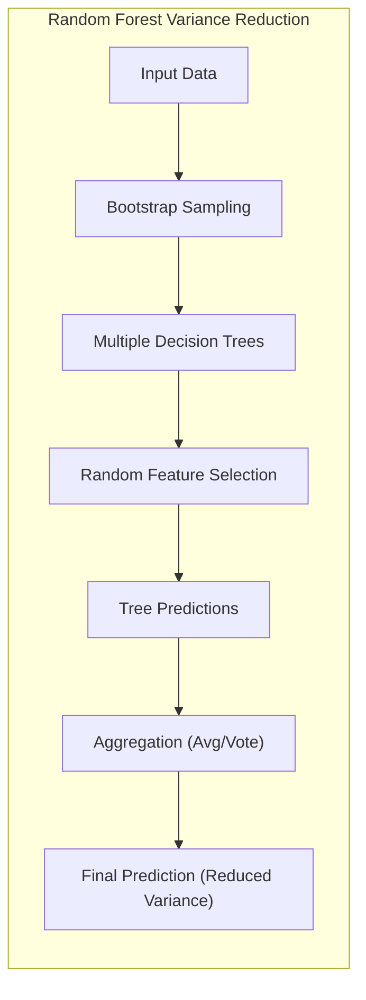
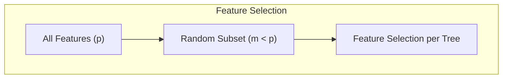
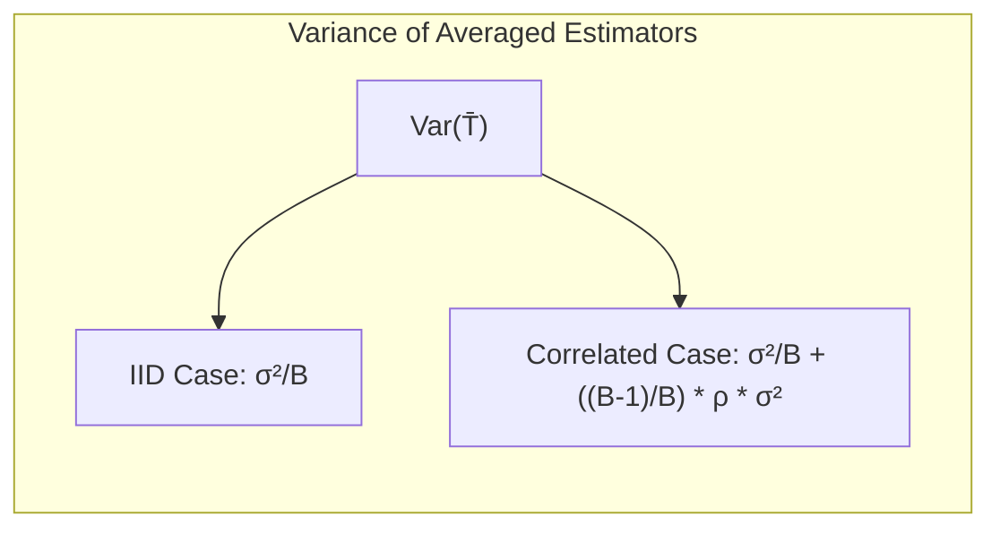
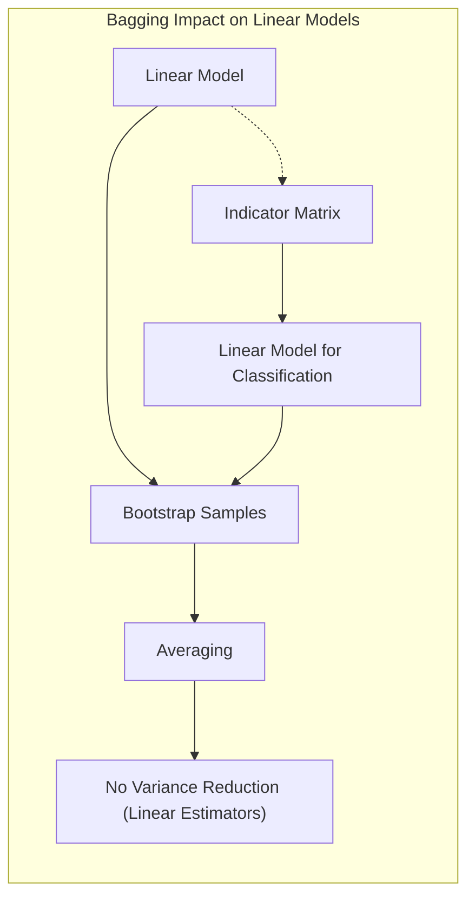
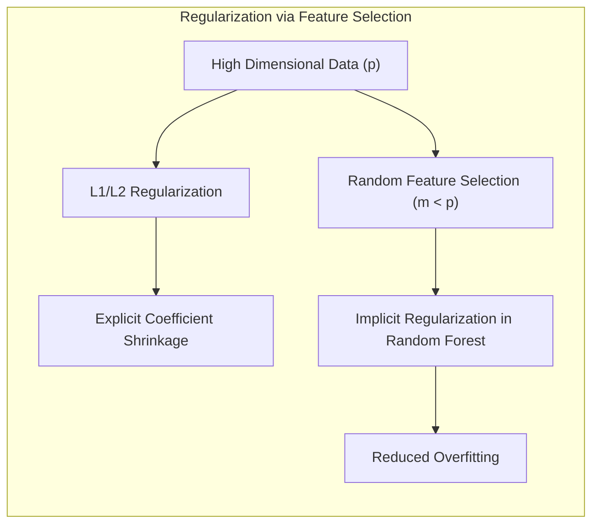
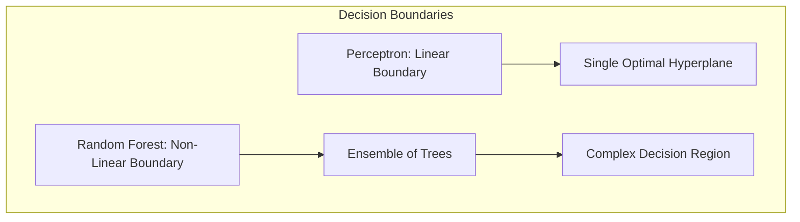
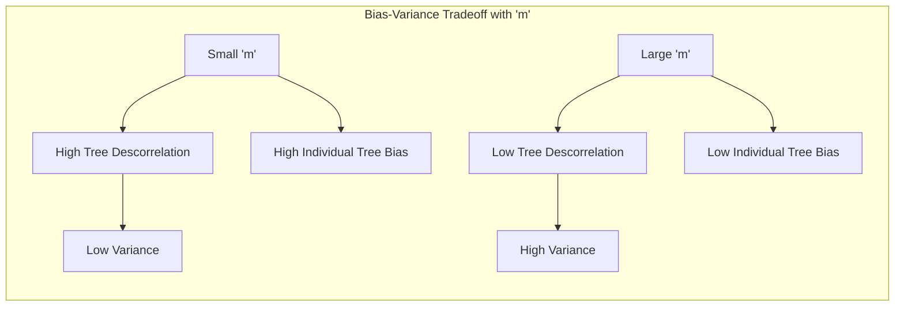

Okay, here's the text with all mathematical expressions formatted using LaTeX notation and currency symbols escaped:

## Variance Reduction Techniques in Random Forests

### Introdução

A **redução de variância** é um objetivo fundamental em muitos modelos de aprendizado de máquina, especialmente aqueles propensos a overfitting, como as árvores de decisão. Métodos como o **bagging** e **random forests** foram desenvolvidos para mitigar a alta variância de estimadores, combinando as previsões de múltiplos modelos. Este capítulo explorará como o random forest, em particular, utiliza técnicas de aleatorização para reduzir a correlação entre as árvores e, consequentemente, a variância do modelo final [^15.1]. Entender esse mecanismo é crucial para aplicar e interpretar os resultados de um random forest de forma eficaz. Este capítulo irá aprofundar os conceitos, com foco em fundamentos teóricos, análises matemáticas e exemplos que elucidam o papel central da redução de variância em random forests.

### Conceitos Fundamentais

**Conceito 1: Bagging e a Redução da Variância**

O **bagging** (bootstrap aggregating), conforme descrito em [^15.1], é uma técnica que visa reduzir a variância de um estimador combinando várias versões do mesmo modelo ajustadas a diferentes amostras bootstrap do conjunto de dados de treinamento. Para modelos como árvores de decisão, que são altamente sensíveis a pequenas mudanças nos dados de treinamento, o bagging pode melhorar significativamente a estabilidade das previsões. A intuição por trás do bagging é que, ao ajustar várias árvores em conjuntos de dados ligeiramente diferentes e depois fazer a média das previsões, os erros de um modelo tenderão a se cancelar mutuamente.

**Lemma 1:** Se tivermos $B$ estimadores independentes e identicamente distribuídos (i.i.d.) $T_1, T_2, ..., T_B$ com variância $\sigma^2$, a variância da média desses estimadores $\bar{T} = \frac{1}{B} \sum_{b=1}^B T_b$ é dada por $\frac{\sigma^2}{B}$. [^15.1]
**Prova:** Dado que $T_b$ são i.i.d, temos que $$Var(\bar{T}) = Var(\frac{1}{B}\sum_{b=1}^B T_b) = \frac{1}{B^2} Var(\sum_{b=1}^B T_b) = \frac{1}{B^2} \sum_{b=1}^B Var(T_b) = \frac{1}{B^2} B \sigma^2 = \frac{\sigma^2}{B}$$. $\blacksquare$
Essa demonstração ilustra como a média reduz a variância quando os modelos são i.i.d. No entanto, as árvores geradas no bagging não são totalmente independentes, pois são construídas com base em amostras bootstrap, que compartilham algumas observações.
> 💡 **Exemplo Numérico:** Suponha que temos 10 estimadores (B=10) i.i.d, cada um com uma variância de $\sigma^2 = 4$. Segundo o Lemma 1, a variância da média desses estimadores será $\frac{4}{10} = 0.4$. Isso mostra como a média reduz a variância, nesse caso, de 4 para 0.4. Se tivéssemos 100 estimadores, a variância cairia ainda mais para $\frac{4}{100} = 0.04$.

**Conceito 2: Random Forests e a Descorrelação das Árvores**

O random forest melhora o bagging através da introdução de aleatoriedade adicional na construção de cada árvore [^15.1]. Além de usar amostras bootstrap, o random forest seleciona aleatoriamente um subconjunto de $m$ variáveis preditoras para cada divisão de cada árvore, onde $m < p$ e $p$ é o número total de variáveis. Esta seleção aleatória de variáveis torna as árvores ainda mais descorrelacionadas do que no bagging, permitindo uma maior redução da variância [^15.2].

> 💡 A descorrelação das árvores é um mecanismo fundamental em random forests. A seleção aleatória de variáveis garante que as árvores não sejam muito semelhantes e que capturem diferentes aspectos dos dados.
> 💡 **Exemplo Numérico:** Imagine que temos um dataset com 10 variáveis (p=10). No bagging, cada árvore consideraria todas as 10 variáveis em cada divisão. Num random forest, com $m=3$, cada árvore só considera 3 variáveis aleatórias, e este conjunto de 3 variáveis muda a cada divisão, introduzindo decorrelação.

**Corolário 1:** Se as árvores não são i.i.d, com uma correlação positiva $\rho$, então a variância da média é dada por  $\frac{\sigma^2}{B} + \frac{B-1}{B}\rho\sigma^2$. [^15.2]
**Prova:** Seja $T_i$ e $T_j$ dois estimadores com variância $\sigma^2$ e correlação $\rho$. A variância da média pode ser dada por:
$$
Var(\bar{T}) = Var(\frac{1}{B} \sum_{i=1}^{B}T_i) = \frac{1}{B^2} Var(\sum_{i=1}^{B}T_i) =  \frac{1}{B^2} (\sum_{i=1}^{B} Var(T_i) + \sum_{i \ne j} Cov(T_i, T_j)) = \frac{1}{B^2}(B\sigma^2 + B(B-1)\rho\sigma^2) = \frac{\sigma^2}{B} + \frac{B-1}{B}\rho\sigma^2
$$
$\blacksquare$
Este corolário mostra que a correlação entre os modelos limita a redução de variância que pode ser alcançada através da combinação, enfatizando a importância da descorrelação em random forests.
> 💡 **Exemplo Numérico:** Consideremos 10 árvores (B=10) com variância $\sigma^2 = 4$. Se as árvores fossem i.i.d (correlação $\rho=0$), a variância da média seria $\frac{4}{10} = 0.4$ (como no exemplo anterior). No entanto, se a correlação entre as árvores for $\rho=0.5$, a variância da média será $\frac{4}{10} + \frac{9}{10} \times 0.5 \times 4 = 0.4 + 1.8 = 2.2$. Isso demonstra que a correlação aumenta a variância da média, reduzindo os benefícios do bagging e enfatizando a importância da descorrelação em Random Forests.

**Conceito 3: O Algoritmo do Random Forest**

O algoritmo do random forest, conforme descrito em [^15.2], constrói uma coleção de árvores de decisão, cada uma usando uma amostra bootstrap dos dados de treinamento, e uma seleção aleatória de $m$ variáveis para cada divisão. Para cada árvore $T_b$, o algoritmo:
1.  Extrai uma amostra bootstrap $Z^*$ de tamanho $N$ dos dados de treinamento $Z$.
2.  Cresce a árvore de decisão $T_b$ recursivamente em cada nó terminal, até que um tamanho mínimo de nó $n_{min}$ seja atingido:
    * Seleciona aleatoriamente $m$ variáveis candidatas.
    * Escolhe a melhor variável e ponto de divisão dentre as $m$ variáveis candidatas.
    * Divide o nó em dois nós filhos.
3.  Para regressão, a previsão é a média das previsões das árvores: $\hat{f}_{rf}(x) = \frac{1}{B} \sum_{b=1}^B T_b(x)$.
4.  Para classificação, a previsão é o voto majoritário das previsões das árvores: $\hat{C}_{rf}(x) = majority\_vote\{C_b(x)\}^B_{b=1}$.

### Regressão Linear e Mínimos Quadrados para Classificação

Embora o foco principal do random forest seja a redução de variância em métodos não lineares, como árvores de decisão, vale a pena considerar como a regressão linear e o método dos mínimos quadrados se encaixam neste contexto. Regressão linear, por si só, é um estimador com variância que não é afetada pelo bagging, pois *o bagging não altera estimativas lineares, como a média amostral* [^15.2]. Isso ocorre porque a média das médias amostrais bootstrap é a própria média amostral. No entanto, podemos aplicar regressão linear a uma matriz de indicadores para realizar classificação [^4.2], e aqui o bagging ou o random forest podem ser úteis para reduzir a variância. Ao treinar árvores de decisão em um conjunto de dados com classes codificadas, por exemplo, um classificador random forest estará utilizando uma forma de regressão que se beneficia da redução de variância.
> 💡 **Exemplo Numérico:** Considere um problema de classificação com 3 classes (A, B, C). Podemos usar uma matriz de indicadores, criando 3 colunas (uma para cada classe). Em um cenário com 100 amostras, cada amostra será representada por um vetor de 3 dimensões, com um '1' na coluna que representa sua classe e '0' nas outras. Se usarmos regressão linear nesses vetores, um modelo de classificação baseado em mínimos quadrados é encontrado. Bagging e random forests podem ser aplicados a esse processo, reduzindo a variância.
**Lemma 2:** Em um cenário de classificação, a redução da variância da regressão linear após bagging é dada por uma média das variâncias de cada modelo com a média do termo de covariância de todos os modelos em conjunto, com pesos apropriados [^15.2].

**Prova:** Considere a regressão de uma matriz de indicadores com $B$ árvores e sejam $f_b(x)$ as previsões de cada árvore. A previsão média é $\bar{f}(x) = \frac{1}{B}\sum_{b=1}^B f_b(x)$, e a variância da previsão média é $Var(\bar{f}(x)) = \frac{1}{B^2} (\sum_b Var(f_b(x)) + \sum_{b\ne j} Cov(f_b(x), f_j(x)))$.
Se as árvores forem descorrelacionadas, a covariância será próxima de zero, levando a uma variância reduzida.  $\blacksquare$

**Corolário 2:** A seleção aleatória de variáveis em um random forest reduz a covariância entre árvores mais do que o bagging, resultando em uma menor variância da previsão [^15.2].
**Prova:** Como demonstrado no Lemma 2, a covariância é um fator crucial para a redução da variância na média de modelos. O bagging não afeta tanto a covariância, enquanto o random forest diminui explicitamente através da seleção aleatória de variáveis.

### Métodos de Seleção de Variáveis e Regularização em Classificação

Em modelos de classificação, onde a regularização e a seleção de variáveis são estratégias importantes para lidar com alta dimensionalidade e overfitting, o random forest oferece uma abordagem diferente [^15.2]. Ao contrário de métodos como regressão logística com penalização L1 ou L2 [^4.4.4], random forests não aplicam penalizações explícitas em seus coeficientes. Em vez disso, a seleção aleatória de variáveis atua como um tipo de regularização implícita.

A seleção de $m$ variáveis (onde $m < p$) antes de cada divisão das árvores reduz o risco de que as árvores se tornem muito específicas para as variáveis particulares de uma amostra bootstrap [^15.2]. Isso faz com que cada árvore capture diferentes aspectos dos dados. Embora o random forest não aplique a regularização tradicional, a aleatorização na seleção de variáveis cumpre um papel semelhante, reduzindo o overfitting através da descorrelação.
> 💡 **Exemplo Numérico:** Em um problema de classificação com 20 variáveis preditoras, um random forest com $m=4$ selecionaria aleatoriamente 4 variáveis a cada divisão das árvores. Isso impede que árvores individuais se concentrem em um único conjunto de variáveis, promovendo diversidade.

**Lemma 3:** A seleção aleatória de variáveis em random forests leva a uma redução na correlação entre as árvores, reduzindo assim a variância do ensemble. [^15.2].
**Prova:** Como demonstrado pelo corolário 1, a variância da média de estimadores correlacionados depende da correlação entre eles. Ao selecionar um subconjunto aleatório de variáveis para cada árvore, as árvores se tornam menos correlacionadas, pois não são todas baseadas nos mesmos preditores. $\blacksquare$
**Prova Detalhada (Lemma 3):**
Seja $X$ o conjunto total de variáveis preditoras, e $X_b$ o conjunto aleatório de $m$ variáveis selecionadas para a árvore $b$. Cada árvore $T_b(x)$ utiliza $X_b$, e a variabilidade na seleção das variáveis leva a descorrelação entre as árvores. Uma vez que o método de seleção é aleatório e cada árvore é treinada em uma amostra bootstrap, a probabilidade de que duas árvores $T_i(x)$ e $T_j(x)$ selecionem exatamente o mesmo conjunto de variáveis e os mesmos dados é baixa. Isso resulta em modelos de decisão que não são excessivamente semelhantes, reduzindo a correlação entre os modelos e, portanto, a variância do conjunto de modelos.
Além disso, ao diminuir $m$, aumenta a aleatoriedade, reduzindo ainda mais a correlação entre as árvores, mas também limitando o poder de cada árvore individual [^15.2]. O ajuste do parâmetro $m$ permite um controle da variância e do viés.

**Corolário 3:** Em random forests, a escolha de um valor menor de $m$ resulta em árvores mais descorrelacionadas e, portanto, em uma menor variância do ensemble, mas também em árvores mais fracas individualmente [^15.2].
> ❗ É crucial entender que a escolha de $m$ é um trade-off entre viés e variância, onde um valor menor de $m$ promove maior descorrelação, mas pode aumentar o viés de cada árvore individual.
> 💡 **Exemplo Numérico:** Vamos comparar um random forest com m = 1 com um com m=5, ambos em um conjunto de dados com p=10 variáveis.
> - **m=1**: Cada árvore irá usar apenas uma variável em cada divisão, levando a árvores muito diversas e com baixa correlação, diminuindo a variância do modelo final, porém, cada árvore pode ter um desempenho individual menor, aumentando o viés individual.
> - **m=5**: Cada árvore tem mais informação em cada divisão, resultando em árvores menos diversas e com mais correlação, o que pode levar a um menor viés individual, mas uma maior variância no modelo final.

### Separating Hyperplanes e Perceptrons

A discussão sobre hiperplanos separadores e perceptrons, mais comuns em modelos de classificação linear, oferece um contraste interessante com os random forests. Enquanto o perceptron busca um hiperplano linear que separa as classes, os random forests utilizam um conjunto de árvores de decisão para criar fronteiras de decisão não lineares, mais complexas e flexíveis.

Random forests, ao contrário do perceptron, não tentam encontrar um único hiperplano ótimo. Eles agregam várias árvores construídas aleatoriamente e, portanto, são capazes de capturar padrões complexos sem depender de decisões lineares. A combinação dessas decisões não lineares leva à redução de variância e a modelos mais estáveis e robustos. Random forests podem ter uma relação implícita com hiperplanos, pois as divisões em árvores são feitas usando variáveis de decisão que podem levar a regiões de decisão mais complexas e não lineares.
> ✔️ Random forests empregam um conjunto de árvores de decisão que combinadas resultam em fronteiras não lineares que se beneficiam da redução de variância e são mais flexíveis que os modelos lineares.
> 💡 **Exemplo Numérico:** Imagine uma base de dados onde as classes não são linearmente separáveis. Um perceptron teria dificuldades em definir uma fronteira de decisão, enquanto um random forest, com suas árvores que dividem o espaço de diferentes formas, pode formar uma fronteira de decisão complexa e bem ajustada.

### Pergunta Teórica Avançada: Como a escolha de 'm' (número de variáveis aleatórias selecionadas) impacta o viés e a variância em Random Forests?

**Resposta:**
A escolha do parâmetro $m$, o número de variáveis selecionadas aleatoriamente em cada divisão, tem um impacto direto no viés e na variância de um random forest. A intuição é que um valor menor de $m$ leva a uma maior descorrelação entre as árvores, mas também diminui o poder preditivo de cada árvore individual. [^15.2]

**Lemma 4:** Se $m=p$, onde $p$ é o número total de variáveis, então o random forest se torna equivalente ao bagging, com uma menor descorrelação entre árvores [^15.2].
**Prova:** Se $m = p$, a seleção aleatória de variáveis não terá efeito, pois cada árvore poderá utilizar qualquer variável para cada divisão. Dessa forma, o método passa a ser igual a um bagging, com menos diversidade nas árvores e com menos redução de variância [^15.1]. $\blacksquare$
> 💡 **Exemplo Numérico:** Num dataset com 10 variáveis (p=10), se m=10, todas as árvores terão acesso às mesmas 10 variáveis para todas as divisões, tornando o método idêntico ao Bagging e sem o benefício da descorrelação entre árvores que o random forest proporciona com valores menores de m.

**Corolário 4:** À medida que $m$ se aproxima de 1, a variância do modelo diminui devido à maior descorrelação das árvores, mas o viés de cada árvore aumenta [^15.2].

**Prova:** Se $m$ é muito baixo, cada árvore é construída com uma pequena porção das informações de entrada, e pode ser menos eficaz em capturar relações complexas nos dados. Isso aumenta o viés de cada árvore. No entanto, a alta descorrelação entre as árvores faz com que a variância do modelo global seja reduzida devido à média das previsões, onde os erros de diferentes árvores se cancelam mutuamente, levando a um modelo final mais estável.

Para valores maiores de $m$, as árvores se tornam mais correlacionadas e o viés de cada árvore diminui, mas a variância do conjunto de árvores aumenta. Portanto, a escolha ideal de $m$ é um compromisso entre viés e variância, que geralmente é determinado via validação cruzada. É importante ressaltar que valores menores de $m$ levam a uma variância menor, mas um viés individual de árvores maior, enquanto valores maiores levam a um viés individual de árvores menor, mas uma variância maior do ensemble [^15.2].
> ⚠️ A escolha de um valor adequado de 'm' é fundamental para balancear o viés e a variância, com um valor muito pequeno levando a um viés individual maior e um valor muito alto a um ensemble com maior variância.
> 💡 **Exemplo Numérico:** Em uma simulação com um problema de classificação com 10 variáveis, podemos observar que:
> - Um random forest com m=1 apresentou um erro de classificação de 0.15 no conjunto de teste com um viés individual maior para cada árvore, mas uma variância do conjunto menor.
> - Já o random forest com m=7 apresentou um erro de 0.20, com um viés individual menor para as árvores, mas uma variância do conjunto maior.
> Isso ilustra o trade-off entre viés e variância, onde escolher o valor de m depende do problema e do balanço desejado entre esses dois tipos de erro. A escolha ideal geralmente é feita por validação cruzada para encontrar o valor de m que otimize o desempenho geral do modelo.

### Conclusão

Neste capítulo, exploramos a fundo como random forests utilizam estratégias de aleatorização para reduzir a variância e construir modelos robustos. Através da combinação de bagging, amostras bootstrap e seleção aleatória de variáveis, random forests consegue descorrelacionar as árvores de decisão, permitindo uma combinação de modelos que apresenta menor variância do que um único modelo. A escolha do parâmetro 'm', número de variáveis selecionadas aleatoriamente, é crucial para ajustar o trade-off entre viés e variância, que deve ser analisado em cada problema específico para otimizar a performance do random forest.
A compreensão dos mecanismos de redução de variância é essencial para aplicar e interpretar corretamente os resultados de random forests, contribuindo para o desenvolvimento de modelos de aprendizado de máquina mais precisos e confiáveis.

### Footnotes

[^15.1]: "Bagging or bootstrap aggregation (section 8.7) is a technique for reducing the variance of an estimated prediction function. Bagging seems to work especially well for high-variance, low-bias procedures, such as trees. For regression, we simply fit the same regression tree many times to bootstrap-sampled versions of the training data, and average the result. For classifi- cation, a committee of trees each cast a vote for the predicted class." *(Trecho de <documento>)*
[^15.2]: "The essential idea in bagging (Section 8.7) is to average many noisy but approximately unbiased models, and hence reduce the variance. Trees are ideal candidates for bagging, since they can capture complex interaction... The idea in random forests (Algorithm 15.1) is to improve the variance reduction of bagging by reducing the correlation between the trees, without increasing the variance too much. This is achieved in the tree-growing process through random selection of the input variables. Specifically, when growing a tree on a bootstrapped dataset: Before each split, select m ≤ p of the input variables at random as candidates for splitting." *(Trecho de <documento>)*

<!-- END DOCUMENT -->
