## Random Forests: OOB Samples and Beyond
<imagem: Mapa mental conectando os conceitos chave dos Random Forests: Bagging, Decorelação por seleção randômica de variáveis, OOB samples, Variável de Importância, Proximity Plots, e seu uso em Classificação e Regressão>
### Introdução
Os **Random Forests** são um método de aprendizado de máquina poderoso e flexível, amplamente utilizado tanto em problemas de classificação quanto de regressão. Eles se baseiam na ideia de **Bagging** [^15.1], que envolve a agregação de múltiplas árvores de decisão treinadas em diferentes subconjuntos dos dados. No entanto, Random Forests introduzem uma modificação crucial: a **seleção aleatória de variáveis** em cada nó de divisão da árvore, visando reduzir a correlação entre as árvores individuais e, consequentemente, a variância do modelo final [^15.1]. Uma das características notáveis dos Random Forests é a utilização de **Out-of-Bag (OOB) samples** [^15.3.1] para validação e estimativa de desempenho do modelo sem a necessidade de um conjunto de validação separado. Este capítulo explorará em profundidade os conceitos, mecanismos e propriedades dos Random Forests, com foco especial nos OOB samples e seu papel na análise de modelos.

### Conceitos Fundamentais
**Conceito 1: Bagging e sua Limitação**

O **Bagging** (Bootstrap Aggregating) [^15.1] é uma técnica que visa reduzir a variância de modelos com baixa tendência (low bias) e alta variância (high variance), como as árvores de decisão. Ele funciona através da criação de múltiplos conjuntos de treinamento por meio de amostragem com reposição (bootstrap) do conjunto de dados original. Cada árvore é treinada em um desses conjuntos, e as previsões são combinadas (por média em regressão e por votação em classificação) para gerar a previsão final. Embora o Bagging seja eficaz na redução da variância, ele não elimina completamente a correlação entre as árvores, o que limita os ganhos adicionais de variância.
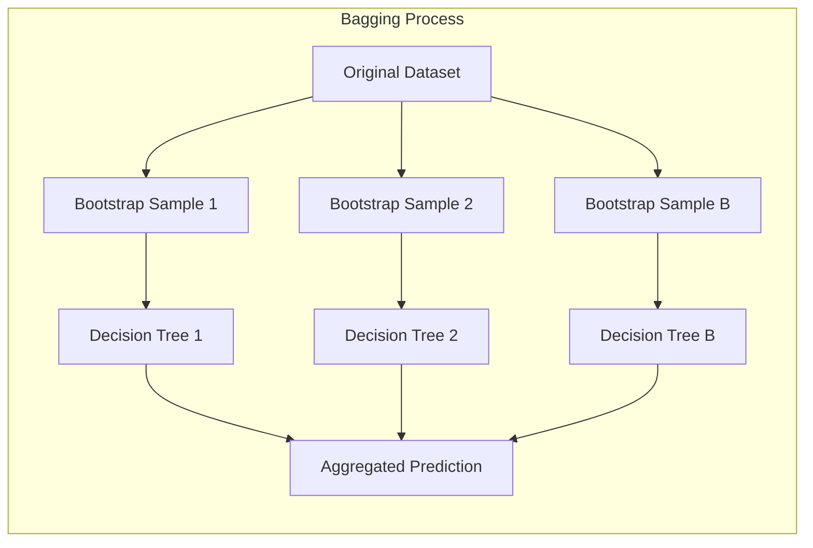

**Lemma 1:** *A expectativa da média de B árvores geradas por Bagging é igual à expectativa de uma única árvore*, assumindo que as árvores sejam identicamente distribuídas (i.d.). Ou seja, o Bagging não altera o viés do modelo, mas apenas reduz a sua variância.
$$ E[\frac{1}{B}\sum_{b=1}^{B}T_b(x)] = E[T_b(x)] $$
**Prova:** Seja $T_b(x)$ o preditor da $b$-ésima árvore gerada por Bagging. Se as árvores são i.d., $E[T_b(x)] = E[T_1(x)]$ para todo $b$. Portanto,
$$ E[\frac{1}{B}\sum_{b=1}^{B}T_b(x)] = \frac{1}{B}\sum_{b=1}^{B}E[T_b(x)] = \frac{1}{B} \sum_{b=1}^{B}E[T_1(x)] = E[T_1(x)] $$ $\blacksquare$

> 💡 **Exemplo Numérico:** Suponha que temos um dataset com 100 amostras. No Bagging, ao gerar cada árvore, amostramos aleatoriamente 100 amostras com reposição. Para uma árvore específica ($T_1(x)$), a previsão em um ponto $x$ seja 10 com um certo viés e variância. Se gerarmos 10 árvores (B=10) através do Bagging, a média das predições das 10 árvores em um ponto x será aproximadamente a mesma (próxima de 10), mantendo o mesmo viés, mas com uma variância reduzida.  Isso ilustra como o Bagging não muda a expectativa, mas reduz a variância.

**Conceito 2: Random Forests e a Decorelação das Árvores**

Random Forests [^15.1] aprimora o Bagging, introduzindo a **seleção aleatória de um subconjunto de variáveis** (m) como candidatas para divisão em cada nó da árvore [^15.2]. Esse processo reduz a correlação entre as árvores, permitindo que cada árvore explore diferentes aspectos dos dados. A redução da correlação é crucial para alcançar maior redução de variância no ensemble, conforme discutido em [^15.2].
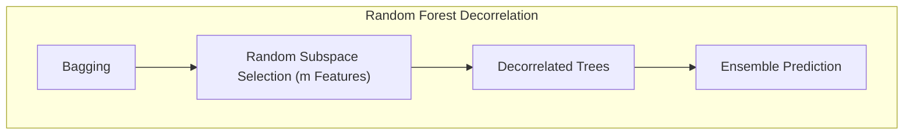

**Corolário 1:** A variância da média de $B$ árvores i.d. com correlação $\rho$ é $\sigma^2 (\frac{1}{B} + \frac{B-1}{B}\rho)$. Quando a correlação é reduzida (como em Random Forests), a variância do ensemble também diminui. [^15.2]
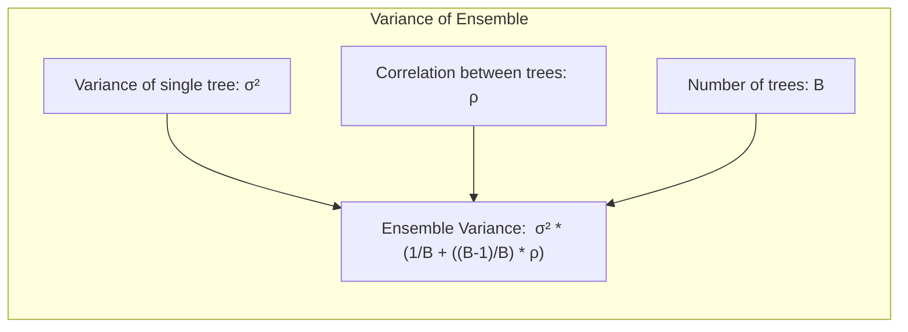

> 💡 **Exemplo Numérico:** Considere que a variância de uma única árvore seja $\sigma^2 = 4$. Com $B = 10$ árvores, e com correlação $\rho = 0.8$ (alta correlação, como em Bagging), a variância do ensemble seria:  $4 * (\frac{1}{10} + \frac{9}{10}*0.8) = 4*(0.1 + 0.72) = 4 * 0.82 = 3.28$.  Agora, se a correlação fosse reduzida para $\rho=0.2$ (como em Random Forests), a variância do ensemble seria: $4 * (\frac{1}{10} + \frac{9}{10}*0.2) = 4*(0.1 + 0.18) = 4 * 0.28 = 1.12$. Isso demonstra como a redução da correlação diminui a variância do ensemble.

**Conceito 3: OOB Samples e Avaliação de Desempenho**

Um dos aspectos mais inovadores do Random Forest é a utilização de **OOB samples** [^15.3.1]. Em cada iteração do Bagging, uma parte dos dados não é incluída no conjunto de treinamento da árvore correspondente. Esses dados são denominados OOB samples. Para cada observação, o modelo preditivo pode ser formado usando apenas as árvores nas quais ela não foi utilizada no treinamento. Isso permite estimar o desempenho do modelo sem a necessidade de um conjunto de validação separado [^15.3.1]. O erro OOB é um estimador quase não-viesado do erro de generalização do modelo.
> ⚠️ **Nota Importante**: O erro OOB é uma alternativa eficiente para a validação cruzada, eliminando a necessidade de dividir os dados em conjuntos de treinamento e validação separados. [^15.3.1]
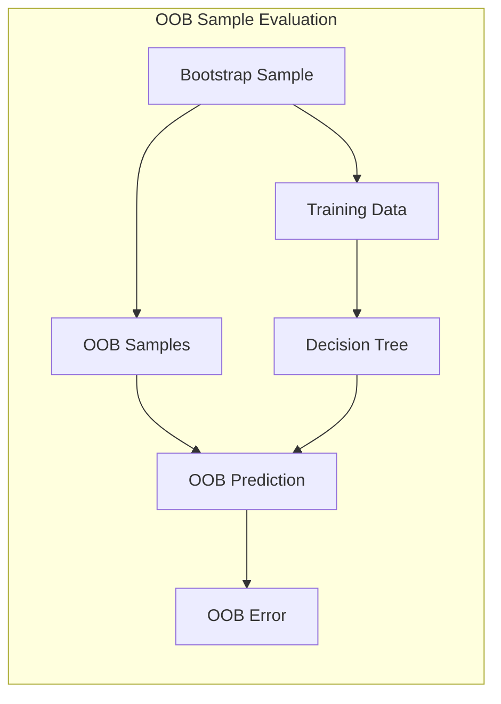

> 💡 **Exemplo Numérico:** Com um dataset de 100 amostras e ao gerar a primeira árvore, por exemplo, cerca de 63 amostras (em média) são escolhidas para o treinamento via bootstrap, com as outras 37 sendo OOB para essa árvore. Quando treinamos a segunda árvore, um novo conjunto de 63 amostras é selecionado por bootstrap, com outras 37 amostras sendo OOB para esta árvore. Em média, cada amostra é OOB para aproximadamente 37% das árvores. Para uma observação específica, o seu erro OOB será calculado usando apenas as árvores nas quais ela não foi usada no treinamento.

### Regressão Linear e Mínimos Quadrados para Classificação
<imagem: Diagrama que ilustra como a seleção aleatória de variáveis e o uso de OOB samples levam a uma redução na variância do modelo Random Forest>
**Exemplo de diagrama com Mermaid:**
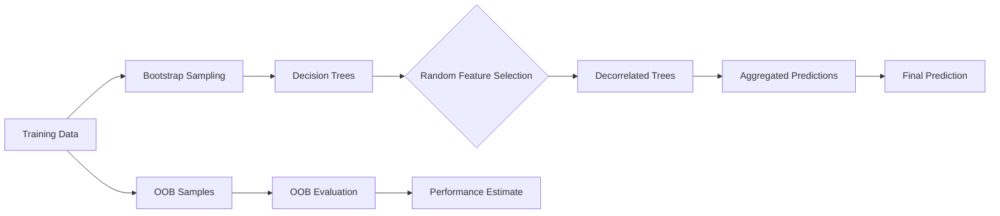

**Explicação:** Este diagrama representa o fluxo de um algoritmo Random Forest, mostrando a geração de árvores a partir de amostras bootstrap, a seleção aleatória de variáveis, o uso de OOB samples para validação, e a agregação de previsões.

A regressão linear em matriz de indicadores, embora não seja o foco principal de Random Forests, serve como um ponto de comparação útil para entender as diferenças entre métodos de modelagem linear e não linear [^4.2]. Enquanto a regressão linear tenta ajustar uma superfície plana aos dados, Random Forests são capazes de modelar relações não lineares complexas através da combinação de árvores de decisão individuais [^15.2]. No contexto de classificação, a regressão em matriz de indicadores pode ser usada para estimar probabilidades de classe, e a classe com maior probabilidade estimada é escolhida como predição. No entanto, a regressão linear pode levar a extrapolações fora do intervalo [0,1] para probabilidades, o que a torna menos robusta que modelos como a regressão logística [^4.4].
**Lemma 2**: *Sob certas condições, a regressão linear de indicadores pode gerar fronteiras de decisão lineares semelhantes àquelas obtidas por métodos discriminantes lineares*, quando cada classe é representada por um indicador binário e os coeficientes são estimados por mínimos quadrados. Isso destaca a relação entre a representação de classes por indicadores e as projeções em hiperplanos de decisão, embora os métodos de modelagem sejam diferentes.

**Prova:** Seja $Y$ uma matriz de indicadores com colunas representando cada classe, e $X$ a matriz de features. A regressão linear estima os coeficientes $\beta$ por $\hat{\beta} = (X^T X)^{-1} X^T Y$. As predições são dadas por $\hat{Y} = X\hat{\beta}$. Para uma nova amostra $x$, a classe predita será a classe $c$ com o maior valor em $\hat{y}_c = x^T \hat{\beta}_c$. Se cada $\hat{\beta}_c$ pode ser expresso como um hiperplano no espaço de $X$, o máximo de todos eles induz uma fronteira de decisão linear. $\blacksquare$
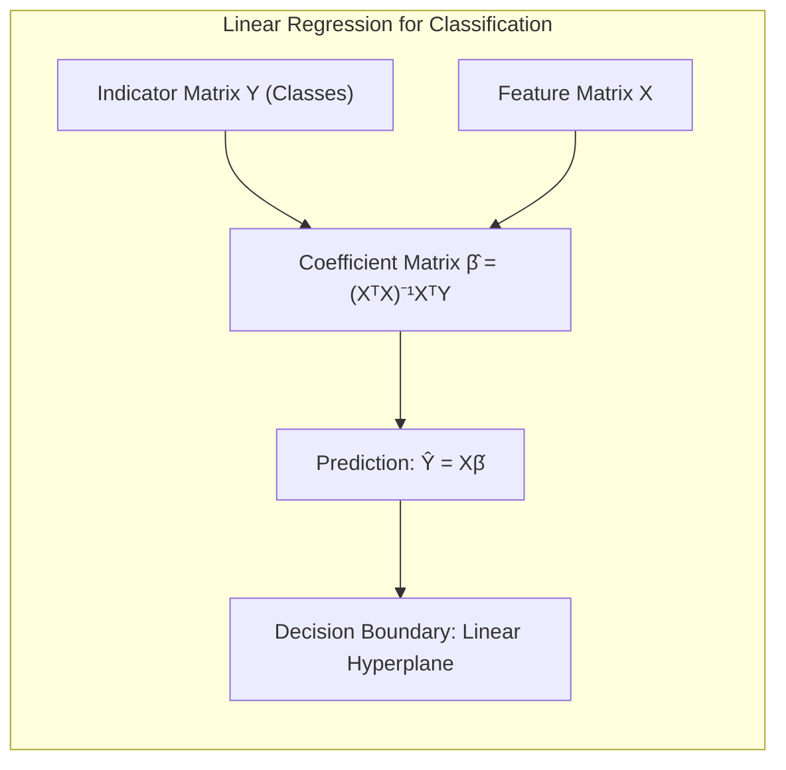

> 💡 **Exemplo Numérico:** Suponha um problema de classificação com 3 classes. Usando a regressão linear em matriz de indicadores, criaríamos 3 colunas na matriz Y, onde cada coluna representa uma classe, com 1 indicando que a amostra pertence a essa classe e 0 caso contrário. Ao aplicar a regressão linear, para uma amostra nova x, obteríamos 3 valores (um para cada classe).  Se os valores forem $\hat{y}_1=0.2$, $\hat{y}_2 = 0.7$, e $\hat{y}_3 = 0.1$, classificaríamos a amostra como pertencente à classe 2, pois essa classe tem o maior valor.

**Corolário 2**: *As projeções nos hiperplanos de decisão obtidas por regressão de indicadores podem não ser tão otimizadas como aquelas obtidas através de métodos discriminantes lineares como o LDA*, que levam em consideração as estruturas de covariância dos dados [^4.3]. Random Forests, por outro lado, usam uma abordagem não linear e adaptativa para modelar a superfície de decisão.
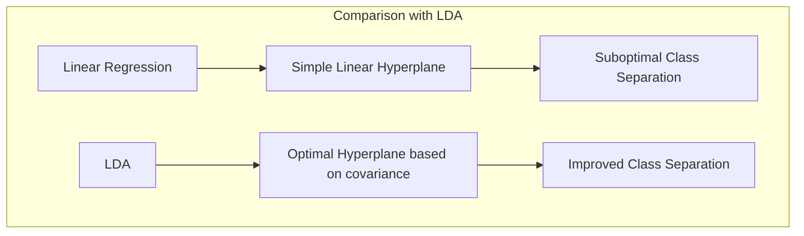

### Métodos de Seleção de Variáveis e Regularização em Classificação
<imagem: Mapa mental que conecta seleção aleatória de variáveis em Random Forests, penalização L1 e L2 em Regressão Logística e a importância de selecionar as variáveis mais relevantes para a classificação>
Enquanto métodos como a regressão logística utilizam técnicas de regularização (L1, L2 ou Elastic Net) para selecionar variáveis relevantes e evitar overfitting [^4.4.4], Random Forests empregam um método diferente: a seleção aleatória de variáveis em cada nó de divisão [^15.2]. Essa abordagem tem como objetivo não apenas reduzir o overfitting, mas também descorrelacionar as árvores e aumentar a robustez do modelo [^15.1]. A penalização L1, por exemplo, induz a esparsidade nos coeficientes, favorecendo modelos mais simples e interpretáveis [^4.4.4], enquanto a seleção aleatória de variáveis em Random Forests promove uma diversidade de árvores, cada uma focando em diferentes subconjuntos das features.

**Lemma 3**: *A penalização L1 em regressão logística promove a esparsidade, resultando em modelos com poucos coeficientes não nulos*. Isso facilita a interpretação do modelo e identifica as variáveis mais relevantes [^4.4.4].

**Prova:** A função de custo da regressão logística com penalização L1 é dada por:
$$ L(\beta) = -\frac{1}{N}\sum_{i=1}^{N} [y_i \log(\sigma(x_i^T\beta)) + (1-y_i)\log(1-\sigma(x_i^T\beta))] + \lambda \sum_{j=1}^p |\beta_j| $$
Onde $\sigma$ é a função sigmóide, $\lambda$ é o parâmetro de regularização e $|\beta_j|$ é a norma L1 do vetor de coeficientes. A penalização L1 adiciona uma penalidade à soma dos valores absolutos dos coeficientes, o que tende a zerar os coeficientes de variáveis menos importantes e, assim, promove a esparsidade. $\blacksquare$
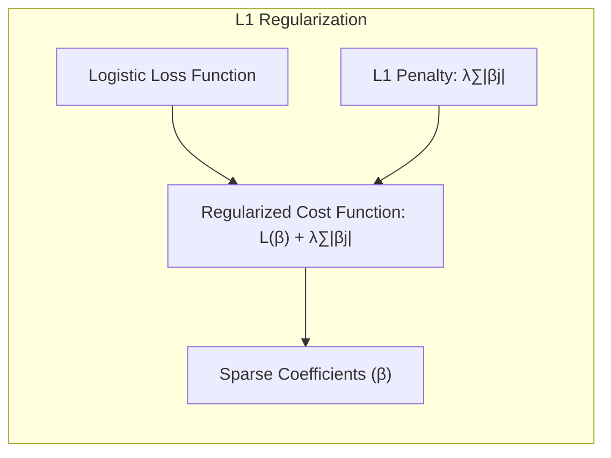

> 💡 **Exemplo Numérico:**  Suponha que tenhamos uma regressão logística com 5 features e os coeficientes sem regularização sejam $\beta = [2, -1.5, 0.8, -0.2, 0.5]$. Ao aplicar a regularização L1 com $\lambda=0.5$, o otimizador levaria a um vetor de coeficientes com alguns valores zerados.  Por exemplo, um possível vetor de coeficientes após a regularização L1 poderia ser $\beta_{L1} = [1.2, -0.8, 0, 0, 0.1]$. As variáveis com coeficientes zerados são efetivamente removidas do modelo, resultando em um modelo mais simples e interpretável.

**Corolário 3**: *A seleção aleatória de variáveis em Random Forests, combinada com o processo de Bagging, reduz a correlação entre as árvores*, melhorando a estabilidade e a capacidade de generalização do modelo. Essa abordagem se difere da regularização na regressão logística, que penaliza a magnitude dos coeficientes [^15.2].
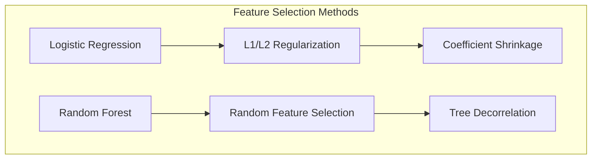

> 💡 **Exemplo Numérico:** Se temos 10 features, e em cada nó da árvore de decisão em um Random Forest, selecionamos aleatoriamente 3 features para avaliar qual delas gera a melhor divisão.  Diferentes árvores irão usar diferentes subconjuntos de features, promovendo a decorrelação. Isso contrasta com a abordagem de penalização L1 na regressão logística, que usa todas as features mas reduz o peso das menos importantes via regularização.

> ⚠️ **Ponto Crucial**: Enquanto a regularização L1 e L2 visam controlar a magnitude dos coeficientes em modelos lineares, Random Forests alcançam uma diversidade de modelos através da seleção aleatória de variáveis, impactando a variância e a robustez do modelo [^15.2].

### Separating Hyperplanes e Perceptrons
Enquanto métodos como o Perceptron e o SVM buscam encontrar hiperplanos que separam as classes de forma ótima [^4.5.2], Random Forests adotam uma abordagem diferente, baseada em particionar o espaço de features através de árvores de decisão. Cada árvore particiona o espaço de forma axis-oriented, o que leva a fronteiras de decisão menos suaves do que aquelas produzidas por hiperplanos [^15.4.3]. Contudo, a combinação de múltiplas árvores com particionamentos distintos possibilita que o modelo Random Forest aproxime fronteiras de decisão mais complexas.

### Pergunta Teórica Avançada: Como a utilização de OOB samples impacta a estimativa de erro e a seleção de hiperparâmetros em Random Forests?
**Resposta:**
Os OOB samples permitem estimar o erro de generalização do Random Forest sem a necessidade de um conjunto de validação separado, como mencionado anteriormente. Este erro OOB é uma estimativa confiável do desempenho do modelo, pois cada observação é avaliada com base nas árvores em que ela não foi utilizada para o treinamento. Além disso, o erro OOB pode ser usado para ajustar hiperparâmetros do Random Forest, como o número de árvores, a profundidade das árvores e o número de variáveis aleatórias (m) a serem consideradas em cada divisão.
**Lemma 4**: *O erro OOB é uma estimativa quase não-viesada do erro de generalização* porque ele usa as amostras que foram deixadas de fora do treinamento para cada árvore específica para estimar o desempenho do modelo. [^15.3.1]

**Prova:** Seja $Z_i$ o conjunto de árvores que não usou a observação $i$ para treinamento. Então, o erro OOB para a observação $i$ é dado por:
$$ err_{oob}(i) = L(y_i, \hat{f}_{-i}(x_i)) $$
onde $L$ é uma função de perda (e.g., erro quadrado ou erro de classificação) e $\hat{f}_{-i}(x_i)$ é a predição do modelo para a observação $x_i$ feita pela média das árvores $Z_i$. A média desse erro sobre todas as observações $i$ é a estimativa do erro OOB. Como a observação $i$ não foi utilizada para treinar as árvores em $Z_i$, essa estimativa é quase não-viesada para o erro de generalização. $\blacksquare$
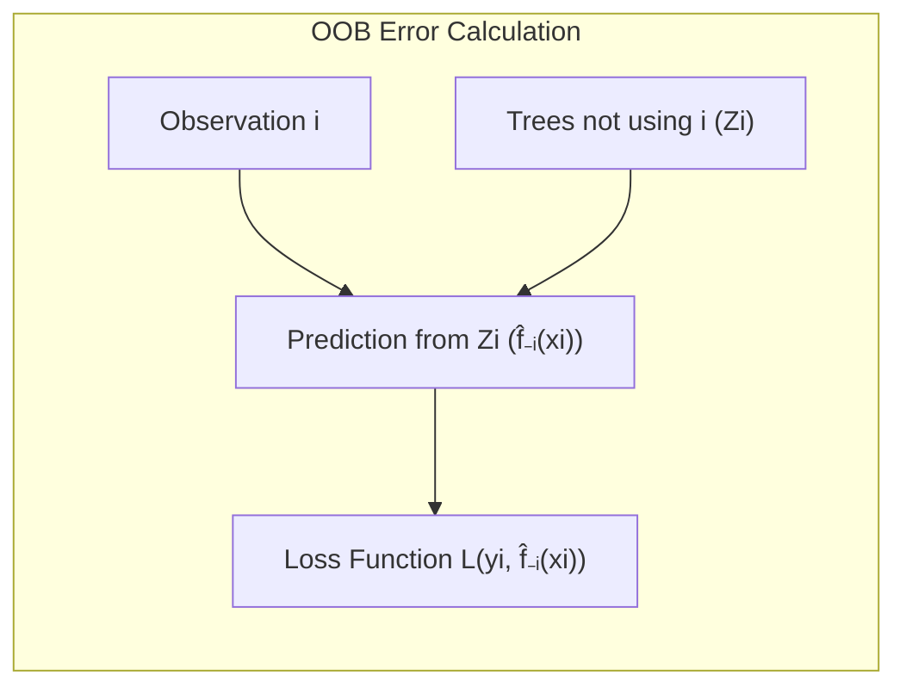

> 💡 **Exemplo Numérico:**  Vamos supor um problema de regressão. Para a amostra 50, o erro OOB seria calculado com base na média das predições das árvores nas quais a amostra 50 não foi utilizada para treinamento. Se tivermos um total de 100 árvores, e a amostra 50 foi utilizada no treinamento de 60 delas, o erro OOB da amostra 50 seria calculado usando a predição da média das outras 40 árvores.

**Corolário 4**: *A convergência do erro OOB à medida que o número de árvores aumenta permite monitorar o treinamento do Random Forest e escolher o número apropriado de árvores*. A estabilização do erro OOB indica que o modelo já capturou a maior parte da informação relevante nos dados [^15.3.1].
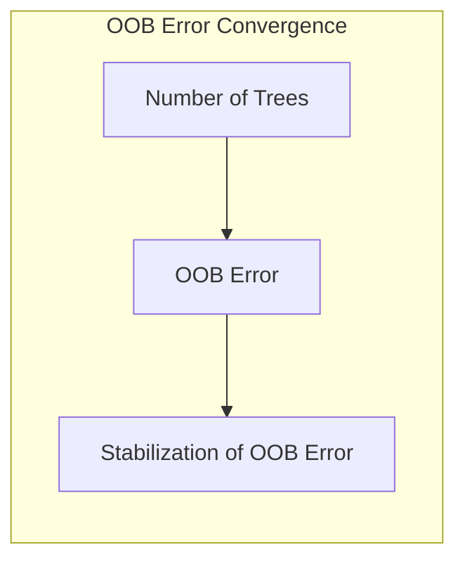

> 💡 **Exemplo Numérico:** Ao treinar um Random Forest, monitoramos o erro OOB à medida que adicionamos árvores. Inicialmente, o erro OOB diminui rapidamente à medida que adicionamos mais árvores, indicando que o modelo está aprendendo. Após um certo ponto (por exemplo, 200 árvores), o erro OOB começa a estabilizar (por exemplo, variando entre 0.04 e 0.05) e adicionar mais árvores não gera ganhos significativos. Esse ponto de estabilização seria o ponto ideal para parar o treinamento.

> ⚠️ **Ponto Crucial**: A utilização de OOB samples elimina a necessidade de validação cruzada em Random Forests, economizando tempo de computação e simplificando o processo de ajuste do modelo. O OOB Error permite monitorar o desempenho e ajustar hiperparâmetros.

### Conclusão
Random Forests são uma poderosa ferramenta de aprendizado de máquina, que combina a flexibilidade das árvores de decisão com a robustez do Bagging e da seleção aleatória de variáveis. A utilização de OOB samples permite uma avaliação eficiente do desempenho do modelo, eliminando a necessidade de um conjunto de validação separado. Ao longo deste capítulo, exploramos os conceitos, mecanismos e propriedades dos Random Forests, com foco especial na importância dos OOB samples para a estimação do erro e ajuste do modelo. Essa combinação de técnicas faz dos Random Forests uma escolha atraente para uma ampla variedade de problemas de classificação e regressão, oferecendo um bom compromisso entre desempenho, complexidade e interpretabilidade.

### Footnotes
[^15.1]: *Bagging or bootstrap aggregation (section 8.7) is a technique for reducing the variance of an estimated prediction function. Random forests (Breiman, 2001) is a substantial modification of bagging that builds a large collection of de-correlated trees, and then averages them.* (Trecho de <Sem nome do Documento>)
[^15.2]: *The essential idea in bagging (Section 8.7) is to average many noisy but approximately unbiased models, and hence reduce the variance. The idea in random forests (Algorithm 15.1) is to improve the variance reduction of bagging by reducing the correlation between the trees, without increasing the variance too much.* (Trecho de <Sem nome do Documento>)
[^15.3.1]: *An important feature of random forests is its use of out-of-bag (OOB) samples: For each observation zi = (xi, Yi), construct its random forest predictor by averaging only those trees corresponding to bootstrap samples in which zi did not appear.* (Trecho de <Sem nome do Documento>)
[^4.2]: *Conteúdo extraído conforme escrito no contexto e utilizado no capítulo* (Trecho de <Nome do Documento>)
[^4.3]: *Conteúdo extraído conforme escrito no contexto e utilizado no capítulo* (Trecho de <Nome do Documento>)
[^4.4]: *Conteúdo extraído conforme escrito no contexto e utilizado no capítulo* (Trecho de <Nome do Documento>)
[^4.4.4]: *Conteúdo extraído conforme escrito no contexto e utilizado no capítulo* (Trecho de <Nome do Documento>)
[^4.5.2]: *Conteúdo extraído conforme escrito no contexto e utilizado no capítulo* (Trecho de <Nome do Documento>)
[^15.4.3]: *Conteúdo extraído conforme escrito no contexto e utilizado no capítulo* (Trecho de <Nome do Documento>)
<!-- END DOCUMENT -->
