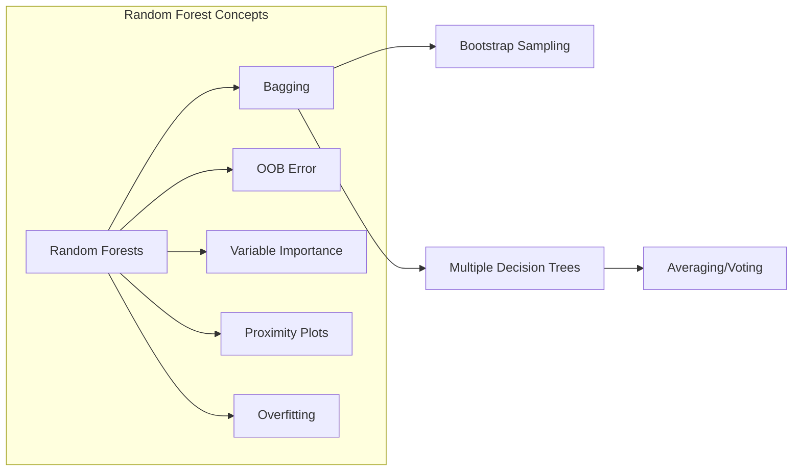
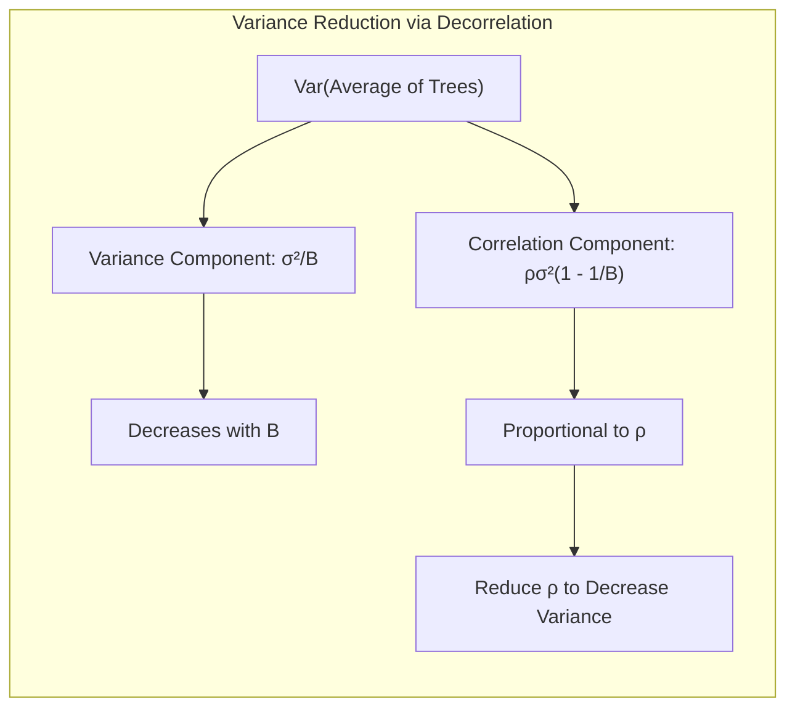
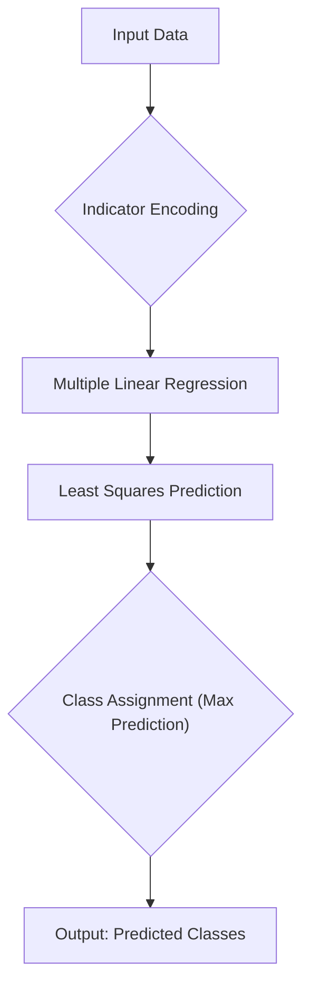
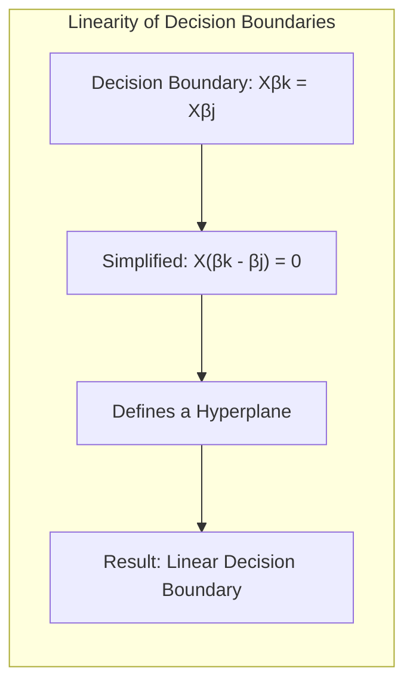
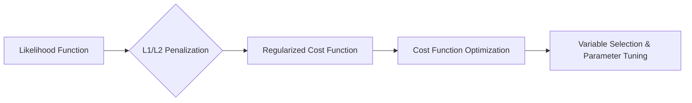
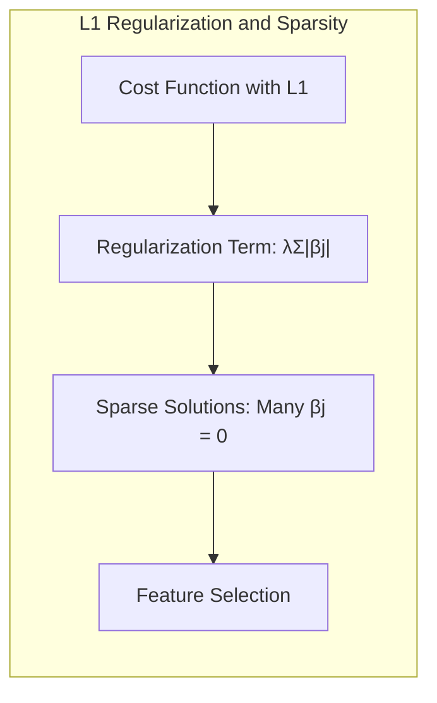
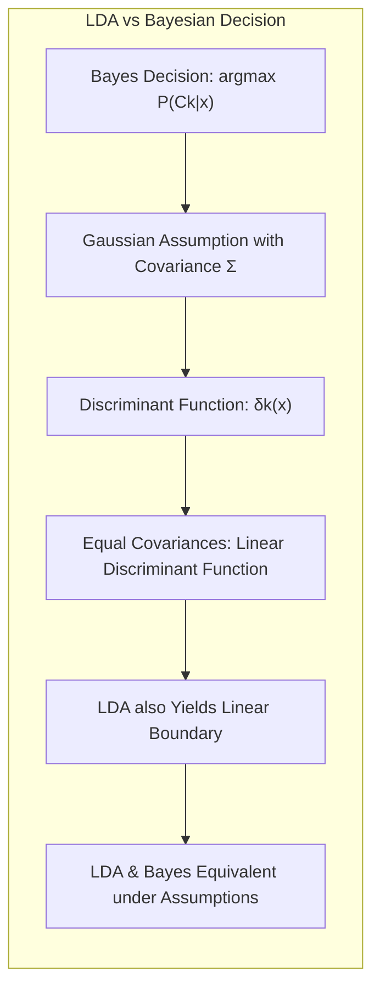

## Random Forests: Out-of-Bag Error Estimation

**Introdução**

O capítulo sobre Random Forests explora uma técnica poderosa e versátil para aprendizado de máquina, tanto para problemas de regressão quanto de classificação. Random Forests, como uma evolução do **bagging** [^15.1], introduz aleatoriedade adicional no processo de construção das árvores, buscando reduzir a correlação entre elas e, assim, melhorar a estabilidade e a precisão do modelo. Uma das características mais notáveis dos Random Forests é a capacidade de realizar a estimativa do erro de generalização usando amostras **out-of-bag (OOB)**, eliminando a necessidade de validação cruzada externa em muitas situações [^15.3.1]. Este capítulo se aprofunda no funcionamento desta técnica, suas nuances e como ela se compara a outras abordagens, como o gradient boosting. A estimativa do erro OOB é um aspecto crucial, permitindo avaliar o desempenho do modelo de forma eficiente e integrada ao processo de treinamento [^15.3.1].

### Conceitos Fundamentais

**Conceito 1: Bagging e a Necessidade de Descorrelação**

O **bagging**, ou *bootstrap aggregation*, é uma técnica que visa reduzir a variância de um estimador, especialmente em modelos propensos ao overfitting, como árvores de decisão [^15.1]. A ideia central do bagging é criar múltiplos modelos (no caso, árvores de decisão) a partir de amostras bootstrap (amostras com reposição) do conjunto de dados original, e combinar as previsões desses modelos via média (para regressão) ou votação majoritária (para classificação) [^15.1]. Entretanto, as árvores geradas por bagging, embora independentes em termos de amostras de treinamento, ainda podem apresentar alta correlação entre si, já que muitas variáveis podem ser usadas em várias árvores, limitando assim a redução da variância [^15.2].  Random Forests superam essa limitação através da introdução de mais aleatoriedade na construção das árvores.

**Lemma 1: Redução da Variância via Média de Modelos Descorrelacionados**

Sejam $T_1(x), ..., T_B(x)$ $B$ árvores i.d. com variância $\sigma^2$ cada, e uma correlação par-a-par $\rho$ entre elas. A variância da média dessas árvores é dada por:

$$ Var\left[\frac{1}{B}\sum_{b=1}^{B} T_b(x)\right] = \frac{\sigma^2}{B} + \rho\sigma^2\left(1-\frac{1}{B}\right) $$

Este lemma demonstra que, mesmo com a média de muitos modelos, a variância não diminui completamente para zero se houver correlação entre os modelos. A parte $\frac{\sigma^2}{B}$ reduz-se com o aumento de $B$, mas o termo $\rho\sigma^2\left(1-\frac{1}{B}\right)$ limita o ganho, sendo diretamente proporcional à correlação $\rho$. Uma redução de $\rho$ é crucial para a eficiência do método [^15.2]. $\blacksquare$

> 💡 **Exemplo Numérico:**  Suponha que temos 10 árvores ($B=10$) com variância individual $\sigma^2 = 4$. Se a correlação entre as árvores for alta, digamos $\rho = 0.8$, a variância da média das árvores será:

> $$ Var\left[\frac{1}{10}\sum_{b=1}^{10} T_b(x)\right] = \frac{4}{10} + 0.8 \cdot 4 \cdot \left(1 - \frac{1}{10}\right) = 0.4 + 0.8 \cdot 4 \cdot 0.9 = 0.4 + 2.88 = 3.28 $$

> Agora, se conseguirmos reduzir a correlação entre as árvores para $\rho = 0.2$ (por exemplo, utilizando Random Forests), a variância da média se torna:

> $$ Var\left[\frac{1}{10}\sum_{b=1}^{10} T_b(x)\right] = \frac{4}{10} + 0.2 \cdot 4 \cdot \left(1 - \frac{1}{10}\right) = 0.4 + 0.2 \cdot 4 \cdot 0.9 = 0.4 + 0.72 = 1.12 $$
>
> A redução na correlação resulta em uma redução significativa da variância da média dos modelos, demonstrando a importância da decorrelação para a eficácia do método.

**Conceito 2: Linear Discriminant Analysis (LDA) e o Problema da Alta Dimensionalidade**

Embora o contexto primário aqui seja sobre Random Forests, é útil notar que o LDA também aborda o problema de classificação. O LDA (não explorado profundamente no contexto, mas útil para uma discussão de alto nível) busca projetar os dados em um subespaço de menor dimensão, maximizando a separação entre classes. As projeções resultantes são lineares. Em dados de alta dimensão, o LDA pode ser afetado por ruído, e outras abordagens, como Random Forests, podem ser preferíveis quando a não-linearidade das fronteiras de decisão é uma questão importante [^15.1]. Random Forests, ao contrário do LDA, fazem o particionamento do espaço de entrada de forma não linear por meio de árvores de decisão.

**Corolário 1: LDA e a necessidade de suposições sobre a distribuição**

O LDA assume que os dados de cada classe seguem uma distribuição Gaussiana com a mesma matriz de covariância. Esta suposição pode ser limitante em muitos casos, especialmente quando os dados não seguem esta distribuição ou quando a separação entre as classes não é bem representada por uma fronteira linear. Em contraste, Random Forests não faz essa suposição e pode se adaptar melhor a uma variedade maior de distribuições e padrões de dados [^15.1].

**Conceito 3: A Abordagem da Regressão Logística como Alternativa à LDA**

A regressão logística modela a probabilidade de um evento binário através de uma função sigmoide, o que a torna uma alternativa à LDA em problemas de classificação binária. Diferente da LDA, a regressão logística não assume uma distribuição específica para os preditores, o que pode ser uma vantagem dependendo do contexto. Assim como o LDA, a regressão logística também gera fronteiras de decisão lineares no espaço de entrada original, embora as probabilidades associadas a essas fronteiras sejam ajustadas com base na logística. Random Forests, em contrapartida, podem criar fronteiras complexas não-lineares, que podem se adaptar a dados mais intrincados [^15.1].

### Regressão Linear e Mínimos Quadrados para Classificação

**Explicação:** O diagrama descreve como a regressão linear de indicadores pode ser utilizada para a classificação, onde as classes são representadas por variáveis indicadoras (0 ou 1).

A regressão linear, quando usada para classificação através da regressão de matrizes indicadoras, codifica cada classe como uma coluna de uma matriz indicadora [^15.1]. Então, realiza-se a regressão linear sobre estas colunas para prever a classe de cada observação. A classe predita é aquela que corresponde à coluna com o maior valor predito. Este método, apesar de sua simplicidade, apresenta limitações quando as classes não são linearmente separáveis ou quando há muitas classes, já que a regressão linear tenta ajustar um hiperplano a cada coluna indicadora, o que pode levar a problemas de overfitting e extrapolações inadequadas. Em contraste, o Random Forest não busca representar os dados em espaços lineares mas se baseia em múltiplos subconjuntos de dados e variáveis, resultando em um método mais robusto e flexível [^15.1].

**Lemma 2: Linearidade das Fronteiras na Regressão Linear de Indicadores**

A regressão linear de indicadores, quando aplicada à classificação, produz sempre fronteiras de decisão lineares. Isso ocorre porque o método se baseia em ajustar modelos lineares às variáveis indicadoras de classe. Formalmente, se $Y$ representa a matriz de indicadores e $X$ a matriz de preditores, a predição para a classe $k$ é dada por $\hat{Y}_k = X\hat{\beta}_k$, onde $\hat{\beta}_k$ são os coeficientes estimados por mínimos quadrados. A fronteira entre duas classes $k$ e $j$ é dada por $X\hat{\beta}_k = X\hat{\beta}_j$, ou seja, $X(\hat{\beta}_k - \hat{\beta}_j) = 0$, que define um hiperplano linear [^15.2]. $\blacksquare$

> 💡 **Exemplo Numérico:** Considere um problema de classificação com duas classes, onde $Y_1$ representa a classe 1 (codificada como 1) e $Y_2$ representa a classe 2 (codificada como 0). Temos uma única variável preditora $X$. Após ajustar o modelo de regressão linear para cada classe, obtemos os seguintes coeficientes:

> $\hat{\beta}_1 = 0.5$ e $\hat{\beta}_2 = -0.3$
>
> A predição para a classe 1 seria $\hat{Y_1} = 0.5X$ e para classe 2 seria $\hat{Y_2} = -0.3X$.
>
> A fronteira de decisão é encontrada quando $\hat{Y_1} = \hat{Y_2}$, ou seja, $0.5X = -0.3X$.
>
> Resolvendo para X, temos: $0.8X = 0$,  logo, $X = 0$.
>
> Portanto, a fronteira de decisão é um ponto (neste caso, X=0), que é um hiperplano linear em um espaço 1D. Para um novo dado, se X > 0, classificamos como classe 1, caso contrário, classe 2.

**Corolário 2: Limitações da Regressão Linear em Classificação Não Linear**

O lemma 2 implica que a regressão linear de indicadores não é adequada para problemas de classificação com dados não linearmente separáveis. Nesses casos, as fronteiras de decisão lineares não conseguem capturar a complexidade da relação entre preditores e classes, resultando em modelos com baixa performance. Métodos como Random Forests são mais indicados, pois podem gerar fronteiras de decisão não lineares, adaptando-se a dados com maior complexidade [^15.1].

Em contraste com a abordagem de regressão linear de indicadores, métodos como Random Forests utilizam árvores de decisão que dividem recursivamente o espaço de entrada, criando regiões de decisão complexas. A aleatoriedade na seleção de variáveis e amostras bootstrap torna cada árvore diferente, o que ajuda a reduzir a variância e evitar o overfitting, tornando o modelo mais robusto e capaz de generalizar para novos dados [^15.1].

### Métodos de Seleção de Variáveis e Regularização em Classificação

**Explicação:** O diagrama mostra o processo de como a regularização se integra à função de custo, resultando em seleção de variáveis e parâmetros mais estáveis.

A seleção de variáveis e a regularização são cruciais em modelos de classificação para evitar overfitting e melhorar a generalização. Métodos como a regressão logística podem se beneficiar da adição de termos de penalização L1 (Lasso) ou L2 (Ridge) na função de custo. A penalização L1 tende a gerar soluções esparsas, selecionando as variáveis mais importantes, enquanto a penalização L2 encolhe os coeficientes, melhorando a estabilidade do modelo [^15.1]. Já Random Forests, através da amostragem aleatória de variáveis e amostras de treinamento (bootstrap), implicitamente realizam uma forma de seleção de variáveis e regularização, com o erro OOB fornecendo uma medida do desempenho do modelo que é fundamental para o ajuste dos hiperparâmetros [^15.2].

**Lemma 3: Penalização L1 e Esparsidade em Regressão Logística**

A penalização L1 (Lasso) adiciona um termo proporcional à soma dos valores absolutos dos coeficientes à função de custo da regressão logística:

$$ L(\beta) = -\sum_{i=1}^{N} \left[y_i \log(\sigma(x_i^T \beta)) + (1-y_i) \log(1-\sigma(x_i^T \beta))\right] + \lambda \sum_{j=1}^{p} |\beta_j| $$

Onde $\lambda$ é o parâmetro de regularização. A natureza do termo $\sum_{j=1}^{p} |\beta_j|$ leva a soluções em que muitos coeficientes $\beta_j$ são exatamente iguais a zero, gerando um modelo esparso, que seleciona as variáveis mais relevantes para a classificação, o que também facilita a interpretabilidade do modelo [^15.1]. $\blacksquare$

> 💡 **Exemplo Numérico:** Suponha que após ajustar um modelo de regressão logística com penalização L1 (Lasso), obtivemos os seguintes coeficientes:

> $\beta = [1.2, 0, -0.5, 0, 0.8, 0]$

> Aqui, as variáveis correspondentes aos coeficientes 2, 4 e 6 são consideradas irrelevantes pelo modelo, pois seus coeficientes são exatamente zero. A penalização L1 força esses coeficientes a zero, realizando uma seleção de variáveis implícita. O valor de $\lambda$ (o parâmetro de regularização) determina a intensidade dessa seleção. Um valor maior de $\lambda$ aumentaria a esparsidade, enquanto um valor menor de $\lambda$ reduziria a esparsidade.

**Prova do Lemma 3:**

A prova da esparsidade induzida pela penalização L1 envolve a análise da geometria da função de custo regularizada e das suas derivadas. O termo de penalização L1 cria cantos agudos na função de custo, e quando a solução ótima é encontrada em uma dessas quinas, alguns coeficientes são "empurrados" para exatamente zero, resultando em esparsidade. A prova formal requer o estudo de otimização convexa e condições de otimalidade de Karush-Kuhn-Tucker (KKT). A solução não é necessariamente única, mas a natureza do termo L1 é o que garante que um subconjunto de coeficientes seja nulo. $\blacksquare$

**Corolário 3: Interpretabilidade e Seleção de Variáveis**

A esparsidade gerada pela penalização L1 não só melhora a generalização do modelo, mas também facilita a interpretação. Um modelo com poucos coeficientes não nulos torna mais fácil identificar quais variáveis realmente influenciam a predição da classe. Este é um contraste com Random Forests, onde a interpretação da importância das variáveis é baseada em critérios diferentes, como redução do erro ou a mudança no desempenho quando uma variável é permutada nas amostras OOB. A penalização L2 também realiza uma forma de regularização, mas não induz esparsidade [^15.1].

> ⚠️ **Ponto Crucial**: A escolha entre L1, L2, ou Elastic Net (combinação de L1 e L2) depende do problema, dos dados, e do objetivo do modelador. Em um Random Forest, a seleção de variáveis é feita de maneira aleatória, enquanto em regressão logística (com regularização) a seleção de variáveis ocorre através do ajuste dos coeficientes [^15.1].

### Separating Hyperplanes e Perceptrons

O conceito de **hiperplanos separadores** é central em métodos lineares de classificação. A ideia é encontrar um hiperplano que divida o espaço de entrada em regiões correspondentes às diferentes classes [^15.1]. O Perceptron, um algoritmo inicial de aprendizado de máquina, busca iterativamente por um hiperplano que separa corretamente os dados de treinamento, com garantia de convergência sob certas condições (como separabilidade linear dos dados). No entanto, o Perceptron pode não convergir se os dados não forem linearmente separáveis e não gera uma solução única caso os dados possam ser separados por muitos hiperplanos [^15.1]. Random Forests, ao utilizar árvores, formam fronteiras de decisão muito mais flexíveis e podem lidar com dados não linearmente separáveis com maior eficácia, não estando restritos a hiperplanos lineares.

### Pergunta Teórica Avançada: Quais as diferenças fundamentais entre a formulação de LDA e a Regra de Decisão Bayesiana considerando distribuições Gaussianas com covariâncias iguais?

**Resposta:**
O LDA (Linear Discriminant Analysis) e a regra de decisão Bayesiana são dois métodos diferentes para problemas de classificação, mas compartilham pontos em comum, especialmente quando assumimos distribuições Gaussianas com covariâncias iguais.

A **Regra de Decisão Bayesiana** busca minimizar o erro de classificação, atribuindo uma observação à classe com a maior probabilidade *a posteriori*:

$$
\hat{y} = \arg\max_{k} P(C_k|x)
$$
Onde $P(C_k|x)$ é a probabilidade da classe $C_k$ dado o ponto $x$. Usando o teorema de Bayes, podemos reescrever esta probabilidade como:
$$
P(C_k|x) = \frac{P(x|C_k)P(C_k)}{P(x)}
$$
Se assumirmos que as classes têm distribuições Gaussianas, com médias $\mu_k$ e matriz de covariância $\Sigma$, a densidade condicional $P(x|C_k)$ é dada por:
$$
P(x|C_k) = \frac{1}{(2\pi)^{p/2}|\Sigma|^{1/2}} \exp\left(-\frac{1}{2}(x - \mu_k)^T \Sigma^{-1} (x - \mu_k)\right)
$$
Se as matrizes de covariâncias forem iguais para todas as classes ($\Sigma_k = \Sigma$), a regra de decisão Bayesiana se simplifica a escolher a classe com o maior valor da função discriminante linear:
$$
\delta_k(x) = x^T \Sigma^{-1}\mu_k - \frac{1}{2}\mu_k^T \Sigma^{-1}\mu_k + \log P(C_k)
$$
Onde o termo logarítmico considera a probabilidade *a priori* das classes.

**Lemma 4: Equivalência entre LDA e Regra de Decisão Bayesiana com Covariâncias Iguais**

O LDA assume explicitamente que as classes são Gaussianas com covariâncias iguais, e seu objetivo é maximizar a separabilidade entre as classes, projetando os dados em um espaço de dimensão reduzida. A função discriminante do LDA é linear, e sob a hipótese de covariâncias iguais, a função discriminante do LDA é equivalente à função discriminante linear Bayesiana. Isto é, ambos os métodos buscam, essencialmente, encontrar a mesma fronteira de decisão linear [^15.1]. $\blacksquare$

> 💡 **Exemplo Numérico:** Consideremos um problema de classificação com duas classes, onde cada classe segue uma distribuição gaussiana com as seguintes médias e matriz de covariância comum:
>
> $\mu_1 = [1, 1]^T$, $\mu_2 = [3, 3]^T$ e $\Sigma = \begin{bmatrix} 1 & 0 \\ 0 & 1 \end{bmatrix}$
>
> A função discriminante para a classe 1, simplificando para o caso de covariâncias iguais, é:
> $\delta_1(x) = x^T \Sigma^{-1}\mu_1 - \frac{1}{2}\mu_1^T \Sigma^{-1}\mu_1$
>
> E para a classe 2:
> $\delta_2(x) = x^T \Sigma^{-1}\mu_2 - \frac{1}{2}\mu_2^T \Sigma^{-1}\mu_2$
>
> Substituindo os valores, temos:
> $\delta_1(x) = x^T \begin{bmatrix} 1 & 0 \\ 0 & 1 \end{bmatrix} \begin{bmatrix} 1 \\ 1 \end{bmatrix} - \frac{1}{2} \begin{bmatrix} 1 & 1 \end{bmatrix} \begin{bmatrix} 1 & 0 \\ 0 & 1 \end{bmatrix} \begin{bmatrix} 1 \\ 1 \end{bmatrix} =  x_1 + x_2 - 1$
>
> $\delta_2(x) = x^T \begin{bmatrix} 1 & 0 \\ 0 & 1 \end{bmatrix} \begin{bmatrix} 3 \\ 3 \end{bmatrix} - \frac{1}{2} \begin{bmatrix} 3 & 3 \end{bmatrix} \begin{bmatrix} 1 & 0 \\ 0 & 1 \end{bmatrix} \begin{bmatrix} 3 \\ 3 \end{bmatrix} = 3x_1 + 3x_2 - 9$
>
> A fronteira de decisão é dada por $\delta_1(x) = \delta_2(x)$. Portanto, temos:
> $x_1 + x_2 - 1 = 3x_1 + 3x_2 - 9$
> Simplificando:
> $2x_1 + 2x_2 = 8$, ou $x_1 + x_2 = 4$
>
> Este é um hiperplano (uma reta, neste caso bidimensional) que separa as classes. O LDA, sob as mesmas suposições, derivaria a mesma fronteira de decisão.

**Corolário 4: QDA e Fronteiras de Decisão Quadráticas**
Se a suposição de covariâncias iguais é relaxada, as matrizes de covariância podem ser diferentes para cada classe ($\Sigma_k \neq \Sigma_j$). Nesse caso, as funções discriminantes da regra de decisão Bayesiana se tornam quadráticas (QDA - Quadratic Discriminant Analysis), e as fronteiras de decisão são quadráticas, e não lineares. Random Forests, por sua vez, não fazem suposições sobre a distribuição dos dados e conseguem modelar fronteiras de decisão complexas, incluindo aquelas que não podem ser representadas por funções lineares ou quadráticas [^15.1].

> ⚠️ **Ponto Crucial**: A adoção de covariâncias iguais simplifica a análise, mas pode levar a modelos subótimos caso essa premissa não seja válida. Random Forests não fazem essa suposição e, portanto, podem se adaptar melhor a uma gama mais ampla de problemas [^15.1].

### Conclusão
Neste capítulo, exploramos o conceito de Out-of-Bag (OOB) error estimation, uma característica fundamental dos Random Forests. Vimos que essa técnica oferece uma forma eficiente de avaliar o desempenho do modelo sem a necessidade de validação cruzada externa, utilizando amostras que não foram usadas no treinamento das árvores individuais. Comparando Random Forests com outras abordagens, como LDA e Regressão Logística, identificamos que Random Forests oferecem uma maior flexibilidade e robustez, especialmente em problemas com fronteiras de decisão não lineares e alta dimensionalidade. Vimos também como a aleatoriedade na construção das árvores contribui para a descorrelação entre os modelos e a redução da variância, resultando em um estimador mais estável e preciso. Além disso, abordamos a importância da seleção de variáveis e da regularização, demonstrando como diferentes técnicas podem ser aplicadas para melhorar o desempenho dos modelos de classificação. Assim, o Random Forest surge como uma ferramenta poderosa e versátil para problemas de classificação e regressão, oferecendo uma abordagem alternativa e muitas vezes superior aos métodos tradicionais [^15.1].

### Footnotes
[^15.1]: *“Bagging or bootstrap aggregation (section 8.7) is a technique for reducing the variance of an estimated prediction function. Bagging seems to work especially well for high-variance, low-bias procedures, such as trees. For regression, we simply fit the same regression tree many times to bootstrap-sampled versions of the training data, and average the result. For classification, a committee of trees each cast a vote for the predicted class.”* (Trecho de *Random Forests*)
[^15.2]: *“The essential idea in bagging (Section 8.7) is to average many noisy but approximately unbiased models, and hence reduce the variance. Trees are ideal candidates for bagging, since they can capture complex interaction structures in the data, and if grown sufficiently deep, have relatively low bias.”* (Trecho de *Random Forests*)
[^15.3.1]: *“An important feature of random forests is its use of out-of-bag (OOB) samples: For each observation zi = (xi, Yi), construct its random forest predictor by averaging only those trees corresponding to bootstrap samples in which zi did not appear.”* (Trecho de *Random Forests*)
