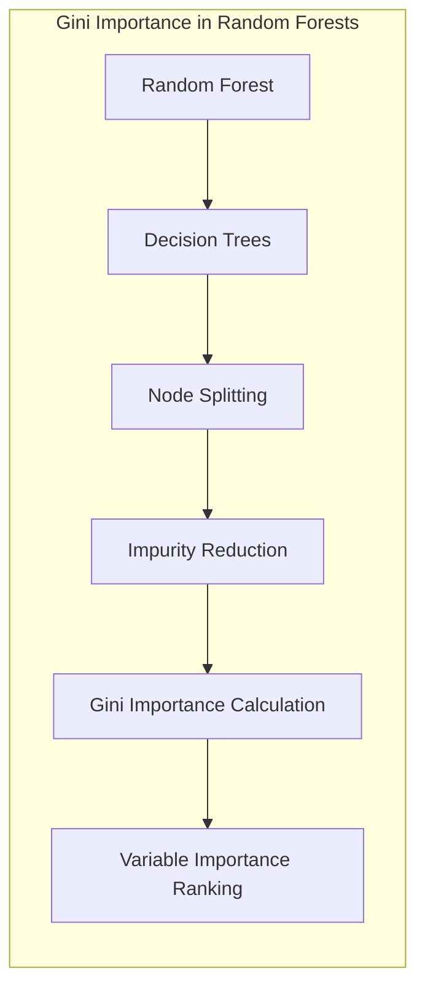
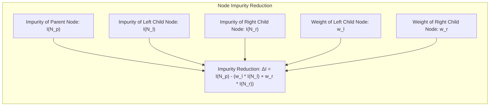
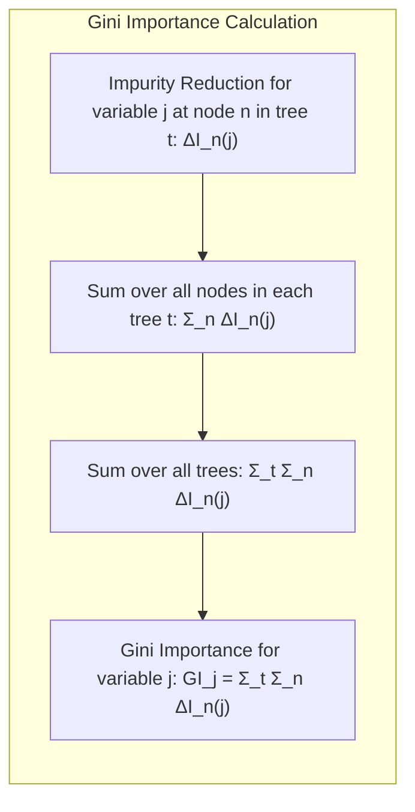
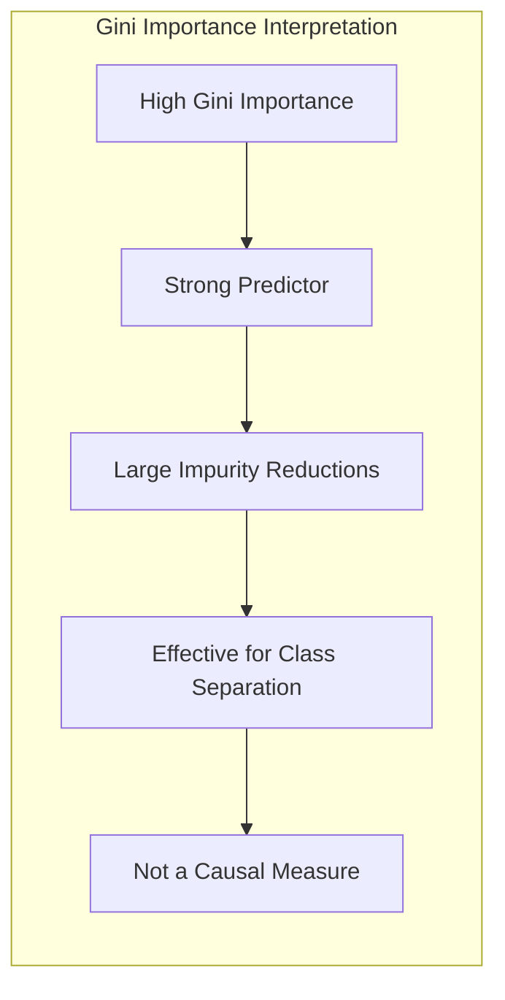
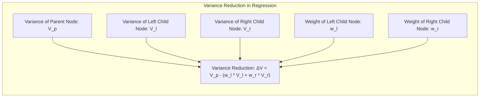
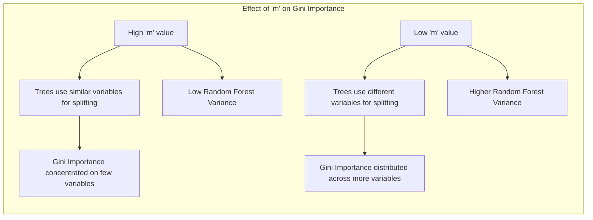

Okay, here's the enhanced text with all mathematical expressions formatted using LaTeX notation, adhering to all the guidelines:

## Gini Importance: Decifrando a Contribuição das Variáveis na Divisão de Nós em Random Forests

### Introdução

O **Gini Importance**, também conhecido como *Mean Decrease Impurity*, é uma métrica crucial para entender a influência das variáveis preditoras na construção de árvores de decisão, especialmente dentro do contexto de **Random Forests** [^15.2]. Em essência, essa medida quantifica quanto cada variável contribui para a redução da impureza, ou heterogeneidade, nos nós de divisão das árvores de decisão. Ao acumular essas reduções ao longo de todas as árvores na floresta, podemos avaliar a importância geral de cada variável no modelo [^15.3.2]. Este capítulo irá explorar o cálculo do Gini Importance, sua interpretação e suas aplicações práticas.

### Conceitos Fundamentais

**Conceito 1: Impureza do Nó (Node Impurity)**

A **impureza do nó** é uma medida de quão "misturadas" estão as classes ou quão variável é a resposta em um determinado nó de uma árvore de decisão [^15.2]. Para classificação, o índice de Gini é uma métrica comum usada para medir a impureza, enquanto a variância é usada para regressão. O objetivo da divisão de nós é reduzir a impureza em cada nó filho em relação ao seu nó pai. O Gini importance captura o quanto cada variável contribui para esta redução.

**Lemma 1:** *A redução na impureza de um nó após a divisão em dois nós filhos é dada pela diferença entre a impureza do nó pai e a soma ponderada das impurezas dos nós filhos.* Se $I(N_p)$ for a impureza do nó pai, e $I(N_l)$ e $I(N_r)$ forem as impurezas dos nós filhos esquerdo e direito, respectivamente, e $w_l$ e $w_r$ forem os pesos relativos dos dois nós filhos, então a redução de impureza $\Delta I$ pode ser escrita como:
$$
\Delta I = I(N_p) - (w_l I(N_l) + w_r I(N_r))
$$
onde $w_l = \frac{\text{número de amostras em } N_l}{\text{número de amostras em } N_p}$ e $w_r = \frac{\text{número de amostras em } N_r}{\text{número de amostras em } N_p}$. O Gini importance agrega estes valores em todas as árvores da Random Forest. $\blacksquare$

> 💡 **Exemplo Numérico:**
> Vamos considerar um nó pai $N_p$ com 10 amostras, onde 6 são da classe A e 4 são da classe B. O índice de Gini para este nó é:
> $I(N_p) = 1 - ((\frac{6}{10})^2 + (\frac{4}{10})^2) = 1 - (0.36 + 0.16) = 0.48$
> Suponha que uma divisão resulte em um nó filho esquerdo $N_l$ com 4 amostras (todas da classe A) e um nó filho direito $N_r$ com 6 amostras (2 da classe A e 4 da classe B).
> A impureza dos nós filhos será:
> $I(N_l) = 1 - ((\frac{4}{4})^2 + (\frac{0}{4})^2) = 1 - (1 + 0) = 0$
> $I(N_r) = 1 - ((\frac{2}{6})^2 + (\frac{4}{6})^2) = 1 - (\frac{4}{36} + \frac{16}{36}) = 1 - \frac{20}{36} = \frac{16}{36} \approx 0.44$
> Os pesos dos nós filhos são:
> $w_l = \frac{4}{10} = 0.4$ e $w_r = \frac{6}{10} = 0.6$
> A redução na impureza será:
> $\Delta I = 0.48 - (0.4 * 0 + 0.6 * 0.44) = 0.48 - 0.264 = 0.216$.
> Este valor de 0.216 representa a contribuição da variável usada para realizar a divisão neste nó específico, na redução da impureza.

**Conceito 2: Cálculo do Gini Importance**

Para calcular o Gini importance de uma variável, acumulamos a redução na impureza em cada divisão na árvore onde essa variável é usada [^15.3.2]. Para cada árvore na Random Forest, a importância da variável $j$ é calculada como:
$$
GI_j = \sum_{t \in \text{árvores}} \sum_{n \in \text{nós}} \Delta I_n(j)
$$
onde $\Delta I_n(j)$ é a redução na impureza causada pela variável $j$ no nó $n$ da árvore $t$. Se a variável $j$ não for usada para dividir um nó em uma árvore, sua contribuição é zero para este nó. O Gini Importance é então a média dessas importâncias sobre todas as árvores. A soma das importâncias dividida pelo número de árvores é uma métrica de importância da variável.

> 💡 **Exemplo Numérico:**
>  Suponha que temos uma Random Forest com 3 árvores e estamos avaliando a importância de duas variáveis, X1 e X2.
>  - Árvore 1: X1 é usada em 2 nós com reduções de impureza de 0.1 e 0.2 respectivamente, e X2 em 1 nó com redução de 0.05.
>  - Árvore 2: X1 é usada em 1 nó com redução de 0.15 e X2 em 2 nós com reduções de 0.1 e 0.08.
>  - Árvore 3: X1 não é usada, e X2 é usada em 3 nós com reduções de 0.07, 0.09, e 0.11.
>  Os Gini Importances para cada árvore são:
>  - GI_X1(Árvore 1) = 0.1 + 0.2 = 0.3, GI_X2(Árvore 1) = 0.05
>  - GI_X1(Árvore 2) = 0.15, GI_X2(Árvore 2) = 0.1 + 0.08 = 0.18
>  - GI_X1(Árvore 3) = 0, GI_X2(Árvore 3) = 0.07 + 0.09 + 0.11 = 0.27
>  O Gini Importance total para cada variável é:
>  - GI_X1 = (0.3 + 0.15 + 0) = 0.45
>  - GI_X2 = (0.05 + 0.18 + 0.27) = 0.50
>  Finalmente, a média do Gini Importance para cada variável é:
>  - GI_X1\_media = 0.45 / 3 = 0.15
>  - GI_X2\_media = 0.50 / 3 = 0.1667
> Portanto, a variável X2 tem um Gini Importance ligeiramente maior que X1, indicando que, em média, contribuiu mais para a redução da impureza na floresta.

**Corolário 1:** *A soma das importâncias de todas as variáveis em uma única árvore é a redução total na impureza naquela árvore.* Isto implica que o Gini Importance não é uma medida de importância relativa, mas sim absoluta da contribuição da variável na redução da impureza.

**Conceito 3: Interpretação do Gini Importance**

O Gini importance é uma medida de **contribuição marginal** de uma variável na redução da impureza dos nós. Uma variável com alto Gini importance é uma forte preditora porque resulta em grandes reduções na impureza, sugerindo que ela é eficaz para separar as classes ou reduzir a variabilidade da resposta [^15.3.2]. No entanto, é crucial entender que o Gini Importance não mede a importância de uma variável em termos causais; ele apenas quantifica sua capacidade de contribuir para a divisão de nós, conforme discutido em [^15.3.2].

> ⚠️ **Nota Importante**: É fundamental entender que o Gini importance favorece variáveis com alta cardinalidade ou alta frequência, pois estas variáveis tendem a ter um maior potencial de separar dados e, consequentemente, reduzir a impureza, como indicado em [^15.3.2].

### Regressão Linear e Mínimos Quadrados para Classificação

Em Random Forests, a regressão linear e mínimos quadrados (least squares) não são diretamente utilizados para divisão de nós, mas o conceito de impureza (variância) desempenha um papel semelhante ao do índice de Gini em classificação. A ideia central é que a divisão em nós minimiza a variância dentro de cada nó, usando uma abordagem de regressão.

**Lemma 2:** *A redução na variância, análoga à redução na impureza, pode ser definida para nós em modelos de regressão.* Para um nó pai com variância $V_p$, que é dividido em dois nós filhos com variâncias $V_l$ e $V_r$, a redução na variância é dada por:
$$
\Delta V = V_p - (w_l V_l + w_r V_r)
$$
onde $w_l$ e $w_r$ são os pesos relativos dos nós filhos. A importância de uma variável é baseada na média ponderada destas reduções em todas as árvores. $\blacksquare$

> 💡 **Exemplo Numérico:**
> Suponha que temos um nó pai $N_p$ com 8 amostras, e a variância da variável resposta neste nó é $V_p = 10$. Após uma divisão, temos um nó filho esquerdo $N_l$ com 3 amostras e variância $V_l = 2$, e um nó filho direito $N_r$ com 5 amostras e variância $V_r = 6$.
> Os pesos dos nós filhos são:
> $w_l = \frac{3}{8} = 0.375$ e $w_r = \frac{5}{8} = 0.625$
> A redução na variância é:
> $\Delta V = 10 - (0.375 * 2 + 0.625 * 6) = 10 - (0.75 + 3.75) = 10 - 4.5 = 5.5$
> Este valor de 5.5 representa a contribuição da variável usada para realizar a divisão neste nó específico, na redução da variância.

**Corolário 2:** Em regressão, variáveis com alto Gini Importance (medida pela redução de variância) são aquelas que melhor conseguem dividir os dados em subconjuntos homogêneos em relação à variável resposta. Em termos práticos, este tipo de variável é considerada mais “importante” na previsão da variável alvo.

### Métodos de Seleção de Variáveis e Regularização em Classificação

Embora o Gini importance seja uma medida de importância das variáveis, ele não é um método de seleção de variáveis no sentido de que não é usado para pré-selecionar ou remover variáveis antes do treinamento da random forest. Ao contrário, o Gini importance é derivado dos dados e do modelo em si. A regularização, como a penalização L1 ou L2, pode ser aplicada durante o treinamento de cada árvore, mas não afeta diretamente a forma como o Gini importance é calculado e interpretado. No entanto, se um modelo com regularização for utilizado como parte da construção de uma Random Forest (o que não é o caso clássico), então a penalização L1 ou L2 irá gerar um diferente Gini importance, devido à diferença no processo de decisão de divisões.

> ❗ **Ponto de Atenção**: A regularização pode ajudar a tornar as árvores individuais menos sensíveis a variações nos dados, o que pode, por sua vez, afetar as importâncias derivadas. O Gini importance ainda quantificará a contribuição das variáveis na redução da impureza/variância, mas o contexto (presença ou ausência de regularização) pode influenciar na interpretação.

### Separating Hyperplanes e Perceptrons

A noção de Gini Importance não se aplica diretamente ao contexto de **separating hyperplanes** ou **perceptrons**. Estes métodos trabalham com a separação de classes através de funções lineares ou planos, enquanto o Gini Importance está associado com a divisão de nós em árvores de decisão. Embora seja possível projetar dados de alta dimensão em subespaços usando PCA, o Gini Importance não é uma ferramenta usada para determinar a contribuição de variáveis nesse contexto.

### Pergunta Teórica Avançada: Como o número de variáveis selecionadas aleatoriamente (m) afeta o Gini Importance e a correlação entre as árvores na random forest?

**Resposta:**

A seleção aleatória de $m$ variáveis em cada divisão de nó, conforme descrito em [^15.2], é um mecanismo crucial para descorrelacionar as árvores em um random forest. Ao reduzir $m$, a probabilidade de que árvores construídas com diferentes amostras de bootstrap (bagging) utilizem as mesmas variáveis em divisões similares diminui. Esta descorrelação afeta diretamente o cálculo e a interpretação do Gini Importance.

**Lemma 3:** *A redução de $m$ leva a um Gini Importance mais espalhado entre as variáveis*. Em um cenário onde o número de variáveis importantes é pequeno em relação ao número total de variáveis, um valor alto de $m$ pode fazer com que as árvores utilizem as mesmas variáveis para dividir os nós, diminuindo a variância da Random Forest, mas também levando a um Gini Importance concentrado em poucas variáveis. Ao reduzir $m$, a importância é distribuída por mais variáveis, destacando variáveis menos importantes que, de outra forma, seriam ignoradas devido à predominância de algumas poucas variáveis. $\blacksquare$

**Corolário 3:** Como a redução de $m$ diminui a correlação entre árvores [^15.2], o Gini Importance derivado de cada árvore passa a refletir contribuições mais únicas de cada variável, resultando em uma medida que melhor reflete as nuances da influência de cada variável na redução de impureza na floresta como um todo.

### Conclusão

O Gini Importance é uma métrica fundamental para entender o funcionamento interno de **Random Forests**, e é crucial para a análise de dados, permitindo-nos identificar as variáveis que melhor predizem o outcome. A escolha de parâmetros, como o número de variáveis aleatórias ($m$) e outros parâmetros de modelagem como regularização (quando aplicável), podem influenciar nos resultados de importância. O Gini importance é um poderoso instrumento para a análise exploratória de dados e para a construção de modelos mais robustos. O Gini Importance deve ser usado em conjunto com outras ferramentas de análise e interpretação para garantir uma compreensão abrangente do modelo.
<!-- END DOCUMENT -->
### Footnotes
[^15.2]: "The essential idea in bagging (Section 8.7) is to average many noisy but approximately unbiased models, and hence reduce the variance. Trees are ideal candidates for bagging, since they can capture complex interaction structures in the data, and if grown sufficiently deep, have relatively low bias." *(Trecho de Random Forests)*
[^15.3.2]: "Variable importance plots can be constructed for random forests in exactly the same way as they were for gradient-boosted models (Section 10.13). At each split in each tree, the improvement in the split-criterion is the importance measure attributed to the splitting variable, and is accumulated over all the trees in the forest separately for each variable." *(Trecho de Random Forests)*
